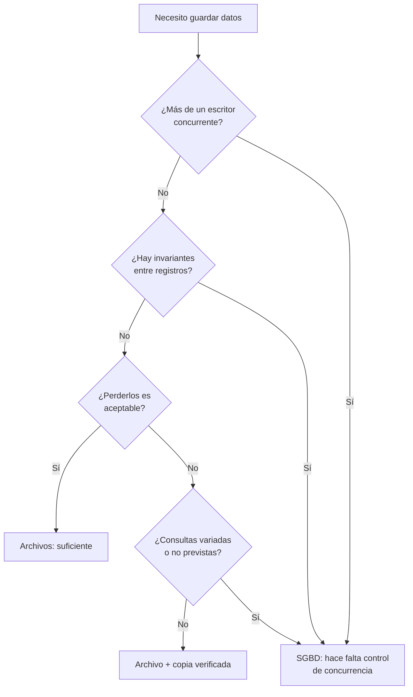

# 001 — Qué resuelve un sistema de bases de datos y qué no

> [Programa](../../../README.md) · [Parte 00](../README.md) · [Siguiente →](../../part-00-fundamentos-datos-sistemas-y-metodo/002-arquitectura-interna-de-un-gestor/README.md)

Parte 00 — Fundamentos, sistemas y método · Fundamentos ·
3 horas estimadas · motores `sqlite` · laboratorio
[`labs/01-sql-foundations`](../../../labs/01-sql-foundations/README.md) · 4 fuentes.

**Conceptos centrales:** `persistencia` · `concurrencia` · `integridad` · `recuperación` · `independencia de datos`

**En este caso se comparan 9 motores**: 7 lo resuelven (6 con el resultado comprobado por máquina) y 2 no, con el motivo escrito.

---

## Propósito

Establecer qué problemas concretos resuelve un sistema gestor de bases de datos (SGBD) y, sobre todo, cuáles **no** resuelve. Sin esa demarcación, cualquier archivo con datos se llama «base de datos» y cualquier fallo de diseño se atribuye al motor.

## Resultados de aprendizaje

Al terminar podrás:

1. Enumerar los seis problemas del almacenamiento en archivos planos que motivaron la aparición de los SGBD.
2. Reproducir una anomalía de actualización perdida y explicar por qué el sistema de archivos no la impide.
3. Distinguir lo que el motor **garantiza** de lo que solo **permite declarar**.
4. Justificar cuándo *no* usar un SGBD, con un criterio distinto de «es lo que se usa siempre».
5. Nombrar la fuente de cada afirmación anterior.

## Fundamentos

### El problema que existía antes

Silberschatz, Korth y Sudarshan abren *Database System Concepts* con la lista de defectos del enfoque «un archivo por aplicación». No es historia: cada uno reaparece cuando alguien decide guardar el estado en JSON y arreglarlo después.

| Defecto | Qué ocurre en la práctica |
|---|---|
| Redundancia e inconsistencia | El mismo dato vive en dos archivos y divergen |
| Dificultad de acceso | Cada consulta nueva exige escribir un programa nuevo |
| Aislamiento de datos | Formatos distintos impiden combinar información |
| Problemas de integridad | La regla «el saldo no puede ser negativo» vive en el código, no en el dato |
| Problemas de atomicidad | Una caída a mitad de una transferencia deja el dinero en ninguna parte |
| Anomalías de concurrencia | Dos procesos escriben a la vez y uno de los cambios desaparece |
| Problemas de seguridad | No hay forma de dar acceso parcial: o se ve el archivo entero o nada |

### Lo que un SGBD aporta

Un gestor no es «un lugar donde guardar tablas». Es un programa que ofrece cuatro servicios que un sistema de archivos no ofrece:

- **Persistencia con recuperación.** Tras un corte de energía, el sistema vuelve a un estado consistente conocido, no a «lo que hubiera alcanzado a escribirse».
- **Concurrencia controlada.** Muchos clientes leen y escriben simultáneamente y el resultado es equivalente a alguna ejecución ordenada (según el nivel de aislamiento elegido; parte 07).
- **Integridad declarada.** Las restricciones se expresan una vez, en el esquema, y el motor las hace cumplir para todo cliente, incluido el que se conecta por consola a las tres de la mañana.
- **Independencia de datos.** La forma física de almacenamiento puede cambiar sin reescribir las consultas. Es la aportación central del artículo de Codd (1970) y el tema de la clase 003.

Hellerstein, Stonebraker y Hamilton describen cómo se implementan esos servicios: gestor de procesos, procesador de consultas, gestor de transacciones y gestor de almacenamiento compartido. Ningún componente es opcional si se quieren las cuatro garantías.

### Lo que un SGBD **no** hace

Aquí se pierde más tiempo del que se cree:

- **No hace que los datos sean verdaderos.** Hace cumplir las restricciones que alguien declaró. Si nadie declaró que `edad > 0`, el motor guardará `-4` sin protestar.
- **No modela el dominio por ti.** William Kent dedica *Data and Reality* a mostrar que ningún esquema captura el mundo: siempre se elige un recorte. El motor ejecuta ese recorte, no lo mejora.
- **No compensa un modelo equivocado con más hardware.** Una consulta que multiplica filas por una reunión mal planteada devuelve resultados erróneos igual de rápido.
- **No es gratis.** Añade un proceso que operar, respaldar, actualizar y asegurar.

### Cuándo no usar un SGBD

Criterios defendibles para quedarse con archivos: los datos son de un solo escritor, caben en memoria, no hay reglas de integridad entre elementos, y perderlos es aceptable (caché, artefactos de compilación, registros efímeros). En cuanto aparezcan dos escritores o una invariante entre dos registros, el argumento se cae.



## Ejemplo trabajado

Dos cajeros aplican un cargo sobre la misma cuenta, que tiene **1 000** de saldo. Con archivos, cada proceso lee, calcula y escribe:

```text
t0  Cajero A lee saldo         -> 1000
t1  Cajero B lee saldo         -> 1000
t2  Cajero A calcula 1000 - 300 -> 700
t3  Cajero B calcula 1000 - 500 -> 500
t4  Cajero A escribe            -> 700
t5  Cajero B escribe            -> 500
```

Saldo final: **500**. Saldo correcto: 1000 − 300 − 500 = **200**. Se perdieron 300 sin que ningún programa fallara ni ningún archivo se corrompiera: los dos cajeros hicieron exactamente lo que su código decía. Es la *actualización perdida*, la anomalía que Gray formalizaría como violación de aislamiento.

El mismo escenario dentro de un SGBD, con una transacción por cajero y un nivel de aislamiento que detecte el conflicto, tiene tres desenlaces posibles: uno espera al otro y ambos terminan (200), o uno se aborta y se reintenta (200), o el motor informa de un fallo serializable y el cliente decide. Lo que **no** puede ocurrir es que un cambio confirmado se pierda en silencio.

Comprobación numérica del argumento: con archivos, la ventana de riesgo es el intervalo `t0`–`t5`. Si cada operación dura 5 ms y llegan 40 cargos por segundo sobre la misma cuenta, la probabilidad de solapamiento no es marginal: es el caso habitual.

## Comparación

| Dimensión | Archivos planos | SGBD |
|---|---|---|
| Unidad de escritura | El archivo o un bloque | La transacción |
| Recuperación tras caída | Lo que alcanzó a escribirse | Último estado confirmado |
| Reglas de integridad | En cada programa cliente | Una vez, en el esquema |
| Consultas no previstas | Programa nuevo | Consulta nueva |
| Concurrencia | Responsabilidad del programador | Del gestor, según nivel declarado |
| Control de acceso | Permisos del sistema de archivos | Por objeto, rol y fila |
| Costo de operación | Casi nulo | Proceso que mantener |

## Errores frecuentes

1. **«La base de datos garantiza que los datos sean correctos.»** Garantiza las restricciones declaradas. Un esquema sin `CHECK`, sin `NOT NULL` y sin claves foráneas no garantiza nada; solo almacena.
2. **«SQL es la base de datos.»** SQL es un lenguaje. El gestor es el programa que lo ejecuta, y hay gestores sin SQL con las mismas garantías transaccionales.
3. **«Si va lento, el motor es malo.»** Antes de esa conclusión hay que mirar el modelo, los índices y el plan de ejecución (parte 08). El motor casi nunca es el primer sospechoso.
4. **«Con NoSQL me ahorro el modelado.»** Se cambia dónde ocurre el modelado, no si ocurre: pasa del esquema a los patrones de acceso (parte 05).
5. **«Un archivo JSON es una base de datos.»** Lo es en sentido coloquial y no lo es en sentido técnico: no ofrece atomicidad, aislamiento ni control de acceso.

## De la clase a la operación

En un sistema real, la decisión «SGBD sí o no» arrastra consecuencias que no aparecen en el prototipo: quién aplica los parches de seguridad, dónde se guardan las copias, cómo se prueba la restauración, qué pasa cuando el disco se llena y quién recibe la alerta. Elegir un gestor es adoptar un servicio que operar, no solo una biblioteca que importar.

## Reto de transferencia

Toma un sistema que hayas escrito y que guarde estado en archivos. Documenta, con evidencia:

1. Una invariante entre dos registros que hoy nadie hace cumplir.
2. Una secuencia concreta de dos procesos que la rompa (con marcas de tiempo, como en el ejemplo).
3. Qué restricción del esquema la impediría en un SGBD.
4. El costo de operación que asumirías al migrar.

## Preguntas de evaluación

1. Explica, con una traza temporal propia, una anomalía de concurrencia distinta de la actualización perdida y por qué el sistema de archivos no la evita.
2. Un compañero afirma: «migramos a PostgreSQL, así que los datos ya son consistentes». ¿Qué le falta declarar para que esa frase sea cierta?
3. Da un caso real de tu trabajo donde usar un SGBD sería una mala decisión, y justifica con los criterios del diagrama.
4. ¿Qué componente descrito por Hellerstein et al. desaparece si renuncias a la durabilidad, y qué garantía pierdes con él?

---

## 🌐 El mismo problema en cada motor

**Caso:** Que el sistema impida por sí solo dos estudiantes con el mismo correo

Se intentan registrar tres estudiantes, y el tercero repite el correo del
primero. El programa **no** comprueba nada: la comprobación tiene que
hacerla el sistema de datos. Al terminar, la consulta devuelve los correos
registrados, ordenados alfabéticamente, uno por línea.

Es la pregunta más elemental que se le puede hacer a un almacén de datos:
¿puede garantizar una regla, o solo guardar lo que le den? Un archivo de
texto y una hoja de cálculo aceptan el duplicado sin protestar; por eso no
son bases de datos.

Salida esperada, idéntica en todos los motores que lo resuelven:

| correo |
|---|
| `ada@example.org` |
| `linus@example.org` |

El contrato vive en [`motores.yaml`](motores.yaml) y lo comprueba
`python scripts/verificar_equivalencia.py --clase 001`: 6 de
las 7 implementaciones se ejecutan de verdad y su
resultado se compara con esa tabla; el resto se declara como material revisado,
no ejecutado.

| Motor | ¿Resuelve el caso? | Nivel de prueba | Código | Fuente |
|---|---|---|---|---|
| SQLite | sí | núcleo | [código](implementaciones/sqlite/consulta.sql) | [doc oficial](https://sqlite.org/lang_createtable.html) |
| DuckDB | sí | núcleo | [código](implementaciones/duckdb/consulta.sql) | [doc oficial](https://duckdb.org/docs/stable/sql/constraints.html) |
| PostgreSQL | sí | servicio | [código](implementaciones/postgresql/consulta.sql) | [doc oficial](https://www.postgresql.org/docs/current/ddl-constraints.html) |
| MongoDB | sí | servicio | [código](implementaciones/mongodb/consulta.js) | [doc oficial](https://www.mongodb.com/docs/manual/core/index-unique/) |
| Redis | sí | servicio | [código](implementaciones/redis/consulta.txt) | [doc oficial](https://redis.io/docs/latest/develop/data-types/sets/) |
| MySQL | sí | servicio | [código](implementaciones/mysql/consulta.sql) | [doc oficial](https://dev.mysql.com/doc/refman/8.4/en/create-index.html) |
| Neo4j | sí | declarado | [código](implementaciones/neo4j/consulta.cypher) | [doc oficial](https://neo4j.com/docs/cypher-manual/current/constraints/) |
| Apache Cassandra | **no** | — | — | [doc oficial](https://cassandra.apache.org/doc/latest/cassandra/developing/cql/dml.html) |
| Amazon DynamoDB | **no** | — | — | [doc oficial](https://docs.aws.amazon.com/amazondynamodb/latest/developerguide/WorkingWithItems.html) |

### Los que resuelven el caso

#### SQLite · [`implementaciones/sqlite/consulta.sql`](implementaciones/sqlite/consulta.sql)

✅ **verificado** — se ejecuta en CI sin servicios

```sql
-- motor: sqlite
-- doc: https://sqlite.org/lang_createtable.html
-- nota: INSERT OR IGNORE deja que el motor rechace el duplicado sin abortar el
--       guion. Sin OR IGNORE, la tercera insercion lanza un error: esa es
--       exactamente la garantia que se esta demostrando.

-- === preparacion ===
CREATE TABLE estudiantes (
    id     INTEGER PRIMARY KEY,
    correo TEXT NOT NULL UNIQUE
);

INSERT INTO estudiantes (id, correo) VALUES (1, 'ada@example.org');
INSERT INTO estudiantes (id, correo) VALUES (2, 'linus@example.org');
-- El programa no comprueba nada: lo intenta igual. El motor lo rechaza.
INSERT OR IGNORE INTO estudiantes (id, correo) VALUES (3, 'ada@example.org');

-- === consulta ===
SELECT correo FROM estudiantes ORDER BY correo;
```

- **Por qué sí:** `UNIQUE` es parte de la definición de la tabla, así que la regla vive con los datos y no en el programa que los escribe. SQLite lo comprueba aunque quien inserte sea otro proceso, otro lenguaje o la consola.
- **Por qué no:** Al ser un archivo local sin servidor, la regla protege el archivo, no un sistema: dos máquinas con dos copias del archivo pueden tener cada una su «Ada» sin que nadie lo note.
- 📄 Documentación oficial: <https://sqlite.org/lang_createtable.html>

#### DuckDB · [`implementaciones/duckdb/consulta.sql`](implementaciones/duckdb/consulta.sql)

✅ **verificado** — se ejecuta en CI sin servicios

```sql
-- motor: duckdb
-- doc: https://duckdb.org/docs/stable/sql/constraints.html
-- nota: DuckDB no tiene INSERT OR IGNORE; la forma equivalente es
--       ON CONFLICT DO NOTHING, que es tambien la del estandar reciente.

-- === preparacion ===
CREATE TABLE estudiantes (
    id     INTEGER PRIMARY KEY,
    correo VARCHAR NOT NULL UNIQUE
);

INSERT INTO estudiantes VALUES (1, 'ada@example.org');
INSERT INTO estudiantes VALUES (2, 'linus@example.org');
INSERT INTO estudiantes VALUES (3, 'ada@example.org') ON CONFLICT DO NOTHING;

-- === consulta ===
SELECT correo FROM estudiantes ORDER BY correo;
```

- **Por qué sí:** Acepta la misma restricción con la misma sintaxis, lo que permite comprobar que la regla no es de SQLite sino del modelo relacional.
- **Por qué no:** DuckDB está pensado para analizar datos que ya existen, no para ser la autoridad que los admite: comprobar unicidad en cada inserción es precisamente el trabajo que su diseño columnar no optimiza.
- 📄 Documentación oficial: <https://duckdb.org/docs/stable/sql/constraints.html>

#### PostgreSQL · [`implementaciones/postgresql/consulta.sql`](implementaciones/postgresql/consulta.sql)

✅ **verificado** — se ejecuta contra el motor real levantado con `docker compose`

```sql
-- motor: postgresql
-- doc: https://www.postgresql.org/docs/current/ddl-constraints.html
-- nota: la restriccion se implementa con un indice unico. Consultar
--       pg_indexes despues de crear la tabla lo hace visible.

-- === preparacion ===
DROP TABLE IF EXISTS estudiantes;

CREATE TABLE estudiantes (
    id     integer PRIMARY KEY,
    correo text NOT NULL UNIQUE
);

INSERT INTO estudiantes (id, correo) VALUES (1, 'ada@example.org');
INSERT INTO estudiantes (id, correo) VALUES (2, 'linus@example.org');
INSERT INTO estudiantes (id, correo) VALUES (3, 'ada@example.org')
    ON CONFLICT (correo) DO NOTHING;

-- === consulta ===
SELECT correo FROM estudiantes ORDER BY correo;
```

- **Por qué sí:** La restricción se apoya en un índice único y la comprueba el servidor dentro de la transacción: da igual cuántas aplicaciones escriban a la vez o en qué lenguaje estén, la segunda que intente el duplicado recibe un error.
- **Por qué no:** Esa garantía cuesta una escritura de índice por fila y un servidor que administrar, actualizar y respaldar. Para un archivo de configuración de diez líneas es maquinaria de sobra.
- 📄 Documentación oficial: <https://www.postgresql.org/docs/current/ddl-constraints.html>

#### MongoDB · [`implementaciones/mongodb/consulta.js`](implementaciones/mongodb/consulta.js)

✅ **verificado** — se ejecuta contra el motor real levantado con `docker compose`

```javascript
// motor: mongodb
// doc: https://www.mongodb.com/docs/manual/core/index-unique/
// nota: con ordered:false, insertMany intenta TODOS los documentos y solo
//       falla el que viola el indice; el try/catch recoge ese error concreto.

// === preparacion ===
db.estudiantes.drop();
db.estudiantes.createIndex({ correo: 1 }, { unique: true });

try {
  db.estudiantes.insertMany(
    [
      { _id: 1, correo: "ada@example.org" },
      { _id: 2, correo: "linus@example.org" },
      { _id: 3, correo: "ada@example.org" },
    ],
    { ordered: false },
  );
} catch (e) {
  // Error 11000 = clave duplicada. Es el resultado esperado, no un fallo.
  if (!String(e).includes("11000")) throw e;
}

// === consulta ===
db.estudiantes
  .find({}, { _id: 0, correo: 1 })
  .sort({ correo: 1 })
  .forEach((d) => print(d.correo));
```

- **Por qué sí:** Un índice único da la misma garantía sin esquema previo: se puede empezar a guardar documentos y añadir la regla después, cuando el dominio ya se entiende.
- **Por qué no:** La restricción solo existe si alguien crea el índice —no hay nada en el documento que la exija— y en una colección fragmentada la unicidad solo se puede garantizar sobre la clave de fragmentación.
- 📄 Documentación oficial: <https://www.mongodb.com/docs/manual/core/index-unique/>

#### Redis · [`implementaciones/redis/consulta.txt`](implementaciones/redis/consulta.txt)

✅ **verificado** — se ejecuta contra el motor real levantado con `docker compose`

```text
# motor: redis
# doc: https://redis.io/docs/latest/develop/data-types/sets/
# nota: un conjunto no admite repetidos por definicion. SADD devuelve 1 si
#       anadio el elemento y 0 si ya estaba: la tercera orden devuelve 0.

# === preparacion ===
FLUSHDB
SADD correos ada@example.org
SADD correos linus@example.org
SADD correos ada@example.org

# === consulta ===
SORT correos ALPHA
```

- **Por qué sí:** Un conjunto es, por definición, una colección sin repeticiones: `SADD` devuelve 0 cuando el elemento ya estaba y no hay nada que comprobar. Con un solo hilo atendiendo las órdenes, dos clientes simultáneos no pueden colarse a la vez.
- **Por qué no:** Garantiza que no hay dos correos iguales, y nada más: no hay tipos, ni relación con el resto del estudiante, ni durabilidad garantizada salvo que se configure. La regla se cumple; el modelo de datos no existe.
- 📄 Documentación oficial: <https://redis.io/docs/latest/develop/data-types/sets/>

#### MySQL · [`implementaciones/mysql/consulta.sql`](implementaciones/mysql/consulta.sql)

✅ **verificado** — se ejecuta contra el motor real levantado con `docker compose`

```sql
-- motor: mysql
-- doc: https://dev.mysql.com/doc/refman/8.4/en/create-index.html
-- nota: la columna se declara con intercalacion binaria para que la unicidad
--       distinga mayusculas de minusculas; con la intercalacion por omision,
--       'Ada@example.org' contaria como duplicado.

-- === preparacion ===
DROP TABLE IF EXISTS estudiantes;

CREATE TABLE estudiantes (
    id     INT PRIMARY KEY,
    correo VARCHAR(200) COLLATE utf8mb4_bin NOT NULL UNIQUE
) ENGINE=InnoDB;

INSERT INTO estudiantes (id, correo) VALUES (1, 'ada@example.org');
INSERT INTO estudiantes (id, correo) VALUES (2, 'linus@example.org');
INSERT IGNORE INTO estudiantes (id, correo) VALUES (3, 'ada@example.org');

-- === consulta ===
SELECT correo FROM estudiantes ORDER BY correo;
```

- **Por qué sí:** Mismo mecanismo que PostgreSQL y el motor relacional más común en alojamientos compartidos: `UNIQUE` sobre una columna es la forma normal de declarar una identidad de negocio.
- **Por qué no:** La comparación de cadenas depende de la intercalación: con la predeterminada `utf8mb4_0900_ai_ci`, `Ada@example.org` y `ada@example.org` son el mismo valor, lo que a veces se quiere y a veces sorprende.
- 📄 Documentación oficial: <https://dev.mysql.com/doc/refman/8.4/en/create-index.html>

#### Neo4j · [`implementaciones/neo4j/consulta.cypher`](implementaciones/neo4j/consulta.cypher)

⚪ **declarado** — se revisa a mano contra la documentación citada; la máquina no lo ejecuta

```cypher
// motor: neo4j
// doc: https://neo4j.com/docs/cypher-manual/current/constraints/
// nota: implementacion declarada. La restriccion de unicidad se declara sobre
//       una propiedad de nodo; MERGE busca antes de crear, asi que el tercer
//       estudiante no llega a duplicarse.

// === preparacion ===
MATCH (n:Estudiante) DETACH DELETE n;
CREATE CONSTRAINT correo_unico IF NOT EXISTS
  FOR (e:Estudiante) REQUIRE e.correo IS UNIQUE;
MERGE (:Estudiante {correo: 'ada@example.org'});
MERGE (:Estudiante {correo: 'linus@example.org'});
MERGE (:Estudiante {correo: 'ada@example.org'});

// === consulta ===
MATCH (e:Estudiante) RETURN e.correo AS correo ORDER BY correo;
```

- **Por qué sí:** Las restricciones de unicidad existen sobre propiedades de nodo y se comprueban en el servidor, igual que en un motor relacional.
- **Por qué no:** Elegir un grafo por una regla de unicidad es elegir un sistema entero por su detalle menos característico; el grafo se justifica por los recorridos, no por las restricciones.
- 📄 Documentación oficial: <https://neo4j.com/docs/cypher-manual/current/constraints/>

### Los que no resuelven este caso — y qué se hace en su lugar

Descartar un motor con un argumento es tan formativo como usarlo. Ninguna de estas filas dice que el motor sea peor: dice que este problema no es el suyo.

| Motor | Por qué no | Qué se hace en su lugar | Fuente |
|---|---|---|---|
| Apache Cassandra | Un `INSERT` en Cassandra es en realidad un «escribe esto», no un «añade si no existe»: si la clave ya está, sobrescribe en silencio. Comprobar primero exige una transacción ligera (`IF NOT EXISTS`), que necesita acuerdo entre réplicas y cuesta varias veces más que una escritura normal. | Hacer del correo la clave de partición y usar `INSERT ... IF NOT EXISTS` solo en el registro, aceptando su costo, o dejar que la unicidad la garantice el servicio de identidad que está delante. | [doc](https://cassandra.apache.org/doc/latest/cassandra/developing/cql/dml.html) |
| Amazon DynamoDB | No existen restricciones de unicidad sobre atributos que no sean la clave primaria; `PutItem` sobrescribe el elemento salvo que se le añada una condición explícita. | Usar el correo como clave de partición y escribir con `ConditionExpression: attribute_not_exists(pk)`, que falla si el elemento ya existe. La regla pasa a estar en cada llamada, no en el esquema. | [doc](https://docs.aws.amazon.com/amazondynamodb/latest/developerguide/WorkingWithItems.html) |

---

## Laboratorio

```bash
python scripts/validate_repository.py
python labs/01-sql-foundations/run_lab.py
```

Guarda como evidencia la salida completa, la versión del motor y la semilla o
los parámetros usados. Una captura sin comando no es evidencia: no se puede
repetir.

## Evaluación

| Criterio | Peso | Qué se comprueba |
|---|---:|---|
| Comprensión conceptual | 25 % | Explica el mecanismo, no solo el resultado |
| Ejecución reproducible | 25 % | Otra persona obtiene lo mismo con las instrucciones dadas |
| Interpretación basada en evidencia | 25 % | Cada conclusión se apoya en una salida o una medición |
| Límites y riesgos declarados | 25 % | Dice qué no demuestra el ejercicio y qué faltaría en producción |

La clase se da por superada cuando la respuesta explica el mecanismo, muestra
la salida que la respalda y declara al menos un límite del ejercicio.

## Fuentes de esta clase

Todo lo afirmado arriba procede de estas obras. Los identificadores viven en
[`catalog/sources.json`](../../../catalog/sources.json) y el estado de los
enlaces se comprueba con `python scripts/check_external_links.py`.

- **Abraham Silberschatz, Henry F. Korth, S. Sudarshan** (2019). [Database System Concepts](https://db-book.com/). 7.a ed. McGraw-Hill. ISBN 978-0-07-802215-9.  
  Texto de referencia universitario. El sitio oficial publica diapositivas y capítulos de muestra.
- **Joseph M. Hellerstein, Michael Stonebraker, James Hamilton** (2007). [Architecture of a Database System](https://dsf.berkeley.edu/papers/fntdb07-architecture.pdf). Foundations and Trends in Databases 1(2). DOI [10.1561/1900000002](https://doi.org/10.1561/1900000002).  
  Descripción completa de los componentes internos de un SGBD relacional.
- **William Kent** (2012). [Data and Reality](https://technicspub.com/data-and-reality/). 3.a ed. Technics Publications. ISBN 978-1-935504-21-4.  
  Por qué ningún modelo captura el mundo: fuente del criterio de alcance del programa.
- **E. F. Codd** (1970). [A Relational Model of Data for Large Shared Data Banks](https://dl.acm.org/doi/10.1145/362384.362685). Communications of the ACM 13(6). DOI [10.1145/362384.362685](https://doi.org/10.1145/362384.362685).  
  Artículo fundacional del modelo relacional y de la independencia de datos.

---

> [Programa](../../../README.md) · [Parte 00](../README.md) · [Siguiente →](../../part-00-fundamentos-datos-sistemas-y-metodo/002-arquitectura-interna-de-un-gestor/README.md)
