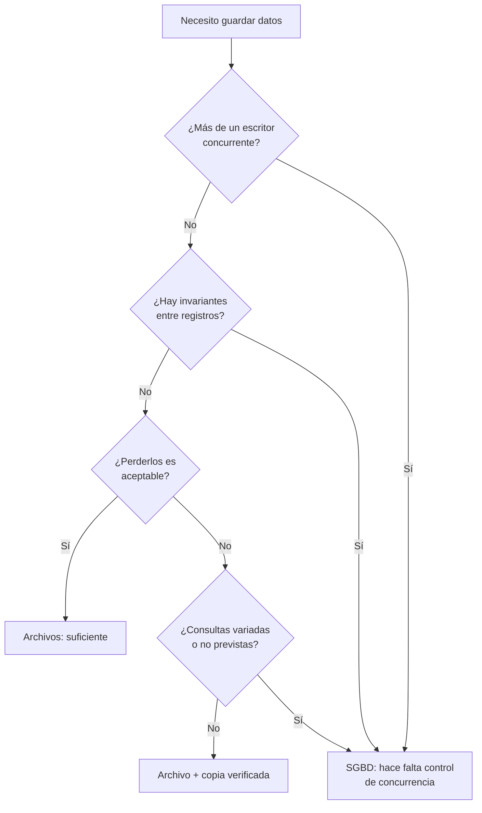

# 001 — Qué resuelve un sistema de bases de datos y qué no

> [Programa](../../../README.md) · [Parte 00](../README.md) · [Siguiente →](../../part-00-fundamentos-datos-sistemas-y-metodo/002-arquitectura-interna-de-un-gestor/README.md)

| | |
|---|---|
| **Parte** | 00 — Fundamentos, sistemas y método |
| **Nivel** | Fundamentos |
| **Horas estimadas** | 3 |
| **Motores** | `sqlite` |
| **Laboratorio** | [`labs/01-sql-foundations`](../../../labs/01-sql-foundations/README.md) |
| **Fuentes** | 4 |

**Conceptos centrales:** `persistencia` · `concurrencia` · `integridad` · `recuperación` · `independencia de datos`

---

## Propósito

Establecer qué problemas concretos resuelve un sistema gestor de bases de datos (SGBD) y, sobre todo, cuáles **no** resuelve. Sin esa demarcación, cualquier archivo con datos se llama «base de datos» y cualquier fallo de diseño se atribuye al motor.

## Resultados de aprendizaje

Al terminar podrás:

1. Enumerar los seis problemas del almacenamiento en archivos planos que motivaron la aparición de los SGBD.
2. Reproducir una anomalía de actualización perdida y explicar por qué el sistema de archivos no la impide.
3. Distinguir lo que el motor **garantiza** de lo que solo **permite declarar**.
4. Justificar cuándo *no* usar un SGBD, con un criterio distinto de «es lo que se usa siempre».
5. Nombrar la fuente de cada afirmación anterior.

## Fundamentos

### El problema que existía antes

Silberschatz, Korth y Sudarshan abren *Database System Concepts* con la lista de defectos del enfoque «un archivo por aplicación». No es historia: cada uno reaparece cuando alguien decide guardar el estado en JSON y arreglarlo después.

| Defecto | Qué ocurre en la práctica |
|---|---|
| Redundancia e inconsistencia | El mismo dato vive en dos archivos y divergen |
| Dificultad de acceso | Cada consulta nueva exige escribir un programa nuevo |
| Aislamiento de datos | Formatos distintos impiden combinar información |
| Problemas de integridad | La regla «el saldo no puede ser negativo» vive en el código, no en el dato |
| Problemas de atomicidad | Una caída a mitad de una transferencia deja el dinero en ninguna parte |
| Anomalías de concurrencia | Dos procesos escriben a la vez y uno de los cambios desaparece |
| Problemas de seguridad | No hay forma de dar acceso parcial: o se ve el archivo entero o nada |

### Lo que un SGBD aporta

Un gestor no es «un lugar donde guardar tablas». Es un programa que ofrece cuatro servicios que un sistema de archivos no ofrece:

- **Persistencia con recuperación.** Tras un corte de energía, el sistema vuelve a un estado consistente conocido, no a «lo que hubiera alcanzado a escribirse».
- **Concurrencia controlada.** Muchos clientes leen y escriben simultáneamente y el resultado es equivalente a alguna ejecución ordenada (según el nivel de aislamiento elegido; parte 07).
- **Integridad declarada.** Las restricciones se expresan una vez, en el esquema, y el motor las hace cumplir para todo cliente, incluido el que se conecta por consola a las tres de la mañana.
- **Independencia de datos.** La forma física de almacenamiento puede cambiar sin reescribir las consultas. Es la aportación central del artículo de Codd (1970) y el tema de la clase 003.

Hellerstein, Stonebraker y Hamilton describen cómo se implementan esos servicios: gestor de procesos, procesador de consultas, gestor de transacciones y gestor de almacenamiento compartido. Ningún componente es opcional si se quieren las cuatro garantías.

### Lo que un SGBD **no** hace

Aquí se pierde más tiempo del que se cree:

- **No hace que los datos sean verdaderos.** Hace cumplir las restricciones que alguien declaró. Si nadie declaró que `edad > 0`, el motor guardará `-4` sin protestar.
- **No modela el dominio por ti.** William Kent dedica *Data and Reality* a mostrar que ningún esquema captura el mundo: siempre se elige un recorte. El motor ejecuta ese recorte, no lo mejora.
- **No compensa un modelo equivocado con más hardware.** Una consulta que multiplica filas por una reunión mal planteada devuelve resultados erróneos igual de rápido.
- **No es gratis.** Añade un proceso que operar, respaldar, actualizar y asegurar.

### Cuándo no usar un SGBD

Criterios defendibles para quedarse con archivos: los datos son de un solo escritor, caben en memoria, no hay reglas de integridad entre elementos, y perderlos es aceptable (caché, artefactos de compilación, registros efímeros). En cuanto aparezcan dos escritores o una invariante entre dos registros, el argumento se cae.



## Ejemplo trabajado

Dos cajeros aplican un cargo sobre la misma cuenta, que tiene **1 000** de saldo. Con archivos, cada proceso lee, calcula y escribe:

```text
t0  Cajero A lee saldo         -> 1000
t1  Cajero B lee saldo         -> 1000
t2  Cajero A calcula 1000 - 300 -> 700
t3  Cajero B calcula 1000 - 500 -> 500
t4  Cajero A escribe            -> 700
t5  Cajero B escribe            -> 500
```

Saldo final: **500**. Saldo correcto: 1000 − 300 − 500 = **200**. Se perdieron 300 sin que ningún programa fallara ni ningún archivo se corrompiera: los dos cajeros hicieron exactamente lo que su código decía. Es la *actualización perdida*, la anomalía que Gray formalizaría como violación de aislamiento.

El mismo escenario dentro de un SGBD, con una transacción por cajero y un nivel de aislamiento que detecte el conflicto, tiene tres desenlaces posibles: uno espera al otro y ambos terminan (200), o uno se aborta y se reintenta (200), o el motor informa de un fallo serializable y el cliente decide. Lo que **no** puede ocurrir es que un cambio confirmado se pierda en silencio.

Comprobación numérica del argumento: con archivos, la ventana de riesgo es el intervalo `t0`–`t5`. Si cada operación dura 5 ms y llegan 40 cargos por segundo sobre la misma cuenta, la probabilidad de solapamiento no es marginal: es el caso habitual.

## Comparación

| Dimensión | Archivos planos | SGBD |
|---|---|---|
| Unidad de escritura | El archivo o un bloque | La transacción |
| Recuperación tras caída | Lo que alcanzó a escribirse | Último estado confirmado |
| Reglas de integridad | En cada programa cliente | Una vez, en el esquema |
| Consultas no previstas | Programa nuevo | Consulta nueva |
| Concurrencia | Responsabilidad del programador | Del gestor, según nivel declarado |
| Control de acceso | Permisos del sistema de archivos | Por objeto, rol y fila |
| Costo de operación | Casi nulo | Proceso que mantener |

## Errores frecuentes

1. **«La base de datos garantiza que los datos sean correctos.»** Garantiza las restricciones declaradas. Un esquema sin `CHECK`, sin `NOT NULL` y sin claves foráneas no garantiza nada; solo almacena.
2. **«SQL es la base de datos.»** SQL es un lenguaje. El gestor es el programa que lo ejecuta, y hay gestores sin SQL con las mismas garantías transaccionales.
3. **«Si va lento, el motor es malo.»** Antes de esa conclusión hay que mirar el modelo, los índices y el plan de ejecución (parte 08). El motor casi nunca es el primer sospechoso.
4. **«Con NoSQL me ahorro el modelado.»** Se cambia dónde ocurre el modelado, no si ocurre: pasa del esquema a los patrones de acceso (parte 05).
5. **«Un archivo JSON es una base de datos.»** Lo es en sentido coloquial y no lo es en sentido técnico: no ofrece atomicidad, aislamiento ni control de acceso.

## De la clase a la operación

En un sistema real, la decisión «SGBD sí o no» arrastra consecuencias que no aparecen en el prototipo: quién aplica los parches de seguridad, dónde se guardan las copias, cómo se prueba la restauración, qué pasa cuando el disco se llena y quién recibe la alerta. Elegir un gestor es adoptar un servicio que operar, no solo una biblioteca que importar.

## Reto de transferencia

Toma un sistema que hayas escrito y que guarde estado en archivos. Documenta, con evidencia:

1. Una invariante entre dos registros que hoy nadie hace cumplir.
2. Una secuencia concreta de dos procesos que la rompa (con marcas de tiempo, como en el ejemplo).
3. Qué restricción del esquema la impediría en un SGBD.
4. El costo de operación que asumirías al migrar.

## Preguntas de evaluación

1. Explica, con una traza temporal propia, una anomalía de concurrencia distinta de la actualización perdida y por qué el sistema de archivos no la evita.
2. Un compañero afirma: «migramos a PostgreSQL, así que los datos ya son consistentes». ¿Qué le falta declarar para que esa frase sea cierta?
3. Da un caso real de tu trabajo donde usar un SGBD sería una mala decisión, y justifica con los criterios del diagrama.
4. ¿Qué componente descrito por Hellerstein et al. desaparece si renuncias a la durabilidad, y qué garantía pierdes con él?

---

## Laboratorio

```bash
python scripts/validate_repository.py
python labs/01-sql-foundations/run_lab.py
```

Guarda como evidencia la salida completa, la versión del motor y la semilla o
los parámetros usados. Una captura sin comando no es evidencia: no se puede
repetir.

## Evaluación

| Criterio | Peso | Qué se comprueba |
|---|---:|---|
| Comprensión conceptual | 25 % | Explica el mecanismo, no solo el resultado |
| Ejecución reproducible | 25 % | Otra persona obtiene lo mismo con las instrucciones dadas |
| Interpretación basada en evidencia | 25 % | Cada conclusión se apoya en una salida o una medición |
| Límites y riesgos declarados | 25 % | Dice qué no demuestra el ejercicio y qué faltaría en producción |

La clase se da por superada cuando la respuesta explica el mecanismo, muestra
la salida que la respalda y declara al menos un límite del ejercicio.

## Fuentes de esta clase

Todo lo afirmado arriba procede de estas obras. Los identificadores viven en
[`catalog/sources.json`](../../../catalog/sources.json) y el estado de los
enlaces se comprueba con `python scripts/check_external_links.py`.

- **Abraham Silberschatz, Henry F. Korth, S. Sudarshan** (2019). [Database System Concepts](https://db-book.com/). 7.a ed. McGraw-Hill. ISBN 978-0-07-802215-9.  
  Texto de referencia universitario. El sitio oficial publica diapositivas y capítulos de muestra.
- **Joseph M. Hellerstein, Michael Stonebraker, James Hamilton** (2007). [Architecture of a Database System](https://dsf.berkeley.edu/papers/fntdb07-architecture.pdf). Foundations and Trends in Databases 1(2). DOI [10.1561/1900000002](https://doi.org/10.1561/1900000002).  
  Descripción completa de los componentes internos de un SGBD relacional.
- **William Kent** (2012). [Data and Reality](https://technicspub.com/data-and-reality/). 3.a ed. Technics Publications. ISBN 978-1-935504-21-4.  
  Por qué ningún modelo captura el mundo: fuente del criterio de alcance del programa.
- **E. F. Codd** (1970). [A Relational Model of Data for Large Shared Data Banks](https://dl.acm.org/doi/10.1145/362384.362685). Communications of the ACM 13(6). DOI [10.1145/362384.362685](https://doi.org/10.1145/362384.362685).  
  Artículo fundacional del modelo relacional y de la independencia de datos.

---

> [Programa](../../../README.md) · [Parte 00](../README.md) · [Siguiente →](../../part-00-fundamentos-datos-sistemas-y-metodo/002-arquitectura-interna-de-un-gestor/README.md)
