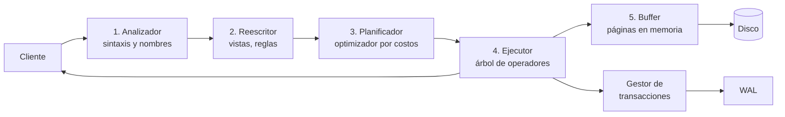

## Propósito

Abrir la caja negra. Saber qué le ocurre a una consulta desde que sale del cliente hasta que vuelve con filas permite razonar sobre rendimiento, bloqueos y fallos en lugar de adivinar.

## Resultados de aprendizaje

Al terminar podrás:

1. Nombrar los cinco componentes de un SGBD relacional y qué hace cada uno.
2. Seguir el recorrido de una consulta y señalar en qué etapa se decide el rendimiento.
3. Explicar por qué el mismo SQL puede tardar 2 ms o 2 s sin que cambie el dato.
4. Distinguir el modelo de proceso por conexión del de hilos, y su consecuencia operativa.
5. Localizar cada afirmación en la fuente que la respalda.

## Fundamentos

### Los cinco componentes

Hellerstein, Stonebraker y Hamilton organizan cualquier SGBD relacional en cinco piezas. La lista es estable desde System R y sigue describiendo PostgreSQL, MySQL u Oracle:

1. **Gestor de procesos y conexiones.** Acepta clientes, autentica y asigna a cada sesión un contexto de ejecución.
2. **Procesador de consultas.** Analiza, reescribe, planifica y ejecuta. Aquí vive el optimizador.
3. **Gestor de transacciones.** Bloqueos, registro de escritura anticipada, control de versiones y recuperación.
4. **Gestor de almacenamiento.** Páginas, buffer, organización de archivos e índices.
5. **Utilidades compartidas.** Catálogo, memoria, replicación, respaldo, estadísticas.

### El recorrido de una consulta



Las etapas 1 y 2 son deterministas y baratas. La etapa 3 es donde se juega el rendimiento: el optimizador estima cuántas filas producirá cada operador y elige un plan. La etapa 5 es donde se paga: cada página que no esté en memoria es una lectura de disco.

El punto pedagógico: **la misma consulta puede recibir planes distintos** según las estadísticas del catálogo, la memoria disponible y los índices existentes. Por eso el rendimiento se diagnostica leyendo el plan (clase 042), no leyendo el SQL.

### Buffer pool: por qué la memoria manda

El gestor de almacenamiento no lee filas, lee **páginas** (8 KB en PostgreSQL, configurable en otros motores). Esas páginas se mantienen en un caché compartido. Una lectura servida desde el buffer cuesta cientos de nanosegundos; una que llega al disco, cientos de microsegundos en SSD. Tres órdenes de magnitud de diferencia por el mismo SQL.

Petrov desarrolla la consecuencia: casi todas las decisiones de diseño de un motor —tamaño de página, estructura del índice, política de compactación— son intentos de reducir el número de páginas tocadas.

### Modelo de proceso: qué cambia en operación

| Modelo | Motor típico | Consecuencia práctica |
|---|---|---|
| Proceso por conexión | PostgreSQL | Cada conexión cuesta memoria; hace falta un agrupador de conexiones |
| Hilo por conexión | MySQL, SQL Server | Conexiones más baratas; más riesgo de contención en estructuras compartidas |
| Biblioteca embebida | SQLite, DuckDB | No hay servidor: el proceso de la aplicación *es* el motor |

Rogov documenta el caso de PostgreSQL con detalle: el proceso de fondo `autovacuum`, la memoria compartida y por qué abrir 500 conexiones directas hunde un servidor que soporta sin esfuerzo 500 clientes a través de un agrupador.

## Ejemplo trabajado

Sigamos `SELECT nombre FROM students WHERE id = 3` sobre el dominio canónico del repositorio.

**Etapa 1 — Análisis.** Se comprueba la sintaxis y se resuelve `students` en el catálogo. Si la tabla no existe, el error llega aquí, antes de tocar un solo dato.

**Etapa 3 — Planificación.** El planificador tiene dos caminos:

```text
Plan A  Barrido secuencial: leer las N páginas de la tabla y filtrar
Plan B  Búsqueda por índice: descender el B-Tree de la clave primaria
```

Con la tabla de ejemplo (4 filas, 1 página), el coste estimado del barrido es menor que el del índice: leer una página y descartar tres filas es más barato que descender un árbol. **El motor elige el barrido y hace bien.** Con 4 millones de filas repartidas en 30 000 páginas, el mismo optimizador elige el índice, porque descender tres niveles del árbol toca 4 páginas frente a 30 000.

Este es el resultado que sorprende a quien empieza: *no usar el índice puede ser la decisión correcta*. Depende de la selectividad, y la selectividad la estima el optimizador a partir de estadísticas.

**Etapa 5 — Acceso.** Si esas páginas ya estaban en el buffer por una consulta anterior, no hay lectura física. La segunda ejecución de la misma consulta suele ser mucho más rápida que la primera, y eso **no** significa que la consulta haya mejorado: significa que el caché está caliente. Cualquier medición que ignore este efecto es una medición inválida.

Comprobación directa en el laboratorio, sin instalar nada:

```sql
EXPLAIN QUERY PLAN SELECT nombre FROM students WHERE id = 3;
```

## Comparación

| Etapa | Qué decide | Coste típico | Se diagnostica con |
|---|---|---|---|
| Análisis | Validez sintáctica y de nombres | microsegundos | mensaje de error |
| Reescritura | Expansión de vistas y reglas | microsegundos | plan expandido |
| Planificación | Orden de reunión, uso de índices | microsegundos a ms | `EXPLAIN` |
| Ejecución | Trabajo real sobre filas | ms a minutos | `EXPLAIN ANALYZE` |
| Almacenamiento | Páginas leídas y escritas | dominante | contadores de E/S y aciertos de buffer |

## Errores frecuentes

1. **«El motor no usa mi índice, está roto.»** Casi siempre el optimizador estimó que el barrido era más barato, y con pocas filas suele acertar. Antes de forzar nada, mira la estimación frente al conteo real.
2. **«Mido el tiempo de la primera ejecución.»** Esa medición incluye el llenado del buffer. Compara siempre ejecuciones en frío contra ejecuciones en frío.
3. **«Más conexiones, más rendimiento.»** Por encima del paralelismo útil, cada conexión adicional añade contención y memoria. La curva baja, no sube.
4. **«El plan es estable.»** Cambia con las estadísticas, el volumen y la versión del motor. Un plan bueno hoy puede degradarse tras una carga masiva sin recolección de estadísticas.
5. **«SQLite no tiene arquitectura.»** Tiene los mismos componentes; lo que no tiene es un proceso servidor. Precisamente por eso es el mejor motor para leer un gestor entero.

## De la clase a la operación

Los incidentes de bases de datos casi nunca son «la consulta es lenta»: son «el plan cambió tras una migración», «el buffer se quedó pequeño al crecer los datos», «el agrupador de conexiones se agotó». Reconocer en qué componente ocurre un síntoma reduce el diagnóstico de horas a minutos.

## Reto de transferencia

Ejecuta la misma consulta dos veces sobre el dominio del repositorio y documenta:

1. El plan elegido en cada caso, con la salida literal.
2. La diferencia de tiempo, y a qué componente la atribuyes.
3. Una modificación (índice, volumen de datos o filtro) que haga cambiar el plan, con la evidencia del cambio.
4. Qué medirías para demostrar que la mejora es real y no un efecto de caché.

## Preguntas de evaluación

1. ¿En qué etapa se detecta un nombre de columna mal escrito, y por qué no puede detectarse antes ni después?
2. Explica con números por qué un barrido secuencial puede ganarle a una búsqueda por índice.
3. Tu servidor pasa de 50 a 500 conexiones y el rendimiento cae. Da dos causas plausibles ligadas al modelo de proceso.
4. ¿Qué componente falla si, tras un corte de energía, aparecen filas de una transacción que nunca se confirmó?
