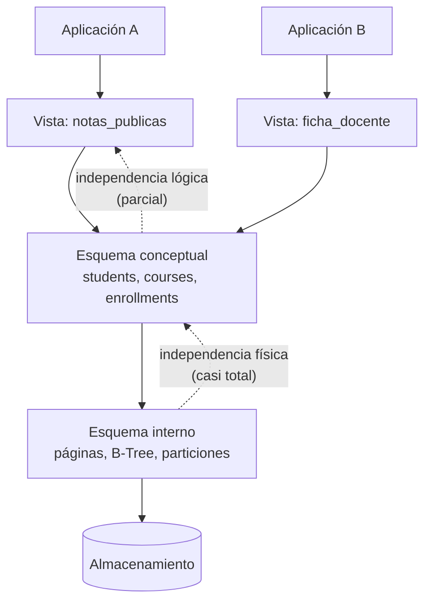

# 003 — Independencia de datos y los tres niveles de esquema

> [Programa](../../../README.md) · [Parte 00](../README.md) · [← Anterior](../../part-00-fundamentos-datos-sistemas-y-metodo/002-arquitectura-interna-de-un-gestor/README.md) · [Siguiente →](../../part-00-fundamentos-datos-sistemas-y-metodo/004-entorno-reproducible-y-evidencia/README.md)

| | |
|---|---|
| **Parte** | 00 — Fundamentos, sistemas y método |
| **Nivel** | Fundamentos |
| **Horas estimadas** | 3 |
| **Motores** | `postgresql`, `sqlite` |
| **Laboratorio** | [`labs/01-sql-foundations`](../../../labs/01-sql-foundations/README.md) |
| **Fuentes** | 3 |

**Conceptos centrales:** `esquema conceptual` · `esquema físico` · `vista externa` · `independencia lógica`

---

## Propósito

Entender la idea que hizo posible la industria de las bases de datos: separar **qué** datos existen de **cómo** se almacenan. Sin independencia de datos, cada cambio de índice obligaría a reescribir la aplicación.

## Resultados de aprendizaje

Al terminar podrás:

1. Describir los tres niveles de esquema y qué se declara en cada uno.
2. Distinguir independencia física de independencia lógica con ejemplos propios.
3. Explicar qué aportó exactamente Codd (1970) frente a los sistemas jerárquicos y de red.
4. Identificar en tu propio código las fugas de independencia más comunes.
5. Usar vistas como capa externa y conocer sus límites.

## Fundamentos

### El argumento de Codd

Antes de 1970, los sistemas de gestión exponían al programador la estructura física: para recorrer datos había que seguir punteros entre registros en el orden en que estaban guardados. Cambiar el almacenamiento significaba reescribir programas.

Codd propuso exponer los datos como **relaciones** —conjuntos de tuplas— y acceder a ellos **por valor**, nunca por posición ni por puntero. La consecuencia práctica está en el propio título del artículo: *large shared data banks*. Compartidos significa que muchos programas distintos, escritos en momentos distintos, usan los mismos datos; si cada uno dependiera de la disposición física, ninguno podría evolucionar.

> La independencia de datos no es una comodidad: es la condición para que un esquema sobreviva a las aplicaciones que lo usan.

### Los tres niveles

La arquitectura de tres esquemas (formulada por el comité ANSI/SPARC y recogida en Silberschatz) separa:

| Nivel | Qué describe | Quién lo define | Ejemplo |
|---|---|---|---|
| **Externo** (vistas) | Lo que ve cada grupo de usuarios | Diseñador de la aplicación | `VIEW notas_publicas` sin el RUT |
| **Conceptual** (lógico) | Qué entidades, atributos y reglas existen | Modelador de datos | Tablas, claves, restricciones |
| **Interno** (físico) | Cómo se guarda y se accede | Motor y administrador | Páginas, B-Tree, particiones, compresión |

De ahí salen dos independencias distintas, y conviene no confundirlas:

- **Independencia física:** cambiar el nivel interno sin tocar el conceptual. Crear un índice, cambiar el tipo de índice, particionar una tabla o comprimirla no debería alterar ninguna consulta. Los motores relacionales la consiguen casi por completo.
- **Independencia lógica:** cambiar el nivel conceptual sin tocar el externo. Dividir una tabla en dos no debería romper a los clientes si existe una vista que reconstruye la forma anterior. Se consigue **parcialmente**: es fácil para lectura y difícil para escritura, porque no toda vista es actualizable.



### Dónde se rompe en la práctica

Date insiste en un punto incómodo: SQL debilita la independencia que el modelo relacional prometía. Las fugas más habituales:

- **`SELECT *`.** Fija implícitamente el número y el orden de las columnas. Añadir una columna rompe al cliente que lee por posición.
- **Depender del orden sin `ORDER BY`.** El orden de las filas es una propiedad del plan físico, no del dato. Un índice nuevo cambia el orden observado.
- **Consultas que nombran índices o pistas del optimizador.** Atan la aplicación al nivel interno.
- **Lógica de negocio en la aplicación en vez de en restricciones.** Cada cliente nuevo debe reimplementarla, y alguno no lo hará.
- **Claves primarias con significado de negocio.** Si la clave es el RUT y la ley cambia el formato, cambia el nivel conceptual entero (clase 007).

## Ejemplo trabajado

Partimos de una tabla que mezcla dos conceptos:

```sql
CREATE TABLE students (
  id       INTEGER PRIMARY KEY,
  nombre   TEXT NOT NULL,
  email    TEXT,
  telefono TEXT
);
```

Un requisito nuevo pide **varios contactos por estudiante**. El cambio conceptual correcto es dividir:

```sql
CREATE TABLE student_contacts (
  student_id INTEGER NOT NULL REFERENCES students(id),
  tipo       TEXT NOT NULL CHECK (tipo IN ('email','telefono')),
  valor      TEXT NOT NULL,
  PRIMARY KEY (student_id, tipo, valor)
);
```

Sin capa externa, cada cliente que hacía `SELECT id, nombre, email FROM students` se rompe. Con capa externa, no:

```sql
CREATE VIEW students_v1 AS
SELECT s.id,
       s.nombre,
       (SELECT c.valor FROM student_contacts c
         WHERE c.student_id = s.id AND c.tipo = 'email'  LIMIT 1) AS email,
       (SELECT c.valor FROM student_contacts c
         WHERE c.student_id = s.id AND c.tipo = 'telefono' LIMIT 1) AS telefono
FROM students s;
```

Los clientes antiguos siguen funcionando contra `students_v1`; los nuevos usan las tablas reales. Aquí está el límite honesto: la vista es **legible pero no escribible** sin ayuda. Un `UPDATE students_v1 SET email = ...` no tiene traducción única, porque la vista pierde información sobre cuál de los contactos actualizar. Para conseguir independencia lógica también en escritura hace falta un disparador `INSTEAD OF` que declare esa decisión de forma explícita.

Traza del efecto: si tres aplicaciones consumían la tabla original, dividir sin vista genera 3 despliegues coordinados; dividir con vista genera 1 despliegue de base de datos y 3 migraciones independientes, cada una a su ritmo. Ese es todo el valor de la capa externa (y el fundamento de las migraciones sin caída de la clase 049).

## Comparación

| Cambio | ¿Rompe a los clientes sin capa externa? | ¿Con vista de compatibilidad? |
|---|---|---|
| Crear un índice | No | No |
| Particionar una tabla | No | No |
| Renombrar una columna | Sí | No |
| Dividir una tabla en dos | Sí | No, en lectura |
| Cambiar el tipo de una columna | Sí | Depende de la conversión |
| Añadir una columna | Solo si se usa `SELECT *` | No |

## Errores frecuentes

1. **«La independencia de datos es total.»** La física casi lo es; la lógica solo en lectura y con trabajo explícito.
2. **«Las vistas son lentas por definición.»** El motor las expande en la fase de reescritura; una vista simple no añade coste. Lo que puede ser lento es la consulta que hay dentro.
3. **«El orden de las filas se mantiene.»** No existe orden sin `ORDER BY`. Cualquier código que dependa de él es un fallo latente.
4. **«El nivel externo es cosmético.»** Es el mecanismo con el que se cambia el esquema sin coordinar despliegues, y la base del control de acceso por columna.
5. **«Codd inventó SQL.»** Codd definió el modelo relacional; SQL llegó después (System R) y se apartó del modelo en varios puntos, empezando por permitir tablas con filas duplicadas.

## De la clase a la operación

Todo esquema de larga vida termina necesitando cambiar mientras hay clientes conectados. La diferencia entre un cambio de diez minutos y una madrugada completa es si la capa externa existía desde el principio. Es una decisión de diseño barata al inicio y carísima de añadir después.

## Reto de transferencia

Sobre el esquema del repositorio:

1. Propón un cambio conceptual real (dividir, renombrar o extraer una entidad).
2. Escribe la vista que preserva la interfaz anterior y demuestra con una consulta que el cliente antiguo sigue funcionando.
3. Documenta qué operación de escritura deja de funcionar y qué haría falta para restaurarla.
4. Estima cuántos despliegues coordinados evita la vista.

## Preguntas de evaluación

1. Da un cambio de tu propio código que rompió clientes y clasifícalo: ¿fue una fuga de independencia física o lógica?
2. ¿Por qué `SELECT *` es una dependencia del nivel externo respecto del conceptual?
3. Una vista con `GROUP BY` no es actualizable. Explica por qué en términos de información perdida.
4. ¿Qué garantiza y qué no garantiza la independencia física cuando se cambia un índice B-Tree por uno hash?

---

## Laboratorio

```bash
python scripts/validate_repository.py
python labs/01-sql-foundations/run_lab.py
```

Guarda como evidencia la salida completa, la versión del motor y la semilla o
los parámetros usados. Una captura sin comando no es evidencia: no se puede
repetir.

## Evaluación

| Criterio | Peso | Qué se comprueba |
|---|---:|---|
| Comprensión conceptual | 25 % | Explica el mecanismo, no solo el resultado |
| Ejecución reproducible | 25 % | Otra persona obtiene lo mismo con las instrucciones dadas |
| Interpretación basada en evidencia | 25 % | Cada conclusión se apoya en una salida o una medición |
| Límites y riesgos declarados | 25 % | Dice qué no demuestra el ejercicio y qué faltaría en producción |

La clase se da por superada cuando la respuesta explica el mecanismo, muestra
la salida que la respalda y declara al menos un límite del ejercicio.

## Fuentes de esta clase

Todo lo afirmado arriba procede de estas obras. Los identificadores viven en
[`catalog/sources.json`](../../../catalog/sources.json) y el estado de los
enlaces se comprueba con `python scripts/check_external_links.py`.

- **E. F. Codd** (1970). [A Relational Model of Data for Large Shared Data Banks](https://dl.acm.org/doi/10.1145/362384.362685). Communications of the ACM 13(6). DOI [10.1145/362384.362685](https://doi.org/10.1145/362384.362685).  
  Artículo fundacional del modelo relacional y de la independencia de datos.
- **Abraham Silberschatz, Henry F. Korth, S. Sudarshan** (2019). [Database System Concepts](https://db-book.com/). 7.a ed. McGraw-Hill. ISBN 978-0-07-802215-9.  
  Texto de referencia universitario. El sitio oficial publica diapositivas y capítulos de muestra.
- **C. J. Date** (2015). [SQL and Relational Theory: How to Write Accurate SQL Code](https://www.oreilly.com/library/view/sql-and-relational/9781491941164/). 3.a ed. O'Reilly. ISBN 978-1-4919-4117-1.  
  Separa el modelo relacional de lo que SQL realmente implementa, incluidos los nulos.

---

> [Programa](../../../README.md) · [Parte 00](../README.md) · [← Anterior](../../part-00-fundamentos-datos-sistemas-y-metodo/002-arquitectura-interna-de-un-gestor/README.md) · [Siguiente →](../../part-00-fundamentos-datos-sistemas-y-metodo/004-entorno-reproducible-y-evidencia/README.md)
