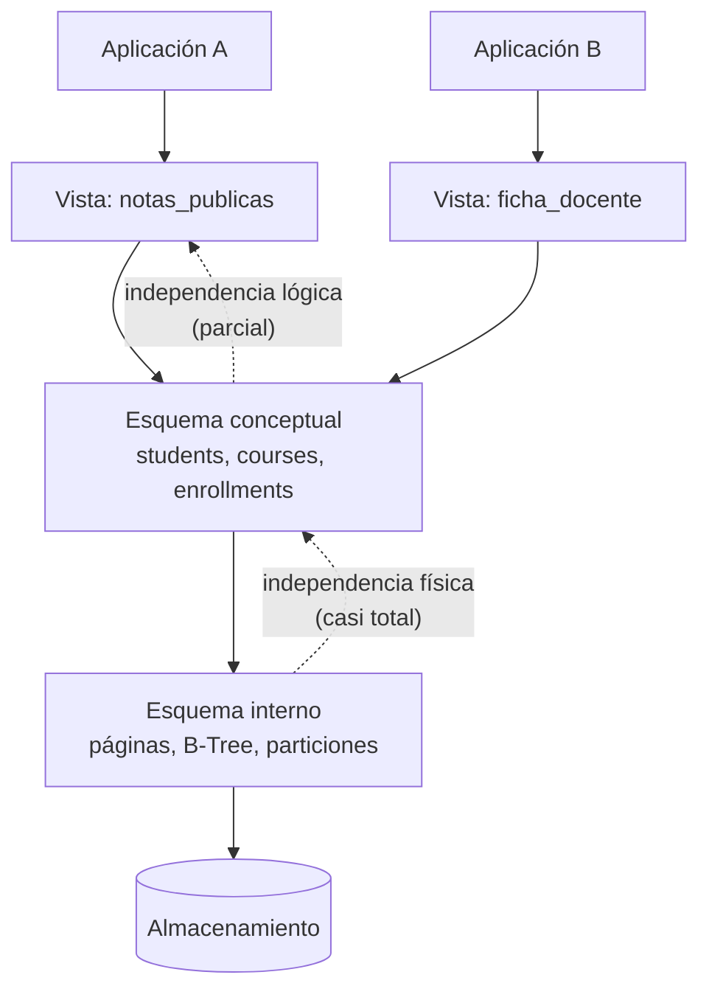

# 003 — Independencia de datos y los tres niveles de esquema

> [Programa](../../../README.md) · [Parte 00](../README.md) · [← Anterior](../../part-00-fundamentos-datos-sistemas-y-metodo/002-arquitectura-interna-de-un-gestor/README.md) · [Siguiente →](../../part-00-fundamentos-datos-sistemas-y-metodo/004-entorno-reproducible-y-evidencia/README.md)

Parte 00 — Fundamentos, sistemas y método · Fundamentos ·
3 horas estimadas · motores `postgresql`, `sqlite` · laboratorio
[`labs/01-sql-foundations`](../../../labs/01-sql-foundations/README.md) · 3 fuentes.

**Conceptos centrales:** `esquema conceptual` · `esquema físico` · `vista externa` · `independencia lógica`

**En este caso se comparan 7 motores**: 5 lo resuelven (5 con el resultado comprobado por máquina) y 2 no, con el motivo escrito.

---

## Propósito

Entender la idea que hizo posible la industria de las bases de datos: separar **qué** datos existen de **cómo** se almacenan. Sin independencia de datos, cada cambio de índice obligaría a reescribir la aplicación.

## Resultados de aprendizaje

Al terminar podrás:

1. Describir los tres niveles de esquema y qué se declara en cada uno.
2. Distinguir independencia física de independencia lógica con ejemplos propios.
3. Explicar qué aportó exactamente Codd (1970) frente a los sistemas jerárquicos y de red.
4. Identificar en tu propio código las fugas de independencia más comunes.
5. Usar vistas como capa externa y conocer sus límites.

## Fundamentos

### El argumento de Codd

Antes de 1970, los sistemas de gestión exponían al programador la estructura física: para recorrer datos había que seguir punteros entre registros en el orden en que estaban guardados. Cambiar el almacenamiento significaba reescribir programas.

Codd propuso exponer los datos como **relaciones** —conjuntos de tuplas— y acceder a ellos **por valor**, nunca por posición ni por puntero. La consecuencia práctica está en el propio título del artículo: *large shared data banks*. Compartidos significa que muchos programas distintos, escritos en momentos distintos, usan los mismos datos; si cada uno dependiera de la disposición física, ninguno podría evolucionar.

> La independencia de datos no es una comodidad: es la condición para que un esquema sobreviva a las aplicaciones que lo usan.

### Los tres niveles

La arquitectura de tres esquemas (formulada por el comité ANSI/SPARC y recogida en Silberschatz) separa:

| Nivel | Qué describe | Quién lo define | Ejemplo |
|---|---|---|---|
| **Externo** (vistas) | Lo que ve cada grupo de usuarios | Diseñador de la aplicación | `VIEW notas_publicas` sin el RUT |
| **Conceptual** (lógico) | Qué entidades, atributos y reglas existen | Modelador de datos | Tablas, claves, restricciones |
| **Interno** (físico) | Cómo se guarda y se accede | Motor y administrador | Páginas, B-Tree, particiones, compresión |

De ahí salen dos independencias distintas, y conviene no confundirlas:

- **Independencia física:** cambiar el nivel interno sin tocar el conceptual. Crear un índice, cambiar el tipo de índice, particionar una tabla o comprimirla no debería alterar ninguna consulta. Los motores relacionales la consiguen casi por completo.
- **Independencia lógica:** cambiar el nivel conceptual sin tocar el externo. Dividir una tabla en dos no debería romper a los clientes si existe una vista que reconstruye la forma anterior. Se consigue **parcialmente**: es fácil para lectura y difícil para escritura, porque no toda vista es actualizable.



### Dónde se rompe en la práctica

Date insiste en un punto incómodo: SQL debilita la independencia que el modelo relacional prometía. Las fugas más habituales:

- **`SELECT *`.** Fija implícitamente el número y el orden de las columnas. Añadir una columna rompe al cliente que lee por posición.
- **Depender del orden sin `ORDER BY`.** El orden de las filas es una propiedad del plan físico, no del dato. Un índice nuevo cambia el orden observado.
- **Consultas que nombran índices o pistas del optimizador.** Atan la aplicación al nivel interno.
- **Lógica de negocio en la aplicación en vez de en restricciones.** Cada cliente nuevo debe reimplementarla, y alguno no lo hará.
- **Claves primarias con significado de negocio.** Si la clave es el RUT y la ley cambia el formato, cambia el nivel conceptual entero (clase 007).

## Ejemplo trabajado

Partimos de una tabla que mezcla dos conceptos:

```sql
CREATE TABLE students (
  id       INTEGER PRIMARY KEY,
  nombre   TEXT NOT NULL,
  email    TEXT,
  telefono TEXT
);
```

Un requisito nuevo pide **varios contactos por estudiante**. El cambio conceptual correcto es dividir:

```sql
CREATE TABLE student_contacts (
  student_id INTEGER NOT NULL REFERENCES students(id),
  tipo       TEXT NOT NULL CHECK (tipo IN ('email','telefono')),
  valor      TEXT NOT NULL,
  PRIMARY KEY (student_id, tipo, valor)
);
```

Sin capa externa, cada cliente que hacía `SELECT id, nombre, email FROM students` se rompe. Con capa externa, no:

```sql
CREATE VIEW students_v1 AS
SELECT s.id,
       s.nombre,
       (SELECT c.valor FROM student_contacts c
         WHERE c.student_id = s.id AND c.tipo = 'email'  LIMIT 1) AS email,
       (SELECT c.valor FROM student_contacts c
         WHERE c.student_id = s.id AND c.tipo = 'telefono' LIMIT 1) AS telefono
FROM students s;
```

Los clientes antiguos siguen funcionando contra `students_v1`; los nuevos usan las tablas reales. Aquí está el límite honesto: la vista es **legible pero no escribible** sin ayuda. Un `UPDATE students_v1 SET email = ...` no tiene traducción única, porque la vista pierde información sobre cuál de los contactos actualizar. Para conseguir independencia lógica también en escritura hace falta un disparador `INSTEAD OF` que declare esa decisión de forma explícita.

Traza del efecto: si tres aplicaciones consumían la tabla original, dividir sin vista genera 3 despliegues coordinados; dividir con vista genera 1 despliegue de base de datos y 3 migraciones independientes, cada una a su ritmo. Ese es todo el valor de la capa externa (y el fundamento de las migraciones sin caída de la clase 049).

## Comparación

| Cambio | ¿Rompe a los clientes sin capa externa? | ¿Con vista de compatibilidad? |
|---|---|---|
| Crear un índice | No | No |
| Particionar una tabla | No | No |
| Renombrar una columna | Sí | No |
| Dividir una tabla en dos | Sí | No, en lectura |
| Cambiar el tipo de una columna | Sí | Depende de la conversión |
| Añadir una columna | Solo si se usa `SELECT *` | No |

## Errores frecuentes

1. **«La independencia de datos es total.»** La física casi lo es; la lógica solo en lectura y con trabajo explícito.
2. **«Las vistas son lentas por definición.»** El motor las expande en la fase de reescritura; una vista simple no añade coste. Lo que puede ser lento es la consulta que hay dentro.
3. **«El orden de las filas se mantiene.»** No existe orden sin `ORDER BY`. Cualquier código que dependa de él es un fallo latente.
4. **«El nivel externo es cosmético.»** Es el mecanismo con el que se cambia el esquema sin coordinar despliegues, y la base del control de acceso por columna.
5. **«Codd inventó SQL.»** Codd definió el modelo relacional; SQL llegó después (System R) y se apartó del modelo en varios puntos, empezando por permitir tablas con filas duplicadas.

## De la clase a la operación

Todo esquema de larga vida termina necesitando cambiar mientras hay clientes conectados. La diferencia entre un cambio de diez minutos y una madrugada completa es si la capa externa existía desde el principio. Es una decisión de diseño barata al inicio y carísima de añadir después.

## Reto de transferencia

Sobre el esquema del repositorio:

1. Propón un cambio conceptual real (dividir, renombrar o extraer una entidad).
2. Escribe la vista que preserva la interfaz anterior y demuestra con una consulta que el cliente antiguo sigue funcionando.
3. Documenta qué operación de escritura deja de funcionar y qué haría falta para restaurarla.
4. Estima cuántos despliegues coordinados evita la vista.

## Preguntas de evaluación

1. Da un cambio de tu propio código que rompió clientes y clasifícalo: ¿fue una fuga de independencia física o lógica?
2. ¿Por qué `SELECT *` es una dependencia del nivel externo respecto del conceptual?
3. Una vista con `GROUP BY` no es actualizable. Explica por qué en términos de información perdida.
4. ¿Qué garantiza y qué no garantiza la independencia física cuando se cambia un índice B-Tree por uno hash?

---

## 🌐 El mismo problema en cada motor

**Caso:** Cambiar la forma física de los datos sin tocar la consulta de la aplicación

La aplicación consulta siempre lo mismo: `SELECT ... FROM panel_inscripciones`.
Debajo, la tabla cambia de forma —el estado deja de ser un texto repetido en
cada fila y pasa a ser un código con su tabla de referencia—, y la vista
absorbe el cambio. La consulta de la aplicación no se toca y devuelve
exactamente las mismas filas antes y después.

Eso es la independencia lógica de datos: la vista es la frontera entre el
esquema externo que la aplicación ve y el esquema conceptual que el
administrador puede reorganizar.

Salida esperada, idéntica en todos los motores que lo resuelven:

| estudiante | estado |
|---|---|
| `Ada` | `activa` |
| `Grace` | `retirada` |
| `Linus` | `completada` |

El contrato vive en [`motores.yaml`](motores.yaml) y lo comprueba
`python scripts/verificar_equivalencia.py --clase 003`: 5 de
las 5 implementaciones se ejecutan de verdad y su
resultado se compara con esa tabla; el resto se declara como material revisado,
no ejecutado.

| Motor | ¿Resuelve el caso? | Nivel de prueba | Código | Fuente |
|---|---|---|---|---|
| SQLite | sí | núcleo | [código](implementaciones/sqlite/consulta.sql) | [doc oficial](https://sqlite.org/lang_createview.html) |
| DuckDB | sí | núcleo | [código](implementaciones/duckdb/consulta.sql) | [doc oficial](https://duckdb.org/docs/stable/sql/statements/create_view.html) |
| PostgreSQL | sí | servicio | [código](implementaciones/postgresql/consulta.sql) | [doc oficial](https://www.postgresql.org/docs/current/sql-createview.html) |
| MySQL | sí | servicio | [código](implementaciones/mysql/consulta.sql) | [doc oficial](https://dev.mysql.com/doc/refman/8.4/en/views.html) |
| MongoDB | sí | servicio | [código](implementaciones/mongodb/consulta.js) | [doc oficial](https://www.mongodb.com/docs/manual/core/views/) |
| Apache Cassandra | **no** | — | — | [doc oficial](https://cassandra.apache.org/doc/latest/cassandra/developing/cql/mvs.html) |
| Redis | **no** | — | — | [doc oficial](https://redis.io/docs/latest/develop/using-commands/keyspace/) |

### Los que resuelven el caso

#### SQLite · [`implementaciones/sqlite/consulta.sql`](implementaciones/sqlite/consulta.sql)

✅ **verificado** — se ejecuta en CI sin servicios

```sql
-- motor: sqlite
-- doc: https://sqlite.org/lang_createview.html
-- nota: la vista es el esquema externo; las dos tablas de debajo son el
--       conceptual. Cambia el segundo sin tocar el primero.

-- === preparacion ===
-- 1. El esquema conceptual de partida: el estado es un texto repetido en cada fila.
CREATE TABLE inscripciones_v1 (
    estudiante TEXT NOT NULL,
    estado     TEXT NOT NULL
);
INSERT INTO inscripciones_v1 (estudiante, estado) VALUES
    ('Ada', 'activa'), ('Linus', 'completada'), ('Grace', 'retirada');

-- 2. El esquema externo: lo unico que la aplicacion conoce.
CREATE VIEW panel_inscripciones AS
    SELECT estudiante, estado FROM inscripciones_v1;

-- 3. El administrador reorganiza: el estado pasa a codigo con tabla de referencia.
CREATE TABLE estados (
    codigo INTEGER PRIMARY KEY,
    nombre TEXT NOT NULL
);
INSERT INTO estados (codigo, nombre) VALUES (1, 'activa'), (2, 'completada'), (3, 'retirada');

CREATE TABLE inscripciones_v2 (
    estudiante    TEXT NOT NULL,
    estado_codigo INTEGER NOT NULL REFERENCES estados(codigo)
);
INSERT INTO inscripciones_v2 (estudiante, estado_codigo)
SELECT i.estudiante, e.codigo
FROM inscripciones_v1 i
JOIN estados e ON e.nombre = i.estado;

-- 4. La vista absorbe el cambio. La aplicacion no se entera.
DROP VIEW panel_inscripciones;
DROP TABLE inscripciones_v1;
CREATE VIEW panel_inscripciones AS
    SELECT i.estudiante, e.nombre AS estado
    FROM inscripciones_v2 i
    JOIN estados e ON e.codigo = i.estado_codigo;

-- === consulta ===
-- Exactamente la misma consulta que antes del cambio: ni una letra distinta.
SELECT estudiante, estado FROM panel_inscripciones ORDER BY estudiante;
```

- **Por qué sí:** Las vistas son parte del estándar y SQLite las tiene desde siempre: sirven para enseñar el mecanismo sin ninguna infraestructura.
- **Por qué no:** Sus vistas son de solo lectura salvo que se añadan disparadores `INSTEAD OF`, así que la frontera protege la lectura y no la escritura.
- 📄 Documentación oficial: <https://sqlite.org/lang_createview.html>

#### DuckDB · [`implementaciones/duckdb/consulta.sql`](implementaciones/duckdb/consulta.sql)

✅ **verificado** — se ejecuta en CI sin servicios

```sql
-- motor: duckdb
-- doc: https://duckdb.org/docs/stable/sql/statements/create_view.html
-- nota: la misma frontera sirve para cambiar de tabla a archivo Parquet sin
--       que la consulta de la aplicacion cambie.

-- === preparacion ===
-- 1. El esquema conceptual de partida: el estado es un texto repetido en cada fila.
CREATE TABLE inscripciones_v1 (
    estudiante VARCHAR NOT NULL,
    estado     VARCHAR NOT NULL
);
INSERT INTO inscripciones_v1 (estudiante, estado) VALUES
    ('Ada', 'activa'), ('Linus', 'completada'), ('Grace', 'retirada');

-- 2. El esquema externo: lo unico que la aplicacion conoce.
CREATE VIEW panel_inscripciones AS
    SELECT estudiante, estado FROM inscripciones_v1;

-- 3. El administrador reorganiza: el estado pasa a codigo con tabla de referencia.
CREATE TABLE estados (
    codigo INTEGER PRIMARY KEY,
    nombre VARCHAR NOT NULL
);
INSERT INTO estados (codigo, nombre) VALUES (1, 'activa'), (2, 'completada'), (3, 'retirada');

CREATE TABLE inscripciones_v2 (
    estudiante    VARCHAR NOT NULL,
    estado_codigo INTEGER NOT NULL
);
INSERT INTO inscripciones_v2 (estudiante, estado_codigo)
SELECT i.estudiante, e.codigo
FROM inscripciones_v1 i
JOIN estados e ON e.nombre = i.estado;

-- 4. La vista absorbe el cambio. La aplicacion no se entera.
DROP VIEW panel_inscripciones;
DROP TABLE inscripciones_v1;
CREATE VIEW panel_inscripciones AS
    SELECT i.estudiante, e.nombre AS estado
    FROM inscripciones_v2 i
    JOIN estados e ON e.codigo = i.estado_codigo;

-- === consulta ===
-- Exactamente la misma consulta que antes del cambio: ni una letra distinta.
SELECT estudiante, estado FROM panel_inscripciones ORDER BY estudiante;
```

- **Por qué sí:** Misma semántica de vista, y además permite que la vista apunte a un archivo Parquet o CSV: la independencia deja de ser entre tablas y pasa a ser entre formatos de almacenamiento.
- **Por qué no:** Sin catálogo compartido ni permisos por usuario, la vista organiza el trabajo de quien la escribe, pero no es una frontera de seguridad frente a nadie.
- 📄 Documentación oficial: <https://duckdb.org/docs/stable/sql/statements/create_view.html>

#### PostgreSQL · [`implementaciones/postgresql/consulta.sql`](implementaciones/postgresql/consulta.sql)

✅ **verificado** — se ejecuta contra el motor real levantado con `docker compose`

```sql
-- motor: postgresql
-- doc: https://www.postgresql.org/docs/current/sql-createview.html
-- nota: en produccion el paso 4 se hace con CREATE OR REPLACE VIEW, que
--       sustituye la definicion de forma atomica y sin dejar un instante en
--       el que la vista no exista.

DROP VIEW IF EXISTS panel_inscripciones;
DROP TABLE IF EXISTS inscripciones_v1, inscripciones_v2, estados;

-- === preparacion ===
-- 1. El esquema conceptual de partida: el estado es un texto repetido en cada fila.
CREATE TABLE inscripciones_v1 (
    estudiante text NOT NULL,
    estado     text NOT NULL
);
INSERT INTO inscripciones_v1 (estudiante, estado) VALUES
    ('Ada', 'activa'), ('Linus', 'completada'), ('Grace', 'retirada');

-- 2. El esquema externo: lo unico que la aplicacion conoce.
CREATE VIEW panel_inscripciones AS
    SELECT estudiante, estado FROM inscripciones_v1;

-- 3. El administrador reorganiza: el estado pasa a codigo con tabla de referencia.
CREATE TABLE estados (
    codigo integer PRIMARY KEY,
    nombre text NOT NULL
);
INSERT INTO estados (codigo, nombre) VALUES (1, 'activa'), (2, 'completada'), (3, 'retirada');

CREATE TABLE inscripciones_v2 (
    estudiante    text NOT NULL,
    estado_codigo integer NOT NULL REFERENCES estados(codigo)
);
INSERT INTO inscripciones_v2 (estudiante, estado_codigo)
SELECT i.estudiante, e.codigo
FROM inscripciones_v1 i
JOIN estados e ON e.nombre = i.estado;

-- 4. La vista absorbe el cambio. La aplicacion no se entera.
DROP VIEW panel_inscripciones;
DROP TABLE inscripciones_v1;
CREATE VIEW panel_inscripciones AS
    SELECT i.estudiante, e.nombre AS estado
    FROM inscripciones_v2 i
    JOIN estados e ON e.codigo = i.estado_codigo;

-- === consulta ===
-- Exactamente la misma consulta que antes del cambio: ni una letra distinta.
SELECT estudiante, estado FROM panel_inscripciones ORDER BY estudiante;
```

- **Por qué sí:** La vista es también una frontera de permisos: se puede conceder `SELECT` sobre la vista y negarlo sobre las tablas de debajo, de modo que la independencia lógica y el control de acceso se apoyan en el mismo objeto. Con `CREATE OR REPLACE VIEW` el cambio es atómico.
- **Por qué no:** Una vista no es un índice: si la consulta de debajo es cara, la vista la hace cómoda pero no rápida, y quien la usa deja de ver ese costo. Para eso están las vistas materializadas, que ya no son transparentes porque hay que refrescarlas.
- 📄 Documentación oficial: <https://www.postgresql.org/docs/current/sql-createview.html>

#### MySQL · [`implementaciones/mysql/consulta.sql`](implementaciones/mysql/consulta.sql)

✅ **verificado** — se ejecuta contra el motor real levantado con `docker compose`

```sql
-- motor: mysql
-- doc: https://dev.mysql.com/doc/refman/8.4/en/views.html
-- nota: esta vista es una simple proyeccion con reunion, asi que MySQL usa el
--       algoritmo MERGE y no materializa nada. Con agregacion o UNION caeria
--       en TEMPTABLE y perderia los indices de debajo.

DROP VIEW IF EXISTS panel_inscripciones;
DROP TABLE IF EXISTS inscripciones_v1;
DROP TABLE IF EXISTS inscripciones_v2;
DROP TABLE IF EXISTS estados;

-- === preparacion ===
-- 1. El esquema conceptual de partida: el estado es un texto repetido en cada fila.
CREATE TABLE inscripciones_v1 (
    estudiante VARCHAR(50) NOT NULL,
    estado     VARCHAR(50) NOT NULL
);
INSERT INTO inscripciones_v1 (estudiante, estado) VALUES
    ('Ada', 'activa'), ('Linus', 'completada'), ('Grace', 'retirada');

-- 2. El esquema externo: lo unico que la aplicacion conoce.
CREATE VIEW panel_inscripciones AS
    SELECT estudiante, estado FROM inscripciones_v1;

-- 3. El administrador reorganiza: el estado pasa a codigo con tabla de referencia.
CREATE TABLE estados (
    codigo INT PRIMARY KEY,
    nombre VARCHAR(50) NOT NULL
);
INSERT INTO estados (codigo, nombre) VALUES (1, 'activa'), (2, 'completada'), (3, 'retirada');

CREATE TABLE inscripciones_v2 (
    estudiante    VARCHAR(50) NOT NULL,
    estado_codigo INT NOT NULL REFERENCES estados(codigo)
);
INSERT INTO inscripciones_v2 (estudiante, estado_codigo)
SELECT i.estudiante, e.codigo
FROM inscripciones_v1 i
JOIN estados e ON e.nombre = i.estado;

-- 4. La vista absorbe el cambio. La aplicacion no se entera.
DROP VIEW panel_inscripciones;
DROP TABLE inscripciones_v1;
CREATE VIEW panel_inscripciones AS
    SELECT i.estudiante, e.nombre AS estado
    FROM inscripciones_v2 i
    JOIN estados e ON e.codigo = i.estado_codigo;

-- === consulta ===
-- Exactamente la misma consulta que antes del cambio: ni una letra distinta.
SELECT estudiante, estado FROM panel_inscripciones ORDER BY estudiante;
```

- **Por qué sí:** Ofrece el mismo mecanismo y, con el algoritmo `MERGE`, la vista se funde con la consulta que la usa y no cuesta nada frente a escribirla a mano.
- **Por qué no:** Cuando la vista tiene agregación o `UNION`, MySQL cae al algoritmo `TEMPTABLE`: materializa el resultado en una tabla temporal y pierde los índices de debajo. La misma vista puede ser gratis o carísima según lo que contenga.
- 📄 Documentación oficial: <https://dev.mysql.com/doc/refman/8.4/en/views.html>

#### MongoDB · [`implementaciones/mongodb/consulta.js`](implementaciones/mongodb/consulta.js)

✅ **verificado** — se ejecuta contra el motor real levantado con `docker compose`

```javascript
// motor: mongodb
// doc: https://www.mongodb.com/docs/manual/core/views/
// nota: una vista es una tuberia de agregacion con nombre. Aqui el cambio
//       fisico es el mismo: el estado deja de ser una cadena repetida y pasa a
//       ser un codigo con su coleccion de referencia.

// === preparacion ===
db.panel_inscripciones.drop();
db.inscripciones_v1.drop();
db.inscripciones_v2.drop();
db.estados.drop();

// 1. Esquema de partida.
db.inscripciones_v1.insertMany([
  { estudiante: "Ada", estado: "activa" },
  { estudiante: "Linus", estado: "completada" },
  { estudiante: "Grace", estado: "retirada" },
]);

// 2. Esquema externo: lo unico que la aplicacion conoce.
db.createView("panel_inscripciones", "inscripciones_v1", [
  { $project: { _id: 0, estudiante: 1, estado: 1 } },
]);

// 3. Reorganizacion fisica.
db.estados.insertMany([
  { _id: 1, nombre: "activa" },
  { _id: 2, nombre: "completada" },
  { _id: 3, nombre: "retirada" },
]);
db.inscripciones_v2.insertMany([
  { estudiante: "Ada", estado_codigo: 1 },
  { estudiante: "Linus", estado_codigo: 2 },
  { estudiante: "Grace", estado_codigo: 3 },
]);

// 4. La vista absorbe el cambio.
db.panel_inscripciones.drop();
db.inscripciones_v1.drop();
db.createView("panel_inscripciones", "inscripciones_v2", [
  { $lookup: { from: "estados", localField: "estado_codigo",
               foreignField: "_id", as: "e" } },
  { $unwind: "$e" },
  { $project: { _id: 0, estudiante: 1, estado: "$e.nombre" } },
]);

// === consulta ===
// La misma consulta de siempre, contra el mismo nombre de siempre.
db.panel_inscripciones
  .find()
  .sort({ estudiante: 1 })
  .forEach((d) => print(d.estudiante + "|" + d.estado));
```

- **Por qué sí:** Una vista de MongoDB es una tubería de agregación con nombre: da la misma frontera entre lo que la aplicación consulta y cómo están guardados los documentos, y permite reorganizar el modelo documental sin cambiar el cliente.
- **Por qué no:** Son de solo lectura y no admiten índices propios: cada consulta a la vista ejecuta la tubería entera, así que la frontera se paga en cada lectura.
- 📄 Documentación oficial: <https://www.mongodb.com/docs/manual/core/views/>

### Los que no resuelven este caso — y qué se hace en su lugar

Descartar un motor con un argumento es tan formativo como usarlo. Ninguna de estas filas dice que el motor sea peor: dice que este problema no es el suyo.

| Motor | Por qué no | Qué se hace en su lugar | Fuente |
|---|---|---|---|
| Apache Cassandra | No hay vistas que reescriban una consulta. Existen vistas materializadas, pero mantienen una copia real de los datos y su propia documentación advierte de que se consideran experimentales por los problemas de coherencia entre la tabla base y la vista. | Escribir a mano la tabla que la consulta necesita y mantenerla desde la aplicación, aceptando que el cambio de forma física obliga a migrar datos, no solo a redefinir un objeto. | [doc](https://cassandra.apache.org/doc/latest/cassandra/developing/cql/mvs.html) |
| Redis | No existe una capa lógica sobre los datos: la clave **es** la forma física. Cambiar cómo se guarda algo cambia la clave, y todo cliente que la conocía deja de encontrarla. | Poner una capa de servicio delante que traduzca nombres estables a claves concretas: la independencia se implementa en el código, no en el almacén. | [doc](https://redis.io/docs/latest/develop/using-commands/keyspace/) |

---

## Laboratorio

```bash
python scripts/validate_repository.py
python labs/01-sql-foundations/run_lab.py
```

Guarda como evidencia la salida completa, la versión del motor y la semilla o
los parámetros usados. Una captura sin comando no es evidencia: no se puede
repetir.

## Evaluación

| Criterio | Peso | Qué se comprueba |
|---|---:|---|
| Comprensión conceptual | 25 % | Explica el mecanismo, no solo el resultado |
| Ejecución reproducible | 25 % | Otra persona obtiene lo mismo con las instrucciones dadas |
| Interpretación basada en evidencia | 25 % | Cada conclusión se apoya en una salida o una medición |
| Límites y riesgos declarados | 25 % | Dice qué no demuestra el ejercicio y qué faltaría en producción |

La clase se da por superada cuando la respuesta explica el mecanismo, muestra
la salida que la respalda y declara al menos un límite del ejercicio.

## Fuentes de esta clase

Todo lo afirmado arriba procede de estas obras. Los identificadores viven en
[`catalog/sources.json`](../../../catalog/sources.json) y el estado de los
enlaces se comprueba con `python scripts/check_external_links.py`.

- **E. F. Codd** (1970). [A Relational Model of Data for Large Shared Data Banks](https://dl.acm.org/doi/10.1145/362384.362685). Communications of the ACM 13(6). DOI [10.1145/362384.362685](https://doi.org/10.1145/362384.362685).  
  Artículo fundacional del modelo relacional y de la independencia de datos.
- **Abraham Silberschatz, Henry F. Korth, S. Sudarshan** (2019). [Database System Concepts](https://db-book.com/). 7.a ed. McGraw-Hill. ISBN 978-0-07-802215-9.  
  Texto de referencia universitario. El sitio oficial publica diapositivas y capítulos de muestra.
- **C. J. Date** (2015). [SQL and Relational Theory: How to Write Accurate SQL Code](https://www.oreilly.com/library/view/sql-and-relational/9781491941164/). 3.a ed. O'Reilly. ISBN 978-1-4919-4117-1.  
  Separa el modelo relacional de lo que SQL realmente implementa, incluidos los nulos.

---

> [Programa](../../../README.md) · [Parte 00](../README.md) · [← Anterior](../../part-00-fundamentos-datos-sistemas-y-metodo/002-arquitectura-interna-de-un-gestor/README.md) · [Siguiente →](../../part-00-fundamentos-datos-sistemas-y-metodo/004-entorno-reproducible-y-evidencia/README.md)
