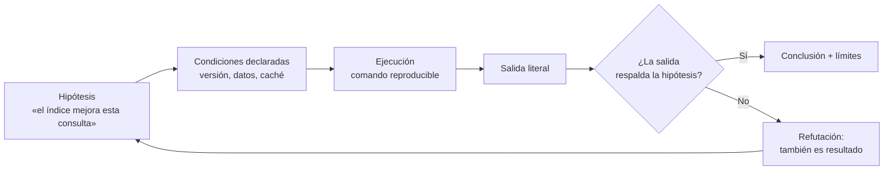

# 004 — Entorno reproducible y evidencia comprobable

> [Programa](../../../README.md) · [Parte 00](../README.md) · [← Anterior](../../part-00-fundamentos-datos-sistemas-y-metodo/003-independencia-de-datos-y-niveles-de-esquema/README.md) · [Siguiente →](../../part-01-modelado-conceptual-y-requisitos/005-de-requisitos-a-entidades/README.md)

Parte 00 — Fundamentos, sistemas y método · Fundamentos ·
3 horas estimadas · motores `sqlite`, `postgresql`, `mongodb` · laboratorio
[`labs/01-sql-foundations`](../../../labs/01-sql-foundations/README.md) · 4 fuentes.

**Conceptos centrales:** `reproducibilidad` · `semilla` · `contenedor` · `invariante` · `evidencia`

**En este caso se comparan 6 motores**: 5 lo resuelven (5 con el resultado comprobado por máquina) y 1 no, con el motivo escrito.

---

## Propósito

Montar un entorno donde toda afirmación sobre datos pueda comprobarse por otra persona. En bases de datos, «a mí me funciona» es una afirmación especialmente débil: el resultado depende de la versión, la configuración, los datos previos y el estado del caché.

## Resultados de aprendizaje

Al terminar podrás:

1. Ejecutar el laboratorio base sin instalar ningún servidor.
2. Levantar motores por perfiles con Docker Compose, sin arrancarlos todos.
3. Distinguir evidencia de captura de pantalla, y saber qué debe acompañar a un resultado.
4. Escribir una comprobación de invariante que falle cuando el dato está mal.
5. Explicar por qué una medición sin condiciones declaradas no sirve para decidir.

## Fundamentos

### El núcleo sin dependencias

SQLite permite estudiar un gestor completo sin instalar nada: es una biblioteca que se enlaza al proceso, con soporte para transacciones, índices, planes de ejecución y registro anticipado. La biblioteca estándar de Python la expone en `sqlite3`, conforme a la especificación PEP 249.

Eso da una propiedad valiosa para un programa formativo: **el primer laboratorio no puede fallar por instalación**. Si `python labs/01-sql-foundations/run_lab.py` no corre, el problema está en el código, no en el entorno.

### Los motores con contenedores

El resto de los motores llega por Docker Compose, organizado en **perfiles** para no levantar diez servicios a la vez:

```bash
docker compose --profile relational up -d
docker compose --profile document   up -d
docker compose --profile cache      up -d
```

Dos reglas del repositorio, ambas de seguridad:

- Las credenciales del `compose` son locales y están escritas a la vista. Nunca se copian a otro entorno.
- Los servicios no publican puertos hacia fuera de la máquina más allá de lo necesario para el laboratorio.

### Qué es evidencia

El libro de SRE de Google formula el criterio que aquí adoptamos: una afirmación operativa vale lo que vale su medición, y una medición vale lo que valen sus condiciones declaradas. Aplicado a este programa, una evidencia válida incluye:

| Elemento | Por qué sin él la evidencia se cae |
|---|---|
| Comando exacto | Sin él, nadie puede repetir |
| Versión del motor | El plan y la semántica cambian entre versiones |
| Datos de entrada (o su semilla) | Un resultado sobre otros datos no es el mismo resultado |
| Salida literal, no resumida | El resumen ya es una interpretación |
| Estado previo (caché frío o caliente) | Cambia el tiempo en órdenes de magnitud |
| Qué **no** demuestra | Evita extrapolar una demo a producción |

Una captura de pantalla sin comando no es evidencia: no se puede repetir.



### Invariantes: la prueba que sí falla

Una prueba que siempre pasa no informa. En datos, la forma útil es la **invariante**: una propiedad que debe cumplirse siempre y que se comprueba con una consulta que devuelve cero filas cuando todo está bien.

```sql
-- Invariante: ninguna inscripción apunta a un curso inexistente.
SELECT e.id
FROM enrollments e
LEFT JOIN courses c ON c.id = e.course_id
WHERE c.id IS NULL;
```

Si esa consulta devuelve filas, el dato está mal y el nombre de la invariante dice exactamente qué se rompió.

## Ejemplo trabajado

Comprobemos que el dominio canónico del repositorio cumple lo que promete.

```bash
python scripts/validate_repository.py
python labs/01-sql-foundations/run_lab.py
```

El laboratorio carga el esquema y los datos en SQLite **en memoria**, ejecuta consultas y comprueba invariantes. Tres decisiones de diseño, con su razón:

1. **En memoria.** No deja archivos entre ejecuciones, así que la ejecución número 20 es idéntica a la número 1. Un laboratorio que acumula estado produce resultados que dependen del historial de quien lo ejecuta.
2. **Datos fijos, no aleatorios.** Con 4 estudiantes conocidos, el resultado esperado se puede escribir a mano y contrastar. Los datos aleatorios sin semilla producen fallos irreproducibles.
3. **Comprobación de claves foráneas.** `PRAGMA foreign_key_check` detecta referencias colgantes que un `SELECT` normal no muestra.

Ejemplo de traza de evidencia bien formada:

```text
Comando   : python labs/01-sql-foundations/run_lab.py
Python    : 3.12.9
SQLite    : 3.45.1   (SELECT sqlite_version();)
Datos     : reference-data/school/seed.sqlite.sql (4 estudiantes, 3 cursos)
Estado    : base en memoria, recién creada
Salida    : LAB_OK  filas=4  invariantes=3/3
No demuestra: nada sobre concurrencia ni sobre volumen; el conjunto cabe en una página
```

La última línea es la que distingue un informe honesto de uno vendedor. El laboratorio demuestra que las consultas son correctas sobre datos pequeños; **no** demuestra nada sobre rendimiento, concurrencia ni durabilidad.

## Comparación

| Enfoque | Reproducible | Coste de arranque | Qué permite estudiar |
|---|---|---|---|
| SQLite en memoria | Total | Ninguno | SQL, planes, transacciones de una sesión |
| SQLite en archivo | Alto | Ninguno | Además: WAL, durabilidad, recuperación |
| Contenedor con perfil | Alto si se fija la etiqueta | Minutos | Concurrencia real, réplica, dialectos |
| Servidor instalado a mano | Bajo | Alto | Nada que no permitan los anteriores |
| Servicio gestionado en la nube | Bajo, y con costo | Variable | Operación real; mal sitio para aprender |

## Errores frecuentes

1. **Usar la etiqueta `latest` en el `compose`.** El mismo archivo produce entornos distintos según el día. Fija la versión.
2. **Medir sobre una base con caché caliente y llamarlo mejora.** Declara siempre si la ejecución fue en frío.
3. **Datos aleatorios sin semilla.** El fallo aparece una vez y no vuelve; es el peor tipo de fallo.
4. **Confundir «la prueba pasa» con «el sistema es correcto».** Una prueba que nunca ha fallado puede estar comprobando la nada. Rómpela a propósito una vez.
5. **Copiar las credenciales del laboratorio a otro entorno.** Son públicas: están en un archivo versionado.

## De la clase a la operación

El mismo criterio de evidencia sirve en un incidente real: quien afirma «la consulta empeoró tras el despliegue» necesita el plan antes, el plan después, la versión y el volumen. Sin eso, la conversación se decide por antigüedad en la empresa y no por datos.

## Reto de transferencia

1. Añade al laboratorio una invariante nueva que hoy no se comprueba y que sea cierta en el dominio.
2. Rómpela a propósito modificando los datos y captura la salida que la delata.
3. Restaura y vuelve a ejecutar, mostrando que la salida vuelve al estado correcto.
4. Escribe el informe de evidencia con las seis filas de la tabla de la sección de fundamentos.

## Preguntas de evaluación

1. ¿Por qué una base en memoria produce ejecuciones más comparables que una en archivo?
2. Un compañero muestra un tiempo de 3 ms como prueba de que su índice funciona. ¿Qué tres datos le pedirías antes de aceptarlo?
3. Escribe una invariante del dominio que no pueda expresarse como clave foránea, y la consulta que la comprueba.
4. ¿Qué afirmación *no* puede sostenerse con el laboratorio base, por bien que se ejecute?

---

## 🌐 El mismo problema en cada motor

**Caso:** La misma semilla, la misma cifra, en cualquier motor

Una medición sin semilla ni protocolo no es evidencia: es una anécdota. El
caso carga un conjunto de datos fijo —seis inscripciones con su nota— y
devuelve dos cifras que resumen el estado del conjunto: cuántas filas hay y
cuánto suman las notas.

La prueba no es que el número sea interesante, sino que **es el mismo en
seis motores distintos y en dos ejecuciones seguidas**. Cuando esas dos
cifras coinciden, comparar tiempos entre motores empieza a significar algo;
mientras no coincidan, no se está midiendo lo mismo.

Salida esperada, idéntica en todos los motores que lo resuelven:

| filas | suma_notas |
|---|---|
| `6` | `402` |

El contrato vive en [`motores.yaml`](motores.yaml) y lo comprueba
`python scripts/verificar_equivalencia.py --clase 004`: 5 de
las 5 implementaciones se ejecutan de verdad y su
resultado se compara con esa tabla; el resto se declara como material revisado,
no ejecutado.

| Motor | ¿Resuelve el caso? | Nivel de prueba | Código | Fuente |
|---|---|---|---|---|
| SQLite | sí | núcleo | [código](implementaciones/sqlite/consulta.sql) | [doc oficial](https://sqlite.org/inmemorydb.html) |
| DuckDB | sí | núcleo | [código](implementaciones/duckdb/consulta.sql) | [doc oficial](https://duckdb.org/docs/stable/sql/data_types/numeric.html) |
| PostgreSQL | sí | servicio | [código](implementaciones/postgresql/consulta.sql) | [doc oficial](https://www.postgresql.org/docs/current/datatype-numeric.html) |
| MySQL | sí | servicio | [código](implementaciones/mysql/consulta.sql) | [doc oficial](https://dev.mysql.com/doc/refman/8.4/en/fixed-point-types.html) |
| MongoDB | sí | servicio | [código](implementaciones/mongodb/consulta.js) | [doc oficial](https://www.mongodb.com/docs/manual/reference/operator/aggregation/group/) |
| Redis | **no** | — | — | [doc oficial](https://redis.io/docs/latest/commands/incrbyfloat/) |

### Los que resuelven el caso

#### SQLite · [`implementaciones/sqlite/consulta.sql`](implementaciones/sqlite/consulta.sql)

✅ **verificado** — se ejecuta en CI sin servicios

```sql
-- motor: sqlite
-- doc: https://sqlite.org/inmemorydb.html
-- nota: el verificador abre la base en memoria, asi que cada ejecucion parte
--       del mismo estado exacto. Esa es la condicion de una medicion repetible.

-- === preparacion ===
CREATE TABLE notas (
    inscripcion INTEGER PRIMARY KEY,
    estudiante  TEXT NOT NULL,
    nota        INTEGER NOT NULL
);

-- La semilla: seis filas fijas, siempre las mismas, siempre en este orden.
INSERT INTO notas (inscripcion, estudiante, nota) VALUES
    (1, 'Ada',   90),
    (2, 'Ada',   58),
    (3, 'Linus', 78),
    (4, 'Linus', 66),
    (5, 'Grace', 55),
    (6, 'Grace', 55);

-- === consulta ===
SELECT COUNT(*) AS filas, SUM(nota) AS suma_notas FROM notas;
```

- **Por qué sí:** Una base de datos en memoria se crea y se destruye con el proceso: cada ejecución parte exactamente del mismo estado, que es la condición de toda medición repetible.
- **Por qué no:** Precisamente por partir siempre de cero, no reproduce lo que más afecta a un sistema real: cachés calientes, archivos fragmentados y estadísticas envejecidas.
- 📄 Documentación oficial: <https://sqlite.org/inmemorydb.html>

#### DuckDB · [`implementaciones/duckdb/consulta.sql`](implementaciones/duckdb/consulta.sql)

✅ **verificado** — se ejecuta en CI sin servicios

```sql
-- motor: duckdb
-- doc: https://duckdb.org/docs/stable/sql/data_types/numeric.html
-- nota: la nota se guarda como entero a proposito. Con coma flotante, dos
--       motores pueden dar 402 y 401.99999999999994 para la misma suma, y la
--       comparacion entre ellos dejaria de significar nada.

-- === preparacion ===
CREATE TABLE notas (
    inscripcion INTEGER PRIMARY KEY,
    estudiante  VARCHAR NOT NULL,
    nota        INTEGER NOT NULL
);

-- La semilla: seis filas fijas, siempre las mismas, siempre en este orden.
INSERT INTO notas (inscripcion, estudiante, nota) VALUES
    (1, 'Ada',   90),
    (2, 'Ada',   58),
    (3, 'Linus', 78),
    (4, 'Linus', 66),
    (5, 'Grace', 55),
    (6, 'Grace', 55);

-- === consulta ===
SELECT COUNT(*) AS filas, SUM(nota) AS suma_notas FROM notas;
```

- **Por qué sí:** Además de la misma reproducibilidad en memoria, tiene tipos exactos: la nota se guarda como entero a propósito, porque una suma en coma flotante puede devolver 402 en un motor y 401.99999999999994 en otro y arruinar la comparación.
- **Por qué no:** Su velocidad puede ocultar el problema que se quería medir: una consulta que aquí tarda milisegundos puede tardar segundos en el motor transaccional del que salieron los datos.
- 📄 Documentación oficial: <https://duckdb.org/docs/stable/sql/data_types/numeric.html>

#### PostgreSQL · [`implementaciones/postgresql/consulta.sql`](implementaciones/postgresql/consulta.sql)

✅ **verificado** — se ejecuta contra el motor real levantado con `docker compose`

```sql
-- motor: postgresql
-- doc: https://www.postgresql.org/docs/current/datatype-numeric.html
-- nota: acompanar la cifra con EXPLAIN (ANALYZE, BUFFERS) convierte el
--       resultado en evidencia: dice tambien cuanto trabajo costo obtenerlo.

DROP TABLE IF EXISTS notas;

-- === preparacion ===
CREATE TABLE notas (
    inscripcion integer PRIMARY KEY,
    estudiante  text NOT NULL,
    nota        integer NOT NULL
);

-- La semilla: seis filas fijas, siempre las mismas, siempre en este orden.
INSERT INTO notas (inscripcion, estudiante, nota) VALUES
    (1, 'Ada',   90),
    (2, 'Ada',   58),
    (3, 'Linus', 78),
    (4, 'Linus', 66),
    (5, 'Grace', 55),
    (6, 'Grace', 55);

-- === consulta ===
SELECT COUNT(*) AS filas, SUM(nota) AS suma_notas FROM notas;
```

- **Por qué sí:** Con tipos exactos (`integer`, `numeric`) la suma es reproducible dígito a dígito, y `EXPLAIN (ANALYZE, BUFFERS)` permite acompañar la cifra con el trabajo que costó obtenerla: número y costo en la misma evidencia.
- **Por qué no:** El estado del servidor forma parte del resultado: sin `VACUUM ANALYZE` y sin declarar si la caché estaba caliente, dos mediciones del mismo día no son comparables.
- 📄 Documentación oficial: <https://www.postgresql.org/docs/current/datatype-numeric.html>

#### MySQL · [`implementaciones/mysql/consulta.sql`](implementaciones/mysql/consulta.sql)

✅ **verificado** — se ejecuta contra el motor real levantado con `docker compose`

```sql
-- motor: mysql
-- doc: https://dev.mysql.com/doc/refman/8.4/en/fixed-point-types.html
-- nota: al declarar la evidencia hay que declarar tambien la version del
--       servidor y los parametros que importan; la configuracion por omision
--       varia mucho entre imagenes y distribuciones.

DROP TABLE IF EXISTS notas;

-- === preparacion ===
CREATE TABLE notas (
    inscripcion INT PRIMARY KEY,
    estudiante  VARCHAR(50) NOT NULL,
    nota        INT NOT NULL
);

-- La semilla: seis filas fijas, siempre las mismas, siempre en este orden.
INSERT INTO notas (inscripcion, estudiante, nota) VALUES
    (1, 'Ada',   90),
    (2, 'Ada',   58),
    (3, 'Linus', 78),
    (4, 'Linus', 66),
    (5, 'Grace', 55),
    (6, 'Grace', 55);

-- === consulta ===
SELECT COUNT(*) AS filas, SUM(nota) AS suma_notas FROM notas;
```

- **Por qué sí:** El conjunto de datos se carga con las mismas órdenes en cualquier instalación, así que la evidencia se puede repetir en la máquina de otra persona sin negociar nada.
- **Por qué no:** La configuración por omisión varía mucho entre distribuciones e imágenes (tamaño del buffer pool, modo estricto, intercalación), así que la versión no basta: hay que declarar también los parámetros que importan.
- 📄 Documentación oficial: <https://dev.mysql.com/doc/refman/8.4/en/fixed-point-types.html>

#### MongoDB · [`implementaciones/mongodb/consulta.js`](implementaciones/mongodb/consulta.js)

✅ **verificado** — se ejecuta contra el motor real levantado con `docker compose`

```javascript
// motor: mongodb
// doc: https://www.mongodb.com/docs/manual/reference/operator/aggregation/group/
// nota: $group sin _id agrega sobre toda la coleccion. Los enteros de mongosh
//       son de doble precision salvo que se use NumberInt o NumberDecimal: por
//       eso las notas se escriben como enteros exactos y no como decimales.

// === preparacion ===
db.notas.drop();
db.notas.insertMany([
  { _id: 1, estudiante: "Ada", nota: NumberInt(90) },
  { _id: 2, estudiante: "Ada", nota: NumberInt(58) },
  { _id: 3, estudiante: "Linus", nota: NumberInt(78) },
  { _id: 4, estudiante: "Linus", nota: NumberInt(66) },
  { _id: 5, estudiante: "Grace", nota: NumberInt(55) },
  { _id: 6, estudiante: "Grace", nota: NumberInt(55) },
]);

// === consulta ===
db.notas
  .aggregate([
    { $group: { _id: null, filas: { $sum: 1 }, suma_notas: { $sum: "$nota" } } },
  ])
  .forEach((d) => print(d.filas + "|" + d.suma_notas));
```

- **Por qué sí:** Permite comprobar que el conjunto de datos es el mismo aunque el modelo no lo sea: seis documentos y la misma suma, con la tubería de agregación haciendo el papel del `GROUP BY`.
- **Por qué no:** Los números son de coma flotante salvo que se use `NumberDecimal` explícitamente, y esa diferencia aparece justo cuando se compara con un motor relacional y las sumas no cuadran en el último decimal.
- 📄 Documentación oficial: <https://www.mongodb.com/docs/manual/reference/operator/aggregation/group/>

### Los que no resuelven este caso — y qué se hace en su lugar

Descartar un motor con un argumento es tan formativo como usarlo. Ninguna de estas filas dice que el motor sea peor: dice que este problema no es el suyo.

| Motor | Por qué no | Qué se hace en su lugar | Fuente |
|---|---|---|---|
| Redis | No hay agregación sobre un conjunto de registros: habría que traerse los seis valores al cliente y sumarlos allí, con lo que la cifra ya no la calcula el almacén y deja de ser evidencia sobre él. | Mantener el contador y la suma como claves que se actualizan en cada escritura (`INCRBYFLOAT`), asumiendo que son un resumen mantenido a mano y no un cálculo sobre los datos. | [doc](https://redis.io/docs/latest/commands/incrbyfloat/) |

---

## Laboratorio

```bash
python scripts/validate_repository.py
python labs/01-sql-foundations/run_lab.py
```

Guarda como evidencia la salida completa, la versión del motor y la semilla o
los parámetros usados. Una captura sin comando no es evidencia: no se puede
repetir.

## Evaluación

| Criterio | Peso | Qué se comprueba |
|---|---:|---|
| Comprensión conceptual | 25 % | Explica el mecanismo, no solo el resultado |
| Ejecución reproducible | 25 % | Otra persona obtiene lo mismo con las instrucciones dadas |
| Interpretación basada en evidencia | 25 % | Cada conclusión se apoya en una salida o una medición |
| Límites y riesgos declarados | 25 % | Dice qué no demuestra el ejercicio y qué faltaría en producción |

La clase se da por superada cuando la respuesta explica el mecanismo, muestra
la salida que la respalda y declara al menos un límite del ejercicio.

## Fuentes de esta clase

Todo lo afirmado arriba procede de estas obras. Los identificadores viven en
[`catalog/sources.json`](../../../catalog/sources.json) y el estado de los
enlaces se comprueba con `python scripts/check_external_links.py`.

- **SQLite Consortium** (2026). [SQLite Documentation](https://sqlite.org/docs.html).  
  Motor embebido usado por los laboratorios sin dependencias del programa.
- **Python Software Foundation** (2026). [Python: sqlite3](https://docs.python.org/3/library/sqlite3.html).  
  API DB-API 2.0 usada por los laboratorios ejecutables del repositorio.
- **Docker, Inc.** (2026). [Docker Compose Documentation](https://docs.docker.com/compose/).  
  Perfiles y comprobaciones de salud usados por los laboratorios con contenedores.
- **Betsy Beyer, Chris Jones, Jennifer Petoff, Niall Richard Murphy** (2016). [Site Reliability Engineering: How Google Runs Production Systems](https://sre.google/sre-book/table-of-contents/). O'Reilly. ISBN 978-1-4919-2912-4.  
  Lectura libre. Objetivos de nivel de servicio y presupuesto de error.

---

> [Programa](../../../README.md) · [Parte 00](../README.md) · [← Anterior](../../part-00-fundamentos-datos-sistemas-y-metodo/003-independencia-de-datos-y-niveles-de-esquema/README.md) · [Siguiente →](../../part-01-modelado-conceptual-y-requisitos/005-de-requisitos-a-entidades/README.md)
