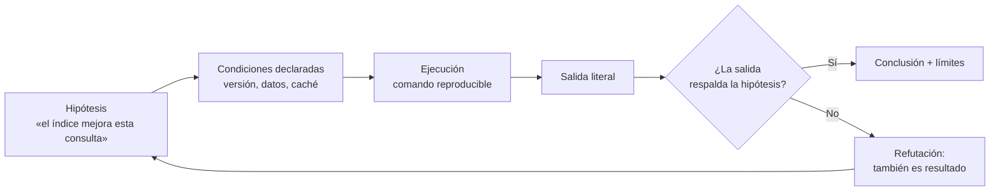

## Propósito

Montar un entorno donde toda afirmación sobre datos pueda comprobarse por otra persona. En bases de datos, «a mí me funciona» es una afirmación especialmente débil: el resultado depende de la versión, la configuración, los datos previos y el estado del caché.

## Resultados de aprendizaje

Al terminar podrás:

1. Ejecutar el laboratorio base sin instalar ningún servidor.
2. Levantar motores por perfiles con Docker Compose, sin arrancarlos todos.
3. Distinguir evidencia de captura de pantalla, y saber qué debe acompañar a un resultado.
4. Escribir una comprobación de invariante que falle cuando el dato está mal.
5. Explicar por qué una medición sin condiciones declaradas no sirve para decidir.

## Fundamentos

### El núcleo sin dependencias

SQLite permite estudiar un gestor completo sin instalar nada: es una biblioteca que se enlaza al proceso, con soporte para transacciones, índices, planes de ejecución y registro anticipado. La biblioteca estándar de Python la expone en `sqlite3`, conforme a la especificación PEP 249.

Eso da una propiedad valiosa para un programa formativo: **el primer laboratorio no puede fallar por instalación**. Si `python labs/01-sql-foundations/run_lab.py` no corre, el problema está en el código, no en el entorno.

### Los motores con contenedores

El resto de los motores llega por Docker Compose, organizado en **perfiles** para no levantar diez servicios a la vez:

```bash
docker compose --profile relational up -d
docker compose --profile document   up -d
docker compose --profile cache      up -d
```

Dos reglas del repositorio, ambas de seguridad:

- Las credenciales del `compose` son locales y están escritas a la vista. Nunca se copian a otro entorno.
- Los servicios no publican puertos hacia fuera de la máquina más allá de lo necesario para el laboratorio.

### Qué es evidencia

El libro de SRE de Google formula el criterio que aquí adoptamos: una afirmación operativa vale lo que vale su medición, y una medición vale lo que valen sus condiciones declaradas. Aplicado a este programa, una evidencia válida incluye:

| Elemento | Por qué sin él la evidencia se cae |
|---|---|
| Comando exacto | Sin él, nadie puede repetir |
| Versión del motor | El plan y la semántica cambian entre versiones |
| Datos de entrada (o su semilla) | Un resultado sobre otros datos no es el mismo resultado |
| Salida literal, no resumida | El resumen ya es una interpretación |
| Estado previo (caché frío o caliente) | Cambia el tiempo en órdenes de magnitud |
| Qué **no** demuestra | Evita extrapolar una demo a producción |

Una captura de pantalla sin comando no es evidencia: no se puede repetir.



### Invariantes: la prueba que sí falla

Una prueba que siempre pasa no informa. En datos, la forma útil es la **invariante**: una propiedad que debe cumplirse siempre y que se comprueba con una consulta que devuelve cero filas cuando todo está bien.

```sql
-- Invariante: ninguna inscripción apunta a un curso inexistente.
SELECT e.id
FROM enrollments e
LEFT JOIN courses c ON c.id = e.course_id
WHERE c.id IS NULL;
```

Si esa consulta devuelve filas, el dato está mal y el nombre de la invariante dice exactamente qué se rompió.

## Ejemplo trabajado

Comprobemos que el dominio canónico del repositorio cumple lo que promete.

```bash
python scripts/validate_repository.py
python labs/01-sql-foundations/run_lab.py
```

El laboratorio carga el esquema y los datos en SQLite **en memoria**, ejecuta consultas y comprueba invariantes. Tres decisiones de diseño, con su razón:

1. **En memoria.** No deja archivos entre ejecuciones, así que la ejecución número 20 es idéntica a la número 1. Un laboratorio que acumula estado produce resultados que dependen del historial de quien lo ejecuta.
2. **Datos fijos, no aleatorios.** Con 4 estudiantes conocidos, el resultado esperado se puede escribir a mano y contrastar. Los datos aleatorios sin semilla producen fallos irreproducibles.
3. **Comprobación de claves foráneas.** `PRAGMA foreign_key_check` detecta referencias colgantes que un `SELECT` normal no muestra.

Ejemplo de traza de evidencia bien formada:

```text
Comando   : python labs/01-sql-foundations/run_lab.py
Python    : 3.12.9
SQLite    : 3.45.1   (SELECT sqlite_version();)
Datos     : reference-data/school/seed.sqlite.sql (4 estudiantes, 3 cursos)
Estado    : base en memoria, recién creada
Salida    : LAB_OK  filas=4  invariantes=3/3
No demuestra: nada sobre concurrencia ni sobre volumen; el conjunto cabe en una página
```

La última línea es la que distingue un informe honesto de uno vendedor. El laboratorio demuestra que las consultas son correctas sobre datos pequeños; **no** demuestra nada sobre rendimiento, concurrencia ni durabilidad.

## Comparación

| Enfoque | Reproducible | Coste de arranque | Qué permite estudiar |
|---|---|---|---|
| SQLite en memoria | Total | Ninguno | SQL, planes, transacciones de una sesión |
| SQLite en archivo | Alto | Ninguno | Además: WAL, durabilidad, recuperación |
| Contenedor con perfil | Alto si se fija la etiqueta | Minutos | Concurrencia real, réplica, dialectos |
| Servidor instalado a mano | Bajo | Alto | Nada que no permitan los anteriores |
| Servicio gestionado en la nube | Bajo, y con costo | Variable | Operación real; mal sitio para aprender |

## Errores frecuentes

1. **Usar la etiqueta `latest` en el `compose`.** El mismo archivo produce entornos distintos según el día. Fija la versión.
2. **Medir sobre una base con caché caliente y llamarlo mejora.** Declara siempre si la ejecución fue en frío.
3. **Datos aleatorios sin semilla.** El fallo aparece una vez y no vuelve; es el peor tipo de fallo.
4. **Confundir «la prueba pasa» con «el sistema es correcto».** Una prueba que nunca ha fallado puede estar comprobando la nada. Rómpela a propósito una vez.
5. **Copiar las credenciales del laboratorio a otro entorno.** Son públicas: están en un archivo versionado.

## De la clase a la operación

El mismo criterio de evidencia sirve en un incidente real: quien afirma «la consulta empeoró tras el despliegue» necesita el plan antes, el plan después, la versión y el volumen. Sin eso, la conversación se decide por antigüedad en la empresa y no por datos.

## Reto de transferencia

1. Añade al laboratorio una invariante nueva que hoy no se comprueba y que sea cierta en el dominio.
2. Rómpela a propósito modificando los datos y captura la salida que la delata.
3. Restaura y vuelve a ejecutar, mostrando que la salida vuelve al estado correcto.
4. Escribe el informe de evidencia con las seis filas de la tabla de la sección de fundamentos.

## Preguntas de evaluación

1. ¿Por qué una base en memoria produce ejecuciones más comparables que una en archivo?
2. Un compañero muestra un tiempo de 3 ms como prueba de que su índice funciona. ¿Qué tres datos le pedirías antes de aceptarlo?
3. Escribe una invariante del dominio que no pueda expresarse como clave foránea, y la consulta que la comprueba.
4. ¿Qué afirmación *no* puede sostenerse con el laboratorio base, por bien que se ejecute?
