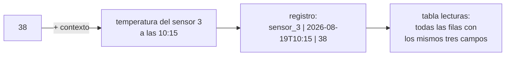

# 001 — Qué es un dato, un registro y una tabla

> [Programa](../../../README.md) · [Parte 00](../README.md) · [Siguiente →](../../part-00-primeros-pasos-del-archivo-a-la-base-de-datos/002-del-archivo-y-la-hoja-de-calculo-a-la-base-de-datos/README.md)

Parte 00 — Primeros pasos: del archivo a la base de datos · Fundamentos ·
2 horas estimadas · motores `sqlite`, `duckdb`, `postgresql`, `mongodb`, `redis` · laboratorio
[`labs/01-sql-foundations`](../../../labs/01-sql-foundations/README.md) · 3 fuentes.

**Conceptos centrales:** `dato` · `información` · `registro` · `campo` · `tabla`

**En este caso se comparan 6 motores**: 5 lo resuelven (5 con el resultado comprobado por máquina) y 1 no, con el motivo escrito.

---

## Propósito

Poner nombre a las tres cosas de las que se habla todo el rato en este programa
—dato, registro y tabla— y, sobre todo, entender **por qué se separan**. Casi
todos los errores de diseño que se estudiarán más adelante empiezan en una
confusión de este nivel: meter dos hechos en un mismo dato, o guardar como texto
algo que era un número, o llamar tabla a una lista que no lo es.

## Resultados de aprendizaje

Al terminar podrás:

1. Distinguir un **dato** de la **información** que produce al interpretarlo.
2. Identificar en un caso real cuáles son los registros y cuáles los campos.
3. Explicar por qué una tabla exige que **todas** las filas tengan la misma forma.
4. Detectar un campo que en realidad guarda dos hechos y separarlo.
5. Nombrar la fuente de cada afirmación anterior.

## Fundamentos

### Dato no es lo mismo que información

`38` es un dato. No significa nada por sí solo: puede ser una edad, una
temperatura, un número de camiseta o los grados de una fiebre. Se convierte en
**información** cuando se le añade contexto: *la temperatura del sensor 3 a las
10:15 fue de 38 grados*.

Esa distinción no es filosofía. Es la razón de que una base de datos guarde
siempre el dato **junto a su contexto**: de qué es, de cuándo, de quién. Un
número suelto en una celda es una promesa de confusión futura.

William Kent, en *Data and Reality*, lleva la idea más lejos: ningún modelo
captura el mundo, siempre se elige un recorte, y ese recorte es una decisión
humana que el sistema no puede tomar. Guardar «la dirección de un cliente»
obliga a decidir antes si un cliente tiene una dirección o varias, si la
dirección de facturación es la misma que la de envío, y qué pasa cuando se muda.

### El registro: un hecho completo

Un **registro** —una fila— es un hecho completo sobre una cosa. No medio hecho,
ni dos.

| Lo que se guarda | ¿Es un registro? |
|---|---|
| `Ada Lovelace` | No: es un dato suelto, falta de qué es |
| `Ada Lovelace, ada@example.org, 2026-03-01` | Sí: una estudiante, con su correo y su fecha de alta |
| `Ada Lovelace, ada@example.org, DB-101, SE-201` | No: mezcla dos hechos —quién es y en qué cursos está |

La última fila es el error más común de quien viene de una hoja de cálculo, y
tiene nombre: se estudiará como **primera forma normal** más adelante. De
momento basta la regla práctica: *si para leer un campo hay que partirlo por
comas, ese campo esconde varios hechos*.

### El campo: un dato con nombre y con tipo

Cada columna de la tabla es un **campo**, y un campo tiene tres cosas: un
nombre, un tipo y —a veces— una regla. `correo` es el nombre, texto es el tipo,
«no puede repetirse» es la regla. El nombre dice qué significa el dato, el tipo
dice qué valores son posibles y la regla dice cuáles son admisibles.

Hernández, en *Database Design for Mere Mortals*, insiste en un detalle que
parece menor y no lo es: **el nombre del campo debe describir el dato, no su
uso**. `fecha_1` y `fecha_2` son nombres que dentro de seis meses no significan
nada; `fecha_alta` y `fecha_baja` siguen significando lo mismo.

### La tabla: todas las filas con la misma forma

Una **tabla** es un conjunto de registros que tienen exactamente los mismos
campos. Esa uniformidad es lo que permite preguntar «dame los estudiantes dados
de alta en marzo» sin mirar fila por fila qué campos trae cada una.

Y es la diferencia más visible con una hoja de cálculo: en una hoja, la fila 12
puede tener una columna más «porque ese caso era especial». En una tabla, no. Si
un caso necesita otros campos, es que es **otra cosa** y va en otra tabla.



## Ejemplo trabajado

Una academia lleva sus estudiantes en una hoja de cálculo:

| Nombre | Contacto | Cursos |
|---|---|---|
| Ada Lovelace | ada@example.org / +56 9 1111 | DB-101, SE-201 |
| Linus Torvalds | linus@example.org | DB-101 |
| Grace Hopper | (sin correo) | |

**Qué está mal, campo por campo.**

- **`Contacto`** guarda dos hechos distintos —correo y teléfono— separados por
  una barra. Para buscar «quién tiene teléfono» hay que partir el texto, y en la
  fila de Linus no hay barra: el mismo campo tiene dos formatos.
- **`Cursos`** guarda una lista. Contar cuántos estudiantes hay en DB-101 exige
  buscar una subcadena, y basta que alguien escriba `DB101` sin guion para que
  ese estudiante desaparezca del recuento.
- **`(sin correo)`** es texto que significa «no hay dato». Y es peligroso: si
  mañana alguien busca los correos que contienen «sin», Grace aparecerá.

**La versión con tablas.**

```text
estudiantes
  id | nombre          | correo             | telefono
   1 | Ada Lovelace    | ada@example.org    | +56 9 1111
   2 | Linus Torvalds  | linus@example.org  | (vacío)
   3 | Grace Hopper    | (vacío)            | (vacío)

inscripciones
  estudiante_id | curso
              1 | DB-101
              1 | SE-201
              2 | DB-101
```

Tres cambios, y cada uno resuelve un problema concreto: el contacto se parte en
dos campos con nombre propio, la lista de cursos se convierte en **una fila por
inscripción**, y la ausencia de dato deja de escribirse con palabras.

Ahora «cuántos estudiantes hay en DB-101» es contar filas, no buscar texto. Y
Grace aparece en la tabla de estudiantes aunque no tenga ninguna inscripción,
que es exactamente lo que ocurre en la realidad.

## Errores frecuentes

1. **Guardar varios hechos en un campo.** Nombre completo, dirección entera,
   lista separada por comas. Se detecta preguntando: ¿para usar esto tengo que
   partirlo?
2. **Escribir la ausencia de dato con palabras.** `(sin correo)`, `N/A`, `-`,
   `0`. Cada una obliga a recordarla al consultar, y nadie las recuerda todas.
3. **Nombres de campo que describen la posición y no el dato.** `campo_3`,
   `columna_extra`, `dato`.
4. **Filas con forma distinta.** «Esta fila también lleva el nombre del tutor,
   porque era un caso especial.» Ese caso especial es otra tabla.
5. **Confundir el dato con su presentación.** `$1.234,50` no es un número: es un
   número ya formateado. El formato se aplica al mostrarlo, no al guardarlo.

## Ejemplo de transferencia

Un campo que parece uno y son dos aparece en casi cualquier sistema real:
`nombre_completo`, `direccion`, `periodo` (`2026-Q1`), `version` (`3.2.1`). En
todos, la pregunta es la misma: ¿alguien va a querer buscar, ordenar o contar
por una de las partes? Si la respuesta es sí, son campos distintos.

## Reto de transferencia

1. Busca una hoja de cálculo real —tuya o de tu trabajo— con al menos veinte
   filas.
2. Señala cada campo que guarde más de un hecho y escribe en qué campos se
   partiría.
3. Señala cada forma distinta de decir «no hay dato» que aparezca, y cuenta
   cuántas hay.
4. Dibuja las tablas que sustituirían a la hoja, y explica qué pregunta se
   vuelve fácil con cada cambio.

## Preguntas de evaluación

1. Da un ejemplo propio de un dato que sin contexto pueda significar tres cosas
   distintas.
2. ¿Por qué una tabla exige que todas las filas tengan los mismos campos? ¿Qué
   se rompe si no es así?
3. Un campo `telefono` guarda `+56 9 1111 / +56 2 2222` para algunos clientes.
   ¿Qué consulta empieza a fallar y por qué?
4. Explica por qué `(sin correo)` es peor que dejar el campo vacío.

---

## 🌐 El mismo problema en cada motor

**Caso:** Una fila por hecho, en vez de una lista dentro de una celda

La hoja de cálculo guardaba los cursos de cada estudiante en una sola celda:
`DB-101, SE-201`. Aquí cada inscripción es **una fila**, y esa diferencia lo
cambia todo: contar cuántos estudiantes hay en DB-101 pasa de ser una
búsqueda de texto —que falla si alguien escribe `DB101` sin guion— a ser un
recuento de filas.

El caso guarda tres inscripciones de dos estudiantes y las devuelve
ordenadas. Es la operación más elemental del programa, y sirve para ver que
la idea de «un hecho por registro» no es exclusiva del modelo relacional:
cada familia de motores la expresa a su manera.

Salida esperada, idéntica en todos los motores que lo resuelven:

| estudiante | curso |
|---|---|
| `Ada` | `DB-101` |
| `Ada` | `SE-201` |
| `Linus` | `DB-101` |

El contrato vive en [`motores.yaml`](motores.yaml) y lo comprueba
`python scripts/verificar_equivalencia.py --clase 001`: 5 de
las 5 implementaciones se ejecutan de verdad y su
resultado se compara con esa tabla; el resto se declara como material revisado,
no ejecutado.

| Motor | ¿Resuelve el caso? | Nivel de prueba | Código | Fuente |
|---|---|---|---|---|
| SQLite | sí | núcleo | [código](implementaciones/sqlite/consulta.sql) | [doc oficial](https://sqlite.org/lang_createtable.html) |
| DuckDB | sí | núcleo | [código](implementaciones/duckdb/consulta.sql) | [doc oficial](https://duckdb.org/docs/stable/sql/statements/create_table) |
| PostgreSQL | sí | servicio | [código](implementaciones/postgresql/consulta.sql) | [doc oficial](https://www.postgresql.org/docs/current/sql-createtable.html) |
| MongoDB | sí | servicio | [código](implementaciones/mongodb/consulta.js) | [doc oficial](https://www.mongodb.com/docs/manual/core/document/) |
| Redis | sí | servicio | [código](implementaciones/redis/consulta.txt) | [doc oficial](https://redis.io/docs/latest/develop/data-types/sets/) |
| Apache Cassandra | **no** | — | — | [doc oficial](https://cassandra.apache.org/doc/latest/cassandra/developing/data-modeling/intro.html) |

### Los que resuelven el caso

#### SQLite · [`implementaciones/sqlite/consulta.sql`](implementaciones/sqlite/consulta.sql)

✅ **verificado** — se ejecuta en CI sin servicios

```sql
-- motor: sqlite
-- doc: https://sqlite.org/lang_createtable.html
-- nota: la clave primaria compuesta impide que la misma inscripcion se guarde
--       dos veces. En una hoja de calculo, nada lo impide.

-- === preparacion ===
-- Un hecho por fila. La hoja de calculo guardaba «DB-101, SE-201» en una
-- celda; aqui cada inscripcion es una fila propia, y contar deja de ser buscar
-- texto.
CREATE TABLE inscripciones (
    estudiante TEXT NOT NULL,
    curso      TEXT NOT NULL,
    PRIMARY KEY (estudiante, curso)
);
INSERT INTO inscripciones (estudiante, curso) VALUES
    ('Ada',   'DB-101'),
    ('Ada',   'SE-201'),
    ('Linus', 'DB-101');

-- === consulta ===
SELECT estudiante, curso FROM inscripciones ORDER BY estudiante, curso;
```

- **Por qué sí:** Es el motor con menos ceremonia posible: viene con Python, no hay servidor que levantar y una base de datos es un archivo. Para la primera hora de trabajo, no hay nada que estorbe menos.
- **Por qué no:** Esa misma comodidad esconde lo que un motor con servidor aporta —usuarios, permisos, conexiones remotas—, así que conviene no confundir «funciona en mi máquina» con «sirve para un sistema».
- 📄 Documentación oficial: <https://sqlite.org/lang_createtable.html>

#### DuckDB · [`implementaciones/duckdb/consulta.sql`](implementaciones/duckdb/consulta.sql)

✅ **verificado** — se ejecuta en CI sin servicios

```sql
-- motor: duckdb
-- doc: https://duckdb.org/docs/stable/sql/statements/create_table
-- nota: la misma sentencia, otro motor. Lo que se aprende aqui no es de un
--       producto: es SQL.

-- === preparacion ===
-- Un hecho por fila. La hoja de calculo guardaba «DB-101, SE-201» en una
-- celda; aqui cada inscripcion es una fila propia, y contar deja de ser buscar
-- texto.
CREATE TABLE inscripciones (
    estudiante VARCHAR NOT NULL,
    curso      VARCHAR NOT NULL,
    PRIMARY KEY (estudiante, curso)
);
INSERT INTO inscripciones (estudiante, curso) VALUES
    ('Ada',   'DB-101'),
    ('Ada',   'SE-201'),
    ('Linus', 'DB-101');

-- === consulta ===
SELECT estudiante, curso FROM inscripciones ORDER BY estudiante, curso;
```

- **Por qué sí:** Acepta el mismo SQL y permite comprobar desde el primer día que lo que se aprende no es de un producto: la misma sentencia funciona en otro motor con otra arquitectura por debajo.
- **Por qué no:** Está pensado para analizar datos, no para registrarlos: aquí sirve para comparar, no para guardar la verdad de nada.
- 📄 Documentación oficial: <https://duckdb.org/docs/stable/sql/statements/create_table>

#### PostgreSQL · [`implementaciones/postgresql/consulta.sql`](implementaciones/postgresql/consulta.sql)

✅ **verificado** — se ejecuta contra el motor real levantado con `docker compose`

```sql
-- motor: postgresql
-- doc: https://www.postgresql.org/docs/current/sql-createtable.html
-- nota: identica a la de SQLite salvo el nombre del tipo. La diferencia esta
--       fuera de la sentencia: aqui hay un servidor, un usuario y una conexion.

-- === preparacion ===
DROP TABLE IF EXISTS inscripciones;

-- Un hecho por fila. La hoja de calculo guardaba «DB-101, SE-201» en una
-- celda; aqui cada inscripcion es una fila propia, y contar deja de ser buscar
-- texto.
CREATE TABLE inscripciones (
    estudiante text NOT NULL,
    curso      text NOT NULL,
    PRIMARY KEY (estudiante, curso)
);
INSERT INTO inscripciones (estudiante, curso) VALUES
    ('Ada',   'DB-101'),
    ('Ada',   'SE-201'),
    ('Linus', 'DB-101');

-- === consulta ===
SELECT estudiante, curso FROM inscripciones ORDER BY estudiante, curso;
```

- **Por qué sí:** Es la misma sentencia contra un servidor real, con usuarios y conexiones: sirve para ver que el SQL no cambia por tener infraestructura detrás.
- **Por qué no:** Para tres filas es maquinaria de sobra: hay que instalarlo, arrancarlo y conectarse. Empezar aquí añade obstáculos que no enseñan nada sobre datos.
- 📄 Documentación oficial: <https://www.postgresql.org/docs/current/sql-createtable.html>

#### MongoDB · [`implementaciones/mongodb/consulta.js`](implementaciones/mongodb/consulta.js)

✅ **verificado** — se ejecuta contra el motor real levantado con `docker compose`

```javascript
// motor: mongodb
// doc: https://www.mongodb.com/docs/manual/core/document/
// nota: aqui no se declara ninguna estructura antes de escribir. Es comodo, y
//       tiene precio: nada impide que el documento siguiente traiga otros
//       campos o el curso escrito de otra forma.

// === preparacion ===
db.inscripciones.drop();
db.inscripciones.insertMany([
  { estudiante: "Ada", curso: "DB-101" },
  { estudiante: "Ada", curso: "SE-201" },
  { estudiante: "Linus", curso: "DB-101" },
]);

// === consulta ===
db.inscripciones
  .find({}, { _id: 0, estudiante: 1, curso: 1 })
  .sort({ estudiante: 1, curso: 1 })
  .forEach((d) => print(d.estudiante + "|" + d.curso));
```

- **Por qué sí:** Muestra que «un hecho por registro» no depende de las tablas: aquí cada inscripción es un documento, sin declarar antes ninguna estructura.
- **Por qué no:** Al no declarar la estructura, nada impide que el documento siguiente traiga otros campos o el curso escrito de otra forma. La disciplina que en una tabla impone el esquema, aquí la tiene que poner el código.
- 📄 Documentación oficial: <https://www.mongodb.com/docs/manual/core/document/>

#### Redis · [`implementaciones/redis/consulta.txt`](implementaciones/redis/consulta.txt)

✅ **verificado** — se ejecuta contra el motor real levantado con `docker compose`

```text
# motor: redis
# doc: https://redis.io/docs/latest/develop/data-types/sets/
# nota: un conjunto no admite repetidos, asi que «un hecho, una vez» sale gratis.
#       El precio esta a la vista: el par estudiante-curso hay que serializarlo
#       en una cadena, y con eso desaparecen los campos. Pedir «los cursos de
#       Ada» obligaria a partir el texto otra vez.

# === preparacion ===
FLUSHDB
SADD inscripciones Ada|DB-101
SADD inscripciones Ada|SE-201
SADD inscripciones Linus|DB-101
SADD inscripciones Ada|DB-101

# === consulta ===
SORT inscripciones ALPHA
```

- **Por qué sí:** Un conjunto guarda elementos sin repetir, así que la idea de «un hecho, una vez» se ve en su forma más pura: `SADD` del mismo par dos veces no crea dos entradas.
- **Por qué no:** El par estudiante-curso hay que serializarlo en una sola cadena (`Ada|DB-101`), y con eso desaparecen los campos: no se puede pedir «los cursos de Ada» sin volver a partir el texto, que era justo el problema del que se venía huyendo.
- 📄 Documentación oficial: <https://redis.io/docs/latest/develop/data-types/sets/>

### Los que no resuelven este caso — y qué se hace en su lugar

Descartar un motor con un argumento es tan formativo como usarlo. Ninguna de estas filas dice que el motor sea peor: dice que este problema no es el suyo.

| Motor | Por qué no | Qué se hace en su lugar | Fuente |
|---|---|---|---|
| Apache Cassandra | Resolvería el caso sin dificultad, pero exige decidir de antemano la clave de partición —es decir, por qué pregunta se va a consultar— y esa decisión no se puede tomar en la primera clase, cuando todavía no se sabe qué preguntas habrá. | Se estudia en la parte de columnas anchas, donde la pregunta «¿qué consultas va a tener este dato?» ya se sabe contestar. | [doc](https://cassandra.apache.org/doc/latest/cassandra/developing/data-modeling/intro.html) |

---

## Laboratorio

```bash
python scripts/validate_repository.py
python labs/01-sql-foundations/run_lab.py
```

Guarda como evidencia la salida completa, la versión del motor y la semilla o
los parámetros usados. Una captura sin comando no es evidencia: no se puede
repetir.

## Evaluación

| Criterio | Peso | Qué se comprueba |
|---|---:|---|
| Comprensión conceptual | 25 % | Explica el mecanismo, no solo el resultado |
| Ejecución reproducible | 25 % | Otra persona obtiene lo mismo con las instrucciones dadas |
| Interpretación basada en evidencia | 25 % | Cada conclusión se apoya en una salida o una medición |
| Límites y riesgos declarados | 25 % | Dice qué no demuestra el ejercicio y qué faltaría en producción |

La clase se da por superada cuando la respuesta explica el mecanismo, muestra
la salida que la respalda y declara al menos un límite del ejercicio.

## Fuentes de esta clase

Todo lo afirmado arriba procede de estas obras. Los identificadores viven en
[`catalog/sources.json`](../../../catalog/sources.json) y el estado de los
enlaces se comprueba con `python scripts/check_external_links.py`.

- **William Kent** (2012). [Data and Reality](https://technicspub.com/data-and-reality/). 3.a ed. Technics Publications. ISBN 978-1-935504-21-4.  
  Por qué ningún modelo captura el mundo: fuente del criterio de alcance del programa.
- **Michael J. Hernandez** (2020). [Database Design for Mere Mortals](https://www.informit.com/store/database-design-for-mere-mortals-a-hands-on-guide-to-9780136788041). 4.a ed. Addison-Wesley. ISBN 978-0-13-678804-1.  
  Método de diseño paso a paso, independiente de producto.
- **Ramez Elmasri, Shamkant B. Navathe** (2015). [Fundamentals of Database Systems](https://www.pearson.com/en-us/subject-catalog/p/fundamentals-of-database-systems/P200000003546). 7.a ed. Pearson. ISBN 978-0-13-397077-7.  
  Modelado entidad-relación tratado con más detalle que en otros manuales.

---

> [Programa](../../../README.md) · [Parte 00](../README.md) · [Siguiente →](../../part-00-primeros-pasos-del-archivo-a-la-base-de-datos/002-del-archivo-y-la-hoja-de-calculo-a-la-base-de-datos/README.md)
