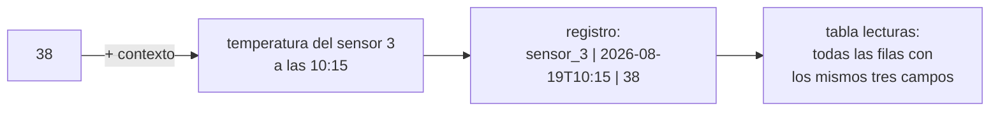

## Propósito

Poner nombre a las tres cosas de las que se habla todo el rato en este programa
—dato, registro y tabla— y, sobre todo, entender **por qué se separan**. Casi
todos los errores de diseño que se estudiarán más adelante empiezan en una
confusión de este nivel: meter dos hechos en un mismo dato, o guardar como texto
algo que era un número, o llamar tabla a una lista que no lo es.

## Resultados de aprendizaje

Al terminar podrás:

1. Distinguir un **dato** de la **información** que produce al interpretarlo.
2. Identificar en un caso real cuáles son los registros y cuáles los campos.
3. Explicar por qué una tabla exige que **todas** las filas tengan la misma forma.
4. Detectar un campo que en realidad guarda dos hechos y separarlo.
5. Nombrar la fuente de cada afirmación anterior.

## Fundamentos

### Dato no es lo mismo que información

`38` es un dato. No significa nada por sí solo: puede ser una edad, una
temperatura, un número de camiseta o los grados de una fiebre. Se convierte en
**información** cuando se le añade contexto: *la temperatura del sensor 3 a las
10:15 fue de 38 grados*.

Esa distinción no es filosofía. Es la razón de que una base de datos guarde
siempre el dato **junto a su contexto**: de qué es, de cuándo, de quién. Un
número suelto en una celda es una promesa de confusión futura.

William Kent, en *Data and Reality*, lleva la idea más lejos: ningún modelo
captura el mundo, siempre se elige un recorte, y ese recorte es una decisión
humana que el sistema no puede tomar. Guardar «la dirección de un cliente»
obliga a decidir antes si un cliente tiene una dirección o varias, si la
dirección de facturación es la misma que la de envío, y qué pasa cuando se muda.

### El registro: un hecho completo

Un **registro** —una fila— es un hecho completo sobre una cosa. No medio hecho,
ni dos.

| Lo que se guarda | ¿Es un registro? |
|---|---|
| `Ada Lovelace` | No: es un dato suelto, falta de qué es |
| `Ada Lovelace, ada@example.org, 2026-03-01` | Sí: una estudiante, con su correo y su fecha de alta |
| `Ada Lovelace, ada@example.org, DB-101, SE-201` | No: mezcla dos hechos —quién es y en qué cursos está |

La última fila es el error más común de quien viene de una hoja de cálculo, y
tiene nombre: se estudiará como **primera forma normal** más adelante. De
momento basta la regla práctica: *si para leer un campo hay que partirlo por
comas, ese campo esconde varios hechos*.

### El campo: un dato con nombre y con tipo

Cada columna de la tabla es un **campo**, y un campo tiene tres cosas: un
nombre, un tipo y —a veces— una regla. `correo` es el nombre, texto es el tipo,
«no puede repetirse» es la regla. El nombre dice qué significa el dato, el tipo
dice qué valores son posibles y la regla dice cuáles son admisibles.

Hernández, en *Database Design for Mere Mortals*, insiste en un detalle que
parece menor y no lo es: **el nombre del campo debe describir el dato, no su
uso**. `fecha_1` y `fecha_2` son nombres que dentro de seis meses no significan
nada; `fecha_alta` y `fecha_baja` siguen significando lo mismo.

### La tabla: todas las filas con la misma forma

Una **tabla** es un conjunto de registros que tienen exactamente los mismos
campos. Esa uniformidad es lo que permite preguntar «dame los estudiantes dados
de alta en marzo» sin mirar fila por fila qué campos trae cada una.

Y es la diferencia más visible con una hoja de cálculo: en una hoja, la fila 12
puede tener una columna más «porque ese caso era especial». En una tabla, no. Si
un caso necesita otros campos, es que es **otra cosa** y va en otra tabla.



## Ejemplo trabajado

Una academia lleva sus estudiantes en una hoja de cálculo:

| Nombre | Contacto | Cursos |
|---|---|---|
| Ada Lovelace | ada@example.org / +56 9 1111 | DB-101, SE-201 |
| Linus Torvalds | linus@example.org | DB-101 |
| Grace Hopper | (sin correo) | |

**Qué está mal, campo por campo.**

- **`Contacto`** guarda dos hechos distintos —correo y teléfono— separados por
  una barra. Para buscar «quién tiene teléfono» hay que partir el texto, y en la
  fila de Linus no hay barra: el mismo campo tiene dos formatos.
- **`Cursos`** guarda una lista. Contar cuántos estudiantes hay en DB-101 exige
  buscar una subcadena, y basta que alguien escriba `DB101` sin guion para que
  ese estudiante desaparezca del recuento.
- **`(sin correo)`** es texto que significa «no hay dato». Y es peligroso: si
  mañana alguien busca los correos que contienen «sin», Grace aparecerá.

**La versión con tablas.**

```text
estudiantes
  id | nombre          | correo             | telefono
   1 | Ada Lovelace    | ada@example.org    | +56 9 1111
   2 | Linus Torvalds  | linus@example.org  | (vacío)
   3 | Grace Hopper    | (vacío)            | (vacío)

inscripciones
  estudiante_id | curso
              1 | DB-101
              1 | SE-201
              2 | DB-101
```

Tres cambios, y cada uno resuelve un problema concreto: el contacto se parte en
dos campos con nombre propio, la lista de cursos se convierte en **una fila por
inscripción**, y la ausencia de dato deja de escribirse con palabras.

Ahora «cuántos estudiantes hay en DB-101» es contar filas, no buscar texto. Y
Grace aparece en la tabla de estudiantes aunque no tenga ninguna inscripción,
que es exactamente lo que ocurre en la realidad.

## Errores frecuentes

1. **Guardar varios hechos en un campo.** Nombre completo, dirección entera,
   lista separada por comas. Se detecta preguntando: ¿para usar esto tengo que
   partirlo?
2. **Escribir la ausencia de dato con palabras.** `(sin correo)`, `N/A`, `-`,
   `0`. Cada una obliga a recordarla al consultar, y nadie las recuerda todas.
3. **Nombres de campo que describen la posición y no el dato.** `campo_3`,
   `columna_extra`, `dato`.
4. **Filas con forma distinta.** «Esta fila también lleva el nombre del tutor,
   porque era un caso especial.» Ese caso especial es otra tabla.
5. **Confundir el dato con su presentación.** `$1.234,50` no es un número: es un
   número ya formateado. El formato se aplica al mostrarlo, no al guardarlo.

## Ejemplo de transferencia

Un campo que parece uno y son dos aparece en casi cualquier sistema real:
`nombre_completo`, `direccion`, `periodo` (`2026-Q1`), `version` (`3.2.1`). En
todos, la pregunta es la misma: ¿alguien va a querer buscar, ordenar o contar
por una de las partes? Si la respuesta es sí, son campos distintos.

## Reto de transferencia

1. Busca una hoja de cálculo real —tuya o de tu trabajo— con al menos veinte
   filas.
2. Señala cada campo que guarde más de un hecho y escribe en qué campos se
   partiría.
3. Señala cada forma distinta de decir «no hay dato» que aparezca, y cuenta
   cuántas hay.
4. Dibuja las tablas que sustituirían a la hoja, y explica qué pregunta se
   vuelve fácil con cada cambio.

## Preguntas de evaluación

1. Da un ejemplo propio de un dato que sin contexto pueda significar tres cosas
   distintas.
2. ¿Por qué una tabla exige que todas las filas tengan los mismos campos? ¿Qué
   se rompe si no es así?
3. Un campo `telefono` guarda `+56 9 1111 / +56 2 2222` para algunos clientes.
   ¿Qué consulta empieza a fallar y por qué?
4. Explica por qué `(sin correo)` es peor que dejar el campo vacío.
