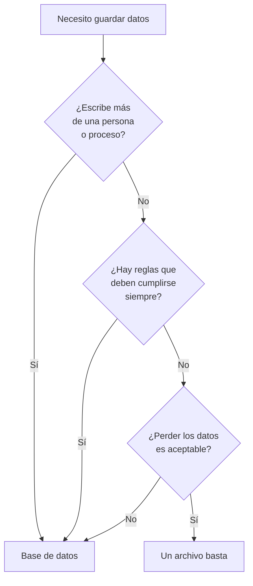

# 002 — Del archivo y la hoja de cálculo a la base de datos

> [Programa](../../../README.md) · [Parte 00](../README.md) · [← Anterior](../../part-00-primeros-pasos-del-archivo-a-la-base-de-datos/001-que-es-un-dato-un-registro-y-una-tabla/README.md) · [Siguiente →](../../part-00-primeros-pasos-del-archivo-a-la-base-de-datos/003-tu-primera-base-de-datos/README.md)

Parte 00 — Primeros pasos: del archivo a la base de datos · Fundamentos ·
2 horas estimadas · motores `sqlite`, `duckdb`, `postgresql`, `mongodb` · laboratorio
[`labs/01-sql-foundations`](../../../labs/01-sql-foundations/README.md) · 3 fuentes.

**Conceptos centrales:** `integridad declarada` · `concurrencia` · `consulta declarativa` · `durabilidad`

**En este caso se comparan 6 motores**: 4 lo resuelven (4 con el resultado comprobado por máquina) y 2 no, con el motivo escrito.

---

## Propósito

Responder con precisión a la pregunta que casi nadie hace en voz alta: **si la
hoja de cálculo funciona, ¿para qué una base de datos?** La respuesta no es «es
más profesional». Son cuatro cosas concretas que una hoja no puede hacer y que
se pueden nombrar, una por una.

## Resultados de aprendizaje

Al terminar podrás:

1. Nombrar las cuatro cosas que una base de datos hace y un archivo no.
2. Reproducir mentalmente la anomalía de la escritura perdida en dos hojas
   abiertas a la vez.
3. Decidir, con un criterio explícito, si un caso concreto necesita base de datos.
4. Explicar por qué un archivo CSV compartido no es una solución intermedia.
5. Nombrar la fuente de cada afirmación anterior.

## Fundamentos

### Lo que sí hace bien una hoja de cálculo

Conviene empezar por aquí, porque el desprecio a la hoja de cálculo es tan común
como injustificado. Una hoja es **inmejorable** para: explorar datos que no
conoces, hacer un cálculo puntual, prototipar un modelo antes de escribirlo, y
enseñar un resultado a alguien sin instalarle nada.

Millones de decisiones importantes se toman cada día con hojas de cálculo, y eso
no va a cambiar. El problema no es la herramienta: es usarla como **sistema de
registro**, es decir, como el sitio donde vive la verdad de un negocio que crece.

### Las cuatro cosas que una hoja no puede hacer

**1. Impedir un dato imposible.** En una hoja, la celda de la nota admite `130`,
`ochenta` y una cara sonriente. Se pueden poner validaciones, y se saltan al
pegar. En una base de datos, la regla vive **con el dato** y la aplica el motor a
todo el que escriba, incluido el que se conecta por consola.

**2. Dejar que dos personas escriban a la vez sin perder nada.** Dos copias de
la misma hoja abiertas, dos ediciones distintas, una se guarda encima de la otra:
la primera desaparece sin aviso. Se llama **actualización perdida**, y es el caso
que se estudiará a fondo en la parte de transacciones. Un motor de base de datos
existe, en buena medida, para que eso no ocurra.

**3. Responder preguntas que nadie previó.** En una hoja, cada pregunta nueva es
una fórmula nueva o una tabla dinámica nueva. En una base de datos se escribe una
consulta y el motor decide cómo resolverla. Esa separación entre **qué se quiere**
y **cómo se obtiene** es la idea central del artículo de Codd (1970) y lo que
hace que el sistema siga sirviendo cuando las preguntas cambian.

**4. Sobrevivir a un fallo a mitad de una operación.** Si se corta la luz
mientras se guarda una hoja, el archivo puede quedar a medias. Un motor
transaccional garantiza que una operación se aplica entera o no se aplica: no hay
estado intermedio.

Silberschatz y compañía abren *Database System Concepts* con la lista completa de
defectos del enfoque «un archivo por aplicación», y todos siguen vigentes:
redundancia, dificultad de acceso, aislamiento de datos, problemas de integridad,
problemas de atomicidad, anomalías de concurrencia y problemas de seguridad.

### Por qué un CSV compartido tampoco sirve

Es la solución intermedia que todo el mundo intenta, y falla por lo mismo: el
CSV no tiene tipos —todo es texto—, no tiene reglas, no tiene control de
concurrencia y no tiene forma de decir «esta fila se refiere a aquella otra». Lo
único que aporta frente a la hoja es que cualquier programa puede leerlo, y eso
lo convierte en un excelente **formato de intercambio** y en un pésimo sistema de
registro.



## Ejemplo trabajado

Una academia con tres profesores lleva las notas en una hoja compartida en la
nube. Todo funciona durante un semestre. Después ocurren estas cuatro cosas, en
este orden:

1. **Marzo.** Alguien escribe `95` en la nota de un examen sobre 50. Nadie lo
   nota hasta que un estudiante reclama en julio. *Una base de datos lo habría
   rechazado en el momento con un `CHECK (nota BETWEEN 0 AND 50)`.*

2. **Abril.** Dos profesores corrigen a la vez. El segundo en guardar sobrescribe
   las notas del primero: catorce notas desaparecen y no hay forma de saber
   cuáles. *Una base de datos habría aplicado las dos escrituras, o habría
   avisado del conflicto.*

3. **Mayo.** La dirección pregunta cuántos estudiantes aprobaron el primer
   parcial pero suspendieron el segundo. La hoja no está preparada para eso y
   alguien pasa dos horas con fórmulas. *En SQL son cuatro líneas, y el motor
   decide cómo ejecutarlas.*

4. **Junio.** El archivo se corrompe al sincronizarse. La copia más reciente es
   de hace nueve días. *Un motor con registro anticipado no pierde lo confirmado
   ni siquiera ante un corte de energía.*

Ninguno de los cuatro problemas es de la hoja de cálculo: son de haberla usado
como sistema de registro. La misma academia puede seguir usando hojas para
**mirar** los datos —exportando desde la base— sin ninguno de los cuatro
problemas.

## Errores frecuentes

1. **Migrar a base de datos «porque toca».** Sin nombrar cuál de las cuatro
   cosas hacía falta, la migración añade trabajo sin resolver nada.
2. **Creer que un CSV compartido es un paso intermedio.** No lo es: tiene los
   mismos problemas y menos herramientas.
3. **Reproducir la hoja tal cual en una tabla.** Una tabla con las mismas
   columnas mal diseñadas hereda todos los problemas; lo que cambia el resultado
   es el modelo, no el motor.
4. **Descartar la hoja de cálculo para todo.** Para explorar, prototipar y
   comunicar sigue siendo mejor herramienta que cualquier consola de SQL.
5. **Suponer que la base de datos hace los datos verdaderos.** Solo hace cumplir
   las reglas que alguien declaró. Si nadie declaró que la nota va de 0 a 50, el
   motor guarda `95` sin protestar.

## Ejemplo de transferencia

La misma decisión aparece cada vez que un programa necesita guardar algo: un
archivo de configuración (archivo, sin duda), el registro de una aplicación de
escritorio (archivo o SQLite), el catálogo de productos de una tienda (base de
datos), la caché de una página (ni una cosa ni la otra: memoria). El criterio no
cambia con el tamaño de los datos, cambia con **quién escribe y qué hay que
garantizar**.

## Reto de transferencia

1. Elige un archivo o una hoja que uses de verdad para guardar algo.
2. Contesta las tres preguntas del diagrama: ¿escribe más de uno?, ¿hay reglas
   que deban cumplirse siempre?, ¿perderlo es aceptable?
3. Escribe la decisión y el motivo en dos frases.
4. Si la respuesta fue «base de datos», nombra **cuál** de las cuatro cosas es la
   que de verdad hacía falta. Si no puedes nombrar ninguna, la respuesta era
   «archivo».

## Preguntas de evaluación

1. Enumera las cuatro cosas que una base de datos hace y un archivo no.
2. Explica con tus palabras cómo se pierde una escritura con dos copias de una
   hoja abiertas a la vez.
3. ¿Por qué un CSV compartido no resuelve el problema? Da dos motivos distintos.
4. Da un caso propio en el que **no** usarías base de datos, y justifica con el
   criterio del diagrama.

---

## 🌐 El mismo problema en cada motor

**Caso:** La nota imposible que el archivo acepta y la base de datos rechaza

Un examen se califica sobre 100. Alguien escribe 130. En una hoja de cálculo
o en un CSV, ese valor entra sin protestar y se descubre meses después,
cuando un estudiante reclama.

El caso intenta guardar cuatro notas, y una de ellas es 130. El programa **no
comprueba nada**: la comprobación tiene que hacerla el sistema de datos. Al
terminar, la consulta devuelve las notas guardadas ordenadas por estudiante,
y la imposible no está.

Es la primera de las cuatro cosas que una base de datos hace y un archivo no:
**impedir un dato imposible**. Las otras tres —concurrencia, consultas no
previstas y recuperación ante fallos— tienen sus propias clases.

Salida esperada, idéntica en todos los motores que lo resuelven:

| estudiante | nota |
|---|---|
| `Ada` | `90` |
| `Grace` | `72` |
| `Linus` | `58` |

El contrato vive en [`motores.yaml`](motores.yaml) y lo comprueba
`python scripts/verificar_equivalencia.py --clase 002`: 4 de
las 4 implementaciones se ejecutan de verdad y su
resultado se compara con esa tabla; el resto se declara como material revisado,
no ejecutado.

| Motor | ¿Resuelve el caso? | Nivel de prueba | Código | Fuente |
|---|---|---|---|---|
| SQLite | sí | núcleo | [código](implementaciones/sqlite/consulta.sql) | [doc oficial](https://sqlite.org/lang_createtable.html) |
| DuckDB | sí | núcleo | [código](implementaciones/duckdb/consulta.sql) | [doc oficial](https://duckdb.org/docs/stable/sql/constraints.html) |
| PostgreSQL | sí | servicio | [código](implementaciones/postgresql/consulta.sql) | [doc oficial](https://www.postgresql.org/docs/current/ddl-constraints.html) |
| MongoDB | sí | servicio | [código](implementaciones/mongodb/consulta.js) | [doc oficial](https://www.mongodb.com/docs/manual/core/schema-validation/) |
| Redis | **no** | — | — | [doc oficial](https://redis.io/docs/latest/develop/data-types/) |
| Apache Cassandra | **no** | — | — | [doc oficial](https://cassandra.apache.org/doc/latest/cassandra/developing/cql/types.html) |

### Los que resuelven el caso

#### SQLite · [`implementaciones/sqlite/consulta.sql`](implementaciones/sqlite/consulta.sql)

✅ **verificado** — se ejecuta en CI sin servicios

```sql
-- motor: sqlite
-- doc: https://sqlite.org/lang_createtable.html
-- nota: OR IGNORE deja ver el rechazo sin abortar el guion. Sin el, la tercera
--       insercion lanza un error, que es exactamente la garantia que se estaba
--       comprando al elegir una base de datos en vez de un archivo.

-- === preparacion ===
CREATE TABLE notas (
    estudiante TEXT NOT NULL,
    nota       INTEGER NOT NULL CHECK (nota BETWEEN 0 AND 100)
);

INSERT INTO notas (estudiante, nota) VALUES ('Ada', 90);
INSERT INTO notas (estudiante, nota) VALUES ('Linus', 58);
INSERT INTO notas (estudiante, nota) VALUES ('Grace', 72);
-- El examen era sobre 100. Un archivo aceptaria este 130 sin decir nada.
INSERT OR IGNORE INTO notas (estudiante, nota) VALUES ('Bob', 130);

-- === consulta ===
SELECT estudiante, nota FROM notas ORDER BY estudiante;
```

- **Por qué sí:** `CHECK` es parte de la definición de la tabla: la regla vive con el dato y se aplica a quien escriba, venga de donde venga. Eso es exactamente lo que un archivo no puede hacer.
- **Por qué no:** Su tipado por afinidad deja pasar un texto en una columna numérica si no lo puede convertir: la regla de rango se cumple, la de tipo no, salvo que la tabla se declare `STRICT`.
- 📄 Documentación oficial: <https://sqlite.org/lang_createtable.html>

#### DuckDB · [`implementaciones/duckdb/consulta.sql`](implementaciones/duckdb/consulta.sql)

✅ **verificado** — se ejecuta en CI sin servicios

```sql
-- motor: duckdb
-- doc: https://duckdb.org/docs/stable/sql/constraints.html
-- nota: DuckDB no tiene OR IGNORE para violaciones de CHECK: la fila invalida
--       aborta la sentencia. Por eso el intento prohibido va comentado;
--       descomentarlo hace fallar el guion, que es la prueba de que la regla
--       existe.

-- === preparacion ===
CREATE TABLE notas (
    estudiante VARCHAR NOT NULL,
    nota       INTEGER NOT NULL CHECK (nota BETWEEN 0 AND 100)
);

INSERT INTO notas VALUES ('Ada', 90);
INSERT INTO notas VALUES ('Linus', 58);
INSERT INTO notas VALUES ('Grace', 72);
-- INSERT INTO notas VALUES ('Bob', 130);   -- Constraint Error: CHECK
-- INSERT INTO notas VALUES ('Bob', 'alto');-- Conversion Error: aqui el TIPO
--                                          -- tambien se comprueba, cosa que
--                                          -- SQLite no hace sin STRICT.

-- === consulta ===
SELECT estudiante, nota FROM notas ORDER BY estudiante;
```

- **Por qué sí:** Aquí el tipo **sí** se comprueba siempre: una nota escrita como texto falla al insertar. Sirve para ver que «impedir un dato imposible» tiene dos niveles: el tipo y la regla.
- **Por qué no:** No tiene forma de saltarse la fila inválida sin abortar la sentencia, así que cargar datos sucios exige limpiarlos antes: es un almacén para analizar lo que otro ya validó.
- 📄 Documentación oficial: <https://duckdb.org/docs/stable/sql/constraints.html>

#### PostgreSQL · [`implementaciones/postgresql/consulta.sql`](implementaciones/postgresql/consulta.sql)

✅ **verificado** — se ejecuta contra el motor real levantado con `docker compose`

```sql
-- motor: postgresql
-- doc: https://www.postgresql.org/docs/current/ddl-constraints.html
-- nota: el intento prohibido se ejecuta DE VERDAD, capturando el error: asi la
--       prueba de que la regla actua queda en el guion y no en un comentario.
--       Y con un dominio, «nota valida» se define una vez para todo el sistema:
--         CREATE DOMAIN nota_valida AS integer CHECK (VALUE BETWEEN 0 AND 100);

-- === preparacion ===
DROP TABLE IF EXISTS notas;

CREATE TABLE notas (
    estudiante text NOT NULL,
    nota       integer NOT NULL CHECK (nota BETWEEN 0 AND 100)
);

INSERT INTO notas (estudiante, nota) VALUES ('Ada', 90);
INSERT INTO notas (estudiante, nota) VALUES ('Linus', 58);
INSERT INTO notas (estudiante, nota) VALUES ('Grace', 72);

DO $$
BEGIN
    INSERT INTO notas (estudiante, nota) VALUES ('Bob', 130);
    RAISE EXCEPTION 'el esquema acepto una nota de 130 sobre 100';
EXCEPTION
    WHEN check_violation THEN
        RAISE NOTICE 'la regla actuo, como debia';
END;
$$;

-- === consulta ===
SELECT estudiante, nota FROM notas ORDER BY estudiante;
```

- **Por qué sí:** Además de `CHECK` permite dar nombre a la regla con un dominio y reutilizarla en cuantas tablas haga falta, de modo que «una nota válida» se define una vez para todo el sistema.
- **Por qué no:** Añadir la regla a una tabla que ya tiene millones de filas la bloquea mientras las valida: endurecer un esquema existente es una operación planificada, no un despliegue más.
- 📄 Documentación oficial: <https://www.postgresql.org/docs/current/ddl-constraints.html>

#### MongoDB · [`implementaciones/mongodb/consulta.js`](implementaciones/mongodb/consulta.js)

✅ **verificado** — se ejecuta contra el motor real levantado con `docker compose`

```javascript
// motor: mongodb
// doc: https://www.mongodb.com/docs/manual/core/schema-validation/
// nota: la validacion es OPCIONAL y hay que pedirla. Con validationAction "warn"
//       el documento invalido se guardaria igual y solo quedaria una linea en un
//       registro que nadie lee. Y se aplica solo a las escrituras POSTERIORES:
//       lo que ya estaba mal, sigue mal.

// === preparacion ===
db.notas.drop();
db.createCollection("notas", {
  validator: {
    $jsonSchema: {
      bsonType: "object",
      required: ["estudiante", "nota"],
      properties: {
        estudiante: { bsonType: "string" },
        nota: { bsonType: "int", minimum: 0, maximum: 100 },
      },
    },
  },
  validationAction: "error",
});

db.notas.insertOne({ estudiante: "Ada", nota: NumberInt(90) });
db.notas.insertOne({ estudiante: "Linus", nota: NumberInt(58) });
db.notas.insertOne({ estudiante: "Grace", nota: NumberInt(72) });

let rechazado = false;
try {
  db.notas.insertOne({ estudiante: "Bob", nota: NumberInt(130) });
} catch (e) {
  rechazado = true;
}
if (!rechazado) throw new Error("el validador acepto una nota de 130 sobre 100");

// === consulta ===
db.notas
  .find({}, { _id: 0, estudiante: 1, nota: 1 })
  .sort({ estudiante: 1 })
  .forEach((d) => print(d.estudiante + "|" + d.nota));
```

- **Por qué sí:** Con `$jsonSchema` se consigue lo mismo sin renunciar a la flexibilidad: se puede empezar sin esquema y endurecerlo cuando el dominio se entiende, que es como suelen ocurrir los proyectos de verdad.
- **Por qué no:** La validación es **opcional** y solo se aplica a las escrituras posteriores: los documentos que ya estaban mal siguen estando mal, y nada en el documento delata que hay una regla detrás.
- 📄 Documentación oficial: <https://www.mongodb.com/docs/manual/core/schema-validation/>

### Los que no resuelven este caso — y qué se hace en su lugar

Descartar un motor con un argumento es tan formativo como usarlo. Ninguna de estas filas dice que el motor sea peor: dice que este problema no es el suyo.

| Motor | Por qué no | Qué se hace en su lugar | Fuente |
|---|---|---|---|
| Redis | No hay esquema ni validación: cualquier clave admite cualquier valor. La nota 130 se guarda igual que la 90, y el sistema no tiene forma de opinar. | Validar en el código antes de escribir, sabiendo que la regla vive en la aplicación: si alguien escribe desde otra herramienta, no hay red. | [doc](https://redis.io/docs/latest/develop/data-types/) |
| Apache Cassandra | CQL declara tipos, pero no tiene `CHECK` ni restricciones de dominio: no hay forma de decir «entre 0 y 100». Comprobarlo exigiría leer antes de escribir, que es justo lo que su diseño evita. | Validar en la capa de servicio que está delante del clúster, y aceptar que quien escriba con `cqlsh` se salta la regla. | [doc](https://cassandra.apache.org/doc/latest/cassandra/developing/cql/types.html) |

---

## Laboratorio

```bash
python scripts/validate_repository.py
python labs/01-sql-foundations/run_lab.py
```

Guarda como evidencia la salida completa, la versión del motor y la semilla o
los parámetros usados. Una captura sin comando no es evidencia: no se puede
repetir.

## Evaluación

| Criterio | Peso | Qué se comprueba |
|---|---:|---|
| Comprensión conceptual | 25 % | Explica el mecanismo, no solo el resultado |
| Ejecución reproducible | 25 % | Otra persona obtiene lo mismo con las instrucciones dadas |
| Interpretación basada en evidencia | 25 % | Cada conclusión se apoya en una salida o una medición |
| Límites y riesgos declarados | 25 % | Dice qué no demuestra el ejercicio y qué faltaría en producción |

La clase se da por superada cuando la respuesta explica el mecanismo, muestra
la salida que la respalda y declara al menos un límite del ejercicio.

## Fuentes de esta clase

Todo lo afirmado arriba procede de estas obras. Los identificadores viven en
[`catalog/sources.json`](../../../catalog/sources.json) y el estado de los
enlaces se comprueba con `python scripts/check_external_links.py`.

- **Abraham Silberschatz, Henry F. Korth, S. Sudarshan** (2019). [Database System Concepts](https://db-book.com/). 7.a ed. McGraw-Hill. ISBN 978-0-07-802215-9.  
  Texto de referencia universitario. El sitio oficial publica diapositivas y capítulos de muestra.
- **Michael J. Hernandez** (2020). [Database Design for Mere Mortals](https://www.informit.com/store/database-design-for-mere-mortals-a-hands-on-guide-to-9780136788041). 4.a ed. Addison-Wesley. ISBN 978-0-13-678804-1.  
  Método de diseño paso a paso, independiente de producto.
- **SQLite Consortium** (2026). [SQLite Documentation](https://sqlite.org/docs.html).  
  Motor embebido usado por los laboratorios sin dependencias del programa.

---

> [Programa](../../../README.md) · [Parte 00](../README.md) · [← Anterior](../../part-00-primeros-pasos-del-archivo-a-la-base-de-datos/001-que-es-un-dato-un-registro-y-una-tabla/README.md) · [Siguiente →](../../part-00-primeros-pasos-del-archivo-a-la-base-de-datos/003-tu-primera-base-de-datos/README.md)
