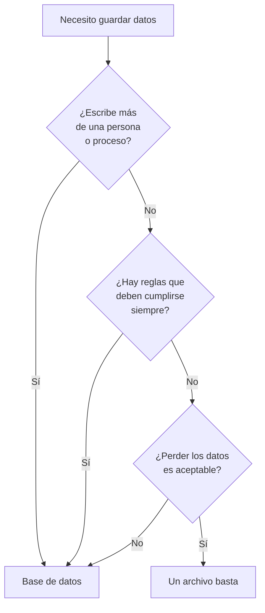

## Propósito

Responder con precisión a la pregunta que casi nadie hace en voz alta: **si la
hoja de cálculo funciona, ¿para qué una base de datos?** La respuesta no es «es
más profesional». Son cuatro cosas concretas que una hoja no puede hacer y que
se pueden nombrar, una por una.

## Resultados de aprendizaje

Al terminar podrás:

1. Nombrar las cuatro cosas que una base de datos hace y un archivo no.
2. Reproducir mentalmente la anomalía de la escritura perdida en dos hojas
   abiertas a la vez.
3. Decidir, con un criterio explícito, si un caso concreto necesita base de datos.
4. Explicar por qué un archivo CSV compartido no es una solución intermedia.
5. Nombrar la fuente de cada afirmación anterior.

## Fundamentos

### Lo que sí hace bien una hoja de cálculo

Conviene empezar por aquí, porque el desprecio a la hoja de cálculo es tan común
como injustificado. Una hoja es **inmejorable** para: explorar datos que no
conoces, hacer un cálculo puntual, prototipar un modelo antes de escribirlo, y
enseñar un resultado a alguien sin instalarle nada.

Millones de decisiones importantes se toman cada día con hojas de cálculo, y eso
no va a cambiar. El problema no es la herramienta: es usarla como **sistema de
registro**, es decir, como el sitio donde vive la verdad de un negocio que crece.

### Las cuatro cosas que una hoja no puede hacer

**1. Impedir un dato imposible.** En una hoja, la celda de la nota admite `130`,
`ochenta` y una cara sonriente. Se pueden poner validaciones, y se saltan al
pegar. En una base de datos, la regla vive **con el dato** y la aplica el motor a
todo el que escriba, incluido el que se conecta por consola.

**2. Dejar que dos personas escriban a la vez sin perder nada.** Dos copias de
la misma hoja abiertas, dos ediciones distintas, una se guarda encima de la otra:
la primera desaparece sin aviso. Se llama **actualización perdida**, y es el caso
que se estudiará a fondo en la parte de transacciones. Un motor de base de datos
existe, en buena medida, para que eso no ocurra.

**3. Responder preguntas que nadie previó.** En una hoja, cada pregunta nueva es
una fórmula nueva o una tabla dinámica nueva. En una base de datos se escribe una
consulta y el motor decide cómo resolverla. Esa separación entre **qué se quiere**
y **cómo se obtiene** es la idea central del artículo de Codd (1970) y lo que
hace que el sistema siga sirviendo cuando las preguntas cambian.

**4. Sobrevivir a un fallo a mitad de una operación.** Si se corta la luz
mientras se guarda una hoja, el archivo puede quedar a medias. Un motor
transaccional garantiza que una operación se aplica entera o no se aplica: no hay
estado intermedio.

Silberschatz y compañía abren *Database System Concepts* con la lista completa de
defectos del enfoque «un archivo por aplicación», y todos siguen vigentes:
redundancia, dificultad de acceso, aislamiento de datos, problemas de integridad,
problemas de atomicidad, anomalías de concurrencia y problemas de seguridad.

### Por qué un CSV compartido tampoco sirve

Es la solución intermedia que todo el mundo intenta, y falla por lo mismo: el
CSV no tiene tipos —todo es texto—, no tiene reglas, no tiene control de
concurrencia y no tiene forma de decir «esta fila se refiere a aquella otra». Lo
único que aporta frente a la hoja es que cualquier programa puede leerlo, y eso
lo convierte en un excelente **formato de intercambio** y en un pésimo sistema de
registro.

## Ejemplo trabajado

Una academia con tres profesores lleva las notas en una hoja compartida en la
nube. Todo funciona durante un semestre. Después ocurren estas cuatro cosas, en
este orden:

1. **Marzo.** Alguien escribe `95` en la nota de un examen sobre 50. Nadie lo
   nota hasta que un estudiante reclama en julio. *Una base de datos lo habría
   rechazado en el momento con un `CHECK (nota BETWEEN 0 AND 50)`.*

2. **Abril.** Dos profesores corrigen a la vez. El segundo en guardar sobrescribe
   las notas del primero: catorce notas desaparecen y no hay forma de saber
   cuáles. *Una base de datos habría aplicado las dos escrituras, o habría
   avisado del conflicto.*

3. **Mayo.** La dirección pregunta cuántos estudiantes aprobaron el primer
   parcial pero suspendieron el segundo. La hoja no está preparada para eso y
   alguien pasa dos horas con fórmulas. *En SQL son cuatro líneas, y el motor
   decide cómo ejecutarlas.*

4. **Junio.** El archivo se corrompe al sincronizarse. La copia más reciente es
   de hace nueve días. *Un motor con registro anticipado no pierde lo confirmado
   ni siquiera ante un corte de energía.*

Ninguno de los cuatro problemas es de la hoja de cálculo: son de haberla usado
como sistema de registro. La misma academia puede seguir usando hojas para
**mirar** los datos —exportando desde la base— sin ninguno de los cuatro
problemas.

## Errores frecuentes

1. **Migrar a base de datos «porque toca».** Sin nombrar cuál de las cuatro
   cosas hacía falta, la migración añade trabajo sin resolver nada.
2. **Creer que un CSV compartido es un paso intermedio.** No lo es: tiene los
   mismos problemas y menos herramientas.
3. **Reproducir la hoja tal cual en una tabla.** Una tabla con las mismas
   columnas mal diseñadas hereda todos los problemas; lo que cambia el resultado
   es el modelo, no el motor.
4. **Descartar la hoja de cálculo para todo.** Para explorar, prototipar y
   comunicar sigue siendo mejor herramienta que cualquier consola de SQL.
5. **Suponer que la base de datos hace los datos verdaderos.** Solo hace cumplir
   las reglas que alguien declaró. Si nadie declaró que la nota va de 0 a 50, el
   motor guarda `95` sin protestar.

## Ejemplo de transferencia

La misma decisión aparece cada vez que un programa necesita guardar algo: un
archivo de configuración (archivo, sin duda), el registro de una aplicación de
escritorio (archivo o SQLite), el catálogo de productos de una tienda (base de
datos), la caché de una página (ni una cosa ni la otra: memoria). El criterio no
cambia con el tamaño de los datos, cambia con **quién escribe y qué hay que
garantizar**.

## Reto de transferencia

1. Elige un archivo o una hoja que uses de verdad para guardar algo.
2. Contesta las tres preguntas del diagrama: ¿escribe más de uno?, ¿hay reglas
   que deban cumplirse siempre?, ¿perderlo es aceptable?
3. Escribe la decisión y el motivo en dos frases.
4. Si la respuesta fue «base de datos», nombra **cuál** de las cuatro cosas es la
   que de verdad hacía falta. Si no puedes nombrar ninguna, la respuesta era
   «archivo».

## Preguntas de evaluación

1. Enumera las cuatro cosas que una base de datos hace y un archivo no.
2. Explica con tus palabras cómo se pierde una escritura con dos copias de una
   hoja abiertas a la vez.
3. ¿Por qué un CSV compartido no resuelve el problema? Da dos motivos distintos.
4. Da un caso propio en el que **no** usarías base de datos, y justifica con el
   criterio del diagrama.
