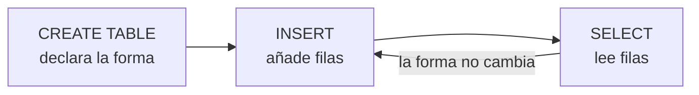

# 003 — Tu primera base de datos: crear, insertar y leer

> [Programa](../../../README.md) · [Parte 00](../README.md) · [← Anterior](../../part-00-primeros-pasos-del-archivo-a-la-base-de-datos/002-del-archivo-y-la-hoja-de-calculo-a-la-base-de-datos/README.md) · [Siguiente →](../../part-00-primeros-pasos-del-archivo-a-la-base-de-datos/004-leer-datos-select-where-y-order-by/README.md)

Parte 00 — Primeros pasos: del archivo a la base de datos · Fundamentos ·
2 horas estimadas · motores `sqlite`, `duckdb`, `postgresql`, `mysql`, `mongodb` · laboratorio
[`labs/01-sql-foundations`](../../../labs/01-sql-foundations/README.md) · 3 fuentes.

**Conceptos centrales:** `CREATE TABLE` · `INSERT` · `SELECT` · `definición frente a manipulación` · `None`

**En este caso se comparan 5 motores**: 5 lo resuelven (5 con el resultado comprobado por máquina) y 0 no, con el motivo escrito.

---

## Propósito

Crear una base de datos, una tabla y guardar datos dentro, con la menor cantidad
de ceremonia posible. Al terminar esta clase habrás ejecutado las tres órdenes
que sostienen todo lo demás —`CREATE TABLE`, `INSERT` y `SELECT`— y sabrás qué
hace cada una.

## Resultados de aprendizaje

Al terminar podrás:

1. Crear una tabla declarando sus campos y sus tipos.
2. Insertar filas y leerlas.
3. Explicar la diferencia entre **definir** el esquema y **modificar** los datos.
4. Reconocer el error de sintaxis más común y corregirlo sin buscarlo.
5. Nombrar la fuente de cada afirmación anterior.

## Fundamentos

### Tres órdenes y dos familias

Todo lo que se hace con SQL cae en dos familias, y conviene separarlas desde el
primer día:

| Familia | Qué hace | Órdenes |
|---|---|---|
| **Definición** (DDL) | Describe la **forma** de los datos | `CREATE`, `ALTER`, `DROP` |
| **Manipulación** (DML) | Trabaja con los **datos** | `INSERT`, `SELECT`, `UPDATE`, `DELETE` |

La distinción importa porque las dos familias se usan en momentos distintos: la
definición, pocas veces y con cuidado; la manipulación, todo el rato. Y porque
en la mayoría de los motores un cambio de definición **no se puede deshacer** con
la misma facilidad que un cambio de datos.

### `CREATE TABLE`: declarar la forma

```sql
CREATE TABLE estudiantes (
    id     INTEGER PRIMARY KEY,
    nombre TEXT NOT NULL,
    correo TEXT
);
```

Se lee de arriba abajo: una tabla llamada `estudiantes`, con tres campos. `id` es
un número entero y es la clave primaria —el campo que distingue una fila de otra,
que se estudiará en su propia clase—. `nombre` es texto y **no puede quedar
vacío**. `correo` es texto y sí puede.

Eso es todo lo que hace `CREATE TABLE`: escribir en el catálogo del motor cómo
tienen que ser las filas de esa tabla. No guarda ningún dato.

### `INSERT`: añadir filas

```sql
INSERT INTO estudiantes (id, nombre, correo)
VALUES (1, 'Ada Lovelace', 'ada@example.org');
```

Se nombran los campos que se van a rellenar y se dan los valores en el mismo
orden. Nombrar los campos parece redundante y no lo es: el día que la tabla gane
una columna, el `INSERT` que no los nombraba deja de funcionar o, peor, empieza a
poner cada valor en el sitio equivocado.

**El texto va entre comillas simples. Los números, no.** Es el error de sintaxis
más frecuente de las primeras horas, y da un mensaje distinto en cada motor.

### `SELECT`: leer

```sql
SELECT nombre, correo FROM estudiantes;
```

«De la tabla `estudiantes`, dame los campos `nombre` y `correo` de todas las
filas.» El `*` sirve para pedir todos los campos, y conviene acostumbrarse a **no
usarlo** fuera de la exploración: una consulta con `SELECT *` cambia de resultado
cuando alguien añade una columna, y quien la escribió ya no está para explicarlo.

### Dónde ocurre todo esto

Para esta clase no hace falta instalar nada: SQLite viene incluido con Python, y
una base de datos es un archivo —o ni siquiera eso, si se pide en memoria—. El
laboratorio del repositorio funciona así, y por eso se puede ejecutar en
cualquier máquina.



## Ejemplo trabajado

Una academia quiere registrar sus tres primeros estudiantes.

```sql
CREATE TABLE estudiantes (
    id     INTEGER PRIMARY KEY,
    nombre TEXT NOT NULL,
    correo TEXT
);

INSERT INTO estudiantes (id, nombre, correo) VALUES (1, 'Ada Lovelace', 'ada@example.org');
INSERT INTO estudiantes (id, nombre, correo) VALUES (2, 'Linus Torvalds', 'linus@example.org');
INSERT INTO estudiantes (id, nombre, correo) VALUES (3, 'Grace Hopper', NULL);

SELECT id, nombre FROM estudiantes ORDER BY nombre;
```

Resultado:

| id | nombre |
|---|---|
| 1 | Ada Lovelace |
| 3 | Grace Hopper |
| 2 | Linus Torvalds |

**Tres cosas que merece la pena mirar.**

El orden del resultado **no** es el de inserción: es el que pidió `ORDER BY`. Sin
esa cláusula, ningún motor está obligado a devolver las filas en un orden
concreto, aunque en una tabla pequeña casi siempre lo parezca. Es una de las
confusiones más persistentes y tiene su propia clase más adelante.

`NULL` —sin comillas— no es la palabra «NULL»: es la marca de **ausencia de
valor**. Grace no tiene correo, y eso es distinto de tener un correo vacío.

Y si se intenta insertar un cuarto estudiante con `id` 1, el motor lo rechaza:
la clave primaria no admite repetidos. Esa negativa es exactamente lo que se
compró al elegir una base de datos.

## Errores frecuentes

1. **Olvidar las comillas en el texto o ponerlas en los números.** `VALUES (1,
   Ada)` falla; `VALUES ('1', 'Ada')` a veces funciona y guarda el número como
   texto, que es peor.
2. **Usar comillas dobles para el texto.** En SQL estándar, las comillas dobles
   son para los **nombres** de tabla y columna; el texto va en comillas simples.
   Algunos motores lo perdonan y otros no.
3. **`INSERT` sin nombrar los campos.** Funciona hasta que la tabla cambia.
4. **Confundir `NULL` con `'NULL'`.** El primero es ausencia de valor; el segundo
   es un texto de cuatro letras.
5. **Suponer que el orden de salida es el de entrada.** Sin `ORDER BY` no hay
   orden garantizado.
6. **Ejecutar `DROP TABLE` para «volver a empezar» en la base equivocada.** La
   definición no se deshace con `Ctrl+Z`.

## Ejemplo de transferencia

Estas tres órdenes son las mismas —con diferencias mínimas de sintaxis— en
PostgreSQL, MySQL, SQL Server, Oracle y DuckDB. Lo que se aprende aquí no es
SQLite: es el subconjunto de SQL que la norma ISO/IEC 9075 define y que todos
implementan. Cambiar de motor no obliga a reaprender esto.

## Reto de transferencia

1. Crea una tabla para algo que lleves de verdad: libros, gastos, plantas,
   partidas. Declara al menos cuatro campos y decide cuáles no pueden quedar
   vacíos.
2. Inserta cinco filas, y que una de ellas tenga un campo sin valor.
3. Escribe tres consultas distintas sobre esos datos.
4. Intenta insertar una fila que viole una de tus reglas, y **guarda el mensaje
   de error**: es la prueba de que la regla existe.

## Preguntas de evaluación

1. ¿Qué diferencia hay entre la familia de definición y la de manipulación?
2. ¿Por qué conviene nombrar los campos en un `INSERT`?
3. ¿Qué significa `NOT NULL` y qué ocurre exactamente al violarlo?
4. Explica por qué `SELECT *` es cómodo para explorar y mala idea en el código de
   una aplicación.

---

## 🌐 El mismo problema en cada motor

**Caso:** Crear una tabla, guardar tres filas y leerlas

Las tres órdenes que sostienen todo lo demás, en su forma mínima: crear la
tabla, insertar filas y leerlas. Tres estudiantes, uno de ellos sin correo
—porque la ausencia de dato es un caso normal y hay que saber escribirla— y
la lista devuelta **ordenada por nombre**, que es una decisión que hay que
pedir explícitamente.

Que el resultado salga en orden alfabético y no en el de inserción es lo
único sorprendente del caso, y es deliberado: una tabla no tiene orden, y
creer lo contrario es la primera confusión que hay que quitarse de encima.

Salida esperada, idéntica en todos los motores que lo resuelven:

| id | nombre |
|---|---|
| `1` | `Ada` |
| `3` | `Grace` |
| `2` | `Linus` |

El contrato vive en [`motores.yaml`](motores.yaml) y lo comprueba
`python scripts/verificar_equivalencia.py --clase 003`: 5 de
las 5 implementaciones se ejecutan de verdad y su
resultado se compara con esa tabla; el resto se declara como material revisado,
no ejecutado.

| Motor | ¿Resuelve el caso? | Nivel de prueba | Código | Fuente |
|---|---|---|---|---|
| SQLite | sí | núcleo | [código](implementaciones/sqlite/consulta.sql) | [doc oficial](https://sqlite.org/lang_insert.html) |
| DuckDB | sí | núcleo | [código](implementaciones/duckdb/consulta.sql) | [doc oficial](https://duckdb.org/docs/stable/sql/statements/insert) |
| PostgreSQL | sí | servicio | [código](implementaciones/postgresql/consulta.sql) | [doc oficial](https://www.postgresql.org/docs/current/sql-insert.html) |
| MySQL | sí | servicio | [código](implementaciones/mysql/consulta.sql) | [doc oficial](https://dev.mysql.com/doc/refman/8.4/en/insert.html) |
| MongoDB | sí | servicio | [código](implementaciones/mongodb/consulta.js) | [doc oficial](https://www.mongodb.com/docs/manual/reference/method/db.collection.insertMany/) |

### Los que resuelven el caso

#### SQLite · [`implementaciones/sqlite/consulta.sql`](implementaciones/sqlite/consulta.sql)

✅ **verificado** — se ejecuta en CI sin servicios

```sql
-- motor: sqlite
-- doc: https://sqlite.org/lang_insert.html
-- nota: el resultado NO sale en orden de insercion, sale en el que pidio el
--       ORDER BY. Sin esa clausula, ningun motor esta obligado a devolver nada
--       en un orden concreto.

-- === preparacion ===
CREATE TABLE estudiantes (
    id     INTEGER PRIMARY KEY,
    nombre TEXT NOT NULL,
    correo TEXT
);

INSERT INTO estudiantes (id, nombre, correo) VALUES (1, 'Ada', 'ada@example.org');
INSERT INTO estudiantes (id, nombre, correo) VALUES (2, 'Linus', 'linus@example.org');
-- Grace no tiene correo. NULL sin comillas: ausencia de valor, no la palabra.
INSERT INTO estudiantes (id, nombre, correo) VALUES (3, 'Grace', NULL);

-- === consulta ===
SELECT id, nombre FROM estudiantes ORDER BY nombre;
```

- **Por qué sí:** Cero instalación: viene con Python y la base de datos puede vivir en memoria. Es donde conviene escribir las primeras cien sentencias, sin que nada más se interponga.
- **Por qué no:** Al no haber servidor tampoco hay usuarios ni permisos, así que la mitad de lo que después importa en producción no se puede ni practicar aquí.
- 📄 Documentación oficial: <https://sqlite.org/lang_insert.html>

#### DuckDB · [`implementaciones/duckdb/consulta.sql`](implementaciones/duckdb/consulta.sql)

✅ **verificado** — se ejecuta en CI sin servicios

```sql
-- motor: duckdb
-- doc: https://duckdb.org/docs/stable/sql/statements/insert
-- nota: insertar filas de una en una es lo que peor hace un motor columnar.
--       Funciona, y va contra su diseno: aqui se hace asi para que la sentencia
--       sea identica a la de los demas.

-- === preparacion ===
CREATE TABLE estudiantes (
    id     INTEGER PRIMARY KEY,
    nombre VARCHAR NOT NULL,
    correo VARCHAR
);

INSERT INTO estudiantes (id, nombre, correo) VALUES (1, 'Ada', 'ada@example.org');
INSERT INTO estudiantes (id, nombre, correo) VALUES (2, 'Linus', 'linus@example.org');
-- Grace no tiene correo. NULL sin comillas: ausencia de valor, no la palabra.
INSERT INTO estudiantes (id, nombre, correo) VALUES (3, 'Grace', NULL);

-- === consulta ===
SELECT id, nombre FROM estudiantes ORDER BY nombre;
```

- **Por qué sí:** Las mismas tres órdenes con la misma sintaxis: confirma desde el primer día que lo aprendido es transferible.
- **Por qué no:** Insertar filas de una en una es justo lo que peor hace un motor columnar: funciona, y va contra su diseño.
- 📄 Documentación oficial: <https://duckdb.org/docs/stable/sql/statements/insert>

#### PostgreSQL · [`implementaciones/postgresql/consulta.sql`](implementaciones/postgresql/consulta.sql)

✅ **verificado** — se ejecuta contra el motor real levantado con `docker compose`

```sql
-- motor: postgresql
-- doc: https://www.postgresql.org/docs/current/sql-insert.html
-- nota: en cuanto hay mas de un cliente escribiendo, el identificador no lo
--       pone la aplicacion: lo pone el motor.
--         id integer GENERATED ALWAYS AS IDENTITY PRIMARY KEY
--       Aqui se escribe a mano para que las tres filas sean comparables con las
--       de los demas motores.

-- === preparacion ===
DROP TABLE IF EXISTS estudiantes;

CREATE TABLE estudiantes (
    id     integer PRIMARY KEY,
    nombre text NOT NULL,
    correo text
);

INSERT INTO estudiantes (id, nombre, correo) VALUES (1, 'Ada', 'ada@example.org');
INSERT INTO estudiantes (id, nombre, correo) VALUES (2, 'Linus', 'linus@example.org');
-- Grace no tiene correo. NULL sin comillas: ausencia de valor, no la palabra.
INSERT INTO estudiantes (id, nombre, correo) VALUES (3, 'Grace', NULL);

-- === consulta ===
SELECT id, nombre FROM estudiantes ORDER BY nombre;
```

- **Por qué sí:** Las mismas tres órdenes contra un servidor real. Y con `GENERATED ALWAYS AS IDENTITY` el identificador lo pone el motor, que es como se hace en cuanto hay más de un cliente escribiendo.
- **Por qué no:** Hay que instalarlo, arrancarlo, crear usuario y base, y conectarse. Nada de eso enseña sobre datos, y en la primera hora solo estorba.
- 📄 Documentación oficial: <https://www.postgresql.org/docs/current/sql-insert.html>

#### MySQL · [`implementaciones/mysql/consulta.sql`](implementaciones/mysql/consulta.sql)

✅ **verificado** — se ejecuta contra el motor real levantado con `docker compose`

```sql
-- motor: mysql
-- doc: https://dev.mysql.com/doc/refman/8.4/en/insert.html
-- nota: casi identico. La diferencia que no se ve aqui y muerde despues: la
--       comparacion de texto ignora mayusculas por omision, asi que un UNIQUE
--       sobre un correo trata 'Ada@x.org' y 'ada@x.org' como el mismo valor.

-- === preparacion ===
DROP TABLE IF EXISTS estudiantes;

CREATE TABLE estudiantes (
    id     INT PRIMARY KEY,
    nombre VARCHAR(50) NOT NULL,
    correo VARCHAR(50)
);

INSERT INTO estudiantes (id, nombre, correo) VALUES (1, 'Ada', 'ada@example.org');
INSERT INTO estudiantes (id, nombre, correo) VALUES (2, 'Linus', 'linus@example.org');
-- Grace no tiene correo. NULL sin comillas: ausencia de valor, no la palabra.
INSERT INTO estudiantes (id, nombre, correo) VALUES (3, 'Grace', NULL);

-- === consulta ===
SELECT id, nombre FROM estudiantes ORDER BY nombre;
```

- **Por qué sí:** Es el motor que más aparece en alojamientos compartidos y en tutoriales, así que reconocer su sintaxis —casi idéntica— ahorra confusión al leer código ajeno.
- **Por qué no:** Su comparación de texto ignora mayúsculas por omisión, y ese detalle, que aquí no se nota, cambia resultados en cuanto haya un `UNIQUE` sobre un correo.
- 📄 Documentación oficial: <https://dev.mysql.com/doc/refman/8.4/en/insert.html>

#### MongoDB · [`implementaciones/mongodb/consulta.js`](implementaciones/mongodb/consulta.js)

✅ **verificado** — se ejecuta contra el motor real levantado con `docker compose`

```javascript
// motor: mongodb
// doc: https://www.mongodb.com/docs/manual/reference/method/db.collection.insertMany/
// nota: no hay CREATE. Insertar un documento crea la coleccion, y cada
//       documento puede tener campos distintos. Grace no lleva el campo correo:
//       en una tabla habria una celda vacia, aqui no hay celda.

// === preparacion ===
db.estudiantes.drop();
db.estudiantes.insertMany([
  { _id: 1, nombre: "Ada", correo: "ada@example.org" },
  { _id: 2, nombre: "Linus", correo: "linus@example.org" },
  { _id: 3, nombre: "Grace" },
]);

// === consulta ===
db.estudiantes
  .find({}, { _id: 1, nombre: 1 })
  .sort({ nombre: 1 })
  .forEach((d) => print(d._id + "|" + d.nombre));
```

- **Por qué sí:** No hace falta crear nada: insertar un documento crea la colección. Para empezar a guardar algo sin decidir todavía su forma, es lo más directo que existe.
- **Por qué no:** Ese «no hace falta decidir» se paga después: sin esquema, la forma de los documentos la fija quien escribió el último, y descubrir qué campos existen de verdad exige recorrer la colección.
- 📄 Documentación oficial: <https://www.mongodb.com/docs/manual/reference/method/db.collection.insertMany/>

---

## Laboratorio

```bash
python scripts/validate_repository.py
python labs/01-sql-foundations/run_lab.py
```

Guarda como evidencia la salida completa, la versión del motor y la semilla o
los parámetros usados. Una captura sin comando no es evidencia: no se puede
repetir.

## Evaluación

| Criterio | Peso | Qué se comprueba |
|---|---:|---|
| Comprensión conceptual | 25 % | Explica el mecanismo, no solo el resultado |
| Ejecución reproducible | 25 % | Otra persona obtiene lo mismo con las instrucciones dadas |
| Interpretación basada en evidencia | 25 % | Cada conclusión se apoya en una salida o una medición |
| Límites y riesgos declarados | 25 % | Dice qué no demuestra el ejercicio y qué faltaría en producción |

La clase se da por superada cuando la respuesta explica el mecanismo, muestra
la salida que la respalda y declara al menos un límite del ejercicio.

## Fuentes de esta clase

Todo lo afirmado arriba procede de estas obras. Los identificadores viven en
[`catalog/sources.json`](../../../catalog/sources.json) y el estado de los
enlaces se comprueba con `python scripts/check_external_links.py`.

- **SQLite Consortium** (2026). [SQLite Documentation](https://sqlite.org/docs.html).  
  Motor embebido usado por los laboratorios sin dependencias del programa.
- **Python Software Foundation** (2026). [Python: sqlite3](https://docs.python.org/3/library/sqlite3.html).  
  API DB-API 2.0 usada por los laboratorios ejecutables del repositorio.
- **ISO/IEC JTC 1/SC 32** (2023). [ISO/IEC 9075: Information technology - Database languages - SQL](https://www.iso.org/standard/76583.html).  
  Norma del lenguaje SQL. Ningún motor la implementa por completo.

---

> [Programa](../../../README.md) · [Parte 00](../README.md) · [← Anterior](../../part-00-primeros-pasos-del-archivo-a-la-base-de-datos/002-del-archivo-y-la-hoja-de-calculo-a-la-base-de-datos/README.md) · [Siguiente →](../../part-00-primeros-pasos-del-archivo-a-la-base-de-datos/004-leer-datos-select-where-y-order-by/README.md)
