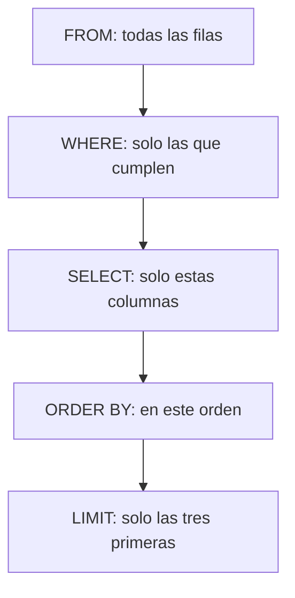

# 004 — Leer datos: SELECT, WHERE y ORDER BY

> [Programa](../../../README.md) · [Parte 00](../README.md) · [← Anterior](../../part-00-primeros-pasos-del-archivo-a-la-base-de-datos/003-tu-primera-base-de-datos/README.md) · [Siguiente →](../../part-00-primeros-pasos-del-archivo-a-la-base-de-datos/005-cambiar-datos-insert-update-delete/README.md)

Parte 00 — Primeros pasos: del archivo a la base de datos · Fundamentos ·
2 horas estimadas · motores `sqlite`, `duckdb`, `postgresql`, `mongodb`, `redis` · laboratorio
[`labs/01-sql-foundations`](../../../labs/01-sql-foundations/README.md) · 3 fuentes.

**Conceptos centrales:** `filtrado` · `proyección` · `orden` · `LIMIT` · `IS NULL`

**En este caso se comparan 6 motores**: 5 lo resuelven (5 con el resultado comprobado por máquina) y 1 no, con el motivo escrito.

---

## Propósito

Aprender a hacer preguntas. Un `SELECT` tiene tres decisiones —qué filas, qué
columnas y en qué orden— y separarlas mentalmente es lo que permite escribir
consultas que hacen lo que se cree que hacen.

## Resultados de aprendizaje

Al terminar podrás:

1. Filtrar filas con `WHERE` usando comparaciones y operadores lógicos.
2. Elegir columnas y darles nombres legibles.
3. Ordenar el resultado y explicar por qué sin `ORDER BY` no hay orden.
4. Limitar el número de filas devueltas sin caer en la trampa del `LIMIT` sin
   orden.
5. Nombrar la fuente de cada afirmación anterior.

## Fundamentos

### Las tres decisiones, en el orden en que las toma el motor

Aunque se escriba `SELECT ... FROM ... WHERE ... ORDER BY`, el motor las aplica
en otro orden, y entenderlo evita la mitad de las confusiones:

| Paso | Cláusula | Decide |
|---|---|---|
| 1 | `FROM` | De dónde salen las filas |
| 2 | `WHERE` | **Cuáles** sobreviven |
| 3 | `SELECT` | **Qué columnas** se ven |
| 4 | `ORDER BY` | En qué **orden** se leen |
| 5 | `LIMIT` | **Cuántas** se devuelven |

De ahí sale, por ejemplo, que un alias definido en el `SELECT` no siempre se
pueda usar en el `WHERE`: cuando el `WHERE` se evalúa, ese alias todavía no
existe.

### `WHERE`: quedarse con unas filas

```sql
SELECT nombre, nota FROM notas WHERE nota >= 60;
```

Los operadores son los esperables —`=`, `<>`, `<`, `<=`, `>`, `>=`— y se combinan
con `AND`, `OR` y `NOT`. Tres formas que ahorran paréntesis:

```sql
WHERE nota BETWEEN 60 AND 90          -- ambos extremos incluidos
WHERE curso IN ('DB-101', 'SE-201')   -- uno de la lista
WHERE nombre LIKE 'A%'                -- empieza por A
```

**El nulo no se compara con `=`.** `WHERE correo = NULL` no devuelve las filas
sin correo: no devuelve ninguna, porque comparar con una ausencia no da ni
verdadero ni falso. La forma correcta es `WHERE correo IS NULL`. Esta es la
primera aparición de un tema que tiene clase propia más adelante, y conviene
aprenderla ya.

### `SELECT`: elegir columnas y nombrarlas

```sql
SELECT nombre AS estudiante, nota * 2 AS nota_sobre_100 FROM notas;
```

Un alias con `AS` no cambia los datos: cambia el nombre de la columna en el
resultado. Sirve para que quien lea el informe entienda qué está mirando, y para
poner nombre a una expresión calculada.

### `ORDER BY`: el orden es una decisión, no una propiedad

Una tabla **no tiene orden**. Es un conjunto de filas, y el motor las devuelve
como le resulte más barato: puede cambiar al añadir un índice, al crecer la
tabla o al ejecutar la consulta en paralelo.

```sql
SELECT nombre, nota FROM notas ORDER BY nota DESC, nombre;
```

`DESC` es de mayor a menor; sin él, de menor a mayor. Y el segundo criterio
—`nombre`— es el **desempate**: sin él, dos estudiantes con la misma nota pueden
salir en cualquier orden, y ese orden puede cambiar entre dos ejecuciones.

### `LIMIT`: la trampa

```sql
SELECT nombre, nota FROM notas ORDER BY nota DESC LIMIT 3;
```

`LIMIT` sin `ORDER BY` devuelve **tres filas cualesquiera**. En una tabla
pequeña suelen ser «las correctas» por casualidad, y por eso el error sobrevive
hasta producción, donde la tabla ya no es pequeña y las filas devueltas dejan de
tener sentido.



## Ejemplo trabajado

Con esta tabla:

| estudiante | curso | nota |
|---|---|---|
| Ada | DB-101 | 90 |
| Linus | DB-101 | 58 |
| Grace | DB-101 | 72 |
| Ada | SE-201 | 66 |
| Grace | SE-201 | 78 |

**Pregunta:** los dos mejores de DB-101 que aprobaron, con su nota.

```sql
SELECT estudiante, nota
FROM notas
WHERE curso = 'DB-101' AND nota >= 60
ORDER BY nota DESC
LIMIT 2;
```

| estudiante | nota |
|---|---|
| Ada | 90 |
| Grace | 72 |

**Traza, paso a paso.** `FROM` entrega las cinco filas. `WHERE` descarta las de
SE-201 y a Linus, que no llega a 60: quedan dos. `SELECT` se queda con dos
columnas. `ORDER BY` las coloca de mayor a menor. `LIMIT` corta a dos, que en
este caso ya eran dos.

**El mismo ejercicio, mal escrito.** Si se quita el `ORDER BY`, el motor puede
devolver `Grace, 72` y `Ada, 90` —o solo una de las dos, según el plan— y la
consulta seguirá pareciendo correcta mientras la tabla tenga cinco filas.

**Y una trampa más.** Para pedir «los que no tienen nota registrada», esto está
mal:

```sql
SELECT estudiante FROM notas WHERE nota = NULL;   -- devuelve cero filas
SELECT estudiante FROM notas WHERE nota IS NULL;  -- correcto
```

## Errores frecuentes

1. **`= NULL` en vez de `IS NULL`.** No falla: devuelve vacío, que es peor.
2. **`LIMIT` sin `ORDER BY`.** Devuelve filas arbitrarias con aspecto de
   respuesta.
3. **`ORDER BY` sin desempate.** Con valores repetidos, el orden puede cambiar
   entre ejecuciones y nadie sabrá por qué.
4. **Mezclar `AND` y `OR` sin paréntesis.** `WHERE a = 1 AND b = 2 OR c = 3` no
   significa lo que parece: `AND` se evalúa antes que `OR`.
5. **`LIKE '%texto%'` sobre tablas grandes.** Funciona y no puede usar el índice:
   es la consulta que se vuelve lenta sin que nada haya cambiado.
6. **Suponer que el orden de la tabla es el de inserción.**

## Ejemplo de transferencia

`WHERE`, `ORDER BY` y `LIMIT` son casi idénticos en todos los motores
relacionales, con una excepción que conviene conocer desde ahora: SQL Server usa
`TOP` y Oracle antiguo usaba `ROWNUM`. La norma define `FETCH FIRST n ROWS
ONLY`, que PostgreSQL, Oracle moderno y SQL Server aceptan. Se estudia en la
clase de portabilidad.

## Reto de transferencia

1. Sobre la tabla que creaste en la clase anterior, escribe cinco consultas: una
   con `WHERE` simple, una con `AND`, una con `IN`, una con `IS NULL` y una con
   `ORDER BY` y `LIMIT`.
2. Escribe una consulta con `LIMIT` **sin** `ORDER BY`, ejecútala varias veces y
   anota si el resultado cambia.
3. Escribe una consulta con `= NULL` y explica por qué devuelve lo que devuelve.
4. Añade un desempate a tu `ORDER BY` y explica qué caso concreto resuelve.

## Preguntas de evaluación

1. ¿En qué orden aplica el motor `FROM`, `WHERE`, `SELECT`, `ORDER BY` y `LIMIT`?
2. ¿Por qué `WHERE nota = NULL` devuelve cero filas?
3. ¿Qué problema concreto resuelve añadir un segundo criterio al `ORDER BY`?
4. Explica por qué `LIMIT 3` sin `ORDER BY` puede dar un resultado distinto en dos
   ejecuciones seguidas.

---

## 🌐 El mismo problema en cada motor

**Caso:** Quién aprobó DB-101, con su nota y en orden alfabético

Un `SELECT` toma tres decisiones y conviene separarlas: **qué filas**
(`WHERE`), **qué columnas** (`SELECT`) y **en qué orden** (`ORDER BY`). El
caso las usa las tres: de las cuatro notas registradas, se piden las de
DB-101 con 60 o más, con el nombre y la nota, ordenadas por nombre.

Linus queda fuera por no llegar a 60 y la nota de SE-201 queda fuera por no
ser de ese curso. El orden alfabético hay que pedirlo: sin `ORDER BY`,
ningún motor está obligado a devolver nada en un orden concreto, por mucho
que en una tabla pequeña lo parezca.

Salida esperada, idéntica en todos los motores que lo resuelven:

| estudiante | nota |
|---|---|
| `Ada` | `90` |
| `Grace` | `72` |

El contrato vive en [`motores.yaml`](motores.yaml) y lo comprueba
`python scripts/verificar_equivalencia.py --clase 004`: 5 de
las 5 implementaciones se ejecutan de verdad y su
resultado se compara con esa tabla; el resto se declara como material revisado,
no ejecutado.

| Motor | ¿Resuelve el caso? | Nivel de prueba | Código | Fuente |
|---|---|---|---|---|
| SQLite | sí | núcleo | [código](implementaciones/sqlite/consulta.sql) | [doc oficial](https://sqlite.org/lang_select.html) |
| DuckDB | sí | núcleo | [código](implementaciones/duckdb/consulta.sql) | [doc oficial](https://duckdb.org/docs/stable/sql/query_syntax/orderby) |
| PostgreSQL | sí | servicio | [código](implementaciones/postgresql/consulta.sql) | [doc oficial](https://www.postgresql.org/docs/current/queries-order.html) |
| MongoDB | sí | servicio | [código](implementaciones/mongodb/consulta.js) | [doc oficial](https://www.mongodb.com/docs/manual/reference/method/cursor.sort/) |
| Redis | sí | servicio | [código](implementaciones/redis/consulta.txt) | [doc oficial](https://redis.io/docs/latest/commands/zrangebyscore/) |
| Apache Cassandra | **no** | — | — | [doc oficial](https://cassandra.apache.org/doc/latest/cassandra/developing/cql/dml.html) |

### Los que resuelven el caso

#### SQLite · [`implementaciones/sqlite/consulta.sql`](implementaciones/sqlite/consulta.sql)

✅ **verificado** — se ejecuta en CI sin servicios

```sql
-- motor: sqlite
-- doc: https://sqlite.org/lang_select.html
-- nota: probar a quitar el ORDER BY. Con cuatro filas el resultado parecera
--       correcto igualmente, y esa casualidad es la que hace que el error
--       sobreviva hasta produccion.

-- === preparacion ===
CREATE TABLE notas (
    estudiante TEXT NOT NULL,
    curso      TEXT NOT NULL,
    nota       INTEGER NOT NULL,
    PRIMARY KEY (estudiante, curso)
);
INSERT INTO notas (estudiante, curso, nota) VALUES
    ('Ada',   'DB-101', 90),
    ('Linus', 'DB-101', 58),
    ('Grace', 'DB-101', 72),
    ('Ada',   'SE-201', 66);

-- === consulta ===
-- Tres decisiones separadas: que filas (WHERE), que columnas (SELECT) y en que
-- orden se leen (ORDER BY). El orden hay que PEDIRLO: una tabla no lo tiene.
SELECT estudiante, nota
FROM notas
WHERE curso = 'DB-101' AND nota >= 60
ORDER BY estudiante;
```

- **Por qué sí:** Implementa `WHERE`, `ORDER BY` y `LIMIT` con la sintaxis que comparten PostgreSQL, MySQL y DuckDB: es el subconjunto que de verdad se transfiere.
- **Por qué no:** Con tablas pequeñas devuelve casi siempre las filas en el orden de inserción aunque no se pida, lo que refuerza justo la creencia equivocada que esta clase intenta corregir.
- 📄 Documentación oficial: <https://sqlite.org/lang_select.html>

#### DuckDB · [`implementaciones/duckdb/consulta.sql`](implementaciones/duckdb/consulta.sql)

✅ **verificado** — se ejecuta en CI sin servicios

```sql
-- motor: duckdb
-- doc: https://duckdb.org/docs/stable/sql/query_syntax/orderby
-- nota: aqui quitar el ORDER BY si cambia el orden entre ejecuciones, porque el
--       motor lee en paralelo por trozos. Es la mejor demostracion de que una
--       tabla no tiene orden.

-- === preparacion ===
CREATE TABLE notas (
    estudiante VARCHAR NOT NULL,
    curso      VARCHAR NOT NULL,
    nota       INTEGER NOT NULL,
    PRIMARY KEY (estudiante, curso)
);
INSERT INTO notas (estudiante, curso, nota) VALUES
    ('Ada',   'DB-101', 90),
    ('Linus', 'DB-101', 58),
    ('Grace', 'DB-101', 72),
    ('Ada',   'SE-201', 66);

-- === consulta ===
-- Tres decisiones separadas: que filas (WHERE), que columnas (SELECT) y en que
-- orden se leen (ORDER BY). El orden hay que PEDIRLO: una tabla no lo tiene.
SELECT estudiante, nota
FROM notas
WHERE curso = 'DB-101' AND nota >= 60
ORDER BY estudiante;
```

- **Por qué sí:** Al ejecutar en paralelo, el orden sin `ORDER BY` cambia de verdad entre ejecuciones: es el motor que mejor demuestra que el orden hay que pedirlo.
- **Por qué no:** Añade atajos propios muy cómodos que no existen en ningún otro sitio, así que una consulta que funciona aquí no siempre es portable.
- 📄 Documentación oficial: <https://duckdb.org/docs/stable/sql/query_syntax/orderby>

#### PostgreSQL · [`implementaciones/postgresql/consulta.sql`](implementaciones/postgresql/consulta.sql)

✅ **verificado** — se ejecuta contra el motor real levantado con `docker compose`

```sql
-- motor: postgresql
-- doc: https://www.postgresql.org/docs/current/queries-order.html
-- nota: la documentacion lo dice sin rodeos: sin ORDER BY, el orden de las
--       filas es indeterminado. No es un descuido del motor, es el modelo.

-- === preparacion ===
DROP TABLE IF EXISTS notas;

CREATE TABLE notas (
    estudiante text NOT NULL,
    curso      text NOT NULL,
    nota       integer NOT NULL,
    PRIMARY KEY (estudiante, curso)
);
INSERT INTO notas (estudiante, curso, nota) VALUES
    ('Ada',   'DB-101', 90),
    ('Linus', 'DB-101', 58),
    ('Grace', 'DB-101', 72),
    ('Ada',   'SE-201', 66);

-- === consulta ===
-- Tres decisiones separadas: que filas (WHERE), que columnas (SELECT) y en que
-- orden se leen (ORDER BY). El orden hay que PEDIRLO: una tabla no lo tiene.
SELECT estudiante, nota
FROM notas
WHERE curso = 'DB-101' AND nota >= 60
ORDER BY estudiante;
```

- **Por qué sí:** Su documentación afirma explícitamente que sin `ORDER BY` el orden es indeterminado; y con un índice adecuado, `ORDER BY ... LIMIT` no ordena nada: lee las primeras entradas del índice y para.
- **Por qué no:** La paginación con `OFFSET` grande obliga a leer y descartar todo lo anterior: la página mil cuesta mil veces la primera, y hay que sustituirla por paginación por clave.
- 📄 Documentación oficial: <https://www.postgresql.org/docs/current/queries-order.html>

#### MongoDB · [`implementaciones/mongodb/consulta.js`](implementaciones/mongodb/consulta.js)

✅ **verificado** — se ejecuta contra el motor real levantado con `docker compose`

```javascript
// motor: mongodb
// doc: https://www.mongodb.com/docs/manual/reference/method/cursor.sort/
// nota: las mismas tres decisiones con otra sintaxis: el primer argumento de
//       find() es el WHERE, el segundo es el SELECT, y sort() es el ORDER BY.

// === preparacion ===
db.notas.drop();
db.notas.insertMany([
  { estudiante: "Ada", curso: "DB-101", nota: 90 },
  { estudiante: "Linus", curso: "DB-101", nota: 58 },
  { estudiante: "Grace", curso: "DB-101", nota: 72 },
  { estudiante: "Ada", curso: "SE-201", nota: 66 },
]);

// === consulta ===
db.notas
  .find({ curso: "DB-101", nota: { $gte: 60 } }, { _id: 0, estudiante: 1, nota: 1 })
  .sort({ estudiante: 1 })
  .forEach((d) => print(d.estudiante + "|" + d.nota));
```

- **Por qué sí:** `find(filtro, proyección).sort()` son las mismas tres decisiones con otra sintaxis: sirve para ver que el concepto no es de SQL.
- **Por qué no:** Sin un índice que cubra el `sort`, la ordenación en memoria está limitada a 32 MB y la consulta **falla** en vez de ir lenta: un fallo honesto, y una sorpresa en producción.
- 📄 Documentación oficial: <https://www.mongodb.com/docs/manual/reference/method/cursor.sort/>

#### Redis · [`implementaciones/redis/consulta.txt`](implementaciones/redis/consulta.txt)

✅ **verificado** — se ejecuta contra el motor real levantado con `docker compose`

```text
# motor: redis
# doc: https://redis.io/docs/latest/commands/zrangebyscore/
# nota: el orden se paga en la ESCRITURA, no en la consulta: ZADD mantiene el
#       conjunto ordenado por puntuacion. Por eso «los aprobados de DB-101» es
#       leer un rango y no ordenar nada.
#       El precio: ese es el UNICO orden disponible. Ordenar por nombre exigiria
#       otra estructura, mantenida a mano en cada escritura. Aqui el resultado
#       se reordena por nombre en el script para poder compararlo con los demas
#       motores, y eso mismo es la prueba de la limitacion.

# === preparacion ===
FLUSHDB
ZADD notas:DB-101 90 Ada
ZADD notas:DB-101 58 Linus
ZADD notas:DB-101 72 Grace
ZADD notas:SE-201 66 Ada

# === consulta ===
EVAL "local t=redis.call('ZRANGEBYSCORE','notas:DB-101','60','+inf','WITHSCORES') local m={} for i=1,#t,2 do m[#m+1]={t[i],t[i+1]} end table.sort(m,function(a,b) return a[1]<b[1] end) local r={} for _,v in ipairs(m) do r[#r+1]=v[1]..'|'..v[2] end return r" 0
```

- **Por qué sí:** Un conjunto ordenado mantiene el orden **al escribir**, así que pedir los aprobados de un curso es leer un rango: no hay nada que ordenar en el momento de la consulta.
- **Por qué no:** Ese orden es el único disponible y hay que haberlo previsto: ordenar por nombre en vez de por nota exigiría otra estructura, mantenida a mano en cada escritura.
- 📄 Documentación oficial: <https://redis.io/docs/latest/commands/zrangebyscore/>

### Los que no resuelven este caso — y qué se hace en su lugar

Descartar un motor con un argumento es tan formativo como usarlo. Ninguna de estas filas dice que el motor sea peor: dice que este problema no es el suyo.

| Motor | Por qué no | Qué se hace en su lugar | Fuente |
|---|---|---|---|
| Apache Cassandra | El filtro `nota >= 60` solo sería legal si `nota` fuera columna de agrupamiento; sobre cualquier otra columna exige `ALLOW FILTERING`, que es la forma que tiene Cassandra de avisar de que va a escanear. | Modelar la tabla con el curso como partición y la nota como agrupamiento, de forma que el filtro por rango sea el orden físico. Se estudia en la parte de columnas anchas. | [doc](https://cassandra.apache.org/doc/latest/cassandra/developing/cql/dml.html) |

---

## Laboratorio

```bash
python scripts/validate_repository.py
python labs/01-sql-foundations/run_lab.py
```

Guarda como evidencia la salida completa, la versión del motor y la semilla o
los parámetros usados. Una captura sin comando no es evidencia: no se puede
repetir.

## Evaluación

| Criterio | Peso | Qué se comprueba |
|---|---:|---|
| Comprensión conceptual | 25 % | Explica el mecanismo, no solo el resultado |
| Ejecución reproducible | 25 % | Otra persona obtiene lo mismo con las instrucciones dadas |
| Interpretación basada en evidencia | 25 % | Cada conclusión se apoya en una salida o una medición |
| Límites y riesgos declarados | 25 % | Dice qué no demuestra el ejercicio y qué faltaría en producción |

La clase se da por superada cuando la respuesta explica el mecanismo, muestra
la salida que la respalda y declara al menos un límite del ejercicio.

## Fuentes de esta clase

Todo lo afirmado arriba procede de estas obras. Los identificadores viven en
[`catalog/sources.json`](../../../catalog/sources.json) y el estado de los
enlaces se comprueba con `python scripts/check_external_links.py`.

- **ISO/IEC JTC 1/SC 32** (2023). [ISO/IEC 9075: Information technology - Database languages - SQL](https://www.iso.org/standard/76583.html).  
  Norma del lenguaje SQL. Ningún motor la implementa por completo.
- **C. J. Date** (2015). [SQL and Relational Theory: How to Write Accurate SQL Code](https://www.oreilly.com/library/view/sql-and-relational/9781491941164/). 3.a ed. O'Reilly. ISBN 978-1-4919-4117-1.  
  Separa el modelo relacional de lo que SQL realmente implementa, incluidos los nulos.
- **SQLite Consortium** (2026). [SQLite Documentation](https://sqlite.org/docs.html).  
  Motor embebido usado por los laboratorios sin dependencias del programa.

---

> [Programa](../../../README.md) · [Parte 00](../README.md) · [← Anterior](../../part-00-primeros-pasos-del-archivo-a-la-base-de-datos/003-tu-primera-base-de-datos/README.md) · [Siguiente →](../../part-00-primeros-pasos-del-archivo-a-la-base-de-datos/005-cambiar-datos-insert-update-delete/README.md)
