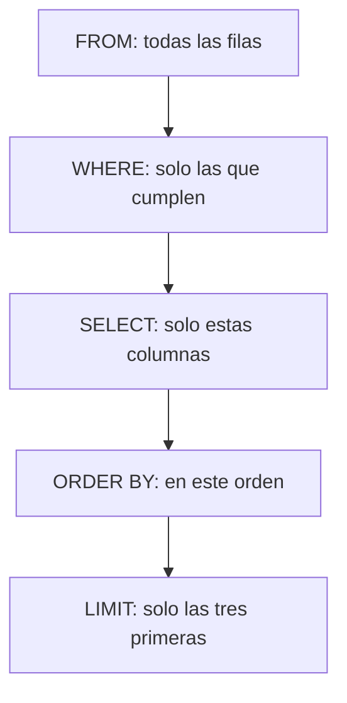

## Propósito

Aprender a hacer preguntas. Un `SELECT` tiene tres decisiones —qué filas, qué
columnas y en qué orden— y separarlas mentalmente es lo que permite escribir
consultas que hacen lo que se cree que hacen.

## Resultados de aprendizaje

Al terminar podrás:

1. Filtrar filas con `WHERE` usando comparaciones y operadores lógicos.
2. Elegir columnas y darles nombres legibles.
3. Ordenar el resultado y explicar por qué sin `ORDER BY` no hay orden.
4. Limitar el número de filas devueltas sin caer en la trampa del `LIMIT` sin
   orden.
5. Nombrar la fuente de cada afirmación anterior.

## Fundamentos

### Las tres decisiones, en el orden en que las toma el motor

Aunque se escriba `SELECT ... FROM ... WHERE ... ORDER BY`, el motor las aplica
en otro orden, y entenderlo evita la mitad de las confusiones:

| Paso | Cláusula | Decide |
|---|---|---|
| 1 | `FROM` | De dónde salen las filas |
| 2 | `WHERE` | **Cuáles** sobreviven |
| 3 | `SELECT` | **Qué columnas** se ven |
| 4 | `ORDER BY` | En qué **orden** se leen |
| 5 | `LIMIT` | **Cuántas** se devuelven |

De ahí sale, por ejemplo, que un alias definido en el `SELECT` no siempre se
pueda usar en el `WHERE`: cuando el `WHERE` se evalúa, ese alias todavía no
existe.

### `WHERE`: quedarse con unas filas

```sql
SELECT nombre, nota FROM notas WHERE nota >= 60;
```

Los operadores son los esperables —`=`, `<>`, `<`, `<=`, `>`, `>=`— y se combinan
con `AND`, `OR` y `NOT`. Tres formas que ahorran paréntesis:

```sql
WHERE nota BETWEEN 60 AND 90          -- ambos extremos incluidos
WHERE curso IN ('DB-101', 'SE-201')   -- uno de la lista
WHERE nombre LIKE 'A%'                -- empieza por A
```

**El nulo no se compara con `=`.** `WHERE correo = NULL` no devuelve las filas
sin correo: no devuelve ninguna, porque comparar con una ausencia no da ni
verdadero ni falso. La forma correcta es `WHERE correo IS NULL`. Esta es la
primera aparición de un tema que tiene clase propia más adelante, y conviene
aprenderla ya.

### `SELECT`: elegir columnas y nombrarlas

```sql
SELECT nombre AS estudiante, nota * 2 AS nota_sobre_100 FROM notas;
```

Un alias con `AS` no cambia los datos: cambia el nombre de la columna en el
resultado. Sirve para que quien lea el informe entienda qué está mirando, y para
poner nombre a una expresión calculada.

### `ORDER BY`: el orden es una decisión, no una propiedad

Una tabla **no tiene orden**. Es un conjunto de filas, y el motor las devuelve
como le resulte más barato: puede cambiar al añadir un índice, al crecer la
tabla o al ejecutar la consulta en paralelo.

```sql
SELECT nombre, nota FROM notas ORDER BY nota DESC, nombre;
```

`DESC` es de mayor a menor; sin él, de menor a mayor. Y el segundo criterio
—`nombre`— es el **desempate**: sin él, dos estudiantes con la misma nota pueden
salir en cualquier orden, y ese orden puede cambiar entre dos ejecuciones.

### `LIMIT`: la trampa

```sql
SELECT nombre, nota FROM notas ORDER BY nota DESC LIMIT 3;
```

`LIMIT` sin `ORDER BY` devuelve **tres filas cualesquiera**. En una tabla
pequeña suelen ser «las correctas» por casualidad, y por eso el error sobrevive
hasta producción, donde la tabla ya no es pequeña y las filas devueltas dejan de
tener sentido.



## Ejemplo trabajado

Con esta tabla:

| estudiante | curso | nota |
|---|---|---|
| Ada | DB-101 | 90 |
| Linus | DB-101 | 58 |
| Grace | DB-101 | 72 |
| Ada | SE-201 | 66 |
| Grace | SE-201 | 78 |

**Pregunta:** los dos mejores de DB-101 que aprobaron, con su nota.

```sql
SELECT estudiante, nota
FROM notas
WHERE curso = 'DB-101' AND nota >= 60
ORDER BY nota DESC
LIMIT 2;
```

| estudiante | nota |
|---|---|
| Ada | 90 |
| Grace | 72 |

**Traza, paso a paso.** `FROM` entrega las cinco filas. `WHERE` descarta las de
SE-201 y a Linus, que no llega a 60: quedan dos. `SELECT` se queda con dos
columnas. `ORDER BY` las coloca de mayor a menor. `LIMIT` corta a dos, que en
este caso ya eran dos.

**El mismo ejercicio, mal escrito.** Si se quita el `ORDER BY`, el motor puede
devolver `Grace, 72` y `Ada, 90` —o solo una de las dos, según el plan— y la
consulta seguirá pareciendo correcta mientras la tabla tenga cinco filas.

**Y una trampa más.** Para pedir «los que no tienen nota registrada», esto está
mal:

```sql
SELECT estudiante FROM notas WHERE nota = NULL;   -- devuelve cero filas
SELECT estudiante FROM notas WHERE nota IS NULL;  -- correcto
```

## Errores frecuentes

1. **`= NULL` en vez de `IS NULL`.** No falla: devuelve vacío, que es peor.
2. **`LIMIT` sin `ORDER BY`.** Devuelve filas arbitrarias con aspecto de
   respuesta.
3. **`ORDER BY` sin desempate.** Con valores repetidos, el orden puede cambiar
   entre ejecuciones y nadie sabrá por qué.
4. **Mezclar `AND` y `OR` sin paréntesis.** `WHERE a = 1 AND b = 2 OR c = 3` no
   significa lo que parece: `AND` se evalúa antes que `OR`.
5. **`LIKE '%texto%'` sobre tablas grandes.** Funciona y no puede usar el índice:
   es la consulta que se vuelve lenta sin que nada haya cambiado.
6. **Suponer que el orden de la tabla es el de inserción.**

## Ejemplo de transferencia

`WHERE`, `ORDER BY` y `LIMIT` son casi idénticos en todos los motores
relacionales, con una excepción que conviene conocer desde ahora: SQL Server usa
`TOP` y Oracle antiguo usaba `ROWNUM`. La norma define `FETCH FIRST n ROWS
ONLY`, que PostgreSQL, Oracle moderno y SQL Server aceptan. Se estudia en la
clase de portabilidad.

## Reto de transferencia

1. Sobre la tabla que creaste en la clase anterior, escribe cinco consultas: una
   con `WHERE` simple, una con `AND`, una con `IN`, una con `IS NULL` y una con
   `ORDER BY` y `LIMIT`.
2. Escribe una consulta con `LIMIT` **sin** `ORDER BY`, ejecútala varias veces y
   anota si el resultado cambia.
3. Escribe una consulta con `= NULL` y explica por qué devuelve lo que devuelve.
4. Añade un desempate a tu `ORDER BY` y explica qué caso concreto resuelve.

## Preguntas de evaluación

1. ¿En qué orden aplica el motor `FROM`, `WHERE`, `SELECT`, `ORDER BY` y `LIMIT`?
2. ¿Por qué `WHERE nota = NULL` devuelve cero filas?
3. ¿Qué problema concreto resuelve añadir un segundo criterio al `ORDER BY`?
4. Explica por qué `LIMIT 3` sin `ORDER BY` puede dar un resultado distinto en dos
   ejecuciones seguidas.
