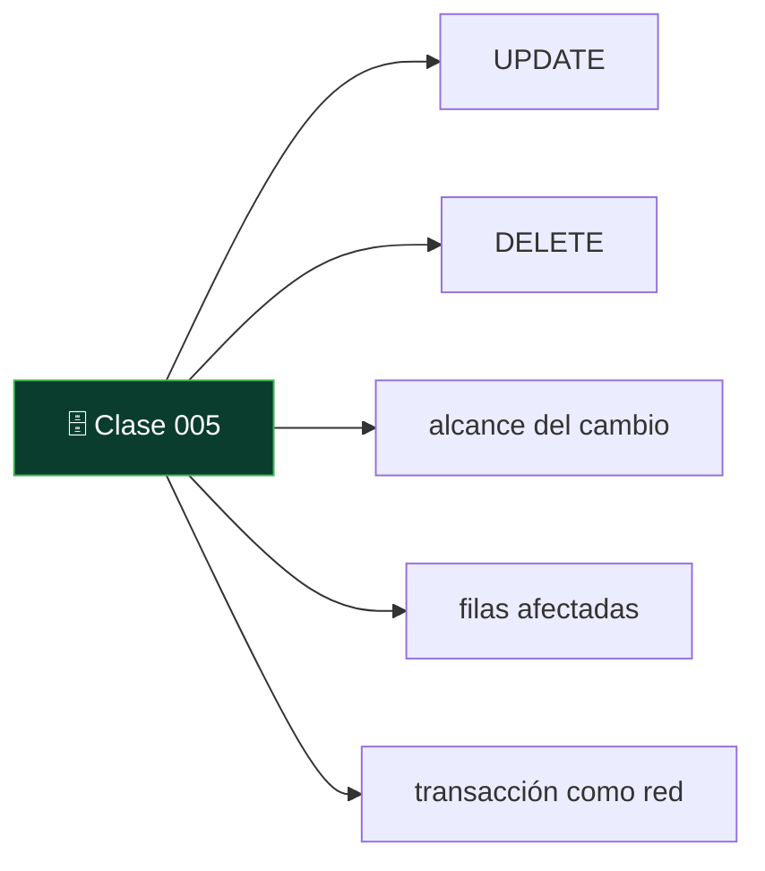
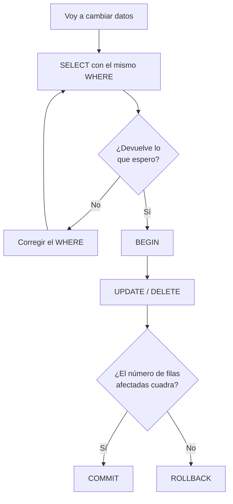

# 005 — Cambiar datos: INSERT, UPDATE, DELETE y el WHERE que salva

   

> [Programa](../../../README.md) · [Parte 00](../README.md) · [← Anterior](../../part-00-primeros-pasos-del-archivo-a-la-base-de-datos/004-leer-datos-select-where-y-order-by/README.md) · [Siguiente →](../../part-00-primeros-pasos-del-archivo-a-la-base-de-datos/006-tipos-de-datos-un-numero-no-es-un-texto/README.md)

Parte 00 — Primeros pasos: del archivo a la base de datos · Fundamentos ·
2 horas estimadas · motores `sqlite`, `duckdb`, `postgresql`, `mysql`, `mongodb` · laboratorio
[`labs/01-sql-foundations`](../../../labs/01-sql-foundations/README.md) · 3 fuentes.

**Conceptos centrales:** `UPDATE` · `DELETE` · `alcance del cambio` · `filas afectadas` · `transacción como red`

**En este caso se comparan 6 motores**: 5 lo resuelven (5 con el resultado comprobado por máquina) y 1 no, con el motivo escrito.



---

## Propósito

Modificar datos sin romper nada. Las tres órdenes que cambian el contenido de una
tabla son fáciles de escribir y fáciles de escribir **mal**, y el error más caro
de todos cabe en dos palabras que no se pusieron.

## Resultados de aprendizaje

Al terminar podrás:

1. Insertar, actualizar y borrar filas con las tres órdenes correspondientes.
2. Explicar por qué un `UPDATE` o un `DELETE` sin `WHERE` afecta a **toda** la
   tabla.
3. Aplicar el hábito de comprobar el `WHERE` con un `SELECT` antes de ejecutar.
4. Usar una transacción para poder deshacer un cambio antes de confirmarlo.
5. Nombrar la fuente de cada afirmación anterior.

## Fundamentos

### `UPDATE`: cambiar lo que ya está

```sql
UPDATE estudiantes
SET correo = 'ada@nuevo.org'
WHERE id = 1;
```

`SET` dice qué campos cambian y a qué valor. `WHERE` dice **en qué filas**. Se
pueden cambiar varios campos a la vez separándolos por comas, y el valor nuevo
puede calcularse a partir del viejo:

```sql
UPDATE cuentas SET saldo = saldo - 30 WHERE id = 'A';
```

### `DELETE`: quitar filas

```sql
DELETE FROM inscripciones WHERE estudiante_id = 3 AND curso = 'SE-201';
```

Borra filas completas. Para «borrar un dato» sin borrar la fila —dejar el correo
vacío, por ejemplo— no se usa `DELETE`, se usa `UPDATE ... SET correo = NULL`.

### La cláusula que salva

**`UPDATE` y `DELETE` sin `WHERE` afectan a todas las filas de la tabla.** No es
un error de sintaxis: es una orden perfectamente válida que hace exactamente lo
que dice.

```sql
UPDATE estudiantes SET correo = 'ada@nuevo.org';   -- todos los correos, iguales
DELETE FROM estudiantes;                            -- la tabla, vacía
```

Karwin, en *SQL Antipatterns*, dedica un capítulo entero a los hábitos que evitan
esta clase de accidentes. Los tres que más rinden:

1. **Escribir primero el `SELECT`.** Antes de cualquier `UPDATE` o `DELETE`, la
   misma condición como consulta: `SELECT * FROM estudiantes WHERE id = 1;`. Si
   devuelve lo que se espera, se cambia `SELECT *` por `UPDATE ... SET`.
2. **Envolverlo en una transacción.** `BEGIN`, la orden, mirar cuántas filas se
   afectaron, y solo entonces `COMMIT` —o `ROLLBACK` si el número sorprende.
3. **Trabajar con una copia primero.** Sobre todo cuando el `WHERE` es
   complicado.

### La transacción como red de seguridad

```sql
BEGIN;
UPDATE notas SET nota = nota + 5 WHERE curso = 'DB-101';
-- el motor informa: 3 filas afectadas
-- ¿esperabas 3? entonces:
COMMIT;
-- ¿esperabas 1? entonces:
ROLLBACK;
```

Entre el `BEGIN` y el `COMMIT`, nadie más ve el cambio y todavía se puede
deshacer. Es la diferencia entre un susto y un incidente. Esta idea tiene una
parte entera del programa dedicada; aquí basta usarla como red.

### Cuántas filas se han tocado

Todos los motores informan del número de filas afectadas, y **ese número es la
comprobación más barata que existe**. Un `UPDATE` que debía tocar una fila y toca
cuatrocientas se detecta ahí mismo, no tres semanas después.



## Ejemplo trabajado

Una academia decide subir 5 puntos a los estudiantes de DB-101. La tabla:

| estudiante | curso | nota |
|---|---|---|
| Ada | DB-101 | 90 |
| Linus | DB-101 | 58 |
| Grace | DB-101 | 72 |
| Ada | SE-201 | 66 |

**Paso 1: comprobar el alcance.**

```sql
SELECT COUNT(*) FROM notas WHERE curso = 'DB-101';   -- 3
```

Tres. Es lo esperado: hay tres estudiantes en ese curso.

**Paso 2: el cambio, dentro de una transacción.**

```sql
BEGIN;
UPDATE notas SET nota = nota + 5 WHERE curso = 'DB-101';
COMMIT;
```

Resultado: 95, 63 y 77. La nota de SE-201 no se toca.

**El mismo cambio, sin el `WHERE`.**

```sql
UPDATE notas SET nota = nota + 5;
```

Cuatro filas afectadas en vez de tres. La nota de Ada en SE-201 sube también, y
nadie lo nota hasta que ella pregunta. El error no da ningún aviso: la orden es
correcta.

**Y el caso peor.** Si el `WHERE` se escribe con un error tipográfico que
casualmente es válido —`WHERE curso = curso`, por ejemplo— la condición es cierta
para todas las filas y el efecto es el mismo que no ponerla.

## Errores frecuentes

1. **`UPDATE` o `DELETE` sin `WHERE`.** El clásico, y el único que puede
   arruinar un día entero.
2. **Ejecutar solo la parte seleccionada en un editor.** Muchas consolas ejecutan
   el texto marcado: si se marca hasta el final de la primera línea, el `WHERE`
   de la segunda no se envía. Es la causa real de buena parte de los accidentes.
3. **Confundir `DELETE` con `UPDATE ... SET campo = NULL`.** El primero quita la
   fila entera; el segundo, solo el dato.
4. **`DELETE FROM tabla` para vaciarla en producción.** Además de peligroso, es
   lento: borra fila a fila y genera registro de deshacer. Para vaciar de verdad
   existe `TRUNCATE`, que tampoco se deshace.
5. **No mirar el número de filas afectadas.** Está siempre, es gratis y avisa.
6. **Cambiar datos fuera de una transacción «porque es rápido».** Es rápido
   hasta que no lo es.

## Ejemplo de transferencia

El mismo hábito sirve fuera de SQL: en MongoDB, `updateMany` sin filtro toca
toda la colección, y `deleteMany({})` la vacía. En Redis, `FLUSHDB` no pregunta.
La forma cambia; el accidente, no. Y en todos los casos, la defensa es la misma:
mirar antes cuántos elementos coinciden.

## Reto de transferencia

1. Sobre tu tabla, escribe un `UPDATE` con `WHERE` y comprueba el número de
   filas afectadas.
2. Repite el mismo cambio dentro de una transacción y deshazlo con `ROLLBACK`;
   comprueba con un `SELECT` que los datos volvieron.
3. En una **copia** de la tabla, ejecuta un `UPDATE` sin `WHERE` y mira el
   resultado. Anota cuántas filas cambiaron.
4. Escribe la regla que vas a seguir a partir de ahora, en una frase, y pégala
   donde escribas SQL.

## Preguntas de evaluación

1. ¿Qué hace exactamente `DELETE FROM notas;`?
2. ¿Cómo se comprueba el alcance de un `UPDATE` **antes** de ejecutarlo?
3. ¿Qué diferencia hay entre borrar una fila y vaciar uno de sus campos?
4. Explica en qué caso el número de filas afectadas te habría avisado de un error
   que el motor no consideró error.

---

## 🌐 El mismo problema en cada motor

**Caso:** Subir la nota de un curso y dar de baja a un estudiante, sin tocar nada más

Dos cambios sobre cuatro notas: subir 5 puntos **solo** a las de DB-101, y
borrar **solo** las de Linus. Los dos llevan `WHERE`, y ahí está toda la
clase: sin esa cláusula, el primero subiría las cuatro notas y el segundo
vaciaría la tabla.

Ninguna de las dos versiones equivocadas da error. Son órdenes perfectamente
válidas que hacen exactamente lo que dicen, y por eso el hábito de comprobar
el alcance con un `SELECT` antes de ejecutar vale más que cualquier
herramienta.

Salida esperada, idéntica en todos los motores que lo resuelven:

| estudiante | curso | nota |
|---|---|---|
| `Ada` | `DB-101` | `95` |
| `Ada` | `SE-201` | `66` |
| `Grace` | `DB-101` | `77` |

El contrato vive en [`motores.yaml`](motores.yaml) y lo comprueba
`python scripts/verificar_equivalencia.py --clase 005`: 5 de
las 5 implementaciones se ejecutan de verdad y su
resultado se compara con esa tabla; el resto se declara como material revisado,
no ejecutado.

| Motor | ¿Resuelve el caso? | Nivel de prueba | Código | Fuente |
|---|---|---|---|---|
| SQLite | sí | núcleo | [código](implementaciones/sqlite/consulta.sql) | [doc oficial](https://sqlite.org/lang_update.html) |
| DuckDB | sí | núcleo | [código](implementaciones/duckdb/consulta.sql) | [doc oficial](https://duckdb.org/docs/stable/sql/statements/update) |
| PostgreSQL | sí | servicio | [código](implementaciones/postgresql/consulta.sql) | [doc oficial](https://www.postgresql.org/docs/current/sql-update.html) |
| MySQL | sí | servicio | [código](implementaciones/mysql/consulta.sql) | [doc oficial](https://dev.mysql.com/doc/refman/8.4/en/mysql-tips.html) |
| MongoDB | sí | servicio | [código](implementaciones/mongodb/consulta.js) | [doc oficial](https://www.mongodb.com/docs/manual/reference/method/db.collection.updateMany/) |
| Redis | **no** | — | — | [doc oficial](https://redis.io/docs/latest/commands/flushdb/) |

### Los que resuelven el caso

#### SQLite · [`implementaciones/sqlite/consulta.sql`](implementaciones/sqlite/consulta.sql)

✅ **verificado** — se ejecuta en CI sin servicios

```sql
-- motor: sqlite
-- doc: https://sqlite.org/lang_update.html
-- nota: la comprobacion mas barata contra un WHERE mal escrito es contar antes:
--         SELECT COUNT(*) FROM notas WHERE curso = 'DB-101';   -- 3
--       y despues del cambio, changes() dice cuantas filas se tocaron de verdad.

-- === preparacion ===
CREATE TABLE notas (
    estudiante TEXT NOT NULL,
    curso      TEXT NOT NULL,
    nota       INTEGER NOT NULL,
    PRIMARY KEY (estudiante, curso)
);
INSERT INTO notas (estudiante, curso, nota) VALUES
    ('Ada',   'DB-101', 90),
    ('Linus', 'DB-101', 58),
    ('Grace', 'DB-101', 72),
    ('Ada',   'SE-201', 66);

-- Subir 5 puntos SOLO a DB-101. Sin el WHERE, subirian las cuatro notas.
UPDATE notas SET nota = nota + 5 WHERE curso = 'DB-101';

-- Dar de baja a Linus. Sin el WHERE, la tabla quedaria vacia.
DELETE FROM notas WHERE estudiante = 'Linus';

-- === consulta ===
SELECT estudiante, curso, nota FROM notas ORDER BY estudiante, curso;
```

- **Por qué sí:** `UPDATE` y `DELETE` con la sintaxis estándar, y una función —`changes()`— que devuelve cuántas filas se tocaron: la comprobación más barata que existe contra un `WHERE` mal escrito.
- **Por qué no:** No hay usuarios ni permisos: cualquiera con acceso al archivo puede ejecutar el `DELETE` sin `WHERE`. En un motor con servidor, al menos se puede negar ese permiso.
- 📄 Documentación oficial: <https://sqlite.org/lang_update.html>

#### DuckDB · [`implementaciones/duckdb/consulta.sql`](implementaciones/duckdb/consulta.sql)

✅ **verificado** — se ejecuta en CI sin servicios

```sql
-- motor: duckdb
-- doc: https://duckdb.org/docs/stable/sql/statements/update
-- nota: aqui lo natural es comprobar el alcance sobre una COPIA de los datos
--       reales antes de tocar produccion: contar coincidencias de un WHERE
--       complicado sobre millones de filas cuesta segundos.

-- === preparacion ===
CREATE TABLE notas (
    estudiante VARCHAR NOT NULL,
    curso      VARCHAR NOT NULL,
    nota       INTEGER NOT NULL,
    PRIMARY KEY (estudiante, curso)
);
INSERT INTO notas (estudiante, curso, nota) VALUES
    ('Ada',   'DB-101', 90),
    ('Linus', 'DB-101', 58),
    ('Grace', 'DB-101', 72),
    ('Ada',   'SE-201', 66);

-- Subir 5 puntos SOLO a DB-101. Sin el WHERE, subirian las cuatro notas.
UPDATE notas SET nota = nota + 5 WHERE curso = 'DB-101';

-- Dar de baja a Linus. Sin el WHERE, la tabla quedaria vacia.
DELETE FROM notas WHERE estudiante = 'Linus';

-- === consulta ===
SELECT estudiante, curso, nota FROM notas ORDER BY estudiante, curso;
```

- **Por qué sí:** Misma sintaxis, y es el sitio natural para comprobar el alcance **antes**: contar cuántas filas coinciden con el `WHERE` sobre una copia de los datos reales cuesta segundos.
- **Por qué no:** Modificar filas de una en una es lo que peor hace un motor columnar: cada `UPDATE` reescribe bloques enteros de columna.
- 📄 Documentación oficial: <https://duckdb.org/docs/stable/sql/statements/update>

#### PostgreSQL · [`implementaciones/postgresql/consulta.sql`](implementaciones/postgresql/consulta.sql)

✅ **verificado** — se ejecuta contra el motor real levantado con `docker compose`

```sql
-- motor: postgresql
-- doc: https://www.postgresql.org/docs/current/sql-update.html
-- nota: la red de seguridad completa:
--         BEGIN;
--         UPDATE notas SET nota = nota + 5 WHERE curso = 'DB-101';
--         -- el motor informa: UPDATE 3.  Si no es 3, ROLLBACK.
--         COMMIT;

-- === preparacion ===
DROP TABLE IF EXISTS notas;

CREATE TABLE notas (
    estudiante text NOT NULL,
    curso      text NOT NULL,
    nota       integer NOT NULL,
    PRIMARY KEY (estudiante, curso)
);
INSERT INTO notas (estudiante, curso, nota) VALUES
    ('Ada',   'DB-101', 90),
    ('Linus', 'DB-101', 58),
    ('Grace', 'DB-101', 72),
    ('Ada',   'SE-201', 66);

-- Subir 5 puntos SOLO a DB-101. Sin el WHERE, subirian las cuatro notas.
UPDATE notas SET nota = nota + 5 WHERE curso = 'DB-101';

-- Dar de baja a Linus. Sin el WHERE, la tabla quedaria vacia.
DELETE FROM notas WHERE estudiante = 'Linus';

-- === consulta ===
SELECT estudiante, curso, nota FROM notas ORDER BY estudiante, curso;
```

- **Por qué sí:** Aquí el `UPDATE` puede ir dentro de una transacción **junto con el recuento**: si el número de filas afectadas no cuadra, `ROLLBACK` y no ha pasado nada. Es la red de seguridad completa.
- **Por qué no:** Un `UPDATE` no modifica la fila: escribe una versión nueva y deja la vieja muerta hasta que el vacío la retire. Un `UPDATE` masivo sin `WHERE` no solo cambia los datos: también hincha la tabla.
- 📄 Documentación oficial: <https://www.postgresql.org/docs/current/sql-update.html>

#### MySQL · [`implementaciones/mysql/consulta.sql`](implementaciones/mysql/consulta.sql)

✅ **verificado** — se ejecuta contra el motor real levantado con `docker compose`

```sql
-- motor: mysql
-- doc: https://dev.mysql.com/doc/refman/8.4/en/mysql-tips.html
-- nota: MySQL tiene una defensa especifica para este accidente:
--         SET sql_safe_updates = 1;
--       Con eso, un UPDATE o un DELETE sin WHERE sobre una columna indexada se
--       RECHAZA. El cliente de consola lo activa con --safe-updates, y las
--       conexiones de aplicacion no lo traen activado.

-- === preparacion ===
DROP TABLE IF EXISTS notas;

CREATE TABLE notas (
    estudiante VARCHAR(50) NOT NULL,
    curso      VARCHAR(50) NOT NULL,
    nota       INT NOT NULL,
    PRIMARY KEY (estudiante, curso)
);
INSERT INTO notas (estudiante, curso, nota) VALUES
    ('Ada',   'DB-101', 90),
    ('Linus', 'DB-101', 58),
    ('Grace', 'DB-101', 72),
    ('Ada',   'SE-201', 66);

-- Subir 5 puntos SOLO a DB-101. Sin el WHERE, subirian las cuatro notas.
UPDATE notas SET nota = nota + 5 WHERE curso = 'DB-101';

-- Dar de baja a Linus. Sin el WHERE, la tabla quedaria vacia.
DELETE FROM notas WHERE estudiante = 'Linus';

-- === consulta ===
SELECT estudiante, curso, nota FROM notas ORDER BY estudiante, curso;
```

- **Por qué sí:** Tiene una defensa específica para este accidente: el modo seguro de actualización (`sql_safe_updates`), que **rechaza** un `UPDATE` o un `DELETE` sin `WHERE` sobre una columna indexada. El cliente `mysql` lo activa con `--safe-updates`.
- **Por qué no:** Viene desactivado por omisión en las conexiones de aplicación, así que la protección solo existe donde alguien la activó a propósito.
- 📄 Documentación oficial: <https://dev.mysql.com/doc/refman/8.4/en/mysql-tips.html>

#### MongoDB · [`implementaciones/mongodb/consulta.js`](implementaciones/mongodb/consulta.js)

✅ **verificado** — se ejecuta contra el motor real levantado con `docker compose`

```javascript
// motor: mongodb
// doc: https://www.mongodb.com/docs/manual/reference/method/db.collection.updateMany/
// nota: la API OBLIGA a elegir: updateOne o updateMany, deleteOne o deleteMany.
//       Ese nombre explicito es mejor defensa que la de SQL, donde una sola
//       palabra separa una fila de un millon. Lo que no cambia: deleteMany({})
//       vacia la coleccion, y el filtro vacio es lo que devuelve un objeto sin
//       inicializar.

// === preparacion ===
db.notas.drop();
db.notas.insertMany([
  { estudiante: "Ada", curso: "DB-101", nota: 90 },
  { estudiante: "Linus", curso: "DB-101", nota: 58 },
  { estudiante: "Grace", curso: "DB-101", nota: 72 },
  { estudiante: "Ada", curso: "SE-201", nota: 66 },
]);

const subidas = db.notas.updateMany({ curso: "DB-101" }, { $inc: { nota: 5 } });
const bajas = db.notas.deleteMany({ estudiante: "Linus" });
if (subidas.modifiedCount !== 3 || bajas.deletedCount !== 1) {
  throw new Error("el alcance del cambio no era el esperado");
}

// === consulta ===
db.notas
  .find({}, { _id: 0 })
  .sort({ estudiante: 1, curso: 1 })
  .forEach((d) => print(d.estudiante + "|" + d.curso + "|" + d.nota));
```

- **Por qué sí:** La API obliga a elegir: `updateOne` o `updateMany`, `deleteOne` o `deleteMany`. Ese nombre explícito es una defensa mejor que la de SQL, donde una sola palabra decide entre una fila y un millón.
- **Por qué no:** `deleteMany({})` con el filtro vacío vacía la colección igual, y el filtro vacío es lo que devuelve un objeto sin inicializar: el accidente cambia de forma, no desaparece.
- 📄 Documentación oficial: <https://www.mongodb.com/docs/manual/reference/method/db.collection.updateMany/>

### Los que no resuelven este caso — y qué se hace en su lugar

Descartar un motor con un argumento es tan formativo como usarlo. Ninguna de estas filas dice que el motor sea peor: dice que este problema no es el suyo.

| Motor | Por qué no | Qué se hace en su lugar | Fuente |
|---|---|---|---|
| Redis | No hay condición que escribir: cada orden actúa sobre una clave concreta. El accidente equivalente existe y es peor —`FLUSHDB` vacía la base sin preguntar, y `KEYS *` bloquea el servidor entero mientras recorre—, pero no se parece a un `WHERE` olvidado. | Renombrar las órdenes peligrosas en la configuración (`rename-command FLUSHDB ""`) es la defensa habitual: quitarlas de en medio en vez de confiar en no escribirlas. | [doc](https://redis.io/docs/latest/commands/flushdb/) |

---

## Laboratorio

```bash
python scripts/validate_repository.py
python labs/01-sql-foundations/run_lab.py
```

Guarda como evidencia la salida completa, la versión del motor y la semilla o
los parámetros usados. Una captura sin comando no es evidencia: no se puede
repetir.

## Evaluación

| Criterio | Peso | Qué se comprueba |
|---|---:|---|
| Comprensión conceptual | 25 % | Explica el mecanismo, no solo el resultado |
| Ejecución reproducible | 25 % | Otra persona obtiene lo mismo con las instrucciones dadas |
| Interpretación basada en evidencia | 25 % | Cada conclusión se apoya en una salida o una medición |
| Límites y riesgos declarados | 25 % | Dice qué no demuestra el ejercicio y qué faltaría en producción |

La clase se da por superada cuando la respuesta explica el mecanismo, muestra
la salida que la respalda y declara al menos un límite del ejercicio.

## Fuentes de esta clase

Todo lo afirmado arriba procede de estas obras. Los identificadores viven en
[`catalog/sources.json`](../../../catalog/sources.json) y el estado de los
enlaces se comprueba con `python scripts/check_external_links.py`.

- **Bill Karwin** (2010). [SQL Antipatterns: Avoiding the Pitfalls of Database Programming](https://pragprog.com/titles/bksqla/sql-antipatterns/). Pragmatic Bookshelf. ISBN 978-1-934356-55-5.  
  Catálogo de errores de modelado con su corrección y cuando el antipatron es aceptable.
- **SQLite Consortium** (2026). [SQLite Documentation](https://sqlite.org/docs.html).  
  Motor embebido usado por los laboratorios sin dependencias del programa.
- **ISO/IEC JTC 1/SC 32** (2023). [ISO/IEC 9075: Information technology - Database languages - SQL](https://www.iso.org/standard/76583.html).  
  Norma del lenguaje SQL. Ningún motor la implementa por completo.

---

> [Programa](../../../README.md) · [Parte 00](../README.md) · [← Anterior](../../part-00-primeros-pasos-del-archivo-a-la-base-de-datos/004-leer-datos-select-where-y-order-by/README.md) · [Siguiente →](../../part-00-primeros-pasos-del-archivo-a-la-base-de-datos/006-tipos-de-datos-un-numero-no-es-un-texto/README.md)
