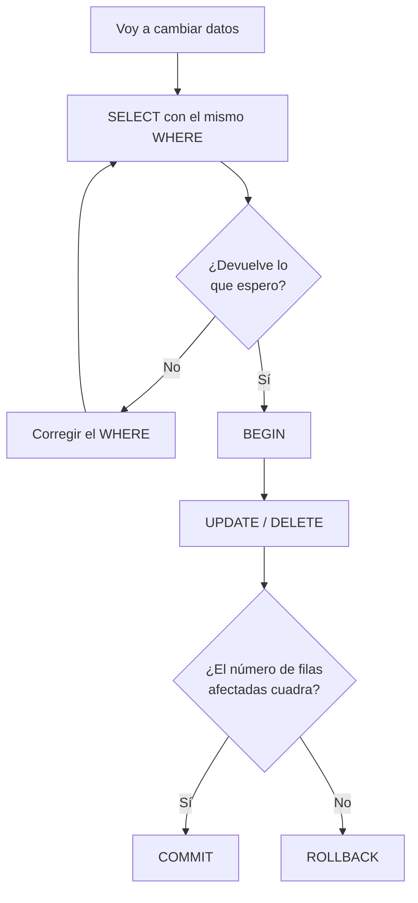

## Propósito

Modificar datos sin romper nada. Las tres órdenes que cambian el contenido de una
tabla son fáciles de escribir y fáciles de escribir **mal**, y el error más caro
de todos cabe en dos palabras que no se pusieron.

## Resultados de aprendizaje

Al terminar podrás:

1. Insertar, actualizar y borrar filas con las tres órdenes correspondientes.
2. Explicar por qué un `UPDATE` o un `DELETE` sin `WHERE` afecta a **toda** la
   tabla.
3. Aplicar el hábito de comprobar el `WHERE` con un `SELECT` antes de ejecutar.
4. Usar una transacción para poder deshacer un cambio antes de confirmarlo.
5. Nombrar la fuente de cada afirmación anterior.

## Fundamentos

### `UPDATE`: cambiar lo que ya está

```sql
UPDATE estudiantes
SET correo = 'ada@nuevo.org'
WHERE id = 1;
```

`SET` dice qué campos cambian y a qué valor. `WHERE` dice **en qué filas**. Se
pueden cambiar varios campos a la vez separándolos por comas, y el valor nuevo
puede calcularse a partir del viejo:

```sql
UPDATE cuentas SET saldo = saldo - 30 WHERE id = 'A';
```

### `DELETE`: quitar filas

```sql
DELETE FROM inscripciones WHERE estudiante_id = 3 AND curso = 'SE-201';
```

Borra filas completas. Para «borrar un dato» sin borrar la fila —dejar el correo
vacío, por ejemplo— no se usa `DELETE`, se usa `UPDATE ... SET correo = NULL`.

### La cláusula que salva

**`UPDATE` y `DELETE` sin `WHERE` afectan a todas las filas de la tabla.** No es
un error de sintaxis: es una orden perfectamente válida que hace exactamente lo
que dice.

```sql
UPDATE estudiantes SET correo = 'ada@nuevo.org';   -- todos los correos, iguales
DELETE FROM estudiantes;                            -- la tabla, vacía
```

Karwin, en *SQL Antipatterns*, dedica un capítulo entero a los hábitos que evitan
esta clase de accidentes. Los tres que más rinden:

1. **Escribir primero el `SELECT`.** Antes de cualquier `UPDATE` o `DELETE`, la
   misma condición como consulta: `SELECT * FROM estudiantes WHERE id = 1;`. Si
   devuelve lo que se espera, se cambia `SELECT *` por `UPDATE ... SET`.
2. **Envolverlo en una transacción.** `BEGIN`, la orden, mirar cuántas filas se
   afectaron, y solo entonces `COMMIT` —o `ROLLBACK` si el número sorprende.
3. **Trabajar con una copia primero.** Sobre todo cuando el `WHERE` es
   complicado.

### La transacción como red de seguridad

```sql
BEGIN;
UPDATE notas SET nota = nota + 5 WHERE curso = 'DB-101';
-- el motor informa: 3 filas afectadas
-- ¿esperabas 3? entonces:
COMMIT;
-- ¿esperabas 1? entonces:
ROLLBACK;
```

Entre el `BEGIN` y el `COMMIT`, nadie más ve el cambio y todavía se puede
deshacer. Es la diferencia entre un susto y un incidente. Esta idea tiene una
parte entera del programa dedicada; aquí basta usarla como red.

### Cuántas filas se han tocado

Todos los motores informan del número de filas afectadas, y **ese número es la
comprobación más barata que existe**. Un `UPDATE` que debía tocar una fila y toca
cuatrocientas se detecta ahí mismo, no tres semanas después.



## Ejemplo trabajado

Una academia decide subir 5 puntos a los estudiantes de DB-101. La tabla:

| estudiante | curso | nota |
|---|---|---|
| Ada | DB-101 | 90 |
| Linus | DB-101 | 58 |
| Grace | DB-101 | 72 |
| Ada | SE-201 | 66 |

**Paso 1: comprobar el alcance.**

```sql
SELECT COUNT(*) FROM notas WHERE curso = 'DB-101';   -- 3
```

Tres. Es lo esperado: hay tres estudiantes en ese curso.

**Paso 2: el cambio, dentro de una transacción.**

```sql
BEGIN;
UPDATE notas SET nota = nota + 5 WHERE curso = 'DB-101';
COMMIT;
```

Resultado: 95, 63 y 77. La nota de SE-201 no se toca.

**El mismo cambio, sin el `WHERE`.**

```sql
UPDATE notas SET nota = nota + 5;
```

Cuatro filas afectadas en vez de tres. La nota de Ada en SE-201 sube también, y
nadie lo nota hasta que ella pregunta. El error no da ningún aviso: la orden es
correcta.

**Y el caso peor.** Si el `WHERE` se escribe con un error tipográfico que
casualmente es válido —`WHERE curso = curso`, por ejemplo— la condición es cierta
para todas las filas y el efecto es el mismo que no ponerla.

## Errores frecuentes

1. **`UPDATE` o `DELETE` sin `WHERE`.** El clásico, y el único que puede
   arruinar un día entero.
2. **Ejecutar solo la parte seleccionada en un editor.** Muchas consolas ejecutan
   el texto marcado: si se marca hasta el final de la primera línea, el `WHERE`
   de la segunda no se envía. Es la causa real de buena parte de los accidentes.
3. **Confundir `DELETE` con `UPDATE ... SET campo = NULL`.** El primero quita la
   fila entera; el segundo, solo el dato.
4. **`DELETE FROM tabla` para vaciarla en producción.** Además de peligroso, es
   lento: borra fila a fila y genera registro de deshacer. Para vaciar de verdad
   existe `TRUNCATE`, que tampoco se deshace.
5. **No mirar el número de filas afectadas.** Está siempre, es gratis y avisa.
6. **Cambiar datos fuera de una transacción «porque es rápido».** Es rápido
   hasta que no lo es.

## Ejemplo de transferencia

El mismo hábito sirve fuera de SQL: en MongoDB, `updateMany` sin filtro toca
toda la colección, y `deleteMany({})` la vacía. En Redis, `FLUSHDB` no pregunta.
La forma cambia; el accidente, no. Y en todos los casos, la defensa es la misma:
mirar antes cuántos elementos coinciden.

## Reto de transferencia

1. Sobre tu tabla, escribe un `UPDATE` con `WHERE` y comprueba el número de
   filas afectadas.
2. Repite el mismo cambio dentro de una transacción y deshazlo con `ROLLBACK`;
   comprueba con un `SELECT` que los datos volvieron.
3. En una **copia** de la tabla, ejecuta un `UPDATE` sin `WHERE` y mira el
   resultado. Anota cuántas filas cambiaron.
4. Escribe la regla que vas a seguir a partir de ahora, en una frase, y pégala
   donde escribas SQL.

## Preguntas de evaluación

1. ¿Qué hace exactamente `DELETE FROM notas;`?
2. ¿Cómo se comprueba el alcance de un `UPDATE` **antes** de ejecutarlo?
3. ¿Qué diferencia hay entre borrar una fila y vaciar uno de sus campos?
4. Explica en qué caso el número de filas afectadas te habría avisado de un error
   que el motor no consideró error.
