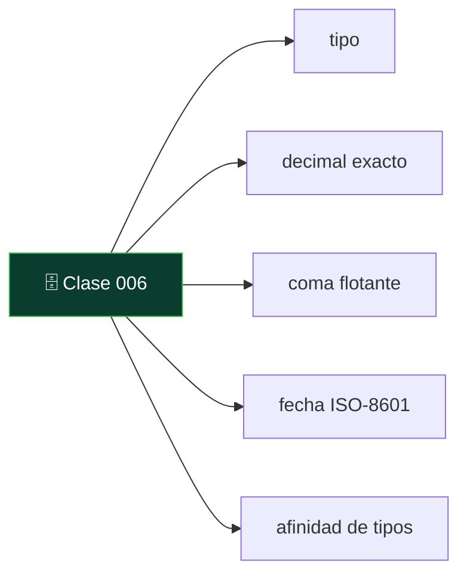
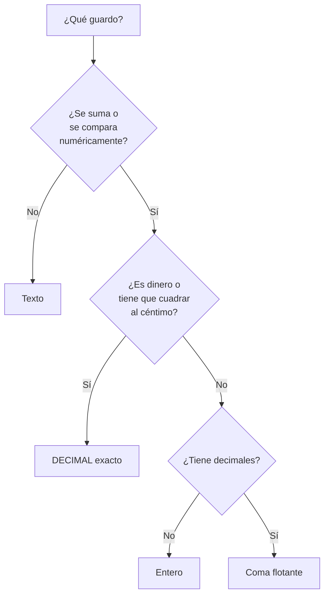

# 006 — Tipos de datos: por qué un número no es un texto

   

> [Programa](../../../README.md) · [Parte 00](../README.md) · [← Anterior](../../part-00-primeros-pasos-del-archivo-a-la-base-de-datos/005-cambiar-datos-insert-update-delete/README.md) · [Siguiente →](../../part-00-primeros-pasos-del-archivo-a-la-base-de-datos/007-la-clave-primaria/README.md)

Parte 00 — Primeros pasos: del archivo a la base de datos · Fundamentos ·
2 horas estimadas · motores `sqlite`, `duckdb`, `postgresql`, `mysql`, `mongodb` · laboratorio
[`labs/01-sql-foundations`](../../../labs/01-sql-foundations/README.md) · 3 fuentes.

**Conceptos centrales:** `tipo` · `decimal exacto` · `coma flotante` · `fecha ISO-8601` · `afinidad de tipos`

**En este caso se comparan 6 motores**: 5 lo resuelven (5 con el resultado comprobado por máquina) y 1 no, con el motivo escrito.



---

## Propósito

Entender por qué el tipo de un campo no es una formalidad. Elegirlo mal no
provoca un error inmediato: provoca ordenaciones absurdas, sumas equivocadas y
comparaciones que fallan justo cuando importan.

## Resultados de aprendizaje

Al terminar podrás:

1. Elegir el tipo adecuado para un dato y justificarlo.
2. Explicar qué pasa al ordenar números guardados como texto.
3. Distinguir cuándo usar decimal exacto y cuándo coma flotante.
4. Guardar fechas y horas de forma que se puedan comparar y ordenar.
5. Nombrar la fuente de cada afirmación anterior.

## Fundamentos

### Para qué sirve un tipo

Un tipo hace tres cosas a la vez:

- **Restringe** los valores posibles: en una columna entera no cabe `hola`.
- **Define las operaciones**: se pueden restar dos fechas, no dos correos.
- **Decide el orden**: los números se ordenan por valor y el texto, carácter a
  carácter.

Esa tercera es la que más sorprende, y la que produce el fallo más visible.

### El número guardado como texto

Si `nota` es texto, este es el orden que devuelve el motor:

| Como texto | Como número |
|---|---|
| `100` | `58` |
| `58` | `72` |
| `72` | `90` |
| `90` | `100` |

`100` va primero porque el texto se compara carácter a carácter y `'1'` es menor
que `'5'`. Nadie escribe un informe pensando en eso; simplemente el informe sale
mal ordenado y alguien decide que «la base de datos está rara».

Lo mismo ocurre al comparar: `'9' > '100'` es cierto en texto y falso en números.

### Los tipos que hacen falta al principio

| Familia | Para qué | Nombres habituales |
|---|---|---|
| Entero | Cantidades sin decimales, identificadores | `INTEGER`, `INT`, `BIGINT` |
| Decimal exacto | Dinero, notas, cualquier cosa que se sume | `DECIMAL(p,s)`, `NUMERIC(p,s)` |
| Coma flotante | Medidas físicas, promedios aproximados | `REAL`, `DOUBLE PRECISION` |
| Texto | Nombres, correos, descripciones | `TEXT`, `VARCHAR(n)` |
| Fecha y hora | Cuándo ocurrió algo | `DATE`, `TIMESTAMP`, `TIMESTAMPTZ` |
| Booleano | Sí o no | `BOOLEAN` |

### Dinero nunca en coma flotante

`0.1 + 0.2` no da `0.3` en coma flotante: da `0.30000000000000004`. No es un
fallo del motor, es cómo funciona el formato binario de la norma IEEE 754, y
ocurre en todos los lenguajes y todos los motores.

Para dinero —y para cualquier cifra que se sume y después se compare con otra
suma— hay que usar decimal exacto: `DECIMAL(12,2)` guarda doce dígitos con dos
decimales y suma sin error. La coma flotante está bien para una temperatura o un
promedio; está mal para una factura.

### Fechas: texto ISO o tipo de fecha, nunca otra cosa

Guardar `19/08/2026` como texto significa que ordenar por fecha ordena por día,
y que `31/12/2025` va después de `01/01/2026`. Hay dos opciones aceptables:

- Un **tipo de fecha** de verdad (`DATE`, `TIMESTAMP`), que es lo correcto cuando
  el motor lo tiene.
- Texto en formato **ISO-8601** (`2026-08-19`, `2026-08-19T10:15:00Z`), que se
  ordena bien alfabéticamente por diseño del propio formato. Es lo que hace
  SQLite, que no tiene tipo de fecha.

Y con la hora, una regla más: **guardar en UTC y convertir al mostrar**. Guardar
la hora local hace imposible saber, seis meses después, si aquellas dos de la
madrugada eran antes o después del cambio de horario.

### Un aviso sobre SQLite

SQLite tiene **tipado por afinidad**: acepta un texto en una columna declarada
`INTEGER` si no puede convertirlo. Desde la versión 3.37 existen las tablas
`STRICT`, que sí comprueban el tipo, pero no son las de por omisión. Conviene
saberlo, porque significa que en SQLite el tipo protege menos de lo que parece.



## Ejemplo trabajado

Una tienda guarda sus importes como texto, «porque así se ve el símbolo».

| producto | precio |
|---|---|
| teclado | `$120,00` |
| ratón | `$80,00` |
| cable | `$100,00` |

**Tres cosas dejan de funcionar a la vez.**

Ordenar por precio da: `$100,00`, `$120,00`, `$80,00`. El ratón, que es el más
barato, sale último.

Sumar es imposible sin limpiar el texto en cada consulta: quitar el símbolo,
cambiar la coma por punto, convertir. Y cada consulta tiene que acordarse.

Filtrar «los que cuestan más de 90» exige la misma limpieza, y si un solo
registro trae `$1.200,00` con separador de miles, la conversión falla o —peor—
devuelve `1.200` y el producto más caro aparece como el más barato.

**La versión correcta.**

```sql
CREATE TABLE productos (
    producto TEXT NOT NULL,
    precio   DECIMAL(10,2) NOT NULL CHECK (precio >= 0)
);
INSERT INTO productos VALUES ('teclado', 120.00), ('raton', 80.00), ('cable', 100.00);

SELECT producto, precio FROM productos ORDER BY precio;
```

El símbolo de moneda no se guarda: **se aplica al mostrar**. Es una decisión de
presentación, y en el dato solo estorba. Si hacen falta varias monedas, la
moneda es otro campo, no parte del número.

## Errores frecuentes

1. **Números como texto.** Ordena mal, compara mal y no suma.
2. **Dinero en coma flotante.** Cuadra durante meses y un día falta un céntimo.
3. **Fechas como texto en formato local.** `19/08/2026` no se puede ordenar.
4. **Guardar el formato junto al dato.** `$1.234,50`, `45 %`, `1,5 kg`: el número
   y su unidad son dos cosas.
5. **`VARCHAR(255)` por costumbre.** Ese número viene de una limitación antigua
   de MySQL; el límite debería salir del dominio, no de la tradición.
6. **Guardar la hora local sin zona.** Irrecuperable cuando cambia el horario.
7. **Confiar en el tipo declarado en SQLite sin `STRICT`.**

## Ejemplo de transferencia

La misma decisión aparece fuera del modelo relacional: en MongoDB hay que
elegir entre `NumberInt`, `NumberLong`, `NumberDecimal` y el doble por omisión —y
el por omisión es coma flotante, con el problema del céntimo—. En Redis todo es
texto y la conversión la hace el cliente. El tipo nunca desaparece: cambia de
sitio.

## Reto de transferencia

1. Revisa una tabla real y anota el tipo de cada campo y el tipo que debería
   tener.
2. Encuentra al menos un campo numérico guardado como texto, o uno con formato
   incrustado.
3. Ejecuta `SELECT ... ORDER BY` sobre ese campo y guarda el resultado: es la
   prueba.
4. Escribe la sentencia que lo corregiría y el riesgo que tendría ejecutarla en
   producción.

## Preguntas de evaluación

1. ¿Por qué `100` va antes que `58` al ordenar texto?
2. ¿Cuándo usarías `DECIMAL` y cuándo coma flotante? Da un ejemplo de cada uno.
3. ¿Qué dos formas aceptables hay de guardar una fecha, y por qué el formato
   `19/08/2026` no es una de ellas?
4. ¿Qué significa que SQLite tenga tipado por afinidad y qué consecuencia
   práctica tiene?

---

## 🌐 El mismo problema en cada motor

**Caso:** Ordenar tres precios y que el más barato salga primero

Tres productos con sus precios, ordenados de menor a mayor. Parece que no
hay nada que aprender, y lo hay: **si esos precios estuvieran guardados como
texto**, el orden sería 100, 120, 80. El texto se compara carácter a
carácter y `'1'` es menor que `'8'`, así que el producto más barato saldría
el último.

Nadie escribe un informe pensando en eso. Simplemente el informe sale mal
ordenado y alguien concluye que la base de datos está rara. El caso guarda
el precio como número —y sin el símbolo de moneda, que es presentación y no
dato— para que el orden sea el que cualquiera espera.

Salida esperada, idéntica en todos los motores que lo resuelven:

| producto | precio |
|---|---|
| `raton` | `80` |
| `cable` | `100` |
| `teclado` | `120` |

El contrato vive en [`motores.yaml`](motores.yaml) y lo comprueba
`python scripts/verificar_equivalencia.py --clase 006`: 5 de
las 5 implementaciones se ejecutan de verdad y su
resultado se compara con esa tabla; el resto se declara como material revisado,
no ejecutado.

| Motor | ¿Resuelve el caso? | Nivel de prueba | Código | Fuente |
|---|---|---|---|---|
| SQLite | sí | núcleo | [código](implementaciones/sqlite/consulta.sql) | [doc oficial](https://sqlite.org/datatype3.html) |
| DuckDB | sí | núcleo | [código](implementaciones/duckdb/consulta.sql) | [doc oficial](https://duckdb.org/docs/stable/sql/data_types/numeric) |
| PostgreSQL | sí | servicio | [código](implementaciones/postgresql/consulta.sql) | [doc oficial](https://www.postgresql.org/docs/current/datatype.html) |
| MySQL | sí | servicio | [código](implementaciones/mysql/consulta.sql) | [doc oficial](https://dev.mysql.com/doc/refman/8.4/en/sql-mode.html) |
| MongoDB | sí | servicio | [código](implementaciones/mongodb/consulta.js) | [doc oficial](https://www.mongodb.com/docs/manual/reference/bson-type-comparison-order/) |
| Redis | **no** | — | — | [doc oficial](https://redis.io/docs/latest/develop/data-types/sorted-sets/) |

### Los que resuelven el caso

#### SQLite · [`implementaciones/sqlite/consulta.sql`](implementaciones/sqlite/consulta.sql)

✅ **verificado** — se ejecuta en CI sin servicios

```sql
-- motor: sqlite
-- doc: https://sqlite.org/datatype3.html
-- nota: para ver el problema, basta crear la misma tabla con `precio TEXT` y
--       repetir la consulta: el orden pasa a ser 100, 120, 80.
--       Y el aviso propio de SQLite: sin STRICT, una columna declarada INTEGER
--       acepta un texto si no puede convertirlo, y entonces el orden mezcla
--       criterios.

-- === preparacion ===
-- El precio como NUMERO, no como texto. Sin simbolo de moneda: el simbolo se
-- pone al mostrar, y dentro del dato solo estorba.
CREATE TABLE productos (
    producto TEXT PRIMARY KEY,
    precio   INTEGER NOT NULL CHECK (precio >= 0)
);
INSERT INTO productos (producto, precio) VALUES
    ('teclado', 120),
    ('raton',    80),
    ('cable',   100);

-- === consulta ===
-- Guardados como texto, el orden seria: 100, 120, 80 —porque '1' < '8'— y el
-- producto mas barato saldria el ultimo. Como numeros, el orden es el que
-- cualquiera espera.
SELECT producto, precio FROM productos ORDER BY precio;
```

- **Por qué sí:** Permite comprobar el efecto en un minuto: crear la misma tabla con el precio como texto y ver el orden cambiar.
- **Por qué no:** Es el peor motor para confiarse: su tipado por **afinidad** acepta un texto en una columna declarada numérica si no puede convertirlo, así que una columna «entera» puede acabar con valores de texto y ordenar de forma inconsistente. Las tablas `STRICT` lo arreglan y no son las de por omisión.
- 📄 Documentación oficial: <https://sqlite.org/datatype3.html>

#### DuckDB · [`implementaciones/duckdb/consulta.sql`](implementaciones/duckdb/consulta.sql)

✅ **verificado** — se ejecuta en CI sin servicios

```sql
-- motor: duckdb
-- doc: https://duckdb.org/docs/stable/sql/data_types/numeric
-- nota: aqui el tipo se comprueba siempre: INSERT INTO productos VALUES
--       ('x', 'alto') falla. Y para dinero con centimos, el tipo correcto es
--       DECIMAL(10,2), no un numero de coma flotante: 0.1 + 0.2 no da 0.3.

-- === preparacion ===
-- El precio como NUMERO, no como texto. Sin simbolo de moneda: el simbolo se
-- pone al mostrar, y dentro del dato solo estorba.
CREATE TABLE productos (
    producto VARCHAR PRIMARY KEY,
    precio   INTEGER NOT NULL CHECK (precio >= 0)
);
INSERT INTO productos (producto, precio) VALUES
    ('teclado', 120),
    ('raton',    80),
    ('cable',   100);

-- === consulta ===
-- Guardados como texto, el orden seria: 100, 120, 80 —porque '1' < '8'— y el
-- producto mas barato saldria el ultimo. Como numeros, el orden es el que
-- cualquiera espera.
SELECT producto, precio FROM productos ORDER BY precio;
```

- **Por qué sí:** El tipado es estricto: insertar `'alto'` en una columna entera falla. Y tiene `DECIMAL` exacto, que es el tipo correcto para dinero cuando hay céntimos de por medio.
- **Por qué no:** Al leer ficheros CSV infiere los tipos por muestreo: si las primeras mil filas parecen números y la fila cien mil trae un guion, la carga falla o convierte la columna entera a texto sin avisar.
- 📄 Documentación oficial: <https://duckdb.org/docs/stable/sql/data_types/numeric>

#### PostgreSQL · [`implementaciones/postgresql/consulta.sql`](implementaciones/postgresql/consulta.sql)

✅ **verificado** — se ejecuta contra el motor real levantado con `docker compose`

```sql
-- motor: postgresql
-- doc: https://www.postgresql.org/docs/current/datatype.html
-- nota: es el mas severo de la lista, y eso evita errores: se niega a comparar
--       un texto con un numero en vez de convertir por su cuenta. Para dinero,
--       `numeric` es de precision arbitraria y suma sin error.

-- === preparacion ===
DROP TABLE IF EXISTS productos;

-- El precio como NUMERO, no como texto. Sin simbolo de moneda: el simbolo se
-- pone al mostrar, y dentro del dato solo estorba.
CREATE TABLE productos (
    producto text PRIMARY KEY,
    precio   integer NOT NULL CHECK (precio >= 0)
);
INSERT INTO productos (producto, precio) VALUES
    ('teclado', 120),
    ('raton',    80),
    ('cable',   100);

-- === consulta ===
-- Guardados como texto, el orden seria: 100, 120, 80 —porque '1' < '8'— y el
-- producto mas barato saldria el ultimo. Como numeros, el orden es el que
-- cualquiera espera.
SELECT producto, precio FROM productos ORDER BY precio;
```

- **Por qué sí:** Tiene el sistema de tipos más estricto y más rico de esta lista: `numeric` de precisión arbitraria para dinero, tipos de fecha con zona horaria, y se niega a comparar un texto con un número en vez de convertir por su cuenta.
- **Por qué no:** Esa severidad obliga a convertir explícitamente más a menudo, y quien viene de MySQL lo vive como fricción hasta que descubre qué errores le está evitando.
- 📄 Documentación oficial: <https://www.postgresql.org/docs/current/datatype.html>

#### MySQL · [`implementaciones/mysql/consulta.sql`](implementaciones/mysql/consulta.sql)

✅ **verificado** — se ejecuta contra el motor real levantado con `docker compose`

```sql
-- motor: mysql
-- doc: https://dev.mysql.com/doc/refman/8.4/en/sql-mode.html
-- nota: con el modo estricto —el valor por omision desde 5.7— un valor fuera de
--       rango se RECHAZA. Sin el, se recortaba en silencio: hay tablas antiguas
--       llenas de ceros que en realidad significan «no se pudo convertir».

-- === preparacion ===
DROP TABLE IF EXISTS productos;

-- El precio como NUMERO, no como texto. Sin simbolo de moneda: el simbolo se
-- pone al mostrar, y dentro del dato solo estorba.
CREATE TABLE productos (
    producto VARCHAR(50) PRIMARY KEY,
    precio   INT NOT NULL CHECK (precio >= 0)
);
INSERT INTO productos (producto, precio) VALUES
    ('teclado', 120),
    ('raton',    80),
    ('cable',   100);

-- === consulta ===
-- Guardados como texto, el orden seria: 100, 120, 80 —porque '1' < '8'— y el
-- producto mas barato saldria el ultimo. Como numeros, el orden es el que
-- cualquiera espera.
SELECT producto, precio FROM productos ORDER BY precio;
```

- **Por qué sí:** Con el modo estricto activo —que es el valor por omisión desde 5.7— rechaza los valores fuera de rango en vez de recortarlos en silencio.
- **Por qué no:** Sin ese modo, y hay instalaciones que lo desactivan, insertar `'alto'` en una columna entera guardaba `0` y emitía un aviso. Hay tablas heredadas llenas de ceros que en realidad significan «no se pudo convertir».
- 📄 Documentación oficial: <https://dev.mysql.com/doc/refman/8.4/en/sql-mode.html>

#### MongoDB · [`implementaciones/mongodb/consulta.js`](implementaciones/mongodb/consulta.js)

✅ **verificado** — se ejecuta contra el motor real levantado con `docker compose`

```javascript
// motor: mongodb
// doc: https://www.mongodb.com/docs/manual/reference/bson-type-comparison-order/
// nota: BSON distingue int, long, double y decimal, y ordena por valor
//       numerico. La trampa es otra: el tipo lo decide CADA documento. Si un
//       precio se guarda como "80" y otro como 80, el orden mezcla dos
//       criterios segun una precedencia de tipos que casi nadie conoce.
//       Y en mongosh, 80 es un DOUBLE salvo que se escriba NumberInt(80).

// === preparacion ===
db.productos.drop();
db.productos.insertMany([
  { _id: "teclado", precio: NumberInt(120) },
  { _id: "raton", precio: NumberInt(80) },
  { _id: "cable", precio: NumberInt(100) },
]);

// === consulta ===
db.productos
  .find()
  .sort({ precio: 1 })
  .forEach((d) => print(d._id + "|" + d.precio));
```

- **Por qué sí:** BSON distingue tipos numéricos —`int`, `long`, `double`, `decimal`— y el ordenamiento respeta el valor numérico, no el texto.
- **Por qué no:** El tipo lo decide **cada documento**: la misma clave puede ser número en uno y texto en otro, y entonces el orden mezcla dos criterios según una precedencia de tipos que casi nadie conoce. Y los números de `mongosh` son dobles salvo que se escriba `NumberInt` o `NumberDecimal`.
- 📄 Documentación oficial: <https://www.mongodb.com/docs/manual/reference/bson-type-comparison-order/>

### Los que no resuelven este caso — y qué se hace en su lugar

Descartar un motor con un argumento es tan formativo como usarlo. Ninguna de estas filas dice que el motor sea peor: dice que este problema no es el suyo.

| Motor | Por qué no | Qué se hace en su lugar | Fuente |
|---|---|---|---|
| Redis | No hay tipos de dato en el sentido de esta clase: todo valor es una cadena de bytes. `INCR` funciona porque interpreta la cadena como número en el momento, no porque la columna sea numérica. | Un conjunto ordenado, donde la puntuación **sí** es un número de coma flotante de doble precisión: es la única estructura de Redis con orden numérico, y por eso es la que se usa para marcadores y rangos. | [doc](https://redis.io/docs/latest/develop/data-types/sorted-sets/) |

---

## Laboratorio

```bash
python scripts/validate_repository.py
python labs/01-sql-foundations/run_lab.py
```

Guarda como evidencia la salida completa, la versión del motor y la semilla o
los parámetros usados. Una captura sin comando no es evidencia: no se puede
repetir.

## Evaluación

| Criterio | Peso | Qué se comprueba |
|---|---:|---|
| Comprensión conceptual | 25 % | Explica el mecanismo, no solo el resultado |
| Ejecución reproducible | 25 % | Otra persona obtiene lo mismo con las instrucciones dadas |
| Interpretación basada en evidencia | 25 % | Cada conclusión se apoya en una salida o una medición |
| Límites y riesgos declarados | 25 % | Dice qué no demuestra el ejercicio y qué faltaría en producción |

La clase se da por superada cuando la respuesta explica el mecanismo, muestra
la salida que la respalda y declara al menos un límite del ejercicio.

## Fuentes de esta clase

Todo lo afirmado arriba procede de estas obras. Los identificadores viven en
[`catalog/sources.json`](../../../catalog/sources.json) y el estado de los
enlaces se comprueba con `python scripts/check_external_links.py`.

- **C. J. Date** (2015). [SQL and Relational Theory: How to Write Accurate SQL Code](https://www.oreilly.com/library/view/sql-and-relational/9781491941164/). 3.a ed. O'Reilly. ISBN 978-1-4919-4117-1.  
  Separa el modelo relacional de lo que SQL realmente implementa, incluidos los nulos.
- **Bill Karwin** (2010). [SQL Antipatterns: Avoiding the Pitfalls of Database Programming](https://pragprog.com/titles/bksqla/sql-antipatterns/). Pragmatic Bookshelf. ISBN 978-1-934356-55-5.  
  Catálogo de errores de modelado con su corrección y cuando el antipatron es aceptable.
- **SQLite Consortium** (2026). [SQLite Documentation](https://sqlite.org/docs.html).  
  Motor embebido usado por los laboratorios sin dependencias del programa.

---

> [Programa](../../../README.md) · [Parte 00](../README.md) · [← Anterior](../../part-00-primeros-pasos-del-archivo-a-la-base-de-datos/005-cambiar-datos-insert-update-delete/README.md) · [Siguiente →](../../part-00-primeros-pasos-del-archivo-a-la-base-de-datos/007-la-clave-primaria/README.md)
