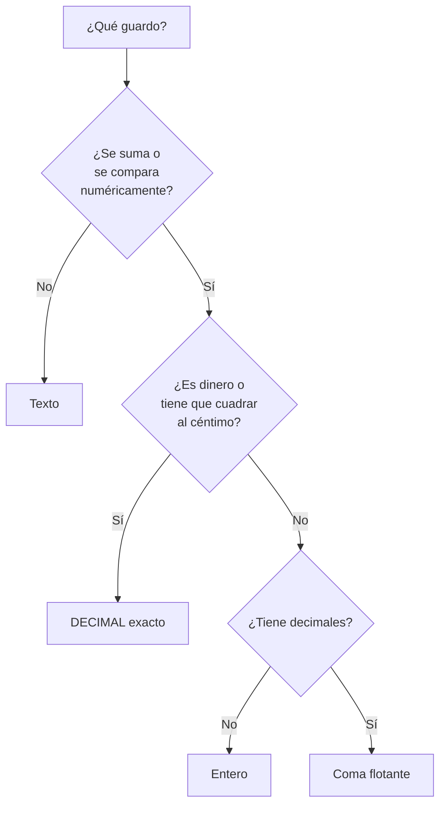

## Propósito

Entender por qué el tipo de un campo no es una formalidad. Elegirlo mal no
provoca un error inmediato: provoca ordenaciones absurdas, sumas equivocadas y
comparaciones que fallan justo cuando importan.

## Resultados de aprendizaje

Al terminar podrás:

1. Elegir el tipo adecuado para un dato y justificarlo.
2. Explicar qué pasa al ordenar números guardados como texto.
3. Distinguir cuándo usar decimal exacto y cuándo coma flotante.
4. Guardar fechas y horas de forma que se puedan comparar y ordenar.
5. Nombrar la fuente de cada afirmación anterior.

## Fundamentos

### Para qué sirve un tipo

Un tipo hace tres cosas a la vez:

- **Restringe** los valores posibles: en una columna entera no cabe `hola`.
- **Define las operaciones**: se pueden restar dos fechas, no dos correos.
- **Decide el orden**: los números se ordenan por valor y el texto, carácter a
  carácter.

Esa tercera es la que más sorprende, y la que produce el fallo más visible.

### El número guardado como texto

Si `nota` es texto, este es el orden que devuelve el motor:

| Como texto | Como número |
|---|---|
| `100` | `58` |
| `58` | `72` |
| `72` | `90` |
| `90` | `100` |

`100` va primero porque el texto se compara carácter a carácter y `'1'` es menor
que `'5'`. Nadie escribe un informe pensando en eso; simplemente el informe sale
mal ordenado y alguien decide que «la base de datos está rara».

Lo mismo ocurre al comparar: `'9' > '100'` es cierto en texto y falso en números.

### Los tipos que hacen falta al principio

| Familia | Para qué | Nombres habituales |
|---|---|---|
| Entero | Cantidades sin decimales, identificadores | `INTEGER`, `INT`, `BIGINT` |
| Decimal exacto | Dinero, notas, cualquier cosa que se sume | `DECIMAL(p,s)`, `NUMERIC(p,s)` |
| Coma flotante | Medidas físicas, promedios aproximados | `REAL`, `DOUBLE PRECISION` |
| Texto | Nombres, correos, descripciones | `TEXT`, `VARCHAR(n)` |
| Fecha y hora | Cuándo ocurrió algo | `DATE`, `TIMESTAMP`, `TIMESTAMPTZ` |
| Booleano | Sí o no | `BOOLEAN` |

### Dinero nunca en coma flotante

`0.1 + 0.2` no da `0.3` en coma flotante: da `0.30000000000000004`. No es un
fallo del motor, es cómo funciona el formato binario de la norma IEEE 754, y
ocurre en todos los lenguajes y todos los motores.

Para dinero —y para cualquier cifra que se sume y después se compare con otra
suma— hay que usar decimal exacto: `DECIMAL(12,2)` guarda doce dígitos con dos
decimales y suma sin error. La coma flotante está bien para una temperatura o un
promedio; está mal para una factura.

### Fechas: texto ISO o tipo de fecha, nunca otra cosa

Guardar `19/08/2026` como texto significa que ordenar por fecha ordena por día,
y que `31/12/2025` va después de `01/01/2026`. Hay dos opciones aceptables:

- Un **tipo de fecha** de verdad (`DATE`, `TIMESTAMP`), que es lo correcto cuando
  el motor lo tiene.
- Texto en formato **ISO-8601** (`2026-08-19`, `2026-08-19T10:15:00Z`), que se
  ordena bien alfabéticamente por diseño del propio formato. Es lo que hace
  SQLite, que no tiene tipo de fecha.

Y con la hora, una regla más: **guardar en UTC y convertir al mostrar**. Guardar
la hora local hace imposible saber, seis meses después, si aquellas dos de la
madrugada eran antes o después del cambio de horario.

### Un aviso sobre SQLite

SQLite tiene **tipado por afinidad**: acepta un texto en una columna declarada
`INTEGER` si no puede convertirlo. Desde la versión 3.37 existen las tablas
`STRICT`, que sí comprueban el tipo, pero no son las de por omisión. Conviene
saberlo, porque significa que en SQLite el tipo protege menos de lo que parece.



## Ejemplo trabajado

Una tienda guarda sus importes como texto, «porque así se ve el símbolo».

| producto | precio |
|---|---|
| teclado | `$120,00` |
| ratón | `$80,00` |
| cable | `$100,00` |

**Tres cosas dejan de funcionar a la vez.**

Ordenar por precio da: `$100,00`, `$120,00`, `$80,00`. El ratón, que es el más
barato, sale último.

Sumar es imposible sin limpiar el texto en cada consulta: quitar el símbolo,
cambiar la coma por punto, convertir. Y cada consulta tiene que acordarse.

Filtrar «los que cuestan más de 90» exige la misma limpieza, y si un solo
registro trae `$1.200,00` con separador de miles, la conversión falla o —peor—
devuelve `1.200` y el producto más caro aparece como el más barato.

**La versión correcta.**

```sql
CREATE TABLE productos (
    producto TEXT NOT NULL,
    precio   DECIMAL(10,2) NOT NULL CHECK (precio >= 0)
);
INSERT INTO productos VALUES ('teclado', 120.00), ('raton', 80.00), ('cable', 100.00);

SELECT producto, precio FROM productos ORDER BY precio;
```

El símbolo de moneda no se guarda: **se aplica al mostrar**. Es una decisión de
presentación, y en el dato solo estorba. Si hacen falta varias monedas, la
moneda es otro campo, no parte del número.

## Errores frecuentes

1. **Números como texto.** Ordena mal, compara mal y no suma.
2. **Dinero en coma flotante.** Cuadra durante meses y un día falta un céntimo.
3. **Fechas como texto en formato local.** `19/08/2026` no se puede ordenar.
4. **Guardar el formato junto al dato.** `$1.234,50`, `45 %`, `1,5 kg`: el número
   y su unidad son dos cosas.
5. **`VARCHAR(255)` por costumbre.** Ese número viene de una limitación antigua
   de MySQL; el límite debería salir del dominio, no de la tradición.
6. **Guardar la hora local sin zona.** Irrecuperable cuando cambia el horario.
7. **Confiar en el tipo declarado en SQLite sin `STRICT`.**

## Ejemplo de transferencia

La misma decisión aparece fuera del modelo relacional: en MongoDB hay que
elegir entre `NumberInt`, `NumberLong`, `NumberDecimal` y el doble por omisión —y
el por omisión es coma flotante, con el problema del céntimo—. En Redis todo es
texto y la conversión la hace el cliente. El tipo nunca desaparece: cambia de
sitio.

## Reto de transferencia

1. Revisa una tabla real y anota el tipo de cada campo y el tipo que debería
   tener.
2. Encuentra al menos un campo numérico guardado como texto, o uno con formato
   incrustado.
3. Ejecuta `SELECT ... ORDER BY` sobre ese campo y guarda el resultado: es la
   prueba.
4. Escribe la sentencia que lo corregiría y el riesgo que tendría ejecutarla en
   producción.

## Preguntas de evaluación

1. ¿Por qué `100` va antes que `58` al ordenar texto?
2. ¿Cuándo usarías `DECIMAL` y cuándo coma flotante? Da un ejemplo de cada uno.
3. ¿Qué dos formas aceptables hay de guardar una fecha, y por qué el formato
   `19/08/2026` no es una de ellas?
4. ¿Qué significa que SQLite tenga tipado por afinidad y qué consecuencia
   práctica tiene?
