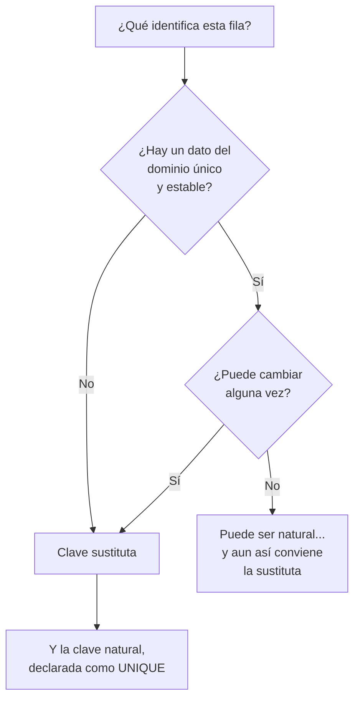

# 007 — La clave primaria: cómo se distingue una fila de otra

> [Programa](../../../README.md) · [Parte 00](../README.md) · [← Anterior](../../part-00-primeros-pasos-del-archivo-a-la-base-de-datos/006-tipos-de-datos-un-numero-no-es-un-texto/README.md) · [Siguiente →](../../part-00-primeros-pasos-del-archivo-a-la-base-de-datos/008-dos-tablas-y-una-relacion/README.md)

Parte 00 — Primeros pasos: del archivo a la base de datos · Fundamentos ·
2 horas estimadas · motores `sqlite`, `duckdb`, `postgresql`, `mysql`, `mongodb` · laboratorio
[`labs/01-sql-foundations`](../../../labs/01-sql-foundations/README.md) · 3 fuentes.

**Conceptos centrales:** `clave primaria` · `clave natural` · `clave sustituta` · `clave compuesta` · `UNIQUE`

**En este caso se comparan 6 motores**: 5 lo resuelven (5 con el resultado comprobado por máquina) y 1 no, con el motivo escrito.

---

## Propósito

Contestar una pregunta que parece trivial y no lo es: **¿cómo distingue el
sistema una fila de otra?** De esa respuesta dependen las actualizaciones, los
borrados, las relaciones entre tablas y la posibilidad misma de corregir un dato.

## Resultados de aprendizaje

Al terminar podrás:

1. Declarar una clave primaria y explicar qué garantiza.
2. Distinguir clave natural de clave sustituta y elegir con criterio.
3. Reconocer una clave compuesta y cuándo hace falta.
4. Explicar por qué una clave primaria no puede ser nula ni cambiar a la ligera.
5. Nombrar la fuente de cada afirmación anterior.

## Fundamentos

### Qué garantiza una clave primaria

Declarar `PRIMARY KEY` sobre un campo obliga a tres cosas:

1. **No se repite.** Dos filas no pueden tener el mismo valor.
2. **No es nulo.** Toda fila tiene que tenerlo.
3. **Identifica.** Ese valor, y solo ese, señala a una fila concreta.

Sin ella, «actualiza la fila de Ada» es una orden ambigua en cuanto haya dos
Adas. Y las habrá.

### Natural o sustituta

Una **clave natural** es un dato del propio dominio que ya identifica: el correo,
el RUT, el ISBN de un libro. Una **clave sustituta** es un número inventado, sin
significado, que solo existe para identificar: el típico `id`.

| | Natural | Sustituta |
|---|---|---|
| Significado | Tiene | Ninguno |
| ¿Puede cambiar? | Sí, y pasa | No, nunca |
| Legible | Sí | No |
| Espacio | Variable | Pequeño y fijo |
| ¿Sirve como referencia? | Solo si no cambia | Siempre |

El argumento decisivo es el cambio. Un correo se cambia; un RUT se corrige
porque estaba mal escrito; un código de producto se reorganiza. Cada vez que eso
ocurre, **toda tabla que lo hubiera copiado como referencia hay que
actualizarla**, y basta olvidar una para dejar datos huérfanos.

Con clave sustituta, cambiar el correo es un `UPDATE` de una fila y ninguna
referencia se entera.

La recomendación práctica, y la que sigue este programa: **clave sustituta para
identificar y referenciar; clave natural declarada además como `UNIQUE`**. Las
dos, no una.

```sql
CREATE TABLE estudiantes (
    id     INTEGER PRIMARY KEY,       -- identidad estable
    correo TEXT NOT NULL UNIQUE,      -- identidad de negocio
    nombre TEXT NOT NULL
);
```

Sin ese `UNIQUE`, el sistema aceptaría dos personas con el mismo correo y nadie
lo notaría hasta que una intentara recuperar su contraseña.

### Claves compuestas

A veces lo que identifica es una pareja. En una tabla de inscripciones, la fila
queda identificada por **quién** y **en qué curso**:

```sql
CREATE TABLE inscripciones (
    estudiante_id INTEGER NOT NULL,
    curso_id      INTEGER NOT NULL,
    PRIMARY KEY (estudiante_id, curso_id)
);
```

Esa clave compuesta hace algo más que identificar: **impide** que el mismo
estudiante se inscriba dos veces en el mismo curso. La regla de negocio queda
dentro del esquema, sin código.

### Lo que una clave primaria no debe ser

- **No debe cambiar.** Si cambia, deja de identificar.
- **No debe tener significado que pueda revisarse.** «El código de producto lleva
  el año» funciona hasta que se reorganizan los códigos.
- **No debe reutilizarse.** Un identificador liberado y vuelto a asignar hace que
  los datos históricos apunten a otra cosa, y ese error es indetectable.



## Ejemplo trabajado

Una academia usa el correo como clave primaria:

```sql
CREATE TABLE estudiantes (
    correo TEXT PRIMARY KEY,
    nombre TEXT NOT NULL
);
CREATE TABLE inscripciones (
    correo TEXT NOT NULL,
    curso  TEXT NOT NULL,
    PRIMARY KEY (correo, curso)
);
```

Funciona bien durante un año. Entonces Ada cambia de correo.

**Lo que hay que hacer ahora.** Actualizar `estudiantes`, actualizar
`inscripciones`, y actualizar cualquier otra tabla que hubiera copiado el correo
—pagos, certificados, registro de asistencia—. Si el motor tiene claves foráneas
con `ON UPDATE CASCADE`, lo hace solo; si no, hay que acordarse de todas. Y si se
olvida una, esas filas quedan apuntando a un correo que ya no existe.

Hay un problema peor: mientras dura la actualización, el sistema tiene el dato a
medias. Con una sola tabla no importa; con cinco y sin transacción, sí.

**Con clave sustituta.**

```sql
CREATE TABLE estudiantes (
    id     INTEGER PRIMARY KEY,
    correo TEXT NOT NULL UNIQUE,
    nombre TEXT NOT NULL
);
CREATE TABLE inscripciones (
    estudiante_id INTEGER NOT NULL,
    curso         TEXT NOT NULL,
    PRIMARY KEY (estudiante_id, curso)
);

UPDATE estudiantes SET correo = 'ada@nuevo.org' WHERE id = 1;
```

Una fila. Ninguna referencia tocada. Y el `UNIQUE` sigue impidiendo dos
estudiantes con el mismo correo, que era la parte útil de la clave natural.

## Errores frecuentes

1. **Tabla sin clave primaria.** Parece funcionar hasta el primer duplicado, y
   entonces no hay forma de borrar solo uno de los dos.
2. **Usar como clave un dato que cambia.** Correo, teléfono, nombre, cualquier
   código de negocio «que nunca cambia».
3. **Poner clave sustituta y olvidar el `UNIQUE` de la natural.** Se admite el
   duplicado que se quería evitar.
4. **Clave compuesta de cinco campos porque «así es único».** Cada tabla que la
   referencie tendrá que copiar los cinco.
5. **Reutilizar identificadores de filas borradas.** Los datos históricos pasan a
   señalar a otra cosa.
6. **Creer que un identificador aleatorio es siempre mejor.** Un UUID en texto
   engorda todos los índices de la tabla; conviene saber lo que cuesta.

## Ejemplo de transferencia

Todos los almacenes tienen este problema y lo resuelven parecido: en MongoDB el
`_id` es obligatorio y **inmutable** —si se usara el correo, cambiarlo obligaría
a borrar y reinsertar el documento—; en Redis la clave es literalmente la ruta de
acceso, así que nombrar por identificador y mantener un índice aparte es la única
opción sensata; en Cassandra la clave primaria decide en qué nodo vive la fila y
**no se puede actualizar** en absoluto.

## Reto de transferencia

1. Elige dos tablas reales y escribe cuál es su clave primaria.
2. Para cada una, responde: ¿ese valor puede cambiar alguna vez? Si la respuesta
   es sí, cuenta cuántas tablas tendrían que actualizarse.
3. Encuentra una tabla sin clave primaria y describe qué operación se vuelve
   imposible.
4. Añade a una de tus tablas la pareja completa: sustituta como primaria y
   natural como `UNIQUE`. Intenta insertar un duplicado y guarda el error.

## Preguntas de evaluación

1. ¿Qué tres cosas garantiza una clave primaria?
2. ¿Por qué el correo es mala clave primaria aunque sea único?
3. ¿Qué regla de negocio impone una clave primaria compuesta en una tabla de
   inscripciones?
4. Si eliges clave sustituta, ¿qué hay que declarar además y por qué?

---

## 🌐 El mismo problema en cada motor

**Caso:** Corregir el correo de una de las dos Ada

Dos estudiantes se llaman Ada. No es un caso rebuscado: es lo normal en
cuanto hay más de cien personas. Hay que corregir el correo de **una** de
las dos.

Con una clave primaria, la orden es exacta: `WHERE id = 2`. Sin ella, la
única forma de señalar la fila sería por nombre, y `WHERE nombre = 'Ada'`
cambiaría las dos —y además fallaría, porque dejaría dos correos iguales en
una columna `UNIQUE`.

Eso es lo que garantiza una clave primaria: que **existe una forma de
referirse a una fila y solo a una**. Sin ella, actualizar y borrar dejan de
ser operaciones precisas.

Salida esperada, idéntica en todos los motores que lo resuelven:

| id | nombre | correo |
|---|---|---|
| `1` | `Ada` | `ada@example.org` |
| `2` | `Ada` | `nuevo@example.org` |
| `3` | `Linus` | `linus@example.org` |

El contrato vive en [`motores.yaml`](motores.yaml) y lo comprueba
`python scripts/verificar_equivalencia.py --clase 007`: 5 de
las 5 implementaciones se ejecutan de verdad y su
resultado se compara con esa tabla; el resto se declara como material revisado,
no ejecutado.

| Motor | ¿Resuelve el caso? | Nivel de prueba | Código | Fuente |
|---|---|---|---|---|
| SQLite | sí | núcleo | [código](implementaciones/sqlite/consulta.sql) | [doc oficial](https://sqlite.org/lang_createtable.html) |
| DuckDB | sí | núcleo | [código](implementaciones/duckdb/consulta.sql) | [doc oficial](https://duckdb.org/docs/stable/sql/constraints) |
| PostgreSQL | sí | servicio | [código](implementaciones/postgresql/consulta.sql) | [doc oficial](https://www.postgresql.org/docs/current/ddl-identity-columns.html) |
| MySQL | sí | servicio | [código](implementaciones/mysql/consulta.sql) | [doc oficial](https://dev.mysql.com/doc/refman/8.4/en/example-auto-increment.html) |
| MongoDB | sí | servicio | [código](implementaciones/mongodb/consulta.js) | [doc oficial](https://www.mongodb.com/docs/manual/core/document/) |
| Apache Cassandra | **no** | — | — | [doc oficial](https://cassandra.apache.org/doc/latest/cassandra/developing/cql/ddl.html) |

### Los que resuelven el caso

#### SQLite · [`implementaciones/sqlite/consulta.sql`](implementaciones/sqlite/consulta.sql)

✅ **verificado** — se ejecuta en CI sin servicios

```sql
-- motor: sqlite
-- doc: https://sqlite.org/lang_createtable.html
-- nota: INTEGER PRIMARY KEY es un alias del identificador interno de fila, asi
--       que la identidad estable no cuesta ni una columna adicional.

-- === preparacion ===
-- Dos estudiantes se llaman igual. No es un caso raro: es lo normal en
-- cuanto hay mas de cien personas.
CREATE TABLE estudiantes (
    id     INTEGER PRIMARY KEY,
    nombre TEXT NOT NULL,
    correo TEXT NOT NULL UNIQUE
);
INSERT INTO estudiantes (id, nombre, correo) VALUES
    (1, 'Ada',   'ada@example.org'),
    (2, 'Ada',   'ada2@example.org'),
    (3, 'Linus', 'linus@example.org');

-- Corregir el correo de la SEGUNDA Ada. Con el id se puede senalar a una fila
-- concreta; con el nombre no:
--   UPDATE estudiantes SET correo = ... WHERE nombre = 'Ada';
-- habria cambiado las dos, y ademas habria fallado por violar el UNIQUE.
UPDATE estudiantes SET correo = 'nuevo@example.org' WHERE id = 2;

-- === consulta ===
SELECT id, nombre, correo FROM estudiantes ORDER BY id;
```

- **Por qué sí:** `INTEGER PRIMARY KEY` es un alias de su identificador interno de fila, así que la clave sustituta no ocupa ni una columna extra: la identidad estable sale gratis.
- **Por qué no:** SQLite **permite** tablas sin clave primaria y, salvo en tablas `STRICT`, incluso admite nulos en una columna declarada `PRIMARY KEY`, que es una desviación del estándar y una fuente de sorpresas.
- 📄 Documentación oficial: <https://sqlite.org/lang_createtable.html>

#### DuckDB · [`implementaciones/duckdb/consulta.sql`](implementaciones/duckdb/consulta.sql)

✅ **verificado** — se ejecuta en CI sin servicios

```sql
-- motor: duckdb
-- doc: https://duckdb.org/docs/stable/sql/constraints
-- nota: la comprobacion que hay que hacer ANTES de declarar una clave sobre
--       datos que ya existen:
--         SELECT correo, COUNT(*) FROM estudiantes
--         GROUP BY correo HAVING COUNT(*) > 1;
--       Si devuelve filas, la clave no se puede crear todavia.

-- === preparacion ===
-- Dos estudiantes se llaman igual. No es un caso raro: es lo normal en
-- cuanto hay mas de cien personas.
CREATE TABLE estudiantes (
    id     INTEGER PRIMARY KEY,
    nombre VARCHAR NOT NULL,
    correo VARCHAR NOT NULL UNIQUE
);
INSERT INTO estudiantes (id, nombre, correo) VALUES
    (1, 'Ada',   'ada@example.org'),
    (2, 'Ada',   'ada2@example.org'),
    (3, 'Linus', 'linus@example.org');

-- Corregir el correo de la SEGUNDA Ada. Con el id se puede senalar a una fila
-- concreta; con el nombre no:
--   UPDATE estudiantes SET correo = ... WHERE nombre = 'Ada';
-- habria cambiado las dos, y ademas habria fallado por violar el UNIQUE.
UPDATE estudiantes SET correo = 'nuevo@example.org' WHERE id = 2;

-- === consulta ===
SELECT id, nombre, correo FROM estudiantes ORDER BY id;
```

- **Por qué sí:** Impone la clave primaria y el `UNIQUE`, y sirve para la comprobación que hay que hacer antes de declarar una clave sobre datos existentes: contar cuántos valores repetidos hay.
- **Por qué no:** No genera identificadores con la comodidad de una secuencia de un motor transaccional: la identidad hay que traerla ya asignada.
- 📄 Documentación oficial: <https://duckdb.org/docs/stable/sql/constraints>

#### PostgreSQL · [`implementaciones/postgresql/consulta.sql`](implementaciones/postgresql/consulta.sql)

✅ **verificado** — se ejecuta contra el motor real levantado con `docker compose`

```sql
-- motor: postgresql
-- doc: https://www.postgresql.org/docs/current/ddl-identity-columns.html
-- nota: las dos identidades conviven y las dos hacen falta:
--         id     integer GENERATED ALWAYS AS IDENTITY PRIMARY KEY  -- referencias
--         correo text NOT NULL UNIQUE                              -- negocio
--       Aqui el id se escribe a mano para que las filas sean comparables con
--       las de los demas motores.

-- === preparacion ===
DROP TABLE IF EXISTS estudiantes;

-- Dos estudiantes se llaman igual. No es un caso raro: es lo normal en
-- cuanto hay mas de cien personas.
CREATE TABLE estudiantes (
    id     integer PRIMARY KEY,
    nombre text NOT NULL,
    correo text NOT NULL UNIQUE
);
INSERT INTO estudiantes (id, nombre, correo) VALUES
    (1, 'Ada',   'ada@example.org'),
    (2, 'Ada',   'ada2@example.org'),
    (3, 'Linus', 'linus@example.org');

-- Corregir el correo de la SEGUNDA Ada. Con el id se puede senalar a una fila
-- concreta; con el nombre no:
--   UPDATE estudiantes SET correo = ... WHERE nombre = 'Ada';
-- habria cambiado las dos, y ademas habria fallado por violar el UNIQUE.
UPDATE estudiantes SET correo = 'nuevo@example.org' WHERE id = 2;

-- === consulta ===
SELECT id, nombre, correo FROM estudiantes ORDER BY id;
```

- **Por qué sí:** `GENERATED ALWAYS AS IDENTITY` es la forma normalizada de la clave sustituta, y permite tener las dos identidades a la vez: la estable para las referencias y la de negocio —el correo— declarada `UNIQUE`.
- **Por qué no:** La clave sustituta no exime de declarar la natural: sin el `UNIQUE` sobre el correo, el sistema acepta dos personas con el mismo y nadie lo nota hasta que una intenta recuperar su contraseña.
- 📄 Documentación oficial: <https://www.postgresql.org/docs/current/ddl-identity-columns.html>

#### MySQL · [`implementaciones/mysql/consulta.sql`](implementaciones/mysql/consulta.sql)

✅ **verificado** — se ejecuta contra el motor real levantado con `docker compose`

```sql
-- motor: mysql
-- doc: https://dev.mysql.com/doc/refman/8.4/en/example-auto-increment.html
-- nota: InnoDB organiza FISICAMENTE la tabla por la clave primaria, asi que una
--       clave ancha —un UUID en texto— engorda todos los indices secundarios a
--       la vez. Aqui la eleccion de clave tiene un costo de almacenamiento que
--       en otros motores no tiene.

-- === preparacion ===
DROP TABLE IF EXISTS estudiantes;

-- Dos estudiantes se llaman igual. No es un caso raro: es lo normal en
-- cuanto hay mas de cien personas.
CREATE TABLE estudiantes (
    id     INT PRIMARY KEY,
    nombre VARCHAR(50) NOT NULL,
    correo VARCHAR(50) NOT NULL UNIQUE
);
INSERT INTO estudiantes (id, nombre, correo) VALUES
    (1, 'Ada',   'ada@example.org'),
    (2, 'Ada',   'ada2@example.org'),
    (3, 'Linus', 'linus@example.org');

-- Corregir el correo de la SEGUNDA Ada. Con el id se puede senalar a una fila
-- concreta; con el nombre no:
--   UPDATE estudiantes SET correo = ... WHERE nombre = 'Ada';
-- habria cambiado las dos, y ademas habria fallado por violar el UNIQUE.
UPDATE estudiantes SET correo = 'nuevo@example.org' WHERE id = 2;

-- === consulta ===
SELECT id, nombre, correo FROM estudiantes ORDER BY id;
```

- **Por qué sí:** `AUTO_INCREMENT` cumple el mismo papel y es la forma más extendida de clave sustituta que se encuentra en código ajeno.
- **Por qué no:** InnoDB organiza físicamente la tabla por la clave primaria, así que una clave ancha —un UUID en texto— engorda **todos** los índices secundarios a la vez. La elección de clave tiene aquí un costo de almacenamiento que en otros motores no tiene.
- 📄 Documentación oficial: <https://dev.mysql.com/doc/refman/8.4/en/example-auto-increment.html>

#### MongoDB · [`implementaciones/mongodb/consulta.js`](implementaciones/mongodb/consulta.js)

✅ **verificado** — se ejecuta contra el motor real levantado con `docker compose`

```javascript
// motor: mongodb
// doc: https://www.mongodb.com/docs/manual/core/document/
// nota: el _id es obligatorio e INMUTABLE. Si se hubiera usado el correo como
//       _id, esta correccion no seria una actualizacion: habria que borrar el
//       documento y crear otro, con todo lo que apuntara a el.

// === preparacion ===
db.estudiantes.drop();
db.estudiantes.insertMany([
  { _id: 1, nombre: "Ada", correo: "ada@example.org" },
  { _id: 2, nombre: "Ada", correo: "ada2@example.org" },
  { _id: 3, nombre: "Linus", correo: "linus@example.org" },
]);
db.estudiantes.createIndex({ correo: 1 }, { unique: true });

db.estudiantes.updateOne({ _id: 2 }, { $set: { correo: "nuevo@example.org" } });

// === consulta ===
db.estudiantes
  .find()
  .sort({ _id: 1 })
  .forEach((d) => print(d._id + "|" + d.nombre + "|" + d.correo));
```

- **Por qué sí:** El `_id` es obligatorio: la identidad existe siempre, aunque nadie la haya diseñado, y por omisión es un `ObjectId` que el cliente puede generar sin ir al servidor.
- **Por qué no:** Es **inmutable**. Si alguien cede a la tentación de usar el correo como `_id`, cambiarlo deja de ser una actualización: hay que borrar el documento y crear otro, con todo lo que apunte a él.
- 📄 Documentación oficial: <https://www.mongodb.com/docs/manual/core/document/>

### Los que no resuelven este caso — y qué se hace en su lugar

Descartar un motor con un argumento es tan formativo como usarlo. Ninguna de estas filas dice que el motor sea peor: dice que este problema no es el suyo.

| Motor | Por qué no | Qué se hace en su lugar | Fuente |
|---|---|---|---|
| Apache Cassandra | Aquí la clave primaria decide en qué nodo vive la fila, así que **no se puede actualizar**; y la comprobación de unicidad sobre otra columna no existe: un `INSERT` con una clave que ya está sobrescribe en silencio. | Un identificador estable (UUID) como clave de partición y una tabla aparte `estudiante_por_correo` que haga de índice, mantenida por la aplicación. | [doc](https://cassandra.apache.org/doc/latest/cassandra/developing/cql/ddl.html) |

---

## Laboratorio

```bash
python scripts/validate_repository.py
python labs/01-sql-foundations/run_lab.py
```

Guarda como evidencia la salida completa, la versión del motor y la semilla o
los parámetros usados. Una captura sin comando no es evidencia: no se puede
repetir.

## Evaluación

| Criterio | Peso | Qué se comprueba |
|---|---:|---|
| Comprensión conceptual | 25 % | Explica el mecanismo, no solo el resultado |
| Ejecución reproducible | 25 % | Otra persona obtiene lo mismo con las instrucciones dadas |
| Interpretación basada en evidencia | 25 % | Cada conclusión se apoya en una salida o una medición |
| Límites y riesgos declarados | 25 % | Dice qué no demuestra el ejercicio y qué faltaría en producción |

La clase se da por superada cuando la respuesta explica el mecanismo, muestra
la salida que la respalda y declara al menos un límite del ejercicio.

## Fuentes de esta clase

Todo lo afirmado arriba procede de estas obras. Los identificadores viven en
[`catalog/sources.json`](../../../catalog/sources.json) y el estado de los
enlaces se comprueba con `python scripts/check_external_links.py`.

- **Michael J. Hernandez** (2020). [Database Design for Mere Mortals](https://www.informit.com/store/database-design-for-mere-mortals-a-hands-on-guide-to-9780136788041). 4.a ed. Addison-Wesley. ISBN 978-0-13-678804-1.  
  Método de diseño paso a paso, independiente de producto.
- **C. J. Date** (2015). [SQL and Relational Theory: How to Write Accurate SQL Code](https://www.oreilly.com/library/view/sql-and-relational/9781491941164/). 3.a ed. O'Reilly. ISBN 978-1-4919-4117-1.  
  Separa el modelo relacional de lo que SQL realmente implementa, incluidos los nulos.
- **Bill Karwin** (2010). [SQL Antipatterns: Avoiding the Pitfalls of Database Programming](https://pragprog.com/titles/bksqla/sql-antipatterns/). Pragmatic Bookshelf. ISBN 978-1-934356-55-5.  
  Catálogo de errores de modelado con su corrección y cuando el antipatron es aceptable.

---

> [Programa](../../../README.md) · [Parte 00](../README.md) · [← Anterior](../../part-00-primeros-pasos-del-archivo-a-la-base-de-datos/006-tipos-de-datos-un-numero-no-es-un-texto/README.md) · [Siguiente →](../../part-00-primeros-pasos-del-archivo-a-la-base-de-datos/008-dos-tablas-y-una-relacion/README.md)
