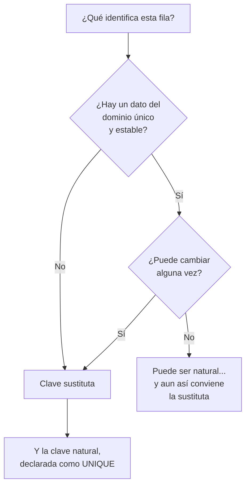

## Propósito

Contestar una pregunta que parece trivial y no lo es: **¿cómo distingue el
sistema una fila de otra?** De esa respuesta dependen las actualizaciones, los
borrados, las relaciones entre tablas y la posibilidad misma de corregir un dato.

## Resultados de aprendizaje

Al terminar podrás:

1. Declarar una clave primaria y explicar qué garantiza.
2. Distinguir clave natural de clave sustituta y elegir con criterio.
3. Reconocer una clave compuesta y cuándo hace falta.
4. Explicar por qué una clave primaria no puede ser nula ni cambiar a la ligera.
5. Nombrar la fuente de cada afirmación anterior.

## Fundamentos

### Qué garantiza una clave primaria

Declarar `PRIMARY KEY` sobre un campo obliga a tres cosas:

1. **No se repite.** Dos filas no pueden tener el mismo valor.
2. **No es nulo.** Toda fila tiene que tenerlo.
3. **Identifica.** Ese valor, y solo ese, señala a una fila concreta.

Sin ella, «actualiza la fila de Ada» es una orden ambigua en cuanto haya dos
Adas. Y las habrá.

### Natural o sustituta

Una **clave natural** es un dato del propio dominio que ya identifica: el correo,
el RUT, el ISBN de un libro. Una **clave sustituta** es un número inventado, sin
significado, que solo existe para identificar: el típico `id`.

| | Natural | Sustituta |
|---|---|---|
| Significado | Tiene | Ninguno |
| ¿Puede cambiar? | Sí, y pasa | No, nunca |
| Legible | Sí | No |
| Espacio | Variable | Pequeño y fijo |
| ¿Sirve como referencia? | Solo si no cambia | Siempre |

El argumento decisivo es el cambio. Un correo se cambia; un RUT se corrige
porque estaba mal escrito; un código de producto se reorganiza. Cada vez que eso
ocurre, **toda tabla que lo hubiera copiado como referencia hay que
actualizarla**, y basta olvidar una para dejar datos huérfanos.

Con clave sustituta, cambiar el correo es un `UPDATE` de una fila y ninguna
referencia se entera.

La recomendación práctica, y la que sigue este programa: **clave sustituta para
identificar y referenciar; clave natural declarada además como `UNIQUE`**. Las
dos, no una.

```sql
CREATE TABLE estudiantes (
    id     INTEGER PRIMARY KEY,       -- identidad estable
    correo TEXT NOT NULL UNIQUE,      -- identidad de negocio
    nombre TEXT NOT NULL
);
```

Sin ese `UNIQUE`, el sistema aceptaría dos personas con el mismo correo y nadie
lo notaría hasta que una intentara recuperar su contraseña.

### Claves compuestas

A veces lo que identifica es una pareja. En una tabla de inscripciones, la fila
queda identificada por **quién** y **en qué curso**:

```sql
CREATE TABLE inscripciones (
    estudiante_id INTEGER NOT NULL,
    curso_id      INTEGER NOT NULL,
    PRIMARY KEY (estudiante_id, curso_id)
);
```

Esa clave compuesta hace algo más que identificar: **impide** que el mismo
estudiante se inscriba dos veces en el mismo curso. La regla de negocio queda
dentro del esquema, sin código.

### Lo que una clave primaria no debe ser

- **No debe cambiar.** Si cambia, deja de identificar.
- **No debe tener significado que pueda revisarse.** «El código de producto lleva
  el año» funciona hasta que se reorganizan los códigos.
- **No debe reutilizarse.** Un identificador liberado y vuelto a asignar hace que
  los datos históricos apunten a otra cosa, y ese error es indetectable.



## Ejemplo trabajado

Una academia usa el correo como clave primaria:

```sql
CREATE TABLE estudiantes (
    correo TEXT PRIMARY KEY,
    nombre TEXT NOT NULL
);
CREATE TABLE inscripciones (
    correo TEXT NOT NULL,
    curso  TEXT NOT NULL,
    PRIMARY KEY (correo, curso)
);
```

Funciona bien durante un año. Entonces Ada cambia de correo.

**Lo que hay que hacer ahora.** Actualizar `estudiantes`, actualizar
`inscripciones`, y actualizar cualquier otra tabla que hubiera copiado el correo
—pagos, certificados, registro de asistencia—. Si el motor tiene claves foráneas
con `ON UPDATE CASCADE`, lo hace solo; si no, hay que acordarse de todas. Y si se
olvida una, esas filas quedan apuntando a un correo que ya no existe.

Hay un problema peor: mientras dura la actualización, el sistema tiene el dato a
medias. Con una sola tabla no importa; con cinco y sin transacción, sí.

**Con clave sustituta.**

```sql
CREATE TABLE estudiantes (
    id     INTEGER PRIMARY KEY,
    correo TEXT NOT NULL UNIQUE,
    nombre TEXT NOT NULL
);
CREATE TABLE inscripciones (
    estudiante_id INTEGER NOT NULL,
    curso         TEXT NOT NULL,
    PRIMARY KEY (estudiante_id, curso)
);

UPDATE estudiantes SET correo = 'ada@nuevo.org' WHERE id = 1;
```

Una fila. Ninguna referencia tocada. Y el `UNIQUE` sigue impidiendo dos
estudiantes con el mismo correo, que era la parte útil de la clave natural.

## Errores frecuentes

1. **Tabla sin clave primaria.** Parece funcionar hasta el primer duplicado, y
   entonces no hay forma de borrar solo uno de los dos.
2. **Usar como clave un dato que cambia.** Correo, teléfono, nombre, cualquier
   código de negocio «que nunca cambia».
3. **Poner clave sustituta y olvidar el `UNIQUE` de la natural.** Se admite el
   duplicado que se quería evitar.
4. **Clave compuesta de cinco campos porque «así es único».** Cada tabla que la
   referencie tendrá que copiar los cinco.
5. **Reutilizar identificadores de filas borradas.** Los datos históricos pasan a
   señalar a otra cosa.
6. **Creer que un identificador aleatorio es siempre mejor.** Un UUID en texto
   engorda todos los índices de la tabla; conviene saber lo que cuesta.

## Ejemplo de transferencia

Todos los almacenes tienen este problema y lo resuelven parecido: en MongoDB el
`_id` es obligatorio y **inmutable** —si se usara el correo, cambiarlo obligaría
a borrar y reinsertar el documento—; en Redis la clave es literalmente la ruta de
acceso, así que nombrar por identificador y mantener un índice aparte es la única
opción sensata; en Cassandra la clave primaria decide en qué nodo vive la fila y
**no se puede actualizar** en absoluto.

## Reto de transferencia

1. Elige dos tablas reales y escribe cuál es su clave primaria.
2. Para cada una, responde: ¿ese valor puede cambiar alguna vez? Si la respuesta
   es sí, cuenta cuántas tablas tendrían que actualizarse.
3. Encuentra una tabla sin clave primaria y describe qué operación se vuelve
   imposible.
4. Añade a una de tus tablas la pareja completa: sustituta como primaria y
   natural como `UNIQUE`. Intenta insertar un duplicado y guarda el error.

## Preguntas de evaluación

1. ¿Qué tres cosas garantiza una clave primaria?
2. ¿Por qué el correo es mala clave primaria aunque sea único?
3. ¿Qué regla de negocio impone una clave primaria compuesta en una tabla de
   inscripciones?
4. Si eliges clave sustituta, ¿qué hay que declarar además y por qué?
