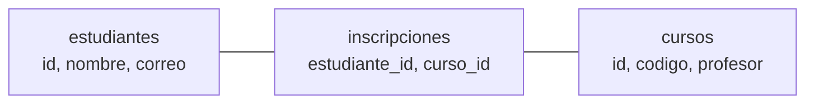

# 008 — Dos tablas y una relación: la clave foránea

> [Programa](../../../README.md) · [Parte 00](../README.md) · [← Anterior](../../part-00-primeros-pasos-del-archivo-a-la-base-de-datos/007-la-clave-primaria/README.md) · [Siguiente →](../../part-00-primeros-pasos-del-archivo-a-la-base-de-datos/009-cuando-no-necesitas-una-base-de-datos/README.md)

Parte 00 — Primeros pasos: del archivo a la base de datos · Fundamentos ·
2 horas estimadas · motores `sqlite`, `duckdb`, `postgresql`, `mysql`, `mongodb` · laboratorio
[`labs/01-sql-foundations`](../../../labs/01-sql-foundations/README.md) · 3 fuentes.

**Conceptos centrales:** `clave foránea` · `tabla de relación` · `reunión` · `anomalías de repetición`

**En este caso se comparan 6 motores**: 5 lo resuelven (5 con el resultado comprobado por máquina) y 1 no, con el motivo escrito.

---

## Propósito

Dar el paso que separa «guardar datos» de «modelar»: **partir una tabla en dos y
relacionarlas**. Es el momento en que aparecen las claves foráneas, y con ellas
la posibilidad de que el sistema impida por sí solo que un dato apunte a algo que
no existe.

## Resultados de aprendizaje

Al terminar podrás:

1. Reconocer cuándo una tabla está guardando dos cosas distintas.
2. Partirla en dos y relacionarlas con una clave foránea.
3. Consultar las dos tablas juntas con una reunión.
4. Explicar qué impide exactamente una clave foránea y qué no.
5. Nombrar la fuente de cada afirmación anterior.

## Fundamentos

### La señal: el dato que se repite

Cuando una tabla repite el mismo valor en muchas filas, casi siempre está
guardando dos cosas a la vez:

| estudiante | correo | curso | profesor |
|---|---|---|---|
| Ada | ada@example.org | DB-101 | A. Lovelace |
| Ada | ada@example.org | SE-201 | G. Hopper |
| Linus | linus@example.org | DB-101 | A. Lovelace |

El correo de Ada está dos veces. El profesor de DB-101, también. Eso produce tres
problemas con nombre propio, que se estudiarán en detalle en la parte de
normalización:

- **Anomalía de actualización.** Corregir el correo de Ada exige tocar dos filas,
  y basta olvidar una para que Ada tenga dos correos distintos.
- **Anomalía de inserción.** No se puede registrar un curso que todavía no tiene
  estudiantes: no habría fila donde ponerlo.
- **Anomalía de borrado.** Si Linus abandona y era el único de DB-101, al borrar
  su fila desaparece también el curso y su profesor.

### La solución: una tabla por cosa

```sql
CREATE TABLE estudiantes (
    id     INTEGER PRIMARY KEY,
    nombre TEXT NOT NULL,
    correo TEXT NOT NULL UNIQUE
);

CREATE TABLE cursos (
    id       INTEGER PRIMARY KEY,
    codigo   TEXT NOT NULL UNIQUE,
    profesor TEXT NOT NULL
);

CREATE TABLE inscripciones (
    estudiante_id INTEGER NOT NULL REFERENCES estudiantes(id),
    curso_id      INTEGER NOT NULL REFERENCES cursos(id),
    PRIMARY KEY (estudiante_id, curso_id)
);
```

Cada hecho vive **una sola vez**. El correo de Ada está en una fila; el profesor
de DB-101, en otra. Y la tercera tabla —la de inscripciones— guarda la relación:
una fila por pareja.

### Qué es una clave foránea

`REFERENCES estudiantes(id)` declara que ese campo **tiene que existir** en la
otra tabla. A partir de ahí, el motor impide dos cosas:

1. **Insertar una inscripción de un estudiante que no existe.**
2. **Borrar un estudiante que todavía tiene inscripciones** —salvo que se declare
   qué hacer en ese caso, que es una decisión de diseño con su propia clase.

Eso es todo lo que impide, y conviene saberlo: **no** obliga a que un estudiante
tenga al menos una inscripción, y **no** comprueba nada sobre el contenido de los
demás campos.

### Un aviso importante en SQLite

SQLite **solo comprueba las claves foráneas si se activan en la conexión**:

```sql
PRAGMA foreign_keys = ON;
```

Por compatibilidad con versiones antiguas viene desactivado. Hay muchísimas bases
SQLite en producción con claves foráneas declaradas que nunca se han comprobado.

### Volver a juntarlas: la reunión

Partir en tres tablas no significa perder la vista completa. `JOIN` las vuelve a
unir en el momento de consultar:

```sql
SELECT e.nombre, c.codigo, c.profesor
FROM inscripciones i
JOIN estudiantes e ON e.id = i.estudiante_id
JOIN cursos      c ON c.id = i.curso_id
ORDER BY e.nombre, c.codigo;
```

La condición `ON` dice **cómo se emparejan** las filas. Sin ella, el motor
combinaría cada fila con todas las de la otra tabla, que casi nunca es lo que se
quiere.



## Ejemplo trabajado

Partiendo de la tabla única del principio, con los mismos datos:

```sql
INSERT INTO estudiantes (id, nombre, correo) VALUES
    (1, 'Ada', 'ada@example.org'),
    (2, 'Linus', 'linus@example.org');

INSERT INTO cursos (id, codigo, profesor) VALUES
    (10, 'DB-101', 'A. Lovelace'),
    (20, 'SE-201', 'G. Hopper');

INSERT INTO inscripciones (estudiante_id, curso_id) VALUES (1, 10), (1, 20), (2, 10);
```

**Prueba 1: corregir el correo de Ada.**

```sql
UPDATE estudiantes SET correo = 'ada@nuevo.org' WHERE id = 1;
```

Una fila. En la tabla única habrían sido dos, y en un sistema real, cientos.

**Prueba 2: registrar un curso sin estudiantes.**

```sql
INSERT INTO cursos (id, codigo, profesor) VALUES (30, 'AR-301', 'M. Hamilton');
```

Se puede. En la tabla única, no había dónde ponerlo.

**Prueba 3: intentar inscribir a alguien que no existe.**

```sql
INSERT INTO inscripciones (estudiante_id, curso_id) VALUES (99, 10);
```

El motor lo rechaza: `FOREIGN KEY constraint failed`. Sin la clave foránea, esa
fila entraría y quedaría un huérfano que ninguna consulta encontraría.

**Prueba 4: la vista completa, cuando hace falta.**

```sql
SELECT e.nombre, c.codigo, c.profesor
FROM inscripciones i
JOIN estudiantes e ON e.id = i.estudiante_id
JOIN cursos      c ON c.id = i.curso_id
ORDER BY e.nombre, c.codigo;
```

| nombre | codigo | profesor |
|---|---|---|
| Ada | DB-101 | A. Lovelace |
| Ada | SE-201 | G. Hopper |
| Linus | DB-101 | A. Lovelace |

Los mismos datos del principio, sin ninguna repetición guardada.

## Errores frecuentes

1. **No activar `PRAGMA foreign_keys = ON` en SQLite.** Las restricciones están
   declaradas y no comprueban nada.
2. **Declarar la clave foránea y no indexarla.** El campo referenciado ya tiene
   índice por ser clave primaria; el que **referencia**, no, y las consultas y
   los borrados en cascada lo pagan.
3. **Reunir sin condición `ON`.** Devuelve el producto de las dos tablas: con
   1000 y 1000 filas, un millón.
4. **Copiar el nombre además del identificador «para no tener que reunir».** El
   día que el nombre cambie, la copia queda desactualizada; eso es
   desnormalización, y se hace a propósito o no se hace.
5. **Partir en tablas por costumbre.** Si un dato pertenece a una sola cosa y no
   se comparte, no hace falta otra tabla.

## Ejemplo de transferencia

La misma decisión existe fuera del modelo relacional, con otro nombre: en
MongoDB se llama «incrustar o referenciar», y la regla se parece —se incrusta lo
que solo tiene sentido dentro de su padre, se referencia lo que se comparte—. La
diferencia grande es que allí **no hay clave foránea**: si se borra el curso, las
inscripciones siguen apuntando al vacío y ninguna consulta avisa.

## Reto de transferencia

1. Busca una tabla real con un dato repetido en muchas filas.
2. Escribe las tablas en que la partirías y la clave foránea que las une.
3. Ejecuta el `UPDATE` que corrige ese dato repetido en la versión original y
   cuenta cuántas filas cambia; hazlo después en la versión partida.
4. Intenta insertar una referencia a algo que no existe y guarda el mensaje de
   error.

## Preguntas de evaluación

1. Nombra las tres anomalías que produce guardar dos cosas en una tabla.
2. ¿Qué impide exactamente una clave foránea, y qué **no** impide?
3. ¿Por qué en SQLite una clave foránea puede no estar comprobando nada?
4. ¿Qué devuelve una reunión escrita sin condición `ON`, y por qué casi nunca es
   lo que se quería?

---

## 🌐 El mismo problema en cada motor

**Caso:** Tres tablas que guardan cada hecho una vez y se juntan al consultar

La tabla única repetía el correo de Ada en cada una de sus inscripciones y el
profesor de DB-101 en cada estudiante de ese curso. Repartida en tres
—estudiantes, cursos e inscripciones— **cada hecho está escrito una sola
vez**, y la vista completa se reconstruye al consultar con una reunión.

El caso devuelve exactamente lo que devolvía la tabla única: quién está en
qué curso y con qué profesor. Lo que ha cambiado no es el resultado, es lo
que cuesta corregir un dato —una fila en vez de muchas— y lo que el sistema
puede impedir: una inscripción de un estudiante que no existe ya no entra.

Salida esperada, idéntica en todos los motores que lo resuelven:

| nombre | codigo | profesor |
|---|---|---|
| `Ada` | `DB-101` | `A. Lovelace` |
| `Ada` | `SE-201` | `G. Hopper` |
| `Linus` | `DB-101` | `A. Lovelace` |

El contrato vive en [`motores.yaml`](motores.yaml) y lo comprueba
`python scripts/verificar_equivalencia.py --clase 008`: 5 de
las 5 implementaciones se ejecutan de verdad y su
resultado se compara con esa tabla; el resto se declara como material revisado,
no ejecutado.

| Motor | ¿Resuelve el caso? | Nivel de prueba | Código | Fuente |
|---|---|---|---|---|
| SQLite | sí | núcleo | [código](implementaciones/sqlite/consulta.sql) | [doc oficial](https://sqlite.org/foreignkeys.html) |
| DuckDB | sí | núcleo | [código](implementaciones/duckdb/consulta.sql) | [doc oficial](https://duckdb.org/docs/stable/sql/statements/create_table) |
| PostgreSQL | sí | servicio | [código](implementaciones/postgresql/consulta.sql) | [doc oficial](https://www.postgresql.org/docs/current/tutorial-fk.html) |
| MySQL | sí | servicio | [código](implementaciones/mysql/consulta.sql) | [doc oficial](https://dev.mysql.com/doc/refman/8.4/en/create-table-foreign-keys.html) |
| MongoDB | sí | servicio | [código](implementaciones/mongodb/consulta.js) | [doc oficial](https://www.mongodb.com/docs/manual/data-modeling/concepts/embedding-vs-references/) |
| Redis | **no** | — | — | [doc oficial](https://redis.io/docs/latest/develop/data-types/hashes/) |

### Los que resuelven el caso

#### SQLite · [`implementaciones/sqlite/consulta.sql`](implementaciones/sqlite/consulta.sql)

✅ **verificado** — se ejecuta en CI sin servicios

```sql
-- motor: sqlite
-- doc: https://sqlite.org/foreignkeys.html
-- nota: sin PRAGMA foreign_keys = ON, las claves foraneas de abajo se declaran y
--       NO se comprueban. El verificador de este repositorio activa el pragma en
--       cada conexion; una aplicacion real tiene que hacer lo mismo.
--       Con el activo, esto se rechaza:
--         INSERT INTO inscripciones VALUES (99, 10);  -- FOREIGN KEY constraint failed

PRAGMA foreign_keys = ON;

-- === preparacion ===
CREATE TABLE estudiantes (
    id     INTEGER PRIMARY KEY,
    nombre TEXT NOT NULL
);
CREATE TABLE cursos (
    id       INTEGER PRIMARY KEY,
    codigo   TEXT NOT NULL UNIQUE,
    profesor TEXT NOT NULL
);
CREATE TABLE inscripciones (
    estudiante_id INTEGER NOT NULL REFERENCES estudiantes(id),
    curso_id      INTEGER NOT NULL REFERENCES cursos(id),
    PRIMARY KEY (estudiante_id, curso_id)
);

INSERT INTO estudiantes (id, nombre) VALUES (1, 'Ada'), (2, 'Linus');
INSERT INTO cursos (id, codigo, profesor) VALUES
    (10, 'DB-101', 'A. Lovelace'),
    (20, 'SE-201', 'G. Hopper');
INSERT INTO inscripciones (estudiante_id, curso_id) VALUES (1, 10), (1, 20), (2, 10);

-- === consulta ===
-- Las tres tablas vuelven a juntarse al consultar. Cada hecho sigue guardado UNA
-- sola vez: el profesor de DB-101 esta en una fila, no en dos.
SELECT e.nombre, c.codigo, c.profesor
FROM inscripciones i
JOIN estudiantes e ON e.id = i.estudiante_id
JOIN cursos      c ON c.id = i.curso_id
ORDER BY e.nombre, c.codigo;
```

- **Por qué sí:** Tiene claves foráneas y reuniones estándar: el modelo completo cabe en un archivo y se puede probar sin instalar nada.
- **Por qué no:** Las comprueba **solo** si `PRAGMA foreign_keys = ON` está activo en esa conexión, y por compatibilidad viene desactivado. Hay muchísimas bases SQLite con claves foráneas declaradas que nunca han comprobado nada.
- 📄 Documentación oficial: <https://sqlite.org/foreignkeys.html>

#### DuckDB · [`implementaciones/duckdb/consulta.sql`](implementaciones/duckdb/consulta.sql)

✅ **verificado** — se ejecuta en CI sin servicios

```sql
-- motor: duckdb
-- doc: https://duckdb.org/docs/stable/sql/statements/create_table
-- nota: la consulta que justifica partir la tabla unica es esta, sobre los datos
--       de origen:
--         SELECT correo, COUNT(*) FROM tabla_unica GROUP BY correo
--         HAVING COUNT(*) > 1;
--       Cada repeticion es una oportunidad de que dos filas digan cosas
--       distintas sobre el mismo hecho.

-- === preparacion ===
CREATE TABLE estudiantes (
    id     INTEGER PRIMARY KEY,
    nombre VARCHAR NOT NULL
);
CREATE TABLE cursos (
    id       INTEGER PRIMARY KEY,
    codigo   VARCHAR NOT NULL UNIQUE,
    profesor VARCHAR NOT NULL
);
CREATE TABLE inscripciones (
    estudiante_id INTEGER NOT NULL,
    curso_id      INTEGER NOT NULL,
    PRIMARY KEY (estudiante_id, curso_id)
);

INSERT INTO estudiantes (id, nombre) VALUES (1, 'Ada'), (2, 'Linus');
INSERT INTO cursos (id, codigo, profesor) VALUES
    (10, 'DB-101', 'A. Lovelace'),
    (20, 'SE-201', 'G. Hopper');
INSERT INTO inscripciones (estudiante_id, curso_id) VALUES (1, 10), (1, 20), (2, 10);

-- === consulta ===
-- Las tres tablas vuelven a juntarse al consultar. Cada hecho sigue guardado UNA
-- sola vez: el profesor de DB-101 esta en una fila, no en dos.
SELECT e.nombre, c.codigo, c.profesor
FROM inscripciones i
JOIN estudiantes e ON e.id = i.estudiante_id
JOIN cursos      c ON c.id = i.curso_id
ORDER BY e.nombre, c.codigo;
```

- **Por qué sí:** Resuelve la reunión igual y es la herramienta para el paso previo: contar cuántas veces se repite un dato en la tabla única es la consulta que justifica partirla.
- **Por qué no:** Sus claves foráneas no protegen con la firmeza de un motor transaccional: es un almacén para analizar datos que otro sistema ya validó.
- 📄 Documentación oficial: <https://duckdb.org/docs/stable/sql/statements/create_table>

#### PostgreSQL · [`implementaciones/postgresql/consulta.sql`](implementaciones/postgresql/consulta.sql)

✅ **verificado** — se ejecuta contra el motor real levantado con `docker compose`

```sql
-- motor: postgresql
-- doc: https://www.postgresql.org/docs/current/tutorial-fk.html
-- nota: las claves foraneas se comprueban siempre, sin activar nada. Y hay que
--       indexar la columna que REFERENCIA: la referenciada ya tiene indice por
--       ser clave primaria, la otra no, y los borrados en cascada recorren la
--       tabla hija entera sin el.

-- === preparacion ===
DROP TABLE IF EXISTS inscripciones, cursos, estudiantes;

CREATE TABLE estudiantes (
    id     integer PRIMARY KEY,
    nombre text NOT NULL
);
CREATE TABLE cursos (
    id       integer PRIMARY KEY,
    codigo   text NOT NULL UNIQUE,
    profesor text NOT NULL
);
CREATE TABLE inscripciones (
    estudiante_id integer NOT NULL REFERENCES estudiantes(id),
    curso_id      integer NOT NULL REFERENCES cursos(id),
    PRIMARY KEY (estudiante_id, curso_id)
);

INSERT INTO estudiantes (id, nombre) VALUES (1, 'Ada'), (2, 'Linus');
INSERT INTO cursos (id, codigo, profesor) VALUES
    (10, 'DB-101', 'A. Lovelace'),
    (20, 'SE-201', 'G. Hopper');
INSERT INTO inscripciones (estudiante_id, curso_id) VALUES (1, 10), (1, 20), (2, 10);

-- === consulta ===
-- Las tres tablas vuelven a juntarse al consultar. Cada hecho sigue guardado UNA
-- sola vez: el profesor de DB-101 esta en una fila, no en dos.
SELECT e.nombre, c.codigo, c.profesor
FROM inscripciones i
JOIN estudiantes e ON e.id = i.estudiante_id
JOIN cursos      c ON c.id = i.curso_id
ORDER BY e.nombre, c.codigo;
```

- **Por qué sí:** Impone las claves foráneas siempre, sin activar nada, y permite decidir qué pasa al borrar el padre —`CASCADE`, `RESTRICT`, `SET NULL`—, que es una decisión de diseño, no un detalle técnico.
- **Por qué no:** Cada clave foránea añade una comprobación por inserción y un bloqueo sobre la fila referenciada; y si nadie indexa la columna que **referencia**, los borrados en cascada recorren la tabla hija entera.
- 📄 Documentación oficial: <https://www.postgresql.org/docs/current/tutorial-fk.html>

#### MySQL · [`implementaciones/mysql/consulta.sql`](implementaciones/mysql/consulta.sql)

✅ **verificado** — se ejecuta contra el motor real levantado con `docker compose`

```sql
-- motor: mysql
-- doc: https://dev.mysql.com/doc/refman/8.4/en/create-table-foreign-keys.html
-- nota: InnoDB crea automaticamente el indice sobre la columna que referencia,
--       que es justo el que se olvida en otros motores. Y el aviso historico:
--       el motor MyISAM ACEPTA la declaracion de clave foranea y no la
--       comprueba; en bases antiguas, la restriccion existe en el esquema y no
--       en la realidad.

-- === preparacion ===
DROP TABLE IF EXISTS inscripciones;
DROP TABLE IF EXISTS cursos;
DROP TABLE IF EXISTS estudiantes;

CREATE TABLE estudiantes (
    id     INT PRIMARY KEY,
    nombre VARCHAR(50) NOT NULL
);
CREATE TABLE cursos (
    id       INT PRIMARY KEY,
    codigo   VARCHAR(50) NOT NULL UNIQUE,
    profesor VARCHAR(50) NOT NULL
);
CREATE TABLE inscripciones (
    estudiante_id INT NOT NULL REFERENCES estudiantes(id),
    curso_id      INT NOT NULL REFERENCES cursos(id),
    PRIMARY KEY (estudiante_id, curso_id)
);

INSERT INTO estudiantes (id, nombre) VALUES (1, 'Ada'), (2, 'Linus');
INSERT INTO cursos (id, codigo, profesor) VALUES
    (10, 'DB-101', 'A. Lovelace'),
    (20, 'SE-201', 'G. Hopper');
INSERT INTO inscripciones (estudiante_id, curso_id) VALUES (1, 10), (1, 20), (2, 10);

-- === consulta ===
-- Las tres tablas vuelven a juntarse al consultar. Cada hecho sigue guardado UNA
-- sola vez: el profesor de DB-101 esta en una fila, no en dos.
SELECT e.nombre, c.codigo, c.profesor
FROM inscripciones i
JOIN estudiantes e ON e.id = i.estudiante_id
JOIN cursos      c ON c.id = i.curso_id
ORDER BY e.nombre, c.codigo;
```

- **Por qué sí:** InnoDB comprueba las claves foráneas siempre y crea automáticamente el índice sobre la columna que referencia, que es justo el que se olvida en otros motores.
- **Por qué no:** El motor MyISAM, todavía presente en bases antiguas, **acepta** la declaración de clave foránea y no la comprueba: la restricción existe en el esquema y no en la realidad.
- 📄 Documentación oficial: <https://dev.mysql.com/doc/refman/8.4/en/create-table-foreign-keys.html>

#### MongoDB · [`implementaciones/mongodb/consulta.js`](implementaciones/mongodb/consulta.js)

✅ **verificado** — se ejecuta contra el motor real levantado con `docker compose`

```javascript
// motor: mongodb
// doc: https://www.mongodb.com/docs/manual/data-modeling/concepts/embedding-vs-references/
// nota: el mismo modelo con referencias, y la diferencia que importa: NO HAY
//       CLAVES FORANEAS. Esto se acepta sin protestar:
//         db.inscripciones.insertOne({ estudiante_id: 99, curso_id: 10 })
//       y ninguna consulta avisa: la inscripcion huerfana simplemente no
//       aparece en el $lookup, como si no existiera.

// === preparacion ===
db.estudiantes.drop();
db.cursos.drop();
db.inscripciones.drop();

db.estudiantes.insertMany([
  { _id: 1, nombre: "Ada" },
  { _id: 2, nombre: "Linus" },
]);
db.cursos.insertMany([
  { _id: 10, codigo: "DB-101", profesor: "A. Lovelace" },
  { _id: 20, codigo: "SE-201", profesor: "G. Hopper" },
]);
db.inscripciones.insertMany([
  { estudiante_id: 1, curso_id: 10 },
  { estudiante_id: 1, curso_id: 20 },
  { estudiante_id: 2, curso_id: 10 },
]);

// === consulta ===
db.inscripciones
  .aggregate([
    { $lookup: { from: "estudiantes", localField: "estudiante_id",
                 foreignField: "_id", as: "e" } },
    { $lookup: { from: "cursos", localField: "curso_id",
                 foreignField: "_id", as: "c" } },
    { $unwind: "$e" },
    { $unwind: "$c" },
    { $project: { _id: 0, nombre: "$e.nombre", codigo: "$c.codigo",
                  profesor: "$c.profesor" } },
    { $sort: { nombre: 1, codigo: 1 } },
  ])
  .forEach((d) => print(d.nombre + "|" + d.codigo + "|" + d.profesor));
```

- **Por qué sí:** Se puede modelar igual, con referencias entre colecciones y `$lookup` para juntarlas: es lo correcto cuando el dato referenciado cambia y lo comparten muchos documentos, como el nombre de un profesor.
- **Por qué no:** **No hay claves foráneas.** Nada impide una inscripción que apunte a un curso borrado, y ninguna consulta avisa: la comprobación que aquí hace el motor, allí la tiene que hacer el código, en todos los caminos de escritura.
- 📄 Documentación oficial: <https://www.mongodb.com/docs/manual/data-modeling/concepts/embedding-vs-references/>

### Los que no resuelven este caso — y qué se hace en su lugar

Descartar un motor con un argumento es tan formativo como usarlo. Ninguna de estas filas dice que el motor sea peor: dice que este problema no es el suyo.

| Motor | Por qué no | Qué se hace en su lugar | Fuente |
|---|---|---|---|
| Redis | No hay reuniones ni referencias que el servidor entienda: juntar las tres tablas exigiría tres viajes por estudiante y hacer la reunión en el cliente, que es exactamente lo que un motor relacional evita. | Guardar el resultado ya reunido como valor de una clave y recalcularlo cuando cambie el origen: Redis como caché de la reunión que hace otro motor, no como sustituto. | [doc](https://redis.io/docs/latest/develop/data-types/hashes/) |

---

## Laboratorio

```bash
python scripts/validate_repository.py
python labs/01-sql-foundations/run_lab.py
```

Guarda como evidencia la salida completa, la versión del motor y la semilla o
los parámetros usados. Una captura sin comando no es evidencia: no se puede
repetir.

## Evaluación

| Criterio | Peso | Qué se comprueba |
|---|---:|---|
| Comprensión conceptual | 25 % | Explica el mecanismo, no solo el resultado |
| Ejecución reproducible | 25 % | Otra persona obtiene lo mismo con las instrucciones dadas |
| Interpretación basada en evidencia | 25 % | Cada conclusión se apoya en una salida o una medición |
| Límites y riesgos declarados | 25 % | Dice qué no demuestra el ejercicio y qué faltaría en producción |

La clase se da por superada cuando la respuesta explica el mecanismo, muestra
la salida que la respalda y declara al menos un límite del ejercicio.

## Fuentes de esta clase

Todo lo afirmado arriba procede de estas obras. Los identificadores viven en
[`catalog/sources.json`](../../../catalog/sources.json) y el estado de los
enlaces se comprueba con `python scripts/check_external_links.py`.

- **Peter Pin-Shan Chen** (1976). [The Entity-Relationship Model - Toward a Unified View of Data](https://dl.acm.org/doi/10.1145/320434.320440). ACM TODS 1(1). DOI [10.1145/320434.320440](https://doi.org/10.1145/320434.320440).  
  Origen del diagrama entidad-relación.
- **Michael J. Hernandez** (2020). [Database Design for Mere Mortals](https://www.informit.com/store/database-design-for-mere-mortals-a-hands-on-guide-to-9780136788041). 4.a ed. Addison-Wesley. ISBN 978-0-13-678804-1.  
  Método de diseño paso a paso, independiente de producto.
- **Ramez Elmasri, Shamkant B. Navathe** (2015). [Fundamentals of Database Systems](https://www.pearson.com/en-us/subject-catalog/p/fundamentals-of-database-systems/P200000003546). 7.a ed. Pearson. ISBN 978-0-13-397077-7.  
  Modelado entidad-relación tratado con más detalle que en otros manuales.

---

> [Programa](../../../README.md) · [Parte 00](../README.md) · [← Anterior](../../part-00-primeros-pasos-del-archivo-a-la-base-de-datos/007-la-clave-primaria/README.md) · [Siguiente →](../../part-00-primeros-pasos-del-archivo-a-la-base-de-datos/009-cuando-no-necesitas-una-base-de-datos/README.md)
