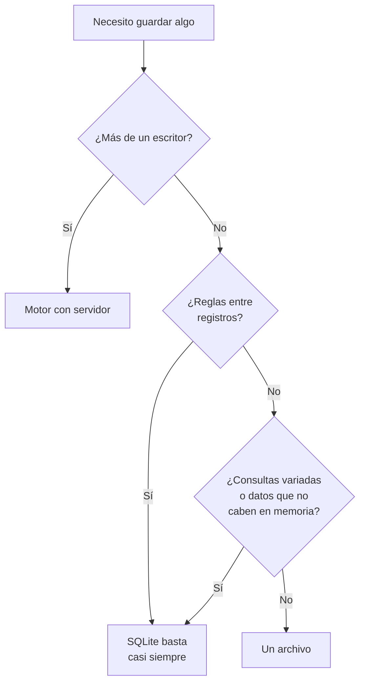

# 009 — Cuándo NO necesitas una base de datos

> [Programa](../../../README.md) · [Parte 00](../README.md) · [← Anterior](../../part-00-primeros-pasos-del-archivo-a-la-base-de-datos/008-dos-tablas-y-una-relacion/README.md) · [Siguiente →](../../part-00-primeros-pasos-del-archivo-a-la-base-de-datos/010-el-mapa-de-los-motores/README.md)

Parte 00 — Primeros pasos: del archivo a la base de datos · Fundamentos ·
2 horas estimadas · motores `sqlite`, `duckdb`, `postgresql`, `redis` · laboratorio
[`labs/01-sql-foundations`](../../../labs/01-sql-foundations/README.md) · 3 fuentes.

**Conceptos centrales:** `criterio de decisión` · `motor embebido` · `costo de operación` · `alternativas`

**En este caso se comparan 6 motores**: 4 lo resuelven (0 con el resultado comprobado por máquina) y 2 no, con el motivo escrito.

---

## Propósito

Aprender a decir que no. Un programa de bases de datos que no enseñe cuándo
**no** usarlas produce sistemas con un motor de más, y ese motor hay que
instalarlo, respaldarlo, actualizarlo, vigilarlo y explicárselo al siguiente.

## Resultados de aprendizaje

Al terminar podrás:

1. Aplicar un criterio explícito para decidir si un caso necesita base de datos.
2. Nombrar las alternativas razonables y cuándo cada una es la correcta.
3. Estimar el costo real de añadir un motor a un sistema.
4. Reconocer las tres señales que indican que un archivo se quedó corto.
5. Nombrar la fuente de cada afirmación anterior.

## Fundamentos

### El criterio, en tres preguntas

La decisión cabe en tres preguntas, y basta que una se conteste que sí:

1. **¿Escribe más de un proceso o persona a la vez?** Si sí, hace falta control
   de concurrencia, y eso no se improvisa.
2. **¿Hay reglas que deban cumplirse siempre, incluso si el programa falla a la
   mitad?** Si sí, hace falta integridad y atomicidad.
3. **¿Perder los datos es inaceptable?** Si sí, hace falta durabilidad probada,
   que es más que copiar un archivo.

Si las tres respuestas son no, un archivo basta, y es la respuesta correcta.

### Qué usar cuando la respuesta es «no hace falta»

| Caso | Herramienta razonable | Por qué |
|---|---|---|
| Configuración de una aplicación | Archivo TOML, YAML o JSON | Lo edita una persona, se versiona con el código |
| Datos de un solo proceso, con consultas | **SQLite** | Es una base de datos sin serlo: sin servidor, un archivo |
| Análisis puntual de un CSV grande | **DuckDB** | Consulta el fichero sin cargarlo, sin instalar servicio |
| Caché en memoria de un proceso | Estructura del propio lenguaje | Un diccionario no necesita red |
| Intercambio entre sistemas | CSV, Parquet, JSON | Son formatos, no almacenes: ese es su trabajo |
| Registro de eventos de una aplicación | Archivos rotados | Se escriben una vez y se leen con herramientas de texto |

Merece la pena detenerse en SQLite. Su propia documentación —la página *When To
Use* es de lectura obligada— lo plantea así: la competencia de SQLite no es
PostgreSQL, es `fopen()`. Es el paso intermedio que casi nadie considera y que
resuelve la mayoría de los casos donde una hoja de cálculo se quedó corta pero un
servidor es demasiado.

### Lo que cuesta un motor de más

No es la licencia —muchos son gratuitos—. Es todo lo demás:

- Un servicio que **instalar, configurar y actualizar**, con sus versiones y sus
  incompatibilidades.
- Un plan de **respaldo y restauración probada**, que si no se prueba no existe.
- **Vigilancia**: alguien tiene que enterarse cuando se llene el disco.
- **Conocimiento**: alguien tiene que saber diagnosticarlo a las tres de la
  mañana.
- **Un punto de fallo más** y una dependencia más en el despliegue.

Ese costo se paga durante años y no aparece en ninguna comparativa de
rendimiento.

### Las tres señales de que el archivo se quedó corto

Al revés también hay que saber decidir. Estas tres señales dicen que ha llegado
el momento:

1. **Aparece un segundo escritor.** Otro proceso, otra persona, un trabajo
   programado.
2. **Aparece una regla entre registros.** «El total del pedido tiene que ser la
   suma de sus líneas», «no puede haber dos reservas para la misma butaca».
3. **Aparece una pregunta que el formato no puede responder** sin recorrerlo
   entero cada vez.

Cuando aparece una, conviene mirar SQLite antes de mirar un servidor.



## Ejemplo trabajado

Cuatro casos reales y la decisión defendible en cada uno.

**1. Una herramienta de línea de órdenes que recuerda las últimas rutas usadas.**
Un escritor, sin reglas, y perder el historial es irrelevante. **Archivo JSON.**
Añadir una base de datos aquí obliga al usuario a instalar algo para que el
programa recuerde diez rutas.

**2. Una aplicación de escritorio que gestiona una biblioteca personal.** Un
proceso, pero con reglas —un libro no puede estar prestado dos veces— y con
consultas variadas. **SQLite.** Un archivo, sin servidor, con transacciones y
SQL. Es el caso para el que fue diseñado.

**3. Un panel que analiza un CSV mensual de dos gigabytes.** Un lector, sin
escrituras, sin reglas. **DuckDB sobre el fichero.** Cargarlo en PostgreSQL sería
trabajo y espacio para responder preguntas que se hacen una vez al mes.

**4. Una tienda con tres empleados que registran pedidos a la vez.** Varios
escritores, reglas que no se pueden romper —el stock no puede quedar negativo— y
datos que no se pueden perder. **Motor con servidor.** Aquí las tres respuestas
son sí, y no hay atajo.

La diferencia entre los cuatro no es el tamaño de los datos: el caso 3 es el que
más datos tiene y el que menos infraestructura necesita.

## Errores frecuentes

1. **Elegir por el tamaño de los datos.** Dos gigabytes de solo lectura necesitan
   menos que dos megabytes con tres escritores.
2. **Elegir por prestigio.** «Una aplicación seria usa PostgreSQL» no es un
   criterio.
3. **Saltarse SQLite.** El paso intermedio que resuelve la mayoría de los casos.
4. **Quedarse en el archivo después de la primera señal.** El coste de migrar
   crece con los datos y con el código que los usa.
5. **Contar solo el costo de instalación.** El costo real es de operación y dura
   años.
6. **Usar Redis como almacén principal «porque es rápido».** Es una caché: su
   modelo de durabilidad no promete lo que un almacén tiene que prometer.

## Ejemplo de transferencia

El mismo razonamiento se aplica a cualquier pieza de infraestructura: una cola de
mensajes, un caché distribuido, un buscador. La pregunta no es si aporta algo
—casi todo aporta algo— sino si aporta **algo que el sistema actual no puede
dar**, y si ese algo compensa el costo de operarlo durante años. Esa es la
disciplina de la última parte de este programa.

## Reto de transferencia

1. Elige tres cosas que guardes hoy: una en archivo, una en hoja de cálculo y una
   en base de datos.
2. Aplica las tres preguntas a cada una y anota la respuesta.
3. Encuentra al menos un caso donde tu decisión actual no coincida con el
   criterio, y escribe en dos frases si lo cambiarías o no y por qué.
4. Para el caso que sí necesita base de datos, escribe cuál de las tres señales
   apareció primero.

## Preguntas de evaluación

1. Enumera las tres preguntas del criterio y explica qué garantiza cada una.
2. ¿Por qué el tamaño de los datos es mal criterio? Da un ejemplo.
3. ¿En qué caso concreto elegirías SQLite antes que PostgreSQL, y por qué?
4. Nombra tres costos de añadir un motor que no aparecen en su página de
   descarga.

---

## 🌐 El mismo problema en cada motor

**Caso:** Qué usar cuando la respuesta correcta es «esto no necesita un servidor»

La decisión cabe en tres preguntas, y basta que una se conteste que sí para
necesitar una base de datos: ¿escribe más de un proceso a la vez?, ¿hay
reglas que deban cumplirse siempre?, ¿perder los datos es inaceptable?

Cuando las tres se contestan que no, la respuesta correcta es un archivo, y
decirlo forma parte del oficio. Esta comparación no ejecuta nada: recorre las
opciones reales —incluidas las que no son bases de datos— y dice para qué
sirve cada una y qué pasa el día en que el caso crece.

Esta comparación es **conceptual**: la decisión no se reduce a una consulta con
resultado, así que aquí no hay sello de máquina. Lo que se compara es lo que
cada motor **ofrece** y a qué precio, con la página oficial al lado de cada
afirmación.

| Motor | ¿Resuelve el caso? | Nivel de prueba | Código | Fuente |
|---|---|---|---|---|
| SQLite | sí | conceptual | — | [doc oficial](https://sqlite.org/whentouse.html) |
| DuckDB | sí | conceptual | — | [doc oficial](https://duckdb.org/docs/stable/why_duckdb) |
| PostgreSQL | sí | conceptual | — | [doc oficial](https://www.postgresql.org/docs/current/tutorial-arch.html) |
| Redis | sí | conceptual | — | [doc oficial](https://redis.io/docs/latest/develop/) |
| MongoDB | **no** | — | — | [doc oficial](https://www.mongodb.com/docs/manual/administration/install-community/) |
| Apache Cassandra | **no** | — | — | [doc oficial](https://cassandra.apache.org/doc/latest/cassandra/getting-started/) |

### Los que resuelven el caso

#### SQLite

- **Cómo se hace aquí:** El paso intermedio que casi nadie considera: una base de datos completa, con SQL y transacciones, dentro de un archivo y sin servidor. Su propia documentación lo plantea así: **la competencia de SQLite no es PostgreSQL, es `fopen()`**.
- **Por qué sí:** Cubre la mayoría de los casos donde una hoja de cálculo se quedó corta y un servidor es demasiado: aplicaciones de escritorio, herramientas de línea de órdenes, aplicaciones móviles, pruebas automatizadas y el estado local de cualquier programa.
- **Por qué no:** Un solo escritor a la vez y sin acceso remoto ni usuarios. En cuanto aparece un segundo proceso que escribe o alguien tiene que conectarse desde otra máquina, se acabó.
- 📄 Documentación oficial: <https://sqlite.org/whentouse.html>

#### DuckDB

- **Cómo se hace aquí:** El equivalente para analizar en vez de registrar: consulta directamente un CSV o un Parquet de gigabytes **sin cargarlo** en ningún sitio, sin servidor y sin esquema previo.
- **Por qué sí:** Para el caso más frecuente de todos —«tengo un fichero grande y quiero preguntarle cosas»— evita montar una base de datos entera para algo que se hace una vez al mes.
- **Por qué no:** No es un sistema de registro: un solo escritor, sin concurrencia y sin servicio. Analiza una copia; no guarda la verdad.
- 📄 Documentación oficial: <https://duckdb.org/docs/stable/why_duckdb>

#### PostgreSQL

- **Cómo se hace aquí:** La respuesta cuando alguna de las tres preguntas se contesta que sí: servidor, usuarios, permisos, concurrencia real, integridad declarada y durabilidad probada.
- **Por qué sí:** No hay atajo cuando hacen falta esas garantías. Y como motor generalista cubre además búsqueda de texto, JSON y vectores, así que a menudo es el único servicio que hay que operar.
- **Por qué no:** Hay que instalarlo, configurarlo, actualizarlo, respaldarlo y vigilarlo, durante años. Ese costo no aparece en ninguna comparativa de rendimiento y es el que de verdad se paga.
- 📄 Documentación oficial: <https://www.postgresql.org/docs/current/tutorial-arch.html>

#### Redis

- **Cómo se hace aquí:** Para lo que es **desechable por naturaleza**: caché, sesiones, contadores, colas de trabajo. Datos que se pueden reconstruir y cuya pérdida no cuesta nada.
- **Por qué sí:** Cuando el requisito es latencia y el dato es reconstruible, es la respuesta obvia y la más barata de operar.
- **Por qué no:** Su modelo de durabilidad no promete lo que un almacén tiene que prometer: con la configuración por omisión puede perder hasta un segundo de escrituras, y la réplica es asíncrona. Usarlo como fuente de la verdad es el error de arquitectura más común que se comete con él.
- 📄 Documentación oficial: <https://redis.io/docs/latest/develop/>

### Los que no resuelven este caso — y qué se hace en su lugar

Descartar un motor con un argumento es tan formativo como usarlo. Ninguna de estas filas dice que el motor sea peor: dice que este problema no es el suyo.

| Motor | Por qué no | Qué se hace en su lugar | Fuente |
|---|---|---|---|
| MongoDB | Exige un servidor igual que PostgreSQL, así que no es una alternativa al archivo: la decisión de esta clase es entre archivo y servidor, y una vez tomada la segunda, cuál servidor es otra pregunta. | Si lo que atraía era guardar documentos sin declarar esquema, SQLite con sus funciones JSON cubre buena parte del caso sin añadir un servicio. | [doc](https://www.mongodb.com/docs/manual/administration/install-community/) |
| Apache Cassandra | Está diseñado para un problema que casi ningún sistema tiene: un volumen de escritura que una sola máquina no puede absorber. Adoptarlo «por si crecemos» es pagar su modelo —sin reuniones, sin transacciones, con reparaciones periódicas— sin recibir nada a cambio. | Un motor generalista con réplicas de lectura y particionado interno cubre un crecimiento de dos órdenes de magnitud sin cambiar la forma de razonar sobre los datos. | [doc](https://cassandra.apache.org/doc/latest/cassandra/getting-started/) |

---

## Laboratorio

```bash
python scripts/validate_repository.py
python labs/01-sql-foundations/run_lab.py
```

Guarda como evidencia la salida completa, la versión del motor y la semilla o
los parámetros usados. Una captura sin comando no es evidencia: no se puede
repetir.

## Evaluación

| Criterio | Peso | Qué se comprueba |
|---|---:|---|
| Comprensión conceptual | 25 % | Explica el mecanismo, no solo el resultado |
| Ejecución reproducible | 25 % | Otra persona obtiene lo mismo con las instrucciones dadas |
| Interpretación basada en evidencia | 25 % | Cada conclusión se apoya en una salida o una medición |
| Límites y riesgos declarados | 25 % | Dice qué no demuestra el ejercicio y qué faltaría en producción |

La clase se da por superada cuando la respuesta explica el mecanismo, muestra
la salida que la respalda y declara al menos un límite del ejercicio.

## Fuentes de esta clase

Todo lo afirmado arriba procede de estas obras. Los identificadores viven en
[`catalog/sources.json`](../../../catalog/sources.json) y el estado de los
enlaces se comprueba con `python scripts/check_external_links.py`.

- **SQLite Consortium** (2026). [SQLite Documentation](https://sqlite.org/docs.html).  
  Motor embebido usado por los laboratorios sin dependencias del programa.
- **DuckDB Foundation** (2026). [DuckDB Documentation](https://duckdb.org/docs/).  
  Motor analítico embebido: OLAP columnar sin servidor.
- **Martin Kleppmann** (2017). [Designing Data-Intensive Applications](https://dataintensive.net/). O'Reilly. ISBN 978-1-4493-7332-0.  
  Referencia central del programa para replicación, partición, transacciones distribuidas y streaming.

---

> [Programa](../../../README.md) · [Parte 00](../README.md) · [← Anterior](../../part-00-primeros-pasos-del-archivo-a-la-base-de-datos/008-dos-tablas-y-una-relacion/README.md) · [Siguiente →](../../part-00-primeros-pasos-del-archivo-a-la-base-de-datos/010-el-mapa-de-los-motores/README.md)
