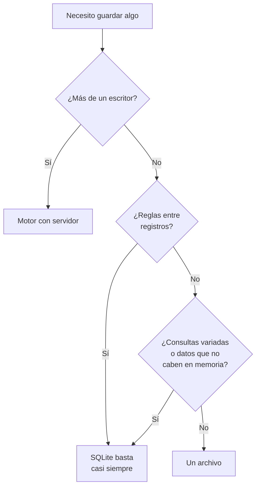

## Propósito

Aprender a decir que no. Un programa de bases de datos que no enseñe cuándo
**no** usarlas produce sistemas con un motor de más, y ese motor hay que
instalarlo, respaldarlo, actualizarlo, vigilarlo y explicárselo al siguiente.

## Resultados de aprendizaje

Al terminar podrás:

1. Aplicar un criterio explícito para decidir si un caso necesita base de datos.
2. Nombrar las alternativas razonables y cuándo cada una es la correcta.
3. Estimar el costo real de añadir un motor a un sistema.
4. Reconocer las tres señales que indican que un archivo se quedó corto.
5. Nombrar la fuente de cada afirmación anterior.

## Fundamentos

### El criterio, en tres preguntas

La decisión cabe en tres preguntas, y basta que una se conteste que sí:

1. **¿Escribe más de un proceso o persona a la vez?** Si sí, hace falta control
   de concurrencia, y eso no se improvisa.
2. **¿Hay reglas que deban cumplirse siempre, incluso si el programa falla a la
   mitad?** Si sí, hace falta integridad y atomicidad.
3. **¿Perder los datos es inaceptable?** Si sí, hace falta durabilidad probada,
   que es más que copiar un archivo.

Si las tres respuestas son no, un archivo basta, y es la respuesta correcta.

### Qué usar cuando la respuesta es «no hace falta»

| Caso | Herramienta razonable | Por qué |
|---|---|---|
| Configuración de una aplicación | Archivo TOML, YAML o JSON | Lo edita una persona, se versiona con el código |
| Datos de un solo proceso, con consultas | **SQLite** | Es una base de datos sin serlo: sin servidor, un archivo |
| Análisis puntual de un CSV grande | **DuckDB** | Consulta el fichero sin cargarlo, sin instalar servicio |
| Caché en memoria de un proceso | Estructura del propio lenguaje | Un diccionario no necesita red |
| Intercambio entre sistemas | CSV, Parquet, JSON | Son formatos, no almacenes: ese es su trabajo |
| Registro de eventos de una aplicación | Archivos rotados | Se escriben una vez y se leen con herramientas de texto |

Merece la pena detenerse en SQLite. Su propia documentación —la página *When To
Use* es de lectura obligada— lo plantea así: la competencia de SQLite no es
PostgreSQL, es `fopen()`. Es el paso intermedio que casi nadie considera y que
resuelve la mayoría de los casos donde una hoja de cálculo se quedó corta pero un
servidor es demasiado.

### Lo que cuesta un motor de más

No es la licencia —muchos son gratuitos—. Es todo lo demás:

- Un servicio que **instalar, configurar y actualizar**, con sus versiones y sus
  incompatibilidades.
- Un plan de **respaldo y restauración probada**, que si no se prueba no existe.
- **Vigilancia**: alguien tiene que enterarse cuando se llene el disco.
- **Conocimiento**: alguien tiene que saber diagnosticarlo a las tres de la
  mañana.
- **Un punto de fallo más** y una dependencia más en el despliegue.

Ese costo se paga durante años y no aparece en ninguna comparativa de
rendimiento.

### Las tres señales de que el archivo se quedó corto

Al revés también hay que saber decidir. Estas tres señales dicen que ha llegado
el momento:

1. **Aparece un segundo escritor.** Otro proceso, otra persona, un trabajo
   programado.
2. **Aparece una regla entre registros.** «El total del pedido tiene que ser la
   suma de sus líneas», «no puede haber dos reservas para la misma butaca».
3. **Aparece una pregunta que el formato no puede responder** sin recorrerlo
   entero cada vez.

Cuando aparece una, conviene mirar SQLite antes de mirar un servidor.

## Ejemplo trabajado

Cuatro casos reales y la decisión defendible en cada uno.

**1. Una herramienta de línea de órdenes que recuerda las últimas rutas usadas.**
Un escritor, sin reglas, y perder el historial es irrelevante. **Archivo JSON.**
Añadir una base de datos aquí obliga al usuario a instalar algo para que el
programa recuerde diez rutas.

**2. Una aplicación de escritorio que gestiona una biblioteca personal.** Un
proceso, pero con reglas —un libro no puede estar prestado dos veces— y con
consultas variadas. **SQLite.** Un archivo, sin servidor, con transacciones y
SQL. Es el caso para el que fue diseñado.

**3. Un panel que analiza un CSV mensual de dos gigabytes.** Un lector, sin
escrituras, sin reglas. **DuckDB sobre el fichero.** Cargarlo en PostgreSQL sería
trabajo y espacio para responder preguntas que se hacen una vez al mes.

**4. Una tienda con tres empleados que registran pedidos a la vez.** Varios
escritores, reglas que no se pueden romper —el stock no puede quedar negativo— y
datos que no se pueden perder. **Motor con servidor.** Aquí las tres respuestas
son sí, y no hay atajo.

La diferencia entre los cuatro no es el tamaño de los datos: el caso 3 es el que
más datos tiene y el que menos infraestructura necesita.

## Errores frecuentes

1. **Elegir por el tamaño de los datos.** Dos gigabytes de solo lectura necesitan
   menos que dos megabytes con tres escritores.
2. **Elegir por prestigio.** «Una aplicación seria usa PostgreSQL» no es un
   criterio.
3. **Saltarse SQLite.** El paso intermedio que resuelve la mayoría de los casos.
4. **Quedarse en el archivo después de la primera señal.** El coste de migrar
   crece con los datos y con el código que los usa.
5. **Contar solo el costo de instalación.** El costo real es de operación y dura
   años.
6. **Usar Redis como almacén principal «porque es rápido».** Es una caché: su
   modelo de durabilidad no promete lo que un almacén tiene que prometer.

## Ejemplo de transferencia

El mismo razonamiento se aplica a cualquier pieza de infraestructura: una cola de
mensajes, un caché distribuido, un buscador. La pregunta no es si aporta algo
—casi todo aporta algo— sino si aporta **algo que el sistema actual no puede
dar**, y si ese algo compensa el costo de operarlo durante años. Esa es la
disciplina de la última parte de este programa.

## Reto de transferencia

1. Elige tres cosas que guardes hoy: una en archivo, una en hoja de cálculo y una
   en base de datos.
2. Aplica las tres preguntas a cada una y anota la respuesta.
3. Encuentra al menos un caso donde tu decisión actual no coincida con el
   criterio, y escribe en dos frases si lo cambiarías o no y por qué.
4. Para el caso que sí necesita base de datos, escribe cuál de las tres señales
   apareció primero.

## Preguntas de evaluación

1. Enumera las tres preguntas del criterio y explica qué garantiza cada una.
2. ¿Por qué el tamaño de los datos es mal criterio? Da un ejemplo.
3. ¿En qué caso concreto elegirías SQLite antes que PostgreSQL, y por qué?
4. Nombra tres costos de añadir un motor que no aparecen en su página de
   descarga.
