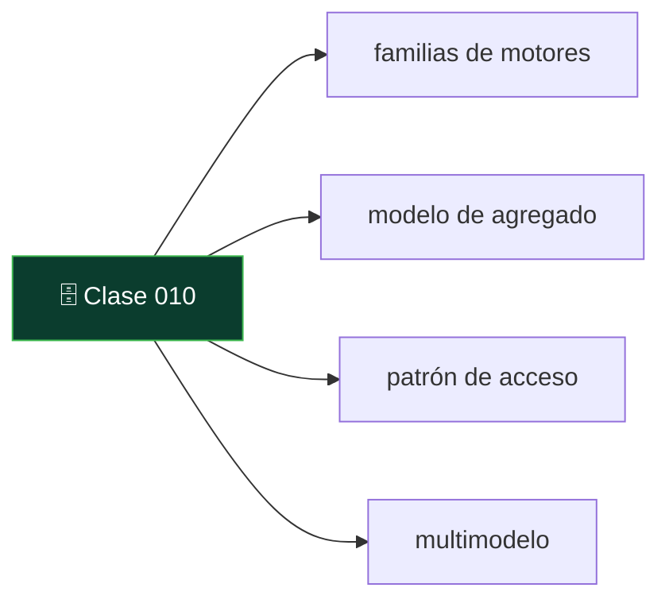
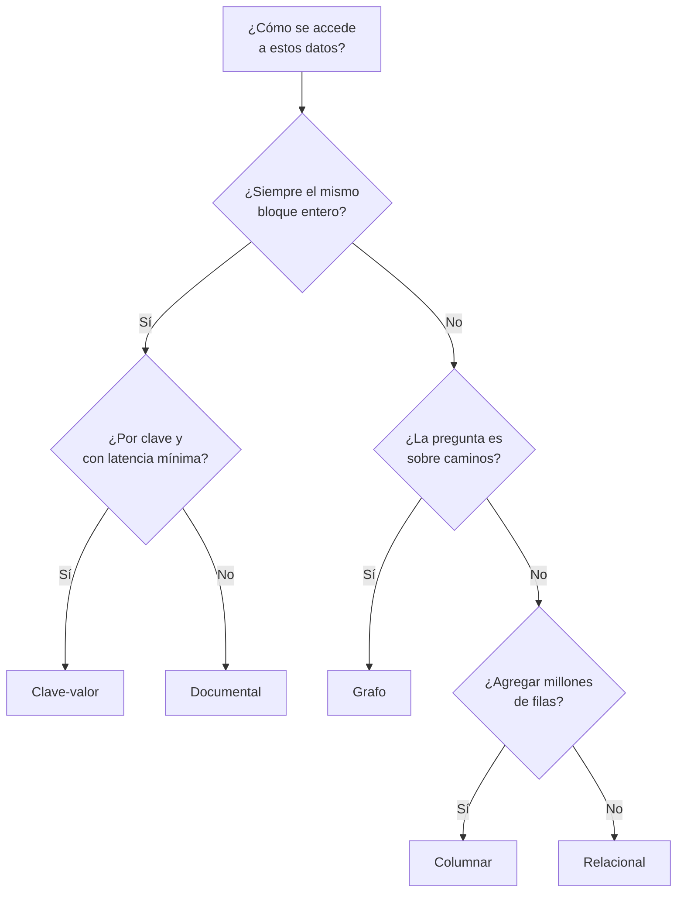

# 010 — El mapa de los motores: seis familias y un criterio

   

> [Programa](../../../README.md) · [Parte 00](../README.md) · [← Anterior](../../part-00-primeros-pasos-del-archivo-a-la-base-de-datos/009-cuando-no-necesitas-una-base-de-datos/README.md) · [Siguiente →](../../part-01-fundamentos-datos-sistemas-y-metodo/011-que-resuelve-un-sistema-de-bases-de-datos/README.md)

Parte 00 — Primeros pasos: del archivo a la base de datos · Fundamentos ·
2 horas estimadas · motores `postgresql`, `mongodb`, `redis`, `cassandra`, `neo4j`, `duckdb`, `opensearch`, `qdrant` · laboratorio
[`labs/02-polyglot-modeling`](../../../labs/02-polyglot-modeling/README.md) · 3 fuentes.

**Conceptos centrales:** `familias de motores` · `modelo de agregado` · `patrón de acceso` · `multimodelo`

**En este caso se comparan 9 motores**: 8 lo resuelven (0 con el resultado comprobado por máquina) y 1 no, con el motivo escrito.



---

## Propósito

Poner orden en los nombres. Antes de estudiar cada familia de motores conviene
tener el mapa completo: cuántas hay, qué problema resolvió cada una y en qué se
parecen más de lo que su publicidad sugiere.

## Resultados de aprendizaje

Al terminar podrás:

1. Nombrar las seis familias principales y el problema que resuelve cada una.
2. Situar en el mapa los motores que aparecen en cualquier oferta de trabajo.
3. Explicar por qué «SQL frente a NoSQL» es una división pobre.
4. Elegir familia a partir del patrón de acceso, no del nombre del producto.
5. Nombrar la fuente de cada afirmación anterior.

## Fundamentos

### Seis familias y un criterio

Lo que separa a las familias no es la sintaxis: es **qué unidad de datos manejan
y qué acceso optimizan**.

| Familia | Unidad | Optimiza | Ejemplos |
|---|---|---|---|
| **Relacional** | La fila, en tablas relacionadas | Consultas variadas con integridad | PostgreSQL, MySQL, SQL Server, Oracle, SQLite |
| **Documental** | El documento (un agregado completo) | Leer y escribir el agregado entero | MongoDB, CouchDB |
| **Clave-valor** | El par clave-valor | Acceso por clave, latencia mínima | Redis, DynamoDB |
| **Columnas anchas** | La partición, ordenada por clave | Escritura masiva y lectura por partición | Cassandra, ScyllaDB |
| **Grafo** | El nodo y la arista | Recorrer relaciones de profundidad variable | Neo4j |
| **Columnar / analítico** | La columna | Agregar sobre muchísimas filas | DuckDB, ClickHouse, BigQuery |

A esas seis se añaden dos especializados que hoy aparecen en casi todo sistema:
**búsqueda de texto** (OpenSearch, Elasticsearch) y **vectorial** (Qdrant,
pgvector, Milvus), que resuelven «encontrar lo que se parece» en dos sentidos
distintos de parecerse.

### Por qué «SQL frente a NoSQL» dice poco

La división es histórica —el término «NoSQL» nació como etiqueta de un encuentro
en 2009— y agrupa cosas que no se parecen en nada: MongoDB y Redis y Cassandra y
Neo4j están en el mismo saco, y sus modelos de datos son tan distintos entre sí
como cualquiera de ellos lo es de PostgreSQL. Además, casi todos han acabado
añadiendo un lenguaje de consulta declarativo, así que ni siquiera la parte del
«no SQL» describe bien la realidad.

Sadalage y Fowler proponen una división mejor en *NoSQL Distilled*: **agregado
frente a relacional**. Los modelos de agregado —documental, clave-valor,
columnas anchas— tratan un grupo de datos como una unidad indivisible de lectura,
escritura y consistencia. El relacional y el de grafos no: descomponen y
relacionan.

Esa distinción sí predice el comportamiento: dónde hay transacciones, qué es
atómico, qué consultas son baratas y cuáles imposibles.

### La pregunta que sí elige familia

No es «¿qué motor uso?», es **«¿cómo se van a acceder estos datos?»**:

- ¿Se lee siempre el mismo bloque entero y completo? → **agregado**
- ¿Se relacionan entidades de muchas formas distintas y no todas previstas? →
  **relacional**
- ¿Se accede siempre por una clave conocida y la latencia manda? → **clave-valor**
- ¿Se escribe muchísimo y se lee por una clave de partición? → **columnas anchas**
- ¿La pregunta es sobre caminos y conexiones, con saltos variables? → **grafo**
- ¿Se agregan millones de filas sobre pocas columnas? → **columnar**

### Multimodelo: la frontera se ha borrado

Conviene añadir un matiz que el mapa por sí solo no da: hoy **casi todos los
motores hacen un poco de todo**. PostgreSQL guarda JSON con índices, hace
búsqueda de texto y —con pgvector— búsqueda vectorial. MongoDB tiene
transacciones de varios documentos. Redis tiene estructuras de datos, no solo
pares.

La consecuencia práctica es importante: **la respuesta correcta suele ser un solo
motor generalista**, y añadir un segundo tiene que justificarse con una medición,
no con una categoría. Esa es la tesis que cierra el programa.



## Ejemplo trabajado

Una plataforma educativa, y sus cinco necesidades reales:

| Necesidad | Patrón de acceso | Familia |
|---|---|---|
| Inscripciones y pagos | Muchas relaciones, reglas que no se pueden romper | Relacional |
| Sesiones de usuario | Por clave, muy frecuente, desechable | Clave-valor |
| Buscar en el catálogo | Texto con relevancia y errores tipográficos | Búsqueda |
| Panel de dirección | Agregar todo el histórico | Columnar |
| «Cursos parecidos a este» | Similitud semántica | Vectorial |

La respuesta ingenua es cinco motores. La respuesta buena empieza por comprobar
cuántas de las cinco cubre uno solo: PostgreSQL resuelve la primera de forma
nativa, la tercera con `tsvector`, la cuarta con vistas materializadas mientras el
volumen sea moderado y la quinta con pgvector. Quedaría solo la segunda, y ahí
Redis se justifica por sí solo porque el dato es desechable por naturaleza.

De cinco motores a dos, y cada uno de los que **no** entró ahorra un plan de
respaldo, un panel de vigilancia y una coherencia que mantener. Cuando alguna de
las cuatro deje de rendir —y se sabrá porque se mide— habrá evidencia para añadir
el motor que corresponda. Ese orden, evidencia antes que adopción, es el que
defiende la última parte de este programa.

## Errores frecuentes

1. **Elegir por popularidad.** Un ranking mide menciones y ofertas de trabajo, no
   ajuste a un problema.
2. **Creer que «NoSQL» es una categoría técnica.** Agrupa cuatro modelos que no
   se parecen.
3. **Elegir por el lenguaje de consulta.** La sintaxis se aprende en una semana;
   el modelo de datos condiciona el sistema durante años.
4. **Añadir un motor por una funcionalidad y no por una carga.** «Tiene búsqueda
   vectorial» no es una necesidad.
5. **Suponer que un motor especializado siempre gana.** Gana en su terreno, y
   pierde en todo lo demás; el sistema tiene que atravesar los dos.
6. **Ignorar que el motor que ya está puede hacerlo.** Es la comprobación más
   barata y la que menos se hace.

## Ejemplo de transferencia

Este mapa es el índice del resto del programa: cada familia tiene su parte, con
su modelo, sus consultas, sus límites y su caso ejecutado en varios motores. Y
cada clase, a partir de aquí, resuelve el mismo problema en varios de ellos y
escribe **por qué sí y por qué no** conviene resolverlo en cada uno. La decisión
de familia no se toma una vez: se revisa con evidencia cada vez que aparece una
carga nueva.

## Reto de transferencia

1. Elige un sistema que uses o conozcas y enumera sus tres o cuatro cargas de
   datos distintas.
2. Sitúa cada una en una familia, justificando con el **patrón de acceso**.
3. Comprueba cuántas de esas cargas cubriría un solo motor generalista.
4. Para la carga que no cubra, escribe qué medición demostraría que hace falta
   otro motor.

## Preguntas de evaluación

1. Nombra las seis familias y el problema que resuelve cada una.
2. ¿Por qué la división «SQL frente a NoSQL» explica poco? Propón una mejor.
3. Da un caso en el que un motor documental es peor opción que uno relacional, y
   otro en el que sea mejor.
4. ¿Qué comprobación conviene hacer **antes** de añadir un motor especializado a
   una arquitectura?

---

## 🌐 El mismo problema en cada motor

**Caso:** Seis familias, y la pregunta que decide cuál corresponde

Lo que separa a las familias de motores no es la sintaxis: es **qué unidad de
datos manejan y qué acceso optimizan**. Y la pregunta que elige familia no es
«¿qué motor uso?» sino «¿cómo se van a acceder estos datos?».

Esta comparación es el índice del resto del programa: un motor
representativo de cada familia, con el patrón de acceso que le corresponde y
con el precio que se paga al elegirlo. Cada uno tiene después su propia
parte, con su modelo, sus consultas, sus límites y su caso ejecutado.

Y una advertencia que el mapa por sí solo no da: hoy casi todos los motores
hacen un poco de todo, así que la respuesta correcta suele ser **un solo
motor generalista**, y añadir un segundo tiene que justificarse con una
medición y no con una categoría.

Esta comparación es **conceptual**: la decisión no se reduce a una consulta con
resultado, así que aquí no hay sello de máquina. Lo que se compara es lo que
cada motor **ofrece** y a qué precio, con la página oficial al lado de cada
afirmación.

| Motor | ¿Resuelve el caso? | Nivel de prueba | Código | Fuente |
|---|---|---|---|---|
| PostgreSQL | sí | conceptual | — | [doc oficial](https://www.postgresql.org/docs/current/) |
| MongoDB | sí | conceptual | — | [doc oficial](https://www.mongodb.com/docs/manual/) |
| Redis | sí | conceptual | — | [doc oficial](https://redis.io/docs/latest/develop/) |
| Apache Cassandra | sí | conceptual | — | [doc oficial](https://cassandra.apache.org/doc/latest/) |
| Neo4j | sí | conceptual | — | [doc oficial](https://neo4j.com/docs/) |
| DuckDB | sí | conceptual | — | [doc oficial](https://duckdb.org/docs/stable/) |
| OpenSearch | sí | conceptual | — | [doc oficial](https://docs.opensearch.org/latest/) |
| Qdrant | sí | conceptual | — | [doc oficial](https://qdrant.tech/documentation/) |
| SQLite | **no** | — | — | [doc oficial](https://sqlite.org/whentouse.html) |

### Los que resuelven el caso

#### PostgreSQL

- **Cómo se hace aquí:** **Relacional.** La unidad es la fila, en tablas que se relacionan. Optimiza consultas variadas —incluidas las que nadie previó— con integridad declarada y transacciones.
- **Por qué sí:** Es la familia que mejor soporta que las preguntas cambien, y hoy además es multimodelo: JSON con índices, búsqueda de texto y vectores en el mismo motor. Cubre cuatro de las cinco cargas de un sistema típico.
- **Por qué no:** No es el mejor en ninguna de esas cuatro por separado, y la escritura concurrente masiva sigue pasando por un único nodo primario.
- 📄 Documentación oficial: <https://www.postgresql.org/docs/current/>

#### MongoDB

- **Cómo se hace aquí:** **Documental.** La unidad es el documento: un agregado completo que se lee y se escribe entero, sin declarar antes su forma.
- **Por qué sí:** Cuando el dominio **son** agregados que no se relacionan entre sí, el modelo encaja: una lectura, un viaje, sin reuniones, y el esquema puede evolucionar sin migraciones coordinadas.
- **Por qué no:** El límite del documento —16 MB— y la ausencia de claves foráneas convierten en trabajo del código lo que en un relacional hace el motor. Y si el dominio tiene muchas relaciones, se acaba emulando un relacional sin sus garantías.
- 📄 Documentación oficial: <https://www.mongodb.com/docs/manual/>

#### Redis

- **Cómo se hace aquí:** **Clave-valor.** La unidad es el par, en memoria. Optimiza el acceso por clave conocida con latencia de microsegundos.
- **Por qué sí:** Para caché, sesiones, contadores y colas no hay nada más simple ni más rápido, y sus estructuras —conjuntos, conjuntos ordenados, listas— resuelven problemas enteros sin salir de una orden.
- **Por qué no:** Sin consultas por contenido, sin reuniones y con la memoria como límite duro del tamaño de los datos. Y su durabilidad es una elección que hay que configurar, no una promesa.
- 📄 Documentación oficial: <https://redis.io/docs/latest/develop/>

#### Apache Cassandra

- **Cómo se hace aquí:** **Columnas anchas.** La unidad es la partición, ordenada por una clave de agrupamiento. Optimiza la escritura masiva repartida entre muchos nodos y la lectura de una partición completa.
- **Por qué sí:** Escala la escritura de forma lineal añadiendo nodos y sigue disponible con nodos caídos: es la familia para el volumen que una máquina no absorbe.
- **Por qué no:** Se modela **desde la consulta**: cada pregunta nueva es una tabla nueva que hay que llenar y mantener sin transacciones. La flexibilidad de consulta se cambia por escalabilidad de escritura.
- 📄 Documentación oficial: <https://cassandra.apache.org/doc/latest/>

#### Neo4j

- **Cómo se hace aquí:** **Grafo.** La unidad es el nodo y la arista. Optimiza recorrer relaciones de profundidad variable —«¿de qué depende esto, y de qué depende eso?»—.
- **Por qué sí:** Cuando la pregunta es sobre caminos y el número de saltos no se sabe de antemano, el costo depende del vecindario recorrido y no del tamaño del grafo: es la única familia con esa propiedad.
- **Por qué no:** Todo lo tabular le sale peor: contar y agregar sobre todos los nodos de una etiqueta es más caro que en una tabla, y mantener un grafo para una jerarquía de tres niveles es añadir un sistema por no escribir seis líneas de SQL.
- 📄 Documentación oficial: <https://neo4j.com/docs/>

#### DuckDB

- **Cómo se hace aquí:** **Columnar / analítico.** La unidad es la columna. Optimiza agregar sobre muchísimas filas leyendo solo las columnas que la consulta necesita.
- **Por qué sí:** Es la familia que hace posible resumir millones de filas en segundos, y en su versión embebida ni siquiera exige un servidor.
- **Por qué no:** Es pésima para lo contrario —leer una fila entera por su clave, o modificarla— y por eso nunca sustituye al sistema transaccional: lo acompaña.
- 📄 Documentación oficial: <https://duckdb.org/docs/stable/>

#### OpenSearch

- **Cómo se hace aquí:** **Búsqueda de texto.** Un índice invertido: guarda términos analizados y, para cada uno, dónde aparece. Optimiza encontrar y **puntuar** documentos por parecido léxico.
- **Por qué sí:** Cuando buscar es el producto —sinónimos, errores tipográficos, facetas, relevancia ajustable— ninguna función de búsqueda dentro de otro motor se le acerca.
- **Por qué no:** Es un índice secundario que va por detrás del origen: no es la verdad, es una copia que hay que alimentar y reindexar.
- 📄 Documentación oficial: <https://docs.opensearch.org/latest/>

#### Qdrant

- **Cómo se hace aquí:** **Vectorial.** La unidad es el vector. Optimiza encontrar lo más parecido en significado, con índices aproximados que renuncian a la exactitud a cambio de velocidad.
- **Por qué sí:** Es la familia que hace posible «cursos parecidos a este» sin que compartan ninguna palabra, y la base de los sistemas de recuperación para inteligencia artificial.
- **Por qué no:** La respuesta es **aproximada** y hay que medir cuánto: sin recall medido contra una búsqueda exacta, no se sabe qué se está perdiendo. Y los vectores viven separados de los datos de negocio.
- 📄 Documentación oficial: <https://qdrant.tech/documentation/>

### Los que no resuelven este caso — y qué se hace en su lugar

Descartar un motor con un argumento es tan formativo como usarlo. Ninguna de estas filas dice que el motor sea peor: dice que este problema no es el suyo.

| Motor | Por qué no | Qué se hace en su lugar | Fuente |
|---|---|---|---|
| SQLite | No es una familia distinta: es un motor relacional, y ya está representado por PostgreSQL en este mapa. Lo que lo distingue —que no tenga servidor— es una decisión de despliegue, no un modelo de datos. | Se compara donde esa distinción sí importa: en la clase sobre cuándo no hace falta una base de datos con servidor, y en la de motores embebidos. | [doc](https://sqlite.org/whentouse.html) |

---

## Laboratorio

```bash
python scripts/validate_repository.py
# labs/02-polyglot-modeling se entrega escrito: no hay guion que ejecutar
```

Guarda como evidencia la salida completa, la versión del motor y la semilla o
los parámetros usados. Una captura sin comando no es evidencia: no se puede
repetir.

## Evaluación

| Criterio | Peso | Qué se comprueba |
|---|---:|---|
| Comprensión conceptual | 25 % | Explica el mecanismo, no solo el resultado |
| Ejecución reproducible | 25 % | Otra persona obtiene lo mismo con las instrucciones dadas |
| Interpretación basada en evidencia | 25 % | Cada conclusión se apoya en una salida o una medición |
| Límites y riesgos declarados | 25 % | Dice qué no demuestra el ejercicio y qué faltaría en producción |

La clase se da por superada cuando la respuesta explica el mecanismo, muestra
la salida que la respalda y declara al menos un límite del ejercicio.

## Fuentes de esta clase

Todo lo afirmado arriba procede de estas obras. Los identificadores viven en
[`catalog/sources.json`](../../../catalog/sources.json) y el estado de los
enlaces se comprueba con `python scripts/check_external_links.py`.

- **Pramod J. Sadalage, Martin Fowler** (2012). [NoSQL Distilled: A Brief Guide to the Emerging World of Polyglot Persistence](https://martinfowler.com/books/nosql.html). Addison-Wesley. ISBN 978-0-321-82662-6.  
  Origen del término agregado y de la persistencia políglota que estructura este programa.
- **Martin Kleppmann** (2017). [Designing Data-Intensive Applications](https://dataintensive.net/). O'Reilly. ISBN 978-1-4493-7332-0.  
  Referencia central del programa para replicación, partición, transacciones distribuidas y streaming.
- **solid IT gmbh** (2026). [DB-Engines Ranking](https://db-engines.com/en/ranking).  
  Ranking mensual de más de 400 gestores por menciones, ofertas de empleo y perfiles profesionales. Mide visibilidad y demanda laboral, no calidad técnica.

---

> [Programa](../../../README.md) · [Parte 00](../README.md) · [← Anterior](../../part-00-primeros-pasos-del-archivo-a-la-base-de-datos/009-cuando-no-necesitas-una-base-de-datos/README.md) · [Siguiente →](../../part-01-fundamentos-datos-sistemas-y-metodo/011-que-resuelve-un-sistema-de-bases-de-datos/README.md)
