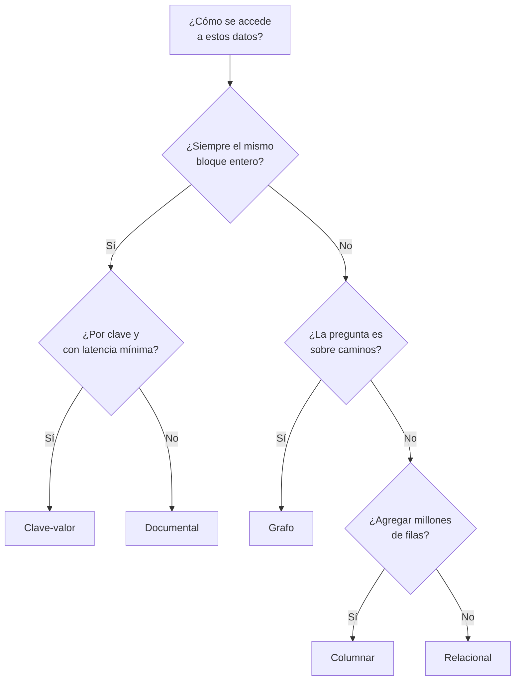

## Propósito

Poner orden en los nombres. Antes de estudiar cada familia de motores conviene
tener el mapa completo: cuántas hay, qué problema resolvió cada una y en qué se
parecen más de lo que su publicidad sugiere.

## Resultados de aprendizaje

Al terminar podrás:

1. Nombrar las seis familias principales y el problema que resuelve cada una.
2. Situar en el mapa los motores que aparecen en cualquier oferta de trabajo.
3. Explicar por qué «SQL frente a NoSQL» es una división pobre.
4. Elegir familia a partir del patrón de acceso, no del nombre del producto.
5. Nombrar la fuente de cada afirmación anterior.

## Fundamentos

### Seis familias y un criterio

Lo que separa a las familias no es la sintaxis: es **qué unidad de datos manejan
y qué acceso optimizan**.

| Familia | Unidad | Optimiza | Ejemplos |
|---|---|---|---|
| **Relacional** | La fila, en tablas relacionadas | Consultas variadas con integridad | PostgreSQL, MySQL, SQL Server, Oracle, SQLite |
| **Documental** | El documento (un agregado completo) | Leer y escribir el agregado entero | MongoDB, CouchDB |
| **Clave-valor** | El par clave-valor | Acceso por clave, latencia mínima | Redis, DynamoDB |
| **Columnas anchas** | La partición, ordenada por clave | Escritura masiva y lectura por partición | Cassandra, ScyllaDB |
| **Grafo** | El nodo y la arista | Recorrer relaciones de profundidad variable | Neo4j |
| **Columnar / analítico** | La columna | Agregar sobre muchísimas filas | DuckDB, ClickHouse, BigQuery |

A esas seis se añaden dos especializados que hoy aparecen en casi todo sistema:
**búsqueda de texto** (OpenSearch, Elasticsearch) y **vectorial** (Qdrant,
pgvector, Milvus), que resuelven «encontrar lo que se parece» en dos sentidos
distintos de parecerse.

### Por qué «SQL frente a NoSQL» dice poco

La división es histórica —el término «NoSQL» nació como etiqueta de un encuentro
en 2009— y agrupa cosas que no se parecen en nada: MongoDB y Redis y Cassandra y
Neo4j están en el mismo saco, y sus modelos de datos son tan distintos entre sí
como cualquiera de ellos lo es de PostgreSQL. Además, casi todos han acabado
añadiendo un lenguaje de consulta declarativo, así que ni siquiera la parte del
«no SQL» describe bien la realidad.

Sadalage y Fowler proponen una división mejor en *NoSQL Distilled*: **agregado
frente a relacional**. Los modelos de agregado —documental, clave-valor,
columnas anchas— tratan un grupo de datos como una unidad indivisible de lectura,
escritura y consistencia. El relacional y el de grafos no: descomponen y
relacionan.

Esa distinción sí predice el comportamiento: dónde hay transacciones, qué es
atómico, qué consultas son baratas y cuáles imposibles.

### La pregunta que sí elige familia

No es «¿qué motor uso?», es **«¿cómo se van a acceder estos datos?»**:

- ¿Se lee siempre el mismo bloque entero y completo? → **agregado**
- ¿Se relacionan entidades de muchas formas distintas y no todas previstas? →
  **relacional**
- ¿Se accede siempre por una clave conocida y la latencia manda? → **clave-valor**
- ¿Se escribe muchísimo y se lee por una clave de partición? → **columnas anchas**
- ¿La pregunta es sobre caminos y conexiones, con saltos variables? → **grafo**
- ¿Se agregan millones de filas sobre pocas columnas? → **columnar**

### Multimodelo: la frontera se ha borrado

Conviene añadir un matiz que el mapa por sí solo no da: hoy **casi todos los
motores hacen un poco de todo**. PostgreSQL guarda JSON con índices, hace
búsqueda de texto y —con pgvector— búsqueda vectorial. MongoDB tiene
transacciones de varios documentos. Redis tiene estructuras de datos, no solo
pares.

La consecuencia práctica es importante: **la respuesta correcta suele ser un solo
motor generalista**, y añadir un segundo tiene que justificarse con una medición,
no con una categoría. Esa es la tesis que cierra el programa.

## Ejemplo trabajado

Una plataforma educativa, y sus cinco necesidades reales:

| Necesidad | Patrón de acceso | Familia |
|---|---|---|
| Inscripciones y pagos | Muchas relaciones, reglas que no se pueden romper | Relacional |
| Sesiones de usuario | Por clave, muy frecuente, desechable | Clave-valor |
| Buscar en el catálogo | Texto con relevancia y errores tipográficos | Búsqueda |
| Panel de dirección | Agregar todo el histórico | Columnar |
| «Cursos parecidos a este» | Similitud semántica | Vectorial |

La respuesta ingenua es cinco motores. La respuesta buena empieza por comprobar
cuántas de las cinco cubre uno solo: PostgreSQL resuelve la primera de forma
nativa, la tercera con `tsvector`, la cuarta con vistas materializadas mientras el
volumen sea moderado y la quinta con pgvector. Quedaría solo la segunda, y ahí
Redis se justifica por sí solo porque el dato es desechable por naturaleza.

De cinco motores a dos, y cada uno de los que **no** entró ahorra un plan de
respaldo, un panel de vigilancia y una coherencia que mantener. Cuando alguna de
las cuatro deje de rendir —y se sabrá porque se mide— habrá evidencia para añadir
el motor que corresponda. Ese orden, evidencia antes que adopción, es el que
defiende la última parte de este programa.

## Errores frecuentes

1. **Elegir por popularidad.** Un ranking mide menciones y ofertas de trabajo, no
   ajuste a un problema.
2. **Creer que «NoSQL» es una categoría técnica.** Agrupa cuatro modelos que no
   se parecen.
3. **Elegir por el lenguaje de consulta.** La sintaxis se aprende en una semana;
   el modelo de datos condiciona el sistema durante años.
4. **Añadir un motor por una funcionalidad y no por una carga.** «Tiene búsqueda
   vectorial» no es una necesidad.
5. **Suponer que un motor especializado siempre gana.** Gana en su terreno, y
   pierde en todo lo demás; el sistema tiene que atravesar los dos.
6. **Ignorar que el motor que ya está puede hacerlo.** Es la comprobación más
   barata y la que menos se hace.

## Ejemplo de transferencia

Este mapa es el índice del resto del programa: cada familia tiene su parte, con
su modelo, sus consultas, sus límites y su caso ejecutado en varios motores. Y
cada clase, a partir de aquí, resuelve el mismo problema en varios de ellos y
escribe **por qué sí y por qué no** conviene resolverlo en cada uno. La decisión
de familia no se toma una vez: se revisa con evidencia cada vez que aparece una
carga nueva.

## Reto de transferencia

1. Elige un sistema que uses o conozcas y enumera sus tres o cuatro cargas de
   datos distintas.
2. Sitúa cada una en una familia, justificando con el **patrón de acceso**.
3. Comprueba cuántas de esas cargas cubriría un solo motor generalista.
4. Para la carga que no cubra, escribe qué medición demostraría que hace falta
   otro motor.

## Preguntas de evaluación

1. Nombra las seis familias y el problema que resuelve cada una.
2. ¿Por qué la división «SQL frente a NoSQL» explica poco? Propón una mejor.
3. Da un caso en el que un motor documental es peor opción que uno relacional, y
   otro en el que sea mejor.
4. ¿Qué comprobación conviene hacer **antes** de añadir un motor especializado a
   una arquitectura?
