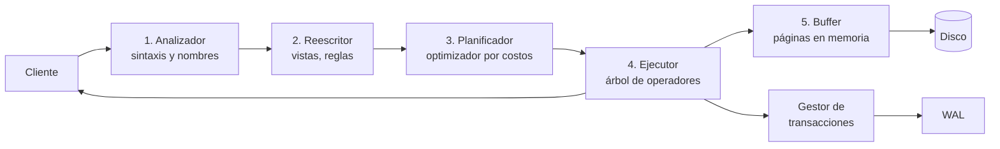

# 012 — Arquitectura interna de un gestor, del cliente al disco

> [Programa](../../../README.md) · [Parte 01](../README.md) · [← Anterior](../../part-01-fundamentos-datos-sistemas-y-metodo/011-que-resuelve-un-sistema-de-bases-de-datos/README.md) · [Siguiente →](../../part-01-fundamentos-datos-sistemas-y-metodo/013-independencia-de-datos-y-niveles-de-esquema/README.md)

Parte 01 — Fundamentos, sistemas y método · Fundamentos ·
3 horas estimadas · motores `postgresql`, `sqlite` · laboratorio
[`labs/01-sql-foundations`](../../../labs/01-sql-foundations/README.md) · 3 fuentes.

**Conceptos centrales:** `analizador` · `planificador` · `ejecutor` · `gestor de almacenamiento` · `buffer pool`

**En este caso se comparan 8 motores**: 7 lo resuelven (0 con el resultado comprobado por máquina) y 1 no, con el motivo escrito.

---

## Propósito

Abrir la caja negra. Saber qué le ocurre a una consulta desde que sale del cliente hasta que vuelve con filas permite razonar sobre rendimiento, bloqueos y fallos en lugar de adivinar.

## Resultados de aprendizaje

Al terminar podrás:

1. Nombrar los cinco componentes de un SGBD relacional y qué hace cada uno.
2. Seguir el recorrido de una consulta y señalar en qué etapa se decide el rendimiento.
3. Explicar por qué el mismo SQL puede tardar 2 ms o 2 s sin que cambie el dato.
4. Distinguir el modelo de proceso por conexión del de hilos, y su consecuencia operativa.
5. Localizar cada afirmación en la fuente que la respalda.

## Fundamentos

### Los cinco componentes

Hellerstein, Stonebraker y Hamilton organizan cualquier SGBD relacional en cinco piezas. La lista es estable desde System R y sigue describiendo PostgreSQL, MySQL u Oracle:

1. **Gestor de procesos y conexiones.** Acepta clientes, autentica y asigna a cada sesión un contexto de ejecución.
2. **Procesador de consultas.** Analiza, reescribe, planifica y ejecuta. Aquí vive el optimizador.
3. **Gestor de transacciones.** Bloqueos, registro de escritura anticipada, control de versiones y recuperación.
4. **Gestor de almacenamiento.** Páginas, buffer, organización de archivos e índices.
5. **Utilidades compartidas.** Catálogo, memoria, replicación, respaldo, estadísticas.

### El recorrido de una consulta



Las etapas 1 y 2 son deterministas y baratas. La etapa 3 es donde se juega el rendimiento: el optimizador estima cuántas filas producirá cada operador y elige un plan. La etapa 5 es donde se paga: cada página que no esté en memoria es una lectura de disco.

El punto pedagógico: **la misma consulta puede recibir planes distintos** según las estadísticas del catálogo, la memoria disponible y los índices existentes. Por eso el rendimiento se diagnostica leyendo el plan (clase 042), no leyendo el SQL.

### Buffer pool: por qué la memoria manda

El gestor de almacenamiento no lee filas, lee **páginas** (8 KB en PostgreSQL, configurable en otros motores). Esas páginas se mantienen en un caché compartido. Una lectura servida desde el buffer cuesta cientos de nanosegundos; una que llega al disco, cientos de microsegundos en SSD. Tres órdenes de magnitud de diferencia por el mismo SQL.

Petrov desarrolla la consecuencia: casi todas las decisiones de diseño de un motor —tamaño de página, estructura del índice, política de compactación— son intentos de reducir el número de páginas tocadas.

### Modelo de proceso: qué cambia en operación

| Modelo | Motor típico | Consecuencia práctica |
|---|---|---|
| Proceso por conexión | PostgreSQL | Cada conexión cuesta memoria; hace falta un agrupador de conexiones |
| Hilo por conexión | MySQL, SQL Server | Conexiones más baratas; más riesgo de contención en estructuras compartidas |
| Biblioteca embebida | SQLite, DuckDB | No hay servidor: el proceso de la aplicación *es* el motor |

Rogov documenta el caso de PostgreSQL con detalle: el proceso de fondo `autovacuum`, la memoria compartida y por qué abrir 500 conexiones directas hunde un servidor que soporta sin esfuerzo 500 clientes a través de un agrupador.

## Ejemplo trabajado

Sigamos `SELECT nombre FROM students WHERE id = 3` sobre el dominio canónico del repositorio.

**Etapa 1 — Análisis.** Se comprueba la sintaxis y se resuelve `students` en el catálogo. Si la tabla no existe, el error llega aquí, antes de tocar un solo dato.

**Etapa 3 — Planificación.** El planificador tiene dos caminos:

```text
Plan A  Barrido secuencial: leer las N páginas de la tabla y filtrar
Plan B  Búsqueda por índice: descender el B-Tree de la clave primaria
```

Con la tabla de ejemplo (4 filas, 1 página), el coste estimado del barrido es menor que el del índice: leer una página y descartar tres filas es más barato que descender un árbol. **El motor elige el barrido y hace bien.** Con 4 millones de filas repartidas en 30 000 páginas, el mismo optimizador elige el índice, porque descender tres niveles del árbol toca 4 páginas frente a 30 000.

Este es el resultado que sorprende a quien empieza: *no usar el índice puede ser la decisión correcta*. Depende de la selectividad, y la selectividad la estima el optimizador a partir de estadísticas.

**Etapa 5 — Acceso.** Si esas páginas ya estaban en el buffer por una consulta anterior, no hay lectura física. La segunda ejecución de la misma consulta suele ser mucho más rápida que la primera, y eso **no** significa que la consulta haya mejorado: significa que el caché está caliente. Cualquier medición que ignore este efecto es una medición inválida.

Comprobación directa en el laboratorio, sin instalar nada:

```sql
EXPLAIN QUERY PLAN SELECT nombre FROM students WHERE id = 3;
```

## Comparación

| Etapa | Qué decide | Coste típico | Se diagnostica con |
|---|---|---|---|
| Análisis | Validez sintáctica y de nombres | microsegundos | mensaje de error |
| Reescritura | Expansión de vistas y reglas | microsegundos | plan expandido |
| Planificación | Orden de reunión, uso de índices | microsegundos a ms | `EXPLAIN` |
| Ejecución | Trabajo real sobre filas | ms a minutos | `EXPLAIN ANALYZE` |
| Almacenamiento | Páginas leídas y escritas | dominante | contadores de E/S y aciertos de buffer |

## Errores frecuentes

1. **«El motor no usa mi índice, está roto.»** Casi siempre el optimizador estimó que el barrido era más barato, y con pocas filas suele acertar. Antes de forzar nada, mira la estimación frente al conteo real.
2. **«Mido el tiempo de la primera ejecución.»** Esa medición incluye el llenado del buffer. Compara siempre ejecuciones en frío contra ejecuciones en frío.
3. **«Más conexiones, más rendimiento.»** Por encima del paralelismo útil, cada conexión adicional añade contención y memoria. La curva baja, no sube.
4. **«El plan es estable.»** Cambia con las estadísticas, el volumen y la versión del motor. Un plan bueno hoy puede degradarse tras una carga masiva sin recolección de estadísticas.
5. **«SQLite no tiene arquitectura.»** Tiene los mismos componentes; lo que no tiene es un proceso servidor. Precisamente por eso es el mejor motor para leer un gestor entero.

## De la clase a la operación

Los incidentes de bases de datos casi nunca son «la consulta es lenta»: son «el plan cambió tras una migración», «el buffer se quedó pequeño al crecer los datos», «el agrupador de conexiones se agotó». Reconocer en qué componente ocurre un síntoma reduce el diagnóstico de horas a minutos.

## Reto de transferencia

Ejecuta la misma consulta dos veces sobre el dominio del repositorio y documenta:

1. El plan elegido en cada caso, con la salida literal.
2. La diferencia de tiempo, y a qué componente la atribuyes.
3. Una modificación (índice, volumen de datos o filtro) que haga cambiar el plan, con la evidencia del cambio.
4. Qué medirías para demostrar que la mejora es real y no un efecto de caché.

## Preguntas de evaluación

1. ¿En qué etapa se detecta un nombre de columna mal escrito, y por qué no puede detectarse antes ni después?
2. Explica con números por qué un barrido secuencial puede ganarle a una búsqueda por índice.
3. Tu servidor pasa de 50 a 500 conexiones y el rendimiento cae. Da dos causas plausibles ligadas al modelo de proceso.
4. ¿Qué componente falla si, tras un corte de energía, aparecen filas de una transacción que nunca se confirmó?

---

## 🌐 El mismo problema en cada motor

**Caso:** Qué hay entre la consulta y el disco, motor por motor

Una consulta atraviesa siempre las mismas capas —protocolo, analizador,
planificador, ejecutor, gestor de almacenamiento y caché de páginas—, pero
cada motor las reparte de forma distinta entre procesos, hilos y archivos.
Aquí no hay una salida que comparar: lo que se compara es **dónde vive cada
capa** en cada motor, porque de ese reparto salen sus límites de operación.

Esta comparación es **conceptual**: la decisión no se reduce a una consulta con
resultado, así que aquí no hay sello de máquina. Lo que se compara es lo que
cada motor **ofrece** y a qué precio, con la página oficial al lado de cada
afirmación.

| Motor | ¿Resuelve el caso? | Nivel de prueba | Código | Fuente |
|---|---|---|---|---|
| PostgreSQL | sí | conceptual | — | [doc oficial](https://www.postgresql.org/docs/current/tutorial-arch.html) |
| MySQL | sí | conceptual | — | [doc oficial](https://dev.mysql.com/doc/refman/8.4/en/pluggable-storage-overview.html) |
| SQLite | sí | conceptual | — | [doc oficial](https://sqlite.org/arch.html) |
| DuckDB | sí | conceptual | — | [doc oficial](https://duckdb.org/docs/stable/internals/overview.html) |
| MongoDB | sí | conceptual | — | [doc oficial](https://www.mongodb.com/docs/manual/core/wiredtiger/) |
| Redis | sí | conceptual | — | [doc oficial](https://redis.io/docs/latest/develop/reference/protocol-spec/) |
| Apache Cassandra | sí | conceptual | — | [doc oficial](https://cassandra.apache.org/doc/latest/cassandra/architecture/overview.html) |
| ClickHouse | **no** | — | — | [doc oficial](https://clickhouse.com/docs/en/development/architecture) |

### Los que resuelven el caso

#### PostgreSQL

- **Cómo se hace aquí:** Un proceso supervisor (`postmaster`) acepta la conexión y lanza **un proceso del sistema operativo por sesión**. Ese proceso analiza, planifica y ejecuta; las páginas se comparten en memoria (`shared_buffers`) y los cambios se escriben antes al registro anticipado (WAL) y después a los archivos de datos, con procesos auxiliares para el vaciado y el autovacío.
- **Por qué sí:** El aislamiento entre procesos hace que la caída de una sesión no arrastre al servidor, y permite extensiones cargadas por sesión sin recompilar nada.
- **Por qué no:** Un proceso por conexión cuesta memoria y cambio de contexto: por encima de unos cientos de conexiones hace falta un agrupador (PgBouncer) delante, y eso es una pieza más que operar.
- 📄 Documentación oficial: <https://www.postgresql.org/docs/current/tutorial-arch.html>

#### MySQL

- **Cómo se hace aquí:** Un servidor multihilo con **un hilo por conexión** y, debajo, un motor de almacenamiento intercambiable: InnoDB aporta el buffer pool, el registro de rehacer y el control de concurrencia. La capa SQL y la capa de almacenamiento están separadas por una interfaz.
- **Por qué sí:** Los hilos pesan menos que los procesos y el arranque de conexión es más barato; la separación por motores permitió que InnoDB sustituyera a MyISAM sin reescribir el SQL.
- **Por qué no:** Esa misma separación deja al optimizador con menos información sobre el almacenamiento, y explica varias de sus decisiones de plan peores que las de PostgreSQL en consultas anidadas.
- 📄 Documentación oficial: <https://dev.mysql.com/doc/refman/8.4/en/pluggable-storage-overview.html>

#### SQLite

- **Cómo se hace aquí:** No hay servidor: la biblioteca se enlaza dentro del proceso de la aplicación y **la base de datos es un archivo**. El analizador genera un programa para una máquina virtual de bytecode (VDBE) que el propio proceso ejecuta; el bloqueo lo da el sistema de archivos y el registro es el archivo WAL de al lado.
- **Por qué sí:** Cero administración, cero red, cero latencia de conexión: es el motor más desplegado del mundo justamente por lo que no tiene.
- **Por qué no:** Sin servidor no hay control de acceso por usuario, ni conexiones remotas, ni escrituras concurrentes de varios procesos más allá de lo que el bloqueo de archivo permite.
- 📄 Documentación oficial: <https://sqlite.org/arch.html>

#### DuckDB

- **Cómo se hace aquí:** También embebido y sin servidor, pero el ejecutor es **vectorizado y columnar**: procesa lotes de miles de valores de una columna por operación, en vez de una fila cada vez, y paraleliza por trozos del archivo.
- **Por qué sí:** Ese ejecutor es la razón de que consultas analíticas sobre millones de filas terminen en un portátil sin clúster.
- **Por qué no:** El mismo diseño hace caras las escrituras fila a fila y no ofrece concurrencia entre escritores: no es el sitio donde vive la verdad del negocio.
- 📄 Documentación oficial: <https://duckdb.org/docs/stable/internals/overview.html>

#### MongoDB

- **Cómo se hace aquí:** Servidor multihilo cuyo almacenamiento es WiredTiger: control de concurrencia por documento con múltiples versiones, caché propia fuera del montón del proceso y un registro de diario para durabilidad. El planificador prueba varios planes en paralelo y **guarda en caché el que gana**.
- **Por qué sí:** La caché de planes con reevaluación automática ahorra estadísticas manuales, y la concurrencia por documento evita bloqueos de colección enteros.
- **Por qué no:** Los planes en caché pueden envejecer mal cuando la distribución de datos cambia, y diagnosticar eso exige leer `explain` con detalle, no adivinar.
- 📄 Documentación oficial: <https://www.mongodb.com/docs/manual/core/wiredtiger/>

#### Redis

- **Cómo se hace aquí:** Un **único hilo** ejecuta las órdenes una tras otra sobre estructuras de datos en memoria; la red se atiende con multiplexación de eventos y la persistencia es opcional (instantáneas RDB o registro AOF) y la hace un proceso hijo.
- **Por qué sí:** Un solo hilo elimina los bloqueos: cada orden es atómica sin que nadie escriba una sola línea de sincronización, y la latencia es de microsegundos.
- **Por qué no:** Una orden lenta (`KEYS *`, un script Lua largo) bloquea a todos los demás clientes, y la memoria es el límite duro del tamaño del conjunto de datos.
- 📄 Documentación oficial: <https://redis.io/docs/latest/develop/reference/protocol-spec/>

#### Apache Cassandra

- **Cómo se hace aquí:** **No hay nodo maestro**: cualquier nodo actúa de coordinador, calcula el token de la clave, reenvía a las réplicas y espera tantas respuestas como pida el nivel de consistencia. Debajo, cada nodo escribe en memoria (memtable) y en el registro de compromiso, y vuelca a archivos inmutables (SSTables) que después se compactan.
- **Por qué sí:** Esa arquitectura da escritura lineal y disponibilidad ante caídas de nodos: no hay una pieza cuya caída detenga el sistema.
- **Por qué no:** El precio es que la lectura puede tener que consultar varias SSTables y varias réplicas, y que la compactación consume entrada y salida de forma sostenida.
- 📄 Documentación oficial: <https://cassandra.apache.org/doc/latest/cassandra/architecture/overview.html>

### Los que no resuelven este caso — y qué se hace en su lugar

Descartar un motor con un argumento es tan formativo como usarlo. Ninguna de estas filas dice que el motor sea peor: dice que este problema no es el suyo.

| Motor | Por qué no | Qué se hace en su lugar | Fuente |
|---|---|---|---|
| ClickHouse | Su arquitectura no es una variante de las anteriores sino otra cosa: `MergeTree` ordena y comprime por partes, la ejecución es vectorizada y masivamente paralela, y las actualizaciones fila a fila son operaciones pesadas y asíncronas. Compararlo aquí como si fuera un motor transaccional induce a error. | Se estudia donde le corresponde, en la parte de analítica columnar, junto a DuckDB, con su propio caso y su propia medición. | [doc](https://clickhouse.com/docs/en/development/architecture) |

---

## Laboratorio

```bash
python scripts/validate_repository.py
python labs/01-sql-foundations/run_lab.py
```

Guarda como evidencia la salida completa, la versión del motor y la semilla o
los parámetros usados. Una captura sin comando no es evidencia: no se puede
repetir.

## Evaluación

| Criterio | Peso | Qué se comprueba |
|---|---:|---|
| Comprensión conceptual | 25 % | Explica el mecanismo, no solo el resultado |
| Ejecución reproducible | 25 % | Otra persona obtiene lo mismo con las instrucciones dadas |
| Interpretación basada en evidencia | 25 % | Cada conclusión se apoya en una salida o una medición |
| Límites y riesgos declarados | 25 % | Dice qué no demuestra el ejercicio y qué faltaría en producción |

La clase se da por superada cuando la respuesta explica el mecanismo, muestra
la salida que la respalda y declara al menos un límite del ejercicio.

## Fuentes de esta clase

Todo lo afirmado arriba procede de estas obras. Los identificadores viven en
[`catalog/sources.json`](../../../catalog/sources.json) y el estado de los
enlaces se comprueba con `python scripts/check_external_links.py`.

- **Joseph M. Hellerstein, Michael Stonebraker, James Hamilton** (2007). [Architecture of a Database System](https://dsf.berkeley.edu/papers/fntdb07-architecture.pdf). Foundations and Trends in Databases 1(2). DOI [10.1561/1900000002](https://doi.org/10.1561/1900000002).  
  Descripción completa de los componentes internos de un SGBD relacional.
- **Alex Petrov** (2019). [Database Internals: A Deep Dive into How Distributed Data Systems Work](https://www.databass.dev/). O'Reilly. ISBN 978-1-4920-4034-7.  
  Motor de almacenamiento (B-Tree y LSM) y consenso explicados con detalle de implementación.
- **Egor Rogov** (2022). [PostgreSQL 14 Internals](https://postgrespro.com/community/books/internals). Postgres Professional. ISBN 978-5-6041193-2-8.  
  PDF gratuito. MVCC, vacuum, buffers, índices y planificador sobre el código real.

---

> [Programa](../../../README.md) · [Parte 01](../README.md) · [← Anterior](../../part-01-fundamentos-datos-sistemas-y-metodo/011-que-resuelve-un-sistema-de-bases-de-datos/README.md) · [Siguiente →](../../part-01-fundamentos-datos-sistemas-y-metodo/013-independencia-de-datos-y-niveles-de-esquema/README.md)
