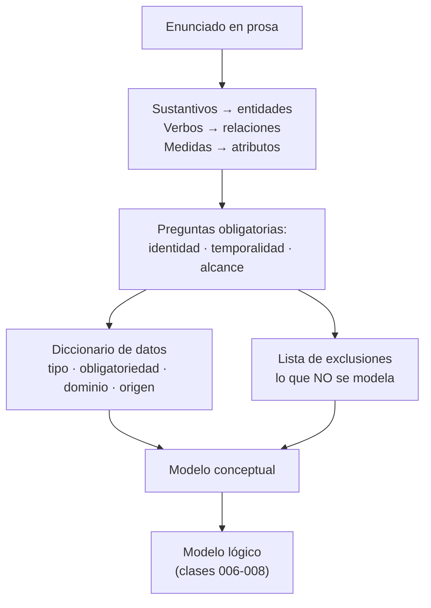

# 005 — De requisitos ambiguos a entidades defendibles

> [Programa](../../../README.md) · [Parte 01](../README.md) · [← Anterior](../../part-00-fundamentos-datos-sistemas-y-metodo/004-entorno-reproducible-y-evidencia/README.md) · [Siguiente →](../../part-01-modelado-conceptual-y-requisitos/006-entidad-relacion-cardinalidad-y-participacion/README.md)

Parte 01 — Modelado conceptual y requisitos · Fundamentos ·
3 horas estimadas · motores `sqlite` · laboratorio
[`labs/01-sql-foundations`](../../../labs/01-sql-foundations/README.md) · 3 fuentes.

**Conceptos centrales:** `regla de negocio` · `diccionario de datos` · `alcance` · `patrón de acceso`

---

## Propósito

Convertir un enunciado en prosa —ambiguo, incompleto y contradictorio, como todos— en una lista de entidades, atributos y reglas que se pueda defender frente a quien encargó el sistema.

## Resultados de aprendizaje

Al terminar podrás:

1. Extraer entidades candidatas de un texto con un procedimiento repetible.
2. Separar hechos del dominio de decisiones de implementación.
3. Escribir un diccionario de datos con tipo, obligatoriedad, dominio y origen.
4. Detectar las tres ambigüedades que más caro salen: identidad, temporalidad y alcance.
5. Justificar qué queda **fuera** del modelo y por qué.

## Fundamentos

### El método, no la inspiración

Hernández propone un procedimiento que funciona porque es aburrido y se puede auditar. Adaptado a este programa:

1. **Recoger el enunciado literal**, sin reescribirlo todavía.
2. **Subrayar sustantivos** → entidades candidatas. **Subrayar verbos** → relaciones candidatas. **Subrayar adjetivos y medidas** → atributos candidatos.
3. **Descartar sinónimos** («alumno», «estudiante», «matriculado» suelen ser lo mismo; a veces no, y eso hay que preguntarlo).
4. **Preguntar por la identidad** de cada entidad: ¿qué hace que dos ejemplares sean el mismo?
5. **Preguntar por la temporalidad**: ¿el valor cambia? ¿hace falta el histórico?
6. **Escribir el diccionario de datos** con el origen de cada regla.
7. **Escribir la lista de exclusiones**: lo que el sistema no modelará.

El paso 7 es el que casi nadie hace y el que evita la mitad de los conflictos. Kent lo argumenta en *Data and Reality*: no existe un modelo «correcto» del mundo, solo un recorte útil para un propósito. Si el recorte no está escrito, cada persona supondrá uno distinto.

### Las tres ambigüedades caras

| Ambigüedad | Pregunta que la resuelve | Qué pasa si no se pregunta |
|---|---|---|
| **Identidad** | ¿Dos filas con los mismos datos son la misma cosa? | Duplicados imposibles de limpiar después |
| **Temporalidad** | ¿Necesitamos saber cómo era antes? | Se sobrescribe el pasado y no hay vuelta atrás |
| **Alcance** | ¿Esto lo gestiona nuestro sistema o solo lo referencia? | Se modela medio mundo y no se termina nunca |

### Hechos frente a decisiones

Elmasri y Navathe separan el **modelo conceptual** (qué existe en el dominio) del **modelo lógico** (cómo se representa en un modelo de datos concreto). Mezclarlos es el error de principiante más costoso, porque congela decisiones antes de entender el problema.

| Es un hecho del dominio | Es una decisión de implementación |
|---|---|
| «Un estudiante puede inscribir varios cursos» | «Usaremos una tabla puente» |
| «El correo identifica a la persona en el sistema» | «El correo será la clave primaria» |
| «La nota va de 1,0 a 7,0» | «Será `NUMERIC(2,1)` con un `CHECK`» |
| «Necesitamos saber quién cambió una nota» | «Habrá una tabla de auditoría con disparadores» |

La columna izquierda se negocia con el cliente. La derecha se negocia con el equipo, y puede cambiar sin volver a reunirse con nadie.



## Ejemplo trabajado

Enunciado recibido:

> «Necesitamos registrar los cursos que dicta cada profesor y las notas de los estudiantes. Un curso lo puede dictar más de un profesor. Queremos saber el promedio del curso.»

**Paso 2.** Sustantivos: *curso, profesor, estudiante, nota, promedio*. Verbos: *dictar, registrar*.

**Paso 3.** `promedio` no es una entidad ni un atributo almacenado: es un **cálculo** sobre notas. Guardarlo introduce redundancia que hay que mantener (clase 009 discute cuándo sí conviene).

**Paso 4 — identidad.** ¿Dos profesores con el mismo nombre son la misma persona? No. Hace falta un identificador. ¿Y dos cursos llamados «Bases de datos»? Tampoco: se distinguen por período. El enunciado no lo dice, así que **es una pregunta al cliente**, no una suposición.

**Paso 5 — temporalidad.** «Las notas de los estudiantes»: ¿se corrigen? Si una nota se puede rectificar y alguien puede reclamar, hace falta histórico. El enunciado calla. Segunda pregunta al cliente.

**Paso 6 — diccionario de datos:**

| Entidad | Atributo | Tipo | Obligatorio | Dominio | Origen de la regla |
|---|---|---|---|---|---|
| student | id | entero | sí | > 0 | decisión de diseño |
| student | nombre | texto | sí | ≤ 120 caracteres | enunciado |
| course | id | entero | sí | > 0 | decisión de diseño |
| course | nombre | texto | sí | ≤ 120 caracteres | enunciado |
| course | periodo | texto | sí | `AAAA-S` | **pregunta pendiente** |
| enrollment | nota | decimal(2,1) | no | 1,0 – 7,0 | escala chilena, confirmar |
| enrollment | registrada_en | marca de tiempo | sí | pasado | necesaria para auditoría |

**Paso 7 — exclusiones declaradas:**

- No se modela la asistencia.
- No se modela el pago de aranceles.
- Los profesores se referencian, pero la nómina la gestiona otro sistema.
- No se guarda el promedio: se calcula.

Resultado: cuatro entidades (`student`, `course`, `teacher`, `enrollment`), dos preguntas abiertas explícitas y una lista de exclusiones. Nada de esto exige haber elegido todavía un motor.

## Comparación

| Enfoque de partida | Ventaja | Riesgo dominante |
|---|---|---|
| Desde el enunciado (este método) | Trazabilidad a la regla de negocio | Lento si el enunciado es pobre |
| Desde las pantallas de la aplicación | Rápido, muy concreto | Modela la interfaz, no el dominio; cambia con el diseño |
| Desde un esquema heredado | Conserva compatibilidad | Hereda los errores y los normaliza como verdad |
| Desde un modelo de referencia del sector | Vocabulario común | Trae entidades que nadie necesita |

## Errores frecuentes

1. **Modelar la pantalla.** Si la entidad se llama `FormularioInscripcion`, el modelo caducará con el próximo rediseño de la interfaz.
2. **Guardar valores calculados sin decidirlo.** El promedio almacenado se desincroniza en cuanto alguien corrige una nota por fuera.
3. **Resolver las ambigüedades por cuenta propia.** Suponer que los cursos no se repiten entre períodos es una decisión de negocio disfrazada de detalle técnico.
4. **Confundir el nombre con la identidad.** «Nombre único» casi nunca es cierto y siempre se descubre en producción.
5. **No escribir las exclusiones.** Sin ellas, el alcance crece en cada reunión y nadie puede señalar cuándo cambió.

## De la clase a la operación

Los cambios de esquema más caros no vienen de requisitos nuevos: vienen de ambigüedades no resueltas al principio. Añadir histórico a una tabla que lleva tres años sobrescribiendo significa que ese pasado ya no existe: ninguna migración lo recupera.

## Reto de transferencia

Toma un requisito real de un proyecto tuyo y produce:

1. La lista de entidades, relaciones y atributos candidatos, con el subrayado que la originó.
2. Las tres preguntas de identidad, temporalidad y alcance, formuladas para hacérselas a una persona no técnica.
3. El diccionario de datos con la columna «origen de la regla» completa.
4. La lista de exclusiones, con una frase de justificación por cada una.

## Preguntas de evaluación

1. Da un atributo de tu dominio que parezca un hecho y sea en realidad una decisión de implementación.
2. ¿Qué pierdes exactamente si no preguntas por la temporalidad de un atributo que sí cambia?
3. Un cliente afirma que el correo identifica a la persona. Da dos casos reales que rompan esa afirmación.
4. ¿Por qué la lista de exclusiones es parte del modelo y no del acta de la reunión?

---

## Laboratorio

```bash
python scripts/validate_repository.py
python labs/01-sql-foundations/run_lab.py
```

Guarda como evidencia la salida completa, la versión del motor y la semilla o
los parámetros usados. Una captura sin comando no es evidencia: no se puede
repetir.

## Evaluación

| Criterio | Peso | Qué se comprueba |
|---|---:|---|
| Comprensión conceptual | 25 % | Explica el mecanismo, no solo el resultado |
| Ejecución reproducible | 25 % | Otra persona obtiene lo mismo con las instrucciones dadas |
| Interpretación basada en evidencia | 25 % | Cada conclusión se apoya en una salida o una medición |
| Límites y riesgos declarados | 25 % | Dice qué no demuestra el ejercicio y qué faltaría en producción |

La clase se da por superada cuando la respuesta explica el mecanismo, muestra
la salida que la respalda y declara al menos un límite del ejercicio.

## Fuentes de esta clase

Todo lo afirmado arriba procede de estas obras. Los identificadores viven en
[`catalog/sources.json`](../../../catalog/sources.json) y el estado de los
enlaces se comprueba con `python scripts/check_external_links.py`.

- **Michael J. Hernandez** (2020). [Database Design for Mere Mortals](https://www.informit.com/store/database-design-for-mere-mortals-a-hands-on-guide-to-9780136788041). 4.a ed. Addison-Wesley. ISBN 978-0-13-678804-1.  
  Método de diseño paso a paso, independiente de producto.
- **Ramez Elmasri, Shamkant B. Navathe** (2015). [Fundamentals of Database Systems](https://www.pearson.com/en-us/subject-catalog/p/fundamentals-of-database-systems/P200000003546). 7.a ed. Pearson. ISBN 978-0-13-397077-7.  
  Modelado entidad-relación tratado con más detalle que en otros manuales.
- **William Kent** (2012). [Data and Reality](https://technicspub.com/data-and-reality/). 3.a ed. Technics Publications. ISBN 978-1-935504-21-4.  
  Por qué ningún modelo captura el mundo: fuente del criterio de alcance del programa.

---

> [Programa](../../../README.md) · [Parte 01](../README.md) · [← Anterior](../../part-00-fundamentos-datos-sistemas-y-metodo/004-entorno-reproducible-y-evidencia/README.md) · [Siguiente →](../../part-01-modelado-conceptual-y-requisitos/006-entidad-relacion-cardinalidad-y-participacion/README.md)
