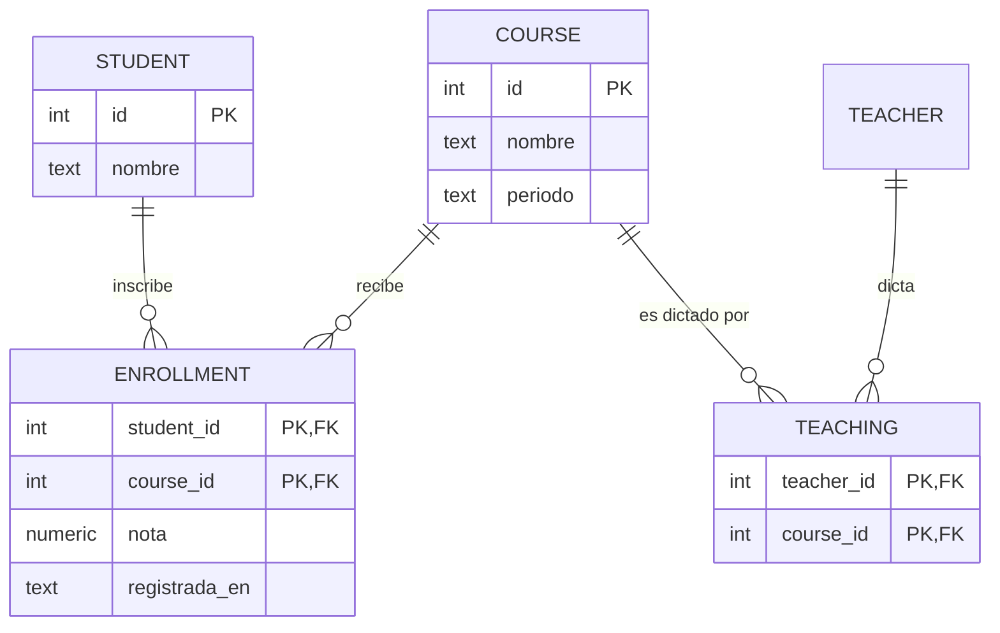

# 006 — Entidad-relación, cardinalidad y participación

> [Programa](../../../README.md) · [Parte 01](../README.md) · [← Anterior](../../part-01-modelado-conceptual-y-requisitos/005-de-requisitos-a-entidades/README.md) · [Siguiente →](../../part-01-modelado-conceptual-y-requisitos/007-claves-identidad-natural-y-sustituta/README.md)

| | |
|---|---|
| **Parte** | 01 — Modelado conceptual y requisitos |
| **Nivel** | Fundamentos |
| **Horas estimadas** | 3 |
| **Motores** | `postgresql`, `sqlite` |
| **Laboratorio** | [`labs/01-sql-foundations`](../../../labs/01-sql-foundations/README.md) |
| **Fuentes** | 3 |

**Conceptos centrales:** `entidad débil` · `cardinalidad` · `participación total` · `atributo de relación`

---

## Propósito

Representar el dominio con el modelo entidad-relación de Chen y, sobre todo, leer un diagrama con precisión: qué dice exactamente una cardinalidad y qué obliga una participación total.

## Resultados de aprendizaje

Al terminar podrás:

1. Distinguir entidad, relación, atributo y entidad débil.
2. Leer y escribir cardinalidades sin ambigüedad (mínimo y máximo, en ambos sentidos).
3. Traducir participación total en una restricción concreta del esquema.
4. Convertir cualquier relación N:M en tablas, sabiendo qué se gana y qué se pierde.
5. Detectar las relaciones ternarias falsas.

## Fundamentos

### El vocabulario de Chen

Chen (1976) propuso el modelo entidad-relación para unificar las vistas de red, jerárquica y relacional. Sus piezas:

- **Entidad:** cosa distinguible del dominio (un estudiante, un curso).
- **Conjunto de entidades:** todas las del mismo tipo. Es lo que suele acabar siendo una tabla.
- **Relación:** asociación entre entidades (un estudiante *inscribe* un curso).
- **Atributo:** propiedad de una entidad o de una relación. La nota es atributo de la **relación** inscripción, no del estudiante ni del curso, y esto se olvida constantemente.
- **Entidad débil:** no tiene identidad propia; se identifica por la entidad fuerte de la que depende (una línea de factura respecto de la factura).

### Cardinalidad: cuatro números, no dos

Una cardinalidad completa declara **cuatro** valores: mínimo y máximo en cada sentido. La notación abreviada «1:N» solo declara dos y por eso genera discusiones.

Para «estudiante inscribe curso»:

| Sentido | Mínimo | Máximo | Lectura |
|---|---:|---:|---|
| estudiante → curso | 0 | N | Un estudiante puede no tener cursos, o tener muchos |
| curso → estudiante | 0 | N | Un curso puede no tener inscritos, o tener muchos |

Cambiar el mínimo de 0 a 1 en el segundo sentido significa «no existen cursos sin inscritos», y eso **no** se puede expresar con una clave foránea: exige una restricción diferida o una comprobación en la aplicación. Esa es la diferencia práctica entre participación parcial y total.

| Concepto | Notación | Cómo se implementa |
|---|---|---|
| Participación parcial (mín. 0) | línea simple | Clave foránea que admite nulo, o simple ausencia de filas |
| Participación total (mín. 1) | línea doble | `NOT NULL` en el lado N, o restricción diferida si el lado 1 la exige |
| Máximo 1 | flecha / `1` | Clave única |
| Máximo N | `N` | Sin restricción de unicidad |

### La regla de traducción



Reglas, en orden:

1. **1:N** → clave foránea en el lado N. No hace falta tabla nueva.
2. **N:M** → tabla puente cuya clave primaria es la pareja de claves foráneas. Los atributos de la relación viven ahí.
3. **1:1** → clave foránea con restricción `UNIQUE` en el lado con participación total.
4. **Entidad débil** → clave primaria compuesta por la clave de la entidad fuerte más un discriminador, con `ON DELETE CASCADE`.

### Relaciones ternarias: casi siempre son falsas

Una relación ternaria genuina es aquella cuya semántica **no** se recupera con tres binarias. El ejemplo clásico: «el proveedor P suministra la pieza Z para el proyecto Y». Saber que P suministra Z, que P trabaja en Y y que Z se usa en Y **no** implica el hecho ternario.

En la mayoría de los modelos de gestión, sin embargo, lo que parece ternario es una entidad que aún no se ha nombrado. «Profesor dicta curso en aula» no es ternario: es la entidad `sesión`, con su horario y su capacidad. Antes de dibujar un rombo con tres patas, busca el sustantivo que falta.

## Ejemplo trabajado

Requisito: *«Un curso lo puede dictar más de un profesor, y un profesor dicta varios cursos. Todo curso debe tener al menos un profesor asignado.»*

**Cardinalidades completas:**

| Sentido | Mín | Máx |
|---|---:|---:|
| curso → profesor | **1** | N |
| profesor → curso | 0 | N |

El mínimo 1 del primer sentido es participación total del lado `course`. Traducción:

```sql
CREATE TABLE teaching (
  course_id  INTEGER NOT NULL REFERENCES courses(id)  ON DELETE CASCADE,
  teacher_id INTEGER NOT NULL REFERENCES teachers(id) ON DELETE RESTRICT,
  PRIMARY KEY (course_id, teacher_id)
);
```

Esto garantiza N:M y evita duplicados. **No** garantiza «todo curso tiene al menos un profesor»: se puede insertar un curso y no insertar nunca su fila en `teaching`.

Las tres formas honestas de cerrar ese hueco, con su costo:

| Mecanismo | Garantía | Costo |
|---|---|---|
| Restricción diferida al final de la transacción | Total, en el motor | Solo en motores que la soportan (PostgreSQL sí; SQLite y MySQL, no de esta forma) |
| Comprobación en la aplicación al crear el curso | Depende del cliente | Cualquier otro cliente la salta |
| Invariante auditada periódicamente | Detecta, no impide | Barata y honesta; deja ventana de inconsistencia |

Consulta de la invariante, útil en cualquier motor:

```sql
SELECT c.id, c.nombre
FROM courses c
LEFT JOIN teaching t ON t.course_id = c.id
WHERE t.course_id IS NULL;
```

Cero filas significa que la participación total se cumple ahora mismo. Es exactamente el tipo de comprobación que el laboratorio ejecuta como invariante.

## Comparación

| Construcción | Tablas resultantes | ¿Puede el motor garantizar el mínimo 1? |
|---|---:|---|
| 1:N con participación parcial | 2 | Sí (`NULL` permitido) |
| 1:N con participación total en N | 2 | Sí (`NOT NULL`) |
| 1:N con participación total en 1 | 2 | Solo con restricción diferida |
| N:M | 3 | No, sin restricción diferida |
| 1:1 | 2 | Sí, con `UNIQUE` + `NOT NULL` en un lado |
| Entidad débil | 2 | Sí (clave compuesta + cascada) |

## Errores frecuentes

1. **Poner los atributos de la relación en una de las entidades.** La nota en `students` obliga a un estudiante a tener una sola nota en toda su vida académica.
2. **Leer «1:N» sin preguntar por los mínimos.** La mitad de la información de la cardinalidad está en el mínimo, y es la mitad que genera reglas de negocio.
3. **Creer que la clave foránea garantiza la participación total.** Garantiza que si hay referencia, existe; no que haya referencia.
4. **Inventar relaciones ternarias.** Busca primero el sustantivo que falta.
5. **Usar `ON DELETE CASCADE` por comodidad.** En una tabla puente es razonable; sobre datos históricos borra evidencia que quizá deba conservarse.

## De la clase a la operación

Las cardinalidades mal declaradas se manifiestan meses después como filas huérfanas, informes que no cuadran y consultas que devuelven duplicados. Una cardinalidad es una promesa: si el motor no puede hacerla cumplir, hay que decir explícitamente quién la vigila.

## Reto de transferencia

Sobre el dominio del repositorio:

1. Dibuja el diagrama con las cuatro cardinalidades completas de cada relación.
2. Identifica una participación total que el esquema actual **no** garantiza.
3. Escribe la consulta de invariante que la audita y ejecútala.
4. Propón el mecanismo que la haría cumplir y declara su costo.

## Preguntas de evaluación

1. Explica con un ejemplo del dominio por qué la nota es atributo de la relación y no de la entidad.
2. Da una relación ternaria genuina de tu experiencia y demuestra que no se descompone en tres binarias.
3. ¿Qué diferencia práctica hay entre `ON DELETE CASCADE` y `ON DELETE RESTRICT` en la tabla `teaching`?
4. Un modelo declara participación total en ambos lados de una relación 1:1. ¿Cómo se inserta la primera fila?

---

## Laboratorio

```bash
python scripts/validate_repository.py
python labs/01-sql-foundations/run_lab.py
```

Guarda como evidencia la salida completa, la versión del motor y la semilla o
los parámetros usados. Una captura sin comando no es evidencia: no se puede
repetir.

## Evaluación

| Criterio | Peso | Qué se comprueba |
|---|---:|---|
| Comprensión conceptual | 25 % | Explica el mecanismo, no solo el resultado |
| Ejecución reproducible | 25 % | Otra persona obtiene lo mismo con las instrucciones dadas |
| Interpretación basada en evidencia | 25 % | Cada conclusión se apoya en una salida o una medición |
| Límites y riesgos declarados | 25 % | Dice qué no demuestra el ejercicio y qué faltaría en producción |

La clase se da por superada cuando la respuesta explica el mecanismo, muestra
la salida que la respalda y declara al menos un límite del ejercicio.

## Fuentes de esta clase

Todo lo afirmado arriba procede de estas obras. Los identificadores viven en
[`catalog/sources.json`](../../../catalog/sources.json) y el estado de los
enlaces se comprueba con `python scripts/check_external_links.py`.

- **Peter Pin-Shan Chen** (1976). [The Entity-Relationship Model - Toward a Unified View of Data](https://dl.acm.org/doi/10.1145/320434.320440). ACM TODS 1(1). DOI [10.1145/320434.320440](https://doi.org/10.1145/320434.320440).  
  Origen del diagrama entidad-relación.
- **Ramez Elmasri, Shamkant B. Navathe** (2015). [Fundamentals of Database Systems](https://www.pearson.com/en-us/subject-catalog/p/fundamentals-of-database-systems/P200000003546). 7.a ed. Pearson. ISBN 978-0-13-397077-7.  
  Modelado entidad-relación tratado con más detalle que en otros manuales.
- **Abraham Silberschatz, Henry F. Korth, S. Sudarshan** (2019). [Database System Concepts](https://db-book.com/). 7.a ed. McGraw-Hill. ISBN 978-0-07-802215-9.  
  Texto de referencia universitario. El sitio oficial publica diapositivas y capítulos de muestra.

---

> [Programa](../../../README.md) · [Parte 01](../README.md) · [← Anterior](../../part-01-modelado-conceptual-y-requisitos/005-de-requisitos-a-entidades/README.md) · [Siguiente →](../../part-01-modelado-conceptual-y-requisitos/007-claves-identidad-natural-y-sustituta/README.md)
