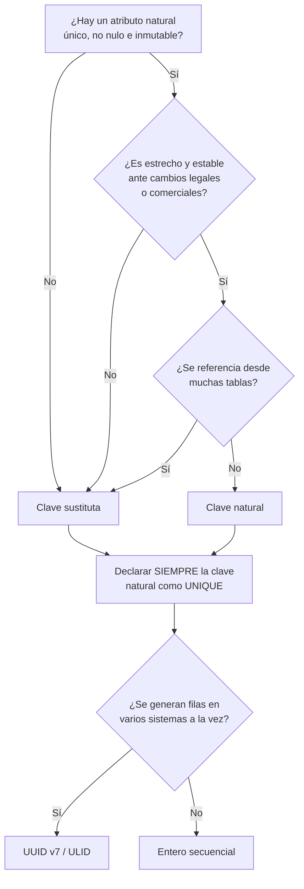

## Propósito

Decidir cómo se identifica una fila. Es la decisión de modelado más difícil de revertir: cambiar una clave primaria a los tres años obliga a tocar todas las tablas que la referencian y todos los sistemas que la almacenaron.

## Resultados de aprendizaje

Al terminar podrás:

1. Distinguir superclave, clave candidata, clave primaria y clave alternativa.
2. Aplicar los tres criterios de una buena clave: unicidad, no nulidad e inmutabilidad.
3. Argumentar a favor y en contra de la clave sustituta con casos concretos.
4. Conservar las claves naturales como restricciones `UNIQUE` aunque no sean primarias.
5. Elegir entre entero secuencial y UUID con un criterio de rendimiento, no de gusto.

## Fundamentos

### Vocabulario preciso

| Término | Definición | Ejemplo en el dominio |
|---|---|---|
| Superclave | Conjunto de atributos que identifica unívocamente | `(id, nombre)` |
| Clave candidata | Superclave mínima: quitarle un atributo destruye la unicidad | `(id)`, `(email)` |
| Clave primaria | La candidata elegida como identificador oficial | `(id)` |
| Clave alternativa | Las candidatas no elegidas | `(email)` con `UNIQUE` |
| Clave sustituta | Valor sin significado de negocio, generado por el sistema | `id` autoincremental |
| Clave natural | Valor con significado de negocio | RUT, ISBN, código de curso |

Date subraya un punto que se pierde: elegir una clave primaria **no** autoriza a olvidar las demás candidatas. Si `email` identifica de forma única, esa restricción debe declararse con `UNIQUE` aunque la primaria sea `id`. Omitirla convierte una regla del dominio en un accidente.

### Los tres criterios

Una clave debe ser:

1. **Única** en todo el conjunto, no «casi siempre distinta».
2. **No nula**, siempre conocida en el momento de insertar.
3. **Inmutable**: si cambia, deja de identificar a la misma cosa.

El tercero es el que descarta casi todas las claves naturales. El correo cambia. El nombre cambia. El RUT se corrige por errores de digitación. El código de producto se reestructura cuando el catálogo crece. Karwin cataloga como antipatrón usar como clave un valor que el negocio puede reasignar.

### El caso a favor de la sustituta

- Inmutable por construcción: nada del negocio la puede cambiar.
- Estrecha: 4 u 8 bytes frente a una cadena; importa mucho porque **la clave primaria se copia en cada clave foránea y en cada índice secundario**.
- Uniforme: todas las tablas se referencian igual, lo que simplifica el código genérico.

### El caso en contra

- Añade una columna sin significado y una reunión más para leer algo comprensible.
- Permite insertar duplicados lógicos si nadie declaró la restricción `UNIQUE` natural. Este es el fallo real: no es culpa de la sustituta, es culpa de omitir la clave natural.
- En tablas puente (`enrollments`) suele sobrar: la pareja de claves foráneas ya es una clave candidata perfecta e inmutable.

### Entero secuencial frente a UUID

| Aspecto | Entero secuencial | UUID v4 | UUID v7 / ULID |
|---|---|---|---|
| Tamaño | 4–8 bytes | 16 bytes | 16 bytes |
| Localidad de inserción en B-Tree | Excelente (siempre al final) | Mala (inserciones dispersas) | Buena (prefijo temporal) |
| Generable en el cliente | No | Sí | Sí |
| Filtra información | Sí: revela volumen y orden | No | Revela el instante |
| Colisión entre sistemas | Segura | Improbable | Improbable |

El punto no obvio es el de la localidad. Un B-Tree con claves crecientes concentra las inserciones en la página más a la derecha, que está en memoria. Con UUID v4, cada inserción cae en una página distinta al azar: con una tabla mayor que el buffer, cada inserción puede convertirse en una lectura de disco más una escritura. Es la razón técnica —no estética— por la que UUID v7 existe.



## Ejemplo trabajado

Modelamos estudiantes con RUT chileno.

**Opción A — RUT como clave primaria:**

```sql
CREATE TABLE students (
  rut    TEXT PRIMARY KEY,
  nombre TEXT NOT NULL
);
CREATE TABLE enrollments (
  student_rut TEXT REFERENCES students(rut),
  course_id   INTEGER,
  nota        NUMERIC(2,1)
);
```

Falla los tres criterios en distinto grado:

- *Unicidad*: se sostiene, salvo por RUT provisionales de estudiantes extranjeros — que existen y se repiten.
- *No nulidad*: falla en la preinscripción, cuando el RUT todavía no se ha entregado.
- *Inmutabilidad*: falla al corregir un dígito verificador mal digitado. Y esa corrección obliga a un `UPDATE` en cascada sobre todas las tablas hijas.

Además, cada fila de `enrollments` almacena una cadena de ~12 bytes en lugar de 4. Con 2 millones de inscripciones: 24 MB frente a 8 MB solo en esa columna, replicado en cada índice que la incluya.

**Opción B — sustituta con natural preservada:**

```sql
CREATE TABLE students (
  id     INTEGER PRIMARY KEY,
  rut    TEXT UNIQUE,                    -- clave candidata, admite nulo transitorio
  nombre TEXT NOT NULL
);
CREATE TABLE enrollments (
  student_id INTEGER NOT NULL REFERENCES students(id),
  course_id  INTEGER NOT NULL REFERENCES courses(id),
  nota       NUMERIC(2,1),
  PRIMARY KEY (student_id, course_id)
);
```

Corregir un RUT es ahora un `UPDATE` de una fila. La regla de negocio «no hay dos estudiantes con el mismo RUT» sigue vigente porque está declarada con `UNIQUE`, no porque sea la primaria.

Obsérvese la decisión en `enrollments`: la clave primaria es **natural compuesta**, no sustituta. Aquí sí lo es, porque `(student_id, course_id)` es única, no nula, inmutable y ya está presente; añadir un `enrollment_id` sería una columna que nadie consulta y un índice más que mantener.

## Comparación

| Escenario | Elección defendible | Motivo |
|---|---|---|
| Entidad de negocio central | Sustituta + natural `UNIQUE` | Las naturales de negocio mutan |
| Tabla puente sin atributos propios | Natural compuesta | Ya es única e inmutable |
| Catálogo estable normalizado (ISO, monedas) | Natural | El código *es* el estándar y no cambia |
| Datos generados en varios nodos | UUID v7 / ULID | Evita coordinación para asignar identificadores |
| Tabla de eventos de alto volumen | Entero secuencial | Localidad de inserción en el índice |

## Errores frecuentes

1. **Poner una sustituta y olvidar el `UNIQUE` natural.** Es la causa número uno de duplicados lógicos en producción.
2. **Exponer la clave sustituta secuencial en URL públicas.** Revela volumen (`/pedido/1043` dice cuántos pedidos hay) y facilita el conteo por terceros.
3. **Usar UUID v4 como clave primaria agrupada en tablas grandes.** Degrada la inserción por pérdida de localidad; v7 resuelve el problema sin renunciar a generar en el cliente.
4. **Claves compuestas de cuatro o cinco columnas.** Se copian enteras en cada índice secundario y en cada clave foránea.
5. **Reutilizar identificadores de filas borradas.** Rompe cualquier referencia externa, informe histórico o registro de auditoría.

## De la clase a la operación

Un cambio de clave primaria en un sistema con integraciones no es una migración: es una negociación con cada consumidor externo que guardó ese identificador. Elegir bien al principio cuesta una tarde; elegir mal cuesta un trimestre.

## Reto de transferencia

1. Localiza en un esquema real una clave primaria que pueda cambiar por decisión de negocio.
2. Documenta qué tablas y qué sistemas externos se verían afectados por ese cambio.
3. Propón la migración a sustituta conservando la natural como `UNIQUE`.
4. Estima el ahorro o el costo en bytes de índice con el volumen real de tus datos.

## Preguntas de evaluación

1. Da una clave natural de tu dominio que cumpla los tres criterios y justifica por qué la elegirías.
2. ¿Por qué el ancho de la clave primaria afecta al tamaño de índices que no la incluyen explícitamente?
3. Explica el problema de localidad de UUID v4 con una traza de inserciones sobre un B-Tree.
4. En `enrollments` se eligió clave natural compuesta. Da un requisito futuro que obligaría a añadir una sustituta.
