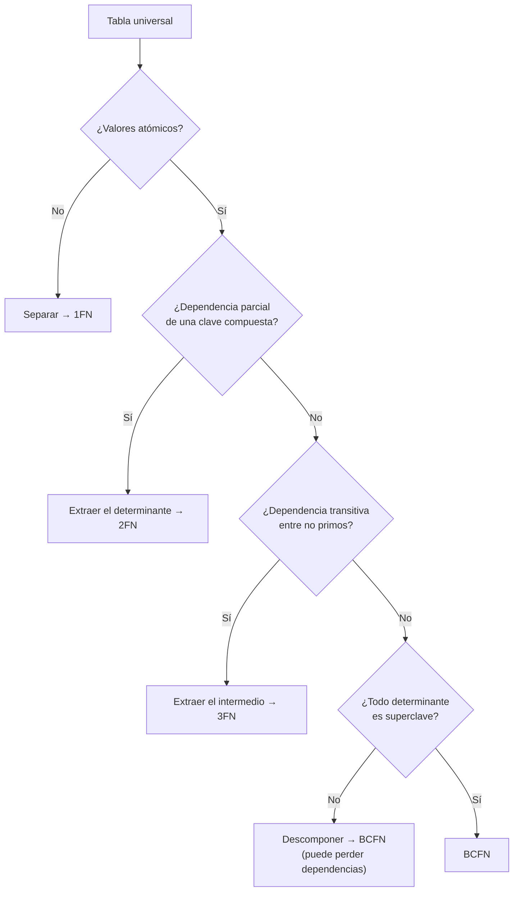

## Propósito

Normalizar con un criterio demostrable, no por costumbre. Las formas normales no son etiquetas de calidad: son teoremas sobre qué anomalías puede o no puede sufrir un esquema.

## Resultados de aprendizaje

Al terminar podrás:

1. Escribir dependencias funcionales a partir de reglas de negocio.
2. Calcular el cierre de un conjunto de atributos y encontrar las claves candidatas.
3. Justificar 1FN, 2FN, 3FN y BCFN señalando la anomalía que cada una elimina.
4. Descomponer sin pérdida y comprobarlo.
5. Explicar por qué BCFN puede no preservar dependencias, y qué hacer entonces.

## Fundamentos

### Dependencia funcional

`X → Y` significa: si dos filas coinciden en `X`, coinciden necesariamente en `Y`. Es una afirmación sobre **todas las instancias posibles**, no sobre los datos de hoy. Que hoy no haya dos estudiantes con el mismo nombre no permite escribir `nombre → id`.

Las dependencias vienen del dominio, no del dato. Por eso se descubren preguntando, no consultando.

### Cierre y claves candidatas

El cierre `X⁺` es el conjunto de atributos determinables desde `X`. Algoritmo:

```text
X⁺ := X
repetir hasta que no cambie:
    para cada dependencia A → B:
        si A ⊆ X⁺ entonces X⁺ := X⁺ ∪ B
```

`X` es superclave si `X⁺` incluye todos los atributos; es clave candidata si además ningún subconjunto propio lo consigue.

### Las formas normales y su anomalía

| Forma | Exige | Anomalía que elimina |
|---|---|---|
| **1FN** | Valores atómicos; sin grupos repetidos | No se puede consultar ni restringir lo que está dentro de un campo compuesto |
| **2FN** | 1FN + ningún atributo no primo depende de **parte** de una clave | Redundancia en claves compuestas |
| **3FN** | 2FN + ningún atributo no primo depende de otro no primo | Dependencia transitiva: actualizar en un sitio y no en otro |
| **BCFN** | Todo determinante es superclave | Redundancia residual con claves candidatas solapadas |

Las tres anomalías clásicas que aparecen si no se normaliza:

- **De inserción:** no se puede registrar un hecho porque falta otro no relacionado.
- **De actualización:** el mismo hecho está en N filas y se actualizan N−1.
- **De eliminación:** borrar una fila destruye un hecho independiente.



### Descomposición sin pérdida

Descomponer `R` en `R1` y `R2` es **sin pérdida** si `R1 ∩ R2` es superclave de al menos una de las dos. Si no, la reunión de las partes produce filas que no existían: se han inventado datos. Garcia-Molina, Ullman y Widom lo demuestran; en la práctica basta con comprobar la condición de la intersección antes de partir una tabla.

## Ejemplo trabajado

Tabla sin normalizar:

```text
inscripcion(student_id, course_id, student_nombre, course_nombre,
            teacher_id, teacher_nombre, nota)
```

**Dependencias del dominio:**

```text
D1  student_id                -> student_nombre
D2  course_id                 -> course_nombre, teacher_id
D3  teacher_id                -> teacher_nombre
D4  student_id, course_id     -> nota
```

**Clave candidata.** Calculamos `(student_id, course_id)⁺`:

```text
inicio        {student_id, course_id}
por D1  +     student_nombre
por D2  +     course_nombre, teacher_id
por D3  +     teacher_nombre
por D4  +     nota
```

El cierre cubre todos los atributos, y ninguna de las dos columnas por separado lo consigue. Clave candidata: `(student_id, course_id)`.

**Diagnóstico:**

- **2FN falla** por D1 y D2: `student_nombre` depende solo de `student_id`, que es *parte* de la clave. Consecuencia medible: con 2 000 estudiantes y 8 inscripciones de media, el nombre de cada estudiante se almacena 8 veces. 16 000 copias para 2 000 hechos.
- **3FN falla** por D3: `teacher_nombre` depende de `teacher_id`, que no es primo. Es transitiva.

**Descomposición:**

```sql
CREATE TABLE teachers (
  id     INTEGER PRIMARY KEY,
  nombre TEXT NOT NULL
);
CREATE TABLE students (
  id     INTEGER PRIMARY KEY,
  nombre TEXT NOT NULL
);
CREATE TABLE courses (
  id         INTEGER PRIMARY KEY,
  nombre     TEXT NOT NULL,
  teacher_id INTEGER NOT NULL REFERENCES teachers(id)
);
CREATE TABLE enrollments (
  student_id INTEGER NOT NULL REFERENCES students(id),
  course_id  INTEGER NOT NULL REFERENCES courses(id),
  nota       NUMERIC(2,1),
  PRIMARY KEY (student_id, course_id)
);
```

**Comprobación de no pérdida.** `enrollments ∩ students = {student_id}`, que es clave de `students`. Se cumple. Igual para `courses` y `teachers`.

**Las tres anomalías, ya resueltas:**

| Anomalía | Antes | Después |
|---|---|---|
| Inserción | No se puede registrar un curso nuevo sin un estudiante inscrito | `INSERT INTO courses` basta |
| Actualización | Corregir el nombre de un profesor toca N filas | Toca 1 |
| Eliminación | Borrar la última inscripción borra el curso | El curso persiste |

**El caso BCFN.** Añadamos la regla «cada curso lo dicta un solo profesor, y cada profesor dicta un solo curso por período». Aparecen dos claves candidatas solapadas y una dependencia `teacher_id, periodo → course_id` cuyo determinante no es superclave de la tabla resultante. Descomponer para llegar a BCFN elimina la redundancia, pero la dependencia queda repartida entre dos tablas y ya no puede comprobarse sin reunirlas.

Ese es el compromiso real: **BCFN no siempre preserva dependencias; 3FN siempre se puede alcanzar preservándolas**. Cuando entran en conflicto, la decisión defendible suele ser quedarse en 3FN y auditar la dependencia con una invariante, en vez de perder la capacidad del motor de hacerla cumplir.

## Comparación

| Nivel | Redundancia | Dependencias preservadas | Costo de consulta |
|---|---|---|---|
| Sin normalizar | Alta | — | Bajo (sin reuniones) |
| 3FN | Baja | Siempre alcanzable | Medio |
| BCFN | Mínima | No siempre | Medio-alto |
| Desnormalizado a propósito (clase 009) | Controlada y documentada | Vigiladas por invariantes | Bajo en lectura, alto en escritura |

## Errores frecuentes

1. **Deducir dependencias de los datos actuales.** Los datos muestran lo que ha ocurrido; la dependencia afirma lo que puede ocurrir.
2. **Normalizar hasta BCFN por reflejo.** Si perder la dependencia obliga a comprobarla en la aplicación, puede ser peor remedio que enfermedad.
3. **Descomponer sin comprobar la no pérdida.** Reunir dos partes mal elegidas fabrica filas que nunca existieron.
4. **Creer que 1FN prohíbe los tipos compuestos.** Prohíbe los grupos repetidos y los valores no atómicos *para el dominio*; un `jsonb` opaco que nunca se consulta por dentro es discutible, pero uno que se filtra por sus claves internas viola el espíritu de 1FN.
5. **Confundir normalización con rendimiento.** La normalización decide qué anomalías son posibles; el rendimiento se decide con índices y planes (parte 08).

## De la clase a la operación

Los datos sucios que aparecen en los informes casi siempre son anomalías de actualización que nadie previno. Un esquema en 3FN convierte esos errores en imposibles por construcción, y eso vale más que cualquier proceso de limpieza posterior.

## Reto de transferencia

1. Toma una tabla ancha real de tu trabajo y escribe sus dependencias funcionales.
2. Calcula el cierre y determina las claves candidatas.
3. Diagnostica en qué forma normal está, nombrando la dependencia que la rompe.
4. Descompón, comprueba la no pérdida y cuantifica cuántas copias redundantes eliminaste.

## Preguntas de evaluación

1. Da una dependencia funcional cierta en tu dominio que hoy los datos no reflejarían.
2. Demuestra con un ejemplo pequeño que una descomposición con intersección no clave inventa filas.
3. ¿Qué anomalía concreta elimina 3FN que 2FN no elimina?
4. Presenta un caso donde te quedarías en 3FN pudiendo llegar a BCFN, y di quién vigila entonces la dependencia perdida.
