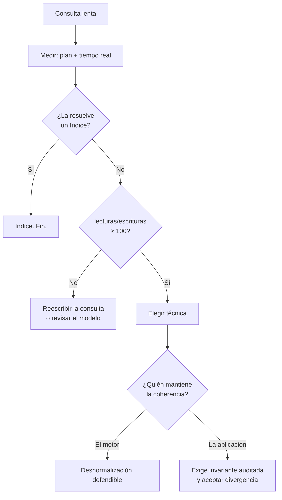

# 009 — Desnormalización deliberada y patrones de acceso

> [Programa](../../../README.md) · [Parte 01](../README.md) · [← Anterior](../../part-01-modelado-conceptual-y-requisitos/008-normalizacion-y-dependencias-funcionales/README.md) · [Siguiente →](../../part-02-modelo-relacional-y-algebra/010-la-relacion-como-conjunto/README.md)

| | |
|---|---|
| **Parte** | 01 — Modelado conceptual y requisitos |
| **Nivel** | Intermedio |
| **Horas estimadas** | 3 |
| **Motores** | `postgresql`, `mongodb` |
| **Laboratorio** | [`labs/02-polyglot-modeling`](../../../labs/02-polyglot-modeling/README.md) |
| **Fuentes** | 3 |

**Conceptos centrales:** `redundancia controlada` · `costo de escritura` · `agregado` · `patrón de lectura`

---

## Propósito

Introducir redundancia a propósito, con evidencia de que hacía falta y con un mecanismo declarado que la mantenga coherente. Desnormalizar sin ambas cosas no es una optimización: es una anomalía planificada.

## Resultados de aprendizaje

Al terminar podrás:

1. Medir el costo que la desnormalización pretende evitar, antes de aplicarla.
2. Elegir entre las cuatro técnicas habituales según el patrón de acceso.
3. Declarar quién mantiene la coherencia y con qué garantía.
4. Escribir la invariante que detecta la divergencia.
5. Reconocer cuándo el problema real es un índice ausente y no el modelo.

## Fundamentos

### La pregunta previa

Antes de desnormalizar hay que responder tres cosas con números:

1. ¿Cuál es la consulta cara? (con su plan y su tiempo real)
2. ¿Con qué frecuencia se ejecuta frente a las escrituras que la alimentan?
3. ¿Un índice, una vista materializada o una reescritura la resuelven?

Sadalage y Fowler formulan el criterio: la unidad de diseño es el **agregado**, y el agregado se define por cómo se lee, no por cómo se escribe. Kleppmann añade la contrapartida: cada dato duplicado es un dato que puede divergir, y la probabilidad de divergencia no es cero, es «cuándo».

La relación lecturas/escrituras es el número que decide. Con 10 000 lecturas por cada escritura, duplicar un dato sale barato. Con 2 lecturas por escritura, casi nunca compensa.

### Las cuatro técnicas

| Técnica | En qué consiste | Cuándo | Riesgo |
|---|---|---|---|
| **Columna derivada** | Guardar un cálculo (`total`, `promedio`, `n_inscritos`) | El cálculo recorre muchas filas y se lee mucho | Divergencia silenciosa |
| **Columna replicada** | Copiar un atributo de la tabla padre (`course_nombre` en `enrollments`) | Evitar una reunión en un camino crítico | Actualizaciones en cascada |
| **Agregado precalculado** | Tabla o vista materializada de resumen | Informes repetidos sobre ventanas fijas | Frescura: ¿de cuándo son los datos? |
| **Agregado documental** | Guardar el objeto completo como documento | Se lee y escribe siempre entero | Duplicación entre agregados |

### Quién mantiene la coherencia

Esta es la pregunta que distingue el diseño del deseo. Cuatro respuestas posibles, ordenadas de más a menos garantía:

| Mecanismo | Garantía | Costo |
|---|---|---|
| Restricción del motor (`GENERATED ALWAYS AS`) | Total y automática | Solo sirve para cálculos sobre la misma fila |
| Disparador en la misma transacción | Total mientras la transacción sea atómica | Coste de escritura; lógica escondida en el motor |
| Vista materializada con refresco | Consistente en el instante del refresco | Datos con retraso conocido |
| Proceso asíncrono o código de aplicación | Ninguna garantía dura | El más barato y el que más diverge |

Si la respuesta es «lo actualiza la aplicación», la coherencia depende de que **todos** los caminos de escritura, presentes y futuros, la respeten. El script de migración de la próxima persona no lo hará.



## Ejemplo trabajado

Consulta que aparece en cada carga del panel de un curso:

```sql
SELECT c.id, c.nombre, COUNT(e.student_id) AS inscritos, AVG(e.nota) AS promedio
FROM courses c
LEFT JOIN enrollments e ON e.course_id = c.id
GROUP BY c.id, c.nombre;
```

**Medición primero.** Con 300 cursos y 240 000 inscripciones, el plan hace un barrido de `enrollments` y una agregación por hash: ~240 000 filas procesadas por ejecución. Si el panel se abre 5 000 veces al día y se inscribe gente 400 veces al día, la relación es **12,5 lecturas por escritura**. Ese número no justifica desnormalizar todavía: un índice sobre `enrollments(course_id, nota)` permite una agregación por índice y reduce el trabajo sin duplicar nada.

**Cuando sí.** Cambiemos la escala: 5 millones de inscripciones y el panel en la portada, 200 000 aperturas diarias frente a 400 inscripciones. Relación: **500 a 1**. Ahora sí.

**Opción A — columna derivada mantenida por el motor:**

```sql
ALTER TABLE courses ADD COLUMN inscritos INTEGER NOT NULL DEFAULT 0;
ALTER TABLE courses ADD COLUMN suma_notas NUMERIC(10,1) NOT NULL DEFAULT 0;

CREATE FUNCTION actualizar_agregado() RETURNS TRIGGER AS $$
BEGIN
  UPDATE courses
     SET inscritos  = inscritos  + CASE TG_OP WHEN 'INSERT' THEN 1 WHEN 'DELETE' THEN -1 ELSE 0 END,
         suma_notas = suma_notas + COALESCE(NEW.nota, 0) - COALESCE(OLD.nota, 0)
   WHERE id = COALESCE(NEW.course_id, OLD.course_id);
  RETURN NULL;
END; $$ LANGUAGE plpgsql;
```

El promedio se calcula como `suma_notas / NULLIF(inscritos, 0)`: se guardan los dos sumandos, no el promedio, porque un promedio no es incrementalmente actualizable sin el conteo.

**Coste real de la decisión:** cada inscripción pasa de una escritura a dos, y todas las inscripciones de un mismo curso se serializan sobre la fila del contador. Con 400 escrituras diarias es irrelevante; con 400 por segundo sobre el mismo curso, ese contador es un punto caliente y habría que repartirlo en varias filas y sumarlas al leer.

**La invariante, obligatoria:**

```sql
SELECT c.id, c.inscritos AS declarado, COUNT(e.student_id) AS real
FROM courses c
LEFT JOIN enrollments e ON e.course_id = c.id
GROUP BY c.id, c.inscritos
HAVING c.inscritos <> COUNT(e.student_id);
```

Cero filas: coherente. Se ejecuta a diario y se alerta si devuelve algo. Sin esta consulta, la desnormalización es una apuesta.

**Opción B — vista materializada:**

```sql
CREATE MATERIALIZED VIEW curso_resumen AS
SELECT c.id, c.nombre, COUNT(e.student_id) AS inscritos, AVG(e.nota) AS promedio
FROM courses c LEFT JOIN enrollments e ON e.course_id = c.id
GROUP BY c.id, c.nombre;
```

No hay riesgo de divergencia lógica: se recalcula entera. El costo se paga en **frescura** (los datos son del último refresco) y en el propio refresco. Si el panel tolera 5 minutos de retraso, esta opción es netamente superior a la A: menos código, menos puntos calientes y ninguna invariante que auditar.

## Comparación

| Opción | Frescura | Coste de escritura | Riesgo de divergencia | Complejidad |
|---|---|---|---|---|
| Consulta directa + índice | Inmediata | Ninguno | Ninguno | Mínima |
| Columna derivada con disparador | Inmediata | Alto, con contención | Real, exige invariante | Alta |
| Vista materializada | Retrasada | Nulo en línea | Ninguno | Baja |
| Agregado documental | Inmediata en su agregado | Medio | Entre agregados | Media |

## Errores frecuentes

1. **Desnormalizar sin medir.** La mayoría de las consultas «lentas» lo son por un índice ausente, y el índice no duplica datos.
2. **Guardar el promedio en vez de suma y conteo.** El promedio no es incrementalmente actualizable.
3. **No escribir la invariante.** La divergencia se descubre cuando un usuario reclama, es decir, tarde.
4. **Poner la coherencia en la aplicación y llamarla garantía.** Solo cubre los caminos de escritura que ya existen.
5. **Ignorar el punto caliente.** Un contador por entidad serializa todas las escrituras de esa entidad.

## De la clase a la operación

Toda desnormalización envejece: llega el día en que un proceso masivo escribe saltándose el disparador, o el refresco falla en silencio. Por eso la invariante y su alerta son parte de la entrega, no un extra.

## Reto de transferencia

1. Localiza una consulta cara real, mide su plan y su tiempo.
2. Calcula su relación lecturas/escrituras con datos de tráfico reales.
3. Aplica primero la opción sin duplicación (índice o reescritura) y vuelve a medir.
4. Si sigue sin bastar, elige técnica, declara el mecanismo de coherencia y entrega la invariante que la audita.

## Preguntas de evaluación

1. ¿Qué relación lecturas/escrituras usarías como umbral en tu contexto y por qué?
2. Explica por qué la vista materializada no puede divergir lógicamente y la columna derivada sí.
3. Describe un punto caliente que crearía una columna derivada en tu dominio y cómo lo repartirías.
4. Un proceso de carga masiva escribe con `COPY` y salta los disparadores. ¿Cómo lo detectas y cómo lo reparas?

---

## Laboratorio

```bash
python scripts/validate_repository.py
python labs/02-polyglot-modeling/run_lab.py
```

Guarda como evidencia la salida completa, la versión del motor y la semilla o
los parámetros usados. Una captura sin comando no es evidencia: no se puede
repetir.

## Evaluación

| Criterio | Peso | Qué se comprueba |
|---|---:|---|
| Comprensión conceptual | 25 % | Explica el mecanismo, no solo el resultado |
| Ejecución reproducible | 25 % | Otra persona obtiene lo mismo con las instrucciones dadas |
| Interpretación basada en evidencia | 25 % | Cada conclusión se apoya en una salida o una medición |
| Límites y riesgos declarados | 25 % | Dice qué no demuestra el ejercicio y qué faltaría en producción |

La clase se da por superada cuando la respuesta explica el mecanismo, muestra
la salida que la respalda y declara al menos un límite del ejercicio.

## Fuentes de esta clase

Todo lo afirmado arriba procede de estas obras. Los identificadores viven en
[`catalog/sources.json`](../../../catalog/sources.json) y el estado de los
enlaces se comprueba con `python scripts/check_external_links.py`.

- **Pramod J. Sadalage, Martin Fowler** (2012). [NoSQL Distilled: A Brief Guide to the Emerging World of Polyglot Persistence](https://martinfowler.com/books/nosql.html). Addison-Wesley. ISBN 978-0-321-82662-6.  
  Origen del término agregado y de la persistencia políglota que estructura este programa.
- **Martin Kleppmann** (2017). [Designing Data-Intensive Applications](https://dataintensive.net/). O'Reilly. ISBN 978-1-4493-7332-0.  
  Referencia central del programa para replicación, partición, transacciones distribuidas y streaming.
- **Bill Karwin** (2010). [SQL Antipatterns: Avoiding the Pitfalls of Database Programming](https://pragprog.com/titles/bksqla/sql-antipatterns/). Pragmatic Bookshelf. ISBN 978-1-934356-55-5.  
  Catálogo de errores de modelado con su corrección y cuando el antipatron es aceptable.

---

> [Programa](../../../README.md) · [Parte 01](../README.md) · [← Anterior](../../part-01-modelado-conceptual-y-requisitos/008-normalizacion-y-dependencias-funcionales/README.md) · [Siguiente →](../../part-02-modelo-relacional-y-algebra/010-la-relacion-como-conjunto/README.md)
