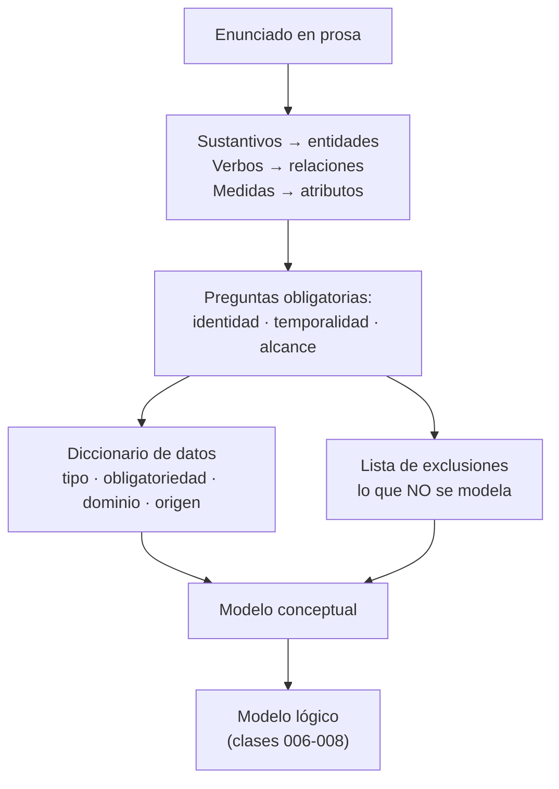

# 015 — De requisitos ambiguos a entidades defendibles

> [Programa](../../../README.md) · [Parte 02](../README.md) · [← Anterior](../../part-01-fundamentos-datos-sistemas-y-metodo/014-entorno-reproducible-y-evidencia/README.md) · [Siguiente →](../../part-02-modelado-conceptual-y-requisitos/016-entidad-relacion-cardinalidad-y-participacion/README.md)

Parte 02 — Modelado conceptual y requisitos · Fundamentos ·
3 horas estimadas · motores `sqlite` · laboratorio
[`labs/01-sql-foundations`](../../../labs/01-sql-foundations/README.md) · 3 fuentes.

**Conceptos centrales:** `regla de negocio` · `diccionario de datos` · `alcance` · `patrón de acceso`

**En este caso se comparan 7 motores**: 5 lo resuelven (5 con el resultado comprobado por máquina) y 2 no, con el motivo escrito.

---

## Propósito

Convertir un enunciado en prosa —ambiguo, incompleto y contradictorio, como todos— en una lista de entidades, atributos y reglas que se pueda defender frente a quien encargó el sistema.

## Resultados de aprendizaje

Al terminar podrás:

1. Extraer entidades candidatas de un texto con un procedimiento repetible.
2. Separar hechos del dominio de decisiones de implementación.
3. Escribir un diccionario de datos con tipo, obligatoriedad, dominio y origen.
4. Detectar las tres ambigüedades que más caro salen: identidad, temporalidad y alcance.
5. Justificar qué queda **fuera** del modelo y por qué.

## Fundamentos

### El método, no la inspiración

Hernández propone un procedimiento que funciona porque es aburrido y se puede auditar. Adaptado a este programa:

1. **Recoger el enunciado literal**, sin reescribirlo todavía.
2. **Subrayar sustantivos** → entidades candidatas. **Subrayar verbos** → relaciones candidatas. **Subrayar adjetivos y medidas** → atributos candidatos.
3. **Descartar sinónimos** («alumno», «estudiante», «matriculado» suelen ser lo mismo; a veces no, y eso hay que preguntarlo).
4. **Preguntar por la identidad** de cada entidad: ¿qué hace que dos ejemplares sean el mismo?
5. **Preguntar por la temporalidad**: ¿el valor cambia? ¿hace falta el histórico?
6. **Escribir el diccionario de datos** con el origen de cada regla.
7. **Escribir la lista de exclusiones**: lo que el sistema no modelará.

El paso 7 es el que casi nadie hace y el que evita la mitad de los conflictos. Kent lo argumenta en *Data and Reality*: no existe un modelo «correcto» del mundo, solo un recorte útil para un propósito. Si el recorte no está escrito, cada persona supondrá uno distinto.

### Las tres ambigüedades caras

| Ambigüedad | Pregunta que la resuelve | Qué pasa si no se pregunta |
|---|---|---|
| **Identidad** | ¿Dos filas con los mismos datos son la misma cosa? | Duplicados imposibles de limpiar después |
| **Temporalidad** | ¿Necesitamos saber cómo era antes? | Se sobrescribe el pasado y no hay vuelta atrás |
| **Alcance** | ¿Esto lo gestiona nuestro sistema o solo lo referencia? | Se modela medio mundo y no se termina nunca |

### Hechos frente a decisiones

Elmasri y Navathe separan el **modelo conceptual** (qué existe en el dominio) del **modelo lógico** (cómo se representa en un modelo de datos concreto). Mezclarlos es el error de principiante más costoso, porque congela decisiones antes de entender el problema.

| Es un hecho del dominio | Es una decisión de implementación |
|---|---|
| «Un estudiante puede inscribir varios cursos» | «Usaremos una tabla puente» |
| «El correo identifica a la persona en el sistema» | «El correo será la clave primaria» |
| «La nota va de 1,0 a 7,0» | «Será `NUMERIC(2,1)` con un `CHECK`» |
| «Necesitamos saber quién cambió una nota» | «Habrá una tabla de auditoría con disparadores» |

La columna izquierda se negocia con el cliente. La derecha se negocia con el equipo, y puede cambiar sin volver a reunirse con nadie.



## Ejemplo trabajado

Enunciado recibido:

> «Necesitamos registrar los cursos que dicta cada profesor y las notas de los estudiantes. Un curso lo puede dictar más de un profesor. Queremos saber el promedio del curso.»

**Paso 2.** Sustantivos: *curso, profesor, estudiante, nota, promedio*. Verbos: *dictar, registrar*.

**Paso 3.** `promedio` no es una entidad ni un atributo almacenado: es un **cálculo** sobre notas. Guardarlo introduce redundancia que hay que mantener (clase 009 discute cuándo sí conviene).

**Paso 4 — identidad.** ¿Dos profesores con el mismo nombre son la misma persona? No. Hace falta un identificador. ¿Y dos cursos llamados «Bases de datos»? Tampoco: se distinguen por período. El enunciado no lo dice, así que **es una pregunta al cliente**, no una suposición.

**Paso 5 — temporalidad.** «Las notas de los estudiantes»: ¿se corrigen? Si una nota se puede rectificar y alguien puede reclamar, hace falta histórico. El enunciado calla. Segunda pregunta al cliente.

**Paso 6 — diccionario de datos:**

| Entidad | Atributo | Tipo | Obligatorio | Dominio | Origen de la regla |
|---|---|---|---|---|---|
| student | id | entero | sí | > 0 | decisión de diseño |
| student | nombre | texto | sí | ≤ 120 caracteres | enunciado |
| course | id | entero | sí | > 0 | decisión de diseño |
| course | nombre | texto | sí | ≤ 120 caracteres | enunciado |
| course | periodo | texto | sí | `AAAA-S` | **pregunta pendiente** |
| enrollment | nota | decimal(2,1) | no | 1,0 – 7,0 | escala chilena, confirmar |
| enrollment | registrada_en | marca de tiempo | sí | pasado | necesaria para auditoría |

**Paso 7 — exclusiones declaradas:**

- No se modela la asistencia.
- No se modela el pago de aranceles.
- Los profesores se referencian, pero la nómina la gestiona otro sistema.
- No se guarda el promedio: se calcula.

Resultado: cuatro entidades (`student`, `course`, `teacher`, `enrollment`), dos preguntas abiertas explícitas y una lista de exclusiones. Nada de esto exige haber elegido todavía un motor.

## Comparación

| Enfoque de partida | Ventaja | Riesgo dominante |
|---|---|---|
| Desde el enunciado (este método) | Trazabilidad a la regla de negocio | Lento si el enunciado es pobre |
| Desde las pantallas de la aplicación | Rápido, muy concreto | Modela la interfaz, no el dominio; cambia con el diseño |
| Desde un esquema heredado | Conserva compatibilidad | Hereda los errores y los normaliza como verdad |
| Desde un modelo de referencia del sector | Vocabulario común | Trae entidades que nadie necesita |

## Errores frecuentes

1. **Modelar la pantalla.** Si la entidad se llama `FormularioInscripcion`, el modelo caducará con el próximo rediseño de la interfaz.
2. **Guardar valores calculados sin decidirlo.** El promedio almacenado se desincroniza en cuanto alguien corrige una nota por fuera.
3. **Resolver las ambigüedades por cuenta propia.** Suponer que los cursos no se repiten entre períodos es una decisión de negocio disfrazada de detalle técnico.
4. **Confundir el nombre con la identidad.** «Nombre único» casi nunca es cierto y siempre se descubre en producción.
5. **No escribir las exclusiones.** Sin ellas, el alcance crece en cada reunión y nadie puede señalar cuándo cambió.

## De la clase a la operación

Los cambios de esquema más caros no vienen de requisitos nuevos: vienen de ambigüedades no resueltas al principio. Añadir histórico a una tabla que lleva tres años sobrescribiendo significa que ese pasado ya no existe: ninguna migración lo recupera.

## Reto de transferencia

Toma un requisito real de un proyecto tuyo y produce:

1. La lista de entidades, relaciones y atributos candidatos, con el subrayado que la originó.
2. Las tres preguntas de identidad, temporalidad y alcance, formuladas para hacérselas a una persona no técnica.
3. El diccionario de datos con la columna «origen de la regla» completa.
4. La lista de exclusiones, con una frase de justificación por cada una.

## Preguntas de evaluación

1. Da un atributo de tu dominio que parezca un hecho y sea en realidad una decisión de implementación.
2. ¿Qué pierdes exactamente si no preguntas por la temporalidad de un atributo que sí cambia?
3. Un cliente afirma que el correo identifica a la persona. Da dos casos reales que rompan esa afirmación.
4. ¿Por qué la lista de exclusiones es parte del modelo y no del acta de la reunión?

---

## 🌐 El mismo problema en cada motor

**Caso:** «Un cliente tiene una dirección»: convertir una frase ambigua en una regla que el sistema comprueba

El requisito llegó escrito así: «un cliente tiene una dirección». La frase
admite tres modelos distintos —exactamente una, como mucho una, o varias con
una principal— y solo el tercero sobrevive al primer cliente que se muda sin
perder el historial.

El caso implementa el tercero: un cliente puede tener varias direcciones,
**como mucho una marcada como principal**, y esa regla la impone el sistema,
no el formulario. Ada tiene dos direcciones (una principal), Linus una
principal y Grace ninguna. La consulta devuelve, por cliente ordenado
alfabéticamente, cuántas direcciones principales tiene: solo puede salir 0 o
1, y que salga 2 sería la prueba de que la regla no existe.

Salida esperada, idéntica en todos los motores que lo resuelven:

| cliente | principales |
|---|---|
| `Ada` | `1` |
| `Grace` | `0` |
| `Linus` | `1` |

El contrato vive en [`motores.yaml`](motores.yaml) y lo comprueba
`python scripts/verificar_equivalencia.py --clase 015`: 5 de
las 5 implementaciones se ejecutan de verdad y su
resultado se compara con esa tabla; el resto se declara como material revisado,
no ejecutado.

| Motor | ¿Resuelve el caso? | Nivel de prueba | Código | Fuente |
|---|---|---|---|---|
| SQLite | sí | núcleo | [código](implementaciones/sqlite/consulta.sql) | [doc oficial](https://sqlite.org/partialindex.html) |
| PostgreSQL | sí | servicio | [código](implementaciones/postgresql/consulta.sql) | [doc oficial](https://www.postgresql.org/docs/current/indexes-partial.html) |
| MySQL | sí | servicio | [código](implementaciones/mysql/consulta.sql) | [doc oficial](https://dev.mysql.com/doc/refman/8.4/en/create-table-generated-columns.html) |
| MongoDB | sí | servicio | [código](implementaciones/mongodb/consulta.js) | [doc oficial](https://www.mongodb.com/docs/manual/core/index-partial/) |
| DuckDB | sí | núcleo | [código](implementaciones/duckdb/consulta.sql) | [doc oficial](https://duckdb.org/docs/stable/sql/indexes.html) |
| Apache Cassandra | **no** | — | — | [doc oficial](https://cassandra.apache.org/doc/latest/cassandra/developing/cql/ddl.html) |
| Redis | **no** | — | — | [doc oficial](https://redis.io/docs/latest/develop/data-types/hashes/) |

### Los que resuelven el caso

#### SQLite · [`implementaciones/sqlite/consulta.sql`](implementaciones/sqlite/consulta.sql)

✅ **verificado** — se ejecuta en CI sin servicios

```sql
-- motor: sqlite
-- doc: https://sqlite.org/partialindex.html
-- nota: el indice unico parcial es la traduccion exacta de «como mucho una
--       principal por cliente». Sin el WHERE, la regla seria «como mucho una
--       direccion por cliente», que es otro requisito.

-- === preparacion ===
CREATE TABLE clientes (
    id     INTEGER PRIMARY KEY,
    nombre TEXT NOT NULL
);
CREATE TABLE direcciones (
    id         INTEGER PRIMARY KEY,
    cliente_id INTEGER NOT NULL REFERENCES clientes(id),
    ciudad     TEXT NOT NULL,
    principal  INTEGER NOT NULL DEFAULT 0 CHECK (principal IN (0, 1))
);
CREATE UNIQUE INDEX una_principal_por_cliente
    ON direcciones (cliente_id) WHERE principal = 1;

INSERT INTO clientes (id, nombre) VALUES (1, 'Ada'), (2, 'Linus'), (3, 'Grace');
INSERT INTO direcciones (cliente_id, ciudad, principal) VALUES
    (1, 'Santiago',   1),
    (1, 'Valdivia',   0),   -- se mudo: la anterior se conserva
    (2, 'Valparaiso', 1);
-- Este intento viola la regla y el motor lo rechaza; sin el indice, pasaria.
INSERT OR IGNORE INTO direcciones (cliente_id, ciudad, principal) VALUES (1, 'Arica', 1);

-- === consulta ===
SELECT c.nombre AS cliente,
       COUNT(d.id) AS principales
FROM clientes c
LEFT JOIN direcciones d ON d.cliente_id = c.id AND d.principal = 1
GROUP BY c.id, c.nombre
ORDER BY c.nombre;
```

- **Por qué sí:** Tiene índices únicos parciales (`CREATE UNIQUE INDEX ... WHERE`), que es exactamente la herramienta para «como mucho una principal por cliente»: la unicidad se aplica solo a las filas que cumplen la condición.
- **Por qué no:** No comprueba tipos: nada impide guardar `'sí'` en la columna que marca la dirección principal, así que la regla protege la cardinalidad pero no el dominio del valor.
- 📄 Documentación oficial: <https://sqlite.org/partialindex.html>

#### PostgreSQL · [`implementaciones/postgresql/consulta.sql`](implementaciones/postgresql/consulta.sql)

✅ **verificado** — se ejecuta contra el motor real levantado con `docker compose`

```sql
-- motor: postgresql
-- doc: https://www.postgresql.org/docs/current/indexes-partial.html
-- nota: la documentacion oficial presenta el indice unico parcial como la
--       forma canonica de «como mucho uno que cumpla la condicion».

-- === preparacion ===
DROP TABLE IF EXISTS direcciones, clientes;

CREATE TABLE clientes (
    id     integer PRIMARY KEY,
    nombre text NOT NULL
);
CREATE TABLE direcciones (
    id         serial PRIMARY KEY,
    cliente_id integer NOT NULL REFERENCES clientes(id),
    ciudad     text NOT NULL,
    principal  boolean NOT NULL DEFAULT false
);
CREATE UNIQUE INDEX una_principal_por_cliente
    ON direcciones (cliente_id) WHERE principal;

INSERT INTO clientes (id, nombre) VALUES (1, 'Ada'), (2, 'Linus'), (3, 'Grace');
INSERT INTO direcciones (cliente_id, ciudad, principal) VALUES
    (1, 'Santiago',   true),
    (1, 'Valdivia',   false),
    (2, 'Valparaiso', true);
INSERT INTO direcciones (cliente_id, ciudad, principal) VALUES (1, 'Arica', true)
    ON CONFLICT DO NOTHING;

-- === consulta ===
SELECT c.nombre AS cliente,
       COUNT(d.id) AS principales
FROM clientes c
LEFT JOIN direcciones d ON d.cliente_id = c.id AND d.principal
GROUP BY c.id, c.nombre
ORDER BY c.nombre;
```

- **Por qué sí:** Es donde el índice único parcial es idiomático y está documentado como la forma canónica de expresar «como mucho uno»; además ofrece `EXCLUDE` para reglas de solapamiento que ningún índice único cubre.
- **Por qué no:** La regla se vuelve invisible en el diagrama de entidades: quien lea solo las tablas verá una columna booleana y no sabrá que hay una restricción detrás, salvo que lea los índices.
- 📄 Documentación oficial: <https://www.postgresql.org/docs/current/indexes-partial.html>

#### MySQL · [`implementaciones/mysql/consulta.sql`](implementaciones/mysql/consulta.sql)

✅ **verificado** — se ejecuta contra el motor real levantado con `docker compose`

```sql
-- motor: mysql
-- doc: https://dev.mysql.com/doc/refman/8.4/en/create-table-generated-columns.html
-- nota: sin indices parciales, el rodeo estandar es una columna generada que
--       vale el id del cliente solo cuando la direccion es principal y NULL en
--       el resto. Como los NULL no colisionan en un indice unico, la regla
--       queda igual de firme.

-- === preparacion ===
DROP TABLE IF EXISTS direcciones;
DROP TABLE IF EXISTS clientes;

CREATE TABLE clientes (
    id     INT PRIMARY KEY,
    nombre VARCHAR(50) NOT NULL
) ENGINE=InnoDB;

CREATE TABLE direcciones (
    id         INT AUTO_INCREMENT PRIMARY KEY,
    cliente_id INT NOT NULL,
    ciudad     VARCHAR(50) NOT NULL,
    principal  TINYINT(1) NOT NULL DEFAULT 0,
    cliente_principal INT AS (IF(principal = 1, cliente_id, NULL)) STORED,
    UNIQUE KEY una_principal_por_cliente (cliente_principal),
    FOREIGN KEY (cliente_id) REFERENCES clientes(id)
) ENGINE=InnoDB;

INSERT INTO clientes (id, nombre) VALUES (1, 'Ada'), (2, 'Linus'), (3, 'Grace');
INSERT INTO direcciones (cliente_id, ciudad, principal) VALUES
    (1, 'Santiago',   1),
    (1, 'Valdivia',   0),
    (2, 'Valparaiso', 1);
INSERT IGNORE INTO direcciones (cliente_id, ciudad, principal) VALUES (1, 'Arica', 1);

-- === consulta ===
SELECT c.nombre AS cliente,
       COUNT(d.id) AS principales
FROM clientes c
LEFT JOIN direcciones d ON d.cliente_id = c.id AND d.principal = 1
GROUP BY c.id, c.nombre
ORDER BY c.nombre;
```

- **Por qué sí:** Aunque no tiene índices parciales, la misma regla se consigue con una columna generada que vale el identificador del cliente cuando la dirección es principal y `NULL` en el resto: como los nulos no colisionan en un índice único, la restricción queda igual de firme.
- **Por qué no:** El rodeo hay que explicarlo en cada revisión de código: la columna generada existe solo para sostener la regla y nadie la consulta jamás.
- 📄 Documentación oficial: <https://dev.mysql.com/doc/refman/8.4/en/create-table-generated-columns.html>

#### MongoDB · [`implementaciones/mongodb/consulta.js`](implementaciones/mongodb/consulta.js)

✅ **verificado** — se ejecuta contra el motor real levantado con `docker compose`

```javascript
// motor: mongodb
// doc: https://www.mongodb.com/docs/manual/core/index-partial/
// nota: partialFilterExpression es el equivalente exacto del indice unico
//       parcial: el indice solo cubre los documentos que cumplen el filtro.

// === preparacion ===
db.clientes.drop();
db.direcciones.drop();

db.clientes.insertMany([
  { _id: 1, nombre: "Ada" },
  { _id: 2, nombre: "Linus" },
  { _id: 3, nombre: "Grace" },
]);

db.direcciones.createIndex(
  { cliente_id: 1 },
  { unique: true, partialFilterExpression: { principal: true } },
);

db.direcciones.insertMany([
  { cliente_id: 1, ciudad: "Santiago", principal: true },
  { cliente_id: 1, ciudad: "Valdivia", principal: false },
  { cliente_id: 2, ciudad: "Valparaiso", principal: true },
]);

try {
  db.direcciones.insertOne({ cliente_id: 1, ciudad: "Arica", principal: true });
} catch (e) {
  if (!String(e).includes("11000")) throw e;
}

// === consulta ===
db.clientes
  .aggregate([
    { $lookup: {
        from: "direcciones", let: { c: "$_id" },
        pipeline: [
          { $match: { $expr: { $and: [
            { $eq: ["$cliente_id", "$$c"] },
            { $eq: ["$principal", true] },
          ] } } },
        ],
        as: "principales" } },
    { $project: { _id: 0, cliente: "$nombre",
                  principales: { $size: "$principales" } } },
    { $sort: { cliente: 1 } },
  ])
  .forEach((d) => print(d.cliente + "|" + d.principales));
```

- **Por qué sí:** Tiene índices únicos parciales con `partialFilterExpression`, que expresan la misma regla; y como las direcciones caben dentro del documento del cliente, la alternativa de incrustarlas hace la regla casi trivial.
- **Por qué no:** Con las direcciones incrustadas, ningún índice impide que el arreglo contenga dos elementos marcados como principales: esa variante exige un esquema de validación (`$jsonSchema`) o comprobarlo en la aplicación.
- 📄 Documentación oficial: <https://www.mongodb.com/docs/manual/core/index-partial/>

#### DuckDB · [`implementaciones/duckdb/consulta.sql`](implementaciones/duckdb/consulta.sql)

✅ **verificado** — se ejecuta en CI sin servicios

```sql
-- motor: duckdb
-- doc: https://duckdb.org/docs/stable/sql/indexes.html
-- nota: DuckDB no tiene indices unicos parciales, asi que aqui la regla se
--       AUDITA en vez de imponerse: la fila que sobra no se inserta porque el
--       guion no la inserta, no porque el motor la rechace. Es la diferencia
--       entre un almacen analitico y el sistema que custodia la verdad.

-- === preparacion ===
CREATE TABLE clientes (
    id     INTEGER PRIMARY KEY,
    nombre VARCHAR NOT NULL
);
CREATE TABLE direcciones (
    id         INTEGER PRIMARY KEY,
    cliente_id INTEGER NOT NULL,
    ciudad     VARCHAR NOT NULL,
    principal  BOOLEAN NOT NULL DEFAULT false
);

INSERT INTO clientes VALUES (1, 'Ada'), (2, 'Linus'), (3, 'Grace');
INSERT INTO direcciones VALUES
    (1, 1, 'Santiago',   true),
    (2, 1, 'Valdivia',   false),
    (3, 2, 'Valparaiso', true);

-- === consulta ===
SELECT c.nombre AS cliente,
       COUNT(d.id) AS principales
FROM clientes c
LEFT JOIN direcciones d ON d.cliente_id = c.id AND d.principal
GROUP BY c.id, c.nombre
ORDER BY c.nombre;
```

- **Por qué sí:** Responde la pregunta del caso con el mismo SQL, y sirve para auditar un volcado de datos existente: contar cuántos clientes violan la regla es lo primero que hay que saber antes de imponerla.
- **Por qué no:** No tiene índices únicos parciales, así que aquí la regla se **comprueba** pero no se **impone**: sirve para auditar, no para custodiar.
- 📄 Documentación oficial: <https://duckdb.org/docs/stable/sql/indexes.html>

### Los que no resuelven este caso — y qué se hace en su lugar

Descartar un motor con un argumento es tan formativo como usarlo. Ninguna de estas filas dice que el motor sea peor: dice que este problema no es el suyo.

| Motor | Por qué no | Qué se hace en su lugar | Fuente |
|---|---|---|---|
| Apache Cassandra | No hay restricciones de unicidad fuera de la clave primaria ni índices parciales; una regla como «como mucho una principal» exigiría leer antes de escribir, y leer antes de escribir es justo lo que su modelo evita. | Hacer que la dirección principal sea una columna del propio cliente (`direccion_principal`) en vez de una fila marcada: si solo puede haber una, no hace falta ninguna regla para impedir dos. | [doc](https://cassandra.apache.org/doc/latest/cassandra/developing/cql/ddl.html) |
| Redis | No hay forma de expresar una restricción sobre un conjunto de registros relacionados: cada clave se valida sola. | Guardar la dirección principal en una clave distinta (`cliente:1:principal`), con lo que la regla se cumple por construcción —solo hay un sitio donde ponerla— a cambio de duplicar el dato. | [doc](https://redis.io/docs/latest/develop/data-types/hashes/) |

---

## Laboratorio

```bash
python scripts/validate_repository.py
python labs/01-sql-foundations/run_lab.py
```

Guarda como evidencia la salida completa, la versión del motor y la semilla o
los parámetros usados. Una captura sin comando no es evidencia: no se puede
repetir.

## Evaluación

| Criterio | Peso | Qué se comprueba |
|---|---:|---|
| Comprensión conceptual | 25 % | Explica el mecanismo, no solo el resultado |
| Ejecución reproducible | 25 % | Otra persona obtiene lo mismo con las instrucciones dadas |
| Interpretación basada en evidencia | 25 % | Cada conclusión se apoya en una salida o una medición |
| Límites y riesgos declarados | 25 % | Dice qué no demuestra el ejercicio y qué faltaría en producción |

La clase se da por superada cuando la respuesta explica el mecanismo, muestra
la salida que la respalda y declara al menos un límite del ejercicio.

## Fuentes de esta clase

Todo lo afirmado arriba procede de estas obras. Los identificadores viven en
[`catalog/sources.json`](../../../catalog/sources.json) y el estado de los
enlaces se comprueba con `python scripts/check_external_links.py`.

- **Michael J. Hernandez** (2020). [Database Design for Mere Mortals](https://www.informit.com/store/database-design-for-mere-mortals-a-hands-on-guide-to-9780136788041). 4.a ed. Addison-Wesley. ISBN 978-0-13-678804-1.  
  Método de diseño paso a paso, independiente de producto.
- **Ramez Elmasri, Shamkant B. Navathe** (2015). [Fundamentals of Database Systems](https://www.pearson.com/en-us/subject-catalog/p/fundamentals-of-database-systems/P200000003546). 7.a ed. Pearson. ISBN 978-0-13-397077-7.  
  Modelado entidad-relación tratado con más detalle que en otros manuales.
- **William Kent** (2012). [Data and Reality](https://technicspub.com/data-and-reality/). 3.a ed. Technics Publications. ISBN 978-1-935504-21-4.  
  Por qué ningún modelo captura el mundo: fuente del criterio de alcance del programa.

---

> [Programa](../../../README.md) · [Parte 02](../README.md) · [← Anterior](../../part-01-fundamentos-datos-sistemas-y-metodo/014-entorno-reproducible-y-evidencia/README.md) · [Siguiente →](../../part-02-modelado-conceptual-y-requisitos/016-entidad-relacion-cardinalidad-y-participacion/README.md)
