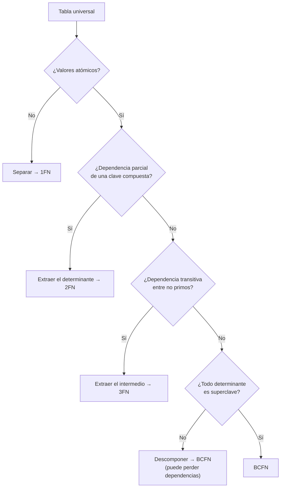

# 018 — Normalización de 1FN a BCFN con dependencias funcionales

> [Programa](../../../README.md) · [Parte 02](../README.md) · [← Anterior](../../part-02-modelado-conceptual-y-requisitos/017-claves-identidad-natural-y-sustituta/README.md) · [Siguiente →](../../part-02-modelado-conceptual-y-requisitos/019-desnormalizacion-deliberada/README.md)

Parte 02 — Modelado conceptual y requisitos · Intermedio ·
4 horas estimadas · motores `postgresql`, `sqlite` · laboratorio
[`labs/01-sql-foundations`](../../../labs/01-sql-foundations/README.md) · 4 fuentes.

**Conceptos centrales:** `dependencia funcional` · `anomalía de actualización` · `BCFN` · `descomposición sin pérdida`

**En este caso se comparan 7 motores**: 5 lo resuelven (5 con el resultado comprobado por máquina) y 2 no, con el motivo escrito.

---

## Propósito

Normalizar con un criterio demostrable, no por costumbre. Las formas normales no son etiquetas de calidad: son teoremas sobre qué anomalías puede o no puede sufrir un esquema.

## Resultados de aprendizaje

Al terminar podrás:

1. Escribir dependencias funcionales a partir de reglas de negocio.
2. Calcular el cierre de un conjunto de atributos y encontrar las claves candidatas.
3. Justificar 1FN, 2FN, 3FN y BCFN señalando la anomalía que cada una elimina.
4. Descomponer sin pérdida y comprobarlo.
5. Explicar por qué BCFN puede no preservar dependencias, y qué hacer entonces.

## Fundamentos

### Dependencia funcional

`X → Y` significa: si dos filas coinciden en `X`, coinciden necesariamente en `Y`. Es una afirmación sobre **todas las instancias posibles**, no sobre los datos de hoy. Que hoy no haya dos estudiantes con el mismo nombre no permite escribir `nombre → id`.

Las dependencias vienen del dominio, no del dato. Por eso se descubren preguntando, no consultando.

### Cierre y claves candidatas

El cierre `X⁺` es el conjunto de atributos determinables desde `X`. Algoritmo:

```text
X⁺ := X
repetir hasta que no cambie:
    para cada dependencia A → B:
        si A ⊆ X⁺ entonces X⁺ := X⁺ ∪ B
```

`X` es superclave si `X⁺` incluye todos los atributos; es clave candidata si además ningún subconjunto propio lo consigue.

### Las formas normales y su anomalía

| Forma | Exige | Anomalía que elimina |
|---|---|---|
| **1FN** | Valores atómicos; sin grupos repetidos | No se puede consultar ni restringir lo que está dentro de un campo compuesto |
| **2FN** | 1FN + ningún atributo no primo depende de **parte** de una clave | Redundancia en claves compuestas |
| **3FN** | 2FN + ningún atributo no primo depende de otro no primo | Dependencia transitiva: actualizar en un sitio y no en otro |
| **BCFN** | Todo determinante es superclave | Redundancia residual con claves candidatas solapadas |

Las tres anomalías clásicas que aparecen si no se normaliza:

- **De inserción:** no se puede registrar un hecho porque falta otro no relacionado.
- **De actualización:** el mismo hecho está en N filas y se actualizan N−1.
- **De eliminación:** borrar una fila destruye un hecho independiente.



### Descomposición sin pérdida

Descomponer `R` en `R1` y `R2` es **sin pérdida** si `R1 ∩ R2` es superclave de al menos una de las dos. Si no, la reunión de las partes produce filas que no existían: se han inventado datos. Garcia-Molina, Ullman y Widom lo demuestran; en la práctica basta con comprobar la condición de la intersección antes de partir una tabla.

## Ejemplo trabajado

Tabla sin normalizar:

```text
inscripcion(student_id, course_id, student_nombre, course_nombre,
            teacher_id, teacher_nombre, nota)
```

**Dependencias del dominio:**

```text
D1  student_id                -> student_nombre
D2  course_id                 -> course_nombre, teacher_id
D3  teacher_id                -> teacher_nombre
D4  student_id, course_id     -> nota
```

**Clave candidata.** Calculamos `(student_id, course_id)⁺`:

```text
inicio        {student_id, course_id}
por D1  +     student_nombre
por D2  +     course_nombre, teacher_id
por D3  +     teacher_nombre
por D4  +     nota
```

El cierre cubre todos los atributos, y ninguna de las dos columnas por separado lo consigue. Clave candidata: `(student_id, course_id)`.

**Diagnóstico:**

- **2FN falla** por D1 y D2: `student_nombre` depende solo de `student_id`, que es *parte* de la clave. Consecuencia medible: con 2 000 estudiantes y 8 inscripciones de media, el nombre de cada estudiante se almacena 8 veces. 16 000 copias para 2 000 hechos.
- **3FN falla** por D3: `teacher_nombre` depende de `teacher_id`, que no es primo. Es transitiva.

**Descomposición:**

```sql
CREATE TABLE teachers (
  id     INTEGER PRIMARY KEY,
  nombre TEXT NOT NULL
);
CREATE TABLE students (
  id     INTEGER PRIMARY KEY,
  nombre TEXT NOT NULL
);
CREATE TABLE courses (
  id         INTEGER PRIMARY KEY,
  nombre     TEXT NOT NULL,
  teacher_id INTEGER NOT NULL REFERENCES teachers(id)
);
CREATE TABLE enrollments (
  student_id INTEGER NOT NULL REFERENCES students(id),
  course_id  INTEGER NOT NULL REFERENCES courses(id),
  nota       NUMERIC(2,1),
  PRIMARY KEY (student_id, course_id)
);
```

**Comprobación de no pérdida.** `enrollments ∩ students = {student_id}`, que es clave de `students`. Se cumple. Igual para `courses` y `teachers`.

**Las tres anomalías, ya resueltas:**

| Anomalía | Antes | Después |
|---|---|---|
| Inserción | No se puede registrar un curso nuevo sin un estudiante inscrito | `INSERT INTO courses` basta |
| Actualización | Corregir el nombre de un profesor toca N filas | Toca 1 |
| Eliminación | Borrar la última inscripción borra el curso | El curso persiste |

**El caso BCFN.** Añadamos la regla «cada curso lo dicta un solo profesor, y cada profesor dicta un solo curso por período». Aparecen dos claves candidatas solapadas y una dependencia `teacher_id, periodo → course_id` cuyo determinante no es superclave de la tabla resultante. Descomponer para llegar a BCFN elimina la redundancia, pero la dependencia queda repartida entre dos tablas y ya no puede comprobarse sin reunirlas.

Ese es el compromiso real: **BCFN no siempre preserva dependencias; 3FN siempre se puede alcanzar preservándolas**. Cuando entran en conflicto, la decisión defendible suele ser quedarse en 3FN y auditar la dependencia con una invariante, en vez de perder la capacidad del motor de hacerla cumplir.

## Comparación

| Nivel | Redundancia | Dependencias preservadas | Costo de consulta |
|---|---|---|---|
| Sin normalizar | Alta | — | Bajo (sin reuniones) |
| 3FN | Baja | Siempre alcanzable | Medio |
| BCFN | Mínima | No siempre | Medio-alto |
| Desnormalizado a propósito (clase 009) | Controlada y documentada | Vigiladas por invariantes | Bajo en lectura, alto en escritura |

## Errores frecuentes

1. **Deducir dependencias de los datos actuales.** Los datos muestran lo que ha ocurrido; la dependencia afirma lo que puede ocurrir.
2. **Normalizar hasta BCFN por reflejo.** Si perder la dependencia obliga a comprobarla en la aplicación, puede ser peor remedio que enfermedad.
3. **Descomponer sin comprobar la no pérdida.** Reunir dos partes mal elegidas fabrica filas que nunca existieron.
4. **Creer que 1FN prohíbe los tipos compuestos.** Prohíbe los grupos repetidos y los valores no atómicos *para el dominio*; un `jsonb` opaco que nunca se consulta por dentro es discutible, pero uno que se filtra por sus claves internas viola el espíritu de 1FN.
5. **Confundir normalización con rendimiento.** La normalización decide qué anomalías son posibles; el rendimiento se decide con índices y planes (parte 08).

## De la clase a la operación

Los datos sucios que aparecen en los informes casi siempre son anomalías de actualización que nadie previno. Un esquema en 3FN convierte esos errores en imposibles por construcción, y eso vale más que cualquier proceso de limpieza posterior.

## Reto de transferencia

1. Toma una tabla ancha real de tu trabajo y escribe sus dependencias funcionales.
2. Calcula el cierre y determina las claves candidatas.
3. Diagnostica en qué forma normal está, nombrando la dependencia que la rompe.
4. Descompón, comprueba la no pérdida y cuantifica cuántas copias redundantes eliminaste.

## Preguntas de evaluación

1. Da una dependencia funcional cierta en tu dominio que hoy los datos no reflejarían.
2. Demuestra con un ejemplo pequeño que una descomposición con intersección no clave inventa filas.
3. ¿Qué anomalía concreta elimina 3FN que 2FN no elimina?
4. Presenta un caso donde te quedarías en 3FN pudiendo llegar a BCFN, y di quién vigila entonces la dependencia perdida.

---

## 🌐 El mismo problema en cada motor

**Caso:** Corregir el nombre de un profesor con una sola escritura

La prueba práctica de que un esquema está normalizado no es recitar formas
normales: es que **cada hecho está escrito una sola vez**, así que
corregirlo cuesta una escritura y no puede quedar a medias.

El caso parte del esquema descompuesto —profesores, cursos, inscripciones—
y corrige el nombre del profesor de DB-101 con un solo `UPDATE`. La consulta
devuelve, por curso, el nombre del profesor y cuántas inscripciones tiene.
En la tabla sin descomponer, ese nombre estaría repetido en cada
inscripción y bastaría olvidar una fila para que el mismo profesor tuviera
dos nombres distintos: la anomalía de actualización.

Salida esperada, idéntica en todos los motores que lo resuelven:

| curso | profesor | inscripciones |
|---|---|---|
| `DB-101` | `Ada Lovelace` | `2` |
| `SE-201` | `Grace Hopper` | `1` |

El contrato vive en [`motores.yaml`](motores.yaml) y lo comprueba
`python scripts/verificar_equivalencia.py --clase 018`: 5 de
las 5 implementaciones se ejecutan de verdad y su
resultado se compara con esa tabla; el resto se declara como material revisado,
no ejecutado.

| Motor | ¿Resuelve el caso? | Nivel de prueba | Código | Fuente |
|---|---|---|---|---|
| SQLite | sí | núcleo | [código](implementaciones/sqlite/consulta.sql) | [doc oficial](https://sqlite.org/lang_update.html) |
| DuckDB | sí | núcleo | [código](implementaciones/duckdb/consulta.sql) | [doc oficial](https://duckdb.org/docs/stable/sql/statements/update.html) |
| PostgreSQL | sí | servicio | [código](implementaciones/postgresql/consulta.sql) | [doc oficial](https://www.postgresql.org/docs/current/ddl-constraints.html) |
| MySQL | sí | servicio | [código](implementaciones/mysql/consulta.sql) | [doc oficial](https://dev.mysql.com/doc/refman/8.4/en/group-by-handling.html) |
| MongoDB | sí | servicio | [código](implementaciones/mongodb/consulta.js) | [doc oficial](https://www.mongodb.com/docs/manual/data-modeling/concepts/embedding-vs-references/) |
| Apache Cassandra | **no** | — | — | [doc oficial](https://cassandra.apache.org/doc/latest/cassandra/developing/data-modeling/data-modeling_rdbms.html) |
| Redis | **no** | — | — | [doc oficial](https://redis.io/docs/latest/develop/data-types/hashes/) |

### Los que resuelven el caso

#### SQLite · [`implementaciones/sqlite/consulta.sql`](implementaciones/sqlite/consulta.sql)

✅ **verificado** — se ejecuta en CI sin servicios

```sql
-- motor: sqlite
-- doc: https://sqlite.org/lang_update.html
-- nota: la prueba de la normalizacion esta en el UPDATE, no en el SELECT: una
--       sola escritura corrige el hecho en todas partes.

-- === preparacion ===
-- Forma normalizada: el nombre del profesor vive UNA vez.
CREATE TABLE profesores (
    id     INTEGER PRIMARY KEY,
    nombre TEXT NOT NULL
);
CREATE TABLE cursos (
    id          INTEGER PRIMARY KEY,
    codigo      TEXT NOT NULL,
    profesor_id INTEGER NOT NULL REFERENCES profesores(id)
);
CREATE TABLE inscripciones (
    estudiante TEXT NOT NULL,
    curso_id   INTEGER NOT NULL REFERENCES cursos(id),
    PRIMARY KEY (estudiante, curso_id)
);

INSERT INTO profesores (id, nombre) VALUES (1, 'A. Lovelace'), (2, 'Grace Hopper');
INSERT INTO cursos (id, codigo, profesor_id) VALUES (10, 'DB-101', 1), (20, 'SE-201', 2);
INSERT INTO inscripciones (estudiante, curso_id) VALUES
    ('Ada', 10), ('Linus', 10), ('Grace', 20);

-- La correccion de un dato es UNA escritura. En la tabla sin normalizar habria
-- que actualizar una fila por inscripcion, y bastaria olvidar una para que el
-- mismo profesor tuviera dos nombres.
UPDATE profesores SET nombre = 'Ada Lovelace' WHERE id = 1;

-- === consulta ===
SELECT c.codigo AS curso,
       p.nombre AS profesor,
       COUNT(i.estudiante) AS inscripciones
FROM cursos c
JOIN profesores p ON p.id = c.profesor_id
LEFT JOIN inscripciones i ON i.curso_id = c.id
GROUP BY c.id, c.codigo, p.nombre
ORDER BY c.codigo;
```

- **Por qué sí:** La descomposición y la reunión que la deshace son operaciones del modelo relacional puro: aquí se ven sin ruido de infraestructura.
- **Por qué no:** No tiene forma de declarar una dependencia funcional distinta de una clave, así que la normalización queda documentada en la cabeza de quien diseñó y no en el esquema.
- 📄 Documentación oficial: <https://sqlite.org/lang_update.html>

#### DuckDB · [`implementaciones/duckdb/consulta.sql`](implementaciones/duckdb/consulta.sql)

✅ **verificado** — se ejecuta en CI sin servicios

```sql
-- motor: duckdb
-- doc: https://duckdb.org/docs/stable/sql/statements/update.html
-- nota: para DESCUBRIR dependencias funcionales en datos existentes:
--       SELECT curso, COUNT(DISTINCT profesor) FROM plano GROUP BY curso
--       HAVING COUNT(DISTINCT profesor) > 1;  -- si devuelve filas, la
--       dependencia esta rota y hay anomalias ya presentes.

-- === preparacion ===
-- Forma normalizada: el nombre del profesor vive UNA vez.
CREATE TABLE profesores (
    id     INTEGER PRIMARY KEY,
    nombre VARCHAR NOT NULL
);
CREATE TABLE cursos (
    id          INTEGER PRIMARY KEY,
    codigo      VARCHAR NOT NULL,
    profesor_id INTEGER NOT NULL
);
CREATE TABLE inscripciones (
    estudiante VARCHAR NOT NULL,
    curso_id   INTEGER NOT NULL,
    PRIMARY KEY (estudiante, curso_id)
);

INSERT INTO profesores (id, nombre) VALUES (1, 'A. Lovelace'), (2, 'Grace Hopper');
INSERT INTO cursos (id, codigo, profesor_id) VALUES (10, 'DB-101', 1), (20, 'SE-201', 2);
INSERT INTO inscripciones (estudiante, curso_id) VALUES
    ('Ada', 10), ('Linus', 10), ('Grace', 20);

-- La correccion de un dato es UNA escritura. En la tabla sin normalizar habria
-- que actualizar una fila por inscripcion, y bastaria olvidar una para que el
-- mismo profesor tuviera dos nombres.
UPDATE profesores SET nombre = 'Ada Lovelace' WHERE id = 1;

-- === consulta ===
SELECT c.codigo AS curso,
       p.nombre AS profesor,
       COUNT(i.estudiante) AS inscripciones
FROM cursos c
JOIN profesores p ON p.id = c.profesor_id
LEFT JOIN inscripciones i ON i.curso_id = c.id
GROUP BY c.id, c.codigo, p.nombre
ORDER BY c.codigo;
```

- **Por qué sí:** Es la herramienta ideal para el paso previo: descubrir las dependencias funcionales que hay **de verdad** en un volcado, contando cuántos valores distintos toma una columna por cada valor de otra.
- **Por qué no:** En analítica la normalización se revierte a propósito: el esquema en estrella repite el nombre del profesor en cada fila de hechos porque ahorrarse la reunión vale más que ahorrarse el espacio.
- 📄 Documentación oficial: <https://duckdb.org/docs/stable/sql/statements/update.html>

#### PostgreSQL · [`implementaciones/postgresql/consulta.sql`](implementaciones/postgresql/consulta.sql)

✅ **verificado** — se ejecuta contra el motor real levantado con `docker compose`

```sql
-- motor: postgresql
-- doc: https://www.postgresql.org/docs/current/ddl-constraints.html
-- nota: las claves foraneas hacen cumplir la descomposicion; sin ellas, la
--       normalizacion es solo una promesa del diagrama.

DROP TABLE IF EXISTS inscripciones, cursos, profesores;

-- === preparacion ===
-- Forma normalizada: el nombre del profesor vive UNA vez.
CREATE TABLE profesores (
    id     integer PRIMARY KEY,
    nombre text NOT NULL
);
CREATE TABLE cursos (
    id          integer PRIMARY KEY,
    codigo      text NOT NULL,
    profesor_id integer NOT NULL REFERENCES profesores(id)
);
CREATE TABLE inscripciones (
    estudiante text NOT NULL,
    curso_id   integer NOT NULL REFERENCES cursos(id),
    PRIMARY KEY (estudiante, curso_id)
);

INSERT INTO profesores (id, nombre) VALUES (1, 'A. Lovelace'), (2, 'Grace Hopper');
INSERT INTO cursos (id, codigo, profesor_id) VALUES (10, 'DB-101', 1), (20, 'SE-201', 2);
INSERT INTO inscripciones (estudiante, curso_id) VALUES
    ('Ada', 10), ('Linus', 10), ('Grace', 20);

-- La correccion de un dato es UNA escritura. En la tabla sin normalizar habria
-- que actualizar una fila por inscripcion, y bastaria olvidar una para que el
-- mismo profesor tuviera dos nombres.
UPDATE profesores SET nombre = 'Ada Lovelace' WHERE id = 1;

-- === consulta ===
SELECT c.codigo AS curso,
       p.nombre AS profesor,
       COUNT(i.estudiante) AS inscripciones
FROM cursos c
JOIN profesores p ON p.id = c.profesor_id
LEFT JOIN inscripciones i ON i.curso_id = c.id
GROUP BY c.id, c.codigo, p.nombre
ORDER BY c.codigo;
```

- **Por qué sí:** Las claves foráneas hacen cumplir la descomposición: no se puede insertar un curso cuyo profesor no exista, que es la mitad de lo que la normalización promete.
- **Por qué no:** Cada nivel de normalización añade una reunión a las consultas de lectura; en un panel que se abre mil veces por minuto, esas reuniones son el costo que después justifica desnormalizar a propósito.
- 📄 Documentación oficial: <https://www.postgresql.org/docs/current/ddl-constraints.html>

#### MySQL · [`implementaciones/mysql/consulta.sql`](implementaciones/mysql/consulta.sql)

✅ **verificado** — se ejecuta contra el motor real levantado con `docker compose`

```sql
-- motor: mysql
-- doc: https://dev.mysql.com/doc/refman/8.4/en/group-by-handling.html
-- nota: con ONLY_FULL_GROUP_BY activo (por omision desde 5.7) esta consulta es
--       legal porque cada columna no agregada esta en el GROUP BY. Sin ese
--       modo, MySQL aceptaba consultas ambiguas y devolvia cualquier fila.

DROP TABLE IF EXISTS inscripciones;
DROP TABLE IF EXISTS cursos;
DROP TABLE IF EXISTS profesores;

-- === preparacion ===
-- Forma normalizada: el nombre del profesor vive UNA vez.
CREATE TABLE profesores (
    id     INT PRIMARY KEY,
    nombre VARCHAR(50) NOT NULL
);
CREATE TABLE cursos (
    id          INT PRIMARY KEY,
    codigo      VARCHAR(50) NOT NULL,
    profesor_id INT NOT NULL REFERENCES profesores(id)
);
CREATE TABLE inscripciones (
    estudiante VARCHAR(50) NOT NULL,
    curso_id   INT NOT NULL REFERENCES cursos(id),
    PRIMARY KEY (estudiante, curso_id)
);

INSERT INTO profesores (id, nombre) VALUES (1, 'A. Lovelace'), (2, 'Grace Hopper');
INSERT INTO cursos (id, codigo, profesor_id) VALUES (10, 'DB-101', 1), (20, 'SE-201', 2);
INSERT INTO inscripciones (estudiante, curso_id) VALUES
    ('Ada', 10), ('Linus', 10), ('Grace', 20);

-- La correccion de un dato es UNA escritura. En la tabla sin normalizar habria
-- que actualizar una fila por inscripcion, y bastaria olvidar una para que el
-- mismo profesor tuviera dos nombres.
UPDATE profesores SET nombre = 'Ada Lovelace' WHERE id = 1;

-- === consulta ===
SELECT c.codigo AS curso,
       p.nombre AS profesor,
       COUNT(i.estudiante) AS inscripciones
FROM cursos c
JOIN profesores p ON p.id = c.profesor_id
LEFT JOIN inscripciones i ON i.curso_id = c.id
GROUP BY c.id, c.codigo, p.nombre
ORDER BY c.codigo;
```

- **Por qué sí:** Mismo esquema y mismas garantías con InnoDB; es además el motor donde más se encuentran tablas heredadas sin normalizar, así que es donde más se practica la descomposición sobre datos reales.
- **Por qué no:** Su modo `ONLY_FULL_GROUP_BY` no siempre estuvo activo: hay código antiguo que agrupa mal y sigue devolviendo un resultado, lo que esconde justo los errores que la normalización previene.
- 📄 Documentación oficial: <https://dev.mysql.com/doc/refman/8.4/en/group-by-handling.html>

#### MongoDB · [`implementaciones/mongodb/consulta.js`](implementaciones/mongodb/consulta.js)

✅ **verificado** — se ejecuta contra el motor real levantado con `docker compose`

```javascript
// motor: mongodb
// doc: https://www.mongodb.com/docs/manual/data-modeling/concepts/embedding-vs-references/
// nota: modelo normalizado A PROPOSITO. Es lo correcto cuando el dato
//       referenciado cambia y lo comparten muchos documentos; si el nombre del
//       profesor estuviera incrustado en cada inscripcion, este updateOne
//       tendria que ser un updateMany sobre miles de documentos.

// === preparacion ===
db.profesores.drop();
db.cursos.drop();
db.inscripciones.drop();

db.profesores.insertMany([
  { _id: 1, nombre: "A. Lovelace" },
  { _id: 2, nombre: "Grace Hopper" },
]);
db.cursos.insertMany([
  { _id: 10, codigo: "DB-101", profesor_id: 1 },
  { _id: 20, codigo: "SE-201", profesor_id: 2 },
]);
db.inscripciones.insertMany([
  { estudiante: "Ada", curso_id: 10 },
  { estudiante: "Linus", curso_id: 10 },
  { estudiante: "Grace", curso_id: 20 },
]);

db.profesores.updateOne({ _id: 1 }, { $set: { nombre: "Ada Lovelace" } });

// === consulta ===
db.cursos
  .aggregate([
    { $lookup: { from: "profesores", localField: "profesor_id",
                 foreignField: "_id", as: "p" } },
    { $unwind: "$p" },
    { $lookup: { from: "inscripciones", localField: "_id",
                 foreignField: "curso_id", as: "i" } },
    { $project: { _id: 0, curso: "$codigo", profesor: "$p.nombre",
                  inscripciones: { $size: "$i" } } },
    { $sort: { curso: 1 } },
  ])
  .forEach((d) => print(d.curso + "|" + d.profesor + "|" + d.inscripciones));
```

- **Por qué sí:** Admite el modelo normalizado con referencias entre colecciones, y es la forma correcta cuando el dato referenciado cambia y lo comparten muchos documentos, como el nombre de un profesor.
- **Por qué no:** Va contra la corriente del modelo documental: al no haber claves foráneas, nada impide que un curso apunte a un profesor borrado, y la reunión hay que pedirla explícitamente con `$lookup` en cada consulta.
- 📄 Documentación oficial: <https://www.mongodb.com/docs/manual/data-modeling/concepts/embedding-vs-references/>

### Los que no resuelven este caso — y qué se hace en su lugar

Descartar un motor con un argumento es tan formativo como usarlo. Ninguna de estas filas dice que el motor sea peor: dice que este problema no es el suyo.

| Motor | Por qué no | Qué se hace en su lugar | Fuente |
|---|---|---|---|
| Apache Cassandra | Su guía de modelado recomienda lo contrario: duplicar el nombre del profesor en cada fila que lo necesite, porque no hay reuniones y una lectura debe resolverse en una sola partición. | Aceptar la duplicación y asumir el costo de actualizarla: cambiar el nombre del profesor pasa a ser un trabajo por lotes sobre todas las filas que lo copiaron, no un `UPDATE`. | [doc](https://cassandra.apache.org/doc/latest/cassandra/developing/data-modeling/data-modeling_rdbms.html) |
| Redis | No hay reuniones ni referencias que el servidor entienda: normalizar significaría hacer dos o tres viajes por lectura y reunir en el cliente. | Guardar el nombre del profesor en una clave propia y referenciarla desde la aplicación, aceptando que la coherencia entre claves la mantiene el código. | [doc](https://redis.io/docs/latest/develop/data-types/hashes/) |

---

## Laboratorio

```bash
python scripts/validate_repository.py
python labs/01-sql-foundations/run_lab.py
```

Guarda como evidencia la salida completa, la versión del motor y la semilla o
los parámetros usados. Una captura sin comando no es evidencia: no se puede
repetir.

## Evaluación

| Criterio | Peso | Qué se comprueba |
|---|---:|---|
| Comprensión conceptual | 25 % | Explica el mecanismo, no solo el resultado |
| Ejecución reproducible | 25 % | Otra persona obtiene lo mismo con las instrucciones dadas |
| Interpretación basada en evidencia | 25 % | Cada conclusión se apoya en una salida o una medición |
| Límites y riesgos declarados | 25 % | Dice qué no demuestra el ejercicio y qué faltaría en producción |

La clase se da por superada cuando la respuesta explica el mecanismo, muestra
la salida que la respalda y declara al menos un límite del ejercicio.

## Fuentes de esta clase

Todo lo afirmado arriba procede de estas obras. Los identificadores viven en
[`catalog/sources.json`](../../../catalog/sources.json) y el estado de los
enlaces se comprueba con `python scripts/check_external_links.py`.

- **E. F. Codd** (1970). [A Relational Model of Data for Large Shared Data Banks](https://dl.acm.org/doi/10.1145/362384.362685). Communications of the ACM 13(6). DOI [10.1145/362384.362685](https://doi.org/10.1145/362384.362685).  
  Artículo fundacional del modelo relacional y de la independencia de datos.
- **Hector Garcia-Molina, Jeffrey D. Ullman, Jennifer Widom** (2008). [Database Systems: The Complete Book](http://infolab.stanford.edu/~ullman/dscb.html). 2.a ed. Pearson. ISBN 978-0-13-187325-4.  
  Tratamiento formal de dependencias funcionales, normalización y optimización.
- **Abraham Silberschatz, Henry F. Korth, S. Sudarshan** (2019). [Database System Concepts](https://db-book.com/). 7.a ed. McGraw-Hill. ISBN 978-0-07-802215-9.  
  Texto de referencia universitario. El sitio oficial publica diapositivas y capítulos de muestra.
- **Raghu Ramakrishnan, Johannes Gehrke** (2002). [Database Management Systems](https://pages.cs.wisc.edu/~dbbook/). 3.a ed. McGraw-Hill. ISBN 978-0-07-246563-1.  
  Fuerte en álgebra relacional, evaluación de consultas y estructuras de almacenamiento.

---

> [Programa](../../../README.md) · [Parte 02](../README.md) · [← Anterior](../../part-02-modelado-conceptual-y-requisitos/017-claves-identidad-natural-y-sustituta/README.md) · [Siguiente →](../../part-02-modelado-conceptual-y-requisitos/019-desnormalizacion-deliberada/README.md)
