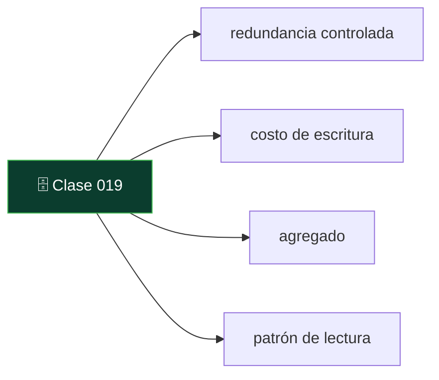
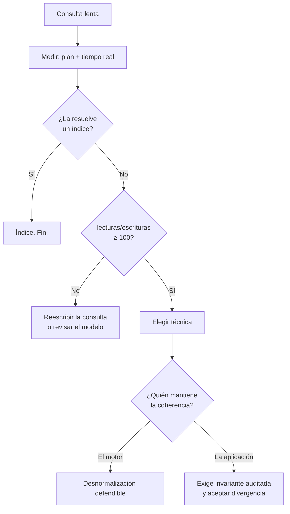

# 019 — Desnormalización deliberada y patrones de acceso

   

> [Programa](../../../README.md) · [Parte 02](../README.md) · [← Anterior](../../part-02-modelado-conceptual-y-requisitos/018-normalizacion-y-dependencias-funcionales/README.md) · [Siguiente →](../../part-03-modelo-relacional-y-algebra/020-la-relacion-como-conjunto/README.md)

Parte 02 — Modelado conceptual y requisitos · Intermedio ·
3 horas estimadas · motores `postgresql`, `mongodb` · laboratorio
[`labs/02-polyglot-modeling`](../../../labs/02-polyglot-modeling/README.md) · 3 fuentes.

**Conceptos centrales:** `redundancia controlada` · `costo de escritura` · `agregado` · `patrón de lectura`

**En este caso se comparan 7 motores**: 6 lo resuelven (5 con el resultado comprobado por máquina) y 1 no, con el motivo escrito.



---

## Propósito

Introducir redundancia a propósito, con evidencia de que hacía falta y con un mecanismo declarado que la mantenga coherente. Desnormalizar sin ambas cosas no es una optimización: es una anomalía planificada.

## Resultados de aprendizaje

Al terminar podrás:

1. Medir el costo que la desnormalización pretende evitar, antes de aplicarla.
2. Elegir entre las cuatro técnicas habituales según el patrón de acceso.
3. Declarar quién mantiene la coherencia y con qué garantía.
4. Escribir la invariante que detecta la divergencia.
5. Reconocer cuándo el problema real es un índice ausente y no el modelo.

## Fundamentos

### La pregunta previa

Antes de desnormalizar hay que responder tres cosas con números:

1. ¿Cuál es la consulta cara? (con su plan y su tiempo real)
2. ¿Con qué frecuencia se ejecuta frente a las escrituras que la alimentan?
3. ¿Un índice, una vista materializada o una reescritura la resuelven?

Sadalage y Fowler formulan el criterio: la unidad de diseño es el **agregado**, y el agregado se define por cómo se lee, no por cómo se escribe. Kleppmann añade la contrapartida: cada dato duplicado es un dato que puede divergir, y la probabilidad de divergencia no es cero, es «cuándo».

La relación lecturas/escrituras es el número que decide. Con 10 000 lecturas por cada escritura, duplicar un dato sale barato. Con 2 lecturas por escritura, casi nunca compensa.

### Las cuatro técnicas

| Técnica | En qué consiste | Cuándo | Riesgo |
|---|---|---|---|
| **Columna derivada** | Guardar un cálculo (`total`, `promedio`, `n_inscritos`) | El cálculo recorre muchas filas y se lee mucho | Divergencia silenciosa |
| **Columna replicada** | Copiar un atributo de la tabla padre (`course_nombre` en `enrollments`) | Evitar una reunión en un camino crítico | Actualizaciones en cascada |
| **Agregado precalculado** | Tabla o vista materializada de resumen | Informes repetidos sobre ventanas fijas | Frescura: ¿de cuándo son los datos? |
| **Agregado documental** | Guardar el objeto completo como documento | Se lee y escribe siempre entero | Duplicación entre agregados |

### Quién mantiene la coherencia

Esta es la pregunta que distingue el diseño del deseo. Cuatro respuestas posibles, ordenadas de más a menos garantía:

| Mecanismo | Garantía | Costo |
|---|---|---|
| Restricción del motor (`GENERATED ALWAYS AS`) | Total y automática | Solo sirve para cálculos sobre la misma fila |
| Disparador en la misma transacción | Total mientras la transacción sea atómica | Coste de escritura; lógica escondida en el motor |
| Vista materializada con refresco | Consistente en el instante del refresco | Datos con retraso conocido |
| Proceso asíncrono o código de aplicación | Ninguna garantía dura | El más barato y el que más diverge |

Si la respuesta es «lo actualiza la aplicación», la coherencia depende de que **todos** los caminos de escritura, presentes y futuros, la respeten. El script de migración de la próxima persona no lo hará.



## Ejemplo trabajado

Consulta que aparece en cada carga del panel de un curso:

```sql
SELECT c.id, c.nombre, COUNT(e.student_id) AS inscritos, AVG(e.nota) AS promedio
FROM courses c
LEFT JOIN enrollments e ON e.course_id = c.id
GROUP BY c.id, c.nombre;
```

**Medición primero.** Con 300 cursos y 240 000 inscripciones, el plan hace un barrido de `enrollments` y una agregación por hash: ~240 000 filas procesadas por ejecución. Si el panel se abre 5 000 veces al día y se inscribe gente 400 veces al día, la relación es **12,5 lecturas por escritura**. Ese número no justifica desnormalizar todavía: un índice sobre `enrollments(course_id, nota)` permite una agregación por índice y reduce el trabajo sin duplicar nada.

**Cuando sí.** Cambiemos la escala: 5 millones de inscripciones y el panel en la portada, 200 000 aperturas diarias frente a 400 inscripciones. Relación: **500 a 1**. Ahora sí.

**Opción A — columna derivada mantenida por el motor:**

```sql
ALTER TABLE courses ADD COLUMN inscritos INTEGER NOT NULL DEFAULT 0;
ALTER TABLE courses ADD COLUMN suma_notas NUMERIC(10,1) NOT NULL DEFAULT 0;

CREATE FUNCTION actualizar_agregado() RETURNS TRIGGER AS $$
BEGIN
  UPDATE courses
     SET inscritos  = inscritos  + CASE TG_OP WHEN 'INSERT' THEN 1 WHEN 'DELETE' THEN -1 ELSE 0 END,
         suma_notas = suma_notas + COALESCE(NEW.nota, 0) - COALESCE(OLD.nota, 0)
   WHERE id = COALESCE(NEW.course_id, OLD.course_id);
  RETURN NULL;
END; $$ LANGUAGE plpgsql;
```

El promedio se calcula como `suma_notas / NULLIF(inscritos, 0)`: se guardan los dos sumandos, no el promedio, porque un promedio no es incrementalmente actualizable sin el conteo.

**Coste real de la decisión:** cada inscripción pasa de una escritura a dos, y todas las inscripciones de un mismo curso se serializan sobre la fila del contador. Con 400 escrituras diarias es irrelevante; con 400 por segundo sobre el mismo curso, ese contador es un punto caliente y habría que repartirlo en varias filas y sumarlas al leer.

**La invariante, obligatoria:**

```sql
SELECT c.id, c.inscritos AS declarado, COUNT(e.student_id) AS real
FROM courses c
LEFT JOIN enrollments e ON e.course_id = c.id
GROUP BY c.id, c.inscritos
HAVING c.inscritos <> COUNT(e.student_id);
```

Cero filas: coherente. Se ejecuta a diario y se alerta si devuelve algo. Sin esta consulta, la desnormalización es una apuesta.

**Opción B — vista materializada:**

```sql
CREATE MATERIALIZED VIEW curso_resumen AS
SELECT c.id, c.nombre, COUNT(e.student_id) AS inscritos, AVG(e.nota) AS promedio
FROM courses c LEFT JOIN enrollments e ON e.course_id = c.id
GROUP BY c.id, c.nombre;
```

No hay riesgo de divergencia lógica: se recalcula entera. El costo se paga en **frescura** (los datos son del último refresco) y en el propio refresco. Si el panel tolera 5 minutos de retraso, esta opción es netamente superior a la A: menos código, menos puntos calientes y ninguna invariante que auditar.

## Comparación

| Opción | Frescura | Coste de escritura | Riesgo de divergencia | Complejidad |
|---|---|---|---|---|
| Consulta directa + índice | Inmediata | Ninguno | Ninguno | Mínima |
| Columna derivada con disparador | Inmediata | Alto, con contención | Real, exige invariante | Alta |
| Vista materializada | Retrasada | Nulo en línea | Ninguno | Baja |
| Agregado documental | Inmediata en su agregado | Medio | Entre agregados | Media |

## Errores frecuentes

1. **Desnormalizar sin medir.** La mayoría de las consultas «lentas» lo son por un índice ausente, y el índice no duplica datos.
2. **Guardar el promedio en vez de suma y conteo.** El promedio no es incrementalmente actualizable.
3. **No escribir la invariante.** La divergencia se descubre cuando un usuario reclama, es decir, tarde.
4. **Poner la coherencia en la aplicación y llamarla garantía.** Solo cubre los caminos de escritura que ya existen.
5. **Ignorar el punto caliente.** Un contador por entidad serializa todas las escrituras de esa entidad.

## De la clase a la operación

Toda desnormalización envejece: llega el día en que un proceso masivo escribe saltándose el disparador, o el refresco falla en silencio. Por eso la invariante y su alerta son parte de la entrega, no un extra.

## Reto de transferencia

1. Localiza una consulta cara real, mide su plan y su tiempo.
2. Calcula su relación lecturas/escrituras con datos de tráfico reales.
3. Aplica primero la opción sin duplicación (índice o reescritura) y vuelve a medir.
4. Si sigue sin bastar, elige técnica, declara el mecanismo de coherencia y entrega la invariante que la audita.

## Preguntas de evaluación

1. ¿Qué relación lecturas/escrituras usarías como umbral en tu contexto y por qué?
2. Explica por qué la vista materializada no puede divergir lógicamente y la columna derivada sí.
3. Describe un punto caliente que crearía una columna derivada en tu dominio y cómo lo repartirías.
4. Un proceso de carga masiva escribe con `COPY` y salta los disparadores. ¿Cómo lo detectas y cómo lo reparas?

---

## 🌐 El mismo problema en cada motor

**Caso:** Un contador guardado que nunca puede mentir

Desnormalizar es guardar un dato que ya se podía calcular, a cambio de no
calcularlo en cada lectura. La pregunta que decide si es deliberado o
accidental es siempre la misma: **¿quién mantiene el dato duplicado al
día?** Si la respuesta es «el que se acuerde», la desnormalización es una
avería futura.

El caso guarda en cada curso un contador de inscripciones, mantenido
automáticamente, e inscribe y da de baja a estudiantes. Al final, la
consulta devuelve el contador guardado **y** el recuento calculado sobre la
tabla de inscripciones. Los dos números tienen que ser iguales: esa igualdad
es la prueba, y en producción es la comprobación que debe correr
periódicamente.

Salida esperada, idéntica en todos los motores que lo resuelven:

| curso | contador | calculado |
|---|---|---|
| `DB-101` | `2` | `2` |
| `SE-201` | `1` | `1` |

El contrato vive en [`motores.yaml`](motores.yaml) y lo comprueba
`python scripts/verificar_equivalencia.py --clase 019`: 5 de
las 6 implementaciones se ejecutan de verdad y su
resultado se compara con esa tabla; el resto se declara como material revisado,
no ejecutado.

| Motor | ¿Resuelve el caso? | Nivel de prueba | Código | Fuente |
|---|---|---|---|---|
| SQLite | sí | núcleo | [código](implementaciones/sqlite/consulta.sql) | [doc oficial](https://sqlite.org/lang_createtrigger.html) |
| PostgreSQL | sí | servicio | [código](implementaciones/postgresql/consulta.sql) | [doc oficial](https://www.postgresql.org/docs/current/sql-createtrigger.html) |
| MySQL | sí | servicio | [código](implementaciones/mysql/consulta.sql) | [doc oficial](https://dev.mysql.com/doc/refman/8.4/en/triggers.html) |
| MongoDB | sí | servicio | [código](implementaciones/mongodb/consulta.js) | [doc oficial](https://www.mongodb.com/docs/manual/reference/operator/update/inc/) |
| Redis | sí | servicio | [código](implementaciones/redis/consulta.txt) | [doc oficial](https://redis.io/docs/latest/commands/incr/) |
| Apache Cassandra | sí | declarado | [código](implementaciones/cassandra/consulta.cql) | [doc oficial](https://cassandra.apache.org/doc/latest/cassandra/developing/cql/types.html) |
| DuckDB | **no** | — | — | [doc oficial](https://duckdb.org/docs/stable/sql/statements/create_view.html) |

### Los que resuelven el caso

#### SQLite · [`implementaciones/sqlite/consulta.sql`](implementaciones/sqlite/consulta.sql)

✅ **verificado** — se ejecuta en CI sin servicios

```sql
-- motor: sqlite
-- doc: https://sqlite.org/lang_createtrigger.html
-- nota: el contador lo mantiene el motor, no el programa. Ningun camino de
--       escritura —ni la consola, ni otro servicio, ni una migracion— puede
--       olvidarse de actualizarlo.

-- === preparacion ===
CREATE TABLE cursos (
    id        INTEGER PRIMARY KEY,
    codigo    TEXT NOT NULL,
    inscritos INTEGER NOT NULL DEFAULT 0
);
CREATE TABLE inscripciones (
    estudiante TEXT NOT NULL,
    curso_id   INTEGER NOT NULL REFERENCES cursos(id),
    PRIMARY KEY (estudiante, curso_id)
);

CREATE TRIGGER inscripciones_mas AFTER INSERT ON inscripciones
BEGIN
    UPDATE cursos SET inscritos = inscritos + 1 WHERE id = NEW.curso_id;
END;

CREATE TRIGGER inscripciones_menos AFTER DELETE ON inscripciones
BEGIN
    UPDATE cursos SET inscritos = inscritos - 1 WHERE id = OLD.curso_id;
END;

INSERT INTO cursos (id, codigo) VALUES (10, 'DB-101'), (20, 'SE-201');
INSERT INTO inscripciones (estudiante, curso_id) VALUES
    ('Ada', 10), ('Linus', 10), ('Grace', 20), ('Bob', 20);
-- Una baja: si el disparador de borrado no existiera, el contador se quedaria
-- en 2 y nadie lo notaria hasta que alguien contara a mano.
DELETE FROM inscripciones WHERE estudiante = 'Bob' AND curso_id = 20;

-- === consulta ===
-- La comprobacion que en produccion debe correr periodicamente: el dato
-- guardado frente al dato calculado. El dia que dejen de coincidir, la
-- desnormalizacion dejo de ser deliberada.
SELECT c.codigo AS curso,
       c.inscritos AS contador,
       (SELECT COUNT(*) FROM inscripciones i WHERE i.curso_id = c.id) AS calculado
FROM cursos c
ORDER BY c.codigo;
```

- **Por qué sí:** Tiene disparadores `AFTER INSERT` y `AFTER DELETE`, que es la forma de que el contador lo mantenga el motor y no el programa: ningún camino de escritura puede olvidarse de actualizarlo.
- **Por qué no:** Un disparador se ejecuta en cada escritura y es invisible en el código de la aplicación: cuando el contador se desvía, nadie mira ahí primero.
- 📄 Documentación oficial: <https://sqlite.org/lang_createtrigger.html>

#### PostgreSQL · [`implementaciones/postgresql/consulta.sql`](implementaciones/postgresql/consulta.sql)

✅ **verificado** — se ejecuta contra el motor real levantado con `docker compose`

```sql
-- motor: postgresql
-- doc: https://www.postgresql.org/docs/current/sql-createtrigger.html
-- nota: el disparador corre DENTRO de la transaccion de la inscripcion: si la
--       transaccion se deshace, el contador vuelve solo. Esa es la diferencia
--       con mantenerlo desde otro sistema.

-- === preparacion ===
DROP TABLE IF EXISTS inscripciones, cursos;

CREATE TABLE cursos (
    id        integer PRIMARY KEY,
    codigo    text NOT NULL,
    inscritos integer NOT NULL DEFAULT 0
);
CREATE TABLE inscripciones (
    estudiante text NOT NULL,
    curso_id   integer NOT NULL REFERENCES cursos(id),
    PRIMARY KEY (estudiante, curso_id)
);

CREATE OR REPLACE FUNCTION ajustar_contador() RETURNS trigger AS $$
BEGIN
    IF TG_OP = 'INSERT' THEN
        UPDATE cursos SET inscritos = inscritos + 1 WHERE id = NEW.curso_id;
    ELSE
        UPDATE cursos SET inscritos = inscritos - 1 WHERE id = OLD.curso_id;
    END IF;
    RETURN NULL;
END;
$$ LANGUAGE plpgsql;

CREATE TRIGGER inscripciones_contador
AFTER INSERT OR DELETE ON inscripciones
FOR EACH ROW EXECUTE FUNCTION ajustar_contador();

INSERT INTO cursos (id, codigo) VALUES (10, 'DB-101'), (20, 'SE-201');
INSERT INTO inscripciones (estudiante, curso_id) VALUES
    ('Ada', 10), ('Linus', 10), ('Grace', 20), ('Bob', 20);
DELETE FROM inscripciones WHERE estudiante = 'Bob' AND curso_id = 20;

-- === consulta ===
-- La comprobacion que en produccion debe correr periodicamente: el dato
-- guardado frente al dato calculado. El dia que dejen de coincidir, la
-- desnormalizacion dejo de ser deliberada.
SELECT c.codigo AS curso,
       c.inscritos AS contador,
       (SELECT COUNT(*) FROM inscripciones i WHERE i.curso_id = c.id) AS calculado
FROM cursos c
ORDER BY c.codigo;
```

- **Por qué sí:** Ofrece las dos vías y con la transacción como red: un disparador que mantiene el contador dentro de la misma transacción que la inscripción, o una vista materializada con `REFRESH ... CONCURRENTLY` cuando se acepta que el dato vaya con retraso.
- **Por qué no:** El contador convierte cada inscripción en una escritura sobre la **misma** fila del curso: en un curso muy demandado, esa fila se vuelve el cuello de botella y las transacciones esperan unas por otras.
- 📄 Documentación oficial: <https://www.postgresql.org/docs/current/sql-createtrigger.html>

#### MySQL · [`implementaciones/mysql/consulta.sql`](implementaciones/mysql/consulta.sql)

✅ **verificado** — se ejecuta contra el motor real levantado con `docker compose`

```sql
-- motor: mysql
-- doc: https://dev.mysql.com/doc/refman/8.4/en/triggers.html
-- nota: los disparadores de InnoDB se ejecutan en la misma transaccion, asi
--       que contador e inscripcion se confirman o se deshacen juntos.

-- === preparacion ===
DROP TABLE IF EXISTS inscripciones;
DROP TABLE IF EXISTS cursos;

CREATE TABLE cursos (
    id        INT PRIMARY KEY,
    codigo    VARCHAR(20) NOT NULL,
    inscritos INT NOT NULL DEFAULT 0
) ENGINE=InnoDB;
CREATE TABLE inscripciones (
    estudiante VARCHAR(50) NOT NULL,
    curso_id   INT NOT NULL,
    PRIMARY KEY (estudiante, curso_id),
    FOREIGN KEY (curso_id) REFERENCES cursos(id)
) ENGINE=InnoDB;

CREATE TRIGGER inscripciones_mas AFTER INSERT ON inscripciones
FOR EACH ROW UPDATE cursos SET inscritos = inscritos + 1 WHERE id = NEW.curso_id;

CREATE TRIGGER inscripciones_menos AFTER DELETE ON inscripciones
FOR EACH ROW UPDATE cursos SET inscritos = inscritos - 1 WHERE id = OLD.curso_id;

INSERT INTO cursos (id, codigo) VALUES (10, 'DB-101'), (20, 'SE-201');
INSERT INTO inscripciones (estudiante, curso_id) VALUES
    ('Ada', 10), ('Linus', 10), ('Grace', 20), ('Bob', 20);
DELETE FROM inscripciones WHERE estudiante = 'Bob' AND curso_id = 20;

-- === consulta ===
-- La comprobacion que en produccion debe correr periodicamente: el dato
-- guardado frente al dato calculado. El dia que dejen de coincidir, la
-- desnormalizacion dejo de ser deliberada.
SELECT c.codigo AS curso,
       c.inscritos AS contador,
       (SELECT COUNT(*) FROM inscripciones i WHERE i.curso_id = c.id) AS calculado
FROM cursos c
ORDER BY c.codigo;
```

- **Por qué sí:** Los disparadores de InnoDB se ejecutan dentro de la misma transacción, así que el contador y la inscripción se confirman o se deshacen juntos.
- **Por qué no:** Los disparadores de MySQL no se pueden encadenar libremente y su depuración es incómoda; además siguen sin ejecutarse en operaciones masivas hechas con `LOAD DATA` en algunas configuraciones.
- 📄 Documentación oficial: <https://dev.mysql.com/doc/refman/8.4/en/triggers.html>

#### MongoDB · [`implementaciones/mongodb/consulta.js`](implementaciones/mongodb/consulta.js)

✅ **verificado** — se ejecuta contra el motor real levantado con `docker compose`

```javascript
// motor: mongodb
// doc: https://www.mongodb.com/docs/manual/reference/operator/aggregation/inc/
// nota: $inc es atomico sobre UN documento. La inscripcion y el contador viven
//       en documentos distintos, asi que mantenerlos de acuerdo ante un fallo
//       exige una transaccion de varios documentos; aqui se escribe la version
//       simple y se declara el riesgo, que es la unica forma honesta.

// === preparacion ===
db.cursos.drop();
db.inscripciones.drop();

db.cursos.insertMany([
  { _id: 10, codigo: "DB-101", inscritos: 0 },
  { _id: 20, codigo: "SE-201", inscritos: 0 },
]);

function inscribir(estudiante, cursoId) {
  db.inscripciones.insertOne({ estudiante: estudiante, curso_id: cursoId });
  db.cursos.updateOne({ _id: cursoId }, { $inc: { inscritos: 1 } });
}
function darDeBaja(estudiante, cursoId) {
  db.inscripciones.deleteOne({ estudiante: estudiante, curso_id: cursoId });
  db.cursos.updateOne({ _id: cursoId }, { $inc: { inscritos: -1 } });
}

inscribir("Ada", 10);
inscribir("Linus", 10);
inscribir("Grace", 20);
inscribir("Bob", 20);
darDeBaja("Bob", 20);

// === consulta ===
db.cursos
  .aggregate([
    { $lookup: { from: "inscripciones", localField: "_id",
                 foreignField: "curso_id", as: "i" } },
    { $project: { _id: 0, curso: "$codigo", contador: "$inscritos",
                  calculado: { $size: "$i" } } },
    { $sort: { curso: 1 } },
  ])
  .forEach((d) => print(d.curso + "|" + d.contador + "|" + d.calculado));
```

- **Por qué sí:** `$inc` es una actualización atómica sobre un solo documento, y el patrón de contador incrustado en el documento padre es una recomendación explícita de su guía de modelado.
- **Por qué no:** La atomicidad es por documento: la inscripción y el incremento del contador viven en documentos distintos, así que mantenerlos de acuerdo exige una transacción de varios documentos, con su costo, o aceptar la deriva.
- 📄 Documentación oficial: <https://www.mongodb.com/docs/manual/reference/operator/update/inc/>

#### Redis · [`implementaciones/redis/consulta.txt`](implementaciones/redis/consulta.txt)

✅ **verificado** — se ejecuta contra el motor real levantado con `docker compose`

```text
# motor: redis
# doc: https://redis.io/docs/latest/commands/incr/
# nota: dos representaciones del mismo hecho: un contador INCR y un conjunto
#       con los miembros. La consulta final es un script Lua porque, en Redis,
#       la unica forma de leer varias claves de forma atomica y devolver un
#       resultado compuesto es ejecutarlo en el servidor.

# === preparacion ===
FLUSHDB
SADD curso:DB-101:miembros Ada
INCR curso:DB-101:contador
SADD curso:DB-101:miembros Linus
INCR curso:DB-101:contador
SADD curso:SE-201:miembros Grace
INCR curso:SE-201:contador
SADD curso:SE-201:miembros Bob
INCR curso:SE-201:contador
SREM curso:SE-201:miembros Bob
DECR curso:SE-201:contador

# === consulta ===
EVAL "local r={} for _,c in ipairs({'DB-101','SE-201'}) do r[#r+1]=c..'|'..redis.call('GET','curso:'..c..':contador')..'|'..redis.call('SCARD','curso:'..c..':miembros') end return r" 0
```

- **Por qué sí:** Es el caso para el que Redis parece hecho: `INCR` es atómico, cuesta microsegundos y no toca disco. Un contador de alta frecuencia delante del motor transaccional descarga precisamente la fila que se volvería cuello de botella.
- **Por qué no:** El contador vive en otro sistema que la verdad: si Redis se reinicia sin persistencia, o si la inscripción se deshace y el `INCR` no, los dos números dejan de cuadrar y nadie se entera hasta la comprobación.
- 📄 Documentación oficial: <https://redis.io/docs/latest/commands/incr/>

#### Apache Cassandra · [`implementaciones/cassandra/consulta.cql`](implementaciones/cassandra/consulta.cql)

⚪ **declarado** — se revisa a mano contra la documentación citada; la máquina no lo ejecuta

```sql
-- motor: cassandra
-- doc: https://cassandra.apache.org/doc/latest/cassandra/developing/cql/types.html
-- nota: implementacion declarada. Cassandra tiene un tipo de columna dedicado,
--       `counter`, porque en su modelo no se puede leer para escribir: el
--       contador se incrementa sin conocer su valor previo. El precio esta al
--       final del archivo y no es menor.

-- === preparacion ===
CREATE KEYSPACE IF NOT EXISTS escuela
  WITH replication = {'class': 'SimpleStrategy', 'replication_factor': 1};

-- Una tabla de contadores no admite columnas normales: solo la clave y los
-- contadores. Por eso el codigo del curso ES la clave.
CREATE TABLE IF NOT EXISTS escuela.contador_inscritos (
    curso     text PRIMARY KEY,
    inscritos counter
);

-- Y la lista de miembros va en su propia tabla, sin transaccion que la
-- mantenga de acuerdo con el contador.
CREATE TABLE IF NOT EXISTS escuela.inscripciones (
    curso      text,
    estudiante text,
    PRIMARY KEY (curso, estudiante)
);

UPDATE escuela.contador_inscritos SET inscritos = inscritos + 1 WHERE curso = 'DB-101';
INSERT INTO escuela.inscripciones (curso, estudiante) VALUES ('DB-101', 'Ada');
UPDATE escuela.contador_inscritos SET inscritos = inscritos + 1 WHERE curso = 'DB-101';
INSERT INTO escuela.inscripciones (curso, estudiante) VALUES ('DB-101', 'Linus');
UPDATE escuela.contador_inscritos SET inscritos = inscritos + 1 WHERE curso = 'SE-201';
INSERT INTO escuela.inscripciones (curso, estudiante) VALUES ('SE-201', 'Grace');

-- === consulta ===
-- No hay reunion: son dos preguntas separadas, y compararlas es trabajo del
-- cliente. Ademas, si el cliente reintenta un UPDATE de contador tras un tiempo
-- de espera agotado, el incremento puede aplicarse dos veces: los contadores de
-- Cassandra NO son idempotentes.
SELECT curso, inscritos FROM escuela.contador_inscritos;
SELECT curso, COUNT(*) FROM escuela.inscripciones GROUP BY curso;
```

- **Por qué sí:** Tiene un tipo de columna dedicado, `counter`, precisamente porque en su modelo no se puede leer para escribir: el contador se incrementa sin conocer su valor previo.
- **Por qué no:** Las columnas contador no son idempotentes ante reintentos: si el cliente reintenta tras un tiempo de espera agotado, el incremento puede aplicarse dos veces, y una tabla con contadores no admite otras columnas normales.
- 📄 Documentación oficial: <https://cassandra.apache.org/doc/latest/cassandra/developing/cql/types.html>

### Los que no resuelven este caso — y qué se hace en su lugar

Descartar un motor con un argumento es tan formativo como usarlo. Ninguna de estas filas dice que el motor sea peor: dice que este problema no es el suyo.

| Motor | Por qué no | Qué se hace en su lugar | Fuente |
|---|---|---|---|
| DuckDB | No tiene disparadores ni vistas materializadas con refresco: no hay mecanismo que mantenga el dato duplicado al día, que es exactamente lo que esta clase exige. | Recalcular la tabla agregada completa en cada carga. En analítica esa es la respuesta normal: no se mantiene el contador, se reconstruye. | [doc](https://duckdb.org/docs/stable/sql/statements/create_view.html) |

---

## Laboratorio

```bash
python scripts/validate_repository.py
# labs/02-polyglot-modeling se entrega escrito: no hay guion que ejecutar
```

Guarda como evidencia la salida completa, la versión del motor y la semilla o
los parámetros usados. Una captura sin comando no es evidencia: no se puede
repetir.

## Evaluación

| Criterio | Peso | Qué se comprueba |
|---|---:|---|
| Comprensión conceptual | 25 % | Explica el mecanismo, no solo el resultado |
| Ejecución reproducible | 25 % | Otra persona obtiene lo mismo con las instrucciones dadas |
| Interpretación basada en evidencia | 25 % | Cada conclusión se apoya en una salida o una medición |
| Límites y riesgos declarados | 25 % | Dice qué no demuestra el ejercicio y qué faltaría en producción |

La clase se da por superada cuando la respuesta explica el mecanismo, muestra
la salida que la respalda y declara al menos un límite del ejercicio.

## Fuentes de esta clase

Todo lo afirmado arriba procede de estas obras. Los identificadores viven en
[`catalog/sources.json`](../../../catalog/sources.json) y el estado de los
enlaces se comprueba con `python scripts/check_external_links.py`.

- **Pramod J. Sadalage, Martin Fowler** (2012). [NoSQL Distilled: A Brief Guide to the Emerging World of Polyglot Persistence](https://martinfowler.com/books/nosql.html). Addison-Wesley. ISBN 978-0-321-82662-6.  
  Origen del término agregado y de la persistencia políglota que estructura este programa.
- **Martin Kleppmann** (2017). [Designing Data-Intensive Applications](https://dataintensive.net/). O'Reilly. ISBN 978-1-4493-7332-0.  
  Referencia central del programa para replicación, partición, transacciones distribuidas y streaming.
- **Bill Karwin** (2010). [SQL Antipatterns: Avoiding the Pitfalls of Database Programming](https://pragprog.com/titles/bksqla/sql-antipatterns/). Pragmatic Bookshelf. ISBN 978-1-934356-55-5.  
  Catálogo de errores de modelado con su corrección y cuando el antipatron es aceptable.

---

> [Programa](../../../README.md) · [Parte 02](../README.md) · [← Anterior](../../part-02-modelado-conceptual-y-requisitos/018-normalizacion-y-dependencias-funcionales/README.md) · [Siguiente →](../../part-03-modelo-relacional-y-algebra/020-la-relacion-como-conjunto/README.md)
