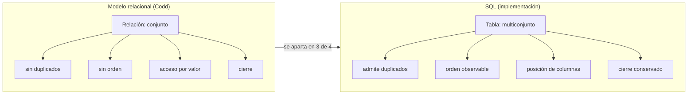

# 010 — La relación como conjunto: tuplas, dominios y acceso por valor

> [Programa](../../../README.md) · [Parte 02](../README.md) · [← Anterior](../../part-01-modelado-conceptual-y-requisitos/009-desnormalizacion-deliberada/README.md) · [Siguiente →](../../part-02-modelo-relacional-y-algebra/011-algebra-relacional-operadores/README.md)

Parte 02 — Modelo relacional y álgebra · Fundamentos ·
3 horas estimadas · motores `postgresql`, `sqlite` · laboratorio
[`labs/01-sql-foundations`](../../../labs/01-sql-foundations/README.md) · 3 fuentes.

**Conceptos centrales:** `relación` · `tupla` · `dominio` · `acceso por valor` · `cierre`

---

## Propósito

Precisar qué es una relación en el sentido de Codd y en qué se aparta SQL de esa definición. Muchos comportamientos «raros» de SQL —duplicados, orden, nulos— se explican exactamente por ahí.

## Resultados de aprendizaje

Al terminar podrás:

1. Definir relación, tupla, atributo y dominio sin recurrir a «tabla», «fila» y «columna».
2. Enumerar las cuatro propiedades de una relación que SQL no respeta.
3. Explicar el acceso por valor y por qué excluye punteros y posiciones.
4. Justificar la propiedad de cierre y qué habilita.
5. Detectar en código propio dependencias del orden físico.

## Fundamentos

### La definición

Dada una lista de dominios `D1, …, Dn`, una **relación** es un subconjunto del producto cartesiano `D1 × … × Dn`. De ahí, por ser un conjunto matemático, se siguen cuatro propiedades:

| Propiedad | Significado | ¿SQL la respeta? |
|---|---|---|
| Sin tuplas duplicadas | Un conjunto no repite elementos | **No.** Una tabla sin clave admite filas idénticas |
| Sin orden entre tuplas | Un conjunto no está ordenado | **No del todo:** `ORDER BY` produce una lista, no una relación |
| Sin orden entre atributos | Se accede por nombre | **No.** `SELECT *` y `INSERT` sin lista de columnas dependen de la posición |
| Valores atómicos del dominio | Cada celda es un valor del dominio | **Parcialmente.** Admite nulos, que no pertenecen a ningún dominio |

Date insiste en que SQL implementa «tablas», no relaciones: una tabla es un multiconjunto (*bag*) con orden de columnas. Todas las sorpresas de la parte 03 —`UNION` frente a `UNION ALL`, `COUNT(*)` frente a `COUNT(col)`, el resultado de `NOT IN` con nulos— derivan de esa distancia.

### Acceso por valor

Codd exige que todo dato sea localizable por la terna **(nombre de relación, valor de clave, nombre de atributo)**. Nunca por posición física ni por puntero.

Consecuencias que se usan a diario:

- Se puede reorganizar el almacenamiento sin tocar consultas (independencia física, clase 003).
- Se puede replicar y particionar sin cambiar la semántica.
- No existe «la tercera fila»: sin `ORDER BY` no hay tercera fila, y con `ORDER BY` sobre una columna no única tampoco está determinada.

### Cierre

Todo operador relacional recibe relaciones y devuelve una relación. Eso permite componer sin límite: el resultado de una consulta puede ser la entrada de otra. En SQL se manifiesta en las subconsultas, las CTE y las vistas. Es lo que hace que el lenguaje sea composicional en lugar de un catálogo de comandos.



## Ejemplo trabajado

Creemos una tabla sin clave y observemos las tres desviaciones.

```sql
CREATE TABLE t (a INTEGER, b TEXT);
INSERT INTO t VALUES (1,'x'), (1,'x'), (2,'y');
SELECT COUNT(*) FROM t;              -- 3
SELECT COUNT(*) FROM (SELECT DISTINCT a, b FROM t);  -- 2
```

Si `t` fuese una relación, ambas consultas darían **2**. Dan 3 y 2: `t` es un multiconjunto. La consecuencia inmediata:

```sql
SELECT a, b FROM t
EXCEPT
SELECT 1, 'x';
```

En SQL estándar `EXCEPT` elimina duplicados, así que el resultado es `(2,'y')`: se han borrado **las dos** filas `(1,'x')` con una sola tupla. Con `EXCEPT ALL` el resultado incluiría una `(1,'x')` superviviente. Dos operadores distintos porque el modelo subyacente no es un conjunto.

**Desviación de orden.** Sobre el dominio del repositorio:

```sql
SELECT nombre FROM students;
```

El orden que devuelve depende del plan. Si el motor decide un barrido secuencial, sale el orden de inserción; si decide recorrer un índice, sale el orden del índice. Añadir un índice puede cambiar el resultado observado sin cambiar ningún dato. Todo código que dependa de ese orden es un fallo latente que se activa el día que alguien optimiza.

**Desviación de posición.**

```sql
INSERT INTO students VALUES (5, 'Ana');    -- depende del orden de columnas
INSERT INTO students (id, nombre) VALUES (5, 'Ana');  -- acceso por nombre
```

La primera forma se rompe en silencio si alguien añade una columna en medio. La segunda es la que respeta el acceso por valor.

**Traza del riesgo.** Un `INSERT` posicional sobre una tabla de 6 columnas, tras insertar una columna nueva en la posición 3, no falla: desplaza los valores y guarda datos incorrectos con tipos compatibles. El error se descubre en un informe semanas después.

## Comparación

| Operación | Semántica de conjunto | Semántica de multiconjunto (SQL) |
|---|---|---|
| `UNION` | Sin duplicados | `UNION` sin, `UNION ALL` con |
| `INTERSECT` | Sin duplicados | `INTERSECT` / `INTERSECT ALL` |
| `EXCEPT` | Sin duplicados | `EXCEPT` / `EXCEPT ALL` |
| Proyección | Elimina duplicados | Los conserva salvo `DISTINCT` |
| Conteo | Cardinalidad del conjunto | `COUNT(*)` cuenta repeticiones |

## Errores frecuentes

1. **Suponer que el motor devuelve las filas «en orden».** No hay orden sin `ORDER BY`, y con `ORDER BY` sobre columna no única el desempate tampoco está definido.
2. **Usar `SELECT *` en código de producción.** Ata el cliente a la posición y al número de columnas.
3. **Proyectar sin pensar en duplicados.** `SELECT ciudad FROM clientes` devuelve la ciudad repetida por cada cliente; casi nunca es lo que se quería.
4. **Confundir `NULL` con un valor.** No pertenece a ningún dominio: es una marca de información ausente (clase 019).
5. **Crear tablas sin clave primaria.** Sin ella no hay forma de referirse a una fila concreta ni de borrar un duplicado sin borrar el otro.

## De la clase a la operación

Los tres apartamientos de SQL respecto del modelo son la causa de una familia entera de fallos de producción: informes con totales inflados por duplicados, procesos que dependen del orden, migraciones que desplazan columnas. Reconocer la causa común los convierte en un solo problema con una sola disciplina.

## Reto de transferencia

1. Encuentra en un esquema real una tabla sin clave primaria y demuestra con una consulta que contiene duplicados lógicos.
2. Muestra una consulta de tu código que dependa del orden sin `ORDER BY`.
3. Reproduce el efecto de `EXCEPT` frente a `EXCEPT ALL` con tus propios datos.
4. Convierte un `INSERT` posicional en uno por nombre y explica qué fallo evitaste.

## Preguntas de evaluación

1. Da una consulta cuyo resultado cambie al crear un índice, sin que cambien los datos, y explica por qué.
2. ¿Por qué `COUNT(*)` y `COUNT(DISTINCT ...)` difieren, y qué dice eso del modelo subyacente?
3. Explica el acceso por valor y por qué prohíbe exponer identificadores de fila físicos.
4. La propiedad de cierre habilita las CTE. Da una consulta tuya que sería imposible sin ella.

---

## Laboratorio

```bash
python scripts/validate_repository.py
python labs/01-sql-foundations/run_lab.py
```

Guarda como evidencia la salida completa, la versión del motor y la semilla o
los parámetros usados. Una captura sin comando no es evidencia: no se puede
repetir.

## Evaluación

| Criterio | Peso | Qué se comprueba |
|---|---:|---|
| Comprensión conceptual | 25 % | Explica el mecanismo, no solo el resultado |
| Ejecución reproducible | 25 % | Otra persona obtiene lo mismo con las instrucciones dadas |
| Interpretación basada en evidencia | 25 % | Cada conclusión se apoya en una salida o una medición |
| Límites y riesgos declarados | 25 % | Dice qué no demuestra el ejercicio y qué faltaría en producción |

La clase se da por superada cuando la respuesta explica el mecanismo, muestra
la salida que la respalda y declara al menos un límite del ejercicio.

## Fuentes de esta clase

Todo lo afirmado arriba procede de estas obras. Los identificadores viven en
[`catalog/sources.json`](../../../catalog/sources.json) y el estado de los
enlaces se comprueba con `python scripts/check_external_links.py`.

- **E. F. Codd** (1970). [A Relational Model of Data for Large Shared Data Banks](https://dl.acm.org/doi/10.1145/362384.362685). Communications of the ACM 13(6). DOI [10.1145/362384.362685](https://doi.org/10.1145/362384.362685).  
  Artículo fundacional del modelo relacional y de la independencia de datos.
- **C. J. Date** (2015). [SQL and Relational Theory: How to Write Accurate SQL Code](https://www.oreilly.com/library/view/sql-and-relational/9781491941164/). 3.a ed. O'Reilly. ISBN 978-1-4919-4117-1.  
  Separa el modelo relacional de lo que SQL realmente implementa, incluidos los nulos.
- **Raghu Ramakrishnan, Johannes Gehrke** (2002). [Database Management Systems](https://pages.cs.wisc.edu/~dbbook/). 3.a ed. McGraw-Hill. ISBN 978-0-07-246563-1.  
  Fuerte en álgebra relacional, evaluación de consultas y estructuras de almacenamiento.

---

> [Programa](../../../README.md) · [Parte 02](../README.md) · [← Anterior](../../part-01-modelado-conceptual-y-requisitos/009-desnormalizacion-deliberada/README.md) · [Siguiente →](../../part-02-modelo-relacional-y-algebra/011-algebra-relacional-operadores/README.md)
