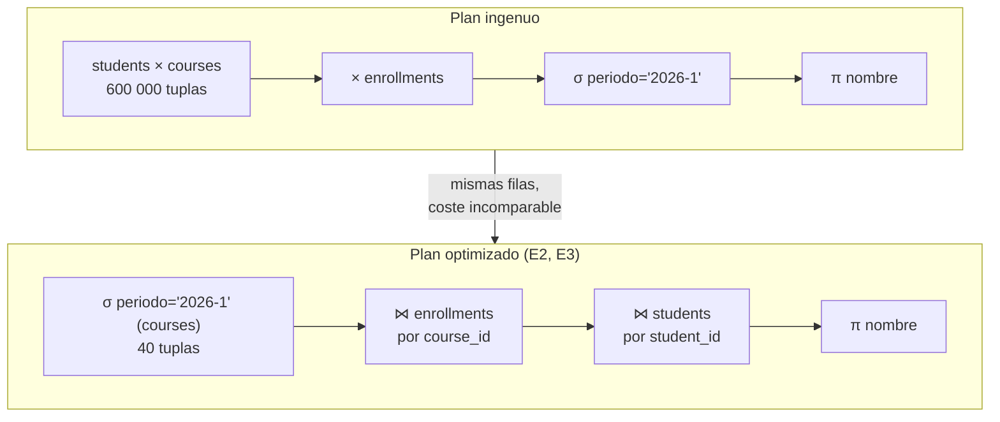

## Propósito

Dominar los operadores del álgebra relacional para poder razonar sobre una consulta **antes** de ejecutarla: cuántas filas puede producir, qué la hace cara y por qué el optimizador puede reordenarla sin cambiar el resultado.

## Resultados de aprendizaje

Al terminar podrás:

1. Escribir y leer expresiones con σ, π, ×, ⋈, ∪, −, ρ y ÷.
2. Estimar a mano la cardinalidad de cada operador.
3. Aplicar las equivalencias que usa el optimizador y explicar por qué son válidas.
4. Traducir entre álgebra y SQL en ambos sentidos.
5. Resolver una consulta de división relacional, que SQL no ofrece directamente.

## Fundamentos

### Los operadores

| Operador | Símbolo | Qué hace | Cardinalidad del resultado |
|---|---|---|---|
| Selección | σ<sub>cond</sub>(R) | Filtra tuplas | ≤ \|R\| |
| Proyección | π<sub>attrs</sub>(R) | Se queda con atributos; elimina duplicados | ≤ \|R\| |
| Producto cartesiano | R × S | Cada tupla con cada tupla | \|R\| · \|S\| |
| Reunión natural | R ⋈ S | Producto filtrado por igualdad en atributos comunes | 0 … \|R\|·\|S\| |
| Unión | R ∪ S | Tuplas de ambas (mismo esquema) | ≤ \|R\| + \|S\| |
| Diferencia | R − S | Las de R que no están en S | ≤ \|R\| |
| Renombrado | ρ<sub>x</sub>(R) | Cambia nombres | \|R\| |
| División | R ÷ S | Tuplas de R asociadas a **todas** las de S | ≤ \|R\| |

Selección, proyección, producto, unión y diferencia forman el conjunto **completo**: los demás se derivan. La reunión es `π(σ(R × S))`; la intersección es `R − (R − S)`.

### La cardinalidad decide el costo

El número que hay que vigilar es el producto cartesiano. Con `students` (2 000) y `courses` (300), `students × courses` produce **600 000** tuplas. La reunión natural sobre `enrollments` produce, como mucho, tantas como inscripciones haya. Esta diferencia es el motivo de la primera regla de optimización.

### Equivalencias que aplica el optimizador

```text
E1  σ_c1(σ_c2(R))            ≡  σ_c1 ∧ c2(R)          conmutar y fusionar filtros
E2  σ_c(R × S)               ≡  R ⋈_c S               empujar el filtro dentro
E3  σ_c(R ⋈ S)               ≡  σ_c(R) ⋈ S            si c solo usa atributos de R
E4  π_a(σ_c(R))              ≡  π_a(σ_c(π_a ∪ attrs(c)(R)))   proyección temprana
E5  (R ⋈ S) ⋈ T              ≡  R ⋈ (S ⋈ T)           asociatividad
E6  R ⋈ S                    ≡  S ⋈ R                 conmutatividad
```

Las dos primeras son el corazón de la optimización: **filtrar antes de combinar**. E5 y E6 dan al planificador libertad para elegir el orden de reunión, que es el problema combinatorio que resuelve el optimizador por costos (clase 042).



## Ejemplo trabajado

Pregunta: *«nombres de los estudiantes inscritos en algún curso del período 2026-1»*.

**Álgebra, forma ingenua:**

```text
π_nombre( σ_periodo='2026-1' (students × enrollments × courses) )
```

**Traza de cardinalidad** con 2 000 estudiantes, 240 000 inscripciones y 300 cursos:

```text
students × enrollments            = 2 000 · 240 000 = 480 000 000
(...) × courses                   = 480 000 000 · 300 = 1,44 · 10^11
```

Materializar eso es imposible. Ningún motor lo hace: por eso existe el optimizador.

**Álgebra, forma optimizada** (aplicando E2 y E3):

```text
π_nombre( students ⋈_id=student_id ( enrollments ⋈_course_id=id ( σ_periodo='2026-1'(courses) ) ) )
```

```text
σ periodo (courses)               = 40 cursos
⋈ enrollments                     ≈ 240 000 · (40/300) = 32 000
⋈ students                        = 32 000
π nombre (elimina duplicados)     ≈ 6 000 estudiantes distintos
```

De 1,44 · 10¹¹ a 32 000. **Las dos expresiones devuelven exactamente el mismo conjunto**; esa equivalencia demostrada es lo que autoriza al motor a reescribir.

**SQL correspondiente:**

```sql
SELECT DISTINCT s.nombre
FROM students s
JOIN enrollments e ON e.student_id = s.id
JOIN courses     c ON c.id = e.course_id
WHERE c.periodo = '2026-1';
```

El `DISTINCT` es la proyección relacional; sin él, SQL devuelve un nombre por inscripción (32 000 filas en vez de 6 000). Es la desviación de la clase 010 hecha visible.

**División relacional.** Pregunta: *«estudiantes inscritos en TODOS los cursos obligatorios»*. SQL no tiene operador; la formulación canónica es doble negación —«no existe curso obligatorio que este estudiante no haya cursado»—:

```sql
SELECT s.id, s.nombre
FROM students s
WHERE NOT EXISTS (
  SELECT 1 FROM courses c
  WHERE c.obligatorio = 1
    AND NOT EXISTS (
      SELECT 1 FROM enrollments e
      WHERE e.student_id = s.id AND e.course_id = c.id
    )
);
```

Alternativa por conteo, más legible y con el mismo resultado si `(student_id, course_id)` es único:

```sql
SELECT e.student_id
FROM enrollments e
JOIN courses c ON c.id = e.course_id AND c.obligatorio = 1
GROUP BY e.student_id
HAVING COUNT(DISTINCT e.course_id) = (SELECT COUNT(*) FROM courses WHERE obligatorio = 1);
```

## Comparación

| Álgebra | SQL | Nota |
|---|---|---|
| σ | `WHERE` | Antes de agrupar |
| π | `SELECT DISTINCT` | Sin `DISTINCT` no es proyección relacional |
| × | `CROSS JOIN` | Rara vez intencional |
| ⋈ | `JOIN ... ON` / `NATURAL JOIN` | `NATURAL` es frágil ante columnas nuevas |
| ∪ | `UNION` | `UNION ALL` no es la unión de conjuntos |
| − | `EXCEPT` | `MINUS` en Oracle |
| ÷ | — | Doble `NOT EXISTS` o conteo |
| ρ | `AS` | Necesario en autorreuniones |

## Errores frecuentes

1. **Olvidar la condición de reunión.** Un `JOIN` sin `ON` es un producto cartesiano: no da error, da un resultado enorme y erróneo.
2. **Creer que `JOIN` multiplica filas por error.** Multiplica porque la cardinalidad del lado derecho lo permite; el modelo lo predice.
3. **Traducir π como `SELECT` sin `DISTINCT`.** Cambia el resultado, no solo el rendimiento.
4. **Suponer que el orden de los `JOIN` en el texto es el orden de ejecución.** Por E5 y E6 el motor elige; en SQL solo lo fijan construcciones explícitas.
5. **Resolver una división con `IN`.** `IN` responde «alguno», no «todos».

## De la clase a la operación

Estimar cardinalidades a mano es la habilidad que distingue leer un plan de mirarlo. Cuando `EXPLAIN` dice «filas estimadas: 12» y la realidad son 3 millones, se sabe dónde mirar precisamente porque se sabe cómo debería haberse propagado la cardinalidad.

## Reto de transferencia

1. Escribe en álgebra una consulta real de tu trabajo, en su forma ingenua.
2. Aplica E1–E4 paso a paso y anota la cardinalidad estimada en cada nivel.
3. Ejecuta ambas versiones en SQL y compara el plan y el tiempo.
4. Formula una pregunta de tu dominio que exija división relacional y resuélvela de las dos formas.

## Preguntas de evaluación

1. Demuestra con un contraejemplo que E3 no vale si la condición usa atributos de ambas relaciones.
2. ¿Por qué la intersección no es un operador primitivo?
3. Da una consulta donde omitir `DISTINCT` produzca un total inflado en un informe, con números.
4. Explica por qué la formulación de división con `HAVING COUNT` exige unicidad de `(student_id, course_id)`.
