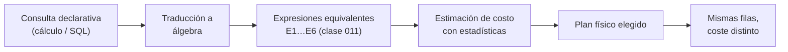

# 012 — Cálculo relacional y su equivalencia con el álgebra

> [Programa](../../../README.md) · [Parte 02](../README.md) · [← Anterior](../../part-02-modelo-relacional-y-algebra/011-algebra-relacional-operadores/README.md) · [Siguiente →](../../part-02-modelo-relacional-y-algebra/013-integridad-restricciones-y-acciones-referenciales/README.md)

Parte 02 — Modelo relacional y álgebra · Intermedio ·
3 horas estimadas · motores `postgresql` · laboratorio
[`labs/01-sql-foundations`](../../../labs/01-sql-foundations/README.md) · 3 fuentes.

**Conceptos centrales:** `cálculo de tuplas` · `seguridad de expresión` · `equivalencia` · `declaratividad`

**En este caso se comparan 5 motores**: 5 lo resuelven (5 con el resultado comprobado por máquina) y 0 no, con el motivo escrito.

---

## Propósito

Entender por qué SQL es declarativo. El cálculo relacional describe **qué** se quiere sin decir cómo obtenerlo; su equivalencia con el álgebra es el teorema que autoriza a un optimizador a elegir el cómo.

## Resultados de aprendizaje

Al terminar podrás:

1. Escribir consultas en cálculo relacional de tuplas.
2. Explicar qué es una expresión segura y por qué importa.
3. Enunciar la completitud relacional y qué implica para SQL.
4. Reconocer los cuantificadores ∃ y ∀ detrás de `EXISTS` y `NOT EXISTS`.
5. Argumentar qué preguntas quedan fuera del cálculo relacional puro.

## Fundamentos

### La forma de una expresión

Una consulta en cálculo de tuplas se escribe:

```text
{ t | P(t) }
```

«el conjunto de tuplas `t` que cumplen el predicado `P`». No hay orden de operaciones, no hay reuniones explícitas, no hay decisión sobre índices: solo una condición lógica.

Ejemplo: estudiantes con nota mayor que 6 en algún curso.

```text
{ s | s ∈ students ∧ ∃e ∈ enrollments ( e.student_id = s.id ∧ e.nota > 6.0 ) }
```

El paralelo con SQL es directo, y no por casualidad:

```sql
SELECT * FROM students s
WHERE EXISTS (SELECT 1 FROM enrollments e
              WHERE e.student_id = s.id AND e.nota > 6.0);
```

`EXISTS` **es** el ∃. `NOT EXISTS` combinado con negación **es** el ∀, porque `∀x P(x) ≡ ¬∃x ¬P(x)`. De ahí la doble negación de la división relacional de la clase 011: no es un truco, es la traducción literal del cuantificador universal.

### Expresiones seguras

El cálculo permite escribir cosas sin sentido computable:

```text
{ t | ¬(t ∈ students) }
```

«todas las tuplas que no son estudiantes»: un conjunto infinito. Una expresión es **segura** si su resultado está contenido en el dominio de los valores que aparecen en la base de datos. SQL fuerza la seguridad por construcción: toda consulta parte de un `FROM`, así que el universo siempre está acotado.

Es la razón por la que no existe en SQL un `SELECT` sin origen que devuelva «todo lo demás».

### Completitud relacional

**Teorema (Codd).** El cálculo relacional seguro y el álgebra relacional tienen exactamente el mismo poder expresivo: toda consulta escribible en uno lo es en el otro.

Un lenguaje es *relacionalmente completo* si expresa todo lo del álgebra. SQL lo es, y además la excede con agregación, ordenación, recursión y funciones de ventana, que **no** forman parte del álgebra relacional original.

La consecuencia práctica es toda la arquitectura de un motor moderno:



Si el cálculo no fuese equivalente al álgebra, el motor no podría reescribir la consulta: tendría que ejecutar literalmente lo que se escribió, como hacían los sistemas anteriores a 1970.

### Lo que el cálculo relacional no expresa

| Pregunta | ¿Cálculo relacional puro? | Cómo se resuelve |
|---|---|---|
| «¿Cuántos estudiantes hay?» | No: la agregación no es relacional | Extensión de SQL (`COUNT`) |
| «Los 10 mejores promedios» | No: exige orden | `ORDER BY` + `LIMIT` |
| «Todos los prerrequisitos, a cualquier profundidad» | No: cierre transitivo | CTE recursiva (clase 018) |
| «El promedio móvil de 3 períodos» | No | Función de ventana |
| «¿Está inscrito en algún curso?» | Sí (∃) | `EXISTS` |
| «¿Está en todos los obligatorios?» | Sí (∀) | Doble `NOT EXISTS` |

El límite del cierre transitivo es históricamente importante: es el motivo por el que las bases de datos de grafos existen (clase 028) y por el que SQL:1999 añadió `WITH RECURSIVE`.

## Ejemplo trabajado

Pregunta: *«estudiantes que no están inscritos en ningún curso del período 2026-1»*.

**Cálculo:**

```text
{ s | s ∈ students ∧ ¬∃e ∈ enrollments (
        e.student_id = s.id ∧
        ∃c ∈ courses ( c.id = e.course_id ∧ c.periodo = '2026-1' ) ) }
```

**SQL, traducción literal:**

```sql
SELECT s.*
FROM students s
WHERE NOT EXISTS (
  SELECT 1 FROM enrollments e
  JOIN courses c ON c.id = e.course_id
  WHERE e.student_id = s.id AND c.periodo = '2026-1'
);
```

**Álgebra, misma consulta:**

```text
students − π_students.*( students ⋈ enrollments ⋈ σ_periodo='2026-1'(courses) )
```

Las tres formulaciones devuelven el mismo conjunto. La tercera hace explícita la diferencia (`−`), que es lo que un plan de ejecución llamará *anti-join*.

**Contraste con la trampa de `NOT IN`:**

```sql
SELECT * FROM students
WHERE id NOT IN (SELECT student_id FROM enrollments);   -- peligroso
```

Si `enrollments.student_id` admite nulos y hay uno solo, el resultado es **vacío**, no el esperado. La razón es la lógica de tres valores (clase 019): `id NOT IN (1, 2, NULL)` se evalúa como `id<>1 ∧ id<>2 ∧ id<>NULL`, y el último término es `UNKNOWN`, que nunca es verdadero.

`NOT EXISTS` no sufre este problema porque no compara valores: comprueba la existencia de filas. Esta es la razón técnica —no estilística— para preferirlo.

**Traza numérica:** con 2 000 estudiantes, 1 fila con `student_id` nulo basta para que `NOT IN` devuelva 0 filas en lugar de las 340 correctas. Un fallo silencioso de 340 registros perdidos.

## Comparación

| Aspecto | Álgebra | Cálculo | SQL |
|---|---|---|---|
| Estilo | Procedimental | Declarativo | Declarativo |
| Especifica el orden | Sí | No | No |
| Riesgo de expresión insegura | No | Sí | No (acotado por `FROM`) |
| Poder expresivo | Igual | Igual | Mayor |
| Uso real | Interno del motor | Fundamento teórico | Interfaz del usuario |

## Errores frecuentes

1. **Usar `NOT IN` con subconsulta que puede devolver nulos.** Devuelve vacío sin avisar.
2. **Creer que el orden de los `JOIN` escritos es el ejecutado.** La equivalencia autoriza al motor a reordenar.
3. **Intentar expresar «todos» con `IN`.** `IN` es ∃; para ∀ hace falta la doble negación.
4. **Esperar cierre transitivo sin recursión.** Un `JOIN` de profundidad fija no recorre jerarquías de profundidad variable.
5. **Confundir declarativo con «el motor lo hará bien siempre».** El motor elige el cómo, pero con estadísticas malas elige mal (clase 042).

## De la clase a la operación

Cuando una consulta con `NOT IN` empieza a devolver menos filas tras una carga de datos, la causa casi siempre es un nulo nuevo en la subconsulta. Conocer el fundamento lógico convierte un misterio de tres días en una comprobación de tres minutos.

## Reto de transferencia

1. Escribe en cálculo de tuplas dos consultas reales de tu trabajo, una con ∃ y otra con ∀.
2. Tradúcelas a SQL y al álgebra.
3. Construye el caso con nulos que rompe la versión con `NOT IN` y captura la evidencia.
4. Formula una pregunta de tu dominio que exija cierre transitivo y explica por qué queda fuera del cálculo.

## Preguntas de evaluación

1. ¿Por qué toda consulta SQL es automáticamente una expresión segura?
2. Traduce `∀c ∈ obligatorios: inscrito(s, c)` a SQL y explica cada negación.
3. Da un caso real donde `NOT IN` y `NOT EXISTS` devuelvan resultados distintos, con datos concretos.
4. ¿Qué le añade SQL al álgebra relacional, y por qué esas adiciones no rompen la capacidad de optimizar?

---

## 🌐 El mismo problema en cada motor

**Caso:** Los estudiantes inscritos en todos los cursos: el cuantificador universal

El cálculo relacional describe **qué** se quiere, con cuantificadores; el
álgebra describe **cómo** obtenerlo, con operadores. Codd demostró que los
dos tienen el mismo poder expresivo, y esta clase lo comprueba con la
pregunta que peor se traduce: «¿quién está inscrito en todos los cursos?».

No hay operador `PARA TODO` en SQL. La traducción es doble negación —«no
existe un curso para el que no exista su inscripción»— y con los datos del
caso (Ada en los dos cursos, Linus en uno, Grace en ninguno) solo Ada
sobrevive. Que Grace **no** salga es la parte que atrapa a casi todo el
mundo: sin inscripciones, «todos sus cursos cumplen» sería cierto por
vacuidad si la pregunta estuviera mal escrita.

Salida esperada, idéntica en todos los motores que lo resuelven:

| nombre |
|---|
| `Ada` |

El contrato vive en [`motores.yaml`](motores.yaml) y lo comprueba
`python scripts/verificar_equivalencia.py --clase 012`: 5 de
las 5 implementaciones se ejecutan de verdad y su
resultado se compara con esa tabla; el resto se declara como material revisado,
no ejecutado.

| Motor | ¿Resuelve el caso? | Nivel de prueba | Código | Fuente |
|---|---|---|---|---|
| SQLite | sí | núcleo | [código](implementaciones/sqlite/consulta.sql) | [doc oficial](https://sqlite.org/lang_expr.html) |
| DuckDB | sí | núcleo | [código](implementaciones/duckdb/consulta.sql) | [doc oficial](https://duckdb.org/docs/stable/sql/expressions/subqueries.html) |
| PostgreSQL | sí | servicio | [código](implementaciones/postgresql/consulta.sql) | [doc oficial](https://www.postgresql.org/docs/current/functions-subquery.html) |
| MySQL | sí | servicio | [código](implementaciones/mysql/consulta.sql) | [doc oficial](https://dev.mysql.com/doc/refman/8.4/en/exists-and-not-exists-subqueries.html) |
| MongoDB | sí | servicio | [código](implementaciones/mongodb/consulta.js) | [doc oficial](https://www.mongodb.com/docs/manual/reference/operator/aggregation/setIsSubset/) |

### Los que resuelven el caso

#### SQLite · [`implementaciones/sqlite/consulta.sql`](implementaciones/sqlite/consulta.sql)

✅ **verificado** — se ejecuta en CI sin servicios

```sql
-- motor: sqlite
-- doc: https://sqlite.org/lang_expr.html

-- === preparacion ===
CREATE TABLE cursos (
    codigo TEXT PRIMARY KEY
);
CREATE TABLE estudiantes (
    nombre TEXT PRIMARY KEY
);
CREATE TABLE inscripciones (
    estudiante TEXT NOT NULL,
    curso      TEXT NOT NULL,
    PRIMARY KEY (estudiante, curso)
);

INSERT INTO cursos (codigo) VALUES ('DB-101'), ('SE-201');
INSERT INTO estudiantes (nombre) VALUES ('Ada'), ('Linus'), ('Grace');
INSERT INTO inscripciones (estudiante, curso) VALUES
    ('Ada', 'DB-101'), ('Ada', 'SE-201'), ('Linus', 'DB-101');

-- === consulta ===
-- «Los estudiantes inscritos en TODOS los cursos» es la division relacional, y
-- el calculo la escribe tal cual se lee: no existe ningun curso para el que no
-- exista su inscripcion. El doble NOT EXISTS no es un truco: es la traduccion
-- literal del cuantificador universal.
SELECT e.nombre
FROM estudiantes e
WHERE NOT EXISTS (
    SELECT 1 FROM cursos c
    WHERE NOT EXISTS (
        SELECT 1 FROM inscripciones i
        WHERE i.estudiante = e.nombre AND i.curso = c.codigo
    )
)
ORDER BY e.nombre;
```

- **Por qué sí:** Soporta subconsultas correlacionadas anidadas, que es todo lo que la doble negación necesita: la traducción del cálculo cabe entera en SQL estándar.
- **Por qué no:** Sin índice sobre `inscripciones`, la subconsulta interna se reevalúa por cada par estudiante-curso; con datos reales, ese plan es cuadrático.
- 📄 Documentación oficial: <https://sqlite.org/lang_expr.html>

#### DuckDB · [`implementaciones/duckdb/consulta.sql`](implementaciones/duckdb/consulta.sql)

✅ **verificado** — se ejecuta en CI sin servicios

```sql
-- motor: duckdb
-- doc: https://duckdb.org/docs/stable/sql/expressions/subqueries.html
-- nota: DuckDB descorrelaciona esta consulta y la convierte en reuniones. La
--       forma del calculo y la del algebra terminan en el mismo plan: eso es
--       la equivalencia de Codd, comprobada por el optimizador.

-- === preparacion ===
CREATE TABLE cursos (
    codigo VARCHAR PRIMARY KEY
);
CREATE TABLE estudiantes (
    nombre VARCHAR PRIMARY KEY
);
CREATE TABLE inscripciones (
    estudiante VARCHAR NOT NULL,
    curso      VARCHAR NOT NULL,
    PRIMARY KEY (estudiante, curso)
);

INSERT INTO cursos (codigo) VALUES ('DB-101'), ('SE-201');
INSERT INTO estudiantes (nombre) VALUES ('Ada'), ('Linus'), ('Grace');
INSERT INTO inscripciones (estudiante, curso) VALUES
    ('Ada', 'DB-101'), ('Ada', 'SE-201'), ('Linus', 'DB-101');

-- === consulta ===
-- «Los estudiantes inscritos en TODOS los cursos» es la division relacional, y
-- el calculo la escribe tal cual se lee: no existe ningun curso para el que no
-- exista su inscripcion. El doble NOT EXISTS no es un truco: es la traduccion
-- literal del cuantificador universal.
SELECT e.nombre
FROM estudiantes e
WHERE NOT EXISTS (
    SELECT 1 FROM cursos c
    WHERE NOT EXISTS (
        SELECT 1 FROM inscripciones i
        WHERE i.estudiante = e.nombre AND i.curso = c.codigo
    )
)
ORDER BY e.nombre;
```

- **Por qué sí:** Su optimizador convierte las subconsultas correlacionadas en reuniones (descorrelación): es el motor donde mejor se ve que la forma del cálculo y la del álgebra terminan siendo el mismo plan.
- **Por qué no:** Esa reescritura automática oculta el costo real de la forma escrita: lo que aquí es gratis, en otro motor puede ser el bucle anidado que tumba el informe.
- 📄 Documentación oficial: <https://duckdb.org/docs/stable/sql/expressions/subqueries.html>

#### PostgreSQL · [`implementaciones/postgresql/consulta.sql`](implementaciones/postgresql/consulta.sql)

✅ **verificado** — se ejecuta contra el motor real levantado con `docker compose`

```sql
-- motor: postgresql
-- doc: https://www.postgresql.org/docs/current/functions-subquery.html
-- nota: la forma equivalente con agregacion es
--         SELECT estudiante FROM inscripciones GROUP BY estudiante
--         HAVING COUNT(DISTINCT curso) = (SELECT COUNT(*) FROM cursos);
--       Da lo mismo aqui, pero deja de dar lo mismo si hay nulos.

DROP TABLE IF EXISTS inscripciones, estudiantes, cursos;

-- === preparacion ===
CREATE TABLE cursos (
    codigo text PRIMARY KEY
);
CREATE TABLE estudiantes (
    nombre text PRIMARY KEY
);
CREATE TABLE inscripciones (
    estudiante text NOT NULL,
    curso      text NOT NULL,
    PRIMARY KEY (estudiante, curso)
);

INSERT INTO cursos (codigo) VALUES ('DB-101'), ('SE-201');
INSERT INTO estudiantes (nombre) VALUES ('Ada'), ('Linus'), ('Grace');
INSERT INTO inscripciones (estudiante, curso) VALUES
    ('Ada', 'DB-101'), ('Ada', 'SE-201'), ('Linus', 'DB-101');

-- === consulta ===
-- «Los estudiantes inscritos en TODOS los cursos» es la division relacional, y
-- el calculo la escribe tal cual se lee: no existe ningun curso para el que no
-- exista su inscripcion. El doble NOT EXISTS no es un truco: es la traduccion
-- literal del cuantificador universal.
SELECT e.nombre
FROM estudiantes e
WHERE NOT EXISTS (
    SELECT 1 FROM cursos c
    WHERE NOT EXISTS (
        SELECT 1 FROM inscripciones i
        WHERE i.estudiante = e.nombre AND i.curso = c.codigo
    )
)
ORDER BY e.nombre;
```

- **Por qué sí:** Además de la doble negación admite la forma con agregación —contar cursos distintos por estudiante y compararlo con el total—, y `EXPLAIN` permite medir cuál de las dos es más barata con los datos reales.
- **Por qué no:** Las dos formas dejan de ser equivalentes en cuanto hay nulos o el conjunto divisor está vacío: la equivalencia es del modelo relacional, no de cualquier consulta que se le parezca.
- 📄 Documentación oficial: <https://www.postgresql.org/docs/current/functions-subquery.html>

#### MySQL · [`implementaciones/mysql/consulta.sql`](implementaciones/mysql/consulta.sql)

✅ **verificado** — se ejecuta contra el motor real levantado con `docker compose`

```sql
-- motor: mysql
-- doc: https://dev.mysql.com/doc/refman/8.4/en/exists-and-not-exists-subqueries.html

DROP TABLE IF EXISTS inscripciones;
DROP TABLE IF EXISTS estudiantes;
DROP TABLE IF EXISTS cursos;

-- === preparacion ===
CREATE TABLE cursos (
    codigo VARCHAR(50) PRIMARY KEY
);
CREATE TABLE estudiantes (
    nombre VARCHAR(50) PRIMARY KEY
);
CREATE TABLE inscripciones (
    estudiante VARCHAR(50) NOT NULL,
    curso      VARCHAR(50) NOT NULL,
    PRIMARY KEY (estudiante, curso)
);

INSERT INTO cursos (codigo) VALUES ('DB-101'), ('SE-201');
INSERT INTO estudiantes (nombre) VALUES ('Ada'), ('Linus'), ('Grace');
INSERT INTO inscripciones (estudiante, curso) VALUES
    ('Ada', 'DB-101'), ('Ada', 'SE-201'), ('Linus', 'DB-101');

-- === consulta ===
-- «Los estudiantes inscritos en TODOS los cursos» es la division relacional, y
-- el calculo la escribe tal cual se lee: no existe ningun curso para el que no
-- exista su inscripcion. El doble NOT EXISTS no es un truco: es la traduccion
-- literal del cuantificador universal.
SELECT e.nombre
FROM estudiantes e
WHERE NOT EXISTS (
    SELECT 1 FROM cursos c
    WHERE NOT EXISTS (
        SELECT 1 FROM inscripciones i
        WHERE i.estudiante = e.nombre AND i.curso = c.codigo
    )
)
ORDER BY e.nombre;
```

- **Por qué sí:** Desde 8.0 su optimizador también transforma buena parte de las subconsultas en semirreuniones, y la forma con doble `NOT EXISTS` es portable tal cual.
- **Por qué no:** Históricamente materializaba las subconsultas correlacionadas y volvía lentísima esta forma; en bases heredadas con versiones antiguas hay que escribir la variante con agregación.
- 📄 Documentación oficial: <https://dev.mysql.com/doc/refman/8.4/en/exists-and-not-exists-subqueries.html>

#### MongoDB · [`implementaciones/mongodb/consulta.js`](implementaciones/mongodb/consulta.js)

✅ **verificado** — se ejecuta contra el motor real levantado con `docker compose`

```javascript
// motor: mongodb
// doc: https://www.mongodb.com/docs/manual/reference/operator/aggregation/setIsSubset/
// nota: sin cuantificadores, la unica via es la variante con agregacion:
//       recoger los cursos de cada estudiante y comprobar que el conjunto de
//       TODOS los cursos esta contenido en el suyo.

// === preparacion ===
db.cursos.drop();
db.inscripciones.drop();

db.cursos.insertMany([{ _id: "DB-101" }, { _id: "SE-201" }]);
db.inscripciones.insertMany([
  { estudiante: "Ada", curso: "DB-101" },
  { estudiante: "Ada", curso: "SE-201" },
  { estudiante: "Linus", curso: "DB-101" },
]);

// === consulta ===
const todos = db.cursos.find({}, { _id: 1 }).toArray().map((c) => c._id);
db.inscripciones
  .aggregate([
    { $group: { _id: "$estudiante", suyos: { $addToSet: "$curso" } } },
    { $match: { $expr: { $setIsSubset: [todos, "$suyos"] } } },
    { $sort: { _id: 1 } },
  ])
  .forEach((d) => print(d._id));
```

- **Por qué sí:** La variante con agregación se traduce bien: agrupar por estudiante, recoger sus cursos en un conjunto y comparar su tamaño con el número total de cursos.
- **Por qué no:** No hay cuantificadores ni subconsultas correlacionadas: la doble negación no se puede escribir, así que la equivalencia con el cálculo se pierde y hay que reformular la pregunta a mano cada vez.
- 📄 Documentación oficial: <https://www.mongodb.com/docs/manual/reference/operator/aggregation/setIsSubset/>

---

## Laboratorio

```bash
python scripts/validate_repository.py
python labs/01-sql-foundations/run_lab.py
```

Guarda como evidencia la salida completa, la versión del motor y la semilla o
los parámetros usados. Una captura sin comando no es evidencia: no se puede
repetir.

## Evaluación

| Criterio | Peso | Qué se comprueba |
|---|---:|---|
| Comprensión conceptual | 25 % | Explica el mecanismo, no solo el resultado |
| Ejecución reproducible | 25 % | Otra persona obtiene lo mismo con las instrucciones dadas |
| Interpretación basada en evidencia | 25 % | Cada conclusión se apoya en una salida o una medición |
| Límites y riesgos declarados | 25 % | Dice qué no demuestra el ejercicio y qué faltaría en producción |

La clase se da por superada cuando la respuesta explica el mecanismo, muestra
la salida que la respalda y declara al menos un límite del ejercicio.

## Fuentes de esta clase

Todo lo afirmado arriba procede de estas obras. Los identificadores viven en
[`catalog/sources.json`](../../../catalog/sources.json) y el estado de los
enlaces se comprueba con `python scripts/check_external_links.py`.

- **Hector Garcia-Molina, Jeffrey D. Ullman, Jennifer Widom** (2008). [Database Systems: The Complete Book](http://infolab.stanford.edu/~ullman/dscb.html). 2.a ed. Pearson. ISBN 978-0-13-187325-4.  
  Tratamiento formal de dependencias funcionales, normalización y optimización.
- **Raghu Ramakrishnan, Johannes Gehrke** (2002). [Database Management Systems](https://pages.cs.wisc.edu/~dbbook/). 3.a ed. McGraw-Hill. ISBN 978-0-07-246563-1.  
  Fuerte en álgebra relacional, evaluación de consultas y estructuras de almacenamiento.
- **C. J. Date** (2015). [SQL and Relational Theory: How to Write Accurate SQL Code](https://www.oreilly.com/library/view/sql-and-relational/9781491941164/). 3.a ed. O'Reilly. ISBN 978-1-4919-4117-1.  
  Separa el modelo relacional de lo que SQL realmente implementa, incluidos los nulos.

---

> [Programa](../../../README.md) · [Parte 02](../README.md) · [← Anterior](../../part-02-modelo-relacional-y-algebra/011-algebra-relacional-operadores/README.md) · [Siguiente →](../../part-02-modelo-relacional-y-algebra/013-integridad-restricciones-y-acciones-referenciales/README.md)
