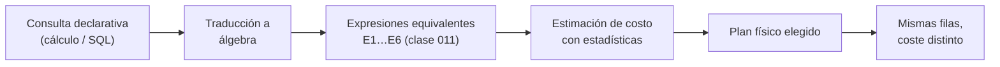

## Propósito

Entender por qué SQL es declarativo. El cálculo relacional describe **qué** se quiere sin decir cómo obtenerlo; su equivalencia con el álgebra es el teorema que autoriza a un optimizador a elegir el cómo.

## Resultados de aprendizaje

Al terminar podrás:

1. Escribir consultas en cálculo relacional de tuplas.
2. Explicar qué es una expresión segura y por qué importa.
3. Enunciar la completitud relacional y qué implica para SQL.
4. Reconocer los cuantificadores ∃ y ∀ detrás de `EXISTS` y `NOT EXISTS`.
5. Argumentar qué preguntas quedan fuera del cálculo relacional puro.

## Fundamentos

### La forma de una expresión

Una consulta en cálculo de tuplas se escribe:

```text
{ t | P(t) }
```

«el conjunto de tuplas `t` que cumplen el predicado `P`». No hay orden de operaciones, no hay reuniones explícitas, no hay decisión sobre índices: solo una condición lógica.

Ejemplo: estudiantes con nota mayor que 6 en algún curso.

```text
{ s | s ∈ students ∧ ∃e ∈ enrollments ( e.student_id = s.id ∧ e.nota > 6.0 ) }
```

El paralelo con SQL es directo, y no por casualidad:

```sql
SELECT * FROM students s
WHERE EXISTS (SELECT 1 FROM enrollments e
              WHERE e.student_id = s.id AND e.nota > 6.0);
```

`EXISTS` **es** el ∃. `NOT EXISTS` combinado con negación **es** el ∀, porque `∀x P(x) ≡ ¬∃x ¬P(x)`. De ahí la doble negación de la división relacional de la clase 011: no es un truco, es la traducción literal del cuantificador universal.

### Expresiones seguras

El cálculo permite escribir cosas sin sentido computable:

```text
{ t | ¬(t ∈ students) }
```

«todas las tuplas que no son estudiantes»: un conjunto infinito. Una expresión es **segura** si su resultado está contenido en el dominio de los valores que aparecen en la base de datos. SQL fuerza la seguridad por construcción: toda consulta parte de un `FROM`, así que el universo siempre está acotado.

Es la razón por la que no existe en SQL un `SELECT` sin origen que devuelva «todo lo demás».

### Completitud relacional

**Teorema (Codd).** El cálculo relacional seguro y el álgebra relacional tienen exactamente el mismo poder expresivo: toda consulta escribible en uno lo es en el otro.

Un lenguaje es *relacionalmente completo* si expresa todo lo del álgebra. SQL lo es, y además la excede con agregación, ordenación, recursión y funciones de ventana, que **no** forman parte del álgebra relacional original.

La consecuencia práctica es toda la arquitectura de un motor moderno:



Si el cálculo no fuese equivalente al álgebra, el motor no podría reescribir la consulta: tendría que ejecutar literalmente lo que se escribió, como hacían los sistemas anteriores a 1970.

### Lo que el cálculo relacional no expresa

| Pregunta | ¿Cálculo relacional puro? | Cómo se resuelve |
|---|---|---|
| «¿Cuántos estudiantes hay?» | No: la agregación no es relacional | Extensión de SQL (`COUNT`) |
| «Los 10 mejores promedios» | No: exige orden | `ORDER BY` + `LIMIT` |
| «Todos los prerrequisitos, a cualquier profundidad» | No: cierre transitivo | CTE recursiva (clase 018) |
| «El promedio móvil de 3 períodos» | No | Función de ventana |
| «¿Está inscrito en algún curso?» | Sí (∃) | `EXISTS` |
| «¿Está en todos los obligatorios?» | Sí (∀) | Doble `NOT EXISTS` |

El límite del cierre transitivo es históricamente importante: es el motivo por el que las bases de datos de grafos existen (clase 028) y por el que SQL:1999 añadió `WITH RECURSIVE`.

## Ejemplo trabajado

Pregunta: *«estudiantes que no están inscritos en ningún curso del período 2026-1»*.

**Cálculo:**

```text
{ s | s ∈ students ∧ ¬∃e ∈ enrollments (
        e.student_id = s.id ∧
        ∃c ∈ courses ( c.id = e.course_id ∧ c.periodo = '2026-1' ) ) }
```

**SQL, traducción literal:**

```sql
SELECT s.*
FROM students s
WHERE NOT EXISTS (
  SELECT 1 FROM enrollments e
  JOIN courses c ON c.id = e.course_id
  WHERE e.student_id = s.id AND c.periodo = '2026-1'
);
```

**Álgebra, misma consulta:**

```text
students − π_students.*( students ⋈ enrollments ⋈ σ_periodo='2026-1'(courses) )
```

Las tres formulaciones devuelven el mismo conjunto. La tercera hace explícita la diferencia (`−`), que es lo que un plan de ejecución llamará *anti-join*.

**Contraste con la trampa de `NOT IN`:**

```sql
SELECT * FROM students
WHERE id NOT IN (SELECT student_id FROM enrollments);   -- peligroso
```

Si `enrollments.student_id` admite nulos y hay uno solo, el resultado es **vacío**, no el esperado. La razón es la lógica de tres valores (clase 019): `id NOT IN (1, 2, NULL)` se evalúa como `id<>1 ∧ id<>2 ∧ id<>NULL`, y el último término es `UNKNOWN`, que nunca es verdadero.

`NOT EXISTS` no sufre este problema porque no compara valores: comprueba la existencia de filas. Esta es la razón técnica —no estilística— para preferirlo.

**Traza numérica:** con 2 000 estudiantes, 1 fila con `student_id` nulo basta para que `NOT IN` devuelva 0 filas en lugar de las 340 correctas. Un fallo silencioso de 340 registros perdidos.

## Comparación

| Aspecto | Álgebra | Cálculo | SQL |
|---|---|---|---|
| Estilo | Procedimental | Declarativo | Declarativo |
| Especifica el orden | Sí | No | No |
| Riesgo de expresión insegura | No | Sí | No (acotado por `FROM`) |
| Poder expresivo | Igual | Igual | Mayor |
| Uso real | Interno del motor | Fundamento teórico | Interfaz del usuario |

## Errores frecuentes

1. **Usar `NOT IN` con subconsulta que puede devolver nulos.** Devuelve vacío sin avisar.
2. **Creer que el orden de los `JOIN` escritos es el ejecutado.** La equivalencia autoriza al motor a reordenar.
3. **Intentar expresar «todos» con `IN`.** `IN` es ∃; para ∀ hace falta la doble negación.
4. **Esperar cierre transitivo sin recursión.** Un `JOIN` de profundidad fija no recorre jerarquías de profundidad variable.
5. **Confundir declarativo con «el motor lo hará bien siempre».** El motor elige el cómo, pero con estadísticas malas elige mal (clase 042).

## De la clase a la operación

Cuando una consulta con `NOT IN` empieza a devolver menos filas tras una carga de datos, la causa casi siempre es un nulo nuevo en la subconsulta. Conocer el fundamento lógico convierte un misterio de tres días en una comprobación de tres minutos.

## Reto de transferencia

1. Escribe en cálculo de tuplas dos consultas reales de tu trabajo, una con ∃ y otra con ∀.
2. Tradúcelas a SQL y al álgebra.
3. Construye el caso con nulos que rompe la versión con `NOT IN` y captura la evidencia.
4. Formula una pregunta de tu dominio que exija cierre transitivo y explica por qué queda fuera del cálculo.

## Preguntas de evaluación

1. ¿Por qué toda consulta SQL es automáticamente una expresión segura?
2. Traduce `∀c ∈ obligatorios: inscrito(s, c)` a SQL y explica cada negación.
3. Da un caso real donde `NOT IN` y `NOT EXISTS` devuelvan resultados distintos, con datos concretos.
4. ¿Qué le añade SQL al álgebra relacional, y por qué esas adiciones no rompen la capacidad de optimizar?
