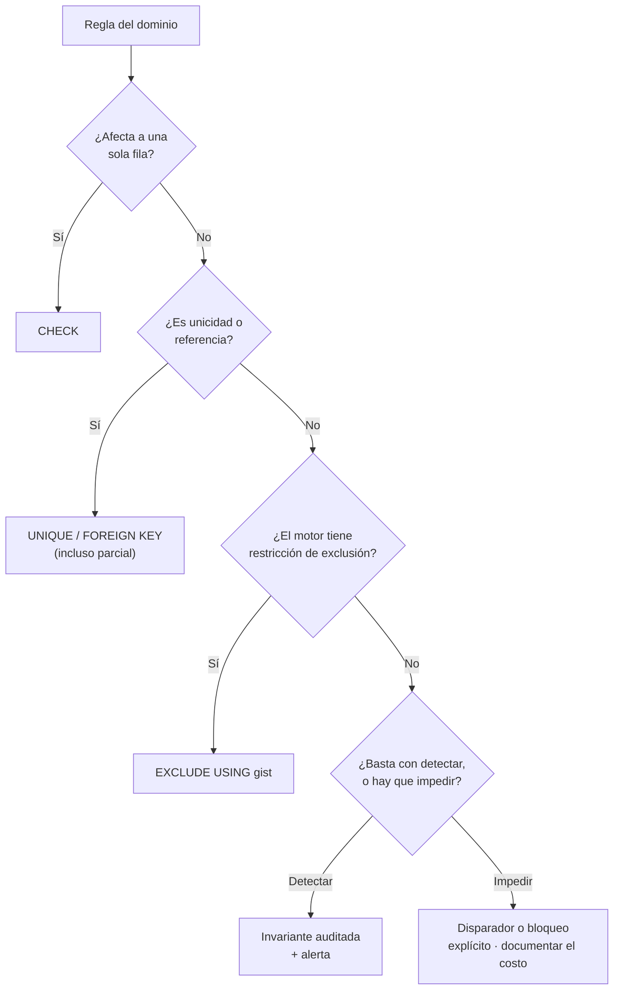

# 013 — Integridad: restricciones, claves foraneas y acciones referenciales

> [Programa](../../../README.md) · [Parte 02](../README.md) · [← Anterior](../../part-02-modelo-relacional-y-algebra/012-calculo-relacional-y-equivalencia/README.md) · [Siguiente →](../../part-03-sql-en-profundidad/014-ddl-el-esquema-como-contrato/README.md)

Parte 02 — Modelo relacional y álgebra · Intermedio ·
3 horas estimadas · motores `postgresql`, `sqlite`, `mysql` · laboratorio
[`labs/01-sql-foundations`](../../../labs/01-sql-foundations/README.md) · 4 fuentes.

**Conceptos centrales:** `integridad de entidad` · `integridad referencial` · `CHECK` · `ON DELETE` · `aplazamiento`

---

## Propósito

Convertir las reglas del dominio en restricciones que el motor haga cumplir para todos los clientes. Una regla que vive solo en la aplicación es una regla que algún día alguien saltará.

## Resultados de aprendizaje

Al terminar podrás:

1. Distinguir integridad de entidad, referencial, de dominio y definida por el usuario.
2. Elegir la acción referencial correcta y justificar su efecto sobre los datos.
3. Usar restricciones diferidas y saber qué motores las soportan.
4. Reconocer qué reglas **no** puede expresar una restricción declarativa.
5. Escribir la invariante que audita lo que el motor no puede garantizar.

## Fundamentos

### Los cuatro tipos

| Tipo | Qué garantiza | Mecanismo |
|---|---|---|
| **De entidad** | Toda fila es identificable; la clave no es nula | `PRIMARY KEY` |
| **Referencial** | Toda referencia apunta a algo existente | `FOREIGN KEY` |
| **De dominio** | Cada valor pertenece a su dominio | Tipo + `CHECK` + `NOT NULL` |
| **Definida por el usuario** | Reglas de negocio arbitrarias | `CHECK`, restricciones diferidas, disparadores |

Codd (1979) añadió al modelo original la discusión de los nulos y la integridad de entidad. La regla que de ahí se deriva es tajante: **ningún componente de una clave primaria puede ser nulo**, porque un identificador desconocido no identifica.

### Acciones referenciales

Al borrar o actualizar la fila referenciada, el motor puede hacer cinco cosas:

| Acción | Efecto | Cuándo es correcta |
|---|---|---|
| `NO ACTION` / `RESTRICT` | Impide la operación | Por defecto sensato: obliga a decidir explícitamente |
| `CASCADE` | Propaga el borrado o el cambio | Composición real: líneas de una factura, tabla puente |
| `SET NULL` | Deja la referencia en nulo | La relación es opcional y su ausencia tiene sentido |
| `SET DEFAULT` | Apunta a un valor por defecto | Existe un «sin asignar» legítimo |

La diferencia entre `NO ACTION` y `RESTRICT` es sutil y real: `RESTRICT` comprueba de inmediato; `NO ACTION` puede diferirse al final de la sentencia o de la transacción, lo que permite reasignar filas dentro de la misma operación.

**Regla de criterio:** `CASCADE` en datos históricos o contables es casi siempre un error. Borrar un curso no debería borrar el registro de que alguien lo cursó y obtuvo una nota; eso destruye evidencia. La alternativa es el borrado lógico con una marca y una restricción parcial.

### Restricciones diferidas

Algunas reglas son imposibles de satisfacer fila a fila. Un ciclo obligatorio —«todo departamento tiene un jefe, y todo jefe pertenece a un departamento»— no admite una primera inserción válida si las restricciones se comprueban de inmediato.

```sql
ALTER TABLE departments
  ADD CONSTRAINT dept_jefe_fk FOREIGN KEY (jefe_id) REFERENCES employees(id)
  DEFERRABLE INITIALLY DEFERRED;
```

Con esto, la comprobación ocurre en el `COMMIT`: dentro de la transacción el estado puede ser transitoriamente inconsistente, y al confirmar debe ser válido. Es exactamente la «C» de ACID (clase 033).

Soporte real: PostgreSQL y Oracle lo ofrecen; MySQL no de esta forma; SQLite solo para claves foráneas declaradas como diferidas y con `PRAGMA foreign_keys = ON`.

### Lo que no se puede declarar



Ejemplos de reglas fuera del alcance de un `CHECK` estándar: «la suma de los porcentajes de un reparto es 100», «no hay dos reservas solapadas en la misma sala», «todo curso tiene al menos un profesor». La primera y la tercera exigen mirar varias filas; la segunda tiene solución declarativa solo en PostgreSQL, con restricciones de exclusión sobre rangos.

## Ejemplo trabajado

Reglas del dominio y su traducción:

```sql
CREATE TABLE courses (
  id         INTEGER PRIMARY KEY,
  nombre     TEXT    NOT NULL CHECK (length(trim(nombre)) > 0),
  periodo    TEXT    NOT NULL CHECK (periodo GLOB '[0-9][0-9][0-9][0-9]-[12]'),
  cupo       INTEGER NOT NULL CHECK (cupo BETWEEN 1 AND 500),
  UNIQUE (nombre, periodo)
);

CREATE TABLE enrollments (
  student_id INTEGER NOT NULL REFERENCES students(id) ON DELETE RESTRICT,
  course_id  INTEGER NOT NULL REFERENCES courses(id)  ON DELETE RESTRICT,
  nota       NUMERIC(2,1) CHECK (nota IS NULL OR nota BETWEEN 1.0 AND 7.0),
  estado     TEXT NOT NULL DEFAULT 'activa'
             CHECK (estado IN ('activa','retirada','anulada')),
  PRIMARY KEY (student_id, course_id)
);
```

Qué garantiza cada línea, sin excepciones y para todo cliente:

- `NOT NULL` en `nombre`: no hay cursos anónimos. El `CHECK` con `trim` impide además el nombre de solo espacios, que `NOT NULL` sí permite.
- `UNIQUE (nombre, periodo)`: no hay dos «Bases de datos» en 2026-1. La regla de negocio queda escrita una vez.
- `nota BETWEEN 1.0 AND 7.0` **o nula**: una inscripción sin calificar es válida; una nota de 9,5 no lo es. Sin el `OR nota IS NULL`, la restricción se evaluaría como `UNKNOWN` para nulos y **los aceptaría igual** — conviene escribirlo explícito para que el lector no dude.
- `ON DELETE RESTRICT` en ambas: borrar un estudiante con inscripciones falla. Correcto: el historial académico es evidencia.

**Lo que este esquema no garantiza:** el cupo. La regla «no se puede inscribir más gente que el cupo» compara un conteo con un valor de otra tabla, y ningún `CHECK` estándar lo permite.

Las tres soluciones, con su precio:

```sql
-- 1. Detección: barata, honesta, deja ventana de incumplimiento
SELECT c.id, c.cupo, COUNT(e.student_id) AS inscritos
FROM courses c JOIN enrollments e ON e.course_id = c.id AND e.estado = 'activa'
GROUP BY c.id, c.cupo
HAVING COUNT(e.student_id) > c.cupo;
```

```sql
-- 2. Prevención con bloqueo explícito, dentro de la transacción
BEGIN;
SELECT cupo FROM courses WHERE id = :curso FOR UPDATE;      -- serializa los inscritos de ESE curso
INSERT INTO enrollments (student_id, course_id) VALUES (:est, :curso);
-- comprobar el conteo y abortar si excede
COMMIT;
```

```sql
-- 3. Contador desnormalizado con disparador (clase 009), con su invariante
```

La opción 2 es correcta y tiene un costo declarado: todas las inscripciones al mismo curso se serializan. Con un curso muy demandado, eso es una cola. La opción 1 no impide nada pero cuesta cero en el camino de escritura. La decisión depende de si un cupo excedido es un incidente grave o algo que se corrige a mano.

**Nota sobre SQLite:** las claves foráneas no se aplican salvo que se active `PRAGMA foreign_keys = ON` en **cada conexión**. Es la causa más común de referencias colgantes en proyectos que usan SQLite; el laboratorio del repositorio lo activa explícitamente y comprueba con `PRAGMA foreign_key_check`.

## Comparación

| Regla | Declarativa | Motor | Costo |
|---|---|---|---|
| Valor en un rango | `CHECK` | Todos | Nulo |
| Unicidad condicional | Índice único parcial | PostgreSQL, SQLite | Nulo |
| Referencia válida | `FOREIGN KEY` | Todos (SQLite con pragma) | Índice en el hijo |
| Sin solapamiento de rangos | `EXCLUDE USING gist` | Solo PostgreSQL | Índice GiST |
| Ciclo obligatorio | `DEFERRABLE` | PostgreSQL, Oracle | Nulo |
| Suma de un grupo | — | Ninguno | Disparador o invariante |

## Errores frecuentes

1. **Dejar la validación solo en la aplicación.** El script de migración, la consola y el próximo microservicio no la ejecutarán.
2. **`ON DELETE CASCADE` por comodidad.** Sobre datos históricos destruye evidencia sin dejar rastro.
3. **Olvidar `PRAGMA foreign_keys = ON` en SQLite.** Las claves foráneas quedan como documentación decorativa.
4. **`CHECK` que ignora los nulos.** Un `CHECK (nota BETWEEN 1 AND 7)` acepta nulos porque `UNKNOWN` no es falso.
5. **No indexar la columna hija de una clave foránea.** Cada borrado en el padre provoca un barrido completo del hijo.

## De la clase a la operación

Los datos sucios llegan por el camino que nadie vigilaba: una carga masiva, un arreglo manual, un servicio nuevo. Las restricciones declaradas son el único control que se aplica a todos los caminos, incluidos los que aún no existen.

## Reto de transferencia

1. Elige tres reglas de negocio reales y decláralas como restricciones.
2. Identifica una que el motor no pueda expresar y escribe su invariante.
3. Implementa la prevención con bloqueo explícito y mide su efecto en concurrencia.
4. Documenta qué acción referencial elegiste en cada clave foránea y por qué.

## Preguntas de evaluación

1. ¿Por qué un `CHECK` no rechaza los nulos y qué hay que escribir para que lo haga?
2. Da un caso de tu dominio donde `CASCADE` destruiría información que debe conservarse.
3. Explica con una traza por qué el ciclo obligatorio necesita restricciones diferidas.
4. Elige entre detectar y prevenir para la regla del cupo, y defiende la elección con el costo de cada una.

---

## Laboratorio

```bash
python scripts/validate_repository.py
python labs/01-sql-foundations/run_lab.py
```

Guarda como evidencia la salida completa, la versión del motor y la semilla o
los parámetros usados. Una captura sin comando no es evidencia: no se puede
repetir.

## Evaluación

| Criterio | Peso | Qué se comprueba |
|---|---:|---|
| Comprensión conceptual | 25 % | Explica el mecanismo, no solo el resultado |
| Ejecución reproducible | 25 % | Otra persona obtiene lo mismo con las instrucciones dadas |
| Interpretación basada en evidencia | 25 % | Cada conclusión se apoya en una salida o una medición |
| Límites y riesgos declarados | 25 % | Dice qué no demuestra el ejercicio y qué faltaría en producción |

La clase se da por superada cuando la respuesta explica el mecanismo, muestra
la salida que la respalda y declara al menos un límite del ejercicio.

## Fuentes de esta clase

Todo lo afirmado arriba procede de estas obras. Los identificadores viven en
[`catalog/sources.json`](../../../catalog/sources.json) y el estado de los
enlaces se comprueba con `python scripts/check_external_links.py`.

- **E. F. Codd** (1979). [Extending the Database Relational Model to Capture More Meaning](https://dl.acm.org/doi/10.1145/320107.320109). ACM TODS 4(4). DOI [10.1145/320107.320109](https://doi.org/10.1145/320107.320109).  
  Introduce los valores nulos y la semántica de información faltante.
- **C. J. Date** (2015). [SQL and Relational Theory: How to Write Accurate SQL Code](https://www.oreilly.com/library/view/sql-and-relational/9781491941164/). 3.a ed. O'Reilly. ISBN 978-1-4919-4117-1.  
  Separa el modelo relacional de lo que SQL realmente implementa, incluidos los nulos.
- **PostgreSQL Global Development Group** (2026). [PostgreSQL Documentation](https://www.postgresql.org/docs/current/).  
  Documentación de referencia del motor relacional principal del programa.
- **ISO/IEC JTC 1/SC 32** (2023). [ISO/IEC 9075: Information technology - Database languages - SQL](https://www.iso.org/standard/76583.html).  
  Norma del lenguaje SQL. Ningún motor la implementa por completo.

---

> [Programa](../../../README.md) · [Parte 02](../README.md) · [← Anterior](../../part-02-modelo-relacional-y-algebra/012-calculo-relacional-y-equivalencia/README.md) · [Siguiente →](../../part-03-sql-en-profundidad/014-ddl-el-esquema-como-contrato/README.md)
