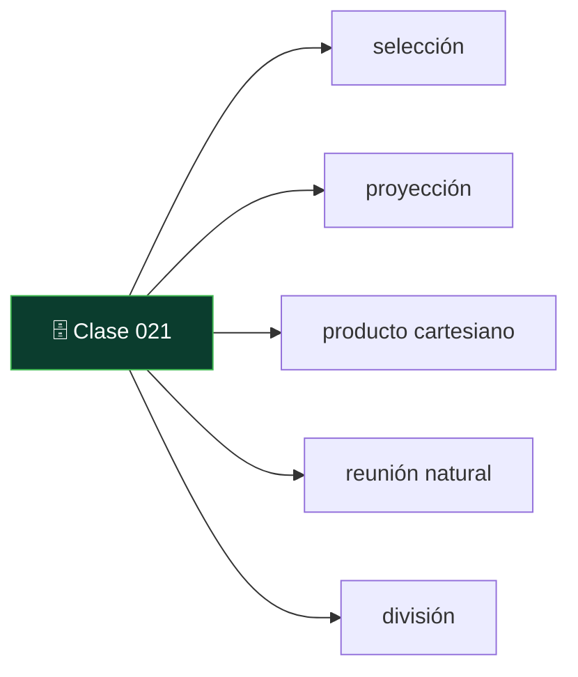
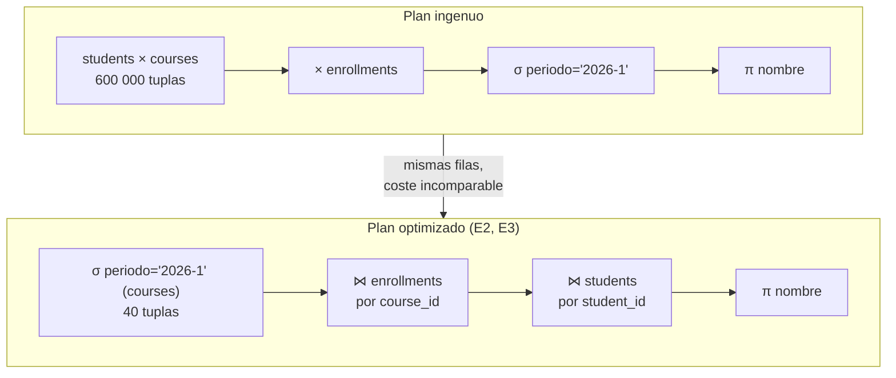

# 021 — Álgebra relacional: selección, proyección, producto y reunión

   

> [Programa](../../../README.md) · [Parte 03](../README.md) · [← Anterior](../../part-03-modelo-relacional-y-algebra/020-la-relacion-como-conjunto/README.md) · [Siguiente →](../../part-03-modelo-relacional-y-algebra/022-calculo-relacional-y-equivalencia/README.md)

Parte 03 — Modelo relacional y álgebra · Fundamentos ·
4 horas estimadas · motores `postgresql`, `sqlite` · laboratorio
[`labs/01-sql-foundations`](../../../labs/01-sql-foundations/README.md) · 3 fuentes.

**Conceptos centrales:** `selección` · `proyección` · `producto cartesiano` · `reunión natural` · `división`

**En este caso se comparan 5 motores**: 5 lo resuelven (5 con el resultado comprobado por máquina) y 0 no, con el motivo escrito.



---

## Propósito

Dominar los operadores del álgebra relacional para poder razonar sobre una consulta **antes** de ejecutarla: cuántas filas puede producir, qué la hace cara y por qué el optimizador puede reordenarla sin cambiar el resultado.

## Resultados de aprendizaje

Al terminar podrás:

1. Escribir y leer expresiones con σ, π, ×, ⋈, ∪, −, ρ y ÷.
2. Estimar a mano la cardinalidad de cada operador.
3. Aplicar las equivalencias que usa el optimizador y explicar por qué son válidas.
4. Traducir entre álgebra y SQL en ambos sentidos.
5. Resolver una consulta de división relacional, que SQL no ofrece directamente.

## Fundamentos

### Los operadores

| Operador | Símbolo | Qué hace | Cardinalidad del resultado |
|---|---|---|---|
| Selección | σ<sub>cond</sub>(R) | Filtra tuplas | ≤ \|R\| |
| Proyección | π<sub>attrs</sub>(R) | Se queda con atributos; elimina duplicados | ≤ \|R\| |
| Producto cartesiano | R × S | Cada tupla con cada tupla | \|R\| · \|S\| |
| Reunión natural | R ⋈ S | Producto filtrado por igualdad en atributos comunes | 0 … \|R\|·\|S\| |
| Unión | R ∪ S | Tuplas de ambas (mismo esquema) | ≤ \|R\| + \|S\| |
| Diferencia | R − S | Las de R que no están en S | ≤ \|R\| |
| Renombrado | ρ<sub>x</sub>(R) | Cambia nombres | \|R\| |
| División | R ÷ S | Tuplas de R asociadas a **todas** las de S | ≤ \|R\| |

Selección, proyección, producto, unión y diferencia forman el conjunto **completo**: los demás se derivan. La reunión es `π(σ(R × S))`; la intersección es `R − (R − S)`.

### La cardinalidad decide el costo

El número que hay que vigilar es el producto cartesiano. Con `students` (2 000) y `courses` (300), `students × courses` produce **600 000** tuplas. La reunión natural sobre `enrollments` produce, como mucho, tantas como inscripciones haya. Esta diferencia es el motivo de la primera regla de optimización.

### Equivalencias que aplica el optimizador

```text
E1  σ_c1(σ_c2(R))            ≡  σ_c1 ∧ c2(R)          conmutar y fusionar filtros
E2  σ_c(R × S)               ≡  R ⋈_c S               empujar el filtro dentro
E3  σ_c(R ⋈ S)               ≡  σ_c(R) ⋈ S            si c solo usa atributos de R
E4  π_a(σ_c(R))              ≡  π_a(σ_c(π_a ∪ attrs(c)(R)))   proyección temprana
E5  (R ⋈ S) ⋈ T              ≡  R ⋈ (S ⋈ T)           asociatividad
E6  R ⋈ S                    ≡  S ⋈ R                 conmutatividad
```

Las dos primeras son el corazón de la optimización: **filtrar antes de combinar**. E5 y E6 dan al planificador libertad para elegir el orden de reunión, que es el problema combinatorio que resuelve el optimizador por costos (clase 042).



## Ejemplo trabajado

Pregunta: *«nombres de los estudiantes inscritos en algún curso del período 2026-1»*.

**Álgebra, forma ingenua:**

```text
π_nombre( σ_periodo='2026-1' (students × enrollments × courses) )
```

**Traza de cardinalidad** con 2 000 estudiantes, 240 000 inscripciones y 300 cursos:

```text
students × enrollments            = 2 000 · 240 000 = 480 000 000
(...) × courses                   = 480 000 000 · 300 = 1,44 · 10^11
```

Materializar eso es imposible. Ningún motor lo hace: por eso existe el optimizador.

**Álgebra, forma optimizada** (aplicando E2 y E3):

```text
π_nombre( students ⋈_id=student_id ( enrollments ⋈_course_id=id ( σ_periodo='2026-1'(courses) ) ) )
```

```text
σ periodo (courses)               = 40 cursos
⋈ enrollments                     ≈ 240 000 · (40/300) = 32 000
⋈ students                        = 32 000
π nombre (elimina duplicados)     ≈ 6 000 estudiantes distintos
```

De 1,44 · 10¹¹ a 32 000. **Las dos expresiones devuelven exactamente el mismo conjunto**; esa equivalencia demostrada es lo que autoriza al motor a reescribir.

**SQL correspondiente:**

```sql
SELECT DISTINCT s.nombre
FROM students s
JOIN enrollments e ON e.student_id = s.id
JOIN courses     c ON c.id = e.course_id
WHERE c.periodo = '2026-1';
```

El `DISTINCT` es la proyección relacional; sin él, SQL devuelve un nombre por inscripción (32 000 filas en vez de 6 000). Es la desviación de la clase 010 hecha visible.

**División relacional.** Pregunta: *«estudiantes inscritos en TODOS los cursos obligatorios»*. SQL no tiene operador; la formulación canónica es doble negación —«no existe curso obligatorio que este estudiante no haya cursado»—:

```sql
SELECT s.id, s.nombre
FROM students s
WHERE NOT EXISTS (
  SELECT 1 FROM courses c
  WHERE c.obligatorio = 1
    AND NOT EXISTS (
      SELECT 1 FROM enrollments e
      WHERE e.student_id = s.id AND e.course_id = c.id
    )
);
```

Alternativa por conteo, más legible y con el mismo resultado si `(student_id, course_id)` es único:

```sql
SELECT e.student_id
FROM enrollments e
JOIN courses c ON c.id = e.course_id AND c.obligatorio = 1
GROUP BY e.student_id
HAVING COUNT(DISTINCT e.course_id) = (SELECT COUNT(*) FROM courses WHERE obligatorio = 1);
```

## Comparación

| Álgebra | SQL | Nota |
|---|---|---|
| σ | `WHERE` | Antes de agrupar |
| π | `SELECT DISTINCT` | Sin `DISTINCT` no es proyección relacional |
| × | `CROSS JOIN` | Rara vez intencional |
| ⋈ | `JOIN ... ON` / `NATURAL JOIN` | `NATURAL` es frágil ante columnas nuevas |
| ∪ | `UNION` | `UNION ALL` no es la unión de conjuntos |
| − | `EXCEPT` | `MINUS` en Oracle |
| ÷ | — | Doble `NOT EXISTS` o conteo |
| ρ | `AS` | Necesario en autorreuniones |

## Errores frecuentes

1. **Olvidar la condición de reunión.** Un `JOIN` sin `ON` es un producto cartesiano: no da error, da un resultado enorme y erróneo.
2. **Creer que `JOIN` multiplica filas por error.** Multiplica porque la cardinalidad del lado derecho lo permite; el modelo lo predice.
3. **Traducir π como `SELECT` sin `DISTINCT`.** Cambia el resultado, no solo el rendimiento.
4. **Suponer que el orden de los `JOIN` en el texto es el orden de ejecución.** Por E5 y E6 el motor elige; en SQL solo lo fijan construcciones explícitas.
5. **Resolver una división con `IN`.** `IN` responde «alguno», no «todos».

## De la clase a la operación

Estimar cardinalidades a mano es la habilidad que distingue leer un plan de mirarlo. Cuando `EXPLAIN` dice «filas estimadas: 12» y la realidad son 3 millones, se sabe dónde mirar precisamente porque se sabe cómo debería haberse propagado la cardinalidad.

## Reto de transferencia

1. Escribe en álgebra una consulta real de tu trabajo, en su forma ingenua.
2. Aplica E1–E4 paso a paso y anota la cardinalidad estimada en cada nivel.
3. Ejecuta ambas versiones en SQL y compara el plan y el tiempo.
4. Formula una pregunta de tu dominio que exija división relacional y resuélvela de las dos formas.

## Preguntas de evaluación

1. Demuestra con un contraejemplo que E3 no vale si la condición usa atributos de ambas relaciones.
2. ¿Por qué la intersección no es un operador primitivo?
3. Da una consulta donde omitir `DISTINCT` produzca un total inflado en un informe, con números.
4. Explica por qué la formulación de división con `HAVING COUNT` exige unicidad de `(student_id, course_id)`.

---

## 🌐 El mismo problema en cada motor

**Caso:** Selección, reunión y proyección compuestas en una sola expresión

El álgebra relacional es cerrada: cada operador toma relaciones y devuelve
una relación, así que se pueden encadenar. El caso encadena tres —selección
por curso y nota, reunión con los estudiantes, proyección de dos columnas— y
devuelve quién aprobó DB-101 con 60 o más, con su nota, ordenado por nombre.

Lo que hay que ver no es el resultado, sino que **el orden en que el motor
aplique los operadores no puede cambiarlo**. Que la selección se pueda
empujar antes de la reunión es una equivalencia algebraica, y de ahí sale la
optimización de consultas: reescribir la expresión por otra equivalente y
más barata.

Salida esperada, idéntica en todos los motores que lo resuelven:

| nombre | nota |
|---|---|
| `Ada` | `90` |
| `Grace` | `72` |

El contrato vive en [`motores.yaml`](motores.yaml) y lo comprueba
`python scripts/verificar_equivalencia.py --clase 021`: 5 de
las 5 implementaciones se ejecutan de verdad y su
resultado se compara con esa tabla; el resto se declara como material revisado,
no ejecutado.

| Motor | ¿Resuelve el caso? | Nivel de prueba | Código | Fuente |
|---|---|---|---|---|
| SQLite | sí | núcleo | [código](implementaciones/sqlite/consulta.sql) | [doc oficial](https://sqlite.org/optoverview.html) |
| DuckDB | sí | núcleo | [código](implementaciones/duckdb/consulta.sql) | [doc oficial](https://duckdb.org/docs/stable/guides/meta/explain.html) |
| PostgreSQL | sí | servicio | [código](implementaciones/postgresql/consulta.sql) | [doc oficial](https://www.postgresql.org/docs/current/using-explain.html) |
| MongoDB | sí | servicio | [código](implementaciones/mongodb/consulta.js) | [doc oficial](https://www.mongodb.com/docs/manual/core/aggregation-pipeline-optimization/) |
| Neo4j | sí | servicio | [código](implementaciones/neo4j/consulta.cypher) | [doc oficial](https://neo4j.com/docs/cypher-manual/current/clauses/where/) |

### Los que resuelven el caso

#### SQLite · [`implementaciones/sqlite/consulta.sql`](implementaciones/sqlite/consulta.sql)

✅ **verificado** — se ejecuta en CI sin servicios

```sql
-- motor: sqlite
-- doc: https://sqlite.org/optoverview.html

-- === preparacion ===
CREATE TABLE estudiantes (
    id     INTEGER PRIMARY KEY,
    nombre TEXT NOT NULL
);
CREATE TABLE notas (
    estudiante_id INTEGER NOT NULL,
    curso         TEXT NOT NULL,
    nota          INTEGER NOT NULL,
    PRIMARY KEY (estudiante_id, curso)
);

INSERT INTO estudiantes (id, nombre) VALUES (1, 'Ada'), (2, 'Linus'), (3, 'Grace');
INSERT INTO notas (estudiante_id, curso, nota) VALUES
    (1, 'DB-101', 90),
    (2, 'DB-101', 58),
    (3, 'DB-101', 72),
    (1, 'SE-201', 66),
    (3, 'SE-201', 78);

-- === consulta ===
-- Tres operadores del algebra, en este orden:
--   sigma  (seleccion)  WHERE curso = 'DB-101' AND nota >= 60
--   |X|    (reunion)    JOIN estudiantes ON ...
--   pi     (proyeccion) SELECT nombre, nota
-- El motor puede reordenarlos si el resultado no cambia; eso es exactamente lo
-- que autoriza el algebra y lo que hace el optimizador.
SELECT e.nombre, n.nota
FROM notas n
JOIN estudiantes e ON e.id = n.estudiante_id
WHERE n.curso = 'DB-101' AND n.nota >= 60
ORDER BY e.nombre;
```

- **Por qué sí:** SQL es la implementación práctica del álgebra y aquí se lee sin ruido: una cláusula por operador.
- **Por qué no:** Su optimizador aplica pocas reescrituras, así que no sirve para ver el efecto de las equivalencias algebraicas: el plan se parece demasiado a lo que se escribió.
- 📄 Documentación oficial: <https://sqlite.org/optoverview.html>

#### DuckDB · [`implementaciones/duckdb/consulta.sql`](implementaciones/duckdb/consulta.sql)

✅ **verificado** — se ejecuta en CI sin servicios

```sql
-- motor: duckdb
-- doc: https://duckdb.org/docs/stable/guides/meta/explain.html
-- nota: anteponer EXPLAIN a esta consulta muestra el arbol de operadores con
--       el filtro ya empujado a la hoja: la equivalencia algebraica aplicada.

-- === preparacion ===
CREATE TABLE estudiantes (
    id     INTEGER PRIMARY KEY,
    nombre VARCHAR NOT NULL
);
CREATE TABLE notas (
    estudiante_id INTEGER NOT NULL,
    curso         VARCHAR NOT NULL,
    nota          INTEGER NOT NULL,
    PRIMARY KEY (estudiante_id, curso)
);

INSERT INTO estudiantes (id, nombre) VALUES (1, 'Ada'), (2, 'Linus'), (3, 'Grace');
INSERT INTO notas (estudiante_id, curso, nota) VALUES
    (1, 'DB-101', 90),
    (2, 'DB-101', 58),
    (3, 'DB-101', 72),
    (1, 'SE-201', 66),
    (3, 'SE-201', 78);

-- === consulta ===
-- Tres operadores del algebra, en este orden:
--   sigma  (seleccion)  WHERE curso = 'DB-101' AND nota >= 60
--   |X|    (reunion)    JOIN estudiantes ON ...
--   pi     (proyeccion) SELECT nombre, nota
-- El motor puede reordenarlos si el resultado no cambia; eso es exactamente lo
-- que autoriza el algebra y lo que hace el optimizador.
SELECT e.nombre, n.nota
FROM notas n
JOIN estudiantes e ON e.id = n.estudiante_id
WHERE n.curso = 'DB-101' AND n.nota >= 60
ORDER BY e.nombre;
```

- **Por qué sí:** Su `EXPLAIN` muestra el árbol de operadores casi como se dibuja en el álgebra, con los filtros ya empujados hacia las hojas: es la mejor forma de ver la reescritura sin instalar nada.
- **Por qué no:** Ese mismo optimizador reordena tanto que el plan deja de parecerse a la consulta escrita, lo que confunde a quien está aprendiendo a leerlos.
- 📄 Documentación oficial: <https://duckdb.org/docs/stable/guides/meta/explain.html>

#### PostgreSQL · [`implementaciones/postgresql/consulta.sql`](implementaciones/postgresql/consulta.sql)

✅ **verificado** — se ejecuta contra el motor real levantado con `docker compose`

```sql
-- motor: postgresql
-- doc: https://www.postgresql.org/docs/current/using-explain.html
-- nota: EXPLAIN (ANALYZE) sobre esta consulta nombra los operadores y permite
--       comprobar que la seleccion se aplico antes de la reunion.

DROP TABLE IF EXISTS notas, estudiantes;

-- === preparacion ===
CREATE TABLE estudiantes (
    id     integer PRIMARY KEY,
    nombre text NOT NULL
);
CREATE TABLE notas (
    estudiante_id integer NOT NULL,
    curso         text NOT NULL,
    nota          integer NOT NULL,
    PRIMARY KEY (estudiante_id, curso)
);

INSERT INTO estudiantes (id, nombre) VALUES (1, 'Ada'), (2, 'Linus'), (3, 'Grace');
INSERT INTO notas (estudiante_id, curso, nota) VALUES
    (1, 'DB-101', 90),
    (2, 'DB-101', 58),
    (3, 'DB-101', 72),
    (1, 'SE-201', 66),
    (3, 'SE-201', 78);

-- === consulta ===
-- Tres operadores del algebra, en este orden:
--   sigma  (seleccion)  WHERE curso = 'DB-101' AND nota >= 60
--   |X|    (reunion)    JOIN estudiantes ON ...
--   pi     (proyeccion) SELECT nombre, nota
-- El motor puede reordenarlos si el resultado no cambia; eso es exactamente lo
-- que autoriza el algebra y lo que hace el optimizador.
SELECT e.nombre, n.nota
FROM notas n
JOIN estudiantes e ON e.id = n.estudiante_id
WHERE n.curso = 'DB-101' AND n.nota >= 60
ORDER BY e.nombre;
```

- **Por qué sí:** Es donde la teoría se vuelve visible: `EXPLAIN` nombra los operadores (`Seq Scan`, `Hash Join`, `Filter`) y permite comprobar que la selección se aplicó antes de la reunión aunque estuviera escrita después.
- **Por qué no:** El optimizador decide con estadísticas; si están viejas, elige una expresión equivalente pero mucho más cara, y la culpa parecerá de la consulta.
- 📄 Documentación oficial: <https://www.postgresql.org/docs/current/using-explain.html>

#### MongoDB · [`implementaciones/mongodb/consulta.js`](implementaciones/mongodb/consulta.js)

✅ **verificado** — se ejecuta contra el motor real levantado con `docker compose`

```javascript
// motor: mongodb
// doc: https://www.mongodb.com/docs/manual/core/aggregation-pipeline-optimization/
// nota: la tuberia ES la expresion algebraica escrita en orden. El $match va
//       PRIMERO a proposito: es el empuje del filtro hecho a mano.

// === preparacion ===
db.estudiantes.drop();
db.notas.drop();

db.estudiantes.insertMany([
  { _id: 1, nombre: "Ada" },
  { _id: 2, nombre: "Linus" },
  { _id: 3, nombre: "Grace" },
]);
db.notas.insertMany([
  { estudiante_id: 1, curso: "DB-101", nota: 90 },
  { estudiante_id: 2, curso: "DB-101", nota: 58 },
  { estudiante_id: 3, curso: "DB-101", nota: 72 },
  { estudiante_id: 1, curso: "SE-201", nota: 66 },
  { estudiante_id: 3, curso: "SE-201", nota: 78 },
]);

// === consulta ===
db.notas
  .aggregate([
    { $match: { curso: "DB-101", nota: { $gte: 60 } } },
    { $lookup: { from: "estudiantes", localField: "estudiante_id",
                 foreignField: "_id", as: "e" } },
    { $unwind: "$e" },
    { $project: { _id: 0, nombre: "$e.nombre", nota: 1 } },
    { $sort: { nombre: 1 } },
  ])
  .forEach((d) => print(d.nombre + "|" + d.nota));
```

- **Por qué sí:** Una tubería de agregación **es** una expresión algebraica escrita en orden: `$match` es la selección, `$lookup` la reunión, `$project` la proyección. Y el propio motor reordena etapas cuando puede, igual que un optimizador relacional.
- **Por qué no:** Al escribirse el orden a mano, un `$match` puesto después de un `$lookup` puede procesar millones de documentos de más: aquí el usuario carga con parte del trabajo del optimizador.
- 📄 Documentación oficial: <https://www.mongodb.com/docs/manual/core/aggregation-pipeline-optimization/>

#### Neo4j · [`implementaciones/neo4j/consulta.cypher`](implementaciones/neo4j/consulta.cypher)

✅ **verificado** — se ejecuta contra el motor real levantado con `docker compose`

```cypher
// motor: neo4j
// doc: https://neo4j.com/docs/cypher-manual/current/clauses/where/
// nota: el mismo algebra con otra forma: el patron es la reunion, el WHERE la
//       seleccion y el RETURN la proyeccion.

// === preparacion ===
MATCH (n) DETACH DELETE n;
CREATE (a:Estudiante {nombre: 'Ada'}),
       (l:Estudiante {nombre: 'Linus'}),
       (g:Estudiante {nombre: 'Grace'}),
       (db:Curso {codigo: 'DB-101'}),
       (se:Curso {codigo: 'SE-201'}),
       (a)-[:CURSO {nota: 90}]->(db),
       (l)-[:CURSO {nota: 58}]->(db),
       (g)-[:CURSO {nota: 72}]->(db),
       (a)-[:CURSO {nota: 66}]->(se),
       (g)-[:CURSO {nota: 78}]->(se);

// === consulta ===
MATCH (e:Estudiante)-[r:CURSO]->(c:Curso)
WHERE c.codigo = 'DB-101' AND r.nota >= 60
RETURN e.nombre AS nombre, r.nota AS nota
ORDER BY nombre;
```

- **Por qué sí:** Cypher tiene los mismos operadores con otra forma: el patrón es la reunión, el `WHERE` la selección y el `RETURN` la proyección. Ver el mismo álgebra en dos lenguajes es lo que demuestra que el álgebra no es de SQL.
- **Por qué no:** El producto cartesiano —que en álgebra es un operador más— aquí es un error de diseño: si el patrón no conecta dos partes, Neo4j avisa de un producto cartesiano porque casi nunca es lo que se quería.
- 📄 Documentación oficial: <https://neo4j.com/docs/cypher-manual/current/clauses/where/>

---

## Laboratorio

```bash
python scripts/validate_repository.py
python labs/01-sql-foundations/run_lab.py
```

Guarda como evidencia la salida completa, la versión del motor y la semilla o
los parámetros usados. Una captura sin comando no es evidencia: no se puede
repetir.

## Evaluación

| Criterio | Peso | Qué se comprueba |
|---|---:|---|
| Comprensión conceptual | 25 % | Explica el mecanismo, no solo el resultado |
| Ejecución reproducible | 25 % | Otra persona obtiene lo mismo con las instrucciones dadas |
| Interpretación basada en evidencia | 25 % | Cada conclusión se apoya en una salida o una medición |
| Límites y riesgos declarados | 25 % | Dice qué no demuestra el ejercicio y qué faltaría en producción |

La clase se da por superada cuando la respuesta explica el mecanismo, muestra
la salida que la respalda y declara al menos un límite del ejercicio.

## Fuentes de esta clase

Todo lo afirmado arriba procede de estas obras. Los identificadores viven en
[`catalog/sources.json`](../../../catalog/sources.json) y el estado de los
enlaces se comprueba con `python scripts/check_external_links.py`.

- **Raghu Ramakrishnan, Johannes Gehrke** (2002). [Database Management Systems](https://pages.cs.wisc.edu/~dbbook/). 3.a ed. McGraw-Hill. ISBN 978-0-07-246563-1.  
  Fuerte en álgebra relacional, evaluación de consultas y estructuras de almacenamiento.
- **Hector Garcia-Molina, Jeffrey D. Ullman, Jennifer Widom** (2008). [Database Systems: The Complete Book](http://infolab.stanford.edu/~ullman/dscb.html). 2.a ed. Pearson. ISBN 978-0-13-187325-4.  
  Tratamiento formal de dependencias funcionales, normalización y optimización.
- **Abraham Silberschatz, Henry F. Korth, S. Sudarshan** (2019). [Database System Concepts](https://db-book.com/). 7.a ed. McGraw-Hill. ISBN 978-0-07-802215-9.  
  Texto de referencia universitario. El sitio oficial publica diapositivas y capítulos de muestra.

---

> [Programa](../../../README.md) · [Parte 03](../README.md) · [← Anterior](../../part-03-modelo-relacional-y-algebra/020-la-relacion-como-conjunto/README.md) · [Siguiente →](../../part-03-modelo-relacional-y-algebra/022-calculo-relacional-y-equivalencia/README.md)
