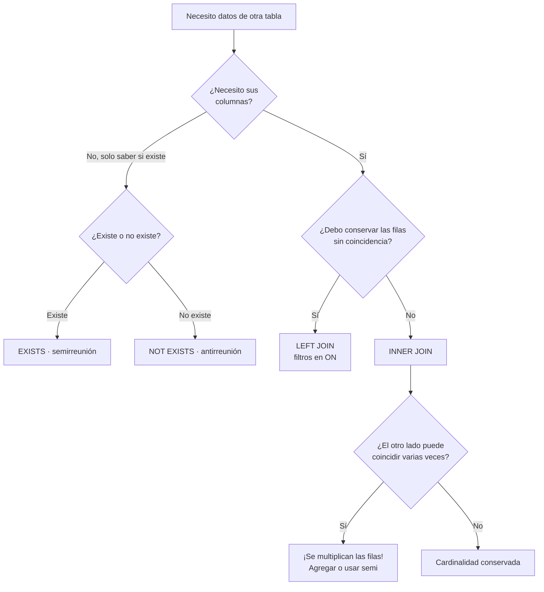

# 016 — Reuniones: interna, externa, semi y anti

> [Programa](../../../README.md) · [Parte 03](../README.md) · [← Anterior](../../part-03-sql-en-profundidad/015-select-filtrado-proyeccion-y-orden/README.md) · [Siguiente →](../../part-03-sql-en-profundidad/017-agregacion-group-by-y-having/README.md)

| | |
|---|---|
| **Parte** | 03 — SQL en profundidad |
| **Nivel** | Intermedio |
| **Horas estimadas** | 4 |
| **Motores** | `postgresql`, `sqlite`, `mysql` |
| **Laboratorio** | [`labs/01-sql-foundations`](../../../labs/01-sql-foundations/README.md) |
| **Fuentes** | 3 |

**Conceptos centrales:** `reunión interna` · `reunión externa` · `semirreunion` · `antirreunion` · `multiplicación de filas`

---

## Propósito

Combinar tablas sin multiplicar filas por accidente. La reunión es la operación que más resultados incorrectos produce, y casi siempre en silencio: el informe sale, solo que con números inflados.

## Resultados de aprendizaje

Al terminar podrás:

1. Predecir la cardinalidad de una reunión a partir de las cardinalidades de sus lados.
2. Distinguir reunión interna, externa, semi y anti, y elegir la correcta.
3. Explicar por qué mover una condición de `ON` a `WHERE` convierte una externa en interna.
4. Detectar y corregir el doble conteo al agregar sobre varias reuniones.
5. Reconocer los tres algoritmos físicos de reunión y cuándo elige cada uno el motor.

## Fundamentos

### Cardinalidad: la regla que evita el 90 % de los errores

Al reunir `A` con `B` por una condición de igualdad, cada fila de `A` se empareja con **todas** las de `B` que coincidan.

| Relación entre los lados | Filas resultantes |
|---|---|
| Clave a clave (1:1) | ≤ min(\|A\|, \|B\|) |
| Clave a clave foránea (1:N) | ≤ \|B\| |
| N:M sin restricción | Hasta \|A\| · \|B\| |
| Sin condición (`CROSS JOIN`) | \|A\| · \|B\| |

Regla práctica: **una reunión solo conserva la cardinalidad de la tabla base si el otro lado está restringido a lo sumo a una fila coincidente**. Si no lo está, la tabla base se multiplica.

### Los cuatro tipos semánticos

| Tipo | Pregunta que responde | SQL |
|---|---|---|
| **Interna** | «Los que coinciden, con datos de ambos» | `JOIN ... ON` |
| **Externa** | «Todos los de un lado, con lo que haya del otro» | `LEFT/RIGHT/FULL JOIN` |
| **Semi** | «¿Existe al menos una coincidencia?» — sin traer columnas | `WHERE EXISTS (...)` |
| **Anti** | «¿No existe ninguna coincidencia?» | `WHERE NOT EXISTS (...)` |

La distinción crucial: **semi y anti no multiplican filas**. Si solo necesitas saber si hay coincidencia, una semirreunión da el resultado correcto sin `DISTINCT` y suele ser más rápida, porque el motor se detiene en la primera coincidencia.

```sql
-- MAL: multiplica si hay varias inscripciones
SELECT DISTINCT s.* FROM students s JOIN enrollments e ON e.student_id = s.id;

-- BIEN: semirreunión, sin multiplicación ni DISTINCT
SELECT s.* FROM students s
WHERE EXISTS (SELECT 1 FROM enrollments e WHERE e.student_id = s.id);
```

### `ON` frente a `WHERE` en reuniones externas

En una reunión externa, el lugar de la condición cambia el resultado:

- Una condición en `ON` se aplica **al emparejar**: las filas no emparejadas del lado izquierdo sobreviven con nulos.
- Una condición en `WHERE` se aplica **después**: como los nulos no cumplen ninguna comparación, elimina las filas no emparejadas y la reunión se vuelve interna de hecho.

```sql
-- Todos los estudiantes; los que no tienen nota alta salen con NULL
SELECT s.nombre, e.nota
FROM students s
LEFT JOIN enrollments e ON e.student_id = s.id AND e.nota > 6.0;

-- Solo los que tienen nota alta: el LEFT es decorativo
SELECT s.nombre, e.nota
FROM students s
LEFT JOIN enrollments e ON e.student_id = s.id
WHERE e.nota > 6.0;
```

En reuniones **internas** da igual dónde vaya la condición: son equivalentes y el optimizador las trata igual (equivalencia E2 de la clase 011).

### Los tres algoritmos físicos

| Algoritmo | Cómo funciona | Cuándo lo elige el motor | Coste aproximado |
|---|---|---|---|
| Bucle anidado | Por cada fila del externo, buscar en el interno | Externo pequeño e índice en el interno | \|A\| · log\|B\| |
| Hash | Construir tabla hash del menor, sondear con el mayor | Sin índice útil, cabe en memoria | \|A\| + \|B\| |
| Fusión | Ordenar ambos y recorrerlos a la vez | Ya ordenados o hay índices | \|A\|log\|A\| + \|B\|log\|B\| |

Ver un bucle anidado sobre dos tablas grandes en un plan es casi siempre la señal de un índice ausente o de una estimación de cardinalidad equivocada (clase 042).



## Ejemplo trabajado

Objetivo: *«por cada curso, número de inscritos y número de profesores»*.

Intento directo:

```sql
SELECT c.id,
       COUNT(DISTINCT e.student_id) AS inscritos,
       COUNT(DISTINCT t.teacher_id) AS profesores
FROM courses c
LEFT JOIN enrollments e ON e.course_id = c.id
LEFT JOIN teaching    t ON t.course_id = c.id
GROUP BY c.id;
```

**Traza del problema.** Para un curso con 40 inscritos y 3 profesores, la primera reunión produce 40 filas y la segunda multiplica cada una por 3: **120 filas** para ese curso. Sin `DISTINCT`, `COUNT(e.student_id)` daría 120 en lugar de 40, y `COUNT(t.teacher_id)` daría 120 en lugar de 3. Es el **doble conteo**, el error de reunión más caro porque el resultado es plausible.

El `DISTINCT` corrige el número, pero no el trabajo: el motor sigue materializando 120 filas por curso. Con 300 cursos y esa proporción, 36 000 filas intermedias para producir 300.

**Forma correcta: agregar antes de reunir.**

```sql
SELECT c.id,
       COALESCE(i.inscritos, 0)  AS inscritos,
       COALESCE(p.profesores, 0) AS profesores
FROM courses c
LEFT JOIN (SELECT course_id, COUNT(*) AS inscritos
           FROM enrollments GROUP BY course_id) i ON i.course_id = c.id
LEFT JOIN (SELECT course_id, COUNT(*) AS profesores
           FROM teaching   GROUP BY course_id) p ON p.course_id = c.id;
```

Cada subconsulta devuelve **una fila por curso**, así que ninguna reunión multiplica. Además `COALESCE` convierte el nulo de los cursos sin inscritos en 0, que es lo que un informe espera.

**Comprobación numérica:**

| Enfoque | Filas intermedias | Resultado correcto |
|---|---:|---|
| Doble `LEFT JOIN` sin `DISTINCT` | 36 000 | No (120 / 120) |
| Doble `LEFT JOIN` con `DISTINCT` | 36 000 | Sí (40 / 3) |
| Agregación previa | 600 | Sí (40 / 3) |

**Antirreunión con la trampa de los nulos.** «Estudiantes sin ninguna inscripción»:

```sql
-- correcto en cualquier caso
SELECT s.* FROM students s
WHERE NOT EXISTS (SELECT 1 FROM enrollments e WHERE e.student_id = s.id);

-- también correcto, forma clásica
SELECT s.* FROM students s
LEFT JOIN enrollments e ON e.student_id = s.id
WHERE e.student_id IS NULL;

-- ROTO si enrollments.student_id admite nulos
SELECT * FROM students
WHERE id NOT IN (SELECT student_id FROM enrollments);
```

La tercera devuelve cero filas si existe un solo `student_id` nulo (clase 012).

## Comparación

| Necesidad | Construcción | Multiplica filas |
|---|---|---|
| Datos de ambos lados | `INNER JOIN` | Sí, si el otro lado repite |
| Conservar los sin pareja | `LEFT JOIN`, filtro en `ON` | Sí |
| Saber si existe | `EXISTS` | No |
| Saber si no existe | `NOT EXISTS` | No |
| Contar de dos hijos a la vez | Agregación previa por hijo | No |
| Traer una fila «la más reciente» | `LATERAL` / ventana con filtro | No |

## Errores frecuentes

1. **`DISTINCT` para tapar una reunión que multiplica.** Arregla el número y esconde la causa; el costo sigue ahí.
2. **Poner el filtro del lado derecho en `WHERE` con `LEFT JOIN`.** Anula la externa sin avisar.
3. **Reunir dos tablas hijas y agregar.** Doble conteo asegurado.
4. **`NOT IN` con subconsulta que admite nulos.** Resultado vacío.
5. **Olvidar `COALESCE` tras una externa.** Los nulos se propagan a las sumas y aparecen totales nulos.
6. **`NATURAL JOIN`.** Reúne por *todas* las columnas de igual nombre; añadir una columna `created_at` a ambas tablas cambia el resultado.

## De la clase a la operación

Un informe con totales inflados es más peligroso que uno que falla: nadie lo revisa porque «funciona». Contrastar siempre un agregado con un conteo independiente es la práctica que los detecta.

## Reto de transferencia

1. Localiza en tu código una consulta con `DISTINCT` sobre una reunión y determina por qué está ahí.
2. Reescríbela con agregación previa o semirreunión, y compara filas intermedias y tiempo.
3. Construye el caso de doble conteo con datos tuyos y muestra los dos totales.
4. Demuestra con una traza el cambio de resultado al mover una condición de `ON` a `WHERE`.

## Preguntas de evaluación

1. Con `A` de 1 000 filas y `B` de 50 000 con clave foránea a `A`, ¿cuántas filas produce `A JOIN B`? ¿Y `A LEFT JOIN B`?
2. Explica por qué `EXISTS` no necesita `DISTINCT`.
3. Da una consulta tuya donde el doble conteo pasaría desapercibido, e indica cómo lo detectarías.
4. ¿Por qué un bucle anidado sobre dos tablas grandes es una señal de alarma en un plan?

---

## Laboratorio

```bash
python scripts/validate_repository.py
python labs/01-sql-foundations/run_lab.py
```

Guarda como evidencia la salida completa, la versión del motor y la semilla o
los parámetros usados. Una captura sin comando no es evidencia: no se puede
repetir.

## Evaluación

| Criterio | Peso | Qué se comprueba |
|---|---:|---|
| Comprensión conceptual | 25 % | Explica el mecanismo, no solo el resultado |
| Ejecución reproducible | 25 % | Otra persona obtiene lo mismo con las instrucciones dadas |
| Interpretación basada en evidencia | 25 % | Cada conclusión se apoya en una salida o una medición |
| Límites y riesgos declarados | 25 % | Dice qué no demuestra el ejercicio y qué faltaría en producción |

La clase se da por superada cuando la respuesta explica el mecanismo, muestra
la salida que la respalda y declara al menos un límite del ejercicio.

## Fuentes de esta clase

Todo lo afirmado arriba procede de estas obras. Los identificadores viven en
[`catalog/sources.json`](../../../catalog/sources.json) y el estado de los
enlaces se comprueba con `python scripts/check_external_links.py`.

- **Markus Winand** (2012). [SQL Performance Explained](https://use-the-index-luke.com/). Markus Winand. ISBN 978-3-9503078-2-5.  
  Versión web gratuita. Índices B-Tree y su relación con el orden de las columnas.
- **Anthony Molinaro, Robert de Graaf** (2020). [SQL Cookbook](https://www.oreilly.com/library/view/sql-cookbook-2nd/9781492077435/). 2.a ed. O'Reilly. ISBN 978-1-4920-7744-2.  
  Recetas comparadas entre dialectos, útil para la matriz de portabilidad.
- **C. J. Date** (2015). [SQL and Relational Theory: How to Write Accurate SQL Code](https://www.oreilly.com/library/view/sql-and-relational/9781491941164/). 3.a ed. O'Reilly. ISBN 978-1-4919-4117-1.  
  Separa el modelo relacional de lo que SQL realmente implementa, incluidos los nulos.

---

> [Programa](../../../README.md) · [Parte 03](../README.md) · [← Anterior](../../part-03-sql-en-profundidad/015-select-filtrado-proyeccion-y-orden/README.md) · [Siguiente →](../../part-03-sql-en-profundidad/017-agregacion-group-by-y-having/README.md)
