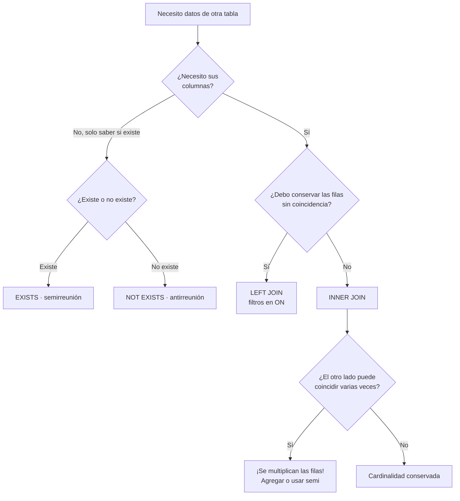

# 016 — Reuniones: interna, externa, semi y anti

> [Programa](../../../README.md) · [Parte 03](../README.md) · [← Anterior](../../part-03-sql-en-profundidad/015-select-filtrado-proyeccion-y-orden/README.md) · [Siguiente →](../../part-03-sql-en-profundidad/017-agregacion-group-by-y-having/README.md)

Parte 03 — SQL en profundidad · Intermedio ·
4 horas estimadas · motores `postgresql`, `sqlite`, `mysql` · laboratorio
[`labs/01-sql-foundations`](../../../labs/01-sql-foundations/README.md) · 3 fuentes.

**Conceptos centrales:** `reunión interna` · `reunión externa` · `semirreunion` · `antirreunion` · `multiplicación de filas`

**En este caso se comparan 12 motores**: 9 lo resuelven (6 con el resultado comprobado por máquina) y 3 no, con el motivo escrito.

---

## Propósito

Combinar tablas sin multiplicar filas por accidente. La reunión es la operación que más resultados incorrectos produce, y casi siempre en silencio: el informe sale, solo que con números inflados.

## Resultados de aprendizaje

Al terminar podrás:

1. Predecir la cardinalidad de una reunión a partir de las cardinalidades de sus lados.
2. Distinguir reunión interna, externa, semi y anti, y elegir la correcta.
3. Explicar por qué mover una condición de `ON` a `WHERE` convierte una externa en interna.
4. Detectar y corregir el doble conteo al agregar sobre varias reuniones.
5. Reconocer los tres algoritmos físicos de reunión y cuándo elige cada uno el motor.

## Fundamentos

### Cardinalidad: la regla que evita el 90 % de los errores

Al reunir `A` con `B` por una condición de igualdad, cada fila de `A` se empareja con **todas** las de `B` que coincidan.

| Relación entre los lados | Filas resultantes |
|---|---|
| Clave a clave (1:1) | ≤ min(\|A\|, \|B\|) |
| Clave a clave foránea (1:N) | ≤ \|B\| |
| N:M sin restricción | Hasta \|A\| · \|B\| |
| Sin condición (`CROSS JOIN`) | \|A\| · \|B\| |

Regla práctica: **una reunión solo conserva la cardinalidad de la tabla base si el otro lado está restringido a lo sumo a una fila coincidente**. Si no lo está, la tabla base se multiplica.

### Los cuatro tipos semánticos

| Tipo | Pregunta que responde | SQL |
|---|---|---|
| **Interna** | «Los que coinciden, con datos de ambos» | `JOIN ... ON` |
| **Externa** | «Todos los de un lado, con lo que haya del otro» | `LEFT/RIGHT/FULL JOIN` |
| **Semi** | «¿Existe al menos una coincidencia?» — sin traer columnas | `WHERE EXISTS (...)` |
| **Anti** | «¿No existe ninguna coincidencia?» | `WHERE NOT EXISTS (...)` |

La distinción crucial: **semi y anti no multiplican filas**. Si solo necesitas saber si hay coincidencia, una semirreunión da el resultado correcto sin `DISTINCT` y suele ser más rápida, porque el motor se detiene en la primera coincidencia.

```sql
-- MAL: multiplica si hay varias inscripciones
SELECT DISTINCT s.* FROM students s JOIN enrollments e ON e.student_id = s.id;

-- BIEN: semirreunión, sin multiplicación ni DISTINCT
SELECT s.* FROM students s
WHERE EXISTS (SELECT 1 FROM enrollments e WHERE e.student_id = s.id);
```

### `ON` frente a `WHERE` en reuniones externas

En una reunión externa, el lugar de la condición cambia el resultado:

- Una condición en `ON` se aplica **al emparejar**: las filas no emparejadas del lado izquierdo sobreviven con nulos.
- Una condición en `WHERE` se aplica **después**: como los nulos no cumplen ninguna comparación, elimina las filas no emparejadas y la reunión se vuelve interna de hecho.

```sql
-- Todos los estudiantes; los que no tienen nota alta salen con NULL
SELECT s.nombre, e.nota
FROM students s
LEFT JOIN enrollments e ON e.student_id = s.id AND e.nota > 6.0;

-- Solo los que tienen nota alta: el LEFT es decorativo
SELECT s.nombre, e.nota
FROM students s
LEFT JOIN enrollments e ON e.student_id = s.id
WHERE e.nota > 6.0;
```

En reuniones **internas** da igual dónde vaya la condición: son equivalentes y el optimizador las trata igual (equivalencia E2 de la clase 011).

### Los tres algoritmos físicos

| Algoritmo | Cómo funciona | Cuándo lo elige el motor | Coste aproximado |
|---|---|---|---|
| Bucle anidado | Por cada fila del externo, buscar en el interno | Externo pequeño e índice en el interno | \|A\| · log\|B\| |
| Hash | Construir tabla hash del menor, sondear con el mayor | Sin índice útil, cabe en memoria | \|A\| + \|B\| |
| Fusión | Ordenar ambos y recorrerlos a la vez | Ya ordenados o hay índices | \|A\|log\|A\| + \|B\|log\|B\| |

Ver un bucle anidado sobre dos tablas grandes en un plan es casi siempre la señal de un índice ausente o de una estimación de cardinalidad equivocada (clase 042).



## Ejemplo trabajado

Objetivo: *«por cada curso, número de inscritos y número de profesores»*.

Intento directo:

```sql
SELECT c.id,
       COUNT(DISTINCT e.student_id) AS inscritos,
       COUNT(DISTINCT t.teacher_id) AS profesores
FROM courses c
LEFT JOIN enrollments e ON e.course_id = c.id
LEFT JOIN teaching    t ON t.course_id = c.id
GROUP BY c.id;
```

**Traza del problema.** Para un curso con 40 inscritos y 3 profesores, la primera reunión produce 40 filas y la segunda multiplica cada una por 3: **120 filas** para ese curso. Sin `DISTINCT`, `COUNT(e.student_id)` daría 120 en lugar de 40, y `COUNT(t.teacher_id)` daría 120 en lugar de 3. Es el **doble conteo**, el error de reunión más caro porque el resultado es plausible.

El `DISTINCT` corrige el número, pero no el trabajo: el motor sigue materializando 120 filas por curso. Con 300 cursos y esa proporción, 36 000 filas intermedias para producir 300.

**Forma correcta: agregar antes de reunir.**

```sql
SELECT c.id,
       COALESCE(i.inscritos, 0)  AS inscritos,
       COALESCE(p.profesores, 0) AS profesores
FROM courses c
LEFT JOIN (SELECT course_id, COUNT(*) AS inscritos
           FROM enrollments GROUP BY course_id) i ON i.course_id = c.id
LEFT JOIN (SELECT course_id, COUNT(*) AS profesores
           FROM teaching   GROUP BY course_id) p ON p.course_id = c.id;
```

Cada subconsulta devuelve **una fila por curso**, así que ninguna reunión multiplica. Además `COALESCE` convierte el nulo de los cursos sin inscritos en 0, que es lo que un informe espera.

**Comprobación numérica:**

| Enfoque | Filas intermedias | Resultado correcto |
|---|---:|---|
| Doble `LEFT JOIN` sin `DISTINCT` | 36 000 | No (120 / 120) |
| Doble `LEFT JOIN` con `DISTINCT` | 36 000 | Sí (40 / 3) |
| Agregación previa | 600 | Sí (40 / 3) |

**Antirreunión con la trampa de los nulos.** «Estudiantes sin ninguna inscripción»:

```sql
-- correcto en cualquier caso
SELECT s.* FROM students s
WHERE NOT EXISTS (SELECT 1 FROM enrollments e WHERE e.student_id = s.id);

-- también correcto, forma clásica
SELECT s.* FROM students s
LEFT JOIN enrollments e ON e.student_id = s.id
WHERE e.student_id IS NULL;

-- ROTO si enrollments.student_id admite nulos
SELECT * FROM students
WHERE id NOT IN (SELECT student_id FROM enrollments);
```

La tercera devuelve cero filas si existe un solo `student_id` nulo (clase 012).

## Comparación

| Necesidad | Construcción | Multiplica filas |
|---|---|---|
| Datos de ambos lados | `INNER JOIN` | Sí, si el otro lado repite |
| Conservar los sin pareja | `LEFT JOIN`, filtro en `ON` | Sí |
| Saber si existe | `EXISTS` | No |
| Saber si no existe | `NOT EXISTS` | No |
| Contar de dos hijos a la vez | Agregación previa por hijo | No |
| Traer una fila «la más reciente» | `LATERAL` / ventana con filtro | No |

## Errores frecuentes

1. **`DISTINCT` para tapar una reunión que multiplica.** Arregla el número y esconde la causa; el costo sigue ahí.
2. **Poner el filtro del lado derecho en `WHERE` con `LEFT JOIN`.** Anula la externa sin avisar.
3. **Reunir dos tablas hijas y agregar.** Doble conteo asegurado.
4. **`NOT IN` con subconsulta que admite nulos.** Resultado vacío.
5. **Olvidar `COALESCE` tras una externa.** Los nulos se propagan a las sumas y aparecen totales nulos.
6. **`NATURAL JOIN`.** Reúne por *todas* las columnas de igual nombre; añadir una columna `created_at` a ambas tablas cambia el resultado.

## De la clase a la operación

Un informe con totales inflados es más peligroso que uno que falla: nadie lo revisa porque «funciona». Contrastar siempre un agregado con un conteo independiente es la práctica que los detecta.

## Reto de transferencia

1. Localiza en tu código una consulta con `DISTINCT` sobre una reunión y determina por qué está ahí.
2. Reescríbela con agregación previa o semirreunión, y compara filas intermedias y tiempo.
3. Construye el caso de doble conteo con datos tuyos y muestra los dos totales.
4. Demuestra con una traza el cambio de resultado al mover una condición de `ON` a `WHERE`.

## Preguntas de evaluación

1. Con `A` de 1 000 filas y `B` de 50 000 con clave foránea a `A`, ¿cuántas filas produce `A JOIN B`? ¿Y `A LEFT JOIN B`?
2. Explica por qué `EXISTS` no necesita `DISTINCT`.
3. Da una consulta tuya donde el doble conteo pasaría desapercibido, e indica cómo lo detectarías.
4. ¿Por qué un bucle anidado sobre dos tablas grandes es una señal de alarma en un plan?

---

## 🌐 El mismo problema en cada motor

**Caso:** Cada estudiante con el curso en que está inscrito, sin perder a los que no tienen ninguno

Con tres estudiantes (Ada, Linus, Grace), dos cursos (DB-101, SE-201) y tres
inscripciones (Ada en ambos, Linus en DB-101, Grace en ninguno), devolver una
fila por pareja estudiante-curso, ordenada por nombre y luego por código.
Los estudiantes sin ninguna inscripción aparecen con el literal `sin-curso`:
un centinela explícito en vez de un nulo, porque cada cliente de línea de
órdenes imprime el nulo de una forma distinta y lo que aquí se compara entre
motores es el resultado, no el formato.

Salida esperada, idéntica en todos los motores que lo resuelven:

| nombre | codigo |
|---|---|
| `Ada` | `DB-101` |
| `Ada` | `SE-201` |
| `Grace` | `sin-curso` |
| `Linus` | `DB-101` |

El contrato vive en [`motores.yaml`](motores.yaml) y lo comprueba
`python scripts/verificar_equivalencia.py --clase 016`: 6 de
las 9 implementaciones se ejecutan de verdad y su
resultado se compara con esa tabla; el resto se declara como material revisado,
no ejecutado.

| Motor | ¿Resuelve el caso? | Nivel de prueba | Código | Fuente |
|---|---|---|---|---|
| SQLite | sí | núcleo | [código](implementaciones/sqlite/consulta.sql) | [doc oficial](https://sqlite.org/lang_select.html) |
| DuckDB | sí | núcleo | [código](implementaciones/duckdb/consulta.sql) | [doc oficial](https://duckdb.org/docs/current/sql/query_syntax/from.html) |
| PostgreSQL | sí | servicio | [código](implementaciones/postgresql/consulta.sql) | [doc oficial](https://www.postgresql.org/docs/current/queries-table-expressions.html) |
| MySQL | sí | servicio | [código](implementaciones/mysql/consulta.sql) | [doc oficial](https://dev.mysql.com/doc/refman/8.4/en/join.html) |
| Microsoft SQL Server | sí | declarado | [código](implementaciones/sql-server/consulta.sql) | [doc oficial](https://learn.microsoft.com/sql/t-sql/queries/from-transact-sql) |
| Oracle Database | sí | declarado | [código](implementaciones/oracle-database/consulta.sql) | [doc oficial](https://docs.oracle.com/en/database/oracle/oracle-database/23/sqlrf/SELECT.html) |
| MongoDB | sí | servicio | [código](implementaciones/mongodb/consulta.js) | [doc oficial](https://www.mongodb.com/docs/manual/reference/operator/aggregation/lookup/) |
| Neo4j | sí | servicio | [código](implementaciones/neo4j/consulta.cypher) | [doc oficial](https://neo4j.com/docs/cypher-manual/current/clauses/optional-match/) |
| Apache Cassandra | sí | declarado | [código](implementaciones/cassandra/consulta.cql) | [doc oficial](https://cassandra.apache.org/doc/latest/cassandra/developing/cql/dml.html) |
| Redis | **no** | — | — | [doc oficial](https://redis.io/docs/latest/develop/data-types/) |
| Amazon DynamoDB | **no** | — | — | [doc oficial](https://docs.aws.amazon.com/amazondynamodb/latest/developerguide/bp-modeling-nosql-B.html) |
| OpenSearch | **no** | — | — | [doc oficial](https://docs.opensearch.org/latest/field-types/supported-field-types/join/) |

### Los que resuelven el caso

#### SQLite · [`implementaciones/sqlite/consulta.sql`](implementaciones/sqlite/consulta.sql)

✅ **verificado** — se ejecuta en CI sin servicios

```sql
-- motor: sqlite
-- doc: https://sqlite.org/lang_select.html
-- nota: el LEFT JOIN es la forma portable; RIGHT y FULL solo existen desde 3.39.

-- === preparacion ===
CREATE TABLE estudiantes (
    id     INTEGER PRIMARY KEY,
    nombre TEXT NOT NULL
);
CREATE TABLE cursos (
    id     INTEGER PRIMARY KEY,
    codigo TEXT NOT NULL UNIQUE
);
CREATE TABLE inscripciones (
    estudiante_id INTEGER NOT NULL REFERENCES estudiantes(id),
    curso_id      INTEGER NOT NULL REFERENCES cursos(id),
    PRIMARY KEY (estudiante_id, curso_id)
);

INSERT INTO estudiantes (id, nombre) VALUES (1, 'Ada'), (2, 'Linus'), (3, 'Grace');
INSERT INTO cursos (id, codigo) VALUES (10, 'DB-101'), (20, 'SE-201');
INSERT INTO inscripciones (estudiante_id, curso_id) VALUES (1, 10), (1, 20), (2, 10);

-- === consulta ===
SELECT e.nombre,
       COALESCE(c.codigo, 'sin-curso') AS codigo
FROM estudiantes e
LEFT JOIN inscripciones i ON i.estudiante_id = e.id
LEFT JOIN cursos c        ON c.id = i.curso_id
ORDER BY e.nombre, codigo;
```

- **Por qué sí:** Es el motor relacional que ya está instalado: viene con Python, no pide servidor y ejecuta el `LEFT JOIN` estándar. Para aprender la operación sin que la infraestructura estorbe, no hay nada más corto.
- **Por qué no:** El planificador es deliberadamente simple: hasta la versión 3.39 no tenía `RIGHT JOIN` ni `FULL JOIN`, y solo dispone de bucle anidado —no hay reunión hash ni por fusión—, así que las lecciones de rendimiento de una reunión grande no se transfieren desde aquí.
- 📄 Documentación oficial: <https://sqlite.org/lang_select.html>

#### DuckDB · [`implementaciones/duckdb/consulta.sql`](implementaciones/duckdb/consulta.sql)

✅ **verificado** — se ejecuta en CI sin servicios

```sql
-- motor: duckdb
-- doc: https://duckdb.org/docs/current/sql/query_syntax/from.html
-- nota: misma consulta estandar; lo que cambia es el motor que la ejecuta
--       (columnar y vectorizado), no el SQL.

-- === preparacion ===
CREATE TABLE estudiantes (
    id     INTEGER PRIMARY KEY,
    nombre VARCHAR NOT NULL
);
CREATE TABLE cursos (
    id     INTEGER PRIMARY KEY,
    codigo VARCHAR NOT NULL
);
CREATE TABLE inscripciones (
    estudiante_id INTEGER NOT NULL,
    curso_id      INTEGER NOT NULL
);

INSERT INTO estudiantes VALUES (1, 'Ada'), (2, 'Linus'), (3, 'Grace');
INSERT INTO cursos VALUES (10, 'DB-101'), (20, 'SE-201');
INSERT INTO inscripciones VALUES (1, 10), (1, 20), (2, 10);

-- === consulta ===
SELECT e.nombre,
       COALESCE(c.codigo, 'sin-curso') AS codigo
FROM estudiantes e
LEFT JOIN inscripciones i ON i.estudiante_id = e.id
LEFT JOIN cursos c        ON c.id = i.curso_id
ORDER BY e.nombre, codigo;
```

- **Por qué sí:** Misma sintaxis estándar, pero ejecutada por un motor columnar vectorizado: la misma reunión sobre millones de filas termina en un portátil. Es el motor donde comprobar que el resultado no cambia y el tiempo sí.
- **Por qué no:** Está pensado para analítica de un proceso a la vez: no hay control de concurrencia entre escritores ni servicio al que se conecten cien aplicaciones, así que no sustituye al motor transaccional del que salen los datos.
- 📄 Documentación oficial: <https://duckdb.org/docs/current/sql/query_syntax/from.html>

#### PostgreSQL · [`implementaciones/postgresql/consulta.sql`](implementaciones/postgresql/consulta.sql)

✅ **verificado** — se ejecuta contra el motor real levantado con `docker compose`

```sql
-- motor: postgresql
-- doc: https://www.postgresql.org/docs/current/queries-table-expressions.html
-- nota: EXPLAIN (ANALYZE, BUFFERS) sobre esta misma consulta dice cual de los
--       tres algoritmos de reunion eligio el planificador.

-- === preparacion ===
DROP TABLE IF EXISTS inscripciones, cursos, estudiantes;

CREATE TABLE estudiantes (
    id     integer PRIMARY KEY,
    nombre text NOT NULL
);
CREATE TABLE cursos (
    id     integer PRIMARY KEY,
    codigo text NOT NULL UNIQUE
);
CREATE TABLE inscripciones (
    estudiante_id integer NOT NULL REFERENCES estudiantes(id),
    curso_id      integer NOT NULL REFERENCES cursos(id),
    PRIMARY KEY (estudiante_id, curso_id)
);

INSERT INTO estudiantes (id, nombre) VALUES (1, 'Ada'), (2, 'Linus'), (3, 'Grace');
INSERT INTO cursos (id, codigo) VALUES (10, 'DB-101'), (20, 'SE-201');
INSERT INTO inscripciones (estudiante_id, curso_id) VALUES (1, 10), (1, 20), (2, 10);

-- === consulta ===
SELECT e.nombre,
       COALESCE(c.codigo, 'sin-curso') AS codigo
FROM estudiantes e
LEFT JOIN inscripciones i ON i.estudiante_id = e.id
LEFT JOIN cursos c        ON c.id = i.curso_id
ORDER BY e.nombre, codigo;
```

- **Por qué sí:** Es la referencia práctica del SQL de reuniones: tiene los tres algoritmos físicos (bucle anidado, hash y fusión), `FULL OUTER JOIN`, `LATERAL` y un `EXPLAIN (ANALYZE, BUFFERS)` que dice cuál eligió y por qué. Lo que se aprende aquí se lee después en cualquier motor.
- **Por qué no:** Cada conexión es un proceso del sistema operativo: sin un agrupador delante (PgBouncer), unas pocas centenas de conexiones ociosas cuestan más memoria que la propia consulta. La reunión no es el problema; el modelo de conexiones sí.
- 📄 Documentación oficial: <https://www.postgresql.org/docs/current/queries-table-expressions.html>

#### MySQL · [`implementaciones/mysql/consulta.sql`](implementaciones/mysql/consulta.sql)

✅ **verificado** — se ejecuta contra el motor real levantado con `docker compose`

```sql
-- motor: mysql
-- doc: https://dev.mysql.com/doc/refman/8.4/en/join.html
-- nota: desde 8.0.18 MySQL tiene reunion hash; antes, un LEFT JOIN sin indice
--       degradaba a bucle anidado sobre la tabla completa.

-- === preparacion ===
DROP TABLE IF EXISTS inscripciones;
DROP TABLE IF EXISTS cursos;
DROP TABLE IF EXISTS estudiantes;

CREATE TABLE estudiantes (
    id     INT PRIMARY KEY,
    nombre VARCHAR(50) NOT NULL
) ENGINE=InnoDB;
CREATE TABLE cursos (
    id     INT PRIMARY KEY,
    codigo VARCHAR(20) NOT NULL UNIQUE
) ENGINE=InnoDB;
CREATE TABLE inscripciones (
    estudiante_id INT NOT NULL,
    curso_id      INT NOT NULL,
    PRIMARY KEY (estudiante_id, curso_id),
    FOREIGN KEY (estudiante_id) REFERENCES estudiantes(id),
    FOREIGN KEY (curso_id) REFERENCES cursos(id)
) ENGINE=InnoDB;

INSERT INTO estudiantes (id, nombre) VALUES (1, 'Ada'), (2, 'Linus'), (3, 'Grace');
INSERT INTO cursos (id, codigo) VALUES (10, 'DB-101'), (20, 'SE-201');
INSERT INTO inscripciones (estudiante_id, curso_id) VALUES (1, 10), (1, 20), (2, 10);

-- === consulta ===
SELECT e.nombre,
       COALESCE(c.codigo, 'sin-curso') AS codigo
FROM estudiantes e
LEFT JOIN inscripciones i ON i.estudiante_id = e.id
LEFT JOIN cursos c        ON c.id = i.curso_id
ORDER BY e.nombre, codigo;
```

- **Por qué sí:** Es el motor relacional más desplegado en aplicaciones web y resuelve la misma consulta con el mismo estándar; desde 8.0.18 tiene reunión hash, de modo que el `LEFT JOIN` sin índice ya no degrada a bucle anidado.
- **Por qué no:** No tiene `FULL OUTER JOIN` —hay que emularlo con `UNION`— y su optimizador históricamente materializa subconsultas que PostgreSQL aplana, así que las consultas con reuniones anidadas hay que medirlas, no suponerlas.
- 📄 Documentación oficial: <https://dev.mysql.com/doc/refman/8.4/en/join.html>

#### Microsoft SQL Server · [`implementaciones/sql-server/consulta.sql`](implementaciones/sql-server/consulta.sql)

⚪ **declarado** — se revisa a mano contra la documentación citada; la máquina no lo ejecuta

```sql
-- motor: sql-server
-- doc: https://learn.microsoft.com/sql/t-sql/queries/from-transact-sql
-- nota: implementacion declarada. El repositorio no la ejecuta en CI porque no
--       distribuye la imagen con licencia; se revisa a mano contra la
--       documentacion citada.

-- === preparacion ===
DROP TABLE IF EXISTS dbo.inscripciones;
DROP TABLE IF EXISTS dbo.cursos;
DROP TABLE IF EXISTS dbo.estudiantes;

CREATE TABLE dbo.estudiantes (
    id     INT PRIMARY KEY,
    nombre NVARCHAR(50) NOT NULL
);
CREATE TABLE dbo.cursos (
    id     INT PRIMARY KEY,
    codigo NVARCHAR(20) NOT NULL UNIQUE
);
CREATE TABLE dbo.inscripciones (
    estudiante_id INT NOT NULL REFERENCES dbo.estudiantes(id),
    curso_id      INT NOT NULL REFERENCES dbo.cursos(id),
    CONSTRAINT pk_inscripciones PRIMARY KEY (estudiante_id, curso_id)
);

INSERT INTO dbo.estudiantes (id, nombre) VALUES (1, N'Ada'), (2, N'Linus'), (3, N'Grace');
INSERT INTO dbo.cursos (id, codigo) VALUES (10, N'DB-101'), (20, N'SE-201');
INSERT INTO dbo.inscripciones (estudiante_id, curso_id) VALUES (1, 10), (1, 20), (2, 10);

-- === consulta ===
SELECT e.nombre,
       COALESCE(c.codigo, N'sin-curso') AS codigo
FROM dbo.estudiantes e
LEFT JOIN dbo.inscripciones i ON i.estudiante_id = e.id
LEFT JOIN dbo.cursos c        ON c.id = i.curso_id
ORDER BY e.nombre, codigo;
```

- **Por qué sí:** El optimizador basado en costos y las sugerencias explícitas de reunión (`OPTION (HASH JOIN)`) lo hacen el mejor sitio para ver el efecto de cada algoritmo físico, y el plan gráfico de SSMS enseña la reunión mejor que cualquier diagrama.
- **Por qué no:** Licencia por núcleo y una edición gratuita (Express) limitada a 10 GB por base y a un socket: la decisión de usarlo casi nunca la toma la consulta, la toma el contrato.
- 📄 Documentación oficial: <https://learn.microsoft.com/sql/t-sql/queries/from-transact-sql>

#### Oracle Database · [`implementaciones/oracle-database/consulta.sql`](implementaciones/oracle-database/consulta.sql)

⚪ **declarado** — se revisa a mano contra la documentación citada; la máquina no lo ejecuta

```sql
-- motor: oracle-database
-- doc: https://docs.oracle.com/en/database/oracle/oracle-database/23/sqlrf/SELECT.html
-- nota: implementacion declarada. Se escribe con la sintaxis estandar de
--       reunion, no con el operador heredado (+), que Oracle sigue aceptando
--       pero que no se puede combinar con ANSI JOIN en la misma consulta.

-- === preparacion ===
CREATE TABLE estudiantes (
    id     NUMBER PRIMARY KEY,
    nombre VARCHAR2(50) NOT NULL
);
CREATE TABLE cursos (
    id     NUMBER PRIMARY KEY,
    codigo VARCHAR2(20) NOT NULL UNIQUE
);
CREATE TABLE inscripciones (
    estudiante_id NUMBER NOT NULL REFERENCES estudiantes(id),
    curso_id      NUMBER NOT NULL REFERENCES cursos(id),
    CONSTRAINT pk_inscripciones PRIMARY KEY (estudiante_id, curso_id)
);

INSERT INTO estudiantes (id, nombre) VALUES (1, 'Ada');
INSERT INTO estudiantes (id, nombre) VALUES (2, 'Linus');
INSERT INTO estudiantes (id, nombre) VALUES (3, 'Grace');
INSERT INTO cursos (id, codigo) VALUES (10, 'DB-101');
INSERT INTO cursos (id, codigo) VALUES (20, 'SE-201');
INSERT INTO inscripciones (estudiante_id, curso_id) VALUES (1, 10);
INSERT INTO inscripciones (estudiante_id, curso_id) VALUES (1, 20);
INSERT INTO inscripciones (estudiante_id, curso_id) VALUES (2, 10);
COMMIT;

-- === consulta ===
SELECT e.nombre,
       NVL(c.codigo, 'sin-curso') AS codigo
FROM estudiantes e
LEFT JOIN inscripciones i ON i.estudiante_id = e.id
LEFT JOIN cursos c        ON c.id = i.curso_id
ORDER BY e.nombre, codigo;
```

- **Por qué sí:** Es donde viven los sistemas transaccionales grandes y antiguos, y su optimizador tiene el catálogo de transformaciones más amplio (`STAR TRANSFORMATION`, reescritura de vistas materializadas) sobre reuniones de muchas tablas.
- **Por qué no:** Sintaxis heredada `(+)` conviviendo con la estándar, cadena vacía tratada como nulo —lo que rompe el centinela `COALESCE` de otros motores— y un costo de licencia que solo un sistema muy grande justifica.
- 📄 Documentación oficial: <https://docs.oracle.com/en/database/oracle/oracle-database/23/sqlrf/SELECT.html>

#### MongoDB · [`implementaciones/mongodb/consulta.js`](implementaciones/mongodb/consulta.js)

✅ **verificado** — se ejecuta contra el motor real levantado con `docker compose`

```javascript
// motor: mongodb
// doc: https://www.mongodb.com/docs/manual/reference/operator/aggregation/lookup/
// nota: $unwind con preserveNullAndEmptyArrays es lo que convierte el $lookup
//       en una reunion EXTERNA; sin esa opcion, Grace desaparece del resultado.

// === preparacion ===
db.estudiantes.drop();
db.cursos.drop();
db.inscripciones.drop();

db.estudiantes.insertMany([
  { _id: 1, nombre: "Ada" },
  { _id: 2, nombre: "Linus" },
  { _id: 3, nombre: "Grace" },
]);
db.cursos.insertMany([
  { _id: 10, codigo: "DB-101" },
  { _id: 20, codigo: "SE-201" },
]);
db.inscripciones.insertMany([
  { estudiante_id: 1, curso_id: 10 },
  { estudiante_id: 1, curso_id: 20 },
  { estudiante_id: 2, curso_id: 10 },
]);

// === consulta ===
db.estudiantes
  .aggregate([
    { $lookup: { from: "inscripciones", localField: "_id",
                 foreignField: "estudiante_id", as: "inscripcion" } },
    { $unwind: { path: "$inscripcion", preserveNullAndEmptyArrays: true } },
    { $lookup: { from: "cursos", localField: "inscripcion.curso_id",
                 foreignField: "_id", as: "curso" } },
    { $unwind: { path: "$curso", preserveNullAndEmptyArrays: true } },
    { $project: { _id: 0, nombre: 1,
                  codigo: { $ifNull: ["$curso.codigo", "sin-curso"] } } },
    { $sort: { nombre: 1, codigo: 1 } },
  ])
  .forEach((d) => print(d.nombre + "|" + d.codigo));
```

- **Por qué sí:** Desde la versión 3.2 `$lookup` hace la reunión izquierda dentro del motor, así que un modelo documental normalizado no obliga a reunir en la aplicación. Con `preserveNullAndEmptyArrays` el `$unwind` conserva a quien no tiene pareja: es literalmente un `LEFT JOIN`.
- **Por qué no:** `$lookup` no usa índices del lado interno con la misma libertad que un motor relacional y no hay reunión hash ni por fusión entre colecciones: cuando el patrón de acceso pide reunir todo el rato, el modelo está mal y lo que tocaba era incrustar el curso en el documento del estudiante.
- 📄 Documentación oficial: <https://www.mongodb.com/docs/manual/reference/operator/aggregation/lookup/>

#### Neo4j · [`implementaciones/neo4j/consulta.cypher`](implementaciones/neo4j/consulta.cypher)

✅ **verificado** — se ejecuta contra el motor real levantado con `docker compose`

```cypher
// motor: neo4j
// doc: https://neo4j.com/docs/cypher-manual/current/clauses/optional-match/
// nota: implementacion declarada. OPTIONAL MATCH es la reunion externa: si el
//       patron no encuentra pareja, las variables del patron quedan en null y
//       la fila del estudiante sobrevive.

// === preparacion ===
MATCH (n) DETACH DELETE n;
CREATE (a:Estudiante {nombre: 'Ada'}),
       (l:Estudiante {nombre: 'Linus'}),
       (g:Estudiante {nombre: 'Grace'}),
       (db:Curso {codigo: 'DB-101'}),
       (se:Curso {codigo: 'SE-201'}),
       (a)-[:INSCRITO_EN]->(db),
       (a)-[:INSCRITO_EN]->(se),
       (l)-[:INSCRITO_EN]->(db);

// === consulta ===
MATCH (e:Estudiante)
OPTIONAL MATCH (e)-[:INSCRITO_EN]->(c:Curso)
RETURN e.nombre AS nombre, coalesce(c.codigo, 'sin-curso') AS codigo
ORDER BY nombre, codigo;
```

- **Por qué sí:** La reunión externa se llama `OPTIONAL MATCH` y no hay tabla intermedia que declarar: la inscripción es una arista. Cuando el recorrido tiene varios saltos —estudiante, curso, prerrequisito, profesor— el costo no crece con el tamaño del grafo, sino con el del vecindario recorrido.
- **Por qué no:** Ese mismo modelo penaliza lo tabular: contar y agregar sobre todos los nodos de una etiqueta es más caro que en una tabla, y mantener un grafo solo para reunir dos entidades que ya son tablas añade un sistema entero sin resolver nada.
- 📄 Documentación oficial: <https://neo4j.com/docs/cypher-manual/current/clauses/optional-match/>

#### Apache Cassandra · [`implementaciones/cassandra/consulta.cql`](implementaciones/cassandra/consulta.cql)

⚪ **declarado** — se revisa a mano contra la documentación citada; la máquina no lo ejecuta

```sql
-- motor: cassandra
-- doc: https://cassandra.apache.org/doc/latest/cassandra/developing/cql/dml.html
-- nota: implementacion declarada, y deliberadamente distinta. CQL no tiene
--       JOIN: la reunion se paga en la escritura y se guarda ya resuelta la
--       tabla que la consulta necesita. El precio esta en el comentario final.

-- === preparacion ===
CREATE KEYSPACE IF NOT EXISTS escuela
  WITH replication = {'class': 'SimpleStrategy', 'replication_factor': 1};

DROP TABLE IF EXISTS escuela.cursos_por_estudiante;

-- La tabla es la consulta: una particion por estudiante, los codigos ordenados
-- dentro de ella. No modela entidades, modela una pregunta.
CREATE TABLE escuela.cursos_por_estudiante (
    nombre text,
    codigo text,
    PRIMARY KEY (nombre, codigo)
) WITH CLUSTERING ORDER BY (codigo ASC);

INSERT INTO escuela.cursos_por_estudiante (nombre, codigo) VALUES ('Ada', 'DB-101');
INSERT INTO escuela.cursos_por_estudiante (nombre, codigo) VALUES ('Ada', 'SE-201');
INSERT INTO escuela.cursos_por_estudiante (nombre, codigo) VALUES ('Linus', 'DB-101');
-- Grace no tiene inscripciones: el centinela tambien se escribe a mano, porque
-- aqui no hay reunion externa que lo genere.
INSERT INTO escuela.cursos_por_estudiante (nombre, codigo) VALUES ('Grace', 'sin-curso');

-- === consulta ===
-- El ORDER BY solo ordena DENTRO de una particion. Al recorrer varias, el orden
-- lo fija el token de la clave, no el nombre: por eso este SELECT lleva el
-- ordenamiento final del lado del cliente en cualquier uso serio.
SELECT nombre, codigo FROM escuela.cursos_por_estudiante;
```

- **Por qué sí:** CQL no tiene `JOIN`, y aun así el caso se resuelve: se paga la reunión en la escritura y se guarda ya resuelta la tabla que la consulta necesita. Es la lección de modelado más importante de las columnas anchas —se modela desde la consulta, no desde las entidades— y da lecturas de una sola partición a latencia predecible.
- **Por qué no:** Cada consulta nueva es una tabla nueva que hay que llenar y mantener coherente sin transacciones entre tablas; y el orden total del resultado no está garantizado al recorrer varias particiones, porque el orden entre particiones lo fija el token, no el `ORDER BY`.
- 📄 Documentación oficial: <https://cassandra.apache.org/doc/latest/cassandra/developing/cql/dml.html>

### Los que no resuelven este caso — y qué se hace en su lugar

Descartar un motor con un argumento es tan formativo como usarlo. Ninguna de estas filas dice que el motor sea peor: dice que este problema no es el suyo.

| Motor | Por qué no | Qué se hace en su lugar | Fuente |
|---|---|---|---|
| Redis | Redis no tiene reuniones ni un lenguaje de consulta sobre relaciones: es un servidor de estructuras de datos donde el acceso es por clave. Reunir exigiría traer las claves de los estudiantes, luego las de sus inscripciones y luego las de los cursos —tres viajes por estudiante— y hacer la reunión en la aplicación, que es exactamente lo que un motor relacional evita. | Guardar el resultado ya reunido como valor de una clave (`estudiante:1:cursos`) y recalcularlo cuando cambie el origen: Redis como caché de la reunión que hace otro motor, no como sustituto. | [doc](https://redis.io/docs/latest/develop/data-types/) |
| Amazon DynamoDB | El modelo de DynamoDB parte de que no hay reuniones en tiempo de consulta: solo se puede acceder por clave de partición y ordenación. Una reunión de tres entidades se traduce en varias `Query` o en un `Scan`, y el `Scan` lee y cobra la tabla entera. | Diseño de tabla única: estudiante e inscripciones comparten clave de partición (`ESTUDIANTE#1`) y se distinguen por la de ordenación (`PERFIL`, `CURSO#DB-101`), de modo que una sola `Query` devuelve lo que aquí es una reunión. | [doc](https://docs.aws.amazon.com/amazondynamodb/latest/developerguide/bp-modeling-nosql-B.html) |
| OpenSearch | Es un índice invertido para buscar y puntuar documentos, no para relacionar entidades. El campo `join` existe, pero obliga a que padre e hijo vivan en el mismo fragmento y penaliza cada consulta; la propia documentación recomienda desnormalizar antes que usarlo. | Indexar el documento ya desnormalizado (estudiante con la lista de sus cursos dentro) y reindexar cuando cambie, aceptando que el índice va por detrás del origen. | [doc](https://docs.opensearch.org/latest/field-types/supported-field-types/join/) |

---

## Laboratorio

```bash
python scripts/validate_repository.py
python labs/01-sql-foundations/run_lab.py
```

Guarda como evidencia la salida completa, la versión del motor y la semilla o
los parámetros usados. Una captura sin comando no es evidencia: no se puede
repetir.

## Evaluación

| Criterio | Peso | Qué se comprueba |
|---|---:|---|
| Comprensión conceptual | 25 % | Explica el mecanismo, no solo el resultado |
| Ejecución reproducible | 25 % | Otra persona obtiene lo mismo con las instrucciones dadas |
| Interpretación basada en evidencia | 25 % | Cada conclusión se apoya en una salida o una medición |
| Límites y riesgos declarados | 25 % | Dice qué no demuestra el ejercicio y qué faltaría en producción |

La clase se da por superada cuando la respuesta explica el mecanismo, muestra
la salida que la respalda y declara al menos un límite del ejercicio.

## Fuentes de esta clase

Todo lo afirmado arriba procede de estas obras. Los identificadores viven en
[`catalog/sources.json`](../../../catalog/sources.json) y el estado de los
enlaces se comprueba con `python scripts/check_external_links.py`.

- **Markus Winand** (2012). [SQL Performance Explained](https://use-the-index-luke.com/). Markus Winand. ISBN 978-3-9503078-2-5.  
  Versión web gratuita. Índices B-Tree y su relación con el orden de las columnas.
- **Anthony Molinaro, Robert de Graaf** (2020). [SQL Cookbook](https://www.oreilly.com/library/view/sql-cookbook-2nd/9781492077435/). 2.a ed. O'Reilly. ISBN 978-1-4920-7744-2.  
  Recetas comparadas entre dialectos, útil para la matriz de portabilidad.
- **C. J. Date** (2015). [SQL and Relational Theory: How to Write Accurate SQL Code](https://www.oreilly.com/library/view/sql-and-relational/9781491941164/). 3.a ed. O'Reilly. ISBN 978-1-4919-4117-1.  
  Separa el modelo relacional de lo que SQL realmente implementa, incluidos los nulos.

---

> [Programa](../../../README.md) · [Parte 03](../README.md) · [← Anterior](../../part-03-sql-en-profundidad/015-select-filtrado-proyeccion-y-orden/README.md) · [Siguiente →](../../part-03-sql-en-profundidad/017-agregacion-group-by-y-having/README.md)
