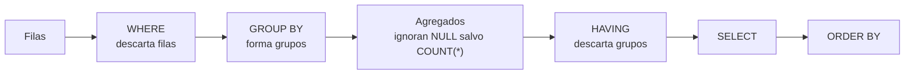

# 017 — Agregación, GROUP BY y HAVING sin duplicar filas

> [Programa](../../../README.md) · [Parte 03](../README.md) · [← Anterior](../../part-03-sql-en-profundidad/016-reuniones-inner-outer-semi-y-anti/README.md) · [Siguiente →](../../part-03-sql-en-profundidad/018-cte-subconsultas-y-funciones-de-ventana/README.md)

Parte 03 — SQL en profundidad · Intermedio ·
3 horas estimadas · motores `postgresql`, `sqlite`, `duckdb` · laboratorio
[`labs/01-sql-foundations`](../../../labs/01-sql-foundations/README.md) · 3 fuentes.

**Conceptos centrales:** `agrupación` · `agregado` · `HAVING` · `doble conteo` · `dependencia funcional en GROUP BY`

**En este caso se comparan 7 motores**: 5 lo resuelven (5 con el resultado comprobado por máquina) y 2 no, con el motivo escrito.

---

## Propósito

Agregar sin perder ni inventar información. La agregación resume, y todo resumen descarta datos: hay que saber exactamente cuáles.

## Resultados de aprendizaje

Al terminar podrás:

1. Explicar cómo tratan los nulos las funciones de agregación y por qué importa.
2. Distinguir `COUNT(*)`, `COUNT(col)` y `COUNT(DISTINCT col)`.
3. Agrupar por la clave y no por un atributo descriptivo, y decir por qué.
4. Usar agregación condicional para pivotar sin salir de SQL estándar.
5. Aplicar `GROUPING SETS`, `ROLLUP` y `CUBE` donde el motor los ofrezca.

## Fundamentos

### Los nulos y los agregados

Todas las funciones de agregación, **salvo `COUNT(*)`**, ignoran los nulos. Es una decisión de la norma con consecuencias directas:

```sql
-- notas: 6.0, 7.0, NULL, NULL
SELECT COUNT(*)      FROM enrollments;   -- 4  (filas)
SELECT COUNT(nota)   FROM enrollments;   -- 2  (valores no nulos)
SELECT SUM(nota)     FROM enrollments;   -- 13.0
SELECT AVG(nota)     FROM enrollments;   -- 6.5   = 13.0 / 2, NO / 4
```

`AVG` divide por el número de valores **no nulos**. Si la intención era «promedio contando las no calificadas como cero», hay que decirlo:

```sql
SELECT SUM(COALESCE(nota, 0)) / COUNT(*) FROM enrollments;   -- 3.25
```

6,5 frente a 3,25: dos respuestas defendibles a dos preguntas distintas. Elegir sin darse cuenta es el error.

Caso límite que sorprende: `SUM` sobre un conjunto vacío devuelve `NULL`, no 0. Un informe que suma pagos de un mes sin pagos muestra un hueco en vez de un cero, salvo que se escriba `COALESCE(SUM(monto), 0)`.

### Agrupar por la clave

```sql
-- MAL: fusiona homónimos
SELECT s.nombre, COUNT(*) FROM students s JOIN enrollments e ON e.student_id = s.id
GROUP BY s.nombre;

-- BIEN
SELECT s.id, s.nombre, COUNT(*) FROM students s JOIN enrollments e ON e.student_id = s.id
GROUP BY s.id, s.nombre;
```

La norma exige que toda columna del `SELECT` que no sea agregada aparezca en `GROUP BY`. PostgreSQL permite una excepción sensata: si se agrupa por la clave primaria, admite las demás columnas de esa tabla, porque están funcionalmente determinadas (clase 008). MySQL en modo no estricto lo permitía sin ninguna justificación, y devolvía un valor arbitrario del grupo: origen de innumerables informes silenciosamente erróneos.

### Agregación condicional

`FILTER` (norma SQL, soportado por PostgreSQL y SQLite) o `CASE` dentro del agregado permiten varias métricas en un solo recorrido:

```sql
SELECT course_id,
       COUNT(*)                                      AS total,
       COUNT(*) FILTER (WHERE nota >= 4.0)           AS aprobados,
       COUNT(*) FILTER (WHERE nota <  4.0)           AS reprobados,
       COUNT(*) FILTER (WHERE nota IS NULL)          AS sin_calificar,
       AVG(nota) FILTER (WHERE nota IS NOT NULL)     AS promedio
FROM enrollments
GROUP BY course_id;
```

Equivalente portable con `CASE`:

```sql
       SUM(CASE WHEN nota >= 4.0 THEN 1 ELSE 0 END) AS aprobados
```

Lo importante no es la sintaxis: es que **un solo recorrido** produce las cinco métricas. La alternativa —cinco consultas o cinco subconsultas— recorre la tabla cinco veces.

### Subtotales

```sql
SELECT c.periodo, c.id, COUNT(*) AS inscritos
FROM courses c JOIN enrollments e ON e.course_id = c.id
GROUP BY ROLLUP (c.periodo, c.id);
```

`ROLLUP` añade las filas de subtotal por período y el total general. Distinguir un subtotal de una fila real se hace con `GROUPING()`, porque en la fila de subtotal `c.id` es nulo, igual que lo sería un id realmente nulo.

| Construcción | Qué añade | Soporte |
|---|---|---|
| `GROUPING SETS` | Las combinaciones que se enumeren | PostgreSQL, SQL Server, Oracle, MySQL 8 |
| `ROLLUP` | Jerarquía de subtotales + total | Amplio |
| `CUBE` | Todas las combinaciones posibles | PostgreSQL, SQL Server, Oracle |

SQLite no los implementa; se emulan con `UNION ALL` de varias agregaciones.



## Ejemplo trabajado

Informe pedido: *«por curso: inscritos, aprobados, promedio de los calificados y porcentaje de aprobación»*.

```sql
SELECT c.id,
       c.nombre,
       COUNT(e.student_id)                                   AS inscritos,
       COUNT(e.nota)                                         AS calificados,
       SUM(CASE WHEN e.nota >= 4.0 THEN 1 ELSE 0 END)        AS aprobados,
       ROUND(AVG(e.nota), 2)                                 AS promedio_calificados,
       ROUND(100.0 * SUM(CASE WHEN e.nota >= 4.0 THEN 1 ELSE 0 END)
             / NULLIF(COUNT(e.nota), 0), 1)                  AS pct_aprobacion
FROM courses c
LEFT JOIN enrollments e ON e.course_id = c.id
GROUP BY c.id, c.nombre
ORDER BY c.id;
```

Cada decisión, con su porqué:

- **`LEFT JOIN`**: los cursos sin inscritos deben aparecer con 0, no desaparecer del informe.
- **`COUNT(e.student_id)` y no `COUNT(*)`**: con `LEFT JOIN`, un curso sin inscritos genera una fila con nulos; `COUNT(*)` daría **1** y `COUNT(e.student_id)` da **0**, que es lo correcto.
- **`COUNT(e.nota)` aparte de `inscritos`**: distingue «inscritos» de «calificados». Sin esa columna, el lector no puede saber sobre qué base se calculó el promedio.
- **`NULLIF(COUNT(e.nota), 0)`**: evita la división por cero en cursos sin calificar; el resultado es nulo, que es honesto (no hay porcentaje definido).
- **`100.0 *`** y no `100 *`: fuerza aritmética decimal. Con enteros, `100 * 3 / 4` da 75 en algunos motores y 0 en otros por división entera.

**Traza sobre un curso concreto** — 40 inscritos, 32 calificados, 24 con nota ≥ 4,0, suma de notas 148,8:

```text
inscritos            = 40
calificados          = 32
aprobados            = 24
promedio_calificados = 148,8 / 32 = 4,65
pct_aprobacion       = 100 · 24 / 32 = 75,0 %
```

Obsérvese que el porcentaje se calcula sobre **calificados**, no sobre inscritos. Sobre inscritos daría 60 %. Ambos números son ciertos y responden a preguntas distintas; el informe debe decir cuál usa. Es el punto pedagógico central de la clase: **el denominador es una decisión, no un detalle**.

## Comparación

| Expresión | Cuenta | Devuelve con conjunto vacío |
|---|---|---|
| `COUNT(*)` | Filas, incluidas las de nulos | 0 |
| `COUNT(col)` | Valores no nulos | 0 |
| `COUNT(DISTINCT col)` | Valores no nulos distintos | 0 |
| `SUM(col)` | Suma de no nulos | `NULL` |
| `AVG(col)` | Suma / cuenta de no nulos | `NULL` |
| `MIN`/`MAX(col)` | Extremos de no nulos | `NULL` |

## Errores frecuentes

1. **`COUNT(*)` tras un `LEFT JOIN`.** Cuenta 1 donde debería contar 0.
2. **`AVG` sin decir sobre qué base.** El lector supone que es sobre el total y casi nunca lo es.
3. **`SUM` de un conjunto vacío mostrado como hueco.** Falta `COALESCE`.
4. **Agrupar por el nombre.** Fusiona entidades distintas.
5. **División entera silenciosa.** `100 * a / b` con enteros trunca.
6. **`HAVING` para condiciones de fila.** Agrupa de más y luego descarta.

## De la clase a la operación

Dos informes del mismo negocio que no cuadran suelen diferir en el denominador o en el tratamiento de los nulos, no en los datos. Documentar en el propio SQL qué se cuenta y sobre qué base evita reuniones enteras de conciliación.

## Reto de transferencia

1. Toma un informe agregado real y determina, para cada métrica, cuál es su denominador.
2. Calcula la misma métrica con dos denominadores defendibles y muestra ambas cifras.
3. Reescribe cinco consultas de métrica en una sola con agregación condicional y compara tiempos.
4. Añade el manejo de nulos y de conjunto vacío, y demuestra el resultado en un mes sin datos.

## Preguntas de evaluación

1. Con notas `6.0, NULL, NULL`, ¿qué devuelven `COUNT(*)`, `COUNT(nota)`, `AVG(nota)` y `SUM(nota)`?
2. ¿Por qué `COUNT(*)` es incorrecto tras un `LEFT JOIN` cuando quieres contar hijos?
3. Explica cuándo agrupar solo por la clave primaria es válido y por qué.
4. Da dos porcentajes correctos y distintos para la misma pregunta de negocio, y di cómo elegirías.

---

## 🌐 El mismo problema en cada motor

**Caso:** Contar dos hijos del mismo padre sin que se multipliquen entre sí

Por cada curso hay que devolver cuántos inscritos tiene y cuántas
evaluaciones. Son dos recuentos sobre dos tablas distintas que cuelgan del
mismo padre, y ahí está el error de agregación más caro que existe: reunir
las dos y contar. Para DB-101, con 2 inscritos y 3 evaluaciones, esa reunión
produce 6 filas intermedias y los dos recuentos salen 6.

Lo grave no es el número: es que **el informe se genera igual**. Nadie revisa
un total que parece plausible. La forma correcta agrega antes de reunir, para
que cada lado aporte una sola fila por curso.

Salida esperada, idéntica en todos los motores que lo resuelven:

| curso | inscritos | evaluaciones |
|---|---|---|
| `DB-101` | `2` | `3` |
| `SE-201` | `1` | `1` |

El contrato vive en [`motores.yaml`](motores.yaml) y lo comprueba
`python scripts/verificar_equivalencia.py --clase 017`: 5 de
las 5 implementaciones se ejecutan de verdad y su
resultado se compara con esa tabla; el resto se declara como material revisado,
no ejecutado.

| Motor | ¿Resuelve el caso? | Nivel de prueba | Código | Fuente |
|---|---|---|---|---|
| SQLite | sí | núcleo | [código](implementaciones/sqlite/consulta.sql) | [doc oficial](https://sqlite.org/lang_select.html) |
| DuckDB | sí | núcleo | [código](implementaciones/duckdb/consulta.sql) | [doc oficial](https://duckdb.org/docs/stable/sql/query_syntax/groupby.html) |
| PostgreSQL | sí | servicio | [código](implementaciones/postgresql/consulta.sql) | [doc oficial](https://www.postgresql.org/docs/current/tutorial-agg.html) |
| MySQL | sí | servicio | [código](implementaciones/mysql/consulta.sql) | [doc oficial](https://dev.mysql.com/doc/refman/8.4/en/group-by-functions.html) |
| MongoDB | sí | servicio | [código](implementaciones/mongodb/consulta.js) | [doc oficial](https://www.mongodb.com/docs/manual/reference/operator/aggregation/group/) |
| ClickHouse | **no** | — | — | [doc oficial](https://clickhouse.com/docs/en/sql-reference/aggregate-functions) |
| Redis | **no** | — | — | [doc oficial](https://redis.io/docs/latest/commands/hincrby/) |

### Los que resuelven el caso

#### SQLite · [`implementaciones/sqlite/consulta.sql`](implementaciones/sqlite/consulta.sql)

✅ **verificado** — se ejecuta en CI sin servicios

```sql
-- motor: sqlite
-- doc: https://sqlite.org/lang_select.html

-- === preparacion ===
CREATE TABLE cursos (
    codigo TEXT PRIMARY KEY
);
CREATE TABLE inscripciones (
    estudiante TEXT NOT NULL,
    curso      TEXT NOT NULL,
    PRIMARY KEY (estudiante, curso)
);
CREATE TABLE evaluaciones (
    id     INTEGER PRIMARY KEY,
    curso  TEXT NOT NULL,
    titulo TEXT NOT NULL
);

INSERT INTO cursos (codigo) VALUES ('DB-101'), ('SE-201');
INSERT INTO inscripciones (estudiante, curso) VALUES
    ('Ada', 'DB-101'), ('Linus', 'DB-101'), ('Grace', 'SE-201');
INSERT INTO evaluaciones (id, curso, titulo) VALUES
    (1, 'DB-101', 'Control 1'), (2, 'DB-101', 'Control 2'), (3, 'DB-101', 'Examen'),
    (4, 'SE-201', 'Examen');

-- === consulta ===
-- La forma INGENUA seria reunir las dos tablas hijas y contar con DISTINCT:
--   FROM cursos c LEFT JOIN inscripciones i ... LEFT JOIN evaluaciones e ...
-- Para DB-101, esa reunion produce 2 x 3 = 6 filas intermedias, y sin DISTINCT
-- devolveria 6 inscritos y 6 evaluaciones. Con DISTINCT el numero sale bien y
-- el trabajo sigue estando ahi.
--
-- La forma CORRECTA agrega ANTES de reunir: cada subconsulta devuelve una fila
-- por curso, asi que ninguna reunion multiplica nada.
SELECT c.codigo AS curso,
       COALESCE(i.inscritos, 0) AS inscritos,
       COALESCE(e.evaluaciones, 0) AS evaluaciones
FROM cursos c
LEFT JOIN (SELECT curso, COUNT(*) AS inscritos
           FROM inscripciones GROUP BY curso) i ON i.curso = c.codigo
LEFT JOIN (SELECT curso, COUNT(*) AS evaluaciones
           FROM evaluaciones GROUP BY curso) e ON e.curso = c.codigo
ORDER BY c.codigo;
```

- **Por qué sí:** Permite ver el doble conteo y su corrección en el mismo archivo, sin infraestructura: basta cambiar la consulta por la ingenua para que los dos números salten a 6.
- **Por qué no:** Tolera `GROUP BY` con columnas no agregadas y devuelve un valor cualquiera del grupo, sin avisar. Es el motor donde una agregación mal escrita más fácilmente pasa por buena.
- 📄 Documentación oficial: <https://sqlite.org/lang_select.html>

#### DuckDB · [`implementaciones/duckdb/consulta.sql`](implementaciones/duckdb/consulta.sql)

✅ **verificado** — se ejecuta en CI sin servicios

```sql
-- motor: duckdb
-- doc: https://duckdb.org/docs/stable/sql/query_syntax/groupby.html
-- nota: DuckDB acepta GROUP BY ALL, que evita el error de olvidar una columna
--       en la lista. Aqui se escribe la forma portable a proposito.

-- === preparacion ===
CREATE TABLE cursos (
    codigo VARCHAR PRIMARY KEY
);
CREATE TABLE inscripciones (
    estudiante VARCHAR NOT NULL,
    curso      VARCHAR NOT NULL,
    PRIMARY KEY (estudiante, curso)
);
CREATE TABLE evaluaciones (
    id     INTEGER PRIMARY KEY,
    curso  VARCHAR NOT NULL,
    titulo VARCHAR NOT NULL
);

INSERT INTO cursos (codigo) VALUES ('DB-101'), ('SE-201');
INSERT INTO inscripciones (estudiante, curso) VALUES
    ('Ada', 'DB-101'), ('Linus', 'DB-101'), ('Grace', 'SE-201');
INSERT INTO evaluaciones (id, curso, titulo) VALUES
    (1, 'DB-101', 'Control 1'), (2, 'DB-101', 'Control 2'), (3, 'DB-101', 'Examen'),
    (4, 'SE-201', 'Examen');

-- === consulta ===
-- La forma INGENUA seria reunir las dos tablas hijas y contar con DISTINCT:
--   FROM cursos c LEFT JOIN inscripciones i ... LEFT JOIN evaluaciones e ...
-- Para DB-101, esa reunion produce 2 x 3 = 6 filas intermedias, y sin DISTINCT
-- devolveria 6 inscritos y 6 evaluaciones. Con DISTINCT el numero sale bien y
-- el trabajo sigue estando ahi.
--
-- La forma CORRECTA agrega ANTES de reunir: cada subconsulta devuelve una fila
-- por curso, asi que ninguna reunion multiplica nada.
SELECT c.codigo AS curso,
       COALESCE(i.inscritos, 0) AS inscritos,
       COALESCE(e.evaluaciones, 0) AS evaluaciones
FROM cursos c
LEFT JOIN (SELECT curso, COUNT(*) AS inscritos
           FROM inscripciones GROUP BY curso) i ON i.curso = c.codigo
LEFT JOIN (SELECT curso, COUNT(*) AS evaluaciones
           FROM evaluaciones GROUP BY curso) e ON e.curso = c.codigo
ORDER BY c.codigo;
```

- **Por qué sí:** La agregación es su terreno: cuenta y agrupa sobre millones de filas en memoria, y `GROUP BY ALL` evita el error de olvidar una columna en la lista.
- **Por qué no:** Esa velocidad esconde el problema: la versión con doble reunión y `DISTINCT` también termina rápido aquí, así que el costo del error no se nota hasta que la misma consulta se lleva al motor transaccional.
- 📄 Documentación oficial: <https://duckdb.org/docs/stable/sql/query_syntax/groupby.html>

#### PostgreSQL · [`implementaciones/postgresql/consulta.sql`](implementaciones/postgresql/consulta.sql)

✅ **verificado** — se ejecuta contra el motor real levantado con `docker compose`

```sql
-- motor: postgresql
-- doc: https://www.postgresql.org/docs/current/tutorial-agg.html
-- nota: EXPLAIN (ANALYZE) sobre la version ingenua muestra «rows=6» en el nodo
--       de la reunion para DB-101: el doble conteo deja de ser un argumento y
--       pasa a ser un numero.

DROP TABLE IF EXISTS evaluaciones, inscripciones, cursos;

-- === preparacion ===
CREATE TABLE cursos (
    codigo text PRIMARY KEY
);
CREATE TABLE inscripciones (
    estudiante text NOT NULL,
    curso      text NOT NULL,
    PRIMARY KEY (estudiante, curso)
);
CREATE TABLE evaluaciones (
    id     integer PRIMARY KEY,
    curso  text NOT NULL,
    titulo text NOT NULL
);

INSERT INTO cursos (codigo) VALUES ('DB-101'), ('SE-201');
INSERT INTO inscripciones (estudiante, curso) VALUES
    ('Ada', 'DB-101'), ('Linus', 'DB-101'), ('Grace', 'SE-201');
INSERT INTO evaluaciones (id, curso, titulo) VALUES
    (1, 'DB-101', 'Control 1'), (2, 'DB-101', 'Control 2'), (3, 'DB-101', 'Examen'),
    (4, 'SE-201', 'Examen');

-- === consulta ===
-- La forma INGENUA seria reunir las dos tablas hijas y contar con DISTINCT:
--   FROM cursos c LEFT JOIN inscripciones i ... LEFT JOIN evaluaciones e ...
-- Para DB-101, esa reunion produce 2 x 3 = 6 filas intermedias, y sin DISTINCT
-- devolveria 6 inscritos y 6 evaluaciones. Con DISTINCT el numero sale bien y
-- el trabajo sigue estando ahi.
--
-- La forma CORRECTA agrega ANTES de reunir: cada subconsulta devuelve una fila
-- por curso, asi que ninguna reunion multiplica nada.
SELECT c.codigo AS curso,
       COALESCE(i.inscritos, 0) AS inscritos,
       COALESCE(e.evaluaciones, 0) AS evaluaciones
FROM cursos c
LEFT JOIN (SELECT curso, COUNT(*) AS inscritos
           FROM inscripciones GROUP BY curso) i ON i.curso = c.codigo
LEFT JOIN (SELECT curso, COUNT(*) AS evaluaciones
           FROM evaluaciones GROUP BY curso) e ON e.curso = c.codigo
ORDER BY c.codigo;
```

- **Por qué sí:** Rechaza el `GROUP BY` ambiguo con un error, tiene agregados con `FILTER` —que evita varias subconsultas— y `EXPLAIN (ANALYZE)` muestra las filas intermedias reales, que es como se demuestra el doble conteo con números.
- **Por qué no:** La agregación previa por subconsulta puede materializarse: en tablas grandes conviene comprobar si una función de ventana o un `LATERAL` con límite resulta más barato, en vez de asumirlo.
- 📄 Documentación oficial: <https://www.postgresql.org/docs/current/tutorial-agg.html>

#### MySQL · [`implementaciones/mysql/consulta.sql`](implementaciones/mysql/consulta.sql)

✅ **verificado** — se ejecuta contra el motor real levantado con `docker compose`

```sql
-- motor: mysql
-- doc: https://dev.mysql.com/doc/refman/8.4/en/group-by-functions.html

DROP TABLE IF EXISTS evaluaciones;
DROP TABLE IF EXISTS inscripciones;
DROP TABLE IF EXISTS cursos;

-- === preparacion ===
CREATE TABLE cursos (
    codigo VARCHAR(50) PRIMARY KEY
);
CREATE TABLE inscripciones (
    estudiante VARCHAR(50) NOT NULL,
    curso      VARCHAR(50) NOT NULL,
    PRIMARY KEY (estudiante, curso)
);
CREATE TABLE evaluaciones (
    id     INT PRIMARY KEY,
    curso  VARCHAR(50) NOT NULL,
    titulo VARCHAR(50) NOT NULL
);

INSERT INTO cursos (codigo) VALUES ('DB-101'), ('SE-201');
INSERT INTO inscripciones (estudiante, curso) VALUES
    ('Ada', 'DB-101'), ('Linus', 'DB-101'), ('Grace', 'SE-201');
INSERT INTO evaluaciones (id, curso, titulo) VALUES
    (1, 'DB-101', 'Control 1'), (2, 'DB-101', 'Control 2'), (3, 'DB-101', 'Examen'),
    (4, 'SE-201', 'Examen');

-- === consulta ===
-- La forma INGENUA seria reunir las dos tablas hijas y contar con DISTINCT:
--   FROM cursos c LEFT JOIN inscripciones i ... LEFT JOIN evaluaciones e ...
-- Para DB-101, esa reunion produce 2 x 3 = 6 filas intermedias, y sin DISTINCT
-- devolveria 6 inscritos y 6 evaluaciones. Con DISTINCT el numero sale bien y
-- el trabajo sigue estando ahi.
--
-- La forma CORRECTA agrega ANTES de reunir: cada subconsulta devuelve una fila
-- por curso, asi que ninguna reunion multiplica nada.
SELECT c.codigo AS curso,
       COALESCE(i.inscritos, 0) AS inscritos,
       COALESCE(e.evaluaciones, 0) AS evaluaciones
FROM cursos c
LEFT JOIN (SELECT curso, COUNT(*) AS inscritos
           FROM inscripciones GROUP BY curso) i ON i.curso = c.codigo
LEFT JOIN (SELECT curso, COUNT(*) AS evaluaciones
           FROM evaluaciones GROUP BY curso) e ON e.curso = c.codigo
ORDER BY c.codigo;
```

- **Por qué sí:** Con `ONLY_FULL_GROUP_BY` activo por omisión desde 5.7, las agregaciones ambiguas ya no cuelan, y el motor resuelve la agregación previa con tablas derivadas materializadas.
- **Por qué no:** Esa materialización crea tablas temporales sin índices: cuando las subconsultas devuelven muchas filas, la reunión posterior se vuelve un escaneo completo de la temporal.
- 📄 Documentación oficial: <https://dev.mysql.com/doc/refman/8.4/en/group-by-functions.html>

#### MongoDB · [`implementaciones/mongodb/consulta.js`](implementaciones/mongodb/consulta.js)

✅ **verificado** — se ejecuta contra el motor real levantado con `docker compose`

```javascript
// motor: mongodb
// doc: https://www.mongodb.com/docs/manual/reference/operator/aggregation/group/
// nota: aqui el doble conteo NO puede ocurrir: cada $lookup deja su propio
//       arreglo y $size cuenta cada uno por separado. El precio es que son dos
//       busquedas por curso, no una reunion.

// === preparacion ===
db.cursos.drop();
db.inscripciones.drop();
db.evaluaciones.drop();

db.cursos.insertMany([{ _id: "DB-101" }, { _id: "SE-201" }]);
db.inscripciones.insertMany([
  { estudiante: "Ada", curso: "DB-101" },
  { estudiante: "Linus", curso: "DB-101" },
  { estudiante: "Grace", curso: "SE-201" },
]);
db.evaluaciones.insertMany([
  { curso: "DB-101", titulo: "Control 1" },
  { curso: "DB-101", titulo: "Control 2" },
  { curso: "DB-101", titulo: "Examen" },
  { curso: "SE-201", titulo: "Examen" },
]);

// === consulta ===
db.cursos
  .aggregate([
    { $lookup: { from: "inscripciones", localField: "_id",
                 foreignField: "curso", as: "i" } },
    { $lookup: { from: "evaluaciones", localField: "_id",
                 foreignField: "curso", as: "e" } },
    { $project: { _id: 0, curso: "$_id",
                  inscritos: { $size: "$i" }, evaluaciones: { $size: "$e" } } },
    { $sort: { curso: 1 } },
  ])
  .forEach((d) => print(d.curso + "|" + d.inscritos + "|" + d.evaluaciones));
```

- **Por qué sí:** El problema del doble conteo no aparece si cada `$lookup` se cuenta por separado con `$size`: no hay producto cartesiano porque cada búsqueda deja su propio arreglo.
- **Por qué no:** Cada `$lookup` es una consulta más por documento del lado externo; con muchos cursos, lo que en SQL era una reunión se convierte en miles de búsquedas y la latencia crece de forma lineal.
- 📄 Documentación oficial: <https://www.mongodb.com/docs/manual/reference/operator/aggregation/group/>

### Los que no resuelven este caso — y qué se hace en su lugar

Descartar un motor con un argumento es tan formativo como usarlo. Ninguna de estas filas dice que el motor sea peor: dice que este problema no es el suyo.

| Motor | Por qué no | Qué se hace en su lugar | Fuente |
|---|---|---|---|
| ClickHouse | Resolvería el caso sin esfuerzo, pero compararlo aquí induce a error: su forma idiomática no es agregar dos hijos normalizados, sino guardar los hechos ya aplanados y usar estados de agregación (`AggregatingMergeTree`) que se combinan al fusionar partes. | Se estudia en la parte de analítica columnar, con su propio caso y su propia medición, en vez de forzarlo a imitar un esquema transaccional. | [doc](https://clickhouse.com/docs/en/sql-reference/aggregate-functions) |
| Redis | No hay `GROUP BY`: agregar exigiría traer todos los miembros al cliente y contarlos allí, con lo que el recuento deja de ser una propiedad del almacén. | Mantener un contador por curso y por tipo de hijo, actualizado en cada escritura, con el riesgo de deriva que se estudió en la clase de desnormalización deliberada. | [doc](https://redis.io/docs/latest/commands/hincrby/) |

---

## Laboratorio

```bash
python scripts/validate_repository.py
python labs/01-sql-foundations/run_lab.py
```

Guarda como evidencia la salida completa, la versión del motor y la semilla o
los parámetros usados. Una captura sin comando no es evidencia: no se puede
repetir.

## Evaluación

| Criterio | Peso | Qué se comprueba |
|---|---:|---|
| Comprensión conceptual | 25 % | Explica el mecanismo, no solo el resultado |
| Ejecución reproducible | 25 % | Otra persona obtiene lo mismo con las instrucciones dadas |
| Interpretación basada en evidencia | 25 % | Cada conclusión se apoya en una salida o una medición |
| Límites y riesgos declarados | 25 % | Dice qué no demuestra el ejercicio y qué faltaría en producción |

La clase se da por superada cuando la respuesta explica el mecanismo, muestra
la salida que la respalda y declara al menos un límite del ejercicio.

## Fuentes de esta clase

Todo lo afirmado arriba procede de estas obras. Los identificadores viven en
[`catalog/sources.json`](../../../catalog/sources.json) y el estado de los
enlaces se comprueba con `python scripts/check_external_links.py`.

- **Joe Celko** (2014). [Joe Celko's SQL for Smarties: Advanced SQL Programming](https://www.sciencedirect.com/book/9780128007617/joe-celkos-sql-for-smarties). 5.a ed. Morgan Kaufmann. ISBN 978-0-12-800761-7.  
  Modelado de jerarquias, conjuntos anidados y SQL declarativo avanzado.
- **Anthony Molinaro, Robert de Graaf** (2020). [SQL Cookbook](https://www.oreilly.com/library/view/sql-cookbook-2nd/9781492077435/). 2.a ed. O'Reilly. ISBN 978-1-4920-7744-2.  
  Recetas comparadas entre dialectos, útil para la matriz de portabilidad.
- **Hector Garcia-Molina, Jeffrey D. Ullman, Jennifer Widom** (2008). [Database Systems: The Complete Book](http://infolab.stanford.edu/~ullman/dscb.html). 2.a ed. Pearson. ISBN 978-0-13-187325-4.  
  Tratamiento formal de dependencias funcionales, normalización y optimización.

---

> [Programa](../../../README.md) · [Parte 03](../README.md) · [← Anterior](../../part-03-sql-en-profundidad/016-reuniones-inner-outer-semi-y-anti/README.md) · [Siguiente →](../../part-03-sql-en-profundidad/018-cte-subconsultas-y-funciones-de-ventana/README.md)
