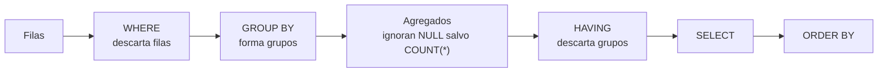

# 017 — Agregación, GROUP BY y HAVING sin duplicar filas

> [Programa](../../../README.md) · [Parte 03](../README.md) · [← Anterior](../../part-03-sql-en-profundidad/016-reuniones-inner-outer-semi-y-anti/README.md) · [Siguiente →](../../part-03-sql-en-profundidad/018-cte-subconsultas-y-funciones-de-ventana/README.md)

| | |
|---|---|
| **Parte** | 03 — SQL en profundidad |
| **Nivel** | Intermedio |
| **Horas estimadas** | 3 |
| **Motores** | `postgresql`, `sqlite`, `duckdb` |
| **Laboratorio** | [`labs/01-sql-foundations`](../../../labs/01-sql-foundations/README.md) |
| **Fuentes** | 3 |

**Conceptos centrales:** `agrupación` · `agregado` · `HAVING` · `doble conteo` · `dependencia funcional en GROUP BY`

---

## Propósito

Agregar sin perder ni inventar información. La agregación resume, y todo resumen descarta datos: hay que saber exactamente cuáles.

## Resultados de aprendizaje

Al terminar podrás:

1. Explicar cómo tratan los nulos las funciones de agregación y por qué importa.
2. Distinguir `COUNT(*)`, `COUNT(col)` y `COUNT(DISTINCT col)`.
3. Agrupar por la clave y no por un atributo descriptivo, y decir por qué.
4. Usar agregación condicional para pivotar sin salir de SQL estándar.
5. Aplicar `GROUPING SETS`, `ROLLUP` y `CUBE` donde el motor los ofrezca.

## Fundamentos

### Los nulos y los agregados

Todas las funciones de agregación, **salvo `COUNT(*)`**, ignoran los nulos. Es una decisión de la norma con consecuencias directas:

```sql
-- notas: 6.0, 7.0, NULL, NULL
SELECT COUNT(*)      FROM enrollments;   -- 4  (filas)
SELECT COUNT(nota)   FROM enrollments;   -- 2  (valores no nulos)
SELECT SUM(nota)     FROM enrollments;   -- 13.0
SELECT AVG(nota)     FROM enrollments;   -- 6.5   = 13.0 / 2, NO / 4
```

`AVG` divide por el número de valores **no nulos**. Si la intención era «promedio contando las no calificadas como cero», hay que decirlo:

```sql
SELECT SUM(COALESCE(nota, 0)) / COUNT(*) FROM enrollments;   -- 3.25
```

6,5 frente a 3,25: dos respuestas defendibles a dos preguntas distintas. Elegir sin darse cuenta es el error.

Caso límite que sorprende: `SUM` sobre un conjunto vacío devuelve `NULL`, no 0. Un informe que suma pagos de un mes sin pagos muestra un hueco en vez de un cero, salvo que se escriba `COALESCE(SUM(monto), 0)`.

### Agrupar por la clave

```sql
-- MAL: fusiona homónimos
SELECT s.nombre, COUNT(*) FROM students s JOIN enrollments e ON e.student_id = s.id
GROUP BY s.nombre;

-- BIEN
SELECT s.id, s.nombre, COUNT(*) FROM students s JOIN enrollments e ON e.student_id = s.id
GROUP BY s.id, s.nombre;
```

La norma exige que toda columna del `SELECT` que no sea agregada aparezca en `GROUP BY`. PostgreSQL permite una excepción sensata: si se agrupa por la clave primaria, admite las demás columnas de esa tabla, porque están funcionalmente determinadas (clase 008). MySQL en modo no estricto lo permitía sin ninguna justificación, y devolvía un valor arbitrario del grupo: origen de innumerables informes silenciosamente erróneos.

### Agregación condicional

`FILTER` (norma SQL, soportado por PostgreSQL y SQLite) o `CASE` dentro del agregado permiten varias métricas en un solo recorrido:

```sql
SELECT course_id,
       COUNT(*)                                      AS total,
       COUNT(*) FILTER (WHERE nota >= 4.0)           AS aprobados,
       COUNT(*) FILTER (WHERE nota <  4.0)           AS reprobados,
       COUNT(*) FILTER (WHERE nota IS NULL)          AS sin_calificar,
       AVG(nota) FILTER (WHERE nota IS NOT NULL)     AS promedio
FROM enrollments
GROUP BY course_id;
```

Equivalente portable con `CASE`:

```sql
       SUM(CASE WHEN nota >= 4.0 THEN 1 ELSE 0 END) AS aprobados
```

Lo importante no es la sintaxis: es que **un solo recorrido** produce las cinco métricas. La alternativa —cinco consultas o cinco subconsultas— recorre la tabla cinco veces.

### Subtotales

```sql
SELECT c.periodo, c.id, COUNT(*) AS inscritos
FROM courses c JOIN enrollments e ON e.course_id = c.id
GROUP BY ROLLUP (c.periodo, c.id);
```

`ROLLUP` añade las filas de subtotal por período y el total general. Distinguir un subtotal de una fila real se hace con `GROUPING()`, porque en la fila de subtotal `c.id` es nulo, igual que lo sería un id realmente nulo.

| Construcción | Qué añade | Soporte |
|---|---|---|
| `GROUPING SETS` | Las combinaciones que se enumeren | PostgreSQL, SQL Server, Oracle, MySQL 8 |
| `ROLLUP` | Jerarquía de subtotales + total | Amplio |
| `CUBE` | Todas las combinaciones posibles | PostgreSQL, SQL Server, Oracle |

SQLite no los implementa; se emulan con `UNION ALL` de varias agregaciones.



## Ejemplo trabajado

Informe pedido: *«por curso: inscritos, aprobados, promedio de los calificados y porcentaje de aprobación»*.

```sql
SELECT c.id,
       c.nombre,
       COUNT(e.student_id)                                   AS inscritos,
       COUNT(e.nota)                                         AS calificados,
       SUM(CASE WHEN e.nota >= 4.0 THEN 1 ELSE 0 END)        AS aprobados,
       ROUND(AVG(e.nota), 2)                                 AS promedio_calificados,
       ROUND(100.0 * SUM(CASE WHEN e.nota >= 4.0 THEN 1 ELSE 0 END)
             / NULLIF(COUNT(e.nota), 0), 1)                  AS pct_aprobacion
FROM courses c
LEFT JOIN enrollments e ON e.course_id = c.id
GROUP BY c.id, c.nombre
ORDER BY c.id;
```

Cada decisión, con su porqué:

- **`LEFT JOIN`**: los cursos sin inscritos deben aparecer con 0, no desaparecer del informe.
- **`COUNT(e.student_id)` y no `COUNT(*)`**: con `LEFT JOIN`, un curso sin inscritos genera una fila con nulos; `COUNT(*)` daría **1** y `COUNT(e.student_id)` da **0**, que es lo correcto.
- **`COUNT(e.nota)` aparte de `inscritos`**: distingue «inscritos» de «calificados». Sin esa columna, el lector no puede saber sobre qué base se calculó el promedio.
- **`NULLIF(COUNT(e.nota), 0)`**: evita la división por cero en cursos sin calificar; el resultado es nulo, que es honesto (no hay porcentaje definido).
- **`100.0 *`** y no `100 *`: fuerza aritmética decimal. Con enteros, `100 * 3 / 4` da 75 en algunos motores y 0 en otros por división entera.

**Traza sobre un curso concreto** — 40 inscritos, 32 calificados, 24 con nota ≥ 4,0, suma de notas 148,8:

```text
inscritos            = 40
calificados          = 32
aprobados            = 24
promedio_calificados = 148,8 / 32 = 4,65
pct_aprobacion       = 100 · 24 / 32 = 75,0 %
```

Obsérvese que el porcentaje se calcula sobre **calificados**, no sobre inscritos. Sobre inscritos daría 60 %. Ambos números son ciertos y responden a preguntas distintas; el informe debe decir cuál usa. Es el punto pedagógico central de la clase: **el denominador es una decisión, no un detalle**.

## Comparación

| Expresión | Cuenta | Devuelve con conjunto vacío |
|---|---|---|
| `COUNT(*)` | Filas, incluidas las de nulos | 0 |
| `COUNT(col)` | Valores no nulos | 0 |
| `COUNT(DISTINCT col)` | Valores no nulos distintos | 0 |
| `SUM(col)` | Suma de no nulos | `NULL` |
| `AVG(col)` | Suma / cuenta de no nulos | `NULL` |
| `MIN`/`MAX(col)` | Extremos de no nulos | `NULL` |

## Errores frecuentes

1. **`COUNT(*)` tras un `LEFT JOIN`.** Cuenta 1 donde debería contar 0.
2. **`AVG` sin decir sobre qué base.** El lector supone que es sobre el total y casi nunca lo es.
3. **`SUM` de un conjunto vacío mostrado como hueco.** Falta `COALESCE`.
4. **Agrupar por el nombre.** Fusiona entidades distintas.
5. **División entera silenciosa.** `100 * a / b` con enteros trunca.
6. **`HAVING` para condiciones de fila.** Agrupa de más y luego descarta.

## De la clase a la operación

Dos informes del mismo negocio que no cuadran suelen diferir en el denominador o en el tratamiento de los nulos, no en los datos. Documentar en el propio SQL qué se cuenta y sobre qué base evita reuniones enteras de conciliación.

## Reto de transferencia

1. Toma un informe agregado real y determina, para cada métrica, cuál es su denominador.
2. Calcula la misma métrica con dos denominadores defendibles y muestra ambas cifras.
3. Reescribe cinco consultas de métrica en una sola con agregación condicional y compara tiempos.
4. Añade el manejo de nulos y de conjunto vacío, y demuestra el resultado en un mes sin datos.

## Preguntas de evaluación

1. Con notas `6.0, NULL, NULL`, ¿qué devuelven `COUNT(*)`, `COUNT(nota)`, `AVG(nota)` y `SUM(nota)`?
2. ¿Por qué `COUNT(*)` es incorrecto tras un `LEFT JOIN` cuando quieres contar hijos?
3. Explica cuándo agrupar solo por la clave primaria es válido y por qué.
4. Da dos porcentajes correctos y distintos para la misma pregunta de negocio, y di cómo elegirías.

---

## Laboratorio

```bash
python scripts/validate_repository.py
python labs/01-sql-foundations/run_lab.py
```

Guarda como evidencia la salida completa, la versión del motor y la semilla o
los parámetros usados. Una captura sin comando no es evidencia: no se puede
repetir.

## Evaluación

| Criterio | Peso | Qué se comprueba |
|---|---:|---|
| Comprensión conceptual | 25 % | Explica el mecanismo, no solo el resultado |
| Ejecución reproducible | 25 % | Otra persona obtiene lo mismo con las instrucciones dadas |
| Interpretación basada en evidencia | 25 % | Cada conclusión se apoya en una salida o una medición |
| Límites y riesgos declarados | 25 % | Dice qué no demuestra el ejercicio y qué faltaría en producción |

La clase se da por superada cuando la respuesta explica el mecanismo, muestra
la salida que la respalda y declara al menos un límite del ejercicio.

## Fuentes de esta clase

Todo lo afirmado arriba procede de estas obras. Los identificadores viven en
[`catalog/sources.json`](../../../catalog/sources.json) y el estado de los
enlaces se comprueba con `python scripts/check_external_links.py`.

- **Joe Celko** (2014). [Joe Celko's SQL for Smarties: Advanced SQL Programming](https://www.sciencedirect.com/book/9780128007617/joe-celkos-sql-for-smarties). 5.a ed. Morgan Kaufmann. ISBN 978-0-12-800761-7.  
  Modelado de jerarquias, conjuntos anidados y SQL declarativo avanzado.
- **Anthony Molinaro, Robert de Graaf** (2020). [SQL Cookbook](https://www.oreilly.com/library/view/sql-cookbook-2nd/9781492077435/). 2.a ed. O'Reilly. ISBN 978-1-4920-7744-2.  
  Recetas comparadas entre dialectos, útil para la matriz de portabilidad.
- **Hector Garcia-Molina, Jeffrey D. Ullman, Jennifer Widom** (2008). [Database Systems: The Complete Book](http://infolab.stanford.edu/~ullman/dscb.html). 2.a ed. Pearson. ISBN 978-0-13-187325-4.  
  Tratamiento formal de dependencias funcionales, normalización y optimización.

---

> [Programa](../../../README.md) · [Parte 03](../README.md) · [← Anterior](../../part-03-sql-en-profundidad/016-reuniones-inner-outer-semi-y-anti/README.md) · [Siguiente →](../../part-03-sql-en-profundidad/018-cte-subconsultas-y-funciones-de-ventana/README.md)
