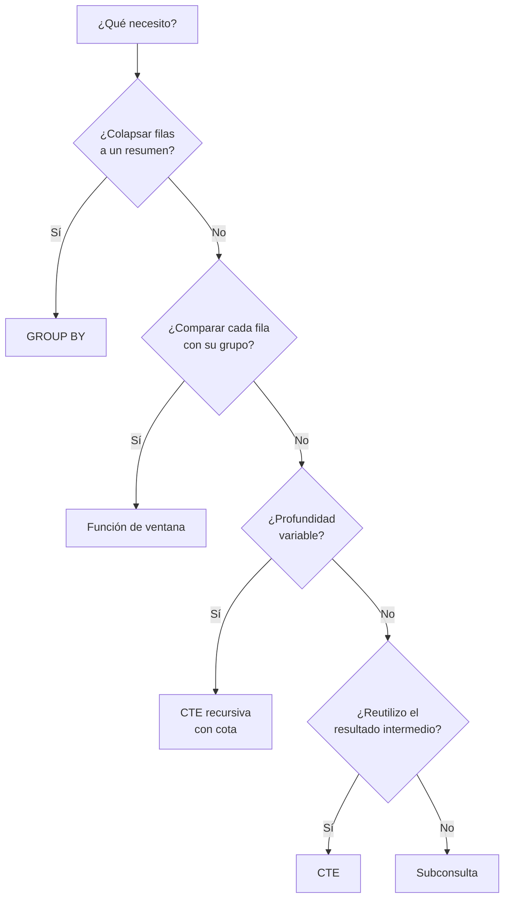

# 018 — CTE, subconsultas y funciones de ventana

> [Programa](../../../README.md) · [Parte 03](../README.md) · [← Anterior](../../part-03-sql-en-profundidad/017-agregacion-group-by-y-having/README.md) · [Siguiente →](../../part-03-sql-en-profundidad/019-nulos-y-logica-de-tres-valores/README.md)

Parte 03 — SQL en profundidad · Intermedio ·
4 horas estimadas · motores `postgresql`, `sqlite`, `duckdb` · laboratorio
[`labs/01-sql-foundations`](../../../labs/01-sql-foundations/README.md) · 4 fuentes.

**Conceptos centrales:** `CTE` · `recursión` · `subconsulta correlacionada` · `partición de ventana` · `marco`

---

## Propósito

Resolver con SQL preguntas que exigen comparar una fila con su grupo, recorrer jerarquías o numerar dentro de particiones — sin sacar los datos a la aplicación para procesarlos allí.

## Resultados de aprendizaje

Al terminar podrás:

1. Elegir entre subconsulta, CTE y función de ventana con criterio.
2. Escribir funciones de ventana con `PARTITION BY`, `ORDER BY` y marco explícito.
3. Distinguir `ROWS` de `RANGE` y explicar cuándo cambia el resultado.
4. Escribir una CTE recursiva y acotarla para que termine.
5. Resolver «el más reciente por grupo» de tres formas y compararlas.

## Fundamentos

### Las tres herramientas

| Herramienta | Qué aporta | Coste típico |
|---|---|---|
| Subconsulta no correlacionada | Se evalúa una vez | Bajo |
| Subconsulta correlacionada | Se evalúa por fila del exterior | Alto si no hay índice |
| CTE (`WITH`) | Nombra un resultado intermedio; permite recursión | Depende de si el motor la materializa |
| Función de ventana | Calcula sobre un grupo **sin colapsar filas** | Un ordenamiento por partición |

La diferencia esencial entre agregado y ventana: `GROUP BY` **reduce** N filas a una; la función de ventana **conserva** las N y añade una columna con el valor del grupo. Por eso la ventana es la respuesta natural a «compara cada fila con su grupo».

### Anatomía de una ventana

```sql
funcion() OVER (
    PARTITION BY expr      -- grupos independientes
    ORDER BY     expr      -- orden dentro del grupo
    ROWS BETWEEN ... AND ...   -- marco: qué filas entran
)
```

Familias de funciones:

| Familia | Funciones | Necesita `ORDER BY` |
|---|---|---|
| Numeración | `ROW_NUMBER`, `RANK`, `DENSE_RANK`, `NTILE` | Sí |
| Desplazamiento | `LAG`, `LEAD`, `FIRST_VALUE`, `LAST_VALUE` | Sí |
| Agregación | `SUM`, `AVG`, `COUNT`, `MIN`, `MAX` sobre `OVER` | Opcional |

### `ROWS` frente a `RANGE`: la trampa del marco

Si hay `ORDER BY` y no se especifica marco, el implícito es:

```sql
RANGE BETWEEN UNBOUNDED PRECEDING AND CURRENT ROW
```

`RANGE` agrupa por **valor**: todas las filas con el mismo valor de ordenación entran juntas en el marco. `ROWS` cuenta **filas físicas**.

Con notas `4.0, 5.0, 5.0, 6.0` y `SUM(nota) OVER (ORDER BY nota)`:

```text
RANGE (implícito)  ->  4.0, 14.0, 14.0, 20.0
ROWS  UNBOUNDED PRECEDING -> 4.0,  9.0, 14.0, 20.0
```

Las dos filas empatadas en 5,0 reciben con `RANGE` el mismo acumulado (14,0), porque el marco incluye a ambas. Para un total acumulado fila a fila, hay que escribir `ROWS` explícitamente. Esta es la causa número uno de acumulados «raros» y no aparece hasta que hay empates.

Lo mismo afecta a `LAST_VALUE`: con el marco implícito, «el último valor» es la fila actual, no el último del grupo. Hay que escribir `ROWS BETWEEN UNBOUNDED PRECEDING AND UNBOUNDED FOLLOWING`.

### CTE recursiva

```sql
WITH RECURSIVE prereq(curso_id, requiere_id, profundidad) AS (
    SELECT curso_id, requiere_id, 1
    FROM prerequisitos WHERE curso_id = :inicio
  UNION ALL
    SELECT p.curso_id, pr.requiere_id, p.profundidad + 1
    FROM prereq p
    JOIN prerequisitos pr ON pr.curso_id = p.requiere_id
    WHERE p.profundidad < 10                 -- cota obligatoria
)
SELECT DISTINCT requiere_id, MIN(profundidad) FROM prereq GROUP BY requiere_id;
```

Dos advertencias que no son opcionales:

- **`UNION ALL` no elimina duplicados**, así que un ciclo en los datos produce un bucle infinito. La cota de profundidad, o un `UNION` que sí deduplica, es obligatoria en datos no verificados.
- El cierre transitivo es exactamente lo que el cálculo relacional no expresa (clase 012). Si estas consultas dominan la carga, el modelo de grafos es la alternativa (clase 028).



## Ejemplo trabajado

Pregunta: *«la nota más reciente de cada estudiante en cada curso, junto con su diferencia respecto de la anterior»*.

**Forma 1 — ventana (recomendada):**

```sql
WITH ordenadas AS (
  SELECT student_id, course_id, nota, registrada_en,
         ROW_NUMBER() OVER (PARTITION BY student_id, course_id
                            ORDER BY registrada_en DESC, id DESC) AS rn,
         LAG(nota)    OVER (PARTITION BY student_id, course_id
                            ORDER BY registrada_en ASC,  id ASC)  AS nota_anterior
  FROM notas
)
SELECT student_id, course_id, nota,
       nota - nota_anterior AS variacion
FROM ordenadas
WHERE rn = 1;
```

Puntos clave:

- El `WHERE rn = 1` va en la CTE exterior porque las ventanas se calculan en el paso 5 y no se pueden filtrar en `WHERE` (clase 015).
- El desempate por `id` hace la selección **determinista** si dos registros comparten marca de tiempo. Sin él, dos ejecuciones pueden devolver notas distintas.
- `LAG` usa orden ascendente porque «la anterior» es cronológicamente previa.

**Forma 2 — subconsulta correlacionada:**

```sql
SELECT n.* FROM notas n
WHERE n.registrada_en = (
  SELECT MAX(n2.registrada_en) FROM notas n2
  WHERE n2.student_id = n.student_id AND n2.course_id = n.course_id
);
```

Legible, pero devuelve **dos filas** si hay empate en la marca de tiempo, y se evalúa una vez por fila del exterior.

**Forma 3 — `DISTINCT ON` (solo PostgreSQL):**

```sql
SELECT DISTINCT ON (student_id, course_id) *
FROM notas ORDER BY student_id, course_id, registrada_en DESC, id DESC;
```

La más corta y la más rápida en PostgreSQL, y no portable.

**Comparación medida** sobre 5 millones de filas de `notas` con índice en `(student_id, course_id, registrada_en)`:

| Forma | Recorridos | Determinista ante empates | Portable |
|---|---|---|---|
| Ventana | 1 + ordenamiento por partición | Sí, con desempate | Sí |
| Correlacionada | 1 + 1 por fila (o índice) | No | Sí |
| `DISTINCT ON` | 1 | Sí | No |

**Acumulado con marco explícito** — nota acumulada por estudiante:

```sql
SELECT student_id, registrada_en, nota,
       SUM(nota) OVER (PARTITION BY student_id ORDER BY registrada_en, id
                       ROWS BETWEEN UNBOUNDED PRECEDING AND CURRENT ROW) AS acumulado
FROM notas;
```

Escribir `ROWS` es lo que garantiza que dos notas registradas en el mismo instante no compartan el mismo acumulado.

## Comparación

| Pregunta | Herramienta |
|---|---|
| «Total por grupo» | `GROUP BY` |
| «Porcentaje de cada fila sobre su grupo» | `SUM() OVER (PARTITION BY ...)` |
| «Top N por grupo» | `ROW_NUMBER()` + filtro externo |
| «Diferencia con la fila anterior» | `LAG` |
| «Todos los ancestros» | CTE recursiva |
| «¿Existe alguno?» | `EXISTS` (clase 016) |
| «Media móvil de 7 días» | `AVG() OVER (... ROWS 6 PRECEDING)` |

## Errores frecuentes

1. **Filtrar una ventana en `WHERE`.** No existe todavía; hace falta CTE o subconsulta.
2. **Omitir el marco y esperar acumulado fila a fila.** El implícito es `RANGE` y agrupa empates.
3. **`LAST_VALUE` sin marco completo.** Devuelve la fila actual.
4. **CTE recursiva sin cota.** Un ciclo en los datos bloquea la sesión.
5. **`RANK` cuando se quería `ROW_NUMBER`.** `RANK` deja huecos y repite posiciones en empates.
6. **Ordenación no determinista.** Sin desempate, el «más reciente» cambia entre ejecuciones.

## De la clase a la operación

Bajar 5 millones de filas a la aplicación para calcular un acumulado consume ancho de banda, memoria y tiempo, y produce un resultado que el motor habría calculado usando un índice ya existente. Las funciones de ventana son, en la práctica, la diferencia entre un informe de 200 ms y uno de 40 s.

## Reto de transferencia

1. Busca en tu código un cálculo por grupo que hoy se hace en la aplicación y llévalo a una ventana.
2. Mide el volumen transferido antes y después.
3. Escribe la misma consulta con `RANGE` y con `ROWS` y demuestra la diferencia con empates.
4. Implementa una CTE recursiva sobre una jerarquía tuya, con cota, y prueba qué pasa al introducir un ciclo.

## Preguntas de evaluación

1. ¿Por qué no se puede filtrar `ROW_NUMBER()` en `WHERE`?
2. Da un conjunto de datos donde `ROWS` y `RANGE` produzcan acumulados distintos.
3. Explica por qué la subconsulta correlacionada puede devolver dos filas donde la ventana devuelve una.
4. Escribe la cota de una CTE recursiva sobre tu jerarquía y justifica el valor elegido.

---

## Laboratorio

```bash
python scripts/validate_repository.py
python labs/01-sql-foundations/run_lab.py
```

Guarda como evidencia la salida completa, la versión del motor y la semilla o
los parámetros usados. Una captura sin comando no es evidencia: no se puede
repetir.

## Evaluación

| Criterio | Peso | Qué se comprueba |
|---|---:|---|
| Comprensión conceptual | 25 % | Explica el mecanismo, no solo el resultado |
| Ejecución reproducible | 25 % | Otra persona obtiene lo mismo con las instrucciones dadas |
| Interpretación basada en evidencia | 25 % | Cada conclusión se apoya en una salida o una medición |
| Límites y riesgos declarados | 25 % | Dice qué no demuestra el ejercicio y qué faltaría en producción |

La clase se da por superada cuando la respuesta explica el mecanismo, muestra
la salida que la respalda y declara al menos un límite del ejercicio.

## Fuentes de esta clase

Todo lo afirmado arriba procede de estas obras. Los identificadores viven en
[`catalog/sources.json`](../../../catalog/sources.json) y el estado de los
enlaces se comprueba con `python scripts/check_external_links.py`.

- **Joe Celko** (2014). [Joe Celko's SQL for Smarties: Advanced SQL Programming](https://www.sciencedirect.com/book/9780128007617/joe-celkos-sql-for-smarties). 5.a ed. Morgan Kaufmann. ISBN 978-0-12-800761-7.  
  Modelado de jerarquias, conjuntos anidados y SQL declarativo avanzado.
- **Anthony Molinaro, Robert de Graaf** (2020). [SQL Cookbook](https://www.oreilly.com/library/view/sql-cookbook-2nd/9781492077435/). 2.a ed. O'Reilly. ISBN 978-1-4920-7744-2.  
  Recetas comparadas entre dialectos, útil para la matriz de portabilidad.
- **ISO/IEC JTC 1/SC 32** (2023). [ISO/IEC 9075: Information technology - Database languages - SQL](https://www.iso.org/standard/76583.html).  
  Norma del lenguaje SQL. Ningún motor la implementa por completo.
- **PostgreSQL Global Development Group** (2026). [PostgreSQL Documentation](https://www.postgresql.org/docs/current/).  
  Documentación de referencia del motor relacional principal del programa.

---

> [Programa](../../../README.md) · [Parte 03](../README.md) · [← Anterior](../../part-03-sql-en-profundidad/017-agregacion-group-by-y-having/README.md) · [Siguiente →](../../part-03-sql-en-profundidad/019-nulos-y-logica-de-tres-valores/README.md)
