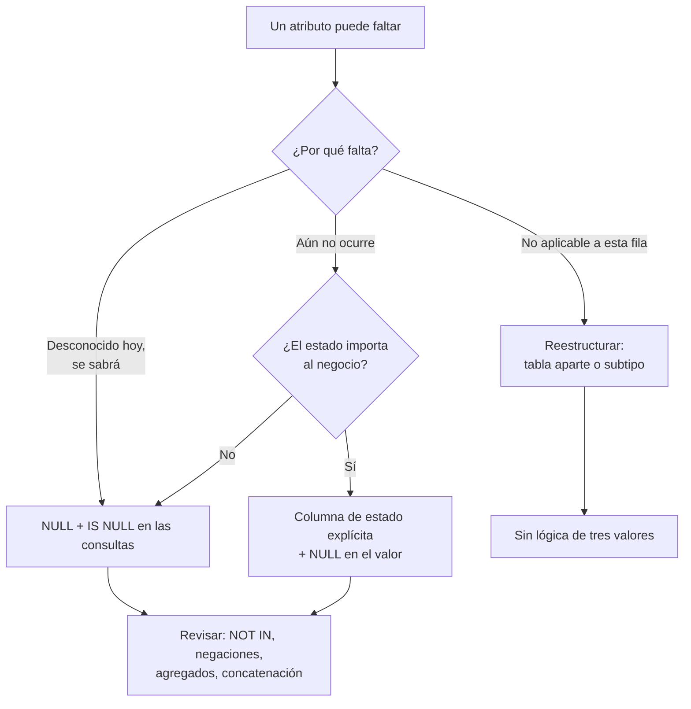

## Propósito

Manejar la ausencia de información sin que produzca resultados falsos. El nulo de SQL no es un valor: es una marca, y la lógica que lo gobierna tiene tres estados, no dos.

## Resultados de aprendizaje

Al terminar podrás:

1. Evaluar expresiones bajo lógica de tres valores.
2. Explicar por qué `NULL = NULL` no es verdadero y dónde sí se comparan como iguales.
3. Predecir el efecto de los nulos en `WHERE`, `JOIN`, `GROUP BY`, `UNIQUE` y `CHECK`.
4. Elegir entre `IS DISTINCT FROM`, `COALESCE` y reestructurar el esquema.
5. Distinguir los tres significados que la gente mete en un mismo nulo.

## Fundamentos

### Tres valores de verdad

Codd (1979) introdujo el nulo para representar información faltante. La consecuencia es que toda comparación con nulo devuelve `UNKNOWN`:

```text
AND       V   F   U          OR        V   F   U          NOT
V         V   F   U          V         V   V   V          V -> F
F         F   F   F          F         V   F   U          F -> V
U         U   F   U          U         V   U   U          U -> U
```

Regla operativa: **`WHERE` deja pasar solo `TRUE`**. `FALSE` y `UNKNOWN` se descartan igual, y esa equiparación es la que engaña.

### Dónde los nulos se comportan de forma distinta

Aquí está la inconsistencia real de SQL, y conviene tenerla en una tabla:

| Contexto | ¿Dos nulos son iguales? |
|---|---|
| `WHERE a = b` | No (`UNKNOWN`) |
| `GROUP BY` | **Sí**: todos los nulos forman un solo grupo |
| `DISTINCT` | **Sí**: se conserva un solo nulo |
| `UNION` / `INTERSECT` / `EXCEPT` | **Sí** |
| `ORDER BY` | **Sí**: se agrupan al principio o al final |
| Índice `UNIQUE` | **No** (norma): admite varios nulos |
| `IS NOT DISTINCT FROM` | **Sí**, por definición |
| Clave primaria | Prohibidos |

Que `GROUP BY` los agrupe y `=` no los iguale no es un error de nadie: son operadores distintos con definiciones distintas. Pero explica por qué un `DISTINCT` y un `JOIN` sobre la misma columna dan resultados que no cuadran.

### El caso `UNIQUE`

```sql
CREATE TABLE t (email TEXT UNIQUE);
INSERT INTO t VALUES (NULL), (NULL), (NULL);   -- las tres pasan
```

Según la norma, un índice único admite múltiples nulos, porque no puede afirmar que dos desconocidos sean iguales. SQL Server es la excepción: solo admite uno. PostgreSQL 15 añadió `UNIQUE NULLS NOT DISTINCT` para el otro comportamiento.

Este detalle se aprovecha a propósito: una columna generada que vale `NULL` cuando la fila no debe participar en la restricción emula la unicidad condicional en motores sin índices parciales (clase 014).

### Las tres trampas

**1. `NOT IN` con nulos:**

```sql
SELECT * FROM students WHERE id NOT IN (SELECT student_id FROM enrollments);
```

Si la subconsulta devuelve un nulo, la expresión se convierte en `id<>x ∧ id<>y ∧ id<>NULL` → `... ∧ UNKNOWN` → nunca `TRUE`. Resultado: **cero filas**, sin error. `NOT EXISTS` no tiene este problema.

**2. Negación que no devuelve el complemento:**

```sql
SELECT COUNT(*) FROM enrollments WHERE nota >= 4.0;   -- 24
SELECT COUNT(*) FROM enrollments WHERE nota <  4.0;   -- 8
SELECT COUNT(*) FROM enrollments;                      -- 40
```

24 + 8 = 32, no 40. Faltan las 8 filas con nota nula, que no cumplen ninguna de las dos condiciones. Para el complemento real: `WHERE nota < 4.0 OR nota IS NULL`.

**3. Concatenación y aritmética:**

```sql
SELECT 'Total: ' || total FROM ventas;   -- NULL si total es NULL, no 'Total: '
SELECT precio * cantidad FROM items;     -- NULL si cualquiera lo es
```

Un nulo se propaga por toda la expresión.

### Tres significados en una sola marca

El problema de fondo, que ninguna sintaxis resuelve: `NULL` se usa para al menos tres cosas distintas.

| Significado | Ejemplo | Tratamiento correcto |
|---|---|---|
| Desconocido | No sabemos el teléfono, pero existe | Nulo es adecuado |
| No aplicable | Fecha de egreso de quien sigue estudiando | Mejor reestructurar |
| Aún no ocurrido | Nota de una inscripción sin calificar | Nulo o estado explícito |

Date argumenta que confundirlos es la raíz del problema, y propone evitar los nulos reestructurando: sacar el atributo opcional a una tabla propia donde su ausencia se representa como ausencia de fila. Es la solución más limpia y también la que añade una reunión; la decisión se toma caso a caso.



## Ejemplo trabajado

Tabla `enrollments` con 40 filas: 24 con nota ≥ 4,0; 8 con nota < 4,0; 8 con nota nula.

```sql
-- 1. ¿Cuántos no aprobaron?
SELECT COUNT(*) FROM enrollments WHERE nota < 4.0;                   -- 8
SELECT COUNT(*) FROM enrollments WHERE NOT (nota >= 4.0);            -- 8  (¡no 16!)
SELECT COUNT(*) FROM enrollments WHERE nota < 4.0 OR nota IS NULL;   -- 16
```

La segunda consulta es la que engaña: parece la negación de la primera y no lo es, porque `NOT UNKNOWN` es `UNKNOWN`.

```sql
-- 2. Promedio: dos preguntas distintas
SELECT AVG(nota) FROM enrollments;                      -- sobre 32 calificados
SELECT AVG(COALESCE(nota, 0)) FROM enrollments;         -- sobre 40, no calificadas = 0
```

```sql
-- 3. Comparar dos columnas que pueden ser nulas
SELECT * FROM notas WHERE nota_anterior <> nota;                     -- pierde filas
SELECT * FROM notas WHERE nota_anterior IS DISTINCT FROM nota;       -- correcto
```

`IS DISTINCT FROM` trata dos nulos como iguales y un nulo frente a un valor como distintos, que es lo que casi siempre se quiere al detectar cambios. Está en PostgreSQL y SQLite; MySQL usa el operador `<=>` para la forma negada.

**Reestructuración como alternativa.** Si `fecha_egreso` es nula para todos los estudiantes activos, en vez de:

```sql
CREATE TABLE students (id INTEGER PRIMARY KEY, nombre TEXT, fecha_egreso DATE);
```

se puede escribir:

```sql
CREATE TABLE students  (id INTEGER PRIMARY KEY, nombre TEXT NOT NULL);
CREATE TABLE egresos   (student_id INTEGER PRIMARY KEY REFERENCES students(id),
                        fecha DATE NOT NULL);
```

Ahora «egresado» es la existencia de una fila, no un valor especial. Las consultas usan `EXISTS`/`NOT EXISTS` y desaparece la lógica de tres valores. El costo: una reunión más y una tabla más.

**Traza del beneficio:** la consulta «estudiantes no egresados» pasa de `WHERE fecha_egreso IS NULL` —correcta pero frágil ante quien escriba `<> ''`— a `NOT EXISTS (...)`, que no admite interpretación ambigua.

## Comparación

| Operación | Con nulos | Alternativa segura |
|---|---|---|
| `a = b` | `UNKNOWN` | `a IS NOT DISTINCT FROM b` |
| `a <> b` | `UNKNOWN` | `a IS DISTINCT FROM b` |
| `x NOT IN (sub)` | Vacío si hay nulos | `NOT EXISTS` |
| `SUM(col)` sobre vacío | `NULL` | `COALESCE(SUM(col), 0)` |
| `'a' \|\| col` | `NULL` | `'a' \|\| COALESCE(col, '')` |
| `CHECK (col > 0)` | Acepta nulos | `CHECK (col IS NOT NULL AND col > 0)` |

## Errores frecuentes

1. **`= NULL` en vez de `IS NULL`.** No da error: no devuelve nada.
2. **Suponer que una condición y su negación cubren todas las filas.** Nunca cubren los nulos.
3. **`NOT IN` con subconsulta sin `NOT NULL` garantizado.**
4. **`CHECK` que no rechaza nulos.** Deja pasar exactamente lo que se quería prohibir.
5. **Usar un centinela (`-1`, `''`, `'1900-01-01'`).** Cambia un problema conocido por uno silencioso que contamina agregados.
6. **Permitir nulos por defecto al crear tablas.** `NOT NULL` debería ser la elección por omisión mental.

## De la clase a la operación

Los descuadres entre informes suelen resolverse en la misma línea: uno de los dos contaba los nulos y el otro no. Declarar `NOT NULL` siempre que sea cierto elimina la clase entera de problemas antes de que exista.

## Reto de transferencia

1. Localiza en un esquema real una columna que admita nulos con dos significados distintos mezclados.
2. Escribe una consulta que hoy devuelva un resultado incorrecto por esa causa, con las cifras.
3. Propón la reestructuración que elimina el nulo y estima su costo.
4. Audita tu código en busca de `NOT IN` sobre subconsultas y verifica cuáles pueden devolver nulos.

## Preguntas de evaluación

1. Evalúa `NULL OR TRUE`, `NULL AND FALSE` y `NOT NULL` bajo lógica de tres valores.
2. ¿Por qué `GROUP BY` agrupa los nulos y `=` no los iguala?
3. Da un caso donde un índice `UNIQUE` con varios nulos sea el comportamiento deseado.
4. Convierte una columna con nulo «no aplicable» a un diseño sin nulos y compara las dos consultas equivalentes.
