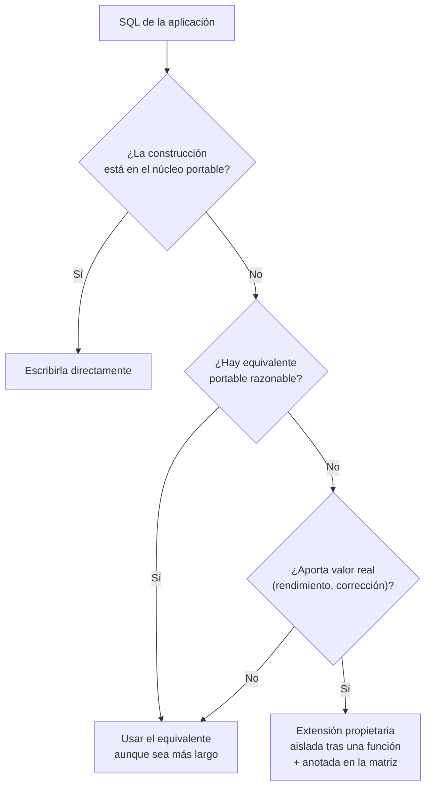

# 020 — Portabilidad: qué exige la norma y qué añade cada motor

> [Programa](../../../README.md) · [Parte 04](../README.md) · [← Anterior](../../part-03-sql-en-profundidad/019-nulos-y-logica-de-tres-valores/README.md) · [Siguiente →](../../part-04-motores-relacionales-y-dialectos/021-postgresql-tipos-extensiones-y-procesos/README.md)

| | |
|---|---|
| **Parte** | 04 — Motores relacionales y dialectos |
| **Nivel** | Intermedio |
| **Horas estimadas** | 3 |
| **Motores** | `postgresql`, `mysql`, `sqlite`, `sql-server`, `oracle-database` |
| **Laboratorio** | [`labs/03-transactions`](../../../labs/03-transactions/README.md) |
| **Fuentes** | 4 |

**Conceptos centrales:** `norma frente a producto` · `matriz de portabilidad` · `extensión propietaria`

---

## Propósito

Escribir SQL que sobreviva a un cambio de motor, y saber exactamente dónde se paga por no hacerlo. La portabilidad total no existe; la portabilidad *gestionada* sí.

## Resultados de aprendizaje

Al terminar podrás:

1. Explicar por qué ningún motor implementa la norma completa.
2. Construir una matriz de portabilidad para tu propio código.
3. Aislar las divergencias en una capa en vez de esparcirlas.
4. Decidir cuándo usar una extensión propietaria a sabiendas.
5. Distinguir divergencia sintáctica de divergencia semántica, que es mucho peor.

## Fundamentos

### Qué es la norma y qué no

ISO/IEC 9075 define SQL en varias partes y con niveles de conformidad. La realidad es que **ningún producto implementa la norma completa** y todos añaden extensiones. La norma no es un contrato de compatibilidad: es un vocabulario común.

Lo estable en la práctica —el «núcleo portable»— es aproximadamente:

`CREATE TABLE` con tipos básicos · `PRIMARY KEY`, `FOREIGN KEY`, `UNIQUE`, `CHECK`, `NOT NULL` · `SELECT/FROM/WHERE/GROUP BY/HAVING/ORDER BY` · `INNER`, `LEFT`, `RIGHT`, `FULL JOIN` · `UNION`, `INTERSECT`, `EXCEPT` · subconsultas y `EXISTS` · CTE y `WITH RECURSIVE` · funciones de ventana · `INSERT`, `UPDATE`, `DELETE` · `BEGIN`/`COMMIT`/`ROLLBACK`.

Lo que **no** es portable, aunque lo parezca: tipos de fecha y hora, funciones de cadena, autoincremento, `LIMIT`, `UPSERT`, tipos JSON, expresiones regulares, `TOP`/`FETCH`, y —la peor— la colación.

### Sintáctica frente a semántica

Esta distinción es la que decide cuánto duele una migración.

- **Divergencia sintáctica:** el mismo concepto se escribe distinto. Falla al ejecutar, se ve enseguida, se arregla una vez.
- **Divergencia semántica:** la misma sintaxis hace cosas distintas. **No falla**: devuelve otro resultado. Se descubre en un informe, meses después.

| Divergencia | Tipo | Consecuencia |
|---|---|---|
| `LIMIT` frente a `FETCH FIRST` frente a `TOP` | Sintáctica | Error de sintaxis |
| `AUTO_INCREMENT` / `SERIAL` / `IDENTITY` | Sintáctica | Error en DDL |
| Concatenación `\|\|` frente a `CONCAT()` | Sintáctica | Error, salvo en MySQL donde `\|\|` es `OR` |
| Comparación de texto sensible o no a mayúsculas | **Semántica** | Resultados distintos, sin error |
| División entera frente a decimal | **Semántica** | Números distintos |
| Cadena vacía tratada como nulo (Oracle) | **Semántica** | Filas que aparecen o desaparecen |
| Redondeo a la mitad | **Semántica** | Descuadres contables |

El caso de `||` en MySQL merece atención: con el modo `PIPES_AS_CONCAT` desactivado, `'a' || 'b'` se evalúa como `'a' OR 'b'` → `0`. No es un error; es un resultado equivocado.

### Estrategias



La regla operativa: **usar extensiones está permitido; esparcirlas por todo el código, no**. Una extensión aislada en un único punto es una decisión reversible; la misma extensión en 200 consultas es una migración de trimestre.

## Ejemplo trabajado

Consulta «los 10 estudiantes con mejor promedio», en cinco dialectos.

```sql
-- Núcleo portable (norma SQL:2008, soportado hoy por PostgreSQL, SQL Server, Oracle, MariaDB 10.6+)
SELECT s.id, s.nombre, AVG(e.nota) AS promedio
FROM students s JOIN enrollments e ON e.student_id = s.id
GROUP BY s.id, s.nombre
ORDER BY promedio DESC, s.id
FETCH FIRST 10 ROWS ONLY;
```

| Motor | Cláusula de límite | ¿Acepta `FETCH FIRST`? |
|---|---|---|
| PostgreSQL | `LIMIT 10` | Sí |
| MySQL / MariaDB | `LIMIT 10` | Solo MariaDB reciente |
| SQLite | `LIMIT 10` | No |
| SQL Server | `TOP 10` u `OFFSET ... FETCH` | Sí, con `ORDER BY` |
| Oracle | `FETCH FIRST 10 ROWS ONLY` (12c+) | Sí |

Como SQLite y MySQL no aceptan `FETCH FIRST`, el mínimo común denominador real hoy es `LIMIT`, que **no** está en la norma. Conclusión honesta: la portabilidad se negocia contra el conjunto de motores que uno realmente soporta, no contra la norma.

**Ahora la divergencia semántica**, mucho más peligrosa:

```sql
SELECT * FROM students WHERE email = 'ANA@EJEMPLO.CL';
```

| Motor | Colación por defecto | ¿Encuentra `ana@ejemplo.cl`? |
|---|---|---|
| MySQL 8 | `utf8mb4_0900_ai_ci` | **Sí** |
| PostgreSQL | Del sistema, sensible | **No** |
| SQLite | `BINARY` | **No** |
| SQL Server | Suele ser `_CI_AS` | **Sí** |

Una aplicación desarrollada sobre MySQL y desplegada sobre PostgreSQL deja de encontrar usuarios al iniciar sesión, sin ningún error en los registros. La defensa no es configurar la colación: es **normalizar al escribir**.

```sql
CREATE TABLE students (
  id     INTEGER PRIMARY KEY,
  email  TEXT NOT NULL CHECK (email = lower(email)),
  UNIQUE (email)
);
```

El `CHECK` convierte una suposición implícita en una regla comprobada por el motor, en cualquier motor.

**Aritmética:**

```sql
SELECT 7 / 2;
```

| Motor | Resultado |
|---|---|
| PostgreSQL, Oracle, SQL Server | `3` (división entera) |
| MySQL | `3.5` |
| SQLite | `3` |

Escribir `7.0 / 2` o `CAST(7 AS NUMERIC) / 2` elimina la ambigüedad en todos.

**Inserción idempotente (`UPSERT`)**, ninguna forma es portable:

```sql
-- PostgreSQL, SQLite
INSERT INTO t (id, v) VALUES (1,'x') ON CONFLICT (id) DO UPDATE SET v = excluded.v;
-- MySQL
INSERT INTO t (id, v) VALUES (1,'x') ON DUPLICATE KEY UPDATE v = VALUES(v);
-- Norma (SQL Server, Oracle): MERGE
```

Esta es la construcción que más justifica una capa de aislamiento: se usa constantemente y se escribe distinto en todos.

## Comparación

| Aspecto | Escribir portable | Usar extensiones libremente |
|---|---|---|
| Velocidad de desarrollo | Menor | Mayor |
| Costo de migrar | Bajo | Alto o prohibitivo |
| Rendimiento | A veces peor | Mejor si la extensión existe por algo |
| Riesgo semántico | Bajo si se normaliza | Alto |
| Recomendación | Núcleo portable por defecto | Extensiones aisladas y documentadas |

## Errores frecuentes

1. **Suponer que «SQL es SQL».** El núcleo común es más pequeño de lo que parece.
2. **Confiar en la colación por defecto.** Es la divergencia semántica más frecuente y la más silenciosa.
3. **Depender de la división entera o del redondeo.** Cambia entre motores.
4. **Usar `||` en MySQL sin activar `PIPES_AS_CONCAT`.** Devuelve `0`.
5. **Probar solo en el motor de desarrollo.** Si producción usa otro, la matriz no se ha comprobado, se ha imaginado.
6. **Portabilidad como dogma.** Renunciar a `jsonb` o a índices parciales «por si acaso» cuesta más de lo que ahorra.

## De la clase a la operación

La migración de motor rara vez se decide por gusto: llega por licencias, por costo de nube o por una adquisición. El código que la sobrevive es el que aisló las diferencias cuando no había ninguna urgencia.

## Reto de transferencia

1. Toma 10 consultas reales de tu proyecto y clasifícalas: núcleo portable, divergencia sintáctica o semántica.
2. Ejecuta las 10 en dos motores del `docker-compose` y captura las diferencias.
3. Escribe la matriz de portabilidad resultante, con la construcción y su equivalente en cada motor.
4. Aísla la construcción menos portable tras una única función y demuestra que el resto del código no cambia.

## Preguntas de evaluación

1. Da un ejemplo propio de divergencia semántica y explica por qué es peor que una sintáctica.
2. ¿Por qué `LIMIT` es más portable en la práctica que `FETCH FIRST`, pese a no estar en la norma?
3. Escribe el `UPSERT` de tu dominio en tres dialectos.
4. Justifica un caso donde usarías una extensión propietaria a sabiendas, y cómo la documentarías.

---

## Laboratorio

```bash
python scripts/validate_repository.py
python labs/03-transactions/run_lab.py
```

Guarda como evidencia la salida completa, la versión del motor y la semilla o
los parámetros usados. Una captura sin comando no es evidencia: no se puede
repetir.

## Evaluación

| Criterio | Peso | Qué se comprueba |
|---|---:|---|
| Comprensión conceptual | 25 % | Explica el mecanismo, no solo el resultado |
| Ejecución reproducible | 25 % | Otra persona obtiene lo mismo con las instrucciones dadas |
| Interpretación basada en evidencia | 25 % | Cada conclusión se apoya en una salida o una medición |
| Límites y riesgos declarados | 25 % | Dice qué no demuestra el ejercicio y qué faltaría en producción |

La clase se da por superada cuando la respuesta explica el mecanismo, muestra
la salida que la respalda y declara al menos un límite del ejercicio.

## Fuentes de esta clase

Todo lo afirmado arriba procede de estas obras. Los identificadores viven en
[`catalog/sources.json`](../../../catalog/sources.json) y el estado de los
enlaces se comprueba con `python scripts/check_external_links.py`.

- **ISO/IEC JTC 1/SC 32** (2023). [ISO/IEC 9075: Information technology - Database languages - SQL](https://www.iso.org/standard/76583.html).  
  Norma del lenguaje SQL. Ningún motor la implementa por completo.
- **Anthony Molinaro, Robert de Graaf** (2020). [SQL Cookbook](https://www.oreilly.com/library/view/sql-cookbook-2nd/9781492077435/). 2.a ed. O'Reilly. ISBN 978-1-4920-7744-2.  
  Recetas comparadas entre dialectos, útil para la matriz de portabilidad.
- **Oracle** (2026). [MySQL Reference Manual](https://dev.mysql.com/doc/).  
  Dialecto y comportamiento del motor InnoDB.
- **PostgreSQL Global Development Group** (2026). [PostgreSQL Documentation](https://www.postgresql.org/docs/current/).  
  Documentación de referencia del motor relacional principal del programa.

---

> [Programa](../../../README.md) · [Parte 04](../README.md) · [← Anterior](../../part-03-sql-en-profundidad/019-nulos-y-logica-de-tres-valores/README.md) · [Siguiente →](../../part-04-motores-relacionales-y-dialectos/021-postgresql-tipos-extensiones-y-procesos/README.md)
