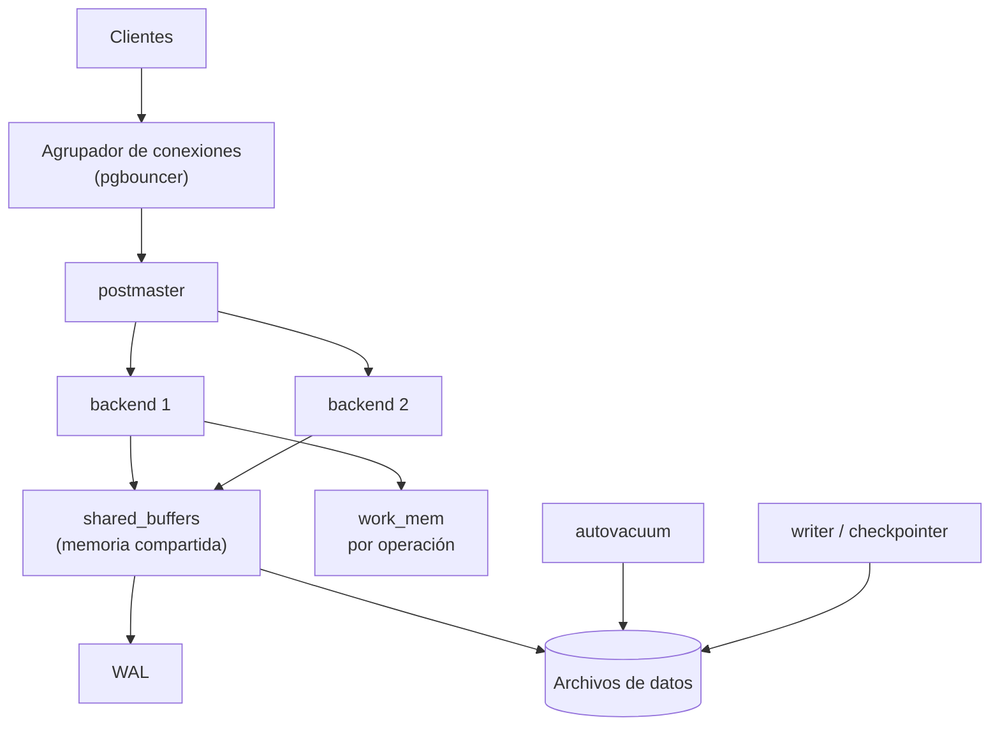

# 021 — PostgreSQL: tipos, extensiones y modelo de procesos

> [Programa](../../../README.md) · [Parte 04](../README.md) · [← Anterior](../../part-04-motores-relacionales-y-dialectos/020-portabilidad-y-matriz-de-dialectos/README.md) · [Siguiente →](../../part-04-motores-relacionales-y-dialectos/022-mysql-sqlserver-y-oracle-divergencias/README.md)

Parte 04 — Motores relacionales y dialectos · Intermedio ·
3 horas estimadas · motores `postgresql` · laboratorio
[`labs/03-transactions`](../../../labs/03-transactions/README.md) · 3 fuentes.

**Conceptos centrales:** `extensión` · `tipo compuesto` · `proceso por conexión` · `autovacuum`

**En este caso se comparan 8 motores**: 7 lo resuelven (6 con el resultado comprobado por máquina) y 1 no, con el motivo escrito.

---

## Propósito

Conocer PostgreSQL lo suficiente para usarlo bien y para saber qué de él **no** es transferible a otros motores. Es el motor de referencia del programa por su cobertura de la norma y su documentación.

## Resultados de aprendizaje

Al terminar podrás:

1. Describir el modelo de proceso de PostgreSQL y su consecuencia sobre las conexiones.
2. Explicar por qué existe `VACUUM` y qué ocurre si no se ejecuta.
3. Elegir entre `json` y `jsonb` con criterio.
4. Usar extensiones sin convertir el esquema en algo irreproducible.
5. Dimensionar la memoria compartida frente a la de sesión.

## Fundamentos

### Un proceso por conexión

PostgreSQL arranca un proceso del sistema operativo por cada conexión. Ventaja: aislamiento fuerte, un fallo no derriba el servidor. Costo: cada conexión reserva memoria propia y su creación no es barata.

De ahí la regla operativa más importante del motor: **usar siempre un agrupador de conexiones**. Sin él, 1 000 clientes web abren 1 000 procesos, y el servidor pasa más tiempo cambiando de contexto que trabajando.

| Parámetro | Ámbito | Nota |
|---|---|---|
| `shared_buffers` | Compartido | Caché de páginas. Típicamente 25 % de la RAM |
| `work_mem` | **Por operación**, no por conexión | Un plan con 3 ordenamientos puede usar 3 × `work_mem` |
| `maintenance_work_mem` | Por operación de mantenimiento | Afecta a `VACUUM` y a la creación de índices |
| `effective_cache_size` | Estimación para el planificador | No reserva memoria: informa al optimizador |

El error de configuración más caro es tratar `work_mem` como si fuese por conexión. Con 200 conexiones y planes que usan tres ordenamientos, el consumo real es 600 × `work_mem`.

### MVCC y `VACUUM`

PostgreSQL implementa control de concurrencia multiversión (clase 035): un `UPDATE` **no** modifica la fila, escribe una versión nueva y marca la anterior como muerta. Un `DELETE` solo marca.

Consecuencias que hay que aceptar:

- Las filas muertas ocupan espacio hasta que `VACUUM` las recupera.
- Una tabla con muchas actualizaciones **se hincha** si el autovacuum no va al ritmo.
- Los identificadores de transacción son finitos; sin vacuum, el motor llega a un punto en que se detiene para protegerse.

```sql
SELECT relname, n_live_tup, n_dead_tup,
       round(100.0 * n_dead_tup / NULLIF(n_live_tup + n_dead_tup, 0), 1) AS pct_muertas
FROM pg_stat_user_tables
ORDER BY n_dead_tup DESC LIMIT 10;
```

Rogov documenta el mecanismo completo. Lo relevante aquí: `VACUUM` no es «limpieza opcional», es parte del funcionamiento normal, y su ausencia se manifiesta como degradación progresiva.

### Tipos que evitan tablas

PostgreSQL ofrece tipos que resuelven modelados que en otros motores exigen tablas adicionales:

| Tipo | Reemplaza a | Cuidado |
|---|---|---|
| `jsonb` | Tabla de atributos dinámicos | Sin restricciones dentro; se indexa con GIN |
| `tstzrange` | Par de columnas desde/hasta | Habilita `EXCLUDE` contra solapamientos |
| `text[]` | Tabla puente para etiquetas | Rompe la 1FN; sin integridad referencial |
| `inet`, `cidr` | Texto con validación manual | Valida y permite operadores de red |
| `uuid` | `CHAR(36)` | 16 bytes en vez de 36 |
| `numeric` | Decimal exacto | Más lento que `bigint` |

**`json` frente a `jsonb`:** `json` guarda el texto tal cual (conserva orden de claves y espacios, no se indexa bien); `jsonb` guarda una representación binaria descompuesta (más rápida de consultar, indexable con GIN, no conserva el orden de claves ni los duplicados). Para casi todo uso, `jsonb`.

La advertencia importante: `jsonb` **no** es una excusa para no modelar. Dentro de un `jsonb` no hay tipos, ni `NOT NULL`, ni claves foráneas. Es adecuado para datos genuinamente heterogéneos —una carga útil de un proveedor externo, atributos que varían por categoría—, no para las columnas del dominio.

### Extensiones

```sql
CREATE EXTENSION IF NOT EXISTS pg_stat_statements;
CREATE EXTENSION IF NOT EXISTS pg_trgm;
CREATE EXTENSION IF NOT EXISTS vector;      -- pgvector, parte 12
```

| Extensión | Para qué |
|---|---|
| `pg_stat_statements` | Consultas más costosas acumuladas: la primera que instalar |
| `pg_trgm` | Búsqueda por similitud y `LIKE '%x%'` indexado |
| `postgis` | Datos geográficos |
| `pgvector` | Búsqueda vectorial dentro del mismo motor (clase 059) |
| `citext` | Texto insensible a mayúsculas sin depender de la colación |

Regla de reproducibilidad: cada `CREATE EXTENSION` debe estar en una migración versionada. Una extensión instalada a mano en producción convierte el esquema en algo que nadie puede recrear.



## Ejemplo trabajado

Modelamos atributos que varían por tipo de curso: los presenciales tienen sala y aforo; los remotos, plataforma y enlace.

**Opción A — columnas para todo:** seis columnas nulas la mitad del tiempo, sin forma de exigir que las de presencial estén presentes justo cuando el curso es presencial.

**Opción B — `jsonb` con validación explícita:**

```sql
CREATE TABLE courses (
  id        INTEGER PRIMARY KEY,
  nombre    TEXT NOT NULL,
  modalidad TEXT NOT NULL CHECK (modalidad IN ('presencial','remoto')),
  detalles  JSONB NOT NULL DEFAULT '{}'::jsonb,
  CONSTRAINT detalles_coherentes CHECK (
    (modalidad = 'presencial' AND detalles ? 'sala'       AND detalles ? 'aforo') OR
    (modalidad = 'remoto'     AND detalles ? 'plataforma' AND detalles ? 'enlace')
  )
);

CREATE INDEX courses_detalles_gin ON courses USING gin (detalles);
CREATE INDEX courses_sala ON courses ((detalles->>'sala')) WHERE modalidad = 'presencial';
```

Lo que aporta cada pieza:

- El `CHECK` con el operador `?` («la clave existe») recupera parte de la integridad que `jsonb` no da por sí solo.
- El índice GIN permite `WHERE detalles @> '{"sala":"B-201"}'` sin barrido.
- El índice de expresión **parcial** sirve la consulta más frecuente con una fracción del tamaño: solo indexa las filas presenciales.

**Medición del índice parcial** con 100 000 cursos, 30 % presenciales:

```text
Índice completo sobre (detalles->>'sala')  ~ 100 000 entradas
Índice parcial WHERE modalidad='presencial' ~ 30 000 entradas
```

Menos entradas significa menos páginas, más aciertos de caché y mantenimiento más barato en cada escritura de un curso remoto (que ya no toca ese índice).

**Opción C — tablas por subtipo:** dos tablas hijas con clave foránea al curso. Integridad total, sin `jsonb`, a cambio de una reunión y de DDL para cada modalidad nueva.

La elección honesta: si las modalidades son dos y estables, C. Si el proveedor añade campos cada mes, B.

## Comparación

| Necesidad | PostgreSQL | Equivalente portable |
|---|---|---|
| Atributos dinámicos | `jsonb` + GIN | Tabla clave-valor |
| Unicidad condicional | Índice único parcial | Columna generada con nulos |
| Sin solapamiento de rangos | `EXCLUDE USING gist` | Comprobación en la aplicación |
| Texto insensible a mayúsculas | `citext` o `lower()` indexado | Normalizar al escribir |
| Consultas más caras | `pg_stat_statements` | Registro de consultas lentas |

## Errores frecuentes

1. **Conexiones directas sin agrupador.** Es la causa más común de caída bajo carga.
2. **`work_mem` alto con muchas conexiones.** Multiplica por operación, no por sesión.
3. **Desactivar el autovacuum «porque consume».** Consume más lo que ocurre después.
4. **`jsonb` para el dominio.** Se pierden tipos, restricciones y claves foráneas.
5. **Extensiones instaladas a mano.** El entorno deja de ser reproducible.
6. **Índices sin usar.** Cada uno se mantiene en cada escritura; revísalos con `pg_stat_user_indexes`.

## De la clase a la operación

Los incidentes típicos de PostgreSQL son tres: agotamiento de conexiones, hinchazón por vacuum insuficiente y un plan que cambia tras una carga masiva sin `ANALYZE`. Los tres se previenen con configuración, no con hardware.

## Reto de transferencia

1. Levanta el perfil relacional del `docker-compose` y consulta `pg_stat_user_tables`.
2. Provoca hinchazón con actualizaciones repetidas y mide `n_dead_tup` antes y después de `VACUUM`.
3. Modela un atributo dinámico de tu dominio con `jsonb` y añade el `CHECK` que recupera la integridad.
4. Crea el índice parcial equivalente y compara tamaño y plan con el índice completo.

## Preguntas de evaluación

1. ¿Por qué `work_mem` puede consumirse varias veces en una sola consulta?
2. Explica qué ocurre en una tabla con muchas actualizaciones si el autovacuum no llega a tiempo.
3. Da un caso de tu dominio donde `jsonb` sea correcto y otro donde sea una excusa para no modelar.
4. ¿Qué pierdes al migrar de PostgreSQL a un motor sin índices parciales, y cómo lo compensas?

---

## 🌐 El mismo problema en cada motor

**Caso:** Qué cursos llevan la etiqueta «datos», con las etiquetas dentro de la fila

Un curso tiene varias etiquetas. La solución relacional ortodoxa es una
tabla `etiquetas_de_curso`, y sigue siendo la correcta muchas veces. Pero
PostgreSQL permite algo que la norma no contempla: guardar el conjunto
**dentro** de la fila, como un arreglo con su propio índice invertido.

El caso pregunta qué cursos llevan la etiqueta `datos`, ordenados por
código, con las etiquetas guardadas en la propia fila. Sirve para ver la
misma idea —una colección dentro del registro— en seis motores que la
resuelven de seis maneras distintas, y para tener a la vista lo que se paga
por salirse del modelo plano.

Salida esperada, idéntica en todos los motores que lo resuelven:

| curso |
|---|
| `AR-301` |
| `DB-101` |

El contrato vive en [`motores.yaml`](motores.yaml) y lo comprueba
`python scripts/verificar_equivalencia.py --clase 021`: 6 de
las 7 implementaciones se ejecutan de verdad y su
resultado se compara con esa tabla; el resto se declara como material revisado,
no ejecutado.

| Motor | ¿Resuelve el caso? | Nivel de prueba | Código | Fuente |
|---|---|---|---|---|
| PostgreSQL | sí | servicio | [código](implementaciones/postgresql/consulta.sql) | [doc oficial](https://www.postgresql.org/docs/current/arrays.html) |
| SQLite | sí | núcleo | [código](implementaciones/sqlite/consulta.sql) | [doc oficial](https://sqlite.org/json1.html) |
| DuckDB | sí | núcleo | [código](implementaciones/duckdb/consulta.sql) | [doc oficial](https://duckdb.org/docs/stable/sql/data_types/list.html) |
| MySQL | sí | servicio | [código](implementaciones/mysql/consulta.sql) | [doc oficial](https://dev.mysql.com/doc/refman/8.4/en/json.html) |
| MongoDB | sí | servicio | [código](implementaciones/mongodb/consulta.js) | [doc oficial](https://www.mongodb.com/docs/manual/core/indexes/index-types/index-multikey/) |
| Redis | sí | servicio | [código](implementaciones/redis/consulta.txt) | [doc oficial](https://redis.io/docs/latest/commands/sinter/) |
| Apache Cassandra | sí | declarado | [código](implementaciones/cassandra/consulta.cql) | [doc oficial](https://cassandra.apache.org/doc/latest/cassandra/developing/cql/types.html) |
| Microsoft SQL Server | **no** | — | — | [doc oficial](https://learn.microsoft.com/sql/relational-databases/json/json-data-sql-server) |

### Los que resuelven el caso

#### PostgreSQL · [`implementaciones/postgresql/consulta.sql`](implementaciones/postgresql/consulta.sql)

✅ **verificado** — se ejecuta contra el motor real levantado con `docker compose`

```sql
-- motor: postgresql
-- doc: https://www.postgresql.org/docs/current/arrays.html
-- nota: el indice GIN es lo que hace viable esta forma. Sin el, @> recorre la
--       tabla; con el, va directo a las filas que contienen la etiqueta. Es un
--       indice invertido dentro de un motor relacional.

-- === preparacion ===
DROP TABLE IF EXISTS cursos;

CREATE TABLE cursos (
    codigo    text PRIMARY KEY,
    etiquetas text[] NOT NULL DEFAULT '{}'
);
CREATE INDEX cursos_etiquetas ON cursos USING GIN (etiquetas);

INSERT INTO cursos (codigo, etiquetas) VALUES
    ('DB-101', ARRAY['sql', 'datos']),
    ('SE-201', ARRAY['proceso']),
    ('AR-301', ARRAY['datos', 'diseno']);

-- === consulta ===
SELECT codigo AS curso
FROM cursos
WHERE etiquetas @> ARRAY['datos']
ORDER BY codigo;
```

- **Por qué sí:** Es su terreno: tipo `text[]` nativo, operador de contención `@>` e índice GIN que lo resuelve sin recorrer la tabla. Y con `jsonb`, rangos, tipos enumerados y extensiones como PostGIS o pgvector, el mismo motor cubre casos que en otro exigirían un sistema aparte.
- **Por qué no:** Nada de eso es portable: un `text[]` con GIN no existe en MySQL ni en SQL Server, y una migración obliga a rediseñar el modelo, no solo a traducir la consulta. Además el arreglo no admite integridad referencial: nada impide una etiqueta que no está en el catálogo.
- 📄 Documentación oficial: <https://www.postgresql.org/docs/current/arrays.html>

#### SQLite · [`implementaciones/sqlite/consulta.sql`](implementaciones/sqlite/consulta.sql)

✅ **verificado** — se ejecuta en CI sin servicios

```sql
-- motor: sqlite
-- doc: https://sqlite.org/json1.html
-- nota: json_each convierte el arreglo en filas para poder filtrarlo. Funciona,
--       y no hay indice que lo acelere: recorre la tabla entera. Con cientos de
--       filas da igual; con millones, no.

-- === preparacion ===
CREATE TABLE cursos (
    codigo    TEXT PRIMARY KEY,
    etiquetas TEXT NOT NULL   -- un arreglo JSON guardado como texto
);

INSERT INTO cursos (codigo, etiquetas) VALUES
    ('DB-101', '["sql","datos"]'),
    ('SE-201', '["proceso"]'),
    ('AR-301', '["datos","diseno"]');

-- === consulta ===
SELECT c.codigo AS curso
FROM cursos c
WHERE EXISTS (
    SELECT 1 FROM json_each(c.etiquetas) e WHERE e.value = 'datos'
)
ORDER BY c.codigo;
```

- **Por qué sí:** Con las funciones JSON integradas —que dejaron de ser una extensión en la versión 3.38— guarda la lista como texto JSON y la recorre con `json_each`, sin tabla adicional.
- **Por qué no:** No hay índice que acelere esa búsqueda: `json_each` recorre la tabla entera. Funciona con cientos de filas y deja de funcionar con millones.
- 📄 Documentación oficial: <https://sqlite.org/json1.html>

#### DuckDB · [`implementaciones/duckdb/consulta.sql`](implementaciones/duckdb/consulta.sql)

✅ **verificado** — se ejecuta en CI sin servicios

```sql
-- motor: duckdb
-- doc: https://duckdb.org/docs/stable/sql/data_types/list.html
-- nota: LIST es un tipo nativo con tipo interno declarado, no texto: la columna
--       sigue siendo columnar y comprimible.

-- === preparacion ===
CREATE TABLE cursos (
    codigo    VARCHAR PRIMARY KEY,
    etiquetas VARCHAR[] NOT NULL
);

INSERT INTO cursos VALUES
    ('DB-101', ['sql', 'datos']),
    ('SE-201', ['proceso']),
    ('AR-301', ['datos', 'diseno']);

-- === consulta ===
SELECT codigo AS curso
FROM cursos
WHERE list_contains(etiquetas, 'datos')
ORDER BY codigo;
```

- **Por qué sí:** Tiene un tipo `LIST` nativo y con tipo interno declarado, así que la columna sigue siendo columnar y comprimible; `list_contains` la consulta sin desanidar nada.
- **Por qué no:** Tampoco hay índice invertido: la ventaja aquí no es el índice sino la lectura columnar, y eso solo compensa cuando se leen muchas filas de pocas columnas.
- 📄 Documentación oficial: <https://duckdb.org/docs/stable/sql/data_types/list.html>

#### MySQL · [`implementaciones/mysql/consulta.sql`](implementaciones/mysql/consulta.sql)

✅ **verificado** — se ejecuta contra el motor real levantado con `docker compose`

```sql
-- motor: mysql
-- doc: https://dev.mysql.com/doc/refman/8.4/en/json.html
-- nota: el tipo JSON valida al escribir, pero NO se puede indexar directamente.
--       Para indexar esta busqueda haria falta un indice multivaluado:
--         ALTER TABLE cursos ADD INDEX idx_etiquetas
--           ((CAST(etiquetas AS CHAR(20) ARRAY)));

-- === preparacion ===
DROP TABLE IF EXISTS cursos;

CREATE TABLE cursos (
    codigo    VARCHAR(20) PRIMARY KEY,
    etiquetas JSON NOT NULL
) ENGINE=InnoDB;

INSERT INTO cursos (codigo, etiquetas) VALUES
    ('DB-101', JSON_ARRAY('sql', 'datos')),
    ('SE-201', JSON_ARRAY('proceso')),
    ('AR-301', JSON_ARRAY('datos', 'diseno'));

-- === consulta ===
SELECT codigo AS curso
FROM cursos
WHERE JSON_CONTAINS(etiquetas, JSON_QUOTE('datos'))
ORDER BY codigo;
```

- **Por qué sí:** El tipo `JSON` valida el documento al escribir y `JSON_CONTAINS` responde la pregunta sin tabla intermedia.
- **Por qué no:** No se puede indexar un `JSON` directamente: hay que crear una columna generada por cada camino que se quiera indexar, o un índice multivaluado con `CAST(... AS CHAR(20) ARRAY)`, que es reciente y con reglas propias. La comodidad de escritura se paga en el diseño del índice.
- 📄 Documentación oficial: <https://dev.mysql.com/doc/refman/8.4/en/json.html>

#### MongoDB · [`implementaciones/mongodb/consulta.js`](implementaciones/mongodb/consulta.js)

✅ **verificado** — se ejecuta contra el motor real levantado con `docker compose`

```javascript
// motor: mongodb
// doc: https://www.mongodb.com/docs/manual/core/indexes/index-types/index-multikey/
// nota: el indice sobre un campo de arreglo es MULTICLAVE: crea una entrada por
//       elemento. Es lo que hace que { etiquetas: "datos" } sea una busqueda
//       indexada y no un recorrido.

// === preparacion ===
db.cursos.drop();
db.cursos.insertMany([
  { _id: "DB-101", etiquetas: ["sql", "datos"] },
  { _id: "SE-201", etiquetas: ["proceso"] },
  { _id: "AR-301", etiquetas: ["datos", "diseno"] },
]);
db.cursos.createIndex({ etiquetas: 1 });

// === consulta ===
db.cursos
  .find({ etiquetas: "datos" }, { _id: 1 })
  .sort({ _id: 1 })
  .forEach((d) => print(d._id));
```

- **Por qué sí:** Aquí no hay nada que decidir: el arreglo es un tipo de primera clase y un índice sobre él es un índice multiclave que indexa cada elemento. Es el caso para el que el modelo documental existe.
- **Por qué no:** Un índice multiclave crea una entrada por elemento del arreglo: con arreglos grandes, el índice crece más rápido que los datos, y no se pueden combinar dos campos de arreglo en un mismo índice compuesto.
- 📄 Documentación oficial: <https://www.mongodb.com/docs/manual/core/indexes/index-types/index-multikey/>

#### Redis · [`implementaciones/redis/consulta.txt`](implementaciones/redis/consulta.txt)

✅ **verificado** — se ejecuta contra el motor real levantado con `docker compose`

```text
# motor: redis
# doc: https://redis.io/docs/latest/commands/sinter/
# nota: el problema se invierte. No se guardan las etiquetas del curso: se
#       guardan los cursos de cada etiqueta. Preguntar por una etiqueta es leer
#       un conjunto; cruzar dos es SINTER. La pregunta inversa —que etiquetas
#       tiene este curso— exige mantener tambien la otra direccion.

# === preparacion ===
FLUSHDB
SADD etiqueta:sql DB-101
SADD etiqueta:datos DB-101
SADD etiqueta:proceso SE-201
SADD etiqueta:datos AR-301
SADD etiqueta:diseno AR-301

# === consulta ===
SORT etiqueta:datos ALPHA
```

- **Por qué sí:** Invierte el problema: en vez de guardar las etiquetas del curso, guarda los cursos de cada etiqueta. Preguntar por una etiqueta es leer un conjunto —O(1) para llegar—, y cruzar dos etiquetas es `SINTER`.
- **Por qué no:** La pregunta inversa —«¿qué etiquetas tiene este curso?»— exige mantener también la otra dirección, y ninguna de las dos estructuras sabe de la existencia de la otra: la coherencia entre ambas la sostiene el código.
- 📄 Documentación oficial: <https://redis.io/docs/latest/commands/sinter/>

#### Apache Cassandra · [`implementaciones/cassandra/consulta.cql`](implementaciones/cassandra/consulta.cql)

⚪ **declarado** — se revisa a mano contra la documentación citada; la máquina no lo ejecuta

```sql
-- motor: cassandra
-- doc: https://cassandra.apache.org/doc/latest/cassandra/developing/cql/types.html
-- nota: implementacion declarada. El indice secundario sobre una coleccion
--       existe, pero es LOCAL a cada nodo: la consulta pregunta a todos los
--       nodos del anillo. Con pocas etiquetas distintas es aceptable; con
--       muchas, es el antipatron clasico de Cassandra.

-- === preparacion ===
CREATE KEYSPACE IF NOT EXISTS escuela
  WITH replication = {'class': 'SimpleStrategy', 'replication_factor': 1};

DROP TABLE IF EXISTS escuela.cursos;

CREATE TABLE escuela.cursos (
    codigo    text PRIMARY KEY,
    etiquetas set<text>
);
CREATE INDEX IF NOT EXISTS cursos_por_etiqueta ON escuela.cursos (VALUES(etiquetas));

INSERT INTO escuela.cursos (codigo, etiquetas) VALUES ('DB-101', {'sql', 'datos'});
INSERT INTO escuela.cursos (codigo, etiquetas) VALUES ('SE-201', {'proceso'});
INSERT INTO escuela.cursos (codigo, etiquetas) VALUES ('AR-301', {'datos', 'diseno'});

-- === consulta ===
-- La forma idiomatica seria una tabla cursos_por_etiqueta escrita a mano, con
-- la etiqueta como clave de particion: una sola particion, un solo nodo.
SELECT codigo FROM escuela.cursos WHERE etiquetas CONTAINS 'datos';
```

- **Por qué sí:** Tiene colecciones (`set<text>`) dentro de la fila y permite indexarlas con un índice secundario sobre los valores de la colección.
- **Por qué no:** Un índice secundario en Cassandra consulta a **todos** los nodos, porque el índice es local a cada uno: es aceptable con pocos valores distintos y catastrófico con muchos. La forma idiomática sigue siendo una tabla `cursos_por_etiqueta` escrita a mano.
- 📄 Documentación oficial: <https://cassandra.apache.org/doc/latest/cassandra/developing/cql/types.html>

### Los que no resuelven este caso — y qué se hace en su lugar

Descartar un motor con un argumento es tan formativo como usarlo. Ninguna de estas filas dice que el motor sea peor: dice que este problema no es el suyo.

| Motor | Por qué no | Qué se hace en su lugar | Fuente |
|---|---|---|---|
| Microsoft SQL Server | No tiene tipo arreglo ni tipo JSON: el JSON se guarda como `nvarchar` y se consulta con `OPENJSON`, sin índice invertido. La colección dentro de la fila no es un ciudadano del modelo, es texto con funciones alrededor. | La tabla de unión de toda la vida, `curso_etiqueta`, con su índice: menos vistosa y, en este motor, casi siempre más rápida. | [doc](https://learn.microsoft.com/sql/relational-databases/json/json-data-sql-server) |

---

## Laboratorio

```bash
python scripts/validate_repository.py
python labs/03-transactions/run_transactions_lab.py
```

Guarda como evidencia la salida completa, la versión del motor y la semilla o
los parámetros usados. Una captura sin comando no es evidencia: no se puede
repetir.

## Evaluación

| Criterio | Peso | Qué se comprueba |
|---|---:|---|
| Comprensión conceptual | 25 % | Explica el mecanismo, no solo el resultado |
| Ejecución reproducible | 25 % | Otra persona obtiene lo mismo con las instrucciones dadas |
| Interpretación basada en evidencia | 25 % | Cada conclusión se apoya en una salida o una medición |
| Límites y riesgos declarados | 25 % | Dice qué no demuestra el ejercicio y qué faltaría en producción |

La clase se da por superada cuando la respuesta explica el mecanismo, muestra
la salida que la respalda y declara al menos un límite del ejercicio.

## Fuentes de esta clase

Todo lo afirmado arriba procede de estas obras. Los identificadores viven en
[`catalog/sources.json`](../../../catalog/sources.json) y el estado de los
enlaces se comprueba con `python scripts/check_external_links.py`.

- **PostgreSQL Global Development Group** (2026). [PostgreSQL Documentation](https://www.postgresql.org/docs/current/).  
  Documentación de referencia del motor relacional principal del programa.
- **Egor Rogov** (2022). [PostgreSQL 14 Internals](https://postgrespro.com/community/books/internals). Postgres Professional. ISBN 978-5-6041193-2-8.  
  PDF gratuito. MVCC, vacuum, buffers, índices y planificador sobre el código real.
- **Joseph M. Hellerstein, Michael Stonebraker, James Hamilton** (2007). [Architecture of a Database System](https://dsf.berkeley.edu/papers/fntdb07-architecture.pdf). Foundations and Trends in Databases 1(2). DOI [10.1561/1900000002](https://doi.org/10.1561/1900000002).  
  Descripción completa de los componentes internos de un SGBD relacional.

---

> [Programa](../../../README.md) · [Parte 04](../README.md) · [← Anterior](../../part-04-motores-relacionales-y-dialectos/020-portabilidad-y-matriz-de-dialectos/README.md) · [Siguiente →](../../part-04-motores-relacionales-y-dialectos/022-mysql-sqlserver-y-oracle-divergencias/README.md)
