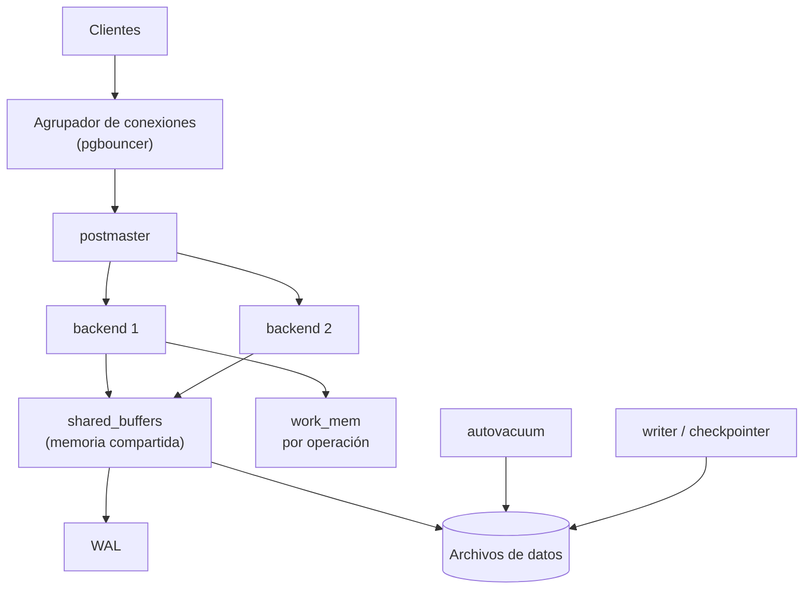

## Propósito

Conocer PostgreSQL lo suficiente para usarlo bien y para saber qué de él **no** es transferible a otros motores. Es el motor de referencia del programa por su cobertura de la norma y su documentación.

## Resultados de aprendizaje

Al terminar podrás:

1. Describir el modelo de proceso de PostgreSQL y su consecuencia sobre las conexiones.
2. Explicar por qué existe `VACUUM` y qué ocurre si no se ejecuta.
3. Elegir entre `json` y `jsonb` con criterio.
4. Usar extensiones sin convertir el esquema en algo irreproducible.
5. Dimensionar la memoria compartida frente a la de sesión.

## Fundamentos

### Un proceso por conexión

PostgreSQL arranca un proceso del sistema operativo por cada conexión. Ventaja: aislamiento fuerte, un fallo no derriba el servidor. Costo: cada conexión reserva memoria propia y su creación no es barata.

De ahí la regla operativa más importante del motor: **usar siempre un agrupador de conexiones**. Sin él, 1 000 clientes web abren 1 000 procesos, y el servidor pasa más tiempo cambiando de contexto que trabajando.

| Parámetro | Ámbito | Nota |
|---|---|---|
| `shared_buffers` | Compartido | Caché de páginas. Típicamente 25 % de la RAM |
| `work_mem` | **Por operación**, no por conexión | Un plan con 3 ordenamientos puede usar 3 × `work_mem` |
| `maintenance_work_mem` | Por operación de mantenimiento | Afecta a `VACUUM` y a la creación de índices |
| `effective_cache_size` | Estimación para el planificador | No reserva memoria: informa al optimizador |

El error de configuración más caro es tratar `work_mem` como si fuese por conexión. Con 200 conexiones y planes que usan tres ordenamientos, el consumo real es 600 × `work_mem`.

### MVCC y `VACUUM`

PostgreSQL implementa control de concurrencia multiversión (clase 035): un `UPDATE` **no** modifica la fila, escribe una versión nueva y marca la anterior como muerta. Un `DELETE` solo marca.

Consecuencias que hay que aceptar:

- Las filas muertas ocupan espacio hasta que `VACUUM` las recupera.
- Una tabla con muchas actualizaciones **se hincha** si el autovacuum no va al ritmo.
- Los identificadores de transacción son finitos; sin vacuum, el motor llega a un punto en que se detiene para protegerse.

```sql
SELECT relname, n_live_tup, n_dead_tup,
       round(100.0 * n_dead_tup / NULLIF(n_live_tup + n_dead_tup, 0), 1) AS pct_muertas
FROM pg_stat_user_tables
ORDER BY n_dead_tup DESC LIMIT 10;
```

Rogov documenta el mecanismo completo. Lo relevante aquí: `VACUUM` no es «limpieza opcional», es parte del funcionamiento normal, y su ausencia se manifiesta como degradación progresiva.

### Tipos que evitan tablas

PostgreSQL ofrece tipos que resuelven modelados que en otros motores exigen tablas adicionales:

| Tipo | Reemplaza a | Cuidado |
|---|---|---|
| `jsonb` | Tabla de atributos dinámicos | Sin restricciones dentro; se indexa con GIN |
| `tstzrange` | Par de columnas desde/hasta | Habilita `EXCLUDE` contra solapamientos |
| `text[]` | Tabla puente para etiquetas | Rompe la 1FN; sin integridad referencial |
| `inet`, `cidr` | Texto con validación manual | Valida y permite operadores de red |
| `uuid` | `CHAR(36)` | 16 bytes en vez de 36 |
| `numeric` | Decimal exacto | Más lento que `bigint` |

**`json` frente a `jsonb`:** `json` guarda el texto tal cual (conserva orden de claves y espacios, no se indexa bien); `jsonb` guarda una representación binaria descompuesta (más rápida de consultar, indexable con GIN, no conserva el orden de claves ni los duplicados). Para casi todo uso, `jsonb`.

La advertencia importante: `jsonb` **no** es una excusa para no modelar. Dentro de un `jsonb` no hay tipos, ni `NOT NULL`, ni claves foráneas. Es adecuado para datos genuinamente heterogéneos —una carga útil de un proveedor externo, atributos que varían por categoría—, no para las columnas del dominio.

### Extensiones

```sql
CREATE EXTENSION IF NOT EXISTS pg_stat_statements;
CREATE EXTENSION IF NOT EXISTS pg_trgm;
CREATE EXTENSION IF NOT EXISTS vector;      -- pgvector, parte 12
```

| Extensión | Para qué |
|---|---|
| `pg_stat_statements` | Consultas más costosas acumuladas: la primera que instalar |
| `pg_trgm` | Búsqueda por similitud y `LIKE '%x%'` indexado |
| `postgis` | Datos geográficos |
| `pgvector` | Búsqueda vectorial dentro del mismo motor (clase 059) |
| `citext` | Texto insensible a mayúsculas sin depender de la colación |

Regla de reproducibilidad: cada `CREATE EXTENSION` debe estar en una migración versionada. Una extensión instalada a mano en producción convierte el esquema en algo que nadie puede recrear.



## Ejemplo trabajado

Modelamos atributos que varían por tipo de curso: los presenciales tienen sala y aforo; los remotos, plataforma y enlace.

**Opción A — columnas para todo:** seis columnas nulas la mitad del tiempo, sin forma de exigir que las de presencial estén presentes justo cuando el curso es presencial.

**Opción B — `jsonb` con validación explícita:**

```sql
CREATE TABLE courses (
  id        INTEGER PRIMARY KEY,
  nombre    TEXT NOT NULL,
  modalidad TEXT NOT NULL CHECK (modalidad IN ('presencial','remoto')),
  detalles  JSONB NOT NULL DEFAULT '{}'::jsonb,
  CONSTRAINT detalles_coherentes CHECK (
    (modalidad = 'presencial' AND detalles ? 'sala'       AND detalles ? 'aforo') OR
    (modalidad = 'remoto'     AND detalles ? 'plataforma' AND detalles ? 'enlace')
  )
);

CREATE INDEX courses_detalles_gin ON courses USING gin (detalles);
CREATE INDEX courses_sala ON courses ((detalles->>'sala')) WHERE modalidad = 'presencial';
```

Lo que aporta cada pieza:

- El `CHECK` con el operador `?` («la clave existe») recupera parte de la integridad que `jsonb` no da por sí solo.
- El índice GIN permite `WHERE detalles @> '{"sala":"B-201"}'` sin barrido.
- El índice de expresión **parcial** sirve la consulta más frecuente con una fracción del tamaño: solo indexa las filas presenciales.

**Medición del índice parcial** con 100 000 cursos, 30 % presenciales:

```text
Índice completo sobre (detalles->>'sala')  ~ 100 000 entradas
Índice parcial WHERE modalidad='presencial' ~ 30 000 entradas
```

Menos entradas significa menos páginas, más aciertos de caché y mantenimiento más barato en cada escritura de un curso remoto (que ya no toca ese índice).

**Opción C — tablas por subtipo:** dos tablas hijas con clave foránea al curso. Integridad total, sin `jsonb`, a cambio de una reunión y de DDL para cada modalidad nueva.

La elección honesta: si las modalidades son dos y estables, C. Si el proveedor añade campos cada mes, B.

## Comparación

| Necesidad | PostgreSQL | Equivalente portable |
|---|---|---|
| Atributos dinámicos | `jsonb` + GIN | Tabla clave-valor |
| Unicidad condicional | Índice único parcial | Columna generada con nulos |
| Sin solapamiento de rangos | `EXCLUDE USING gist` | Comprobación en la aplicación |
| Texto insensible a mayúsculas | `citext` o `lower()` indexado | Normalizar al escribir |
| Consultas más caras | `pg_stat_statements` | Registro de consultas lentas |

## Errores frecuentes

1. **Conexiones directas sin agrupador.** Es la causa más común de caída bajo carga.
2. **`work_mem` alto con muchas conexiones.** Multiplica por operación, no por sesión.
3. **Desactivar el autovacuum «porque consume».** Consume más lo que ocurre después.
4. **`jsonb` para el dominio.** Se pierden tipos, restricciones y claves foráneas.
5. **Extensiones instaladas a mano.** El entorno deja de ser reproducible.
6. **Índices sin usar.** Cada uno se mantiene en cada escritura; revísalos con `pg_stat_user_indexes`.

## De la clase a la operación

Los incidentes típicos de PostgreSQL son tres: agotamiento de conexiones, hinchazón por vacuum insuficiente y un plan que cambia tras una carga masiva sin `ANALYZE`. Los tres se previenen con configuración, no con hardware.

## Reto de transferencia

1. Levanta el perfil relacional del `docker-compose` y consulta `pg_stat_user_tables`.
2. Provoca hinchazón con actualizaciones repetidas y mide `n_dead_tup` antes y después de `VACUUM`.
3. Modela un atributo dinámico de tu dominio con `jsonb` y añade el `CHECK` que recupera la integridad.
4. Crea el índice parcial equivalente y compara tamaño y plan con el índice completo.

## Preguntas de evaluación

1. ¿Por qué `work_mem` puede consumirse varias veces en una sola consulta?
2. Explica qué ocurre en una tabla con muchas actualizaciones si el autovacuum no llega a tiempo.
3. Da un caso de tu dominio donde `jsonb` sea correcto y otro donde sea una excusa para no modelar.
4. ¿Qué pierdes al migrar de PostgreSQL a un motor sin índices parciales, y cómo lo compensas?
