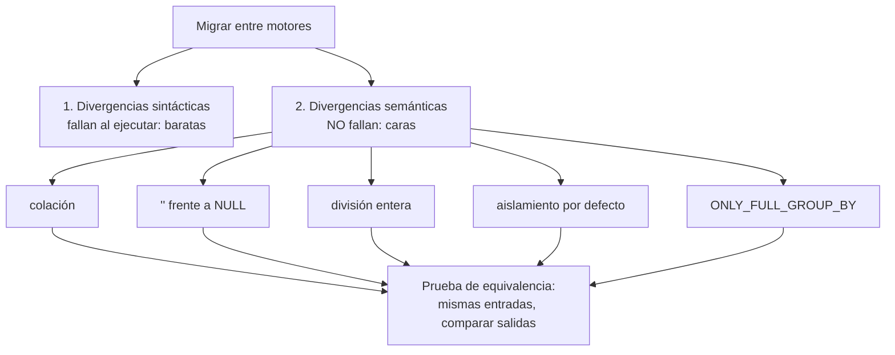

# 022 — MySQL, MariaDB, SQL Server y Oracle: divergencias que rompen código

> [Programa](../../../README.md) · [Parte 04](../README.md) · [← Anterior](../../part-04-motores-relacionales-y-dialectos/021-postgresql-tipos-extensiones-y-procesos/README.md) · [Siguiente →](../../part-04-motores-relacionales-y-dialectos/023-sqlite-y-duckdb-motores-embebidos/README.md)

Parte 04 — Motores relacionales y dialectos · Intermedio ·
3 horas estimadas · motores `mysql`, `mariadb`, `sql-server`, `oracle-database` · laboratorio
[`labs/03-transactions`](../../../labs/03-transactions/README.md) · 4 fuentes.

**Conceptos centrales:** `colación` · `modo estricto` · `cadena vacia frente a nulo` · `identificador citado`

---

## Propósito

Conocer las divergencias concretas de MySQL/MariaDB, SQL Server y Oracle que rompen código escrito para otro motor — especialmente las que no producen ningún error.

## Resultados de aprendizaje

Al terminar podrás:

1. Anticipar el comportamiento de MySQL en modo estricto y fuera de él.
2. Explicar el tratamiento de la cadena vacía en Oracle y su efecto.
3. Comparar los niveles de aislamiento por defecto de los cuatro motores.
4. Identificar las diferencias de identificadores, citas y sensibilidad a mayúsculas.
5. Construir una prueba que detecte divergencias semánticas antes de migrar.

## Fundamentos

### MySQL / MariaDB

**Modo estricto.** Históricamente MySQL truncaba y convertía en silencio en vez de fallar. Con `sql_mode` estricto (por defecto desde 5.7) rechaza; con él desactivado, sigue aceptando:

```sql
INSERT INTO t (n) VALUES (300);     -- columna TINYINT
-- estricto: error 1264 out of range
-- no estricto: guarda 127 y emite un aviso
```

Un aviso no detiene un despliegue. Comprobar `SELECT @@sql_mode` es el primer paso al recibir una base MySQL heredada.

**`ONLY_FULL_GROUP_BY`.** Sin este modo, MySQL permite columnas en `SELECT` que no están en `GROUP BY` y devuelve **un valor arbitrario** del grupo. El resultado es plausible y erróneo. Está activo por defecto desde 5.7, pero muchas bases heredadas lo desactivan «porque rompía consultas» — consultas que ya estaban mal.

**Colación.** Por defecto insensible a mayúsculas y acentos (`utf8mb4_0900_ai_ci`), a diferencia de PostgreSQL. Es la divergencia semántica de la clase 020.

**Motores de almacenamiento.** InnoDB es transaccional; MyISAM no lo es. Una tabla MyISAM ignora las transacciones sin avisar: el `ROLLBACK` no revierte nada.

**Aislamiento por defecto:** `REPEATABLE READ`, distinto de casi todos los demás.

### SQL Server

**Aislamiento por defecto: `READ COMMITTED` con bloqueo**, no con versiones. Los lectores bloquean a los escritores y viceversa, salvo que se active `READ_COMMITTED_SNAPSHOT`. Es la causa de bloqueos que no aparecen en PostgreSQL ni en Oracle.

**Identificadores** entre corchetes `[tabla]` además de comillas dobles. **Colación** definida en la instalación, la base y hasta la columna; lo habitual es insensible a mayúsculas.

**`TOP` y `OFFSET ... FETCH`:** `TOP` es propietario; `OFFSET/FETCH` es la norma y exige `ORDER BY`.

**Concatenación con nulos:** por defecto `'a' + NULL` es `NULL`, igual que en la norma, pero el ajuste `CONCAT_NULL_YIELDS_NULL` podía cambiarlo en versiones antiguas.

### Oracle

**La cadena vacía es `NULL`.** Es la divergencia más severa de todo el ecosistema:

```sql
INSERT INTO t (s) VALUES ('');
SELECT * FROM t WHERE s IS NULL;   -- devuelve la fila
SELECT * FROM t WHERE s = '';      -- no devuelve nada
```

Código que distingue «vacío» de «desconocido» —lo cual es una distinción legítima del dominio— no se puede portar a Oracle sin reescribir el modelo.

**Identificadores en mayúsculas** salvo que se citen: `create table Alumno` crea `ALUMNO`, y `"Alumno"` es una tabla distinta.

**Consistencia de lectura multiversión** desde siempre, con la particularidad histórica del error «snapshot too old» cuando el segmento de deshacer se recicla durante una consulta larga.

**`DUAL`:** las consultas sin tabla requieren `SELECT 1 FROM dual`.

### Tabla comparativa

| Aspecto | PostgreSQL | MySQL 8 (InnoDB) | SQL Server | Oracle | SQLite |
|---|---|---|---|---|---|
| Aislamiento por defecto | `READ COMMITTED` (MVCC) | `REPEATABLE READ` | `READ COMMITTED` (bloqueo) | `READ COMMITTED` (MVCC) | `SERIALIZABLE` de hecho |
| `''` es `NULL` | No | No | No | **Sí** | No |
| Colación por defecto | Sensible | **Insensible** | Suele ser insensible | Sensible | `BINARY` |
| Identificadores sin citar | minúsculas | según el sistema de archivos | insensible | **MAYÚSCULAS** | insensible |
| Límite de filas | `LIMIT` | `LIMIT` | `TOP` / `FETCH` | `FETCH FIRST` | `LIMIT` |
| DDL transaccional | Sí | **No** | Sí | No | Sí |
| Autoincremento | `GENERATED ... IDENTITY` | `AUTO_INCREMENT` | `IDENTITY` | secuencia / `IDENTITY` | `AUTOINCREMENT` |
| `7/2` | `3` | `3.5` | `3` | `3.5` | `3` |
| Índice parcial | Sí | No | Filtrado, sí | No (índice por función) | Sí |
| `CHECK` aplicado | Sí | Desde 8.0.16 | Sí | Sí | Sí |



## Ejemplo trabajado

Prueba de equivalencia que detecta divergencias **antes** de migrar. La idea es ejecutar el mismo conjunto de sentencias en dos motores y comparar las salidas exactas.

```sql
-- casos.sql : cada uno pensado para exponer una divergencia conocida
SELECT '01-division'        AS caso, CAST(7/2 AS CHAR(10))                        AS valor;
SELECT '02-colacion'        AS caso, CAST((SELECT COUNT(*) FROM students
                                           WHERE email='ANA@EJEMPLO.CL') AS CHAR(10));
SELECT '03-cadena-vacia'    AS caso, CASE WHEN '' IS NULL THEN 'es-null'
                                          ELSE 'no-es-null' END;
SELECT '04-concat'          AS caso, CAST(('a' || 'b') AS CHAR(10));
SELECT '05-orden-nulos'     AS caso, CAST((SELECT nota FROM enrollments
                                           ORDER BY nota LIMIT 1) AS CHAR(10));
SELECT '06-redondeo'        AS caso, CAST(ROUND(2.5) AS CHAR(10));
```

Salidas observadas:

| Caso | PostgreSQL | MySQL 8 | SQLite | Oracle |
|---|---|---|---|---|
| 01 división | `3` | `3.5` | `3` | `3.5` |
| 02 colación | `0` | `1` | `0` | `0` |
| 03 cadena vacía | `no-es-null` | `no-es-null` | `no-es-null` | `es-null` |
| 04 concatenación | `ab` | `0` | `ab` | `ab` |
| 05 orden de nulos | `NULL` primero | `NULL` primero | `NULL` primero | `NULL` **último** |
| 06 redondeo de 2,5 | `2` (al par) | `3` | `3` | `3` |

Seis líneas de SQL revelan seis formas distintas de obtener resultados incorrectos en silencio. El caso 06 es especialmente traicionero: PostgreSQL aplica redondeo bancario (al par más cercano) para `numeric`, y eso produce descuadres de céntimos frente a un sistema que redondea siempre hacia arriba.

**Orden de los nulos:** la norma deja la decisión al motor. La forma portable de fijarlo es escribirlo:

```sql
ORDER BY nota ASC NULLS LAST      -- PostgreSQL, Oracle, SQLite 3.30+
ORDER BY (nota IS NULL), nota     -- portable a MySQL y SQL Server
```

**Interpretación:** la migración no consiste en traducir sintaxis. Consiste en enumerar las divergencias semánticas que afectan a tu dominio y escribir una prueba por cada una. Esa prueba se ejecuta en CI contra los dos motores y es lo único que convierte «debería funcionar» en «funciona».

## Comparación

| Migración | Dificultad dominante |
|---|---|
| MySQL → PostgreSQL | Colación, `ONLY_FULL_GROUP_BY`, tipos laxos, división |
| PostgreSQL → MySQL | Índices parciales, `jsonb`, tipos avanzados, DDL transaccional |
| Oracle → PostgreSQL | Cadena vacía, `DUAL`, PL/SQL, identificadores en mayúsculas |
| SQL Server → PostgreSQL | Aislamiento por bloqueo, `TOP`, T-SQL |
| Cualquiera → SQLite | Concurrencia de escritura, tipado dinámico |

## Errores frecuentes

1. **Migrar comparando solo la sintaxis.** Las divergencias caras no dan error.
2. **Desactivar `ONLY_FULL_GROUP_BY` para que «funcione».** Devuelve valores arbitrarios.
3. **Suponer que `''` y `NULL` son distintos en Oracle.**
4. **No fijar `NULLS FIRST/LAST`.** Los informes ordenan distinto según el motor.
5. **Ignorar el motor de almacenamiento en MySQL heredado.** MyISAM no es transaccional.
6. **Probar la migración solo con datos limpios.** Las divergencias aparecen con nulos, vacíos y acentos.

## De la clase a la operación

Una migración de motor sin pruebas de equivalencia se descubre incompleta durante meses, en forma de incidencias sueltas que nadie relaciona entre sí. El conjunto de casos de esta clase es barato de escribir y es lo que convierte la migración en un proyecto con final.

## Reto de transferencia

1. Amplía el archivo de casos con cinco divergencias que afecten a tu dominio.
2. Ejecútalo en dos motores del `docker-compose` y guarda ambas salidas.
3. Escribe un comparador que falle si difieren y añádelo a la integración continua.
4. Documenta, por cada divergencia, la corrección adoptada.

## Preguntas de evaluación

1. ¿Por qué `ONLY_FULL_GROUP_BY` desactivado produce informes erróneos y no errores?
2. Explica qué código de tu dominio se rompería al migrar a Oracle por el tratamiento de la cadena vacía.
3. ¿Qué implica que SQL Server use bloqueo en `READ COMMITTED` para una consulta de informe larga?
4. Escribe un `ORDER BY` con posición de nulos fijada que funcione en los cinco motores de la tabla.

---

## Laboratorio

```bash
python scripts/validate_repository.py
python labs/03-transactions/run_transactions_lab.py
```

Guarda como evidencia la salida completa, la versión del motor y la semilla o
los parámetros usados. Una captura sin comando no es evidencia: no se puede
repetir.

## Evaluación

| Criterio | Peso | Qué se comprueba |
|---|---:|---|
| Comprensión conceptual | 25 % | Explica el mecanismo, no solo el resultado |
| Ejecución reproducible | 25 % | Otra persona obtiene lo mismo con las instrucciones dadas |
| Interpretación basada en evidencia | 25 % | Cada conclusión se apoya en una salida o una medición |
| Límites y riesgos declarados | 25 % | Dice qué no demuestra el ejercicio y qué faltaría en producción |

La clase se da por superada cuando la respuesta explica el mecanismo, muestra
la salida que la respalda y declara al menos un límite del ejercicio.

## Fuentes de esta clase

Todo lo afirmado arriba procede de estas obras. Los identificadores viven en
[`catalog/sources.json`](../../../catalog/sources.json) y el estado de los
enlaces se comprueba con `python scripts/check_external_links.py`.

- **Oracle** (2026). [MySQL Reference Manual](https://dev.mysql.com/doc/).  
  Dialecto y comportamiento del motor InnoDB.
- **MariaDB Foundation** (2026). [MariaDB Documentation](https://mariadb.com/docs/).  
  Divergencias respecto de MySQL relevantes para la portabilidad.
- **Microsoft** (2026). [SQL Server Documentation](https://learn.microsoft.com/sql/sql-server/).  
  T-SQL, niveles de aislamiento y almacen de consultas.
- **Oracle** (2026). [Oracle Database Documentation](https://docs.oracle.com/en/database/).  
  PL/SQL y modelo de consistencia de lectura de Oracle.

---

> [Programa](../../../README.md) · [Parte 04](../README.md) · [← Anterior](../../part-04-motores-relacionales-y-dialectos/021-postgresql-tipos-extensiones-y-procesos/README.md) · [Siguiente →](../../part-04-motores-relacionales-y-dialectos/023-sqlite-y-duckdb-motores-embebidos/README.md)
